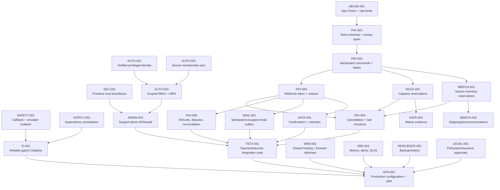

# MPRC Secure Commerce Implementation Plan

**Status:** Approved technical sequence and assessment snapshot; GitHub issues are the live execution/status source
**Last reviewed:** 2026-07-12
**Live status:** [Secure Commerce & Platform Hardening milestone](https://github.com/Run-MPRC/Run-MPRC.github.io/milestone/2)
**Design catalog:** [GITHUB_ISSUES.md](./GITHUB_ISSUES.md)

This plan turns the target architecture into a dependency-ordered delivery program. It is deliberately staged: payment correctness and trust boundaries come before features, and a controlled pilot comes before a broad launch.

## 1. Program outcome

MPRC can open a race or merchandise item for sale only when the platform can:

- Prove one client request creates at most one active Checkout Session and business record.
- Prevent participant capacity and SKU stock from going below zero under concurrency.
- Mark payment successful only from verified Stripe state with matching amount, currency, environment, and business reference.
- Tolerate duplicate, delayed, and out-of-order Stripe events.
- Cancel/expire unpaid Sessions, issue idempotent refunds, handle disputes, and reconcile both systems.
- Enforce verified identity, scoped admin capabilities, App Check, narrow Firestore rules, and least-privilege cloud access.
- Protect/minimize PII, waiver evidence, exports, email, monitoring, and OAuth secrets.
- Pass automated security/correctness tests and a documented staging dress rehearsal.
- Operate under approved legal, tax, insurance, privacy, refund, and fulfillment policies.

## 2. Delivery rules

1. One issue is the unit of work. Avoid combining unrelated refactors with a security/payment issue.
2. Every issue begins from a passing or explicitly documented baseline and adds tests for its risk.
3. Schema changes are additive first. Backfills are idempotent, dry-runnable, and report counts/anomalies.
4. Backend/rules/indexes deploy before dependent clients. Legacy reads remain until migration evidence is complete.
5. No issue requires production secrets for development or CI.
6. Live-mode enabling is a separate protected operation. #135 supplies a manual, exact-commit, backend-first source gate and pauses Git-triggered Netlify production builds. Protected environment/OIDC configuration, staged/live proof, fail-closed lint, required checks, and a protected live-Netlify path remain open under #105/#133/#136/WEB-001.
7. A provider Console setting is not complete until its non-secret configuration and verification evidence are recorded privately.
8. Security controls fail closed in hosted environments and remain developer-friendly only in explicit local/CI environments.
9. Do not trade payment integrity for UI responsiveness. Confirmation may say “processing”; it must not guess “paid.”
10. Legal/tax/insurance questions are escalated to qualified owners, not decided by an implementation agent.

## 3. Dependency map

Parallel work is safe only across branches that do not share schemas or security boundaries. For example, legal policy decisions, hosting evaluation, dependency inventory, and initial observability design can proceed while payment state work is underway. Webhook, state, refund, capacity, and inventory changes require close sequencing.

## 4. Phases and exit gates

### Phase 0 — Stop accidental harm and establish a trustworthy baseline

**Issues:** SAFETY-001, CONFIG-001, SUPPLY-001, first part of CI-001, LEGAL-001 discovery
**Purpose:** Ensure local work cannot touch production, external callbacks survive routing, known vulnerable dependency chains are reduced, and tests mean what they say.

Exit gate:

- Local Auth, Firestore, and Functions all use emulators with a regression test.
- GitHub Pages callbacks preserve path/query/hash or the hosting migration has replaced the workaround.
- Frontend test harness, Functions tests, and Rules tests pass in CI; lint failure is not ignored.
- Unused vulnerable dependency chains are removed and direct safe patches applied.
- Live checkout remains disabled and placeholder policies are visible as a launch blocker.

**Current source boundary:** issue [#99](https://github.com/Run-MPRC/Run-MPRC.github.io/issues/99) provides the isolated callback and local Firebase safety slice: a same-origin path/query/fragment bridge, a fully synthetic local Firebase namespace, loopback Auth/Firestore/Functions routing, fail-closed setup, and local monitoring shutdown. Its exact issue/PR record remains the status source. This does not create staging, isolate provider calls made by Functions, prove a production callback, or repair a member profile.

### Phase 1 — Establish trust boundaries

**Issues:** SEC-001, AUTH-001, AUTH-002, AUTH-003, OAUTH-001, ABUSE-001, PAY-001
**Purpose:** No browser/admin claim can bypass secret/financial boundaries; identities and inputs have reliable meaning.

Exit gate:

- Browser admins cannot read OAuth secrets, send arbitrary mail, alter rate limits/audit events, or directly mutate financial state.
- Member/admin grants require verified email and authoritative club membership.
- Legacy shared-key member sync is removed/replaced.
- Privileged actions use scoped claims, MFA/recent authentication policy, and durable audit.
- Sensitive callables enforce App Check at the Firebase runtime.
- All public/admin request shapes are strict, bounded, server-validated, and covered by hostile-input tests.

### Phase 2 — Build the payment integrity core

**Issues:** PROMO-001, PAY-002, PAY-003, RACE-001, MERCH-001
**Purpose:** Make Checkout, state transitions, webhooks, capacity, and inventory retry-safe and concurrency-safe.

Exit gate:

- Stable request/command IDs and Stripe idempotency keys prevent duplicate Sessions/refunds/products.
- Payment state is separate from registration/fulfillment state or an explicit compatible migration is in place.
- Stripe event inbox deduplicates Event IDs and business transitions tolerate distinct duplicate/out-of-order Events.
- Unpaid `completed` Sessions are not fulfilled; async success/failure works.
- Amount, currency, environment, metadata, business reference, and allowed predecessor state are verified.
- Concurrent last-seat and last-SKU tests prove no oversell.
- Session creation is persistence-first, and known failures release holds once.

**Current work:** A PAY-003 webhook safety slice is implemented and unit-verified in this repository pass after the high-level design was recorded. It must not be treated as the complete payment core until PAY-001/PAY-002, capacity, inventory, provider/emulator integration, and production operations close.

### Phase 3 — Complete lifecycle and customer safety

**Issues:** PAY-004, PAY-005, MAIL-001, DATA-001, DATA-002, MERCH-002
**Purpose:** Safely handle cancellation, late registration, refunds, disputes, communications, privacy, waivers, shipping, and tax.

Exit gate:

- Cancelling an unpaid record expires its Stripe Session and releases its hold exactly once.
- Reusable late Payment Links are removed or safely constrained; one registration cannot be charged repeatedly.
- Refunds use idempotent commands and verified cumulative totals; disputes alert finance for both domains.
- Daily reconciliation detects missing/mismatched Stripe/local state and safe repair is audited.
- Email is escaped, outbox-idempotent, delivery-aware, and has SPF/DKIM/DMARC operations.
- Confirmation capabilities are short-lived/hash-stored or identity-owned and scrubbed from browser history.
- Waiver evidence is immutable/versioned and never fabricated by admin creation.
- Shipping, return, tax, and customer communication policies are approved and implemented.

### Phase 4 — Administrative, privacy, and platform hardening

**Issues:** ADMIN-001, WEB-001, remaining SUPPLY-001/CI-001, OBS-001, RESILIENCE-001
**Purpose:** Make routine operation least-privilege, observable, recoverable, and safe in the browser and supply chain.

Exit gate:

- Admin APIs return role-appropriate projections and append durable audit events.
- Exports are purpose-specific, minimal, re-authenticated, bounded, and audited.
- Commerce site has controlled SPA rewrites and CSP/HSTS/frame/referrer/permissions headers.
- Stored arbitrary HTML is removed or sanitized under strict policy.
- No unexplained critical/high production dependency findings.
- Production deployment uses protected environments and short-lived least-privilege cloud credentials.
- Payment SLOs, structured redacted logs, and actionable alerts are live.
- Backup restoration into isolated infrastructure succeeds and is documented.

### Phase 5 — End-to-end qualification

**Issue:** TEST-001 plus final closure evidence from all prior phases
**Purpose:** Prove the whole system, not only isolated functions.

Exit gate:

- Full staging matrix in `STRIPE_COMMERCE_DESIGN.md` passes.
- Deliberately missed, duplicated, delayed, and out-of-order events reconcile correctly.
- No PII/secrets appear in logs, monitoring, fixtures, URLs, or exports beyond approved projections.
- Firestore Rules emulator tests prove every deny boundary.
- Security/dependency/build/test reports attach to the release commit.
- A rollback/roll-forward and checkout-disable drill succeeds.

### Phase 6 — Controlled production pilot

**Issues:** OPS-001 and approved LEGAL-001
**Purpose:** Configure external systems and introduce live risk gradually.

Exit gate:

- Two-person review of Stripe/Firebase/GitHub/DNS/email/Sentry ownership, MFA, roles, secrets, environment, and alerts.
- Approved terms, privacy, waiver, refund, tax, shipping, retention, and support policies are published and versioned.
- One authorized low-value live transaction is paid, fulfilled/confirmed, reconciled, and—if planned—refunded.
- Finance confirms Stripe Dashboard, local records, receipt, fee/refund, and payout reporting.
- Pilot observation window has zero unexplained mismatches before broad opening.

## 5. Workstream details

### Identity and access

The current three-role model is retained only as a compatibility layer. First remove the global admin rule and require verified email. Then introduce capabilities (`event_manager`, `finance_admin`, `shop_manager`, `identity_admin`, `platform_admin`) through server-managed claims. Keep claims limited to access control. Every grant/demotion has actor, target, reason, timestamp, old/new capability set, and token revocation/refresh behavior.

### Commerce core

Define a shared domain library before implementing independent race and shop code. It owns money validation, identifiers, state transitions, audit event shape, Stripe metadata schema, and idempotency-key construction. Checkout services then compose domain-specific reservation adapters. The webhook reduces verified Stripe state into the same state machine; it does not implement a second conflicting set of transitions.

### Data and privacy

Separate operational high-risk fields from long-lived accounting/waiver evidence. Store only required fields, project narrow views to admins, and define field-specific minimization. Implement retention jobs in report-only mode first, review sample effects, then enable deletion/anonymization with audit.

### Operations and reliability

Use structured correlation across checkout request, business record, Stripe Session/PaymentIntent/Event, refund command, email outbox, and reconciliation report. Dashboards show rates and categories rather than PII. Alerts include a runbook and owner.

## 6. First implementation tranche

The first tranche deliberately combines one urgent safety repair with the most complex payment foundation:

1. **SAFETY-001 — callback and emulator isolation:** #99 supplies the source/test boundary for same-origin callback preservation and loopback Auth/Firestore/Functions development. Provider calls, optimized previews, staging, and live callbacks remain separately gated.
2. **PAY-003 — webhook event inbox and safe reducer:** PAY-003A [#101](https://github.com/Run-MPRC/Run-MPRC.github.io/issues/101) source merged through [PR #140](https://github.com/Run-MPRC/Run-MPRC.github.io/pull/140) as `87bd1210575882cdd06214bcb98ed38ce00f71c2`, adding event replay protection, async-aware payment confirmation, expected total/currency validation, direct metadata lookup, terminal-state guards, and lifecycle tests. Firebase and Stripe live behavior remain unproven; PAY-003B/C remain open.
3. **SEC-001 — Firestore trust boundaries:** #100 merged through [PR #123](https://github.com/Run-MPRC/Run-MPRC.github.io/pull/123) at `a7fc301e85b0aeabe396e771faea21d3fc8e7b2b`. Source and 295 Rules tests remove recursive browser-admin authority. Firebase deployment explicitly skipped, so deployed/live Rules remain unproven under #105.
4. **PROMO-001 — fail-safe monetary policy:** [#102](https://github.com/Run-MPRC/Run-MPRC.github.io/issues/102) disables promotion entry and automatic tax in both current creators, adds exact payload tests, and quarantines unknown or nonzero discount/tax/shipping adjustments on success, failure, and expiry. The private pre-change Session/provider inventory, protected deployment, provider readback, and live verification remain owner actions; no discount, tax, or shipping feature is authorized.
5. **Identity/config next:** AUTH-001A [#98](https://github.com/Run-MPRC/Run-MPRC.github.io/issues/98) merged at `ce22c110`, proving source/tests for unverified-target rejection at the existing role-grant endpoints. Its Firebase deployment skipped, so backend-live status is unproven and the remaining AUTH-001 parent work stays open. Continue CONFIG-001 and the uncompleted AUTH-001 guards/Rules/refresh/audit scope without duplicating #98.
6. **Then:** PAY-001/PAY-002 so checkout creation, refunds, and every later handler share strict schemas and idempotent state.
7. **Then:** RACE-001 and MERCH-001 transactional reservations.

Why this order: SAFETY-001 removes immediate accidental-production and callback hazards without schema impact. PAY-003 closes the most dangerous “unpaid looks paid” and replay gaps while establishing test fixtures. The subsequent trust-boundary and command/state work completes the surrounding architecture; no live launch is authorized by the partial webhook patch alone.

## 7. Issue readiness requirements

An issue is ready for Claude Sonnet, Terra/Luna, or another implementation agent when it contains:

- One concrete outcome and why it matters.
- Exact dependencies and known affected files/surfaces.
- Current behavior with evidence.
- In-scope and explicitly out-of-scope work.
- Data migration/backward compatibility expectations.
- Acceptance criteria phrased as observable results.
- Required positive, negative, retry, concurrency, and authorization tests.
- Commands/fixtures/environment that do not require production access.
- Security/privacy/logging constraints.
- Documentation and operational handoff updates.
- Size small enough for one focused pull request; otherwise split first.

Small/medium issue templates in [GITHUB_ISSUES.md](./GITHUB_ISSUES.md) and the one-agent children in [GITHUB_ISSUE_SLICES.md](./GITHUB_ISSUE_SLICES.md) meet this standard. Large parents are trackers and must not be assigned wholesale.

## 8. Definition of done

Every issue is done only when:

- Implementation and data changes match the acceptance criteria.
- New logic has positive and negative tests; security/payment logic includes retry/idempotency tests.
- Existing relevant tests, lint, Rules tests, and production build pass.
- No test reaches production or uses real PII/secrets.
- Logs/errors are reviewed for PII/secret leakage.
- Rules/IAM/provider configuration is verified in the intended non-production environment.
- Backward compatibility, rollout, rollback/roll-forward, and migration reports are documented.
- Root design/runbook/backlog status is updated if architecture or operations changed.
- Pull request explains residual risk and follow-up issues.
- For external configuration, a named owner stores private verification evidence.

A passing unit test alone is not sufficient for a payment or authorization issue.

## 9. Agent execution protocol

For future autonomous agents:

1. Read `AGENTS.md`, this plan, the linked issue, and only the relevant design/runbook sections.
2. Inspect current code and tests; do not assume this 2026 assessment is still current.
3. Confirm the worktree and preserve unrelated/user changes.
4. State the intended invariant and failure cases before editing.
5. Implement the smallest compatible slice; avoid unrelated formatting/dependency churn.
6. Use Firebase emulators and Stripe test fixtures/CLI only.
7. Add tests that fail before and pass after the change.
8. Run focused checks, then the broader required suite.
9. Review the diff for direct Firestore financial writes, missing App Check/Auth, client price trust, PII logs, secret values, non-idempotent external calls, and impossible state transitions.
10. Report exact evidence, remaining risks, and which issue should run next.

Agents must stop and request an owner decision for legal text, tax, insurance/waiver policy, live credentials, destructive production migration, account/DNS ownership, and any choice that changes customer money or data policy beyond the issue.

## 10. Estimation and parallelism

Sizes in the backlog are relative:

- **S:** narrow code/config change with focused tests, usually one subsystem.
- **M:** multiple files with a small schema/API change or emulator integration.
- **L:** cross-boundary state/data migration with failure recovery and integration tests; split if acceptance cannot fit one focused PR.

Suggested parallel lanes after Phase 0:

- Lane A: Firestore rules, identity, admin RBAC.
- Lane B: payment state, webhook, checkout idempotency.
- Lane C: CI/dependencies/hosting/observability.
- Lane D: legal/tax/insurance/privacy decisions and operational ownership.

Race capacity and merchandise inventory can proceed in parallel only after the shared payment/idempotency model is stable. Refund/dispute/reconciliation should follow webhook state work, not compete with it.

## 11. Progress tracking

Canonical assignment, dependencies, claims, and status now belong in GitHub. Use the [live milestone](https://github.com/Run-MPRC/Run-MPRC.github.io/milestone/2) and issue comments/labels. This document and [GITHUB_ISSUES.md](./GITHUB_ISSUES.md) are dated design snapshots and must not be used to duplicate or claim work without checking GitHub first. Status values remain:

- `proposed`
- `ready`
- `in_progress`
- `implemented_locally`
- `partial_implemented_locally`
- `blocked_owner_decision`
- `in_review`
- `done`

Do not mark an issue done because code exists on a branch; require the definition-of-done evidence and deployment/configuration step appropriate to the issue.
