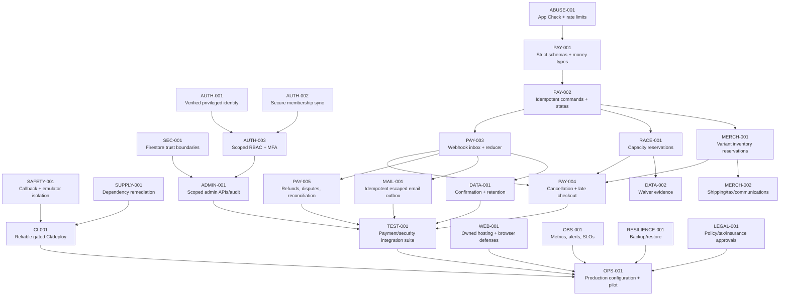

# MPRC Secure Commerce Implementation Plan

**Status:** Approved technical sequence and assessment snapshot; GitHub issues are the live execution/status source
**Last reviewed:** 2026-07-12
**Live status:** [Secure Commerce & Platform Hardening milestone](https://github.com/Run-MPRC/Run-MPRC.github.io/milestone/2)
**Design catalog:** [GITHUB_ISSUES.md](./GITHUB_ISSUES.md)

This plan turns the target architecture into a dependency-ordered delivery program. It is deliberately staged: payment correctness and trust boundaries come before features, and a controlled pilot comes before a broad launch.

## 1. Program outcome

MPRC can open a race or merchandise item for sale only when the platform can:

- Prove one client request creates at most one active Checkout Session and business record.
- Prevent participant capacity and SKU stock from going below zero under concurrency.
- Mark payment successful only from verified Stripe state with matching amount, currency, environment, and business reference.
- Tolerate duplicate, delayed, and out-of-order Stripe events.
- Cancel/expire unpaid Sessions, issue idempotent refunds, handle disputes, and reconcile both systems.
- Enforce verified identity, scoped admin capabilities, App Check, narrow Firestore rules, and least-privilege cloud access.
- Protect/minimize PII, waiver evidence, exports, email, monitoring, and OAuth secrets.
- Pass automated security/correctness tests and a documented staging dress rehearsal.
- Operate under approved legal, tax, insurance, privacy, refund, and fulfillment policies.

## 2. Delivery rules

1. One issue is the unit of work. Avoid combining unrelated refactors with a security/payment issue.
2. Every issue begins from a passing or explicitly documented baseline and adds tests for its risk.
3. Schema changes are additive first. Backfills are idempotent, dry-runnable, and report counts/anomalies.
4. Backend/rules/indexes deploy before dependent clients. Legacy reads remain until migration evidence is complete.
5. No issue requires production secrets for development or CI.
6. Live-mode enabling is a separate protected operation. #135 supplies a manual, exact-commit, backend-first source gate and pauses ordinary Git-triggered Netlify production builds. WEB-UX-001A [#457](https://github.com/Run-MPRC/Run-MPRC.github.io/issues/457) used one temporary web-only exception that required one exact `main` parent and independently verified one pinned source commit/tree. An overbroad WEB-002A attempt was rolled back on 2026-08-01; bounded replacement [#473](https://github.com/Run-MPRC/Run-MPRC.github.io/issues/473) then published only the static Shop and fixed Events/Calendar failure messages as exact deploy `6a6dc9ea588b0c0008036312` from source `39ab8649df411262c8109a3c81a57bc38f1e168b`. Its public marker and page checks passed, and its temporary manifest became inactive again. WEB-002C [#623](https://github.com/Run-MPRC/Run-MPRC.github.io/issues/623) completed one bounded release of the frozen inert member-directory interface on 2026-08-13. Exact merge `9d5cc8612b4321172370bd949d307e7e4ac0ec7d` published Netlify deploy `6a7e072f8f346b0008510d29` from source `c2d87d1f69f15e128a0bc9b1b9f915b7c8417aec`, tree `411aa6ec9a9459f5d923030533ffc7c007fe6908`, 62 files, and digest `d837272a1e5efc1575809e87f532276b38d1a63f1dd79ec1aef0533f6da8afb1`. Signed-out guard, route, marker, and no-directory-request checks passed. Repause merge `c8678c623afdd9becf77d596b71f36f26f04b746` made the manifest inactive; its Netlify attempt stopped unpublished and retained the verified deploy. The release source is absent and rollback ref remains. #623 did not restore event records or authorize Firebase, providers, sign-in, production data, connected directory behavior, commerce, or a reusable release path. Protected environment/OIDC configuration, staged/live proof, fail-closed lint, required checks, and a protected live-Netlify path remain open under #105/#133/#136/WEB-001.
7. A provider Console setting is not complete until its non-secret configuration and verification evidence are recorded privately.
8. Security controls fail closed in hosted environments and remain developer-friendly only in explicit local/CI environments.
9. Do not trade payment integrity for UI responsiveness. Confirmation may say “processing”; it must not guess “paid.”
10. Legal/tax/insurance questions are escalated to qualified owners, not decided by an implementation agent.

**WEB-002D completed release boundary:** [#659](https://github.com/Run-MPRC/Run-MPRC.github.io/issues/659) completed one exact-artifact Netlify exception on 2026-08-14. Exact release merge `46e23647d8e0bf9fa3a574ea5c5f993be10a419d` published deploy `6a7ece87c5ca4d0007c1a3fc` from source `7496fe0881fb52908c4ff2f40f488df09c94c908`, tree `ccac4c189c195db8ab594e0eefe256ea9fa04996`, 62 files, and digest `e4c26e6f0fbcd086663d86238675f0be228fb649a00628c1c97d1166612f49c7`. Signed-out desktop route-focus and phone menu/route-focus checks passed. Repause merge `3138a00c1c48e1d5d1dcda0b44722b09a2194ff7` passed exact-main CI run `31783808994`; attempt `6a7ed0ddb00a46000818878d` remained unpublished and retained the verified deploy. The manifest is inactive, the temporary source/control/repause refs are absent, and rollback ref `codex/netlify-source-659-rollback` remains pinned to #623 source `c2d87d1f69f15e128a0bc9b1b9f915b7c8417aec`. #659 published only the reviewed #291 visible-focus, #490 phone-menu, and #657 route-focus behavior. It deployed no Firebase, Rules, Functions, or indexes; changed no outside-provider configuration, account, sign-in state, production data, payment, or connected directory behavior; and left directory availability literal `false`. Reusable hosting remains open under #460/#133/#136, and #507 still owns every connected-directory gate.

**WEB-001A1 Firebase Hosting source foundation:** [#663](https://github.com/Run-MPRC/Run-MPRC.github.io/issues/663) is the first bounded child of #460. It makes controlled optimized builds environment-explicit, keeps local/test on the demo emulators, requires complete staging-named public Firebase configuration, rejects production identities in staging, scans the executable synthetic CI artifact, changes the unqualified CLI default to `demo-mprc-local`, and adds the inert `build/` Hosting rewrite. It deliberately does not provision staging, configure short-lived authority or branch/environment protection, deploy Hosting/Firebase, automate `production-web`, add release readback/rollback/headers, alter Netlify/Pages, or touch DNS/TLS. Source/tests/merge and a synthetic build are not staging or production evidence.

**WEB-001A2 isolated static staging:** [#665](https://github.com/Run-MPRC/Run-MPRC.github.io/issues/665) creates the club-owned `run-mprc-staging` Firebase project, one web app, and the static [run-mprc-staging.web.app](https://run-mprc-staging.web.app) Hosting site from exact merged source `a614c68d9a1a2be631a3be874a686d61e5d170a0`. The executable artifact scanner found the staging identity and rejected known production identities; provider, direct-route, desktop, and phone readback passed. This is signed-out visual staging only. It does not configure App Check, Auth test users, Firestore, Functions, Rules, indexes, Storage data, provider sandboxes, protected short-lived authority, a release marker, tested predecessor rollback, security headers, `production-web`, custom domains, DNS/TLS, or production publication.

**CI-001C1 protected staging identity proof:** [#667](https://github.com/Run-MPRC/Run-MPRC.github.io/issues/667) creates the protected `staging` GitHub environment, two named individual reviewers, exact-`main` policy, a dedicated GitHub OIDC pool/provider, and a keyless service account with only `resourcemanager.projects.get`. Its separate manual verifier fails on a wrong repository, immutable repository/owner ID, ref, environment, project, workflow, provider, or service account before authentication; after approval it reads only the exact staging project identity. It does not grant Firebase deployment roles, provision Auth/Firestore/Functions, configure outside providers, protect production, or make `.github/workflows/deploy.yml` available.

**CI-001D1 empty staging Firestore boundary:** [#669](https://github.com/Run-MPRC/Run-MPRC.github.io/issues/669) provisions `(default)` as an empty Native/Standard database in `us-west2`, enables delete protection, keeps PITR disabled, and deploys only exact Rules/indexes from `ee16bd16220ab58bd3a2add80dd2f39a1d514dd7` with Firebase CLI 15.24.0. The Node 20/Java 21 Rules suite passes 418/418; provider readback matches the active Rules digest, four composite indexes, and 28 field overrides; fixed anonymous server-only reads are denied; root collection count remains zero. This completes only the first staging data boundary. Auth test configuration, Functions, App Check, outside-provider sandboxes, keyless Firebase deployment roles, synthetic signed-in flows, website republication, production protection, and production behavior remain later children of #105/#133/#136.

## 3. Dependency map

```mermaid
flowchart TD
    S0["SAFETY-001\nCallback + emulator isolation"] --> CI1["CI-001\nReliable gated CI/deploy"]
    SUP["SUPPLY-001\nDependency remediation"] --> CI1

    SEC["SEC-001\nFirestore trust boundaries"] --> ADMIN["ADMIN-001\nScoped admin APIs/audit"]
    AUTH1["AUTH-001\nVerified privileged identity"] --> AUTH3["AUTH-003\nScoped RBAC + MFA"]
    AUTH2["AUTH-002\nSecure membership sync"] --> AUTH3
    AUTH3 --> ADMIN
    ABUSE["ABUSE-001\nApp Check + rate limits"] --> PAY1["PAY-001\nStrict schemas + money types"]

    PAY1 --> PAY2["PAY-002\nIdempotent commands + states"]
    PAY2 --> PAY3["PAY-003\nWebhook inbox + reducer"]
    PAY2 --> RACE["RACE-001\nCapacity reservations"]
    PAY2 --> MERCH1["MERCH-001\nVariant inventory reservations"]
    PAY3 --> PAY4["PAY-004\nCancellation + late checkout"]
    PAY3 --> PAY5["PAY-005\nRefunds, disputes, reconciliation"]
    RACE --> PAY4
    MERCH1 --> PAY4

    PAY3 --> MAIL["MAIL-001\nIdempotent escaped email outbox"]
    PAY3 --> DATA1["DATA-001\nConfirmation + retention"]
    RACE --> DATA2["DATA-002\nWaiver evidence"]
    MERCH1 --> MERCH2["MERCH-002\nShipping/tax/communications"]

    ADMIN --> TEST["TEST-001\nPayment/security integration suite"]
    PAY4 --> TEST
    PAY5 --> TEST
    MAIL --> TEST
    DATA1 --> TEST

    WEB["WEB-001\nOwned hosting + browser defenses"] --> OPS["OPS-001\nProduction configuration + pilot"]
    OBS["OBS-001\nMetrics, alerts, SLOs"] --> OPS
    BACKUP["RESILIENCE-001\nBackup/restore"] --> OPS
    TEST --> OPS
    LEGAL["LEGAL-001\nPolicy/tax/insurance approvals"] --> OPS
    CI1 --> OPS
```

Parallel work is safe only across branches that do not share schemas or security boundaries. For example, legal policy decisions, hosting evaluation, dependency inventory, and initial observability design can proceed while payment state work is underway. Webhook, state, refund, capacity, and inventory changes require close sequencing.

## 4. Phases and exit gates

### Phase 0 — Stop accidental harm and establish a trustworthy baseline

**Issues:** SAFETY-001, CONFIG-001, SUPPLY-001, first part of CI-001, LEGAL-001 discovery
**Purpose:** Ensure local work cannot touch production, external callbacks survive routing, known vulnerable dependency chains are reduced, and tests mean what they say.

Exit gate:

- Local Auth, Firestore, and Functions all use emulators with a regression test.
- GitHub Pages callbacks preserve path/query/hash or the hosting migration has replaced the workaround.
- Frontend test harness, Functions tests, and Rules tests pass in CI; lint failure is not ignored.
- Unused vulnerable dependency chains are removed and direct safe patches applied.
- Live checkout remains disabled and placeholder policies are visible as a launch blocker.

**Current source boundary:** issue [#99](https://github.com/Run-MPRC/Run-MPRC.github.io/issues/99) provides the isolated callback and local Firebase safety slice: a same-origin path/query/fragment bridge, a fully synthetic local Firebase namespace, loopback Auth/Firestore/Functions routing, fail-closed setup, and local monitoring shutdown. Its exact issue/PR record remains the status source. This does not create staging, isolate provider calls made by Functions, prove a production callback, or repair a member profile.

### Phase 1 — Establish trust boundaries

**Issues:** SEC-001, AUTH-001, AUTH-002, AUTH-003, OAUTH-001, ABUSE-001, PAY-001
**Purpose:** No browser/admin claim can bypass secret/financial boundaries; identities and inputs have reliable meaning.

Exit gate:

- Browser admins cannot read OAuth secrets, send arbitrary mail, alter rate limits/audit events, or directly mutate financial state.
- Member/admin grants require verified email and authoritative club membership.
- Legacy shared-key member sync is removed/replaced.
- Privileged actions use scoped claims, MFA/recent authentication policy, and durable audit.
- Sensitive callables enforce App Check at the Firebase runtime.
- All public/admin request shapes are strict, bounded, server-validated, and covered by hostile-input tests.

**Current partial boundary:** PAY-001A is complete in [#157](https://github.com/Run-MPRC/Run-MPRC.github.io/issues/157). PAY-001B1 is tracked in [#219](https://github.com/Run-MPRC/Run-MPRC.github.io/issues/219): the website projects only the active field set and omits volunteer tier; after App Check and fail-closed static configuration, the current race endpoint adopts an exact bounded request envelope before Firestore or commerce-control reads, preserves opaque event identity, encodes callback values, and matches answers to the admitted event's bounded selected field definitions before any mutable or provider side effect. PAY-001C1B [#389](https://github.com/Run-MPRC/Run-MPRC.github.io/issues/389) adds the first merchandise-checkout adoption: the endpoint strict-parses the exact request root and buyer before Firestore, rate limits, or Stripe, then matches the size and color selections against the stored catalog option lists before the price projection or Stripe, while the website sends only offered options. PAY-001C1C [#393](https://github.com/Run-MPRC/Run-MPRC.github.io/issues/393), stacked on C1B, adds a bounded optional `quantity` and persists an immutable server-owned price snapshot: the projector takes the unit price only from the stored product, re-validates the quantity, and recomputes the total under safe-integer and Stripe-minimum guards; the order stores `quantity`, the total `amountCents` the webhook reconciliation requires, `currency`, and the frozen `priceSnapshot`, and Stripe charges `unit_amount × quantity`. PAY-001B2 still owns immutable event price, waiver, and field-definition snapshots plus compatibility and protected staging proof. A browser quantity selector, quantity-in-metadata reconciliation (PAY-005), the rest of PAY-001C (cart/multi-line, inventory, canonical variant IDs), PAY-001D, deployment, and live protection remain **NOT AVAILABLE YET**.

### Phase 2 — Build the payment integrity core

**Issues:** PROMO-001, PAY-002, PAY-003, RACE-001, MERCH-001
**Purpose:** Make Checkout, state transitions, webhooks, capacity, and inventory retry-safe and concurrency-safe.

Exit gate:

- Stable request/command IDs and Stripe idempotency keys prevent duplicate Sessions/refunds/products.
- Payment state is separate from registration/fulfillment state or an explicit compatible migration is in place.
- Stripe event inbox deduplicates Event IDs and business transitions tolerate distinct duplicate/out-of-order Events.
- Unpaid `completed` Sessions are not fulfilled; async success/failure works.
- Amount, currency, environment, metadata, business reference, and allowed predecessor state are verified.
- Concurrent last-seat and last-SKU tests prove no oversell.
- Session creation is persistence-first, and known failures release holds once.

**Current work:** A PAY-003 webhook safety slice is implemented and unit-verified. PAY-002A1 is tracked in live [#161](https://github.com/Run-MPRC/Run-MPRC.github.io/issues/161) for the pure versioned structural transition contract and synthetic legacy classification only. PAY-002B1 is tracked in live [#163](https://github.com/Run-MPRC/Run-MPRC.github.io/issues/163) for the pure UUID, caller-scoped command-key, canonical payload-fingerprint, and deterministic Stripe-key contract only. PAY-002B2A is tracked in live [#165](https://github.com/Run-MPRC/Run-MPRC.github.io/issues/165) for one unused server-only atomic registered command/revision-1 audit pair and exact existing/conflict classification. PAY-002B2B source/tests are tracked in live [#169](https://github.com/Run-MPRC/Run-MPRC.github.io/issues/169). They keep those B2A records immutable and add a separate lifecycle record with a fixed 60-second server lease, UUID-holder fingerprint, monotonic fence, terminal commitment, and deterministic transition audit. PAY-002B2C1 source/tests are tracked in live [#173](https://github.com/Run-MPRC/Run-MPRC.github.io/issues/173). While an exact lease/fence is active, they bind immutable attempt-1 Stripe account/mode/version/endpoint/operation/parameters/key commitments and a deterministic audit without permitting a send. PAY-002B2C2 source/tests are tracked in live [#182](https://github.com/Run-MPRC/Run-MPRC.github.io/issues/182). They add a separate atomic pre-send marker/audit, a command-bound digest of every immutable C1 plan field, and a fixed 23-hour cutoff. The first marker creation, and an exact attempt-1 retry, get the narrow `send_permitted` classification only after a post-transaction trusted-time check remains before the transaction-validated lease's captured expiry and the persisted deadline; that second check does not re-read lifecycle state. Equality, later time, rollback, missing/unreadable paired time, or plan replacement requires reconciliation or fails closed. PAY-002B2C3A source/tests are tracked in live [#184](https://github.com/Run-MPRC/Run-MPRC.github.io/issues/184). That unused pure policy accepts only closed exact attempt-1 evidence and returns fixed frozen existing/candidate/reconcile classifications. Only complete trusted proof that execution never began, or an exact verified expired/unpaid Session with verified expiry and an eligible new logical generation, can be a candidate; a candidate is not authorization. Exact open/successful attempts stop advancement, while every transport/provider/key/reference/search/state ambiguity requires reconciliation. PAY-002B2C3B source/tests are tracked in live [#206](https://github.com/Run-MPRC/Run-MPRC.github.io/issues/206). The unused journal persists only an exact C3A candidate in one immutable record/audit pair after complete C1/C2 validation, the stored 23-hour cutoff, and current lease expiry. Exact retry is read-only; changed valid evidence conflicts; malformed/orphan/future/foundation-mismatched evidence fails closed. The fixed result still requires separate authorization. PAY-002B2C3C source/tests are tracked in live [#226](https://github.com/Run-MPRC/Run-MPRC.github.io/issues/226). Under a fresh later-fence lease, the unused journal accepts only the matching closed transition for an exact persisted safe candidate and creates one immutable attempt-2 authorization/audit pair. Its command-bound transition commitment is not business-state proof, and its fixed result still requires plan binding; no send or provider call is authorized. PAY-002B2C4A source/tests are tracked in live [#232](https://github.com/Run-MPRC/Run-MPRC.github.io/issues/232). Under the exact C3C authorization and current active lease, the unused journal creates one immutable attempt-2 plan/audit pair. Version 1 preserves the attempt-1 account, mode, API version, operation, endpoint, and canonical parameters; its fixed result still requires separate C4B pre-send evidence. PAY-002B2C4B source/tests are tracked in live [#238](https://github.com/Run-MPRC/Run-MPRC.github.io/issues/238). The unused journal binds the complete authorized C4A plan with a separate version-2 commitment, creates one attempt-2 pre-send marker/audit with a fixed 23-hour deadline, and returns fixed `send_permitted` only after a second trusted-time check remains before both the captured lease expiry and deadline. It makes no Stripe call and stores no result. CI-001B3 [#167](https://github.com/Run-MPRC/Run-MPRC.github.io/issues/167) runs the exact focused emulator file as a named hosted release prerequisite, which #169, #173, #182, #206, #226, #232, and #238 expand. Attempt-2 result/reconciliation and every runtime adopter remain open. Real migration, capacity, inventory, deployment, provider configuration, and production operations remain open.

PAY-002B2C4C1 source/tests are tracked in live [#246](https://github.com/Run-MPRC/Run-MPRC.github.io/issues/246). The unused pure policy accepts only one length-bounded canonical JSON encoding of the 16-field attempt-2 Checkout Session result-evidence shape. Parsing creates the ordinary record inside the module, and deterministic reserialization must match exactly. Its sole match is `unbound_result_candidate`; it has no dispatch/idempotency/result proof and still requires trusted dispatch evidence, a reviewed raw-result projector/provider validator, persistence, and business validation. Attempt-2 result persistence/reconciliation and every runtime adopter remain open.

PAY-002B2C4C2A test-only observations are tracked in live [#275](https://github.com/Run-MPRC/Run-MPRC.github.io/issues/275). A synthetic fake for the installed `stripe` 14.25.0 exported but experimental/unstable `HttpClient` interface pins the public Checkout Session create response behavior without a network or provider call. This is an installed-version dependency-upgrade gate, not a provider contract. The suite demonstrates that a raw Session can retain unknown fields, customer/contact data, metadata, a client secret, and unvalidated fragment-bearing or custom `.invalid` Checkout URLs, while the SDK attaches the same fake raw-response object as non-enumerable `lastResponse`. Raw JSON omits `lastResponse` but keeps unsafe fields. A normal error envelope rejects, while bare non-2xx may resolve, so status and resolve/reject behavior are not trust. It is unsafe to enumerate, clone, stringify, log, or persist the whole object, and no dynamically captured raw value may enter a snapshot or artifact. Every observation is forgeable and proves no dispatch, idempotency, provider/account, application-environment, business-clock, payment, or business truth.

PAY-002B2C4C2B1 source/tests are tracked in live [#280](https://github.com/Run-MPRC/Run-MPRC.github.io/issues/280). The unused pure projector reads only a closed list of own data descriptors from an untrusted Session-like object and `lastResponse`; unknown fields are ignored without enumeration. It returns a fresh frozen server-only schema-1 record with fixed provider `stripe` and operation `checkout_session_create`, bounded Session business primitives, and only redacted categories for URL presence and selected response observations. Those fixed labels are not provider-origin or execution proof. It never returns the raw Checkout URL, request ID, idempotency key, Stripe account ID, API-version text, metadata, customer/contact values, client secret, response body/headers/socket, or raw response. The Session ID and every business primitive remain forgeable, server-only, unsafe to log, and not persistence-authorized. C4C2B1 has no SDK/provider call, C4C1 positive mapping, journal, runtime/index import, environment, clock, persistence, or business transition.

PAY-002B2C4C2B2A source/tests are tracked in live [#285](https://github.com/Run-MPRC/Run-MPRC.github.io/issues/285). The unused pure classifier revalidates the exact #280 projection and one frozen null-prototype schema-1 capsule of separately supplied observed and expected memory-only transport primitives. API version `2023-10-16`, idempotency key, and optional account must match exactly; safe projected URL/status/request categories must also be present. The sole match is a fresh fixed `untrusted_transport_binding_candidate`; valid mismatch or missing proof reconciles, and malformed input throws one fixed redacted error. The classifier does not call #280 or Stripe, inspect or re-read a Session, retain raw values, derive trusted expectations, prove same-promise capture, map C4C1, persist evidence, or enter a runtime.

The remaining C4C2B2 runtime boundary remains open. It must control the SDK promise, capture the projection and raw facts synchronously, derive expected values from trusted C4A/C4B and protected configuration evidence, validate the memory-only capability URL against approved origins/callbacks, bind the projection to trusted current-time and business facts, persist only approved server evidence under the retention decision, and return a current URL without logging or persisting the URL. Exact transport equality is not provider origin/account control, dispatch, delivery, idempotent request proof, URL approval, or business truth. Trusted result reconciliation, endpoint adoption, Firebase/Stripe configuration, production data, website publication, and live behavior also remain open.

### Phase 3 — Complete lifecycle and customer safety

**Issues:** PAY-004, PAY-005, MAIL-001, DATA-001, DATA-002, MERCH-002
**Purpose:** Safely handle cancellation, late registration, refunds, disputes, communications, privacy, waivers, shipping, and tax.

Exit gate:

- Cancelling an unpaid record expires its Stripe Session and releases its hold exactly once.
- Reusable late Payment Links are removed or safely constrained; one registration cannot be charged repeatedly.
- Refunds use idempotent commands and verified cumulative totals; disputes alert finance for both domains.
- Daily reconciliation detects missing/mismatched Stripe/local state and safe repair is audited.
- Email is escaped, outbox-idempotent, delivery-aware, and has SPF/DKIM/DMARC operations.
- Confirmation capabilities are short-lived/hash-stored or identity-owned and scrubbed from browser history.
- Waiver evidence is immutable/versioned and never fabricated by admin creation.
- Shipping, return, tax, and customer communication policies are approved and implemented.

### Phase 4 — Administrative, privacy, and platform hardening

**Issues:** ADMIN-001, WEB-001, remaining SUPPLY-001/CI-001, OBS-001, RESILIENCE-001
**Purpose:** Make routine operation least-privilege, observable, recoverable, and safe in the browser and supply chain.

Exit gate:

- Admin APIs return role-appropriate projections and append durable audit events.
- Exports are purpose-specific, minimal, re-authenticated, bounded, and audited.
- Commerce site has controlled SPA rewrites and CSP/HSTS/frame/referrer/permissions headers.
- Stored arbitrary HTML is removed or sanitized under strict policy.
- No unexplained critical/high production dependency findings.
- Production deployment uses protected environments and short-lived least-privilege cloud credentials.
- Payment SLOs, structured redacted logs, and actionable alerts are live.
- Backup restoration into isolated infrastructure succeeds and is documented.

**AUTH-006G current source boundary:** [#651](https://github.com/Run-MPRC/Run-MPRC.github.io/issues/651) changes only confirmed full-name Save feedback and keyboard-focus settlement in My Account. An exact current update followed by its current successful non-null authoritative profile reread renders exactly **Profile name saved.** between the Profile heading and **Edit**, with status, polite live, atomic, programmatic-focus, 320-pixel containment, and scoped visible-outline semantics. The two-column header grid keeps heading and Edit on the first row while the result spans the second; DOM order remains heading, result, Edit, so Tab from the result reaches Edit. A pending focus intent is created only after validation and synchronous one-attempt admission, only while the exact connected Save button owns focus, and stores only the opaque current profile generation and attempt ID. Exact current confirmed success transfers the matching intent. One layout effect consumes it before target checks, leaves retained result focus alone, restores absent, body, document-root, or disconnected focus to the connected result, and preserves every other connected focus deliberately chosen while the save is pending. An unfocused or programmatic valid Save still shows the truthful result without moving focus. Initial load, validation failure, update rejection, missing or rejected confirmation read, reload, application/Firestore/identity/UID or generation change, newer attempt, stale completion, unmount, and later rerender cannot show or focus stale success; Edit, a new admitted Save, profile load, and context change clear the result and obsolete intents. Existing validation, write, reread, one-attempt/context fences, unconfirmed-change recovery, and exact service-call counts remain unchanged. The result and focus add no read, write, request, retry, provider call, log, or stored value. AUTH-006H [#653](https://github.com/Run-MPRC/Run-MPRC.github.io/issues/653) separately owns unconfirmed-change alert focus; AUTH-006I [#655](https://github.com/Run-MPRC/Run-MPRC.github.io/issues/655) separately owns Edit-to-input focus; validation error association and Cancel-to-Edit focus remain separate. #651 adds one visible page-structure node but changes no data movement, permission, ownership, service contract, Function, Rule, schema, index, package, workflow, provider, account, sign-in, production data, deployment, publication, membership, dues, role, payment, entitlement, roster, biometric processing, or live behavior. The #118 backend-first profile-repair evidence remains separate. Directory availability stays `false`, live #623 remains inert, and #507 keeps every optional-directory connection and live-proof gate.

**AUTH-006H current source boundary:** [#653](https://github.com/Run-MPRC/Run-MPRC.github.io/issues/653) changes only keyboard-focus settlement for the existing unconfirmed full-name Save recovery. After validation and synchronous one-attempt admission, the existing pending Save-focus token is armed only while the exact connected Save button owns focus and retains only the opaque profile generation and attempt ID. An exact current update rejection, `null` confirmation reread, or rejected confirmation reread creates a minimal unconfirmed-result token for the current generation and attempt and transfers a matching pending focus token only to the separate unconfirmed focus ref; it does not guess whether the update persisted. The existing alert keeps the byte-exact message **We could not confirm your profile change. Try the profile again before making another change.**, contains no member or service detail, and now has assertive alert, atomic live-region, programmatic-focus, bounded wrapping, and scoped visible-outline semantics only for this exact current save-unconfirmed state. Its message remains immediately before the enabled **Try profile again** button, making that action the next Tab stop. One layout effect consumes the intent before target checks; it requires the exact current generation and attempt, unavailable state, no profile, editor, or success confirmation, the exact message, and a connected alert. It leaves retained alert focus alone, restores absent, body, document-root, or disconnected focus, and preserves any other connected deliberate focus. Unfocused or programmatic Save still shows the recovery without moving focus, including after its outside origin disappears. Initial setup/read failure, validation failure, reload, application/Firestore/identity/UID or generation change, newer attempt, obsolete update/reread work, unmount, and later rerender cannot focus a stale result; Try clears all old Save intents before the existing load. AUTH-006G success, validation, the name-only payload, update/reread behavior, one-attempt/context fences, fixed recovery copy/action, and exact service calls remain unchanged. The handoff adds no read, write, request, retry, provider call, log, stored value, page node, data movement, permission, ownership, service contract, Function, Rule, schema, index, package, workflow, provider, account, sign-in, production-data action, deployment, publication, membership, dues, role, payment, entitlement, roster, biometric processing, or live behavior. AUTH-006I [#655](https://github.com/Run-MPRC/Run-MPRC.github.io/issues/655) separately owns Edit-to-input focus; later Try-profile-again result focus, validation error association, and Cancel-to-Edit focus remain separate. The #118 backend-first profile-repair evidence remains separate. Directory availability stays `false`, live #623 remains inert, and #507 keeps every optional-directory connection and live-proof gate.

**AUTH-006I current source boundary:** [#655](https://github.com/Run-MPRC/Run-MPRC.github.io/issues/655) changes only keyboard-focus settlement when the existing full-name editor opens. Each activation replaces any older Edit intent, but only the exact connected native **Edit** event target that owns focus records the opaque current profile generation before opening the editor and clearing prior AUTH-006G/H save feedback. An unfocused or programmatic activation opens the same editor without moving focus. One layout effect consumes the intent before checking the target; it requires the mounted matching generation, exact current application/Firestore/identity/UID profile context, ready profile, open editor, no save in progress, and exact connected enabled native **Full name** input. It leaves an already-focused input alone, restores absent, body, document-root, or disconnected focus, and preserves every other connected deliberate focus. Missing or disabled target, obsolete context, closed editor, pending save, or deliberate connected focus consumes the intent without delayed focus on a later render. The existing current name, label, linked description, `autocomplete="name"`, 200-character maximum, enabled state, input-before-Save-and-Cancel order, and global native-control visible-focus rule remain unchanged; Save is the next ordinary Tab stop after the focused input. Context changes, profile load/reload, Try, Save, Cancel, and unmount clear or consume the intent. Editor entry adds no validation, read, write, request, retry, provider call, log, storage, React state, CSS, or page node. AUTH-006F/G/H, payloads, and exact calls remain unchanged. Cancel-to-Edit focus, validation-error association or focus, Try-profile-again settlement focus, and save-pending announcement stay separate. #655 changes no data movement, permission, ownership, service contract, Function, Rule, schema, index, package, workflow, provider, account, sign-in, production data, deployment, publication, membership, dues, role, payment, entitlement, roster, biometric processing, or live behavior. The #118 backend-first profile-repair evidence remains separate. Directory availability stays `false`, live #623 remains inert, and #507 keeps every optional-directory connection and live-proof gate.

**Current optional-directory boundary:** Parent [#504](https://github.com/Run-MPRC/Run-MPRC.github.io/issues/504) defines a private, opt-in officer people finder as name search with voluntary thumbnails—not facial recognition. MEMBERS-DIRECTORY-001A [#505](https://github.com/Run-MPRC/Run-MPRC.github.io/issues/505) owns the signed-in person's server-only processed thumbnail and independent default-off preference. MEMBERS-DIRECTORY-001B [#506](https://github.com/Run-MPRC/Run-MPRC.github.io/issues/506) adds source for the minimum server-only projection, current-state reconciler, bounded verified-admin name-prefix callable, query-free audit, and separate `/admin/member-directory` gallery. It returns at most 24 current opted-in display-name/optional-thumbnail cards and has no image query, facial recognition, cursor, total, export, or membership authority. MEMBERS-DIRECTORY-001D [#621](https://github.com/Run-MPRC/Run-MPRC.github.io/issues/621) makes the shipped frontend boundary default unavailable: My Account and the guarded officer route show only visibly described, disabled layouts and perform zero directory reads, uploads, searches, saves, request-ID creation, or service calls. #623 published exactly that inert interface as deploy `6a7e072f8f346b0008510d29`; the temporary authority is re-paused. Protected layout proof remains synthetic. Signed-out public proof is limited to revision and guard readback plus the absence of a directory request. [#507](https://github.com/Run-MPRC/Run-MPRC.github.io/issues/507) still owns #110 policy completion, scoped authorization, #133 protected authority, isolated staging, required backend/index deployment and readback, and a later separately reviewed source flip before connected website publication and live proof. Do not reuse the current browser-side full-account filter or describe the published disabled preview or #505/#506 source as an available directory.

**MEMBERS-DIRECTORY-001E current source boundary:** [#627](https://github.com/Run-MPRC/Run-MPRC.github.io/issues/627) hardens only the preserved connected frontend. New opt-in uses the projection's exact bounded Unicode display-name eligibility; an existing opt-in remains removable after the name becomes ineligible. Profile placeholders and control-linked generic errors, explicit search validation state, a non-counting successful-search announcement, scoped explicit contrast, keyboard/touch geometry, 320-pixel containment, and stale file-read fencing improve accessibility and race behavior without adding a data path. The availability value remains `false`, so the default source branch remains inert; the live #623 preview remains unchanged. This issue changes no Functions, Rules, indexes, service contract, package, workflow, release control, provider, account, sign-in, or production data. #507 still owns connection, privacy approval, scoped authorization, isolated staging, backend-first deployment/readback, the reviewed availability flip, connected publication, and live proof.

**MEMBERS-DIRECTORY-001F current source boundary:** [#629](https://github.com/Run-MPRC/Run-MPRC.github.io/issues/629) changes only the preserved connected Account photo controls. A valid selected JPG, PNG, or WebP is validated and read locally into a centered-square component-memory draft labeled **Selected photo — not uploaded yet**. Selecting, reading, previewing, or cancelling creates no request ID and sends nothing. Only **Save profile photo** creates the request ID and sends the existing revisioned upload request. Confirmed Save clears the draft after refetch. Request-ID failure or a definitive rejection with successful refetch retains a retryable draft; the retry uses the refreshed revision. Unknown upload/readback state or failed rejection readback discards the draft and hides controls. A visibility save preserves the independent draft and refreshes its later Save revision. The application never reads, retains, renders, logs, sends, or otherwise exposes `file.name`; tests use only opaque generated fixture names. Stale reads and render events are fenced across reselection, Cancel, unmount, application change, and account change. Invalid or unreadable selections retain no draft; an unrenderable draft drops its bytes and cannot be saved. The separate saved thumbnail stays authoritative, with a version-reset **Photo unavailable** fallback and Remove still available if it cannot render. Finder visibility remains independent. The availability value stays `false`, the default branch and live #623 preview remain inert, and #507 retains every backend, privacy, authorization, staging, deployment, connection, publication, and live-proof gate.

**MEMBERS-DIRECTORY-001G current source boundary:** [#631](https://github.com/Run-MPRC/Run-MPRC.github.io/issues/631) changes only the preserved connected officer People finder. A `null` photo still means **No photo**; a supplied non-null thumbnail that fails browser rendering is removed from the page and becomes the distinct **Photo unavailable** fallback, while a different later photo version gets a fresh render attempt. After completed validation, empty results, fixed failure, or result cards, **Clear search and result cards** clears the query and prior displayed state, announces **Search field and displayed result cards cleared.**, and focuses the persistent name input without creating a request ID or calling the directory service. Clear is not offered while idle or pending and does not cancel work, erase browser memory/cache, reverse an audit, or recall a returned or captured result. Name-only explicit search, visual comparison of voluntary thumbnails, result bounds, guard and stale-result fences remain unchanged; there is no photo query, facial recognition, biometric processing, total, export, or roster authority. The availability value remains `false`, so the default source branch and live #623 preview stay inert. #631 changes no service contract, Function, Rule, index, package, workflow, backend, provider, account, sign-in, or production data. #507 still owns privacy approval, scoped authorization, isolated staging, backend-first deployment/readback, the reviewed availability flip, connected publication, and live proof.

**MEMBERS-DIRECTORY-001H current source boundary:** [#633](https://github.com/Run-MPRC/Run-MPRC.github.io/issues/633) changes only the preserved connected Account photo controls. **Remove current saved photo** distinguishes the authoritative saved thumbnail from a separate local replacement. A confirmed remove and authoritative readback preserves the exact current reading or ready draft identity while updating only the saved-photo state and revision; the replacement is not uploaded until a later explicit Save creates a new request ID and sends the same content type and bytes once against that refreshed revision. Definitive rejection plus successful readback keeps the draft and binds the fixed error to Remove. An unknown outcome or failed post-mutation readback discards the draft, bytes, and data URL, hides the photo and finder mutation controls, and retains only the existing **Reload settings** recovery with no Save or duplicate-mutation retry. Confirmed readback focuses a still-current Remove action first, an eligible Save action second, or the persistent Add/Replace input otherwise. Finder visibility and the existing context, read, render, mutation, and readback fences remain unchanged. No photo query, face recognition, matching, embedding, similarity, biometric processing, roster authority, or membership proof is added. Availability stays `false`, so the default source branch and live #623 preview remain inert. #633 changes no service contract, Function, Rule, index, package, workflow, backend, provider, account, sign-in, production data, or connected/live behavior. #507 still owns privacy approval, scoped authorization, isolated staging, backend-first deployment/readback, the reviewed availability flip, connected publication, and live proof.

**MEMBERS-DIRECTORY-001I current source boundary:** [#635](https://github.com/Run-MPRC/Run-MPRC.github.io/issues/635) changes only the preserved connected Account recovery state. An unknown visibility, upload, or removal outcome, or a failed authoritative post-mutation readback, retains the fixed uncertain-change warning through failed and repeated **Reload settings** attempts in the same application and account lifetime. Photo and finder mutation controls stay hidden, and discarded draft bytes or data URLs do not return. Only a successful authoritative profile read clears uncertainty and shows the returned current photo and finder setting. Initial profile-load failures and failed confirming reads after definitive mutation rejection remain generic unavailable states, while the generic load message no longer promises globally that no setting changed. Reload creates no request ID, sends no visibility, upload, or removal mutation, and starts no automatic mutation retry; application change, account change, and unmount reset the component lifetime and fence older completions. Availability stays `false`, so the default source branch and live #623 preview remain inert. #635 changes no data movement, page structure, service contract, Function, Rule, index, package, workflow, backend, provider, account, sign-in, production data, deployment, or connected/live behavior. #507 still owns privacy approval, scoped authorization, isolated staging, backend-first deployment/readback, the reviewed availability flip, connected publication, and live proof.

**MEMBERS-DIRECTORY-001J current source boundary:** [#637](https://github.com/Run-MPRC/Run-MPRC.github.io/issues/637) changes only keyboard-focus recovery in the preserved connected Account branch. A user-initiated visibility, upload, or removal failure that becomes uncertain, a completed mutation followed by failed authoritative readback, or a definitive rejection followed by failed confirming read records one recovery-focus intent for the current mounted application-and-account lifetime and focuses the rendered **Reload settings** action. Choosing Reload records a replacement same-lifetime intent that is bound by the next load effect to its exact load identity; a guarded failure of that load focuses the replacement recovery action, including across repeated failures. Initial and background load failures have no intent and do not steal focus. A successful authoritative reload clears the intent and does not focus a removed recovery action or an unrelated ready control. Application change, account change, unmount, and stale load completion fail the explicit lifetime-and-load checks and remain focus-inert. The focus handoff creates no request ID, additional service call, mutation, automatic retry, draft restoration, or data URL. Existing uncertainty truth, generic failure truth, profile-read count, mutation/read/render/context fences, photo-draft handling, and ready-state focus rules remain unchanged. Availability stays `false`, so the default source branch and live #623 preview remain inert. #637 changes no data movement, page structure, service contract, Function, Rule, index, package, workflow, backend, provider, account, sign-in, production data, deployment, or connected/live behavior. #507 still owns privacy approval, scoped authorization, isolated staging, backend-first deployment/readback, the reviewed availability flip, connected publication, and live proof.

**MEMBERS-DIRECTORY-001K current source boundary:** [#639](https://github.com/Run-MPRC/Run-MPRC.github.io/issues/639) changes only inbound returned saved-photo admission in the preserved connected Account service. A photo's exact canonical base64 must decode to 12 through 65,536 bytes with `RIFF` at bytes 0–3 and `WEBP` at bytes 8–11, in addition to the existing exact object, MIME, dimensions, and version contract. A malformed response becomes only **Invalid member directory response.** without raw-byte, provider-value, or caught-detail output. The actual Account component-to-actual-service path, with only Firebase Functions mocked, proves mislabeled bytes stop before a saved-thumbnail image or data URL. Structurally admitted but browser-undecodable bytes retain the version-scoped, byte-free **Photo unavailable** fallback and **Remove current saved photo** action. Outbound JPG, PNG, and WebP upload admission and exact bytes remain unchanged. Availability stays `false`, so the default branch and live #623 preview remain inert. #639 changes no Account component, People finder, Function, Rule, index, schema, package, workflow, backend, provider, account, sign-in, production data, deployment, biometric processing, or connected/live behavior. #507 still owns privacy approval, scoped authorization, isolated staging, backend-first deployment/readback, the reviewed availability flip, connected publication, and live proof.

**MEMBERS-DIRECTORY-001L current source boundary:** [#641](https://github.com/Run-MPRC/Run-MPRC.github.io/issues/641) changes only search-settlement keyboard focus in the preserved connected officer People finder. A valid explicit search records an intent only after request-ID creation admits `pending`, only when the persistent name input or Search button owns focus, and only as the exact operation symbol plus that origin. On that current operation's result-card, empty-result, or fixed-failure render, the intent is consumed: the already-focused origin is left alone; body, root, absent, or disconnected focus returns to the same now-enabled origin; and any other connected focus chosen during the request is preserved. Programmatic or outside-focused submit creates no intent. Editing and Clear remove obsolete intent; validation and request-ID failure never enter `pending`; and application change, administrator change, unmount, or stale resolution or rejection cannot move focus. Clear retains its existing zero-ID, zero-call disposal and input focus. The handoff creates no request ID, search, retry, Clear action, result, audit, service call, or data URL. Existing normalization, native pending controls, response and result behavior, privacy bounds, `AdminGuard`, and stale fences remain unchanged. Availability stays `false`, so the default branch and live #623 preview remain inert. #641 changes no data movement, page structure, Account path, service contract, Function, Rule, index, package, workflow, backend, provider, account, sign-in, production data, deployment, biometric processing, or connected/live behavior. #507 still owns privacy approval, scoped authorization, isolated staging, backend-first deployment/readback, the reviewed availability flip, connected publication, and live proof.

**MEMBERS-DIRECTORY-001M current source boundary:** [#643](https://github.com/Run-MPRC/Run-MPRC.github.io/issues/643) changes only rejected-removal keyboard focus in the preserved connected Account branch. A pending focus intent is created only when request-ID creation and `startMutation('remove')` admit the exact current operation into `pending` while **Remove current saved photo** owns focus, and it contains only the mounted application-and-account lifetime and exact operation symbol. After a definitive rejection and successful current authoritative readback, that matching pending intent transfers to the result ref and the matching ready render chooses a surviving Remove action, otherwise an enabled **Save profile photo** for the exact current ready draft, otherwise the persistent Add/Replace file input for no, reading, or not-yet-ready draft. The already-focused target is left alone; body, document-root, absent, or disconnected focus returns to that target; and another connected element deliberately focused during pending keeps focus. A surviving Remove alone describes the fixed rejection. If Remove disappears, the alert remains standalone and does not become an error for Save or the file input; destination focus does not claim success or deletion proof. Programmatic or outside-focused invocation, request-ID failure, failed mutation admission, confirmed success, unknown outcome, failed confirming read, application or account change, unmount, and stale completion create no intent or clear or fail the guards. Existing confirmed-success focus, #637 Reload recovery, draft identity/bytes/render/revision behavior, mutation/read/render/context fences, and error truth remain unchanged. Focus creates no request ID, callable, retry, mutation, draft, data URL, confirmation, audit, provider action, or data action. Availability stays `false`, so the default branch and live #623 preview remain inert. #643 changes no data movement, page structure, Account wiring, service contract, Function, Rule, index, package, workflow, backend, provider, account, sign-in, production data, deployment, biometric processing, or connected/live behavior. #507 still owns privacy approval, scoped authorization, isolated staging, backend-first deployment/readback, the reviewed availability flip, connected publication, and live proof.

**MEMBERS-DIRECTORY-001N current source boundary:** [#645](https://github.com/Run-MPRC/Run-MPRC.github.io/issues/645) changes only confirmed upload and removal keyboard focus in the preserved connected Account branch. A pending confirmed-photo intent is created only after request-ID creation and `startMutation('upload'|'remove')` admit the exact current operation into `pending`, and only while the exact **Save profile photo** or **Remove current saved photo** initiating action owns focus. It contains only the mounted application-and-account lifetime, exact operation symbol, and upload-or-remove action. A successful mutation plus current successful authoritative readback transfers only the matching lifetime, operation, and action to the result ref for one ready render. Upload keeps the persistent Add/Replace file input as its destination; removal keeps the existing surviving Remove, exact current ready Save, then persistent file-input priority. The already-focused destination is left alone; body, document-root, absent, or disconnected focus returns to that destination; and any other connected focus deliberately chosen during mutation or readback keeps focus. Programmatic or outside-focused invocation, request-ID failure, failed mutation admission, definitive rejection, unknown outcome, failed readback, application or account change, unmount, and stale completion create no intent or clear or fail the guards. #643 rejected-removal behavior, #637 Reload recovery, confirmations, exact calls, bytes, revisions, draft behavior, and existing fences remain unchanged. Focus creates no request ID, callable, retry, mutation, draft, data URL, confirmation, audit, provider action, or data action. Availability stays `false`, so the default branch and live #623 preview remain inert. #645 changes no data movement, page structure, Account wiring, People finder, visibility setting, service contract, Function, Rule, index, schema, package, workflow, backend, provider, account, sign-in, production data, deployment, biometric processing, or connected/live behavior. #507 still owns privacy approval, scoped authorization, isolated staging, backend-first deployment/readback, the reviewed availability flip, connected publication, and live proof.

**MEMBERS-DIRECTORY-001O current source boundary:** [#647](https://github.com/Run-MPRC/Run-MPRC.github.io/issues/647) changes only visibility-mutation keyboard focus in the preserved connected Account branch. After request-ID creation and admitted `startMutation('visibility')`, the component records one pending intent only when the exact officer-finder checkbox owns focus, and the intent contains only the mounted application-and-account lifetime and exact operation symbol. Confirmed success plus a current successful authoritative profile read, or definitive rejection plus a current successful confirming read, transfers only the matching intent, and one matching ready render consumes it. Body, document-root, absent, or disconnected focus returns only to the same connected and enabled checkbox; an already-focused checkbox is left alone; any other connected focus deliberately chosen during mutation or readback keeps focus; and an ineligible returned off checkbox consumes the result without focus because it is disabled. Programmatic or outside-focused invocation, request-ID failure, failed mutation admission, unknown outcome, failed readback, application or account change, unmount, and stale mutation or readback completion create no result or clear or fail the guards. #637 Reload recovery, #643 rejected-removal focus, #645 confirmed-photo focus, native pending disablement, errors, confirmations, exact calls and revisions, and existing fences remain unchanged. Focus creates no request ID, read, mutation, retry, audit, result, draft, photo byte, data URL, provider action, or data action beyond the already admitted operation. Availability stays `false`, so the default branch and live #623 preview remain inert. #647 changes no data movement, element structure, page topology, Account wiring, People finder, service contract, Function, Rule, index, schema, package, workflow, backend, provider, account, sign-in, production data, deployment, publication, biometric processing, or connected/live behavior. #507 still owns privacy approval, scoped authorization, isolated staging, backend-first deployment/readback, the reviewed availability flip, connected publication, and live proof.

**MEMBERS-DIRECTORY-001P current source boundary:** [#649](https://github.com/Run-MPRC/Run-MPRC.github.io/issues/649) changes only explicit successful-Reload feedback and keyboard focus in the preserved connected Account branch. Every valid explicit current **Reload settings** followed by a guarded successful authoritative profile read renders exactly **Profile photo and officer finder settings reloaded.** as the first child of the recovered ready-controls region, with status, polite live, atomic, programmatic-focus, and scoped visible-outline semantics. That result proves only the current read completed and is kept separate from bottom mutation confirmations. A pending focus intent is created only when the exact rendered Reload button owns focus at a valid unavailable or uncertain-state invocation, stores only the mounted application-and-account lifetime and exact load symbol, is bound by the next load effect, and transfers only on the matching current guarded success. One ready effect consumes it before target checks: an already-focused connected result is left alone; body, document-root, absent, or disconnected focus returns to the result; and any other connected focus deliberately chosen during the read remains focused. A programmatic or unfocused valid Reload shows the same truthful result without moving focus. Initial or background success shows no Reload result, while Reload failure shows no success result and retains #637 replacement-Reload focus. Application change, account change, unmount, a new load, obsolete completion, and later same-context rerender cannot reuse the intent. The result and handoff create no request ID, extra read, mutation, retry, prior-change claim, audit, draft, photo byte, data URL, provider action, or data action. Availability stays `false`, so the default branch and live #623 preview remain inert. #649 adds one visible page-structure node but changes no data movement, permission, ownership, Account wiring, People finder, service contract, Function, Rule, index, schema, package, workflow, backend, provider, account, sign-in, production data, deployment, publication, biometric processing, or connected/live behavior; #507 still owns privacy approval, scoped authorization, isolated staging, backend-first deployment/readback, the reviewed availability flip, connected publication, and live proof.

### Phase 5 — End-to-end qualification

**Issue:** TEST-001 plus final closure evidence from all prior phases
**Purpose:** Prove the whole system, not only isolated functions.

Exit gate:

- Full staging matrix in `STRIPE_COMMERCE_DESIGN.md` passes.
- Deliberately missed, duplicated, delayed, and out-of-order events reconcile correctly.
- No PII/secrets appear in logs, monitoring, fixtures, URLs, or exports beyond approved projections.
- Firestore Rules emulator tests prove every deny boundary.
- Security/dependency/build/test reports attach to the release commit.
- A rollback/roll-forward and checkout-disable drill succeeds.

### Phase 6 — Controlled production pilot

**Issues:** OPS-001 and approved LEGAL-001
**Purpose:** Configure external systems and introduce live risk gradually.

Exit gate:

- Two-person review of Stripe/Firebase/GitHub/DNS/email/Sentry ownership, MFA, roles, secrets, environment, and alerts.
- Approved terms, privacy, waiver, refund, tax, shipping, retention, and support policies are published and versioned.
- One authorized low-value live transaction is paid, fulfilled/confirmed, reconciled, and—if planned—refunded.
- Finance confirms Stripe Dashboard, local records, receipt, fee/refund, and payout reporting.
- Pilot observation window has zero unexplained mismatches before broad opening.

## 5. Workstream details

### Identity and access

The current three-role model is retained only as a compatibility layer. First remove the global admin rule and require verified email. Then introduce capabilities (`event_manager`, `finance_admin`, `shop_manager`, `identity_admin`, `platform_admin`) through server-managed claims. Keep claims limited to access control. Every grant/demotion has actor, target, reason, timestamp, old/new capability set, and token revocation/refresh behavior.

### Commerce core

Define a shared domain library before implementing independent race and shop code. It owns money validation, identifiers, state transitions, audit event shape, Stripe metadata schema, and idempotency-key construction. Checkout services then compose domain-specific reservation adapters. The webhook reduces verified Stripe state into the same state machine; it does not implement a second conflicting set of transitions.

### Data and privacy

Separate operational high-risk fields from long-lived accounting/waiver evidence. Store only required fields, project narrow views to admins, and define field-specific minimization. Implement retention jobs in report-only mode first, review sample effects, then enable deletion/anonymization with audit.

### Operations and reliability

Use structured correlation across checkout request, business record, Stripe Session/PaymentIntent/Event, refund command, email outbox, and reconciliation report. Dashboards show rates and categories rather than PII. Alerts include a runbook and owner.

## 6. First implementation tranche

The first tranche deliberately combines one urgent safety repair with the most complex payment foundation:

1. **SAFETY-001 — callback and emulator isolation:** #99 supplies the source/test boundary for same-origin callback preservation and loopback Auth/Firestore/Functions development. Provider calls, optimized previews, staging, and live callbacks remain separately gated.
2. **PAY-003 — webhook event inbox and safe reducer:** PAY-003A [#101](https://github.com/Run-MPRC/Run-MPRC.github.io/issues/101) source merged through [PR #140](https://github.com/Run-MPRC/Run-MPRC.github.io/pull/140) as `87bd1210575882cdd06214bcb98ed38ce00f71c2`, adding event replay protection, async-aware payment confirmation, expected total/currency validation, direct metadata lookup, terminal-state guards, and lifecycle tests. Firebase and Stripe live behavior remain unproven; PAY-003B/C remain open.
3. **SEC-001 — Firestore trust boundaries:** #100 merged through [PR #123](https://github.com/Run-MPRC/Run-MPRC.github.io/pull/123) at `a7fc301e85b0aeabe396e771faea21d3fc8e7b2b`. Source and 295 Rules tests remove recursive browser-admin authority. Firebase deployment explicitly skipped, so deployed/live Rules remain unproven under #105.
4. **PROMO-001 — fail-safe monetary policy:** [#102](https://github.com/Run-MPRC/Run-MPRC.github.io/issues/102) disables promotion entry and automatic tax in both current creators, adds exact payload tests, and quarantines unknown or nonzero discount/tax/shipping adjustments on success, failure, and expiry. The private pre-change Session/provider inventory, protected deployment, provider readback, and live verification remain owner actions; no discount, tax, or shipping feature is authorized.
5. **Identity/config next:** AUTH-001A [#98](https://github.com/Run-MPRC/Run-MPRC.github.io/issues/98) merged at `ce22c110`, proving source/tests for unverified-target rejection at the existing role-grant endpoints. AUTH-001B [#196](https://github.com/Run-MPRC/Run-MPRC.github.io/issues/196) merged at `a880177`, proving the exact verified-email second gate for role-based Firestore access while keeping UID-bound safe profile recovery. AUTH-001C [#209](https://github.com/Run-MPRC/Run-MPRC.github.io/issues/209) merged at `85751dac`, proving the same second gate at current Functions role consumers. AUTH-001D1 [#213](https://github.com/Run-MPRC/Run-MPRC.github.io/issues/213) tracks the matching fail-closed browser role projection; browser state remains guidance rather than authority. Firebase/website deployment is unproven, and verification-mirror refresh, revocation/audit, authoritative membership, capabilities/MFA/recent-auth, safe roster export, and legacy-sync retirement keep the AUTH-001 parent open. CONFIG-001A merged through [#149](https://github.com/Run-MPRC/Run-MPRC.github.io/issues/149) / PR #150 as `2c62b8dd`, but remains undeployed. CONFIG-001B1 is tracked in [#151](https://github.com/Run-MPRC/Run-MPRC.github.io/issues/151) for fail-closed read-only admission; B2 retains the protected audited operator control, provider-object recovery, and drill. Follow the live issues and do not duplicate these slices.
6. **PAY-001/PAY-002:** PAY-001A source/tests are complete in [#157](https://github.com/Run-MPRC/Run-MPRC.github.io/issues/157) as the shared validation/logging foundation. PAY-001B1 [#219](https://github.com/Run-MPRC/Run-MPRC.github.io/issues/219) adds the compatible active-field/volunteer-tier browser projection plus exact bounded request, opaque-ID/callback, and selected event-answer validation in the current race endpoint; PAY-001B2 still owns immutable field/price/waiver snapshots, compatibility, and protected staging proof. PAY-002A1 is tracked in [#161](https://github.com/Run-MPRC/Run-MPRC.github.io/issues/161) for pure separate state reducers and synthetic legacy classification. PAY-002B1 is tracked in [#163](https://github.com/Run-MPRC/Run-MPRC.github.io/issues/163) for pure command/fingerprint/Stripe-key derivation. PAY-002B2A is tracked in [#165](https://github.com/Run-MPRC/Run-MPRC.github.io/issues/165) for the immutable registered command/audit pair only. PAY-002B2B [#169](https://github.com/Run-MPRC/Run-MPRC.github.io/issues/169) owns the separate unused lease/fence/terminal-commitment source and tests without send permission. PAY-002B2C1 [#173](https://github.com/Run-MPRC/Run-MPRC.github.io/issues/173) owns only the unused lease-bound immutable initial plan and audit. PAY-002B2C2 [#182](https://github.com/Run-MPRC/Run-MPRC.github.io/issues/182) owns only the unused separate pre-send marker/audit, exact-attempt retry classification, and persisted 23-hour cutoff. PAY-002B2C3A [#184](https://github.com/Run-MPRC/Run-MPRC.github.io/issues/184) owns only the unused pure closed reconciliation decision. PAY-002B2C3B [#206](https://github.com/Run-MPRC/Run-MPRC.github.io/issues/206) owns only immutable candidate evidence/audit persistence after the C2 cutoff and lease expiry; its result is not authorization. PAY-002B2C3C [#226](https://github.com/Run-MPRC/Run-MPRC.github.io/issues/226) owns only the fresh-lease immutable attempt-2 authorization/audit pair. PAY-002B2C4A [#232](https://github.com/Run-MPRC/Run-MPRC.github.io/issues/232) owns only the unused immutable attempt-2 plan/audit pair under the exact C3C authorization and current lease; version 1 preserves the attempt-1 provider plan fields and still requires separate C4B pre-send evidence. PAY-002B2C4B [#238](https://github.com/Run-MPRC/Run-MPRC.github.io/issues/238) owns only the unused attempt-2 pre-send marker/audit, complete authorized-plan commitment version 2, fixed 23-hour deadline, and post-transaction lease/deadline clock gate for Checkout Session creation. PAY-001C/D still require endpoint adoption; PAY-002C/D must add persistence-first sagas and trusted business-transition integration; PAY-003B must adopt the shared reducer. No current endpoint imports these PAY-002 foundations, and none of #169/#173/#182/#184/#206/#226/#232/#238 deploys or configures Firebase/Stripe.
   PAY-002B2C4C1 [#246](https://github.com/Run-MPRC/Run-MPRC.github.io/issues/246) owns only the unused pure unbound result-evidence classifier. It adds no journal, raw-result projector, Stripe call, dispatch proof, result persistence, or business transition. PAY-002B2C4C2A [#275](https://github.com/Run-MPRC/Run-MPRC.github.io/issues/275) owns only a synthetic test observation of the installed SDK response surface; it adds no production source, allowlisting projector, provider call, trusted evidence, persistence, or runtime adoption. PAY-002B2C4C2B1 [#280](https://github.com/Run-MPRC/Run-MPRC.github.io/issues/280) owns only an unused server-only allowlist projection with raw URL/response values reduced to categories; it does not authorize logging, persistence, dispatch, or business use. PAY-002B2C4C2B2A [#285](https://github.com/Run-MPRC/Run-MPRC.github.io/issues/285) owns only the unused pure transport-consistency policy; it adds no controlled SDK call, trusted expected-value provenance, URL validation, result persistence, or runtime adoption. PAY-001C/D still require endpoint adoption; PAY-002C/D must add the remaining C4C2B2 controller, persistence-first sagas, trusted dispatch/result handling, and business-transition integration; PAY-003B must adopt the shared reducer. No current endpoint imports these PAY-002 foundations, and none of #169/#173/#182/#184/#206/#226/#232/#238/#246/#275/#280/#285 deploys or configures Firebase/Stripe.
7. **Then:** RACE-001 and MERCH-001 transactional reservations.

Why this order: SAFETY-001 removes immediate accidental-production and callback hazards without schema impact. PAY-003 closes the most dangerous “unpaid looks paid” and replay gaps while establishing test fixtures. The subsequent trust-boundary and command/state work completes the surrounding architecture; no live launch is authorized by the partial webhook patch alone.

## 7. Issue readiness requirements

An issue is ready for Claude Sonnet, Terra/Luna, or another implementation agent when it contains:

- One concrete outcome and why it matters.
- Exact dependencies and known affected files/surfaces.
- Current behavior with evidence.
- In-scope and explicitly out-of-scope work.
- Data migration/backward compatibility expectations.
- Acceptance criteria phrased as observable results.
- Required positive, negative, retry, concurrency, and authorization tests.
- Commands/fixtures/environment that do not require production access.
- Security/privacy/logging constraints.
- Documentation and operational handoff updates.
- Size small enough for one focused pull request; otherwise split first.

Small/medium issue templates in [GITHUB_ISSUES.md](./GITHUB_ISSUES.md) and the one-agent children in [GITHUB_ISSUE_SLICES.md](./GITHUB_ISSUE_SLICES.md) meet this standard. Large parents are trackers and must not be assigned wholesale.

## 8. Definition of done

Every issue is done only when:

- Implementation and data changes match the acceptance criteria.
- New logic has positive and negative tests; security/payment logic includes retry/idempotency tests.
- Existing relevant tests, lint, Rules tests, and production build pass.
- No test reaches production or uses real PII/secrets.
- Logs/errors are reviewed for PII/secret leakage.
- Rules/IAM/provider configuration is verified in the intended non-production environment.
- Backward compatibility, rollout, rollback/roll-forward, and migration reports are documented.
- Root design/runbook/backlog status is updated if architecture or operations changed.
- Pull request explains residual risk and follow-up issues.
- For external configuration, a named owner stores private verification evidence.

A passing unit test alone is not sufficient for a payment or authorization issue.

## 9. Agent execution protocol

For future autonomous agents:

1. Read `AGENTS.md`, this plan, the linked issue, and only the relevant design/runbook sections.
2. Inspect current code and tests; do not assume this 2026 assessment is still current.
3. Confirm the worktree and preserve unrelated/user changes.
4. State the intended invariant and failure cases before editing.
5. Implement the smallest compatible slice; avoid unrelated formatting/dependency churn.
6. Use Firebase emulators and Stripe test fixtures/CLI only.
7. Add tests that fail before and pass after the change.
8. Run focused checks, then the broader required suite.
9. Review the diff for direct Firestore financial writes, missing App Check/Auth, client price trust, PII logs, secret values, non-idempotent external calls, and impossible state transitions.
10. Report exact evidence, remaining risks, and which issue should run next.

Agents must stop and request an owner decision for legal text, tax, insurance/waiver policy, live credentials, destructive production migration, account/DNS ownership, and any choice that changes customer money or data policy beyond the issue.

## 10. Estimation and parallelism

Sizes in the backlog are relative:

- **S:** narrow code/config change with focused tests, usually one subsystem.
- **M:** multiple files with a small schema/API change or emulator integration.
- **L:** cross-boundary state/data migration with failure recovery and integration tests; split if acceptance cannot fit one focused PR.

Suggested parallel lanes after Phase 0:

- Lane A: Firestore rules, identity, admin RBAC.
- Lane B: payment state, webhook, checkout idempotency.
- Lane C: CI/dependencies/hosting/observability.
- Lane D: legal/tax/insurance/privacy decisions and operational ownership.

Race capacity and merchandise inventory can proceed in parallel only after the shared payment/idempotency model is stable. Refund/dispute/reconciliation should follow webhook state work, not compete with it.

## 11. Progress tracking

Canonical assignment, dependencies, claims, and status now belong in GitHub. Use the [live milestone](https://github.com/Run-MPRC/Run-MPRC.github.io/milestone/2) and issue comments/labels. This document and [GITHUB_ISSUES.md](./GITHUB_ISSUES.md) are dated design snapshots and must not be used to duplicate or claim work without checking GitHub first. Status values remain:

- `proposed`
- `ready`
- `in_progress`
- `implemented_locally`
- `partial_implemented_locally`
- `blocked_owner_decision`
- `in_review`
- `done`

Do not mark an issue done because code exists on a branch; require the definition-of-done evidence and deployment/configuration step appropriate to the issue.
