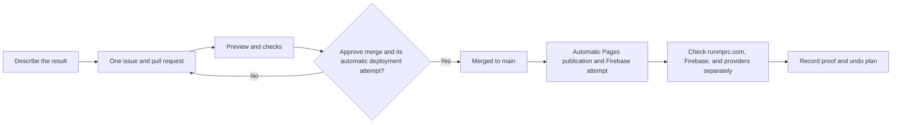

# MPRC Website Officer Handbook

**Purpose:** help a backup officer request, approve, verify, or undo a website change without learning to code.

Start with [OFFICER_START_HERE.md](./OFFICER_START_HERE.md) if you have less than five minutes.

The private Google Doc entry card titled **MPRC Website — Officer Start Here** is created and readback-verified but currently owner-only. Its private link is not stored in this public repository. Sharing to at least two backup officers remains a required board action.

## The whole process

In words: ask and preview first; approving a merge also authorizes today's automatic deployment attempt; then verify each real service separately.

## One-line request for AI

> Please update the MPRC website so **[describe the result]** on **[page]** by **[date, if any]**. Read `OFFICER_START_HERE.md` and `AGENTS.md`, use one issue and one small pull request, show a preview and proof, update officer documentation, and do not publish, deploy, use secrets, or change real member/payment data until **[approver]** explicitly approves.

## Find the right procedure

| Need | Procedure | Current status |
| --- | --- | --- |
| Any website change | [Request a change](./docs/officers/REQUEST_A_CHANGE.md) | Available |
| Public words, links, photos, or officer list | [Update public content](./docs/officers/UPDATE_PUBLIC_CONTENT.md) | Available through an issue and reviewed pull request |
| Events, products, members, race signup, money, waiver, or privacy | [Events, shop, members, and money](./docs/officers/EVENTS_SHOP_MEMBERS.md) | Source exists; live behavior unverified; live commerce unavailable |
| Merge, publish, and prove the result is live | [Publish and check](./docs/officers/PUBLISH_AND_CHECK.md) | Requires a platform maintainer while hosting is split |
| Outage, wrong page, privacy/security concern, or unexpected payment | [Emergency and recovery](./docs/officers/EMERGENCY_AND_RECOVERY.md) | Available as an escalation and evidence guide |
| Backup access and officer transition | [Access continuity](./docs/officers/ACCESS_CONTINUITY.md) | Private owner action required |
| Pages, data, deployment, and emergency flow | [Simple system maps](./docs/officers/SYSTEM_MAPS.md) | Current as of 2026-07-12 |
| Unfamiliar word | [Plain-language glossary](./docs/officers/GLOSSARY.md) | Available |

## Current facts that prevent false confidence

- Use the canonical [`main` branch](https://github.com/Run-MPRC/Run-MPRC.github.io/tree/main). The repository currently opens stale `dev` by default.
- `runmprc.com` is currently served by Netlify.
- GitHub also publishes a separate Pages copy.
- A `main` merge automatically publishes the Pages copy; there is no separate Pages approval today.
- Independent officer publishing to the live Netlify host is **NOT AVAILABLE YET**.
- A green workflow can include “skipping Firebase deploy.”
- Live race registration, merchandise payments, and refunds are not approved.
- There is no proven no-code switch that safely stops every new Stripe payment.

## Never share

- Passwords, login codes, recovery codes, private keys, or service secrets.
- Full member lists or private member details.
- Card, bank, payout, refund, health, or emergency-contact information.
- Private edit links, owner links, or screenshots showing private screens.

Use the club's approved password manager for access. Use public links, redacted screenshots, and made-up test data when asking for help.

## Approval rules

| Change | Minimum approval |
| --- | --- |
| Ordinary public wording, link, or approved photo | Content-owning officer |
| Event date, registration window, capacity, member access, or admin duty | Business owner + platform owner |
| Price, discount, tax, order, refund, payout, or Stripe | Treasurer + platform owner |
| Waiver, Terms, Privacy, insurance, or data retention | Club officer + approved legal/privacy owner |
| Domain, Netlify, Firebase, GitHub ownership, secret, or security rule | Service owner + backup/security reviewer |

## Before anyone says “done”

Record separate answers:

1. What source changed?
2. What tests passed?
3. What pull request merged?
4. Was a website copy published?
5. Did Netlify identify the intended commit, or is that still unknown?
6. Was the exact result seen on `runmprc.com`?
7. Did Firebase actually deploy, without a skip message?
8. Was each affected outside provider configured and checked directly?
9. Who approved and checked the result?
10. How can the change be undone safely?

The expanded handbook and task index is [docs/officers/README.md](./docs/officers/README.md).
