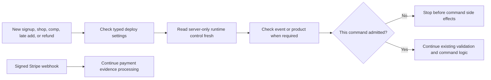
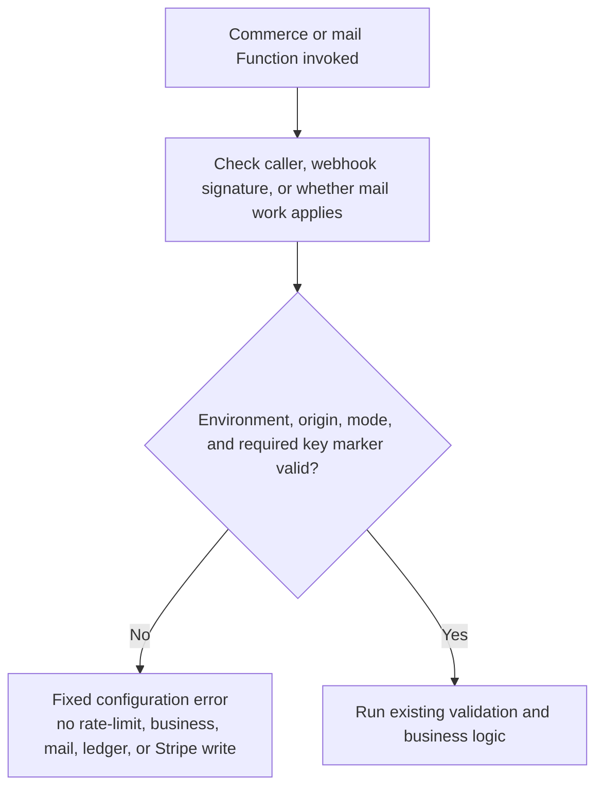

# MPRC Platform Operations Runbook

**Status:** Target operating procedure; several controls are not implemented yet
**Last reviewed:** 2026-07-12
**Audience:** Engineers, race directors, merchandise/fulfillment leads, membership admins, treasurer/finance admins, and incident responders

This runbook explains how to operate the website, Firebase services, and Stripe integration safely. Unless a procedure is explicitly marked **available now**, it describes the **target** operating model and must not be represented as implemented or deployed. The implementation source of truth is [GITHUB_ISSUES.md](./GITHUB_ISSUES.md); any procedure whose owning issue is not `done` is unavailable for production use.

Club officers and backup maintainers should start with [OFFICER_START_HERE.md](./OFFICER_START_HERE.md). It converts this technical runbook into short request, approval, verification, access, and emergency steps without terminal commands.

## 1. Ownership roster

Complete this table in the private operations system before live payments. Do not put personal phone numbers or recovery codes in this public repository.

| Area | Primary role | Backup role | Required access |
| --- | --- | --- | --- |
| Incident commander | Platform lead | Club president/designee | Commerce containment coordination and status communication; officer switch not available yet |
| Stripe account and payouts | Treasurer | Finance backup | Stripe finance/admin with MFA |
| Refunds and disputes | Finance admin | Treasurer | Stripe refunds/disputes; scoped MPRC finance capability |
| Race operations | Race director | Registrar backup | Event/roster capability; no payout settings |
| Merchandise fulfillment | Shop lead | Fulfillment backup | Catalog/order projection; no member roles |
| Membership and identity | Membership lead | Identity backup | Membership verification; no refunds |
| Firebase/GCP | Platform lead | Platform backup | Scoped project and deployment access |
| GitHub/release | Maintainer | Maintainer backup | Protected environment deployment |
| DNS/domain | Domain owner | Domain backup | Registrar/DNS with MFA and recovery plan |
| Email deliverability | Communications lead | Platform backup | Provider, SPF/DKIM/DMARC, bounce monitoring |
| Privacy/legal response | Club officer/counsel | Named backup | Approved policy and notification channel |

Review access quarterly, when an officer changes, and after every incident. Remove departed users immediately.

## 2. Emergency controls

### Commerce pause — B1 source only, operator control NOT AVAILABLE YET

CONFIG-001B1 [#151](https://github.com/Run-MPRC/Run-MPRC.github.io/issues/151) adds the read-only server enforcement layer. It does not deploy that layer, create its runtime record, or provide a safe way for an officer to change it.



Text alternative: new commerce and incident refunds use separate server decisions; a pause stops newly denied commands, while signed webhook processing continues without reading the pause control.

The exact server-only `systemConfig/commerce` version-1 record contains a safe integer revision plus four booleans: global new commerce, race registration, merchandise checkout, and incident refunds. New race work also requires `events/{id}.checkoutEnabled=true`. New shop work also requires `products/{id}.checkoutEnabled=true`. Missing/malformed documents or missing resource fields mean disabled. Browser visitors, members, and browser admins cannot read/write this control or set those resource fields.

`COMMERCE_ENABLED` is a deploy-time ceiling. It is not the no-deploy emergency switch. Keep it false during rollout. A false ceiling denies new commerce before a Firestore read. New-commerce requests that pass the ceiling, and every refund request, read the runtime record fresh without caching.

Changing only the UI is never a kill switch. A request admitted immediately before a pause can finish, and an existing Stripe Session or Payment Link can remain payable. The current local Cancel action does not expire Stripe. PAY-002/PAY-004 must add command drain and provider-object expiry. No reconciliation job exists yet; PAY-005/#106 own it.

CONFIG-001B2 must add a capability-protected, recent-auth, audited operator path and a private staging disable/restore drill. Until then, officers must use the stop-and-escalate steps below. Do not edit Firebase data, environment values, or Stripe objects from this guide.

## 3. Environment inventory

Maintain an internal inventory with project/account IDs and console links:

| Environment | Firebase project | Stripe mode/account | Web domain | GitHub environment | Status |
| --- | --- | --- | --- | --- | --- |
| Local source runtime | `demo-mprc-local` emulators | Providers remain separately gated | `localhost:3000` | None | Available for synthetic Firebase work after all three loopback emulators report ready |
| CI | Demo/emulator project | Fixtures/test only | None | CI | Partially implemented |
| Staging | **Create dedicated project** | Test/sandbox + unique endpoint | `dev.runmprc.com` | `staging` | Launch blocker |
| Production | `mid-peninsula-running-club` (verify) | Live + unique endpoint | `runmprc.com` | `production` | Informational site only until gates close |

The repository currently includes only one `.firebaserc` project mapping. Do not infer staging isolation from the historical documentation; create and verify it.

## 4. Configuration and secrets

### Browser/build-time values

Commit a `.env.example` containing names and safe descriptions, never real secret values. Values prefixed `REACT_APP_` are embedded in the public bundle and must not be secrets.

Expected public/environment-specific names include:

```text
REACT_APP_RECAPTCHA_SITE_KEY
REACT_APP_SENTRY_DSN
REACT_APP_SENTRY_ENV
REACT_APP_STRAVA_CLIENT_ID
```

The Firebase web configuration is public application configuration. It should still be environment-specific and paired with Auth restrictions, Firestore rules, and App Check.

### App Check release state — NOT AVAILABLE YET

ABUSE-001A1 is tracked in live [#159](https://github.com/Run-MPRC/Run-MPRC.github.io/issues/159). It changes only the browser source from the legacy reCAPTCHA v3 provider class to the Firebase SDK's Enterprise provider. It does not create or configure a key.

Protected release `29254280177` stopped before checkout/build because `REACT_APP_RECAPTCHA_SITE_KEY` was absent. Nothing was published. Do not use a placeholder, reuse an unverified v3 key, expose a debug token, or weaken the release check.

The safe sequence remains:

1. Confirm the approved Firebase project and host inventory under #113.
2. Merge and verify #159 source/tests without a real key.
3. Have the named owner create the Enterprise site key and allowed-domain policy for the approved environment.
4. Bind website preparation to the approved protected Actions scope under #133/a dedicated CI child, then store only that public site key there. The current preparation job has no environment binding and can read only repository/organization variables; do not use that gap as a production shortcut.
5. Rehearse a synthetic staging page, observe App Check metrics, and prove expected token behavior before ABUSE-001A2 enables any callable enforcement.
6. Publish and verify the website, Firebase, provider, and live behavior as separate states under #136/WEB-001.

A source merge, green CI run, or public-key variable alone does not prove Enterprise is configured or protecting a callable.

### Server secrets

Store server secrets in Google Secret Manager and bind only to functions that need them:

```text
STRIPE_SECRET_KEY
STRIPE_WEBHOOK_SECRET
STRAVA_CLIENT_ID
STRAVA_CLIENT_SECRET
RATE_LIMIT_HMAC_KEY            # target
```

Validated non-secret server parameters:

```text
SITE_ORIGIN
STRIPE_LIVEMODE_EXPECTED
COMMERCE_ENABLED
ENVIRONMENT_NAME
```

### Typed server configuration gate — source in #149, not deployed

[CONFIG-001A / #149](https://github.com/Run-MPRC/Run-MPRC.github.io/issues/149) makes the current commerce and confirmation-mail Functions validate configuration at each invocation. Parsing happens at runtime, not while Firebase discovers Functions for deployment. The returned configuration is frozen and contains no Stripe key.

| Environment | Accepted site origin | Expected Stripe mode | Accepted server-key mode |
| --- | --- | --- | --- |
| `local` | Exact loopback `http` or `https` origin | Test | Test |
| `test` | Canonical HTTPS `.test` origin | Test | Test |
| `staging` | `https://dev.runmprc.com` | Test | Test |
| `production` | `https://runmprc.com` | Live | Live |

An origin is only the scheme, host, and optional non-default port. Credentials, paths, trailing slashes, queries, fragments, padded values, and default-port aliases are rejected. Test/live compatibility uses only the documented `sk_` or restricted `rk_` mode marker. The complete key is never returned, logged, stored in configuration, or copied into evidence.



Text alternative: after identity, signature, or mail-eligibility checks, invalid server settings stop the invocation before any business, mail, event-ledger, or Stripe side effect.

The webhook and confirmation-mail triggers validate environment, origin, and expected mode without receiving the Stripe API key. Only the two checkout creators and two admin action Functions bind and validate that key. CONFIG-001B1 requires exact `COMMERCE_ENABLED` only on those four command handlers and keeps webhook/mail independent. Its runtime enforcement remains source-only; the CONFIG-001B2 operator control and drill are **NOT AVAILABLE YET**.

Source tests do not prove Firebase parameters, Secret Manager bindings, Stripe account mode, or production behavior. Before deployment, record only parameter names in public evidence. Store values and provider identifiers in the approved private continuity record. Use a protected staging release with made-up data; never discover configuration by trying a real payment or email.

`functions.config()` is deprecated and scheduled for decommissioning in March 2027. The legacy member-sync API key must be retired or migrated as its own security issue, not copied into a new generic secret without redesign.

### Secret rotation record

For each secret, record in a private inventory:

- Owner and backup.
- Environments and exact function consumers.
- Creation/last-rotation date.
- Rotation and rollback procedure.
- How to test the new version.
- Emergency revoke procedure.
- Evidence that the old version was disabled after overlap.

Never print secret values into CI output, issue bodies, screenshots, chat, or this runbook.

## 5. Local development

### Prerequisites

- Node.js 20 matching Functions runtime.
- npm matching the lockfiles.
- Java 17 for the Firestore emulator/rules tests.
- Firebase CLI from the repository dependency where possible.
- Stripe CLI for signed local webhook testing.

### Install — available now

```bash
npm ci --legacy-peer-deps
npm --prefix functions ci
```

The legacy peer-dependency flag is currently needed by the frontend dependency tree. Removing that requirement belongs to the build-system/dependency issue.

### Local secret override — available now

Use Firebase's ignored `functions/.secret.local` behavior for emulator-only fake/test values. Confirm the file is ignored before adding it. Use Stripe test keys only. Do not download or reuse production service-account JSON.

Example names—not values:

```text
STRIPE_SECRET_KEY=sk_test_...
STRIPE_WEBHOOK_SECRET=<temporary test value from stripe listen>
STRAVA_CLIENT_ID=test-or-development-id
STRAVA_CLIENT_SECRET=development-secret
```

### Start emulators and app — available for synthetic Firebase work

**Purpose:** start the browser against the local Auth, Firestore, and Functions emulators without a production Firebase fallback.

1. Confirm the terminal is at the repository root.
2. Confirm Node.js 20 is active.
3. In terminal 1, run:

```bash
npm run emulators
```

4. Wait for the CLI to name project `demo-mprc-local`.
5. Wait for Auth on `127.0.0.1:9099`.
6. Wait for Firestore on `127.0.0.1:8080`.
7. Wait for Functions on `127.0.0.1:5001`.
8. Stop if any emulator fails, uses another project, or reports a production resource.
9. In terminal 2, run:

```bash
npm start
```

10. Open only `http://localhost:3000`.
11. Use synthetic records only.
12. Stop if browser Firebase traffic uses a host other than `127.0.0.1` or `localhost`.

Expected result: the browser uses a fully synthetic Firebase configuration, Auth/Firestore/Functions use loopback, and App Check, Analytics, and Sentry remain off. A failed emulator-connection setup stops app initialization.

The CLI readiness messages prove the three processes listened during that run. Mocked frontend tests prove endpoint selection, not process readiness. If an emulator later stops, requests fail locally; do not change the project or disable the guard.

Optimized builds are different. Netlify previews and a locally served `build/` directory use `NODE_ENV=production` and currently target production Firebase. Use them only for public, read-only visual checks. Do not sign in or open account, member, admin, event-registration, shop-purchase, or provider flows.

### Forward Stripe events — NOT AVAILABLE YET for end-to-end use

Firebase emulation does not isolate Stripe, Strava, email, or any other provider called by a Function. Do not run provider-facing flows until the owning issue proves the correct test account/key, safe email sink, configuration fail-closed behavior, and synthetic fixtures.

When that gate is complete, the intended Stripe test-mode command is:

```bash
stripe listen --forward-to http://127.0.0.1:5001/demo-mprc-local/us-central1/stripeWebhook
```

Copy the CLI's temporary test webhook signing secret only into the ignored local secret override. Do not use a Dashboard production endpoint secret locally.

Do not trigger Checkout from the current app merely because the Firebase emulators are running. PAY/CONFIG/TEST issues own the later test-mode rehearsal.

### Local safety checks

- The CLI names `demo-mprc-local` and all three expected loopback ports.
- Browser Firebase calls target only localhost/127.0.0.1.
- App Check, Analytics, and Sentry do not initialize locally.
- No production customer email, address, DOB, or emergency-contact data is copied into local Firestore.
- No checkout, refund, email, Strava, or other provider flow runs until its separate test configuration and safe sink are proven.
- No optimized preview/build is used for sign-in or private/Firebase behavior.

## 6. Verification commands

### Checks available on current `main`

```bash
npm --prefix functions run lint
npm --prefix functions run test:run -- --runInBand
CI=true npm test -- --watchAll=false --runInBand
npm run test:spa-navigation
```

The frontend Jest command is a dependable local baseline and hosted CI runs it as the blocking `Run frontend Jest tests` step under [#124](https://github.com/Run-MPRC/Run-MPRC.github.io/issues/124). Hosted CI also runs the separate Node SPA suite as `Run SPA callback safety tests` under [#126](https://github.com/Run-MPRC/Run-MPRC.github.io/issues/126), plus the manual-release source invariants under [#135](https://github.com/Run-MPRC/Run-MPRC.github.io/issues/135). Protected environment/OIDC configuration, actual staged/live deployment, fail-closed lint, required checks, and controlled Netlify publication remain **NOT AVAILABLE YET** under [#105](https://github.com/Run-MPRC/Run-MPRC.github.io/issues/105), [#133](https://github.com/Run-MPRC/Run-MPRC.github.io/issues/133), [#136](https://github.com/Run-MPRC/Run-MPRC.github.io/issues/136), and WEB-001.

### Firestore Rules

```bash
npm run test:rules
```

This requires Java. Rules tests must prove both allowed behavior and explicit denial of secret/financial/arbitrary paths for browser admins.

### Production build without changing generated sitemap during a diagnostic check

```bash
CI=true DISABLE_ESLINT_PLUGIN=true npx --no-install react-scripts build
```

The normal `npm run build` executes `prebuild` and may update `public/sitemap.xml`. Use the normal command only when generated sitemap changes are intended and reviewed.

### Dependency review

```bash
npm audit --omit=dev
npm --prefix functions audit --omit=dev
```

Do not run `npm audit fix --force` blindly. Review reachability, upgrade direct dependencies deliberately, inspect lockfile changes, and rerun all checks.

### Target payment integration suite

CI/staging must eventually include:

- Duplicate and out-of-order signed webhook fixtures.
- Immediate and asynchronous payment outcomes.
- Amount/currency/environment mismatch.
- Concurrent final-seat and final-SKU attempts.
- Session expiry and cancellation.
- Full/multiple partial refunds and disputes.
- Reconciliation after a deliberately missed webhook.

## 7. Change and release process

### Before merge

1. Link one issue from [GITHUB_ISSUES.md](./GITHUB_ISSUES.md) or the corresponding GitHub issue.
2. Record data/schema/API changes and backward-compatibility behavior.
3. Add negative/security tests, not only the happy path.
4. Verify no secret, production identifier, PII fixture, generated build, emulator export, or debug log was added.
5. Obtain review from an owner appropriate to the risk: platform/security, finance/payment, race operations, or privacy.
6. Require CI to pass without ignored failures.

### Deployment order

For expand-and-contract changes:

1. Backup/export or snapshot the affected operational data according to the approved method.
2. Deploy additive indexes/rules/backend functions compatible with the current client.
3. Run migrations/backfills in dry-run mode; review counts and anomalies.
4. Execute the idempotent migration and record its report.
5. Verify backend health in staging.
6. Deploy the dependent frontend.
7. Run smoke and reconciliation checks.
8. Observe for the defined period before removing legacy fields/endpoints.

The GitHub release workflow is now manual and exact-current-commit. After protected approval it rechecks `main`, the newest exact CI run, and the retained credential-free artifact before cloud authentication. It fails on missing protected configuration, uses a lockfile Firebase CLI, verifies reviewed Rules and two named profile Functions before publishing the Pages branch, and never gives cloud authority to website preparation or publication. Future Pages artifacts omit the `runmprc.com` CNAME, but the existing Pages provider setting still claims that Netlify-served name until #136/WEB-001 publish and read it back. The source gate is not usable until #133 configures protected environments/OIDC. It does not publish the live Netlify host. Treat the full pipeline as incomplete until #105 closes.

### Production approvals

Production commerce changes require:

- Passing required CI/security checks.
- Protected GitHub production environment approval.
- Named operator for post-deploy observation.
- Rollback/roll-forward plan.
- No unrelated schema migration during a race-registration opening.
- Finance approval when totals, discounts, tax, refunds, or reconciliation change.

## 8. Stripe event-destination setup

In Stripe Workbench/Dashboard, verify the production endpoint:

- URL points to the intended production Firebase function.
- Mode/account matches production.
- TLS is valid.
- Only required event types are selected.
- Signing secret version matches Secret Manager.
- Recent deliveries return `2xx` only after durable acceptance.
- Alerts/owners watch failed deliveries.

Required initial event set is documented in [STRIPE_COMMERCE_DESIGN.md](./STRIPE_COMMERCE_DESIGN.md). When the handler changes, update its tests and the Dashboard allowlist together.

For secret rotation, support the provider-approved overlap or controlled switchover, send a signed test event, verify the new secret, then retire the old secret and record evidence.

### Promotion-adjustment safety release — BLOCKED

**Purpose:** prevent an older promotion-enabled Stripe Session or provider setting from bypassing the repository guard.

**Approver:** treasurer plus platform owner; the Stripe account owner performs provider readback.

**Prerequisites:** merged [#102](https://github.com/Run-MPRC/Run-MPRC.github.io/issues/102), green exact-commit checks, an isolated staging Firebase project, Stripe test mode, and a reviewed protected release plan that names `createCheckoutSession`, `createMerchCheckout`, and `stripeWebhook` together.

The current protected release plan names only the profile-recovery Functions. It cannot deploy this Stripe slice. Do not call #102 deployed until a separately reviewed immutable plan includes all three Stripe Functions and verifies them after deployment.

1. Have the Stripe account owner privately count still-open Sessions created before the #102 release candidate.
2. Record only redacted counts, mode, date range, and disposition. Do not copy customer details, Session URLs, promotion-code values, or provider identifiers into GitHub, email, screenshots, or AI.
3. Privately confirm whether promotion codes, coupons, automatic tax, or shipping rates can affect the test/staging Checkout configuration.
4. Expire or reconcile test/staging Sessions under the approved plan. Do not change production provider state in this procedure.
5. Run made-up race and merchandise payments in Stripe test mode. A complete all-zero completion must continue. An adjustment or missing breakdown on completion, failure, or expiry must create review evidence and never become paid/fulfilled. An ordinary all-zero failure or expiry cancels without creating a new warning.
6. Reconcile Stripe test totals with the synthetic Firebase records.
7. Release the three named Functions together only through the protected exact-commit gate.
8. Read back the deployed Functions and Stripe event destination separately.
9. Record Firebase deployment, provider readback, and observed behavior as three different results.

**Expected result:** new Sessions cannot accept promotion entry or automatic tax, and the webhook accepts only a complete all-zero adjustment breakdown. Failed or expired Sessions still cancel while keeping any review flag.

**Stop conditions:** missing owner, production mode, real customer/member data, an old open Session with no approved disposition, a release plan missing one Function, skipped/partial Firebase work, or unavailable provider readback.

**Success proof:** redacted private inventory, exact merge commit, exact CI run, protected release run, three Function readbacks, test-mode event evidence, and separate Stripe owner confirmation.

**Undo:** use one reviewed safe roll-forward or revert through the same three-Function gate. Do not re-enable promotions, edit payment records, delete webhook ledgers, or expire production Sessions by hand.

**Escalation:** treasurer plus platform owner; add the security owner for a suspected bypass and the privacy owner if customer information appeared.

## 9. Staging dress rehearsal

Before every major payment release:

1. Create a capped test race and a product with one unit in a staging Firebase project.
2. Confirm non-member and verified-member pricing from separate accounts.
3. Race two final-seat and final-unit checkouts; confirm only one reservation succeeds.
4. Complete a card payment and, if supported, a delayed payment fixture.
5. Replay the same webhook and deliver relevant events out of order.
6. Cancel an unpaid Session and prove Stripe can no longer accept payment.
7. Allow another Session to expire and prove the hold is released once.
8. Perform partial and final refunds using a retry/timeout scenario.
9. Trigger a dispute fixture and verify finance alert/state.
10. Temporarily interrupt webhook processing, restore it, and run reconciliation.
11. Verify confirmation email is emitted once and hostile name/content is escaped.
12. Review Firestore records, counters, event inbox, audit entries, Stripe totals, and redacted logs.

Capture the commit, test IDs, timestamps, screenshots without secrets/PII, and the final reconciliation report.

## 10. Go-live procedure

### T-7 days or earlier

- Complete the launch checklist in `STRIPE_COMMERCE_DESIGN.md`.
- Verify account owners/MFA, support coverage, legal text, tax/shipping/refund/waiver decisions, inventory, capacity, and email deliverability.
- Verify backups and restoration drill.
- Confirm dependency/security scan and branch/environment protection.
- Announce the maintenance/incident contact internally.

### T-24 hours

- Freeze unrelated production changes.
- Verify event/product configuration and expected prices with two reviewers.
- Verify Stripe event destination and no failed backlog.
- Run reconciliation and confirm zero unexplained mismatches.
- Review cloud/Stripe budgets and alerts.
- Confirm kill-switch access and operator coverage.

### Pilot

- Start with one low-value product or small capped event.
- Perform one controlled live transaction using an authorized real payment method.
- Verify Stripe amount/currency/receipt, Firestore paid state, counters, confirmation, and payout reporting.
- Refund if this was an approved test purchase and verify both systems.
- Do not broaden until finance and platform owners sign off on reconciliation.

### Opening registration/sales

- Enable server-side commerce switch.
- Monitor checkout errors, App Check/rate-limit rejects, webhook latency/failures, reservations, paid conversions, counter drift, email failures, Stripe Radar reviews, refunds, and disputes.
- Run reconciliation frequently during the first launch window.

## 11. Routine operations

### Daily while commerce is active

- Review failed/quarantined Stripe events and reconciliation mismatches.
- Review stale reservations and negative/near-zero capacity/inventory.
- Review Stripe disputes, Radar reviews, refunds, and payout anomalies.
- Review transactional email failures/bounces.
- Confirm no production deployment failed or silently skipped.

### Weekly

- Reconcile Stripe gross/discount/tax/shipping/refunds/fees to local order/registration reports and finance records.
- Review privileged actions and exports.
- Review cloud costs, rate-limit spikes, App Check invalid traffic, and Sentry redaction.
- Patch time-sensitive high-risk dependencies through reviewed PRs.

### Monthly/quarterly

- Test checkout kill switch and a recovery path in staging.
- Review access and remove unnecessary roles.
- Review secret age/rotation schedule.
- Test backup restoration on non-production infrastructure.
- Review retention/deletion job reports.
- Revisit fraud, refund, chargeback, and support trends.

## 12. Refund procedure

1. Authenticate with finance capability and satisfy recent-auth/MFA policy.
2. Locate the local business record and corresponding Stripe PaymentIntent/Charge.
3. Confirm identity using the approved support procedure without asking for card data.
4. Review policy, prior refunds, actual captured/refunded totals, fulfillment/attendance state, and dispute state.
5. Enter amount in integer cents, reason, and internal note.
6. Submit once. If the response is lost, retry the same refund command ID; never create a new request blindly.
7. Treat the record as refund-pending until Stripe confirms.
8. Verify webhook/reconciliation updates cumulative refunded total and customer communication.
9. Release race capacity or process returned inventory only under the explicit policy.

Never edit Firestore totals/status manually to simulate a refund.

## 13. Reconciliation procedure

The target reconciliation job produces categories:

- Stripe paid / no local record.
- Local paid / Stripe not paid.
- Amount or currency mismatch.
- Duplicate local records for one Stripe object.
- Refund/dispute mismatch.
- Stale checkout/reservation.
- Capacity or inventory counter drift.
- Failed/quarantined event inbox item.

For an anomaly:

1. Disable only the affected sellable flow if ongoing harm is possible.
2. Preserve record versions, Stripe Event IDs, logs, and timestamps.
3. Retrieve canonical Stripe objects using server tooling.
4. Classify deterministic repair versus finance/security review.
5. Run an idempotent repair command; do not hand-edit multiple fields.
6. Re-run reconciliation and attach the before/after report to the private incident/operations record.

## 14. Incident playbooks

### Suspected Stripe key exposure

1. Disable new checkout/refund commands.
2. Restrict or roll the key in Stripe; create a replacement through the approved rotation path.
3. Update Secret Manager binding and deploy only affected functions.
4. Review Stripe logs for unexpected API calls, refunds, customers, Sessions, Products/Prices, webhook changes, payout/account changes, and restricted-key use.
5. Reconcile all activity in the exposure window.
6. Determine notification obligations and complete post-incident review.

### Webhook signing-secret exposure

1. Disable or roll the event destination secret.
2. Ensure the endpoint continues to fail closed for invalid signatures.
3. Review invalid/valid event logs and event inbox for anomalies.
4. Retrieve canonical Stripe objects before repairing any suspicious local state.

### Paid customer not confirmed

1. Ask for email/order reference—not card details.
2. Locate the Stripe Session/PaymentIntent and local record.
3. Inspect event delivery and event inbox.
4. Run reconciliation/repair using canonical Stripe state.
5. Send confirmation once through the idempotent outbox and document support resolution.

### Local paid but Stripe unpaid/mismatched

1. Disable fulfillment/access for the record without deleting evidence.
2. Quarantine it and alert finance/platform owners.
3. Confirm the source event/signature, environment, amount, currency, and IDs.
4. Treat as a possible integrity incident; expand review to adjacent records/events.

### Capacity or inventory oversell

1. Disable new checkout for the event/variant.
2. Reconcile successful payment time, reservation time, and policy priority.
3. Contact affected customers using approved language; issue idempotent refunds if required.
4. Repair counters only with an audited tool and add a regression test.

### Compromised admin account

1. Disable/revoke the account and refresh tokens; remove privileged claims.
2. Review role grants, financial actions, exports, catalog/events, mail, secrets access, GitHub/cloud activity, and Stripe actions.
3. Rotate exposed secrets and notify affected users/providers as required.
4. Restore through audited repair; require MFA/recovery remediation before re-enabling.

## 15. Backup, restoration, and retention

Before live commerce:

- Enable an approved Firestore backup/export schedule with restricted storage/IAM.
- Document whether Firebase Auth, Secret Manager versions, Stripe configuration, email templates, and DNS require separate backup/export.
- Encrypt and retention-limit backups; monitor access.
- Test restoring into an isolated non-production project.
- Validate restored referential integrity and run reconciliation in test mode.
- Ensure deletion/retention policy eventually reaches backups according to legal and platform constraints.

A backup that has never been restored is not verified.

## 16. Rollback and repair

For database/payment changes, roll-forward is often safer than reverting code because external Stripe events continue and records may use the new schema. Every release identifies:

- Last compatible frontend/backend versions.
- Additive schema and backfill version.
- Whether old code can read new state.
- How to disable new writes while webhook/reconciliation continue.
- Idempotent repair path for partially completed sagas.

Never use destructive Git or Firestore reset operations on production as a rollback.

### Missing member profile repair — NOT AVAILABLE YET

Issue [#118](https://github.com/Run-MPRC/Run-MPRC.github.io/issues/118) replaces manual repair with create-once signup/recovery Functions and a fail-closed account page. Do not use it as a production procedure until #105 supplies a protected staging and deployment path.

Required release order:

1. Confirm the exact merged #100 Rules revision is the reviewed dependency.
2. Deploy those Rules plus both `createMemberOnSignUp` and `ensureMemberProfile` to isolated staging.
3. Record the deployed App Check policy. When enforcement is enabled, prove missing or invalid App Check is rejected. When it is not enabled, record that open gate and do not call the boundary enforced.
4. Use a made-up signed-in account with no profile.
5. Prove one pending profile is created and retries preserve it byte-for-byte.
6. Prove existing member/admin profiles and custom claims remain unchanged.
7. Prove anonymous, injected-field, backend-down, missing-profile, Rules-denial, and cross-user paths fail safely. Prove App Check behavior matches the policy recorded in step 3.
8. Record and rehearse either the last-compatible Rules/Functions/website rollback or a reviewed safe roll-forward in staging.
9. Deploy and verify the exact #100 Rules plus both revised Functions in the approved target Firebase project.
10. If that backend deployment is partial or verification fails, do not deploy the website. Restore the reviewed backend set or safely roll forward, then repeat verification.
11. Deploy the dependent website only after target-backend proof.
12. Check the exact website revision and the plain retry state.
13. Repeat only the approved synthetic live smoke; never use a real member record.

If the website arrives before `ensureMemberProfile` or the matching Rules, the intended safe result is a temporary-unavailable message with Edit hidden. Roll back the website or safely roll forward the reviewed backend. Never release the callable while the old signup trigger remains: that trigger can overwrite a recovered profile or replace claims. Deploy the two revised Functions together, or stop and roll back the partial backend release. Do not create, delete, overwrite, or re-role a production account in Firebase Console.

### Account verification email outcomes — SOURCE ONLY, NOT LIVE

AUTH-MAIL-002A [#145](https://github.com/Run-MPRC/Run-MPRC.github.io/issues/145) separates three transitions:

1. Account creation fails: reject the operation and show one generic create-account error.
2. Account creation succeeds and Firebase accepts the verification request: preserve the signed-in account and report `accepted`; do not claim delivery.
3. Account creation succeeds and Firebase rejects the verification request: preserve the signed-in account, report `unavailable`, emit only the fixed `email_verification_failed` diagnostic, and offer My Account as an inspection path. If My Account is unavailable, stop and keep the account. Do not advertise the existing resend action as proven.

AUTH-MAIL-002B [#153](https://github.com/Run-MPRC/Run-MPRC.github.io/issues/153) adds the My Account source state machine: idle, requesting, accepted, or unavailable. Request acceptance is not delivery. A synchronous guard blocks rapid duplicate activation. Both completed outcomes start the same visible 60-second wait, then allow one retry. Remounting the page or changing the signed-in account resets this browser-only timer; Firebase can still throttle requests. The timer is not server authorization or abuse protection.

AUTH-MAIL-002C1 [#155](https://github.com/Run-MPRC/Run-MPRC.github.io/issues/155) tracks the password-reset request source state machine: idle, requesting, finished, and retry-ready. Provider success and failure enter the same `finished` DOM, copy, accessibility state, and 60-second deadline. The browser never says sent, delivered, accepted, failed, or whether an account exists. Missing local input makes no request. A synchronous ref blocks duplicate activation; unmount discards a late result and clears the timer. Remounting may reset this usability guard.

The source and tests do not change Firebase Auth, email templates, DNS, sender branding, account-enumeration protection, or mailbox/provider settings. Tests use a mocked request and no network. Identical browser output does not prove the direct Firebase API hides account state; the identity owner must record that provider setting privately under [#119](https://github.com/Run-MPRC/Run-MPRC.github.io/issues/119). Do not test these flows with a production mailbox or a real member.

Release and evidence order:

1. Review the exact source and synthetic mocked tests.
2. Merge the exact reviewed commit.
3. Publish that frontend revision only through the approved website release path.
4. Verify the hosting record and the exact `runmprc.com` revision separately.
5. Before calling the linked recovery usable, verify the exact [#118](https://github.com/Run-MPRC/Run-MPRC.github.io/issues/118) Rules, Functions, and profile page plus [#153](https://github.com/Run-MPRC/Run-MPRC.github.io/issues/153)'s truthful resend result/cooldown. An unavailable My Account page is a stop result.
6. Use an isolated staging Firebase project and approved safe email sink before any end-to-end test.
7. Record request acceptance separately from message delivery, Spam placement, and sender configuration.
8. Keep provider/DNS/template work under [#119](https://github.com/Run-MPRC/Run-MPRC.github.io/issues/119).
9. Keep password reset request work in AUTH-MAIL-002C1 [#155](https://github.com/Run-MPRC/Run-MPRC.github.io/issues/155) and incoming action-code work in the future AUTH-MAIL-002C2 under parent [#120](https://github.com/Run-MPRC/Run-MPRC.github.io/issues/120). #153/#155 change browser results and usability timers only; they do not prove provider delivery, enumeration protection, or a durable rate limit.

Rollback is a reviewed frontend revert or safe roll-forward. Do not delete or recreate an Auth account because the verification request failed.

## 17. Verification evidence boundaries

The earlier combined pre-extraction working tree reported 7 frontend tests, 4 SPA callback tests, 45 Functions tests, and 185 Firestore Rules tests. Those numbers combine queued #99, #100, #101, and #103 work. They are historical planning evidence only and are **not reproducible proof for #104 or current `main`**.

Each isolated issue must publish its own exact base commit, commands, counts, and results. A documentation-only #104 branch starts from `main` with the merged #98 role-grant behavior; it must not claim the queued emulator, webhook, Rules, or frontend-test outcomes.

On the isolated #104 branch based at `ce22c110`, Functions lint and 17/17 Functions tests pass, 97/97 Firestore Rules tests pass with Java 17, and the diagnostic production build passes. At that point, frontend Jest ran 15 Login tests but the App suite failed on the known missing `TextEncoder`. These are historical branch checks, not deployment evidence.

On the isolated #103 branch based at `0e03ac1`, Node 20 focused App tests pass 1/1 and the complete frontend suite on the branch passes 16/16. Changed-file lint, diff checks, and the diagnostic production build also pass. Service initialization and provider-network paths are prevented by test mocks; this was not a socket-monitored provider test, and the separately owned #99 Firebase/Sentry tests are not present on the branch. A separate read-only Node 20 compatibility run against the preserved #99 working tree passed those two suites 6/6, but that is not #103 branch or merge coverage. This proves a deterministic local baseline only. It does not prove a required CI gate, website publication, Firebase deployment, provider configuration, or production behavior.

Issue #124 adds that complete committed frontend suite to the hosted frontend job as the named, blocking `Run frontend Jest tests` step. Its pull-request and post-merge runs are the proof that the exact commits executed Jest. Even a green step does not prove branch protection, website publication, Firebase deployment, provider configuration, or production behavior.

On the isolated #99 branch rebased over #124, Node 20 local evidence is: 10/10 standalone SPA navigation/referrer-policy tests; 31/31 focused Firebase/monitoring tests; 4 frontend suites / 47 tests; 17/17 Functions tests; a clean diagnostic build; and a demo-only CLI smoke in which Auth, Firestore, and Functions listened on the three documented loopback ports. No browser account flow, production callback, Stripe/Strava/email call, Firebase deployment, or production data was used. #126 adds the standalone SPA suite as its own named blocking hosted step; only exact pull-request and post-merge step results prove that gate ran.

The #134 remediation-ledger entry is source/test evidence only. For OBS-001A1 [#134](https://github.com/Run-MPRC/Run-MPRC.github.io/issues/134) and [PR #137](https://github.com/Run-MPRC/Run-MPRC.github.io/pull/137), keep six evidence states separate: **source/tests** means the exact reviewed Sentry source plus mocked synthetic-canary results; **merge** means the resulting `main` SHA; **website** means a hosting publication record plus a separate check that `runmprc.com` serves that exact revision; **Firebase** is unchanged by this issue, so no Firebase deployment may be inferred; **Sentry provider** remains unverified for transport/ingestion, IP handling, retention, access, consent, deletion, and vendor terms; **live behavior** remains unverified unless an approved no-PII synthetic check proves the expected bounded event at the exact website revision. Never use member data or intentionally trigger an error in a real member flow. A green check, merged PR, preview, or website publication proves only its named surface and does not prove a later provider or live state.

For OBS-001A2 [#139](https://github.com/Run-MPRC/Run-MPRC.github.io/issues/139), keep the same evidence discipline: **source/tests** means application runtime source and public HTML/JavaScript entrypoints contain no Firebase Analytics import, initialization, or emission and synthetic mocked/static tests pass; **merge** means the resulting `main` SHA; **website publication** means the exact revision has a hosting publication record; **`runmprc.com` verification** separately proves the live host serves that revision; **Firebase deployment** is unchanged and not required for this source-only issue; **Analytics provider configuration** remains unchanged and unverified for collection, cookies/storage, prior provider data, access, retention, consent, and deletion; **live network behavior** remains unverified until an approved public-page check at the exact website revision observes no Analytics request or cookie without signing in or using member data. Removing source calls does not delete provider history or browser storage. Do not use a production-configured preview for this check.

For OBS-001A3 [#142](https://github.com/Run-MPRC/Run-MPRC.github.io/issues/142), **source/tests** means application and public runtime source has no direct console path outside the closed five-outcome helper and synthetic console canaries pass; **merge** means the resulting `main` SHA; **website publication** and **`runmprc.com` verification** remain separate later evidence; **Firebase deployment** and **outside-provider configuration** are unchanged by this frontend-only source issue; **live behavior** and deletion of any earlier local browser-console history remain unverified. Never reproduce a member error or paste a browser console into an issue to prove this boundary.

For AUTH-MAIL-002A [#145](https://github.com/Run-MPRC/Run-MPRC.github.io/issues/145), **source/tests** means mocked account-create and email-request outcomes plus fixed-output canary checks; **merge** means the resulting `main` SHA; **website publication** and **`runmprc.com` revision verification** are separate; **Firebase/provider configuration** is unchanged; and **live delivery** remains unverified. An `accepted` result proves only that Firebase accepted the request. It does not prove Inbox delivery, sender reputation, or Spam placement.

For AUTH-MAIL-002B [#153](https://github.com/Run-MPRC/Run-MPRC.github.io/issues/153), **source/tests** means mocked resend outcomes, double-click/ref/timer/UID cleanup, fixed-output canaries, and accessible status/action checks; **merge** is a separate `main` SHA; **website publication** and **`runmprc.com` revision verification** are separate; **Firebase/provider configuration** is unchanged; and **delivery** remains unverified. The 60-second display resets with browser component/session changes and is not provider throttling proof.

For AUTH-MAIL-002C1 [#155](https://github.com/Run-MPRC/Run-MPRC.github.io/issues/155), **source/tests** means mocked reset success/failure produce byte-equivalent neutral public output, immediate repeat protection, deadline/retry/unmount tests, return-state preservation, hostile-canary redaction, and accessible controls; **merge** is a separate `main` SHA; **website publication** and **`runmprc.com` revision verification** are separate; **Firebase/provider configuration** is unchanged; and **delivery plus API enumeration protection** remain unverified. A neutral page does not prove provider policy or direct-API behavior.

Provider configuration, production secrets, Netlify publication, Firebase deployment, and live behavior always require separate dated evidence. Local tests and a green GitHub summary do not prove them.
