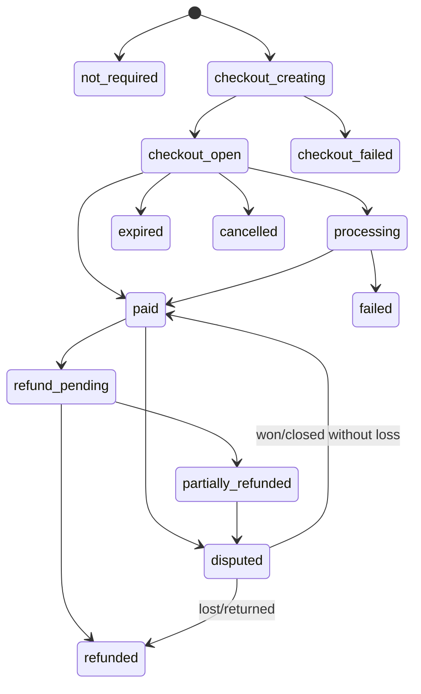
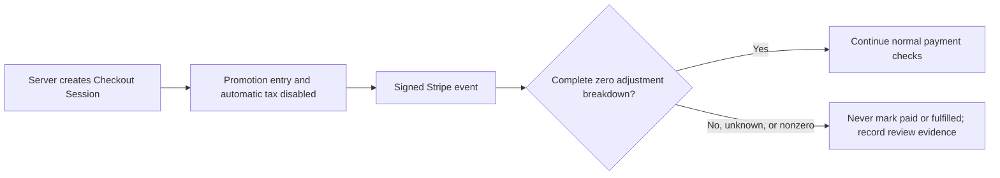

# Stripe, Race Registration, and Merchandise Design

**Status:** Required production design; current code is a test-mode prototype
**Last reviewed:** 2026-07-13
**Related:** [SYSTEM_DESIGN.md](./SYSTEM_DESIGN.md), [SECURITY.md](./SECURITY.md), [OPERATIONS_RUNBOOK.md](./OPERATIONS_RUNBOOK.md)

This document defines how MPRC should configure Stripe and how race-registration and merchandise money flows must behave. It deliberately separates repository implementation from external Stripe account configuration: source code can declare required secret names and behavior, but it cannot prove that the production Stripe account, event destination, bank account, roles, tax settings, Radar controls, or secrets are correctly configured.

## 1. Launch status

**Do not enable or advertise live checkout yet.** The initial 2026-07-12 assessment found unsafe payment confirmation, no Event-ID ledger, enabled unmodeled promotions, and callback loss. Repository safety slices now validate paid/amount/currency/mode/explicit livemode, reject unapproved adjustments, deduplicate Events, protect terminal/refund state, and preserve callbacks. PAY-003A [#101](https://github.com/Run-MPRC/Run-MPRC.github.io/issues/101) is merged source; PROMO-001 [#102](https://github.com/Run-MPRC/Run-MPRC.github.io/issues/102) supplies the adjustment guard and exact tests. Neither statement is deployment, provider, or live-behavior evidence, and these slices do not close the payment architecture. These residual conditions still prevent safe production use:

- Checkout creation lacks validated fail-closed environment configuration, command idempotency, a persistence-first saga, and the canonical versioned state/schema contract.
- The webhook still needs canonical reducer/reservation/outbox integration, explicit metadata schema allowlisting/migration, retry/dead-letter operations, TTL/alerts, emulator integration, and Stripe test-mode delivery rehearsal.
- A webhook can arrive before the registration/order record is written.
- Late-registration Payment Links cannot be reliably mapped back to their registration and are reusable.
- Race capacity is checked with a non-atomic count; merchandise has no SKU inventory reservation.
- Cancelling locally does not expire an open Stripe Session, so a later payment can reopen the record.
- Promotion entry and automatic tax are disabled in both current Session creators. Exact creator/webhook tests quarantine any nonzero discount, tax, or shipping charge. Outstanding pre-change Session/provider inventory, deployment, and live verification remain open under PROMO-001.
- Success credentials remain in query strings even though the Pages fallback now preserves them; DATA-001 must remove long-lived plaintext capabilities and scrub browser/monitoring state.
- Production App Check enforcement is optional and fail-open.
- Legal, privacy, cancellation/refund, tax, shipping, and waiver content is not approved for launch.

The issue sequence in [GITHUB_ISSUES.md](./GITHUB_ISSUES.md) closes these gaps in dependency order.

## 2. Stripe account and environment model

### Required account controls

- The Stripe account must be owned by MPRC, not an individual developer.
- Require MFA for every Stripe team member; prefer phishing-resistant security keys for administrators and finance roles.
- Assign least-privilege Stripe roles. Only a small finance group should issue refunds or change payout settings.
- Enable payout and bank-account change notifications to more than one trusted officer.
- Record legal entity, tax, statement descriptor, public support contact, website, and fulfillment/refund policies accurately.
- Configure Radar and review rules before live sales. Start with Stripe defaults and add rules only from observed abuse, not guesses.
- Restrict webhook destinations to the event types this application handles.
- Maintain two named owners for key rotation, webhook delivery failures, disputes, and account recovery.

### Environment isolation

| Concern | Local/CI | Staging | Production |
| --- | --- | --- | --- |
| API mode | Stripe test objects and fixtures | Stripe sandbox/test mode | Stripe live mode |
| Secret key | Local secret override, never committed | Staging-scoped secret | Production-scoped secret |
| Webhook secret | Stripe CLI signing secret | Staging endpoint secret | Production endpoint secret |
| Firebase project | Emulator | Dedicated staging project | Dedicated production project |
| Site origin | `http://localhost:3000` | `https://dev.runmprc.com` | `https://runmprc.com` |
| Data | Synthetic | Synthetic/approved test data | Real customer and runner data |

Never let a development build fall back to production Functions. Never share a webhook signing secret between endpoints or modes. A test-mode Event cannot mutate a production business record; the webhook processor must compare the incoming Stripe `livemode` flag to its environment configuration.

CONFIG-001A [#149](https://github.com/Run-MPRC/Run-MPRC.github.io/issues/149) implements this matrix as an invocation-time source guard for the current Functions. Configuration parsing returns only the environment name, canonical site origin, and expected livemode; it never returns or stores the complete Stripe key. The two checkout creators and two admin action Functions validate only the documented test/live marker on their bound `sk_` or restricted `rk_` server key. Webhook and confirmation-mail Functions validate the non-secret matrix without receiving that key. Invalid configuration returns a fixed failure before any local business or outside-provider side effect. Provider parameters, secrets, account mode, deployment, and live behavior still require separate private evidence.

### Secret inventory

| Name | Consumer | Storage | Notes |
| --- | --- | --- | --- |
| `STRIPE_SECRET_KEY` | Checkout, refund, reconciliation functions | Google Secret Manager, bound only to those functions | Prefer the narrowest key Stripe supports for the required API resources; never expose it to React. |
| `STRIPE_WEBHOOK_SECRET` | Webhook ingress only | Google Secret Manager | Unique per event destination and environment. |
| `STRIPE_LIVEMODE_EXPECTED` | Webhook/reconciler | Non-secret environment parameter | Explicit `true` or `false`; fail deployment/startup if absent. |
| `SITE_ORIGIN` | Checkout and email links | Validated environment parameter | Exact allowlisted HTTPS origin in hosted environments. |
| `REACT_APP_RECAPTCHA_SITE_KEY` | Browser App Check | Build environment | Public site key; not a secret. Use a separate key per environment. |
| `STRAVA_CLIENT_ID` / `STRAVA_CLIENT_SECRET` | Strava functions | Secret Manager | Separate from Stripe and bound only to Strava functions. |

The Firebase web API configuration is not a server secret, but its project, Auth, Firestore, and App Check configuration must still be restricted and monitored.

## 3. Payment method policy

For the first live release, enable card-class immediate methods only unless the team explicitly implements and tests delayed methods. Wallets delivered through the card payment method can still be available through Stripe Checkout. If ACH, bank debit, cash vouchers, or any delayed-notification method is enabled, `checkout.session.completed` can represent authorization rather than settled payment. Fulfillment must wait for `checkout.session.async_payment_succeeded` or a verified successful PaymentIntent, and failure must be handled.

The backend should remain correct if a delayed method appears accidentally:

- `checkout.session.completed` + `payment_status=paid` may confirm payment.
- `checkout.session.completed` + `payment_status=unpaid` stays in `processing`/`pending_payment` and does not consume final fulfillment side effects.
- `checkout.session.async_payment_succeeded` confirms payment.
- `checkout.session.async_payment_failed` transitions to a failed state and releases the reservation if policy allows.

## 4. Money representation

- Store all amounts as integer minor units: `amountExpectedCents`, `amountPaidCents`, `amountRefundedCents`, and `discountAmountCents`.
- Store a lowercase ISO currency code alongside every amount; launch with `usd` only.
- Reject `NaN`, floats, negative values, unsafe integers, and values above a documented maximum.
- Never infer the amount paid from the catalog after checkout. Catalog price can change; the business record stores the expected snapshot and Stripe stores the charged total.
- Keep Stripe IDs as references, not proof: Session, PaymentIntent, Charge, Refund, Product, Price, and Event IDs each have different semantics.
- Do not put PII, waiver text, emergency contacts, or secrets in Stripe metadata. Use opaque local IDs and a schema version.

## 5. Catalog model

### Race pricing

The server reads an event pricing snapshot and selects one of the configured tiers:

- `member`: requires a current server-verified member or authorized admin claim.
- `non_member`: public default.
- `early_bird`: requires a server-side cutoff comparison.
- `comp`: created only by an authorized event manager under an explicit waiver policy.
- `free`: a configured zero-price participant registration.
- `volunteer`: no race payment and a distinct capacity policy.

The current client-computed tier is display-only. The server selection is final. An unavailable or malformed tier fails closed.

### Merchandise variants

Products need SKU-level variants rather than independent `sizes[]` and `colors[]` arrays:

```text
products/{productId}
  title, description, status, images, taxCode, shippingPolicy

products/{productId}/variants/{variantId}
  sku
  optionValues: { size, color }
  priceCents
  currency
  onHand
  reserved
  sold
  status
  stripeProductId
  stripePriceId (optional)
```

Every sellable combination has one canonical variant ID. Here `onHand` means physical sellable stock currently held, `reserved` is the subset temporarily held for unpaid Checkout, and `sold` is a cumulative reporting counter. Availability is `onHand - reserved`; do not subtract cumulative `sold` again.

### Stripe Products and Prices

Do not lazily create Stripe Products from an anonymous checkout request. Concurrent checkouts can create duplicates and give public traffic permission to drive catalog writes. Product/Price creation should occur in an authenticated catalog-management function or an idempotent deployment/synchronization job.

Two valid implementation patterns exist:

1. Persist Stripe Price IDs per event tier/SKU and use them in Checkout. This provides clear Stripe reporting and immutable price snapshots.
2. Use server-authored `price_data` for each Session while persisting an MPRC/Stripe Product mapping. This is simpler for infrequent races but creates many inline prices.

For merchandise, persistent Products and Prices are recommended. For one-off races, either is acceptable if updates are idempotent and reporting is clear. The choice must not move price authority to the browser.

## 6. Checkout request contract

Every checkout request includes a client-generated UUID `requestId`. The server binds it to a normalized payload fingerprint and caller scope, stores only a hash as the Firestore key, and rejects reuse with different data.

### Race request

```json
{
  "requestId": "uuid",
  "eventId": "opaque-id",
  "signupType": "participant",
  "requestedPriceTier": "member",
  "runner": {
    "firstName": "...",
    "lastName": "...",
    "email": "...",
    "phone": "...",
    "dateOfBirth": "YYYY-MM-DD",
    "emergencyContactName": "...",
    "emergencyContactPhone": "..."
  },
  "customFields": {},
  "waiver": {
    "accepted": true,
    "version": "..."
  }
}
```

The server validates field presence, type, Unicode-normalized length, allowed options, date format/range, event-defined custom field schema, waiver version, registration window, event visibility, member eligibility, rate limit, and payload size. Unknown custom keys are rejected rather than stored.

### Merchandise request

```json
{
  "requestId": "uuid",
  "productId": "opaque-id",
  "variantId": "opaque-id",
  "quantity": 1,
  "buyer": {
    "firstName": "...",
    "lastName": "...",
    "email": "...",
    "phone": "..."
  }
}
```

Launch with quantity `1` unless cart and multi-line inventory semantics are explicitly implemented. The server ignores client price/title values because none are accepted in this contract.

### Response

```json
{
  "businessId": "registration-or-order-id",
  "state": "checkout_ready",
  "checkoutUrl": "https://checkout.stripe.com/...",
  "expiresAt": "timestamp"
}
```

Returning the same request returns the same active Session. If the Session expired, a versioned new attempt can be created against the same business record under an explicit transition.

## 7. Persistence-first checkout saga

External Stripe calls cannot be part of a Firestore transaction. Use this sequence:

1. Validate the request and read server-controlled catalog/event state.
2. Derive the idempotency-record key and payload fingerprint.
3. In one Firestore transaction:
   - Reuse a matching prior request or reject a conflicting reuse.
   - Lock/read the event capacity counter or SKU variant.
   - Verify availability.
   - Increment `reserved` exactly once when applicable.
   - Create the registration/order in `checkout_creating` with an immutable expected-price snapshot.
   - Store `capacityHeld` or `inventoryHeld` so release is idempotent.
4. Create the Stripe Checkout Session with an idempotency key such as `registration:{id}:session:{attempt}` or `order:{id}:session:{attempt}`.
5. Include `client_reference_id`, `metadata.type`, `metadata.schemaVersion`, and the opaque local ID(s).
6. Store Session ID, URL, expiry, and attempt state.
7. Return the URL.
8. If Stripe definitively rejects creation, run a compensating transaction that marks the attempt failed and releases the hold once.
9. If the function loses its response after Stripe creates the Session, a retry uses the same Stripe key, receives the same Session, and completes step 6.

Create the local business record before calling Stripe. That lets a very fast webhook resolve metadata directly and eliminates the current record-not-found race.

Set a deliberate Checkout expiry appropriate for scarce inventory. Stripe's allowed range and current API behavior must be verified during implementation. The application cleanup threshold must match the actual Session expiry rather than waiting seven days.

## 8. Capacity reservation design

Use counters stored on the event document or a dedicated counter document updated in the same transaction as registration creation:

```text
participantCapacity
participantReservedCount
participantPaidCount
participantReleasedCount (optional audit metric)
counterVersion
```

Before enabling the counter, run an idempotent backfill that counts existing active participant records (`pending`, `processing`, `paid`, `comp` according to migration policy), writes a versioned baseline, and reports discrepancies. Every subsequent transition updates both registration and counter in one transaction.

Rules:

- Volunteers do not change participant counters.
- Free participants reserve a seat and move directly to confirmed.
- Pending/processing Sessions hold a seat until payment, explicit cancellation, async failure, or expiry.
- Full refund/cancellation releases a seat only if event policy and cutoff permit it.
- A release checks `capacityHeld == true`, sets it false, and decrements once.
- Partial refunds do not release automatically.
- Admin comps and late registrations use the same reservation service; they cannot bypass capacity silently.

## 9. Inventory reservation design

In the variant transaction:

```text
available = onHand - reserved
require available >= quantity
reserved += quantity
order.inventoryHeld = true
```

On paid webhook, decrement both `reserved` and `onHand` by the quantity and increment cumulative `sold`. On Session expiry, async failure, or pre-payment cancellation, decrement only `reserved`. A refund does not automatically return stock: a separate approved return/inspection action increments `onHand` for resellable stock or records damaged/write-off disposition. Migration and admin adjustment tests must assert these semantics explicitly.

Do not represent inventory solely with `product.status == active|sold_out`. Product status is merchandising; the SKU counter is the sellability constraint.

## 10. Checkout Session configuration

For every Session:

- `mode: payment`.
- Server-controlled line items and currency.
- A validated same-origin HTTPS success URL and cancel URL.
- `client_reference_id` equal to the local business ID.
- Minimal metadata: `type`, `schemaVersion`, local ID, and event/product/variant ID as needed.
- `customer_email` only when needed and validated.
- Shipping collection only for flows that ship physical goods, with an approved country list.
- Explicit payment-method policy.
- Deliberate expiration for reserved capacity/inventory.
- Promotion codes and automatic tax disabled under PROMO-001 until approved monetary snapshots and policies exist. Exact creator-payload tests cover both current Session creators. The webhook requires a complete Stripe adjustment breakdown and quarantines any nonzero discount, tax, or shipping amount. Pre-change Session/provider inventory, deployment, and live verification remain open.
- A stable Stripe idempotency key supplied in request options.

Do not put the confirmation bearer token in `success_url`. Use Stripe's `{CHECKOUT_SESSION_ID}` placeholder. The success API retrieves and validates the Session server-side and returns a sanitized business projection. The success page is informational; fulfillment remains webhook-driven.

For free anonymous registrations, return an opaque receipt token, store only a cryptographic hash, place it in a URL fragment or session state rather than the query, remove it from browser history immediately, apply expiry, and rate-limit lookups. Authenticated users should use UID ownership instead.

## 11. Webhook endpoint and event inbox

### Ingress requirements

- Accept `POST` only.
- Read the exact raw bytes.
- Require the `Stripe-Signature` header.
- Verify with the endpoint-specific secret and Stripe's maintained library.
- Reject malformed or invalid signatures with `400` and a generic response.
- Enforce a reasonable body size at the platform/edge where possible.
- Do not log full payloads, checkout URLs, customer data, or secrets.
- Listen only for required event types.

### Required event types

Initial set:

- `checkout.session.completed`
- `checkout.session.async_payment_succeeded`
- `checkout.session.async_payment_failed`
- `checkout.session.expired`
- `charge.refunded` or the selected refund event model
- `charge.dispute.created`
- dispute lifecycle events required by the finance runbook

The exact refund/dispute event set should be selected against the Stripe API version during implementation.

### Durable processing

Use `stripeEvents/{event.id}` as a durable inbox/dedupe record. Store event type, Stripe object ID, livemode, received/processed timestamps, attempt count, status, code version, and local business path—no customer PII.

A successful business transition and `processed` event marker must be atomic where possible. If using a queue, webhook ingress durably enqueues/creates the event before returning `2xx`; a worker leases and processes it. Duplicate Event IDs produce no duplicate transition. Because Stripe can generate distinct Events for the same object transition, the business state machine must also be idempotent by object ID and transition.

Stripe does not guarantee delivery order. Never assume Checkout completion arrives before a refund or dispute. When state is ambiguous, retrieve the canonical Stripe object and reduce it into the current local state.

### Verification before marking paid

At minimum verify:

- Expected `livemode` for this deployment.
- Session `mode` and object type.
- Metadata schema and local record reference.
- Session ID ownership (or attach it exactly once from trusted metadata for a persistence-first record).
- Payment status appropriate to the event.
- Currency equals expected currency.
- `amount_total` equals the allowed expected total after a validated discount policy.
- Local record is in an allowed predecessor state.
- PaymentIntent is not already attached to another local business record.

Store actual total, discount, tax, shipping, Stripe customer reference if required, PaymentIntent ID, and Charge reference. An anomaly enters `payment_review`/quarantine and alerts operations; it never silently marks paid.

## 12. Payment and business state machines

Payment and operational state should be separate.

### Payment state



### Registration state

`reserved -> confirmed -> attended|no_show|transferred|cancelled`. Waiver acceptance and eligibility are attributes/evidence, not inferred from payment state. A substitute must accept the applicable waiver; an admin cannot silently transfer the original person's acceptance.

### Fulfillment state

`unfulfilled -> picking -> packed -> shipped|ready_for_pickup -> delivered|picked_up`, with separate `cancelled`, `return_requested`, `returned`, and `written_off` paths as needed.

During migration, the existing single `status` remains as a derived compatibility field. New code writes explicit states first and derives the legacy field in one place.

## 13. Cancellation, expiry, and late registration

### Cancellation

- Cancelling an unpaid record expires the active Stripe Session before or as part of the saga, then releases the hold.
- If Session expiry fails transiently, keep a cancellation-pending state and retry; do not merely mark local cancelled while payment remains possible.
- Cancelling a paid record requires an explicit refund/no-refund policy and permission. It cannot be the same operation as unpaid cancellation.

### Expiry

- Handle `checkout.session.expired` for both registrations and orders.
- Release the hold exactly once.
- A scheduled sweeper finds records beyond `expiresAt + grace period`, retrieves the Stripe Session, and repairs local state.

### Late registration

Do not create a reusable Payment Link per registrant. Prefer a one-off Checkout Session created through the same idempotent registration service, then communicate that URL through an authorized channel. If Payment Links are retained, restrict them, define quantity/expiry behavior, map every generated Session through trusted metadata, and prevent multiple paid Sessions from confirming or charging one registration. The simpler first-release decision is to replace the current late-registration Payment Link flow.

## 14. Promotion, tax, shipping, and receipts

### Promotions

The assessment baseline's `allow_promotion_codes: true` was not a complete promotion system. PROMO-001 repository source disables it and records explicit zero adjustments; before enabling discounts in any future issue:



Text alternative: the server disables unapproved price adjustments when creating Checkout; the signed webhook continues payment confirmation only with a complete all-zero breakdown. Otherwise it records review evidence and never marks paid or fulfilled; a definitively failed or expired Session still cancels.

- Decide whether codes live in Stripe, Firestore, or both.
- Restrict eligible products/events, redemption counts, dates, currencies, and customer scope.
- Validate the applied Stripe discount on the webhook.
- Store expected, discounted, tax, shipping, and final totals separately.
- Include discounts in reconciliation and exports.
- Audit code creation and changes.

Until that work is complete, keep promotion entry and automatic tax disabled and quarantine unknown or nonzero discount, tax, or shipping adjustments.

### Tax

MPRC leadership and a qualified adviser must determine sales-tax obligations. If Stripe Tax is used, enable it intentionally per sellable item and set correct product tax codes and addresses. Do not assume race fees and merchandise share tax treatment.

### Shipping

Define supported countries, carriers, costs, pickup options, delivery expectations, lost-package handling, and return policy. Checkout shipping collection alone is not fulfillment logic. Store only the address fields needed for fulfillment, restrict access, and delete/minimize them after the retention period.

### Receipts and confirmations

Stripe can send payment receipts. MPRC sends a separate registration/order confirmation only after verified local transition. Each email has an idempotency/outbox key, escaped user-controlled content, no secret URL, and no sensitive emergency/contact details.

## 15. Refund and dispute design

### Refund request

- Require a finance-authorized user, App Check, and a recent-authentication/MFA policy.
- Validate current Stripe and local state.
- Validate integer amount against `amountPaidCents - amountRefundedCents`.
- Require an operator reason and optional customer-visible note.
- Generate a stable idempotency key per approved refund request.
- Create a local `refund_pending` operation record before or with the Stripe call.
- Let the verified Stripe event confirm final refunded totals.
- Never label a refund full merely because the request omitted `amount`; retrieve/verify totals.

### Disputes

- Record disputes for registrations and merchandise.
- Alert finance immediately with an opaque business reference and Stripe Dashboard link pattern, not full PII in chat/email.
- Preserve required evidence under the approved retention policy.
- Track opened, needs-response, won, lost, warning-closed, and funds-reinstated outcomes as supported by Stripe.
- Reconciliation must detect a Stripe dispute with no local record.

## 16. Reconciliation

Run a scheduled, idempotent reconciliation job and an operator-triggered version:

- Local pending/processing records past expected time -> retrieve Session/PaymentIntent.
- Local paid record -> verify Stripe paid total/currency and no unexpected refund/dispute.
- Stripe successful Session in the integration's time window -> verify one local business record.
- Local refund totals -> compare Stripe refund totals.
- Capacity/inventory counters -> compare source records and report drift.
- Webhook inbox -> alert failed, quarantined, or long-running items.

The job writes a report and metrics; it does not automatically overwrite ambiguous financial state. Safe deterministic repairs may be automated and must be logged.

## 17. Test matrix

Every commerce release must cover:

- Immediate successful card payment.
- Free participant and volunteer registration.
- Member price accepted and rejected.
- Registration before/after window and members-only visibility.
- Concurrent last-seat attempts; exactly one succeeds.
- Concurrent last-SKU attempts; no negative stock.
- Duplicate checkout request and mismatched request-ID reuse.
- Function timeout after Stripe creates the Session.
- Webhook arriving before the client redirect.
- Duplicate and out-of-order webhook events.
- Invalid signature and wrong webhook secret.
- Wrong livemode, amount, currency, metadata, Session, or PaymentIntent.
- `completed` with unpaid/processing status.
- Async payment success and failure.
- Session expiry and local cancellation with Stripe expiry.
- Full and multiple partial refunds, retry after timeout, and excessive refund rejection.
- Registration and merchandise disputes.
- Promotion disabled; later, allowed and disallowed discounts.
- Late-registration one-time payment.
- Confirmation email emitted once with hostile HTML-like input safely escaped.
- Reconciliation repairs a missed webhook and reports an irreconcilable anomaly.

Use Stripe test clocks/fixtures where applicable, Stripe CLI for signed local delivery, Firebase emulators for integration tests, and a separate staging end-to-end suite. No automated test uses live keys or production data.

## 18. Go-live checklist

Live checkout remains disabled until every P0 gate is evidenced:

- [ ] Production and staging Firebase/Stripe environments are isolated.
- [ ] Secret Manager bindings and rotation owners are verified.
- [ ] App Check is enforced at the function runtime and monitored.
- [ ] Checkout creation is persistence-first and idempotent.
- [ ] Capacity and SKU inventory reservations pass concurrency tests.
- [ ] Webhook inbox, async handling, amount/currency/reference verification, and duplicates pass tests.
- [ ] Local cancellation expires Stripe Sessions.
- [ ] Refunds are idempotent and permissioned.
- [ ] Promotion codes are disabled or fully reconciled.
- [ ] Success routing preserves callbacks and no long-lived bearer token remains in query/history.
- [ ] Reconciliation and payment alerts are live.
- [ ] Critical/high runtime dependency findings are remediated or explicitly risk-accepted with compensating controls.
- [ ] Terms, privacy, refund/cancellation, tax, shipping, and waiver decisions are approved.
- [ ] Stripe/Firebase/GitHub/DNS administrators use MFA and named backup owners.
- [ ] A test-mode dress rehearsal and limited live pilot complete successfully.

## 19. Primary technical references

Implementation should be checked against current first-party documentation at the time of each issue:

- [Stripe Checkout fulfillment](https://docs.stripe.com/checkout/fulfillment)
- [Stripe webhook behavior and best practices](https://docs.stripe.com/webhooks)
- [Stripe idempotent requests](https://docs.stripe.com/api/idempotent_requests)
- [Firebase App Check enforcement for Cloud Functions](https://firebase.google.com/docs/app-check/cloud-functions)
- [Firebase environment configuration and Secret Manager](https://firebase.google.com/docs/functions/config-env)

These links are guidance, not proof that the production account is configured correctly. The runbook requires screenshots or exported non-secret configuration evidence for launch review.
