# MPRC Platform System Design

**Status:** Target architecture and current-state assessment
**Last reviewed:** 2026-07-13
**Owners:** MPRC product, engineering, operations, and finance leads

This document is the system-level map for the Mid-Peninsula Running Club platform. It describes what exists in this repository, which parts are safe to rely on today, and the architecture required before accepting live race-registration or merchandise payments.

The repository already contains a substantial prototype: a public React site, Firebase Authentication, Firestore-backed events and products, member and admin experiences, Stripe Checkout creation, a signed Stripe webhook, order and registration administration, Firestore rules, and a small automated test suite. That is a useful foundation, but it is not yet a production-ready commerce system. In particular, payment reconciliation, replay safety, capacity and inventory reservations, environment isolation, legal content, dependency health, and operational controls are incomplete. See [SECURITY.md](./SECURITY.md) for the risk register and [IMPLEMENTATION_PLAN.md](./IMPLEMENTATION_PLAN.md) for the ordered path to launch.

## 1. Goals and non-goals

### Goals

- Publish public club content, events, and merchandise.
- Support anonymous and signed-in race registration.
- Apply member pricing only when the server verifies a current member role.
- Support free, paid, complimentary, and volunteer registration paths.
- Sell physical merchandise with explicit variant and inventory tracking.
- Keep card data out of MPRC systems by using Stripe-hosted Checkout.
- Give authorized operators safe tools for registrations, orders, refunds, fulfillment, members, and event configuration.
- Make every money-affecting operation idempotent, auditable, observable, and reconcilable.
- Minimize collection and retention of personal data.
- Separate development, test, and production systems so local work cannot change production data.

### Non-goals for the first production release

- Storing or processing raw card numbers.
- Building a custom payment form.
- A multi-vendor marketplace, subscriptions, split payments, or Stripe Connect.
- International tax automation, multi-currency pricing, or international fulfillment unless approved as a separate project.
- Complex discount stacking or a public coupon engine.
- General-purpose content management.
- Replacing Stripe's receipts, dispute console, fraud tooling, or financial reports.

## 2. Architectural principles

1. **Stripe is authoritative for money; Firestore is authoritative for club operations.** A redirect, browser state, or client request never proves payment. A verified Stripe event transitions the local business record.
2. **The browser proposes; the server decides.** Prices, eligibility, capacity, inventory, refund limits, roles, and state transitions are recomputed or validated in trusted server code.
3. **Reserve scarce resources before opening Checkout.** Race capacity and merchandise inventory are held atomically in Firestore, then a Stripe Session is created as the next step of a recoverable saga.
4. **Every external side effect is idempotent.** Checkout creation, refunds, webhook consumption, emails, and reconciliation use stable business keys and tolerate retries.
5. **Financial mutations use narrow server endpoints.** Admin users may manage catalog and editorial content directly only where rules explicitly permit it. They do not directly edit payment state, OAuth secrets, event ledgers, or rate-limit data.
6. **Fail closed and reconcile.** If an amount, currency, reference, or transition is unexpected, do not mark it paid. Record the anomaly, alert an operator, and resolve it through reconciliation.
7. **Collect the minimum data for the minimum time.** Emergency contacts, birth dates, shipping addresses, OAuth tokens, analytics, and support logs require explicit purpose and retention rules.
8. **Production is never a development dependency.** Local clients use emulators and Stripe test mode; staging and production use different Firebase projects, Stripe sandboxes/accounts or keys, webhook secrets, and domains.

## 3. Current system context

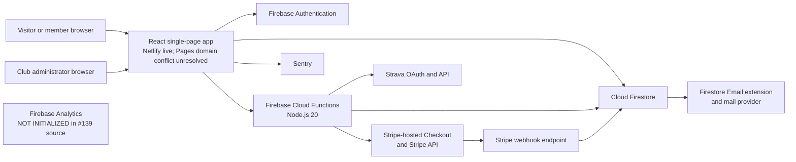

Text alternative: browsers can use the React app, Auth, Firestore, Functions, Stripe, email, Strava, and the separately bounded Sentry path; #139 source has no browser-to-Firebase-Analytics data path, but website publication and provider behavior are not proven here.

### Current component inventory

| Layer | Current implementation | Primary locations | Assessment |
| --- | --- | --- | --- |
| Public and account UI | React 18, React Router 6, mixed JS/TS, Create React App | `src/App.jsx`, `src/pages`, `src/components` | Functional, but the build stack and several dependencies are stale. |
| Identity | Firebase email/password Auth and custom role claims | `src/services/identity`, `functions/signup.js`, `functions/setMemberRole.js` | Reasonable base; admin assurance and role-change audit controls need strengthening. |
| Operational data | Cloud Firestore | `src/services`, `firestore.rules`, `firestore.indexes.json` | Appropriate for current scale; counters and state transitions require transactional design. |
| Server API | First-generation Firebase callable/HTTP/trigger functions | `functions/` | Prototype covers most workflows; validation, idempotency, and isolation are incomplete. |
| Payments | Stripe Checkout Sessions, Payment Links, refunds, signed webhook | `functions/createCheckoutSession.js`, `createMerchCheckout.js`, `stripeWebhook.js` | Not ready for live payments until P0 issues are complete. |
| Hosting and release | Netlify currently answers `runmprc.com`. GitHub Pages still reports the same custom domain, so its default URL redirects to the Netlify-served name instead of providing an independent copy. #135 source stops ordinary automatic releases, pauses Git-triggered Netlify production builds, and removes the Pages CNAME from future protected artifacts. WEB-UX-001A [#457](https://github.com/Run-MPRC/Run-MPRC.github.io/issues/457) used one temporary web-only exception: its manifest named one expected `main` parent, one release-specific source ref, one independently reviewed source commit/tree, and the exact artifact count/digest; its preview and production built that same artifact and refused every mismatch. The manifest is now inactive and the release source is retired. | `netlify.toml`, `config/netlify-production-release.json`, `scripts/netlify-release-policy.js`, `.github/workflows/deploy.yml`, `public/404.html` | Split and conflicting as verified 2026-07-22. Netlify deploy `6a61c544171ea80008307623` is the dated #457 web-only result. The exact rollback source remains, but #457 did not deploy Firebase or complete the general protected host, ownership, DNS, header, or rollback work under #133/#136/WEB-001. |
| Email | Firestore `mail` outbox designed for the Firebase Trigger Email extension | `functions/sendConfirmationEmail.js` | Extension/provider deployment is unverified; outbox creation is not transactionally idempotent and HTML needs escaping. |
| Observability | Optional Sentry; Firebase Analytics configuration remains but its runtime is not initialized by #139 source | `src/services/monitoring`, `src/services/analytics` | #134 source bounds Sentry payloads. #139 source removes every application runtime Firebase Analytics import, initialization, and emission while preserving no-op call compatibility. Website publication, provider collection/cookies and historical data, consent, retention, access, deletion, and vendor configuration remain unverified under #110/#111. |
| Third-party fitness | Strava OAuth tokens and statistics | `functions/strava.js`, `src/services/strava` | Functional prototype. The #100 source Rules deny browser token access, but Firebase deployment is unproven and transactional refresh, scopes/revocation, IAM/encryption decision, and audit remain OAUTH-001. |

The former workflow automatically published Pages before attempting Firebase and could finish green after skipping Firebase. #135 replaces that source path with a manual exact-current-commit request, exact latest CI checks, one fixed backend plan, protected short-lived identity wiring, provider readback, and Firebase-before-Pages publication. Missing authority or failed/partial verification is red. Ordinary Git-triggered Netlify production builds stop. The temporary #457 web-only path continued only for a production `main` merge with the exact first parent in its active manifest, then independently fetched and verified the pinned source commit and tree before building; a later merge, disabled manifest, wrong branch/context/ref/tree/artifact, build-hook metadata, or any uncertainty stopped. The pinned build received no React/provider or server credential environment, and its release PR built the same exact artifact as production. The authorization was exact-merge scoped rather than durable one-time state. The manifest is now inactive and the release-specific source ref is deleted, so later retries fail. Build hooks and a reusable protected Netlify publication path remain unverified. No source test clears the current Pages custom-domain claim, configures #133, or deploys #136; those remain separate provider states. The App Engine synchronization script is another surface that must be documented as active or retired.

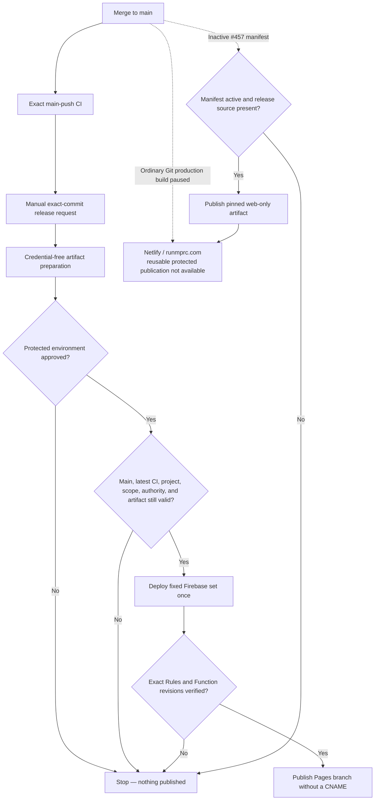

Text alternative: ordinary merges run CI and do not publish Netlify; the completed #457 gate is inactive and its release source is absent, while the separate protected workflow still requires approval and verified Firebase before publishing its Pages copy.

### GitHub Pages callback handoff

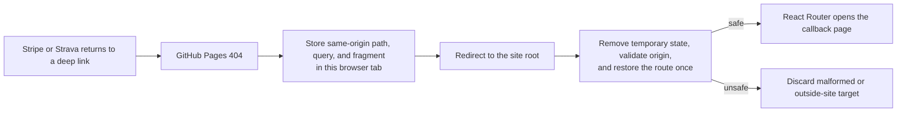

Text alternative: the 404 page temporarily carries the complete return route to the root page; an early referrer policy keeps the path/query/fragment out of subresource request headers, and the root page deletes the temporary value before accepting only a same-origin route. App Check, Analytics, and Sentry stay off on that initial capability-bearing callback. The bridge does not prove payment, OAuth state, or identity. Server/provider verification still decides the result.

### Strava callback current-address cleanup — source only, not live

OAUTH-001C1G [#335](https://github.com/Run-MPRC/Run-MPRC.github.io/issues/335) adds a second boundary after the existing Pages handoff. The Strava callback keeps only its initial `code`, `state`, and provider-error fields in temporary component memory. It replaces the current native browser and React Router entry with the same path, no address details after `?` or `#`, and no saved callback detail before the callback mounts its Auth/service work, checks the required fields, or starts the server exchange attempt.

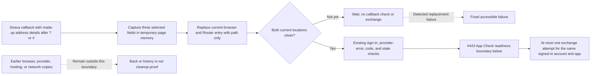

Text alternative: the callback captures three selected made-up fields in temporary page memory, replaces the current browser and Router entry with the clean path, and proceeds to the callback checks only after both current locations are clean. The separate #443 readiness boundary follows those checks before an exchange. Unconfirmed cleanup waits without an exchange. A detected replacement failure shows the fixed stop. Cleaning the current entry does not erase earlier browser or outside copies.

The source also discards a later same-route callback. After unmount or a signed-in UID, service, Firebase resources, or app change, an obsolete browser result cannot navigate or show success. That does not cancel an exchange that already reached the server or provider; its outcome may still occur and require separate reconciliation. The #443 boundary below adds source-only App Check readiness after this cleanup, and the following #441 boundary supplies source-only server-issued state, UID/session binding, expiry, and one-use consumption without changing the cleanup order. Source, tests, merge, website publication, `runmprc.com` revision verification, Firebase deployment, Enterprise provider configuration, Strava configuration, production data, and live OAuth behavior remain separate states. Canonical [#88](https://github.com/Run-MPRC/Run-MPRC.github.io/issues/88) remains open for native App Check enforcement, account and scope policy, refresh concurrency, reconciliation, revoke/audit, IAM/encryption, provider configuration, deployment, and live proof.

### Strava clean-page App Check handoff — source only, not live

OAUTH-001C1I [#443](https://github.com/Run-MPRC/Run-MPRC.github.io/issues/443) preserves #99's initial App Check suppression for every capability-bearing callback. The Firebase resources remember whether this document began on a normalized Strava callback, including the approved plain, percent-encoded-segment, case-changed, and trailing-slash forms. Only after #335 proves that the current native and React Router paths still identify that callback, both locations have empty query and fragment state, Router page state is `null`, and native history state is absent or the exact matching BrowserRouter index/key/empty-user-state record may the callback ask one narrow Strava-specific method to prepare App Check.

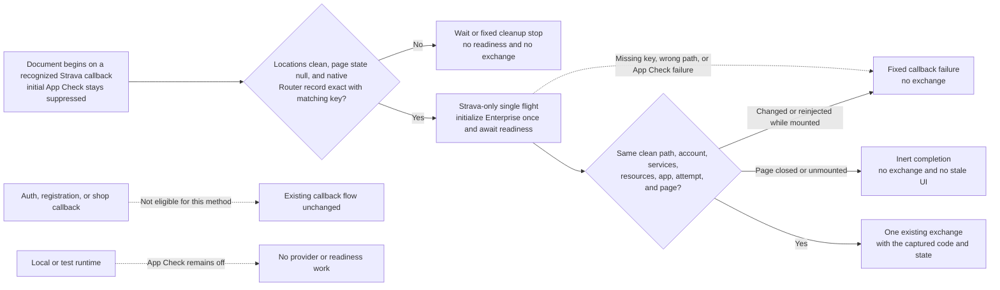

Text alternative: a recognized Strava callback keeps initial App Check startup suppressed until both current locations are clean, page state is null, and native history is absent or contains only the matching Router index, key, and empty user state. The Strava-only single-flight method then initializes the existing Enterprise provider at most once and waits for readiness. Only the same clean current account, services, Firebase resources, app, attempt, Router entry, and mounted page may admit one existing exchange. A dirty, wrong, failed, stale, extra-state, or reinjected mounted attempt before that admission uses the fixed stop without an exchange. Closing or unmounting the page makes a pending completion inert without stale UI. Other callback types are not eligible and keep their existing flow; App Check stays off locally and in tests.

The method never receives the callback code or state. It awaits one App Check token-ready result without returning, inspecting, logging, or storing that result or any provider detail. Missing public configuration, Enterprise construction or initialization failure, token-readiness failure, a wrong or dirty current path, or an obsolete mounted callback before exchange admission uses the existing fixed callback failure and sends no exchange. An unmounted pending callback is inert. Concurrent callers share the same readiness attempt, ordinary production pages retain eager Enterprise initialization, and local/test emulator isolation remains unchanged.

App Check initialization cannot be reversed. A later same-document callback reinjection is still scrubbed and discarded under #335; this source rechecks the current locations and lifecycle around readiness but does not erase earlier browser, hosting, provider, or network copies. Once an exchange has been admitted, a later lifecycle or reinjection change cannot cancel server or provider work already started; it only blocks another exchange and prevents an obsolete completion from changing the page, so reconciliation may still be required. The handoff creates no membership, discount, payment, member, or admin authority. This source does not create or configure an Enterprise key or allowed-domain policy, prove a provider-backed token, enable native runtime App Check enforcement, change a Function or Rule, deploy Firebase or the website, contact Strava, inspect production data, or prove live OAuth behavior. Those states remain separate under [#88](https://github.com/Run-MPRC/Run-MPRC.github.io/issues/88), ABUSE-001A2, and the protected release issues.

### Strava server-issued one-use state — source only, not live

OAUTH-001C1H [#441](https://github.com/Run-MPRC/Run-MPRC.github.io/issues/441) replaces browser-generated, `sessionStorage`-authoritative OAuth state with one server-issued challenge. The signed-in website calls `stravaBeginAuthorization`; after the existing App Check and Auth guards, the Function creates 32 random bytes, returns the base64url challenge, and stores only its SHA-256 digest in one fixed server-only `members/{uid}/secrets/stravaOAuthState` record. The record is bound to the exact UID and decoded Firebase Auth `auth_time`, expires after ten minutes, and is overwritten by a later begin request for the same UID.

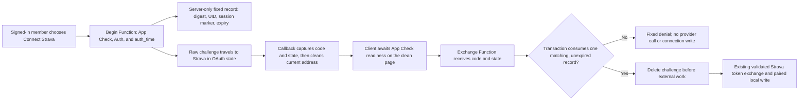

Text alternative: a signed-in member receives one short-lived Strava state value while the server retains only its digest and identity/session binding; after the callback address is clean and the client-side source awaits App Check readiness, one transaction deletes the matching record before the existing provider exchange, while every mismatch, expiry, replay, or concurrent loser stops without contacting Strava or changing the connection.

The state transition is `absent -> active`, or `active-old -> active-new` when connection is started again, followed by exactly one `active -> consumed` transaction. Missing, malformed, wrong-UID, wrong-session, expired, mismatched, already-consumed, and concurrently lost attempts share a fixed public failure and perform no provider or connection write. A provider or persistence failure after consumption does not restore the challenge; the member must start again. Because there is one fixed per-UID record that is overwritten or deleted, this additive source change needs no backfill or collection migration. Existing Firestore Rules already deny every browser read and write under `members/{uid}/secrets/{secretId}`.

This source does not prove the custom App Check guard is fail-closed in a deployed environment, enable native runtime App Check enforcement, configure or contact Strava, deploy Firebase or the website, inspect production data, or prove live OAuth behavior. #443 supplies only the reviewed source/test clean-page readiness handoff while preserving initial callback suppression. Configured Enterprise token evidence, missing/invalid/valid runtime-token proof, native enforcement, provider configuration, protected release, and live verification remain separate work under [#88](https://github.com/Run-MPRC/Run-MPRC.github.io/issues/88), ABUSE-001A2, and the protected release issues.

### Firebase Auth action link — source only, not live

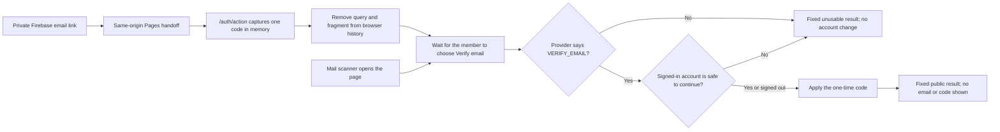

Text alternative: after the website hands off the action route, the app keeps one code only in component memory, removes it from both the visible address and router location, makes no account change when a scanner merely opens the page, and applies it only after a person chooses the button and Firebase confirms the verification operation. The result never grants membership or writes a member profile.

AUTH-MAIL-002C2 [#194](https://github.com/Run-MPRC/Run-MPRC.github.io/issues/194) owns this verification-only source route. It ignores query-provided API keys and continuation URLs, suppresses Sentry and App Check startup while the initial capability is present, and returns only small non-identifying states. Its fixed `/account` exit performs a full clean-page load so App Check can start only after the private query is gone. Firebase configures one custom handler for verification, password reset, and email recovery. Therefore [#119](https://github.com/Run-MPRC/Run-MPRC.github.io/issues/119) must not point the project-wide action URL at this partial route. Keep Firebase's default multi-mode handler or wait for separately reviewed coverage of every enabled mode. Website publication, provider configuration, action-link reachability, and the Firestore verification mirror remain unproven.

The direct-rewrite hosting path does not need browser storage. The existing GitHub Pages fallback from #99 briefly places the complete return route in tab-local `sessionStorage`, then its first root-page script reads and deletes that value before React starts. If the root page never loads, the value can remain until the tab closes. #194 accepts that already-merged residual only for Pages compatibility; it does not call this “memory only.” A future direct SPA rewrite should remove the bridge. The component itself never writes the code to storage or router state.

## 4. Target deployment topology

The target keeps React, Firebase, and Stripe, but places stronger boundaries around them. Migrating the frontend from GitHub Pages to Firebase Hosting is recommended before live commerce because it supports controlled SPA rewrites, preview channels, and security headers. That hosting migration is not required to design or test the backend, and must be executed as its own issue.

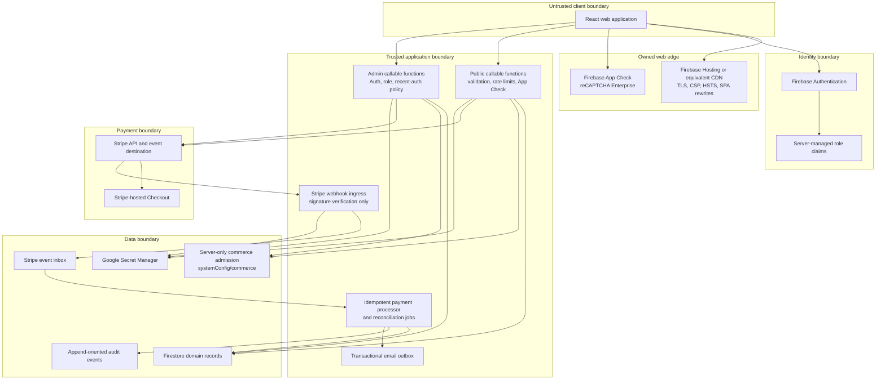

Text alternative: checkout and refund commands read both domain records and the server-only commerce control; the signed webhook path does not depend on that control and continues processing payment evidence.

## 5. Trust boundaries and authorization

| Boundary | Trusted assertions | Never trust directly |
| --- | --- | --- |
| Browser | A Firebase ID token after SDK/server verification; an App Check token after Firebase verification | Price, member status, registration status, order status, redirect query parameters, product availability, capacity, inventory, or admin UI visibility |
| Firebase Auth | UID, verified token claims, token timestamps | A role copied into Firestore or sent in the request body |
| Stripe webhook | Event payload only after raw-body signature verification with the endpoint's secret | An unsigned request, a browser success redirect, or a client-provided Session ID without server retrieval/validation |
| Firestore client SDK | Reads and writes allowed by the deployed ruleset | The presence of a hidden UI control as authorization |
| Cloud Functions/Admin SDK | Application code and IAM-scoped service identity | Firestore rules as protection; Admin SDK bypasses those rules |
| GitHub Actions | Pinned workflow and environment-scoped secrets | Pull-request code with production secrets or a shared, long-lived deployment token |

### Roles

The current `unverified`, `member`, and `admin` claims should evolve toward capabilities rather than one all-powerful role. A practical first split is:

| Capability | Example users | Allowed operations |
| --- | --- | --- |
| `member` | Verified club member | Members-only content and member price |
| `event_manager` | Race director | Event content, roster, comps, substitutions; no global member roles or merchandise refunds |
| `shop_manager` | Merchandise lead | Catalog, orders, tracking, fulfillment; no event or membership administration |
| `finance_admin` | Treasurer | Refunds, reconciliation, disputes, reports |
| `identity_admin` | Membership lead | Membership verification and role administration |
| `platform_admin` | Very small break-glass group | Security configuration and role grants |

The first release may continue using `admin` in the UI, but server endpoints and Firestore rules should be narrowed by resource now so future capability claims can be introduced without rewriting payment logic.

### Current verified-role boundary — source only, not live

AUTH-001A [#98](https://github.com/Run-MPRC/Run-MPRC.github.io/issues/98) requires an authoritative verified target before the existing grant endpoints can add `member` or `admin`. AUTH-001B [#196](https://github.com/Run-MPRC/Run-MPRC.github.io/issues/196) requires exact boolean Firebase token claim `email_verified == true` in addition to the existing role for role-based Firestore access. AUTH-001C [#209](https://github.com/Run-MPRC/Run-MPRC.github.io/issues/209) applies the same second gate to current Functions role consumers: shared admin callables, member-only/member-price checkout decisions, and registration CSV export. AUTH-001D1 [#213](https://github.com/Run-MPRC/Run-MPRC.github.io/issues/213) mirrors that decision in the browser so an unverified role-bearing token cannot make member/admin controls look available before the server denies them.

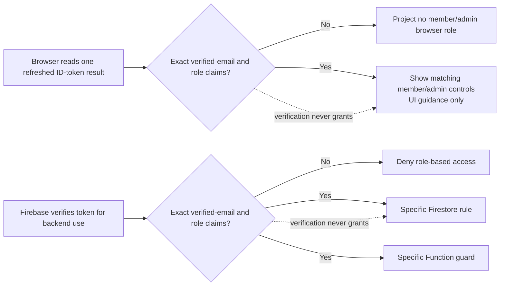

Text alternative: the browser shows member/admin controls only when one refreshed token result contains exact verified-email and role claims, while Firebase independently verifies the same two facts before a specific database rule or Function uses the role; browser display is not authority and verification alone grants nothing.

The Functions policy reads decoded-token `email_verified`, not the camel-case Auth user-record field used while granting a role and not the `emailVerified` profile mirror. The browser policy also reads only the refreshed ID-token claims. Neither accepts a request or profile substitute. Missing, false, string, numeric, inherited, accessor-backed, proxied, unknown, or case-changed claims fail closed. Exact `unverified` remains a non-authoritative display state. Unauthenticated and unauthorized responses remain generic. This does not provide authoritative membership, scoped capabilities, MFA/recent-auth, token revocation, safe roster projection, or legacy-sync retirement.

All four slices are source boundaries until the exact Rules, Functions, and website revisions are deployed through the protected backend-first release and checked with synthetic staged identities. A source merge or green CI run is not live access proof.

## 6. Domain model and ownership

### Current collections

| Path | Purpose | Source of writes | Sensitivity |
| --- | --- | --- | --- |
| `events/{eventId}` | Event content, schedule, pricing configuration, capacity, waiver version | Admin client today; target event-management API for sensitive fields | Public or members-only |
| `events/{eventId}/registrations/{registrationId}` | Participant identity, waiver evidence, payment references, lifecycle | Cloud Functions and admins today; target Cloud Functions only | Restricted PII and financial metadata |
| `products/{productId}` | Merchandise catalog | Admin client today | Public plus internal configuration |
| `orders/{orderId}` | Buyer, shipping, payment, and fulfillment data | Cloud Functions and admins today; target Cloud Functions only | Restricted PII and financial metadata |
| `members/{uid}` | Profile and role mirror | Create-once signup/recovery Functions create phone-free pending profiles; self-service name-only allowlist while #178/#197 pause phone collection; server role operations | Confidential |
| `members/{uid}/connections/{provider}` | Non-secret connection metadata | Cloud Functions | Confidential |
| `members/{uid}/secrets/{provider}` | OAuth tokens | Cloud Functions | Restricted secret |
| `members/{uid}/secrets/stravaOAuthState` | One transient Strava state digest with UID/Auth-session binding and expiry; raw state is never stored | Cloud Functions | Restricted security state |
| `promoCodes/{id}` | Intended promotion configuration | Admin only | Confidential; currently not integrated into checkout validation |
| `ratelimits/{bucket}` | Abuse-control counters | Cloud Functions | Confidential operational data |
| `mail/{id}` | Transactional email outbox | Cloud Functions and email extension | Restricted PII |

### Target additions and changes

| Path or field | Purpose |
| --- | --- |
| `stripeEvents/{stripeEventId}` | Durable, non-PII webhook inbox/deduplication record with processing status and business reference |
| `checkoutRequests/{commandKeyHash}` | Immutable server-only command registration. PAY-002B2A/#165 owns the exact `registered` revision-1 record. |
| `checkoutRequests/{commandKeyHash}/lifecycle/current` | PAY-002B2B/#169 server-only lease, monotonic fence, and terminal commitment source. It is unused and is not provider-send permission. |
| `checkoutRequests/{commandKeyHash}/providerAttempts/0000000001` | PAY-002B2C1/#173 immutable lease-bound initial Stripe plan. It stores command-bound commitments, is unused, and is not account proof or provider-send permission. |
| `checkoutRequests/{commandKeyHash}/providerAttempts/0000000001/sendEvidence/first` | PAY-002B2C2/#182 separate server-only pre-POST marker with a complete C1-plan digest, its originating fence, trusted time, and persisted 23-hour automatic-retry deadline. It is unused and does not say Stripe received or completed a request. |
| `checkoutRequests/{commandKeyHash}/providerAttempts/0000000001/reconciliationEvidence/0000000001` | PAY-002B2C3B/#206 immutable server-only C3A candidate evidence. It is bound to the exact C1 plan, complete C2 record/audit, observed expired lease, and trusted time. It is unused and grants no later-attempt or send permission. |
| `checkoutRequests/{commandKeyHash}/providerAttempts/0000000001/reconciliationEvidence/0000000001/nextAttemptAuthorizations/0000000002` | PAY-002B2C3C/#226 immutable server-only authorization for one later logical provider attempt. It requires the exact C3B pair, a matching closed transition commitment, and a fresh active lease. It is unused and grants no plan or send permission. |
| `checkoutRequests/{commandKeyHash}/providerAttempts/0000000002` | PAY-002B2C4A/#232 immutable server-only attempt-2 plan. It requires the exact C3C authorization pair and current active lease. Version 1 preserves the attempt-1 account/mode/API/operation/endpoint/parameters and grants no send permission. |
| `checkoutRequests/{commandKeyHash}/providerAttempts/0000000002/sendEvidence/first` | PAY-002B2C4B/#238 immutable server-only attempt-2 pre-POST marker. It binds the complete authorized C4A plan with commitment version 2, the current fence/time, and a fixed 23-hour deadline. It is unused and does not say Stripe received or completed a request. |
| `auditEvents/{eventId}` or bounded per-record audit subcollections | Append-oriented operational and security audit trail. B2A's first event is `commerce_command_{commandKeyHash}_0000000001`; B2B appends one deterministic event for each real lifecycle change; C1 binds the first plan with `commerce_provider_attempt_{commandKeyHash}_0000000001`; C2 pairs the attempt-1 pre-send marker with `commerce_provider_send_{commandKeyHash}_0000000001`; C3B pairs candidate evidence with `commerce_provider_reconciliation_{commandKeyHash}_0000000001_0000000001`; C3C pairs later-attempt authorization with `commerce_provider_authorization_{commandKeyHash}_0000000001_0000000001_0000000002`; C4A binds the second plan with `commerce_provider_attempt_{commandKeyHash}_0000000002`; C4B pairs its pre-send marker with `commerce_provider_send_{commandKeyHash}_0000000002`. |
| `events/{id}.capacityCounters` | Transactionally maintained participant reservations, paid seats, and released seats |
| `products/{id}/variants/{variantId}` | SKU, option values, price, on-hand, reserved, and sold counts |
| `orders.paymentStatus` and `orders.fulfillmentStatus` | Separate money state from physical fulfillment state |
| `registrations.paymentStatus` and `registrations.registrationStatus` | Separate payment lifecycle from attendance/transfer/cancellation lifecycle |
| `orders/registrations.stateSchemaVersion` and `refundStatus` | Version the split business-record state contract and keep confirmed refund status/total separate from payment/operational state |
| server-only per-dispute records | Keep one state per Stripe dispute; never collapse multiple disputes into one canonical order/registration `disputeStatus` |
| `retentionJobs/{jobId}` | Optional operational record of scheduled minimization/deletion work |
| `systemConfig/commerce` | Versioned global/domain command admission; browser read/write denied; protected writer is not available yet |
| `events/{id}.checkoutEnabled` and `products/{id}.checkoutEnabled` | Explicit server-owned resource admission; missing means disabled |

Large `auditLog` arrays on registration and order documents should be replaced before they approach Firestore document-size and write-contention limits. New audit data should be append-oriented.

PAY-002A1 is tracked in live [#161](https://github.com/Run-MPRC/Run-MPRC.github.io/issues/161). Numeric local `stateSchemaVersion: 1` is distinct from string Stripe metadata `schemaVersion: "1"`, which only versions provider reference binding. The reducers and legacy classifier are a pure source/test target: they import no Firebase or Stripe code, make no call, and are not used by an endpoint. Current records, webhook behavior, compatibility writes, real migration, deployment, and live state remain unchanged until later PAY-002/PAY-003 children adopt the contract.

PAY-002B1 is tracked in live [#163](https://github.com/Run-MPRC/Run-MPRC.github.io/issues/163). It is also pure and unused: it separates a caller/environment/UUID command key from a command-type/payload fingerprint, then derives a deterministic Stripe key for one immutable provider attempt. Production/live and non-production/test are the only accepted environment/mode pairs. The command key intentionally excludes command type so a journal can reject reuse of one caller command ID for another operation. Hashes are pseudonymous server-only identifiers—not anonymization—and must not enter browsers, logs, URLs, or analytics. The library contains no Firestore transaction, lease, clock, result, audit, Stripe call, or authorization decision.

PAY-002B2A is tracked in live [#165](https://github.com/Run-MPRC/Run-MPRC.github.io/issues/165). Its unused server-only transaction writes the exact `checkoutRequests/{commandKeyHash}` registered record and `auditEvents/commerce_command_{commandKeyHash}_0000000001` event together with one trusted Timestamp, or writes neither. Exact retries are read-only; command-type, endpoint-version, or payload mismatch under the same B1 key conflicts; corrupt or incomplete pairs fail closed without repair. Environment and caller scope are already bound into the B1 document ID, so a different scope creates a different record rather than a cross-scope conflict. The fixed result grants no authorization or execute/send permission and contains no hash, path, raw identity, UUID, or payload.

B2A has no endpoint/index export, lease, fence, terminal commitment, result replay, provider plan/key/object, Stripe call, provider attempt transition, safe-send clock, or reconciliation behavior. PAY-002B2B source/tests are tracked in live [#169](https://github.com/Run-MPRC/Run-MPRC.github.io/issues/169). They keep the B2A root and revision-1 audit immutable and store mutable state at `checkoutRequests/{commandKeyHash}/lifecycle/current`. The source uses a fixed 60-second server lease, a command-bound fingerprint of a trusted UUID v4 holder, and a monotonic fence so stale or expired workers cannot finish. Each real lease or terminal change gets one deterministic audit event.

B2B terminal success stores only a command-bound commitment to a later server-only business result. That commitment is not the result itself, proof that Stripe or Firestore work happened, or response replay. The lease/fence is concurrency evidence, not authorization or provider-send permission. PAY-002B2C1/#173 owns immutable initial-plan binding. PAY-002B2C2/#182 owns only separate pre-send evidence and a conservative automatic-retry cutoff. B2C3 still owns verified reconciliation and safe attempt advancement. No TTL is safe yet: deleting both C2 partners would look like first use, so [#110](https://github.com/Run-MPRC/Run-MPRC.github.io/issues/110) must approve retention and a server-only tombstone or equivalent durable duplicate barrier before a command pair can be deleted.

PAY-002B2C1 source/tests are tracked in live [#173](https://github.com/Run-MPRC/Run-MPRC.github.io/issues/173). With the exact current unexpired lease/fence, the unused journal can atomically create the immutable attempt-1 plan plus `auditEvents/commerce_provider_attempt_{commandKeyHash}_0000000001`. The first version accepts only the static `checkout_session_create` → `/v1/checkout/sessions` mapping, so an object ID or capability cannot enter the stored path. The plan also fixes Stripe mode, API version, original binding fence, and command-bound commitments to the account, canonical parameters, and deterministic B1 key. Raw account/parameters/key are absent. An existing plan is accepted only when its binding time fits the deterministic lifecycle audit for its original fence. An exact active-lease retry is read-only; a valid takeover may observe but cannot rewrite the plan; conflicts and malformed or missing partners fail closed.

These commitments are pseudonymous equality evidence, not authorization, configured-account proof, a pre-POST marker, provider-execution proof, or response replay. PAY-002B2C2 source/tests are tracked in live [#182](https://github.com/Run-MPRC/Run-MPRC.github.io/issues/182). Its unused transaction recomputes the exact B1 identity and C1 plan, requires the exact active lease holder/fence, and creates only the separate marker/audit pair. Both partners bind a command-bound digest of every immutable C1 plan field, so a later coherent account, API-version, endpoint, parameter, key-commitment, or binding change cannot reuse the marker. Version 1 persists a deadline exactly 23 hours after the pre-POST marker. The first atomic creation, and an exact attempt-1 retry, are classified `send_permitted` only when a post-transaction trusted-time check is still strictly before the transaction-validated lease's captured expiry and the stored deadline. The second check does not re-read lifecycle state. Equality, later time, rollback, or paired missing/unreadable time is classified `reconciliation_required`; no attempt advancement follows.

The fixed C2 result is narrow retry-safety evidence. It is not caller authorization, configured-account proof, a claim that Stripe received the POST, a provider outcome, or response replay. Timeout, connection loss, `5xx`, a missing object reference, and incomplete search are deliberately not C2 inputs and cannot manufacture attempt `2`. B2C3 remains responsible for verified reconciliation evidence and safe later-attempt authorization. #173/#182 have no runtime/index import, Stripe/network call, Firebase deployment, provider configuration, production data, website, or live/officer effect.

PAY-002B2C3A source/tests are tracked in live [#184](https://github.com/Run-MPRC/Run-MPRC.github.io/issues/184). The unused pure policy accepts only one exact flat version-1 Stripe attempt-1 evidence record made from closed enums. It returns one of three frozen non-identifying results: `existing_attempt_found` with `do_not_advance`, `new_attempt_candidate` with `requires_persistence_and_authorization`, or `reconciliation_required` with `requires_reconciliation`. Only the matching complete tuple for trusted proof that endpoint execution never began, or the matching complete tuple for an exact verified expired/unpaid Session plus verified expiry and an explicitly eligible new logical generation, can be a candidate. The matching complete exact-open or verified-success tuple identifies an existing attempt. Every single-field difference, timeout, lost connection, provider error category, old/pruned key, missing reference, not-found result, empty/partial search, processing/unknown state, mismatch, or conflict requires reconciliation.

C3A classification is not authorization or provider truth. The module accepts no IDs, keys, accounts, metadata, money, timestamps, business/member values, free text, URLs, or caller-selected status codes. It stores nothing, calls nothing, is imported by no runtime entry point, and cannot create attempt `2`.

PAY-002B2C3B source/tests are tracked in live [#206](https://github.com/Run-MPRC/Run-MPRC.github.io/issues/206). The unused journal imports the unchanged C3A classifier and may persist only its exact `new_attempt_candidate` result. The deterministic evidence/audit pair is created atomically only when the complete C2 record/audit is valid, the 23-hour automatic retry deadline has arrived, and the current validated lease is expired. Equality is allowed because C2 stops automatic POST at its deadline and lease expiry. A still-active lease or an early candidate returns the unchanged C3A candidate without writing. Exact retries are read-only; a changed valid evidence tuple conflicts; a missing, malformed, orphaned, future, or foundation-mismatched pair fails closed without repair.

C3B stores only closed C3A enum values, schema versions, command-bound C1/C2 commitments, the observed fence/expiry, and one trusted time. A digest covers the complete evidence record and is carried by its deterministic audit. Raw account, key, parameters, provider/business/member IDs, money, URLs, free text, response data, and attempt `2` are absent. The fixed persisted result says only `requires_separate_authorization`. C3C must still require this proof, an allowed business transition, and a fresh lease before it can authorize/version a later attempt. Neither C3A nor C3B retrieves provider truth, calls Stripe, replays a response, changes a business record, or has a runtime/index edge. No Firebase/Stripe deployment, provider configuration, production read/write, website, or officer behavior is changed by #184/#206 source.

PAY-002B2C3C source/tests are tracked in live [#226](https://github.com/Run-MPRC/Run-MPRC.github.io/issues/226). The unused `authorizeNextStripeProviderAttempt` API consumes only the exact validated C3B pair. It repeats the complete safe-tuple check, requires either the matching `retry_same_operation` or `replace_expired_unpaid` transition, command-binds an opaque transition-record commitment, and requires the exact current holder/fence under a lease acquired at or after C3B persistence with a later fence.

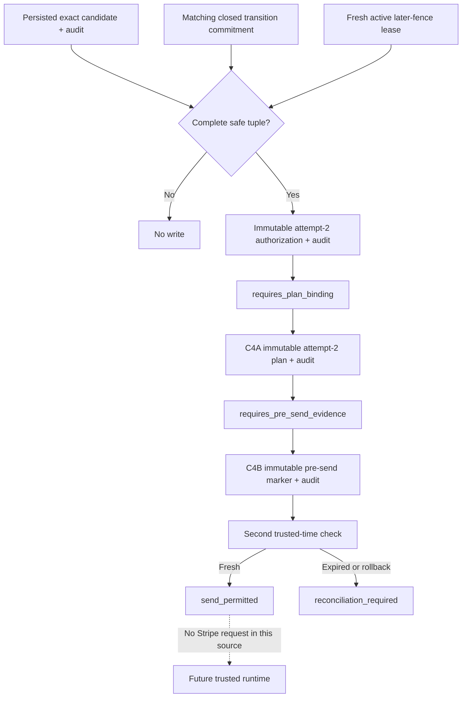

Text alternative: one exact saved safe candidate, matching transition, and fresh lease can authorize attempt 2; C4A may bind its plan, and C4B may record pre-send evidence only while a second clock check remains before the captured lease expiry and fixed deadline; none of these source steps calls Stripe.

The record/audit pair binds the command identity; complete C1, C2, and C3B commitments; environment/mode/operation; attempts `1` and `2`; transition kind and command-bound transition-record commitment; a command-derived attempt-2 key fingerprint; the fresh lease fence; and one trusted time. It stores no raw key, account, parameters, identity, money, URL, response, free text, or personal data. The opaque transition commitment is not current business-state proof; a future runtime must derive it from a trusted business-record transaction. Exact retry and later-lease observation are read-only. Changed valid input conflicts. Orphaned, malformed, future, unsafe, or foundation-mismatched data fails closed without repair.

The fixed result is `provider_attempt_authorized` with `requires_plan_binding`; it contains no execute/send flag or sensitive value. #226 creates no attempt-2 provider plan or pre-send record, changes no business record, calls no provider, and has no endpoint/index edge. Firestore Rules source remains unchanged and browser roles remain denied. This is synthetic source/test design evidence only: Firebase deployment, Stripe configuration, production data, website publication, live behavior, and the PAY-002C/D/PAY-003B runtime adoption remain open.

PAY-002B2C4A source/tests are tracked in live [#232](https://github.com/Run-MPRC/Run-MPRC.github.io/issues/232). The unused `bindAuthorizedStripeProviderPlan` API revalidates the exact B1-through-C3C chain and current active lease before atomically creating the immutable attempt-2 plan and its deterministic audit. Version 1 is equality-only: account, mode, API version, operation, endpoint, and canonical parameters equal attempt 1. Only the internally derived attempt-2 key commitment, current binding fence/time, attempt number, and C3C provenance may differ.

The fixed result is `provider_plan_bound` or `provider_plan_existing`, with `requires_pre_send_evidence`. Exact retry and later valid lease observation are read-only; changed valid input conflicts; malformed, orphaned, future, impossible-chronology, or foundation-mismatched partners fail closed. The pair stores no raw identity, account, parameters, key, money, URL, response, secret, or personal data. C4A creates no send evidence, changes no business record, calls no provider, and has no endpoint/index edge. PAY-002B2C4B [#238](https://github.com/Run-MPRC/Run-MPRC.github.io/issues/238) owns the separate attempt-2 pre-send boundary below. Other Stripe operations require their own reviewed boundaries.

PAY-002B2C4B source/tests are tracked in live [#238](https://github.com/Run-MPRC/Run-MPRC.github.io/issues/238). The unused `recordAuthorizedStripeSendEvidence` API revalidates B1 through C4A plus the current active holder/fence before creating the attempt-2 marker and deterministic audit, or neither. Both carry `providerPlanCommitmentSchemaVersion: 2`, a digest of every C4A plan field and nanosecond binding time including the authorization schema and commitment. Existing version-1 commitment bytes remain unchanged.

The marker time is captured once before the transaction; its deadline is exactly 23 hours later and never moves on retry. After the transaction, a second trusted-time check does not re-read lifecycle state. Permission requires no rollback and a time strictly before both the captured current lease expiry and stored deadline. Equality, later time, rollback, or missing/unreadable paired time returns fixed `reconciliation_required`. Exact retry and a later valid lease observation are read-only inside the original deadline. The fixed permitted result is only `send_permitted` with `pre_send_recorded`; it does not prove caller authority, current business state, Stripe-account control, request execution, or a provider result.

C4B stores no raw identity, account, parameters, key, transition value, money, URL, response, secret, or personal data. It is limited to `checkout_session_create` at `POST /v1/checkout/sessions`; it cannot create attempt `3`, call Stripe, write a business record, or enter an endpoint/index. Product/Price creation, Session expiry, refunds, and privileged provider actions require separate operation-specific plan, pre-send, result, and reconciliation boundaries.

PAY-002B2C4C1 source/tests are tracked in live [#246](https://github.com/Run-MPRC/Run-MPRC.github.io/issues/246). The unused pure `classifyAuthorizedStripeCheckoutResultEvidence` API accepts only a primitive, length-bounded, canonical JSON string encoding the reported 16-field attempt-2 Checkout Session assertion envelope. Parsing creates the ordinary record inside the module; non-string objects fail before property access. Its sole matching output is `unbound_result_candidate` with `requires_dispatch_evidence_persistence_and_business_validation`; every other valid closed tuple reconciles and every malformed or non-canonical serialized value fails with one fixed redacted error.

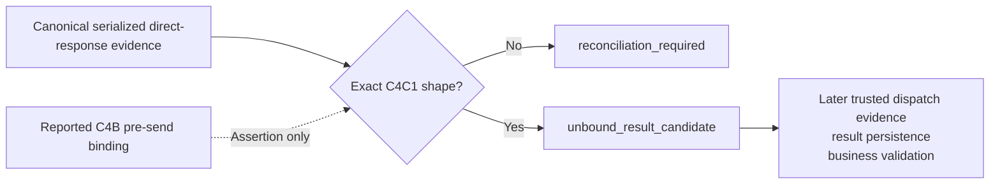

Text alternative: canonical serialized reported evidence may produce only an unbound shape candidate, which must stop until later trusted dispatch evidence, result persistence, and business validation exist.

C4C1 creates no persisted collection or audit row. It has no dispatch or idempotency proof, parses no raw Stripe object, stores no Session reference or URL, and has no journal, endpoint, index, provider, business-state, Rules, or deployment edge. C4B does not point directly to a trusted result: both the reported response and pre-send binding are untrusted assertions until a future adapter and runtime boundary validate them.

### C4C2A Stripe SDK response observation — TEST ONLY, UNUSED

PAY-002B2C4C2A is tracked in live [#275](https://github.com/Run-MPRC/Run-MPRC.github.io/issues/275). One Node 20 suite calls the installed `stripe` 14.25.0 public Checkout Session create path through the SDK's exported but experimental/unstable `HttpClient` interface and a fully synthetic in-memory fake. This is an installed-version observation and dependency-upgrade gate, not a provider contract. It observes selected own data properties and `lastResponse`: the same fake raw-response object attached by the SDK as an own non-enumerable, non-writable property. Header-derived fields added by the SDK are observed separately from `statusCode`, which the fake raw object supplies; this is not an exhaustive model of a production `IncomingMessage`.

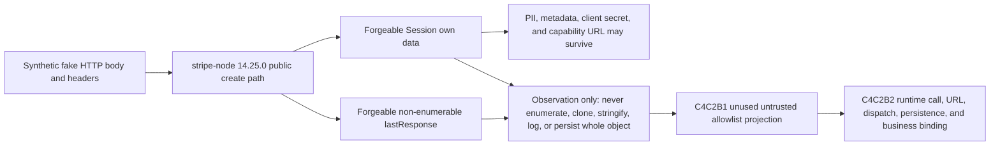

Text alternative: a fake HTTP client can make the public SDK return a Session and response metadata containing controlled values, including sensitive fields and an unvalidated URL. C4C2A is only an installed-version test observation; C4C2B1/#280 adds only an unused untrusted allowlist projection, while C4C2B2 still owns the runtime call, raw memory-only comparisons, URL approval, persistence, and business binding.

The synthetic Session demonstrates that unknown fields, customer/contact data, metadata, a client secret, a fragment-bearing standard Checkout URL, and an HTTPS custom `.invalid` URL can survive SDK deserialization unchanged. The URLs are unvalidated pass-through values. Raw JSON serialization omits `lastResponse` but retains unsafe Session fields. A normal synthetic Stripe error envelope rejects, while a bare non-2xx response without that envelope may resolve, so resolution, rejection, and status are never trusted alone. Synthetic fixture literals may live in test source, but no dynamically captured raw value may enter a snapshot, log, issue, or artifact.

The fake client controls every observed resource and header value. Neither the Session shape nor `lastResponse` proves Stripe origin, account control, dispatch, delivery, idempotency-key use, plan/send binding, application environment, business clock, payment, capacity, inventory, or business state. This does not claim that the SDK makes literally no internal platform or time observation. #275 adds no projector, validator, runtime adapter, provider call, journal/persistence, endpoint/index import, or canonical C4C1 evidence. A future saga persists only a server-only Session ID, expiry, and minimal reviewed evidence—not the Checkout URL. Any replay must retrieve the Session by that stored ID and freshly validate the URL and business/provider bindings before returning it.

Source, synthetic tests, merge, website publication, `runmprc.com` verification, Firebase deployment, Stripe configuration, production data, and live behavior are separate states. C4C2A proves only the first two when their corresponding evidence exists; it changes no officer task.

### C4C2B1 server-only Checkout Session projection — SOURCE ONLY, UNUSED

PAY-002B2C4C2B1 is tracked in live [#280](https://github.com/Run-MPRC/Run-MPRC.github.io/issues/280). The pure `projectStripeCheckoutSessionObservation` boundary accepts one untrusted Session-like object. It rejects root and `lastResponse` proxies before reflection, requires the selected Session and response observations to be own data properties with the installed-SDK descriptor shapes pinned by C4C2A, and reads each selected descriptor once. It ignores every unknown field without enumeration or access. It imports no SDK, Firebase, Firestore, journal, configuration, clock, logger, network, filesystem, endpoint, or index.

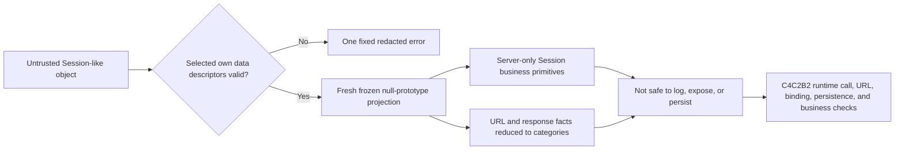

Text alternative: C4C2B1 reads only named own data fields, returns technically bounded server-only Session primitives plus redacted URL/response categories, and stops before runtime trust, persistence, or business use.

The projection fixes schema version `1`, provider `stripe`, and provider operation `checkout_session_create`, then includes a bounded Session ID, object/mode/status/payment-status values, live-mode flag, amount/currency pair, and creation/expiry integers. The fixed provider and operation labels describe this projector; they do not prove provider origin or execution. Every retained value remains forgeable and server-only; #280 does not authorize logging or persistence. The raw Checkout URL is reduced to `bounded_https_capability_present` or `absent`, without returning the URL or approving its host, callbacks, or fragment. Raw request ID, idempotency key, Stripe account ID, and API-version text are also excluded. Only fixed bounded-present/missing, expected/other API-version, and response-status categories survive. Metadata, customer/contact data, client secrets, callback URLs, response bodies/headers/sockets, and unknown fields never enter the projection.

The fixed classification is `untrusted_checkout_session_projection` with `requires_runtime_binding_persistence_and_business_validation`. It is not C4C1 positive evidence and proves no provider origin, account control, dispatch, key use, plan/send binding, configured environment, current time, payment, capacity, inventory, retention approval, persistence, or business state. C4C2B2 must control the SDK promise, compare raw memory-only response facts to trusted C4A/C4B/configuration evidence, approve the memory-only capability URL, bind current business/time facts, persist only approved server evidence, and return a current URL without logging or storing the URL.

Source change, tests, merge, website publication, `runmprc.com` verification, Firebase deployment, Stripe/provider configuration, production data, and live behavior are separate states. #280 changes no officer task and proves none of the external or live states.

### C4C2B2A Checkout Session transport comparison — SOURCE ONLY, UNUSED

PAY-002B2C4C2B2A is tracked in live [#285](https://github.com/Run-MPRC/Run-MPRC.github.io/issues/285). The pure `classifyStripeCheckoutSessionResponseBinding` policy classifies a possible binding; it is not a binding adapter. A future controller must build one frozen null-prototype schema-1 capsule in one synchronous call stack. The capsule carries an already-created exact #280 projection plus separately captured observed and expected API-version, idempotency-key, and optional Stripe-account primitives. The policy does not call #280, inspect or re-read a Session, retain input references, await work, call Stripe, or write data.

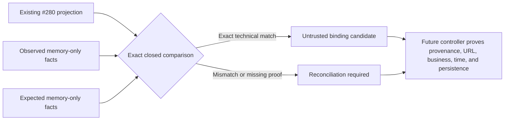

Text alternative: a future controller gives the pure classifier an already-created #280 projection plus memory-only observed and expected transport primitives; an exact comparison yields only an untrusted candidate and every mismatch stops for reconciliation.

The classifier revalidates the exact #280 schema and all capsule keys, descriptors, bounds, and prototypes without coercion. API version `2023-10-16` is the installed compatibility ceiling. A candidate also requires exact non-missing idempotency-key equality, expected-200, bounded request-ID, bounded HTTPS-capability, and either exact bounded account equality or missing account on both sides. Matching missing accounts proves transport consistency only, never platform-account identity or control. Business, environment, and time fields remain unapproved even when structurally valid.

Outputs are fresh frozen fixed three-field records: `untrusted_transport_binding_candidate` or `reconciliation_required`. They contain no Session ID, URL, request ID, raw API/key/account value, source reference, personal data, or secret. Expected inputs have no trusted provenance in this child. #285 does not establish same-promise capture, Stripe origin/account, C4A/C4B/configuration binding, dispatch, delivery, approved URL/callback, current business/time facts, retention, persistence, C4C1 mapping, replay, endpoint/index adoption, deployment, or live behavior. The remaining C4C2B2 runtime controller owns those proofs.

CI-001B3 [#167](https://github.com/Run-MPRC/Run-MPRC.github.io/issues/167) runs the exact opt-in command-journal emulator suite as a named hosted release prerequisite; #169, #173, #182, #206, #226, #232, and #238 expand that same suite. These are synthetic source checks only. Source change, tests, merge, Firebase deployment, Stripe configuration, production data, website publication, `runmprc.com` verification, and live behavior remain separate states. The current journal source remains unused and makes no endpoint, provider, production, website, or officer change.

### PAY-003C1 commerce attempt-failure disposition — SOURCE ONLY, UNUSED

PAY-003C1 is tracked in live [#377](https://github.com/Run-MPRC/Run-MPRC.github.io/issues/377) under PAY-003 [#106](https://github.com/Run-MPRC/Run-MPRC.github.io/issues/106). The pure `classifyAttemptFailure` policy reads one exact flat revision-1 evidence record `{ failureDispositionSchemaVersion, failureSignal, sideEffectIdempotency, retryBudget }` drawn only from closed vocabularies and returns one frozen disposition — `retry_transient`, `dead_letter`, `quarantine_permanent`, or `ignore_duplicate` — each carrying a boolean `retryable`. `failureSignal` reuses the house transient names (`timeout`, `connection_lost`, `rate_limited`, `server_failure`, `external_dependency_failure`) plus permanent (`permanent_client_error`, `malformed_response`), reconcile-needed (`conflict`, `unknown`), and already-applied (`duplicate_replay`); `sideEffectIdempotency` is `idempotent`/`non_idempotent` and `retryBudget` is `available`/`exhausted`. It imports only `node:util`.

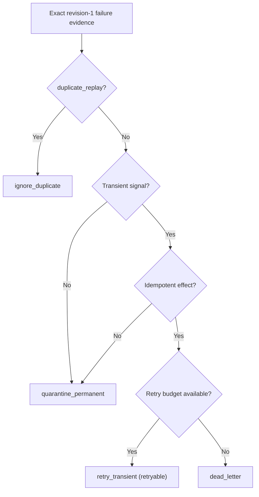

Text alternative: an already-applied duplicate is ignored; any non-transient signal, or a transient signal on a non-idempotent effect, is quarantined; a transient failure on an idempotent effect retries while the caller's budget remains and otherwise dead-letters.

The safety invariant is that a non-idempotent side effect is never `retry_transient`: a transient failure on a non-idempotent effect quarantines instead, so the deferred worker can never double-apply an external create, refund, or send (external effects must be idempotent and retry-safe). Only genuinely transient signals retry, and only while `retryBudget` is `available`; an exhausted budget dead-letters; `conflict` and `unknown` fail closed to `quarantine_permanent`; `duplicate_replay` yields `ignore_duplicate` with no new delivery. `retryable` is true only for `retry_transient`.

The retry budget is an input, never a baked-in maximum count, backoff schedule, TTL, dead-letter threshold, or alert — those stay with the deferred PAY-003C worker and retention approval [#110](https://github.com/Run-MPRC/Run-MPRC.github.io/issues/110). The module names no provider, recipient, address, money, or message and accepts no free-form identifiers, so nothing PII-shaped can ride in; malformed, proxy, accessor, inherited, extra-or-missing-key, unknown-enum, or wrong-version input throws one fixed `CommerceFailureDispositionError` that never echoes the input. The sibling `commerceOutboxState` (PAY-003B1, [#364](https://github.com/Run-MPRC/Run-MPRC.github.io/issues/364)) validates whether a proposed delivery transition is legal but is handed the target state; this classifier derives which target a failure warrants. The `commerceProviderResult`/`commerceProviderReconciliation` classifiers answer business-advance-versus-reconcile and never emit a retry-versus-permanent verdict. It reads no clock, randomness, environment, network, Firestore, or Stripe; is imported by no runtime entry point or Functions index; stores and logs nothing; and creates no attempt, send, retry, deletion, or business record. Source change, tests, merge, Firebase deployment, Stripe configuration, production data, website publication, and live behavior remain separate states; #377 changes no officer task and proves none of the external or live states.

## 7. Business invariants

The following are correctness rules, not UI preferences:

1. `amountExpectedCents`, `currency`, and sellable item are read from server-controlled data.
2. `amountPaidCents` comes from a verified Stripe object and is stored separately from expected list price.
3. A record becomes paid only when `payment_status == paid` or an equivalent successful PaymentIntent state is verified.
4. Each Stripe event is applied at most once; applying it again produces the same final state and no duplicate email, seat, stock decrement, or refund.
5. One checkout request maps to one business record and at most one active Stripe Session.
6. A member price requires a currently verified `member` or authorized admin claim at checkout time.
7. Participant reservations never exceed event capacity. Volunteers do not consume participant capacity unless an event explicitly configures a volunteer cap.
8. Variant reservations never exceed sellable on-hand inventory. A product-wide `active` flag does not imply every size/color is available.
9. Full refunds, terminal cancellations, and expired unpaid Sessions release capacity or inventory exactly once according to policy.
10. Partial refunds do not silently release a seat or fulfilled product.
11. A paid record cannot be changed to cancelled without an explicit policy decision about refunding or retaining funds.
12. Financial state cannot be edited directly from a Firestore client.
13. A waiver record identifies the exact waiver version/text hash accepted, timestamp, event, registrant, and acceptance context.
14. Confirmation pages display only sanitized fields and do not rely on bearer credentials left in URLs or referrer logs.

## 8. Core workflows

### 8.0 Account profile setup and recovery

Issue [#118](https://github.com/Run-MPRC/Run-MPRC.github.io/issues/118) adds a create-once recovery path for accounts whose `members/{uid}` record is missing after the Firebase cutover. It is a source design until the exact Function, current Rules, and dependent website are deployed backend-first and proven with a synthetic account.

```mermaid
sequenceDiagram
    actor M as Signed-in member
    participant W as Account page
    participant F as ensureMemberProfile Function
    participant A as Firebase Auth Admin
    participant D as Firestore

    M->>W: Open My Account
    W->>F: Empty request + verified Firebase sign-in
    alt setup fails
        F-->>W: Generic unavailable result
        W-->>M: Hide Edit; show retry/sign-out path
    else setup continues
        F->>D: Read only members/{caller UID}
        alt profile exists
            D-->>F: Exists
            F-->>W: ready=true; no write or claim change
        else profile missing
            F->>A: Load caller's authoritative Auth record
            F->>D: Transactionally create one phone-free pending profile
            F-->>W: ready=true
        end
        W->>D: Read caller profile through Firestore Rules
        alt read succeeds
            D-->>W: Profile
            W-->>M: Show profile and name-only Edit
        else read fails
            D-->>W: Generic failure
            W-->>M: Hide Edit; show retry/sign-out path
        end
    end
```

The callable accepts no UID or profile fields. A missing record receives bounded name, email, verification, and provider fields from Firebase Auth plus `role: unverified`; while phone collection is paused, the server writes the existing schema-compatible empty phone field instead of copying `user.phoneNumber`. It never copies a member/admin claim, dues, payment, or discount state. Existing records and claims remain byte-for-byte unchanged. This may expose a pre-existing claim/profile mismatch instead of guessing how to repair it; the identity/membership workflow must resolve that mismatch explicitly. App Check is required by the shared boundary only when deployed enforcement is configured, so release evidence must prove that setting before calling App Check live.

DATA-001C1 [#178](https://github.com/Run-MPRC/Run-MPRC.github.io/issues/178) pauses optional phone display and collection in My Account. The owner-profile projection omits `phoneNumber`, the client validates and writes only `fullName`, and the Rules source rejects every browser phone mutation while allowing an existing phone value to remain unchanged during a name edit. DATA-001C2 [#197](https://github.com/Run-MPRC/Run-MPRC.github.io/issues/197) extends the same pause to the shared signup/recovery helper: a new profile keeps the empty phone schema field even when Firebase Auth already has a phone. The create-once transaction leaves every existing profile unchanged. Firestore still authorizes and transports the owner's complete document at its document-level boundary; #116 retains future server projections for broader administrative reads. Neither slice deletes, migrates, exports, or inspects existing phone data, changes Google Forms/providers, or proves spam causation. Source is not live protection until the exact Rules and both profile Functions are deployed/read back before the dependent website revision is published and verified.

The server chooses initial timestamps. The current self-edit path sends a Firestore server timestamp, but the Rules source type-checks rather than independently proves that edit timestamp. Do not describe arbitrary profile edit timestamps as server-authoritative until a coordinated Rules/API issue closes that residual.

### 8.0a Provider-neutral membership authority and entitlement — SOURCE ONLY, UNUSED

MEMBERS-IDENTITY-001A [#208](https://github.com/Run-MPRC/Run-MPRC.github.io/issues/208), with its command-order correction in MEMBERS-IDENTITY-001H [#451](https://github.com/Run-MPRC/Run-MPRC.github.io/issues/451), defines one unused pure contract that keeps a stable MPRC membership separate from the Firebase account used to sign in. A membership record can exist and receive monotonic term decisions without a UID. Such a record grants no website entitlement. Google, WhatsApp, Strava, email equality, a profile role, and any browser field remain projections or inputs to future reviewed workflows; none is membership authority.

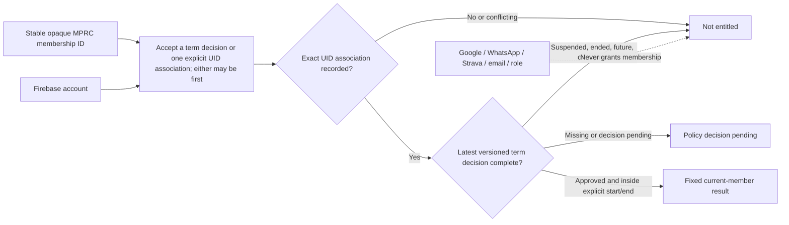

Text alternative: a versioned term decision and an explicit UID association may be recorded in either order. An unlinked membership is never entitled, even when it has an approved current term; linking it later preserves the latest term. The membership receives the fixed current-member result only when both the exact UID association and a complete approved term whose explicit half-open time range contains the evaluation time are present. Missing, conflicting, suspended, ended, future, expired, or undecided state fails closed. External identities, channels, matching email, and roles never grant membership.

The CommonJS module creates an account-independent revision-1 snapshot, records one explicit account association, records already-decided term references monotonically before or after that association, and derives one of three frozen non-identifying results: current member, not entitled, or decision pending. Multiple monotonic term decisions may be recorded while the membership remains unlinked; a later one-time UID association preserves the latest term rather than replacing or resetting it. It accepts exact plain objects, bounded server-minted opaque identifiers, safe-integer time values, one current term rather than an unbounded mutable history, and a last-command marker for immediate idempotent retry. An exact last-command retry is read-only. A changed last-command retry, a second/different UID association within the snapshot, a stale record revision, an exhausted safe-integer revision, a skipped or repeated term revision, a reversed time range, an unsupported version/state, an extra field, an accessor, or a proxy fails through one fixed error.

This contract does not verify a person, payment, plan, evidence item, refund, dispute, or policy decision. It does not choose calendar-year versus anniversary terms, grace, prices, plan eligibility, retention, or legacy disposition. Its identifier grammar is not a semantic privacy classifier; a future trusted server must mint opaque values and establish every referenced fact. The last-command marker prevents only an immediate changed retry; command IDs are not a durable global replay registry. #451 changes only the accepted command ordering within schema version 1: existing link-first snapshots remain valid, and because no snapshot is persisted or runtime-adopted, this correction needs no migration or backfill. Durable cross-record UID uniqueness, full command replay history, append-only audit, Firestore schema/Rules, custom claims, token refresh/revocation, runtime authorization, any future migration, and deployment are later children behind #110, #113, #114, AUTH-003/ADMIN, and the protected release work.

The module is imported by no runtime or Functions index. It reads no clock or environment, calls no Firebase/Stripe/provider service, stores nothing, logs nothing, changes no current profile/role/claim, and cannot make #81, annual renewal, discounts, roster export, or officer membership tools available. Source tests and a merge are not Firebase deployment or live behavior proof.

### 8.0b Officer manual off-platform dues-evidence command — SOURCE ONLY, UNUSED

MEMBERS-ADMIN-001A [#395](https://github.com/Run-MPRC/Run-MPRC.github.io/issues/395) defines one unused pure contract for the first MEMBERS-ADMIN-001 [#115](https://github.com/Run-MPRC/Run-MPRC.github.io/issues/115) behavior: recording an owner-approved off-platform dues confirmation for a membership term without creating or claiming a Stripe payment. It turns one exact officer-audit envelope into the exact approved `record_term_decision` command the §8.0a reducer already accepts, plus a paired immutable audit record stamped with an off-platform provenance. It decides no policy; every owner-meaningful value is carried through as an opaque token.

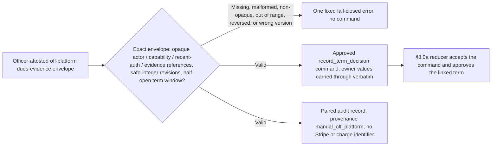

Text alternative: a well-formed officer envelope — bounded opaque references for actor, capability, recent authentication, membership, evidence category, evidence, reason, and correlation; safe-integer expected and term revisions; an opaque term ID, plan reference, and policy version; and a half-open start/end window — projects the exact approved `record_term_decision` command the §8.0a reducer accepts, plus a paired immutable audit record stamped with an off-platform provenance and carrying no Stripe or charge identifier. Any missing, extra, non-opaque, out-of-range, reversed, wrong-version, accessor, or proxy input fails closed through one fixed error and produces no command.

The CommonJS module validates one exact envelope with the same fail-closed primitives as §8.0a — bounded server-minted opaque identifiers, safe-integer revisions and half-open time bounds, exact plain objects only — and returns two frozen values: the reducer command, whose command type and `approved` term state are the fixed identity of this manual path, and the audit record, which names who acted, under what capability and recent re-authentication, on which membership and term, with what off-platform evidence category and reference, and why. The audit record carries no Stripe, charge, session, or contact identifier, so "records dues without claiming an external charge" is a testable invariant. The module re-declares the reducer's validation primitives and its command schema version locally so the contract stays standalone; an integration test imports the shipped reducer and fails if that version ever drifts.

This contract does not verify an actor, capability, recent authentication, evidence item, plan, price, term calendar, or policy decision. It does not read or write the authoritative record, mint the applied prior/new revision, stamp a server time, record a command result, associate a UID, refresh or revoke entitlement, or register a durable command ID for replay. Its identifier grammar is not a semantic privacy classifier; a future trusted runtime must mint every opaque value, verify the officer's capability and recent authentication under AUTH-003, establish each referenced fact, apply the command against the current record, and persist the completed audit entry.

The module is imported by no runtime or Functions index. It reads no clock or environment, calls no Firebase/Stripe/provider service, stores nothing, logs nothing, changes no current profile/role/claim, mints no identifier, and cannot make manual dues recording, an officer review queue, or any officer membership tool available. Source tests and a merge are not Firebase deployment or live behavior proof.
### 8.0c Entitlement-to-authorization-claim reconciliation — SOURCE ONLY, UNUSED

MEMBERS-IDENTITY-001E [#373](https://github.com/Run-MPRC/Run-MPRC.github.io/issues/373) defines one unused pure contract that bridges the §8.0a entitlement result and the deferred custom-claim lifecycle. `membershipAuthority.js` (#208) derives whether a subject is a current member but explicitly defers "custom claims, token refresh/revocation" to a later child; nothing yet derives, from that entitlement, whether the membership authorization claim in a token **should** be present and — when it drifts — whether to grant or revoke it. #81 requires that custom claims carry authorization only, and names access-revocation as first-class. A second invariant is encoded: membership governs **only** the member authorization claim. The officer (`admin`) role is administered separately ([#115](https://github.com/Run-MPRC/Run-MPRC.github.io/issues/115), `setMemberRole`); gaining or losing membership never grants or revokes it.

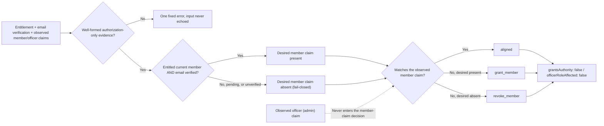

Text alternative: the desired member claim is present only for a subject the §8.0a contract deems a current member whose sign-in email is verified; not entitled, decision pending, or unverified all fail closed to a desired-absent claim, so a stale claim is revoked. A desired state that matches the observed member claim is aligned; a missing entitled claim is grant_member; a present unentitled claim is revoke_member. The observed officer role never enters the decision, so an officer whose membership lapses is reconciled to revoke_member while the admin role is left untouched.

The CommonJS module accepts an exact five-field revision-1 evidence object whose values are drawn only from closed authorization vocabularies — an entitlement disposition, an email-verification flag, and the observed member and officer claim states — and derives one of three frozen non-identifying dispositions. The verified-email requirement mirrors the existing `roleGrantPolicy.js` rule for the `member` role. Every result hard-codes `grantsAuthority: false` and `officerRoleAffected: false`. An unknown enum value, a wrong version, an extra or missing field, an accessor, an inherited field, or a proxy fails through one fixed error that never echoes the input.

This contract writes no claim, mints and revokes no token, and derives the reconciliation verdict only. The evidence carries authorization state alone — never a provider ID, phone, profile field, roster, address, or token, exactly as #81 requires of custom claims. It invents no prices, plans, terms, retention duration, deletion window, or access-revocation SLA; those stay with #114/#110 and the owner. The entitlement derivation itself (§8.0a), the officer-role grant path (#115), and consent/link teardown ([#367](https://github.com/Run-MPRC/Run-MPRC.github.io/issues/367)/[#370](https://github.com/Run-MPRC/Run-MPRC.github.io/issues/370)) are separate contracts. The actual custom-claim write, token refresh, and revocation remain gated on the AUTH-001/AUTH-003 Functions/Admin authorization work.

The module is imported by no runtime or Functions index. It requires only `node:util`, reads no clock or environment, calls no Firebase/Stripe/provider service, stores nothing, logs nothing, changes no current profile/role/claim, and cannot make #81 or live claim reconciliation available. Source tests and a merge are not Firebase deployment or live behavior proof.
### 8.0d Provider-neutral versioned consent state — SOURCE ONLY, UNUSED

MEMBERS-IDENTITY-001D [#370](https://github.com/Run-MPRC/Run-MPRC.github.io/issues/370) defines one unused pure contract that derives the current effective consent state for a single (provider, subject, scope) track under the policy version now in force. It sits beside the §8.0a membership authority and the external-account link contract (`membershipProviderLink.js`, [#367](https://github.com/Run-MPRC/Run-MPRC.github.io/issues/367)), which consumes a consent value that it itself defers. Consent is provider-neutral: email/password, Google, WhatsApp, and Strava share one identical rule, and no consent state is membership authority.

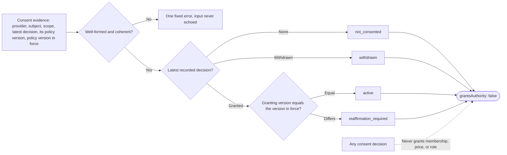

Text alternative: given the latest recorded consent decision for a track and the policy version now in force, the contract returns one of four fixed dispositions. No recorded decision yields not_consented; a withdrawn decision yields withdrawn regardless of any version; a granted decision yields active only when its policy version equals the version in force, and reaffirmation_required otherwise. Every result carries grantsAuthority false. Malformed or incoherent evidence fails closed through one fixed error that never echoes the input.

The CommonJS module publishes a revision-1 schema, a frozen provider-neutral enum set, and one fixed error, and classifies an exact seven-field evidence object — schema version, provider, opaque subject and scope references, latest decision, its policy version, and the policy version in force. A recorded decision must carry an opaque policy version and a `none` decision must carry exactly null, so an incoherent decision/version pairing, an unknown enum, a non-opaque or PII-shaped reference, a wrong version, an extra field, a missing field, an accessor, or a proxy all fail through the one error. Policy versions are compared for equality only.

This contract invents no policy. It sets no prices, plans, or terms, writes no policy text, and defines no retention duration, deletion window, or access-revocation SLA — those remain with #110 and the owner. It assumes no version ordering, recency, or precedence: a differing policy version is simply superseded and routed to reaffirmation, and which version is current is the caller-supplied requiredPolicyVersion. `grantsAuthority` is hard-coded false on every result, so consenting to link WhatsApp or share Strava never confers membership, price, payment state, or role. It derives the current state only — the append-only capture of consent events and their versioned history, withdrawal side effects such as link teardown and claim revocation, the retention/minimization/deletion matrix (#110), and provider-specific WhatsApp consent wiring (#87) are later work, gated on the remaining AUTH-001 Functions/Admin authorization protections.

The module is imported by no runtime or Functions index. It reads no clock or environment, calls no Firebase/Stripe/provider service, stores nothing, logs nothing, changes no current profile/role/claim, and cannot make #81, versioned WhatsApp consent, or any officer membership tool available. Source tests and a merge are not Firebase deployment or live behavior proof.
### 8.0e Provider-neutral external-account link and collision — SOURCE ONLY, UNUSED

MEMBERS-IDENTITY-001C [#367](https://github.com/Run-MPRC/Run-MPRC.github.io/issues/367) defines one unused pure contract that sits beside the §8.0a membership authority and classifies how a single external-account link is reconciled and where a link collision is refused. Email/password, Google, WhatsApp, and Strava are one provider-neutral vocabulary with identical rules; a link is a minimal derived identity projection and never membership evidence. Every classified result carries `grantsAuthority: false`, so no connection, matching identifier, or observed link ever confers membership, price, payment state, or role.

```mermaid
flowchart LR
    I["Provider link evidence"] --> V{"Exact, opaque, in-vocabulary?"}
    V -- "No" --> ERR["One fixed error; no echo"]
    V -- "Yes" --> D{"Desired linked?"}
    D -- "Yes" --> C{"Bound to a different membership?"}
    C -- "Yes" --> COL["collision"]
    C -- "No" --> K{"Consent granted?"}
    K -- "No" --> BLK["blocked — consent_required"]
    K -- "Yes" --> O{"Observed state known?"}
    D -- "No (unlinked)" --> O
    O -- "No" --> OP["observation_pending"]
    O -- "Yes" --> AL{"Desired equals observed?"}
    AL -- "Yes" --> ALN["aligned"]
    AL -- "No" --> RC["reconcile_link or reconcile_unlink"]
    COL -.-> NA["Every result grants no authority"]
    BLK -.-> NA
    OP -.-> NA
    ALN -.-> NA
    RC -.-> NA
```

Text alternative: a well-formed link request is classified in one deterministic pass. A request to link is refused as a collision when the opaque account reference is already bound to a different membership, and is blocked when consent is not granted; otherwise an unknown observation is pending, a matching desired/observed pair is aligned, and a mismatch is a link or unlink reconciliation. Malformed, non-opaque, PII-shaped, out-of-vocabulary, extra-field, accessor, or proxy input fails through one fixed error that never echoes the input. No result grants authority.

The CommonJS module exposes a schema version, one frozen input/disposition enum set, one fixed error, and one classifier over an exact eight-field evidence object: schema version, provider, opaque membership ID, opaque non-secret `providerAccountRef`, consent, desired state, observed state, and the membership the account is currently bound to (or none). The opaque-identifier grammar structurally rejects raw email- and phone-shaped references. Collision detection consumes caller-supplied binding evidence rather than reading any index; the classifier holds no state and mints no identifiers.

This contract decides nothing about prices, plans, term boundaries, renewal, retention, or roster disposition, and it issues no custom claim, token, or role — those remain with §8.0a, #114/#115, #110/#113, and the AUTH-003/ADMIN work. Its identifier grammar is not a semantic privacy classifier; a future trusted server must mint opaque references and establish every bound-elsewhere fact. Durable cross-membership uniqueness, consent capture and withdrawal side effects, provider connect/disconnect execution, Firestore schema/Rules, and reconciliation scheduling are later work gated on the remaining AUTH-001 Functions/Admin authorization protections.

The module is imported by no runtime or Functions index. It reads no clock or environment, calls no Firebase/Stripe/provider service, stores nothing, logs nothing, changes no current profile/role/claim, and cannot make #81, provider linking, or any officer tool available. Source tests and a merge are not Firebase deployment or live behavior proof.
### 8.0f Immutable membership term/evidence receipt ledger — SOURCE ONLY, UNUSED

MEMBERS-DUES-001A [#345](https://github.com/Run-MPRC/Run-MPRC.github.io/issues/345) defines one unused pure contract that preserves the immutable renewal/evidence history the §8.0a authority cannot hold by itself. The §8.0a reducer keeps only one replaceable current-term snapshot, so each recorded term decision overwrites the previous one. This contract records each term decision as an ordered, append-only receipt and projects any receipt back into the exact `record_term_decision` command the shipped authority already accepts, without duplicating that reducer.

```mermaid
flowchart LR
    E["Empty ledger (receiptRevision 0)"] --> A["Append receipt: termRevision equals one-based position"]
    A -- "Reused command/receipt id, skipped or repeated revision, reversed range" --> X["Fails closed"]
    A -- "Exact re-append of the tail command" --> R["Read-only; returns the same ledger"]
    A --> H["Ordered append-only history; earlier receipts never change"]
    H --> P["Project one receipt with an expected revision"]
    P --> C["Exact record_term_decision command accepted by the 8.0a authority"]
```

Text alternative: a ledger starts empty and grows only by appending one term/evidence receipt at a time, where each receipt's term revision equals its one-based position, command and receipt identifiers are unique across the whole history, and earlier receipts are never mutated. An exact re-append of the most recent command is read-only. A reused identifier, a skipped or repeated revision, a reversed time range, an unsupported version/state, an extra field, an accessor, a proxy, or a tampered snapshot fails through one fixed error. Any receipt projects into the exact versioned `record_term_decision` command that the §8.0a authority accepts, so the two contracts compose without a shared type.

The CommonJS module creates an empty versioned ledger, creates one frozen receipt from an opaque evidence bundle (receipt id, command id, term revision/state/id, explicit half-open start/end, and opaque plan/evidence/policy references), appends receipts as an immutable ordered history with monotonic position-bound revisions and global identifier uniqueness, treats an exact tail re-append as read-only, and projects a receipt into the frozen `record_term_decision` command input. It accepts exact plain objects, bounded server-minted opaque identifiers, and safe-integer time values only.

This contract does not verify a person, payment, plan, evidence item, refund, dispute, or policy decision, and it grants no entitlement by itself. It does not choose calendar-year versus anniversary terms, grace, prices, currency, plan eligibility, retention, tax, or legacy disposition; every reference is an opaque caller-supplied token and only technical bounds — a positive-duration range and a monotonic position-bound revision — are enforced. Durable persistence and replay, Firestore schema/Rules, custom claims and token refresh/revocation, cross-record uniqueness, runtime authorization and adoption, migration, and deployment are later children behind #114 and the protected release work.

The module is imported by no runtime or Functions index and updates no officer procedure because it makes nothing officer-observable. It reads no clock or environment, calls no Firebase/Stripe/provider service, stores nothing, logs nothing, and changes no current profile/role/claim. Source tests and a merge are not Firebase deployment or live behavior proof.

### 8.0g Token-refresh/revocation disposition — SOURCE ONLY, UNUSED

MEMBERS-DUES-001E [#427](https://github.com/Run-MPRC/Run-MPRC.github.io/issues/427) defines one unused pure contract for item 4 of parent [#114](https://github.com/Run-MPRC/Run-MPRC.github.io/issues/114) — "Expiry/reconciliation job and derived Auth-claim/access refresh/revocation without deleting membership history", whose acceptance criterion requires expiry, refund/chargeback/dispute, suspension, and offboarding to "force safe token refresh/revocation". It is the step the §8.0c claim contract (`membershipClaimReconciliation.js`, MEMBERS-IDENTITY-001E, [#373](https://github.com/Run-MPRC/Run-MPRC.github.io/issues/373)) explicitly DEFERS: §8.0c derives the desired member-claim VALUE (`aligned` / `grant_member` / `revoke_member`) and states that "the actual custom-claim write, token refresh, and revocation remain gated" on later Functions/Admin work. This contract consumes that disposition and derives the distinct next decision — given whether the subject holds an outstanding session and which claims-version that session's token carries, whether to force-revoke outstanding sessions, force a token refresh, or do nothing.

```mermaid
flowchart LR
    V["§8.0c disposition + session state + authoritative/observed claims-version"] --> G{"Well-formed evidence?"}
    G -- "No" --> X["One fixed error, input never echoed"]
    G -- "Yes" --> R{"reconciliationDisposition?"}
    R -- "revoke_member" --> FR["force_revoke (unconditional, fail-closed)"]
    R -- "grant_member" --> GS{"Active session?"}
    GS -- "Yes" --> RF["force_refresh"]
    GS -- "No" --> N1["noop — next sign-in mints the claim"]
    R -- "aligned" --> AS{"Active session?"}
    AS -- "No" --> N2["noop"]
    AS -- "Yes" --> VV{"Stamped version equals authoritative?"}
    VV -- "Yes" --> N3["noop"]
    VV -- "No" --> RF2["force_refresh — stale claims-version"]
```

Text alternative: a revoked member authorization always forces session revocation, regardless of the observed session or version evidence, because `revokeRefreshTokens` is idempotent and sets a revocation watermark that invalidates even a session the evidence did not observe. A newly granted claim propagates only on refresh, so an active session is force-refreshed while a subject with no outstanding session is left for the next sign-in to mint the claim. An aligned claim whose value already matches needs nothing unless an active session carries a claims-version that differs from the authoritative cursor, in which case a refresh is forced so version-gated consumers converge. A malformed shape, an unknown enum, a non-integer or negative version, an extra or missing field, an accessor, an inherited field, or a proxy fails through one fixed error that never echoes the input.

The marquee property is fail-closed access removal, proven across the seam: `force_revoke` is emitted if and only if the reconciliation disposition is `revoke_member` — no other path can produce it, and a de-entitlement never resolves to a refresh or a noop. Driving the entire shipped §8.0c input space through the composed pipeline confirms that every path §8.0c resolves to `revoke_member` (a lapsed, suspended, unverified, or decision-pending subject still holding the claim) forces revocation of an active session, so item 4's "expiry/refund/suspension → force safe token revocation" holds for every disposition the claim contract can take. As in §8.0c, the officer (`admin`) role is administered separately and is never touched (`officerRoleAffected: false`), so a lapsed officer's member session is revoked while their admin role is left intact, and the verdict itself confers no membership, price, or role (`grantsAuthority: false`).

The CommonJS module accepts an exact five-field revision-1 evidence object — the §8.0c disposition, the session state, and the authoritative and observed claims-version cursors — and derives one of three frozen non-identifying dispositions with a closed reason. The two version fields are validated as non-negative safe integers even on the `revoke_member` branch that ignores them, so validation is shape-complete rather than decision-driven, mirroring how §8.0c validates `observedOfficerClaim` even though it never affects the outcome. The evidence carries authorization and version state alone — never a token value, provider ID, phone, profile field, roster, address, or secret; "token" names the SESSION being reconciled, not a stored credential.

This contract invents no revocation SLA, grace period, expiry date, timing, or clock: it reads no clock and compares only caller-supplied version cursors, honoring the #114 owner-decision constraint that such values are recorded as versioned server configuration rather than invented. It writes no token, mints and revokes nothing, and derives the reconciliation verdict only; the actual refresh-token revocation and forced re-mint remain gated on the AUTH-001/AUTH-003 Functions/Admin authorization work. The entitlement derivation (§8.0a), the claim-value reconciliation (§8.0c), the officer-role grant path ([#115](https://github.com/Run-MPRC/Run-MPRC.github.io/issues/115)), and the immutable receipt ledger (§8.0f) are separate contracts.

The module is imported by no runtime or Functions index and updates no officer procedure because it makes nothing officer-observable. It requires only `node:util`, reads no clock or environment, calls no Firebase/Stripe/provider service, stores nothing, logs nothing, and changes no current profile/role/claim. Source tests and a merge are not Firebase deployment or live behavior proof.

### 8.0h Member/account status projection and renewal affordance — SOURCE ONLY, UNUSED

MEMBERS-DUES-001F [#437](https://github.com/Run-MPRC/Run-MPRC.github.io/issues/437) defines one unused pure contract for **item 6** of parent [#114](https://github.com/Run-MPRC/Run-MPRC.github.io/issues/114) — "Minimum member/account status projection and renewal UX after the server contract is proven", whose acceptance line requires member pricing and protected content to consume "the server-derived active-membership projection rather than Auth provider or raw profile fields". §8.0a `deriveMembershipEntitlement` is the authorization gate: it returns one of three frozen results — `current_member` / `not_entitled` / `decision_pending` — **collapsing every reason** (a term an hour from expiry, an elapsed term, a refund-suspended term, an offboarded ended term, a not-yet-started future term, an unlinked record) into the same `not_entitled`, and it applies no renewal-window threshold and offers no renewal affordance. A member's own account page and the member-pricing surface need those reasons **disaggregated** plus a renewal affordance; that disaggregation is the ONLY thing this contract adds. §8.17 / §8.18 / §8.19 each forward-declare it unbuilt ("no member/account status projection or renewal UX (item 6) … remain with #114").

It is deliberately a projection OF the shipped authority §8.0a, which it **COMPOSES rather than re-implements** — the one source-only core that imports a sibling, a documented departure from the `node:util`-only norm the other cores follow. The safety property that matters here is **display never over-states authorization**: any status that reads as entitled (`active` / `expiring_soon`) must correspond to a `current_member` authorization, always. Composing the real authority makes that invariant TRUE BY CONSTRUCTION and robust to any future change in §8.0a's window logic, and it re-implements NONE of §8.0a's record validation (revision math, enum / time / opaque-id checks) — re-implementing that in a second module would be the salami failure mode this project forbids. The imported sibling is itself pure and `node:util`-only, so purity / determinism / no-I/O hold transitively; a source-boundary test locks this module's require set to exactly `{ node:util, ./membershipAuthority }` and locks `membershipAuthority`'s own require set to `{ node:util }`.

```mermaid
flowchart LR
    V["§8.0a entitlement + record view + asOfMs + policy.renewalWindowMs"] --> G{"Well-formed input & policy?"}
    G -- "No" --> X["denied: malformed_input | malformed_policy (input never echoed)"]
    G -- "Yes" --> E{"§8.0a entitlement?"}
    E -- "decision_pending" --> P["pending — no renewal"]
    E -- "current_member" --> W{"endsAtMs - asOfMs <= renewalWindowMs?"}
    W -- "No" --> A["active — no renewal"]
    W -- "Yes" --> ES["expiring_soon — renewal offered"]
    E -- "not_entitled" --> L{"linked & uid matches?"}
    L -- "No" --> N["none — no renewal (a join, not a renewal)"]
    L -- "Yes" --> T{"term state / window?"}
    T -- "suspended" --> S["suspended — no renewal (clawback)"]
    T -- "ended" --> EN["ended — no renewal (owner re-admits)"]
    T -- "approved, asOfMs < startsAtMs" --> U["upcoming — no renewal (already renewed)"]
    T -- "approved, asOfMs >= endsAtMs" --> EX["expired — renewal offered"]
```

Text alternative: the authoritative entitlement §8.0a derives is taken verbatim and disaggregated within its bucket. A `decision_pending` entitlement displays `pending`. A `current_member` entitlement — §8.0a's only entitled branch, a linked and matched association with an approved term whose window contains `asOfMs` — displays `expiring_soon` when the owner-configured `renewalWindowMs` covers the remaining time (`endsAtMs - asOfMs <= renewalWindowMs`, boundary inclusive) and `active` otherwise. A `not_entitled` entitlement is graduated in §8.0a's own order: an unlinked or uid-mismatched record is `none` (a non-member — a join, not a renewal); else a `suspended` term is `suspended` and an `ended` term is `ended`; else the term is approved but outside its window, so `asOfMs < startsAtMs` is `upcoming` (already renewed ahead) and `asOfMs >= endsAtMs` is `expired`. Renewal is offered for exactly `expiring_soon` and `expired`; the term-end instant is displayed for `active`/`expiring_soon`/`upcoming`/`expired` and is `null` otherwise. A malformed input or policy shape — proxy, revoked proxy, foreign prototype, array, symbol key, extra or missing field, accessor, bad version, or out-of-range time — denies with a fixed reason and never echoes the input; a malformed record makes the composed authority throw, which is caught and mapped to `malformed_input`.

The marquee property is that display never over-states authorization, proven across the seam: the projection's `entitlement` is `deriveMembershipEntitlement`'s output verbatim, so a status reads as entitled (`active`/`expiring_soon`) **if and only if** §8.0a returns `current_member`. The test drives the REAL authority over every fixture and a swept range of instants, asserting the projected entitlement equals the authority's and that no not-current record ever displays as entitled — including an approved, in-window term linked to a **different** uid (→ `none`, never `active`) and an in-window **suspended** term (→ `suspended`, never `active`). The second invariant is that renewal is offered only where a safe self-serve re-purchase is correct: `renewalOffered` is `true` for exactly `expiring_soon` and `expired`, and never for a `suspended` term (a refund/dispute clawback — re-purchase could re-grant disputed access or double-charge), an `ended` term (offboarding — the owner re-admits), a `pending` decision, an already-renewed `upcoming` term, a comfortably-`active` term, or a non-member.

The CommonJS module reads `input` `{ membershipAccountStatusSchemaVersion, record, uid, asOfMs }` and `policy` `{ membershipAccountStatusSchemaVersion, renewalWindowMs }` through the same descriptor-based closed-object read the membership-dues siblings use (getters never invoked; proxy / foreign prototype / array / symbol / extra / missing all deny), composes the shipped authority for the entitlement, and returns one frozen verdict; it never throws for any value in either argument position. The `record` is validated once by the composed authority and never re-validated here, so the two contracts share a seam but no duplicated validation. The verdict carries a display status, a boolean, the authoritative entitlement, and one term-end instant — no code, token, role, price, amount, account reference, PII, or command; a source-boundary test enforces the absence of that vocabulary. It is a read-model, so access itself stays gated by §8.0a at the access point.

This contract invents no policy and duplicates no sibling. It owns the *member-facing status disaggregation and renewal affordance* — which of eight display states this member is in and whether a self-serve renewal is correct — and it is deliberately not any neighbour. §8.0a `deriveMembershipEntitlement` is the authorization gate it composes; this adds no authority and only disaggregates the reason §8.0a collapses. §8.13 `projectMemberDiscounts` is a *consumer* of membership status at a content/pricing surface; this is the *producer* of the display projection such a surface reads, and grants no discount. §8.0g (MEMBERS-DUES-001E) is item 4's token-refresh/revocation disposition — a session-lifecycle decision, not a display read-model. §8.17 / §8.18 / §8.19 reconcile verified payment / reversal / checkout into term *commands*; this issues no command and reconciles no payment. §8.0c `membershipClaimReconciliation` derives the desired *claim value*; this writes and reads no claim. It performs no Auth-claim read or write, no token action, no renewal Checkout creation, no persistence, and no route or UI — the "renewal UX" wiring around this read-model, the actual member-pricing and protected-content enforcement that would consume it, and the owner-configured `renewalWindowMs` all remain with #114 and its dependencies.

The module is imported by no runtime or Functions index and makes nothing officer- or member-observable. It requires only `node:util` and `./membershipAuthority` (itself `node:util`-only), reads no clock or environment, calls no Firebase/Stripe/provider service, stores nothing, logs nothing, and changes no current profile/role/claim. Source tests and a merge are not Firebase deployment or live behavior proof.

### 8.0i Provider-link lifecycle reconciliation — SOURCE ONLY, UNUSED

MEMBERS-IDENTITY-001F [#445](https://github.com/Run-MPRC/Run-MPRC.github.io/issues/445) defines one unused, pure, versioned snapshot contract and optimistic-concurrency reducer for the provider-neutral account link in §8.0e. It composes §8.0e's reviewed classifier for consent gating, collision, and desired-versus-observed drift instead of reproducing those decisions. The caller supplies the effective consent disposition already derived by §8.0d: only `active` maps to granted consent, `withdrawn` maps to withdrawn consent, and `reaffirmation_required` or `not_consented` maps to unknown consent. Changing that disposition does not silently request a provider action.

```mermaid
flowchart LR
    I["Current lifecycle snapshot + exact command"] --> V{"Current revision and stable command?"}
    V -- "Malformed, stale, or conflicting" --> X["One fixed error; no input echo"]
    V -- "Exact latest retry" --> R["Same frozen snapshot"]
    V -- "Valid new command" --> C{"Command type?"}
    C -- "Consent or desired state" --> D["Update safe local intent"]
    C -- "Reconciliation evidence" --> O{"Next ordered outcome?"}
    C -- "Replace provider account" --> A{"Desired and observed unlinked?"}
    O -- "Success" --> S["Advance the known observation"]
    O -- "Definitive failure" --> F["Keep the last known observation"]
    O -- "Outcome unknown" --> U["Keep desired state; mark observation unknown"]
    A -- "Only confirmed unlinked" --> N["Reset observation for the new opaque account"]
    A -- "Linked or unknown" --> X
    D --> P["§8.0e classifies consent, collision, and drift"]
    S --> P
    F --> P
    U --> P
    N --> P
    R --> Z["grantsAuthority: false"]
    P --> Z
    X --> Z
```

Text alternative: a well-formed current command either returns the same frozen snapshot for an exact latest retry or advances one revision; ordered success records a known observation, definitive failure preserves the last known observation, an unknown outcome invalidates the observation without changing intent, and a provider account can change only after confirmed unlink, while every result grants no authority.

The exact snapshot contains bounded typed membership and provider-account references, one existing provider enum, the effective consent disposition, desired and observed link state, optional collision evidence, a safe-integer revision, the last reconciliation sequence/outcome/typed attempt reference/fixed error code, and the latest stable command ID, payload hash, and expected revision. Creation requests `unlinked` but records provider observation as `unknown`; source never fabricates an external fact. Commands can change consent, request link or unlink, record the exact next reconciliation result, or replace the account after desired and observed state are both unlinked. A reconciliation command pins the current provider-account reference, desired state, record revision, and next per-account sequence, so a delayed link result cannot satisfy a later unlink or relink. Reversing an unresolved link or unlink intent invalidates the prior observation, preventing an in-flight action from making the record look aligned or replaceable. Success must report the requested known state; a foreign bound-membership reference remains collision evidence for §8.0e. Definitive failure keeps the prior observation, while outcome-unknown clears it. Account replacement resets observation and reconciliation to unknown/not-attempted for the new reference.

Inputs and every nested value are exact plain data objects: missing, extra, symbol, non-enumerable, inherited, accessor, proxy, malformed, out-of-range, stale, skipped, and conflicting shapes fail through one fixed non-echoing error. Purpose-specific prefixes reject raw phone, token, error, URL, and name values from reference fields; a payload hash must be the exact lowercase SHA-256 digest that the reducer recomputes over the canonical command type and safe payload fields. Outputs and nested records are frozen, and records and verdicts hard-code `grantsAuthority: false`. Exact latest retry is read-only. Reusing an ID with a changed type or payload produces another digest and fails; a changed expected revision fails the separate revision comparison. Durable all-history replay protection, cross-record uniqueness, storage transactions, and command authorization remain future trusted-runtime work.

This contract does not capture consent events or choose a policy-version order, retention rule, deletion service level, provider behavior, relink policy, or officer approval. It makes no provider call and adds no persistence, migration, Firestore schema or Rules, Auth claim, endpoint, route, interface, package, workflow, or deployment. It is imported by no runtime or Functions index, requires only deterministic `node:util`/`node:crypto` operations and the pure §8.0e classifier, and reads no clock, environment, randomness, network, service SDK, or logger. Parent [#81](https://github.com/Run-MPRC/Run-MPRC.github.io/issues/81) remains open for those boundaries. Source changed, tests passed, code merged, website published, `runmprc.com` verified, Firebase deployed, outside provider configured, production data migrated, and production behavior verified are separate states; this source contract proves only the first two before merge.

### 8.0j Provider-neutral consent-decision receipts — SOURCE ONLY, UNUSED

MEMBERS-IDENTITY-001G [#447](https://github.com/Run-MPRC/Run-MPRC.github.io/issues/447) defines one unused pure seam between the caller-supplied latest-decision evidence in §8.0d and a future trusted persistence layer. It creates a bounded track head, emits one append-oriented technical grant-or-withdrawal receipt for an exact next command, and projects the current head through the real §8.0d classifier. It does not copy that classifier's active, reaffirmation, withdrawal, or no-decision policy.

```mermaid
flowchart LR
    H["Empty or current bounded track head"] --> V{"Valid exact next step?"}
    C["Exact grant or withdrawal command"] --> V
    V -- "Malformed, stale, skipped, or conflicting" --> X["One fixed error; no input echo"]
    V -- "Exact latest retry" --> R["Same canonical frozen receipt and head"]
    V -- "Valid next decision" --> N["Emit one frozen technical receipt; advance head by one"]
    N --> H2["Current bounded head"]
    R --> H2
    Q["Separate projector call + required policy version"] --> D["§8.0d classification"]
    H2 --> D
    R --> Z["grantsAuthority: false"]
    D --> Z
    X --> Z
```

Text alternative: from an empty or current bounded track head and one exact grant-or-withdrawal command, the unused source either treats the exact latest retry as read-only, emits one new frozen technical receipt and advances the head by exactly one revision, or fails through one fixed non-echoing error. In a separate call, the projector combines the current head with a caller-supplied required policy version and asks §8.0d to classify it; all results grant no authority. This source captures and stores nothing and does not prove informed consent, legal compliance, notice delivery, actor authorization, or provider acceptance.

The head is bound to one typed track, subject, and scope reference plus one existing provider enum. It contains a safe-integer revision and either no latest receipt at revision zero or exactly one nested latest receipt at a positive revision. It never holds an unbounded receipt array. Each receipt repeats the exact track binding, names only a typed command and receipt reference, binds the prior receipt reference, carries `granted` or `withdrawn` plus one typed policy-version reference, and hard-codes `grantsAuthority: false`. `none` is the absence of a receipt, not a fabricated event.

Each command carries the exact track binding, fixed `record_consent_decision` type, stable typed command and receipt references, expected revision, expected latest receipt reference, decision, and policy version. An exact retry of the latest command is checked before freshness or revision exhaustion and returns the same canonical frozen head and receipt. A changed latest-command reuse fails. A new command must match the track, current revision, and current latest receipt exactly; the next receipt advances one safe-integer revision and binds that prior receipt. A fresh repeated grant or withdrawal is allowed because this technical contract invents no provider or product no-op policy. Current receipt-reference reuse is rejected; durable uniqueness across receipts no longer visible in the bounded head remains future storage work.

The projector validates the full head and passes the exact provider, subject, scope, latest decision or `none`, latest policy version or `null`, and caller-supplied required policy version to `classifyConsentState`. Policy versions are compared for equality only by §8.0d. No timestamp chooses ordering, and this contract defines no version precedence, policy text, effective date, notice wording, scope meaning, withdrawal service level, or provider behavior.

Every public input and nested receipt is an exact plain data object. A proxy, revoked proxy, accessor, inherited field, symbol, non-enumerable field, extra or missing field, foreign prototype, wrong version, unknown enum, unsafe revision, inconsistent nested binding, or malformed purpose-specific reference fails through one fixed error that never echoes the input. Purpose-specific lowercase-hex reference shapes exclude obvious raw contact, URL, provider-error, token, prose, and human-name values; they are structural bounds, not a semantic privacy or authenticity proof. A trusted server must mint every reference and establish every fact.

This module can reject malformed or internally inconsistent snapshots, but it cannot authenticate a self-consistent rewritten head. It performs no hashing, signing, storage, create-only write, all-history replay check, actor authentication or authorization, notice delivery, provider call, or legal determination. Purpose, access, provider disclosure, retention, deletion, backup, request handling, and public notice remain with owner-blocked #110; provider-specific capture remains #87; legacy disposition remains #113. Any future runtime must preserve receipts separately with trusted authorization and create-only transactional persistence before treating the head as canonical.

The module is imported by no runtime or Functions index. It requires only `node:util` and the pure §8.0d module, reads no clock or environment, calls no Firebase/provider service, stores and logs nothing, and changes no profile, membership, role, claim, provider account, or officer workflow. Parent [#81](https://github.com/Run-MPRC/Run-MPRC.github.io/issues/81) remains open. Source changed, tests passed, code merged, website published, `runmprc.com` verified, Firebase deployed, outside provider configured, production data migrated, and production behavior verified remain separate states.

### 8.1 Paid race registration

PAY-001B1 [#219](https://github.com/Run-MPRC/Run-MPRC.github.io/issues/219) adds only the browser projection and first two server validation steps below. The website sends the active field set and omits volunteer tier. The callable preserves the opaque event ID, accepts an exact bounded envelope before Firestore, matches answers against the admitted selected server fields, and encodes callback values. It does not add the target request ID, snapshot, transaction, reservation, idempotent Session saga, safe confirmation capability, deployment, or live proof.

```mermaid
sequenceDiagram
    actor R as Runner
    participant W as Web app
    participant F as Registration function
    participant D as Firestore
    participant S as Stripe
    participant H as Webhook processor

    R->>W: Submit identity, waiver acceptance, request ID
    W->>W: Keep active answers; omit volunteer price tier
    W->>F: Callable request + Auth/App Check when available
    F->>F: Validate exact bounded request envelope
    F->>D: Read commerce control and event
    D-->>F: Admitted server event field schema
    F->>F: Match participant or volunteer answers
    F->>D: Transaction: validate event snapshot, reserve capacity, create pending registration
    F->>S: Create Session after command gate; later generation also needs reconciliation gate
    F->>D: Attach Session ID and expiry
    F-->>W: Stripe-hosted Checkout URL
    W->>S: Redirect to Checkout
    S-->>H: Signed Checkout event
    H->>D: Atomic dedupe + amount/currency/reference validation + state transition
    H->>D: Enqueue confirmation email exactly once
    S-->>W: Redirect using Session ID only
    W->>F: Request sanitized checkout result
    F->>S: Retrieve/verify Session if reconciliation is needed
    F-->>W: Confirmed, processing, failed, or support-required state
```

Text alternative: the website sends only the active signup fields; the server then accepts only a small exact request, preserves and safely encodes the event identity, and matches answers to the selected server fields; the target flow later reserves locally before Stripe, accepts payment only through the signed webhook, and returns only a sanitized result.

If Stripe Session creation fails, the function releases the reservation in a compensating transaction. If the function crashes after Stripe creates the Session, PAY-002B2C2 retries only the exact B2C1 plan/key inside its stored safe-send window. After that deadline—or when first-send time is unknown—it stops POSTing. C3A can classify already-verified evidence, and C3B can persist only a candidate after the retry and lease gates; neither retrieves provider truth, authorizes, or advances. C3C must complete the separate fresh-lease authorization gate, C4A must bind the immutable later plan, and C4B/#238 must record its own pre-send evidence before a later POST. A scheduled job releases abandoned reservations and reconciles records that missed a webhook.

### 8.2 Free or volunteer registration

The same server validation and Firestore transaction are used, but no Stripe call occurs. The registration moves directly to its confirmed non-payment state. Anonymous confirmation uses a short-lived or hash-stored opaque receipt token that is removed from browser history immediately; signed-in users can use ownership by UID.

### 8.3 Merchandise purchase

Merchandise uses the same checkout saga but reserves a specific SKU/variant. Stripe shipping collection is copied into the order only after a verified paid event. Payment status and fulfillment status remain separate. A paid order may be `unfulfilled`, `packed`, `shipped`, `delivered`, `cancelled`, or `returned` without corrupting the payment ledger.

### 8.4 Refund

An authorized finance action creates a separate refund-operation record with a stable idempotency key. Stripe executes the money movement; the webhook is the canonical confirmation. That operation may show `refund_pending` while waiting, but the order/registration aggregate `refundStatus` remains at its last confirmed value. Repeated clicks or network retries must return the original refund rather than create another one. A full registration refund may release capacity according to event policy; a merchandise refund does not modify inventory until the return/stock disposition is explicitly recorded.

### 8.5 Webhook processing

The ingress verifies method, raw payload, signature, and secret. Relevant event types are written or claimed using the Stripe Event ID. Business processing validates object type, livemode/environment, metadata schema version, business reference, Session/PaymentIntent ownership, currency, and amount. Unknown transitions are quarantined for review. Stripe does not guarantee event order, so each transition is based on current domain state and the retrieved Stripe object when necessary.

### 8.5a Idempotent side-effect outbox delivery-state contract — SOURCE ONLY, UNUSED

PAY-003B1 [#364](https://github.com/Run-MPRC/Run-MPRC.github.io/issues/364) defines one unused pure contract for the *side-effect outbox* named by parent PAY-003 [#106](https://github.com/Run-MPRC/Run-MPRC.github.io/issues/106): the durable delivery lifecycle of an internal side-effect intent a confirmed command produces, such as a transactional email to send or a role grant to apply. It is a sibling of the `functions/commerceState.js` business-state reducers in the same non-throwing result-object idiom, and does not duplicate them, the provider-call classifiers, or the Firestore-backed command journal. It governs only *whether a delivery step is allowed and how many attempts have begun*, never a recipient, message, or provider.

```mermaid
flowchart LR
    Q["queued\nattempts = 0"] -->|"begin attempt (+1)"| D["dispatching"]
    D -->|"provider accepted"| S["dispatched"]
    D -->|"transient failure"| R["retry_scheduled"]
    D -->|"permanent failure"| X["dead_letter"]
    D -->|"caller suppressed"| U["suppressed"]
    R -->|"begin attempt (+1)"| D
    R -->|"give up"| X
    S -->|"provider confirmed"| V["delivered"]
    S -->|"reversed"| X
    S -->|"caller suppressed"| U
```

Text alternative: a side-effect intent starts `queued` with zero attempts. Entering `dispatching` — the only edge that begins a fresh provider attempt — increments a monotonic attempt counter by exactly one; every other edge holds it unchanged. `dispatching` resolves to `dispatched`, `retry_scheduled`, `dead_letter`, or `suppressed`; `retry_scheduled` returns to `dispatching` or gives up to `dead_letter`; `dispatched` resolves to `delivered`, `dead_letter`, or `suppressed`. The terminals `delivered`, `dead_letter`, and `suppressed` have no outgoing edges and cannot be resurrected. Any other edge, a backward or wrong-delta counter, or a count incoherent with the state fails through a fixed reason.

The CommonJS module reduces the mutable `{ deliveryState, attemptCount }` pair and returns a frozen `{ accepted, outcome, changed, state, attemptCount, reason }` verdict — `applied`, `unchanged`, or `rejected` with a fixed reason code — never throwing and never echoing raw input. It also validates the exact record `{ outboxStateSchemaVersion, outboxKey, intentType, deliveryState, attemptCount }`, where `outboxKey` and `intentType` are bounded opaque server tokens, and returns a frozen canonical projection or a fixed rejection reason. A same-state replay must keep the identical count and is idempotent (`unchanged`). Lifecycle/attempt coherence — `queued` with exactly zero attempts, any other state with at least one — is enforced on both operands. A proxy, accessor, getter, extra or missing key, `Object.prototype` pollution, unknown state, or non-integer/negative/unsafe count is rejected without leaking the input.

This contract invents no policy. It fixes no maximum retry count, backoff schedule, time-to-live, dead-letter threshold, or alert; it holds no recipient, address, message body, template, or provider identity; and it decides nothing about *when* to retry, suppress, or dead-letter. `outboxKey` and `intentType` are opaque caller-supplied tokens, never an email or other PII; bounce and suppression are modeled as caller-supplied edges rather than distinct policy states. Those numbers and decisions belong to later PAY-003B/PAY-003C children and to MAIL-001, exactly as `commerceState` leaves capacity, price, and provider identity out.

The module is imported by no runtime or Functions index and requires only `node:util`. It reads no clock or environment, calls no Firebase/Stripe/provider service, stores nothing, logs nothing, and changes no delivery, email, role, or business record. It does not persist or replay an outbox, define Firestore schema or Rules, run a retry or quarantine worker, or wire into `sendConfirmationEmail.js` or `stripeWebhook.js`. Source tests and a merge are not Firebase deployment or live behavior proof.

### 8.5b Idempotent event-inbox deduplication and ordering disposition — SOURCE ONLY, UNUSED

PAY-003B2 [#397](https://github.com/Run-MPRC/Run-MPRC.github.io/issues/397) defines one unused pure contract for the *event inbox* named by parent PAY-003 [#106](https://github.com/Run-MPRC/Run-MPRC.github.io/issues/106) and by §8.5: the ingress decision of whether one verified event, already reduced to closed evidence, should be processed, ignored, or quarantined *before* any canonical reducer runs. PAY-003A already claims events by id inline in `stripeWebhook.js`; this contract extracts the *decision itself* as a standalone, owner-reviewable function, exactly as PAY-003C1 extracted the failure decision. The pure `classifyEventInboxDisposition` policy reads one exact flat revision-1 evidence record `{ eventInboxSchemaVersion, priorRecord, objectOrdering }` drawn only from closed vocabularies and returns one frozen disposition — `process`, `reprocess_incomplete`, `ignore_duplicate`, `ignore_stale`, or `quarantine` — each carrying a boolean `appliesEffect`. `priorRecord` is the durable inbox state for the exact event id (`absent`, `pending`, `applied`, `ignored`, `quarantined`); `objectOrdering` is the incoming event's position relative to the last-applied state for the same business object (`first_for_object`, `advances`, `equal`, `stale`, `indeterminate`), supplied as evidence from current domain state because event order is not guaranteed. It imports only `node:util`.

```mermaid
flowchart TD
    E["Exact revision-1 inbox evidence"] --> S{"id already applied or ignored?"}
    S -- "Yes" --> Ig["ignore_duplicate"]
    S -- "No" --> Qp{"id quarantined?"}
    Qp -- "Yes" --> Qz["quarantine"]
    Qp -- "No" --> Oi{"order indeterminate?"}
    Oi -- "Yes" --> Qz
    Oi -- "No" --> Os{"order stale?"}
    Os -- "Yes" --> St["ignore_stale"]
    Os -- "No" --> Oe{"order equal?"}
    Oe -- "Yes" --> Ig
    Oe -- "No" --> Pp{"prior attempt pending?"}
    Pp -- "Yes" --> Rp["reprocess_incomplete (appliesEffect)"]
    Pp -- "No" --> Pr["process (appliesEffect)"]
```

Text alternative: an event id already applied or already decided a no-op is ignored regardless of any fresh ordering claim; a quarantined id or an event whose order cannot be established fails closed to quarantine; a strictly older event is dropped as stale and a same-position event as a duplicate; only a fresh, in-order event that is not yet settled applies an effect — resuming a crashed `pending` attempt as `reprocess_incomplete` or a first-seen `absent` id as `process`.

The safety invariant is that `appliesEffect` is true only for `process` and `reprocess_incomplete`, and only for a `first_for_object`/`advances` event whose `priorRecord` is `absent` or `pending`: an already-`applied` id can never re-apply (exactly-once), an `indeterminate` or `stale` order never applies (fail closed to quarantine or drop), and an `equal` order is an idempotent replay. Because the event id is the deduplication key, `applied` and `ignored` short-circuit ahead of the ordering test, so no late-arriving ordering evidence can re-drive a settled effect; `reprocess_incomplete` is safe only because the downstream canonical apply is itself idempotent.

This contract invents no policy and duplicates no sibling. It fixes no retry count, backoff schedule, TTL, or dead-letter threshold — those stay with the deferred PAY-003C worker, `commerceFailureDisposition` (PAY-003C1, [#377](https://github.com/Run-MPRC/Run-MPRC.github.io/issues/377)), and retention approval [#110](https://github.com/Run-MPRC/Run-MPRC.github.io/issues/110). It decides *whether to admit an event*, never *whether a delivery step is legal* (the `commerceOutboxState` outbox contract, PAY-003B1, [#364](https://github.com/Run-MPRC/Run-MPRC.github.io/issues/364)) and never *which target a failure warrants* (PAY-003C1). It computes no business transition — `functions/commerceState.js` owns the payment/registration/refund reducers that run only after this gate returns an applying verdict — and it does not call the `commerceProviderResult`/`commerceProviderReconciliation` classifiers. `priorRecord` and `objectOrdering` are closed enums, so no id, amount, address, or other PII-shaped value can ride in; malformed, proxy, accessor, inherited, extra-or-missing-key, unknown-enum, or wrong-version input throws one fixed `CommerceEventInboxError` that never echoes the input.

The module is imported by no runtime or Functions index and requires only `node:util`. It reads no clock, randomness, environment, network, Firestore, or provider service; is imported by no endpoint; stores and logs nothing; and creates no inbox record, claim, deduplication write, quarantine, or business record. It defines no Firestore schema or Rules, runs no ingress verifier or worker, and wires into no `stripeWebhook.js` or reducer. Source change, tests, merge, Firebase deployment, provider configuration, production data, website publication, and live behavior remain separate states; #397 changes no officer task and proves none of the external or live states.

### 8.6 Conservative public event projection — SOURCE ONLY, UNUSED

EVENTS-001A [#121](https://github.com/Run-MPRC/Run-MPRC.github.io/issues/121) defines the canonical public event view and its approved source contract; [#399](https://github.com/Run-MPRC/Run-MPRC.github.io/issues/399) builds its first **conservative, safe-by-default** slice as one unused pure contract, in the same throwing-classifier idiom as the commerce siblings (`commerceEventInboxDisposition`, `commerceOutboxState`). The pure `projectPublicEvent` policy reads one exact flat revision-1 evidence record of **only** public-candidate fields — `{ publicEventSchemaVersion, eventId, sourceRevision, lifecycleStatus, eventType, title, summary, startsAt, endsAt, timezone, locationText, publicUrl, accessibilityText, publishedAt, updatedAt }` — validates every field, then returns one frozen verdict: a minimized **public view** (`visibility: 'public'`) for a `published`/`updated` event (as `scheduled`) or a `cancelled` event (as `cancelled`); a single shared frozen **withheld** verdict (`visibility: 'withheld'`, `publicEvent: null`) for a `draft`, `reviewed`, or `archived` record; or a thrown `PublicEventProjectionError`. It imports only `node:util`, and it neither reads, syncs, nor scrapes the Google Site — it decides the *shape and admissibility of a public view*, not where source content comes from.

```mermaid
flowchart TD
    E["Exact revision-1 public-candidate evidence"] --> V{"all fields valid and allowlisted?"}
    V -- "No" --> X["reject — PublicEventProjectionError"]
    V -- "Yes" --> L{"lifecycle status"}
    L -- "draft / reviewed / archived" --> W["withheld — publicEvent null"]
    L -- "published / updated" --> Ps["public — scheduled"]
    L -- "cancelled" --> Pc["public — cancelled"]
```

Text alternative: any record whose fields are not all present, well-formed, and on the public allowlist is rejected outright; a well-formed record that is not in a publicly-visible lifecycle state (`draft`, `reviewed`, `archived`) is withheld with a null view that carries no field from the record; only a `published` or `updated` event projects a public `scheduled` view and a `cancelled` event a public `cancelled` view, each minimized to the allowlisted fields plus a derived `publicStatus`.

The safety invariant is an **allowlist, never a denylist**: the evidence key set is closed and counted, so a field that is not on the public allowlist — which is exactly how a protected value (discount or promotion code, registration or guest list, form response, payment state, provider identifier, waiver evidence, emergency contact, private location, door or access instruction, member contact detail, internal note, audit record, provider credential, or unreviewed markup) would arrive — makes the key set wrong and is rejected, not passed through. The projection is therefore false-negative-safe: its worst case withholds a borderline field, and it can never leak a protected one. Because the allowlist names only public fields, the source carries no PII, credential, or provider-identifier vocabulary. Every text field rejects C0/C1 control characters, the Unicode line/paragraph separators, and the `<`/`>` markup delimiters and is length-bounded, so no arbitrary HTML, script, or embed can reach the public site; the one URL field is a strict https allowlist (https scheme only, lowercase dotted host, optional conservative path — no other scheme, userinfo, port, query, or fragment); timestamps are UTC instants validated by shape and component range with no clock or `Date` dependency, paired with an explicit IANA `timezone` so the instant is never daylight-saving-ambiguous, and the `endsAt >= startsAt` and `updatedAt >= publishedAt` invariants are enforced by fixed-width string comparison. Validation always precedes the lifecycle gate, so a malformed draft is rejected rather than silently withheld.

This contract invents no policy and duplicates no sibling. It is a *projection*, not a classifier: it decides *what a public event view may contain*, never *whether an event should be admitted* (the `commerceEventInboxDisposition` inbox gate, §8.5b) or *whether a delivery step is legal* (the `commerceOutboxState` outbox contract, §8.5a). It fixes no draft/review/publish workflow, audit trail, persistence, minimal query index, recurrence, exception, or postponement expansion, and no source-of-record split — those remain with #121 and its gating owner decisions [#110](https://github.com/Run-MPRC/Run-MPRC.github.io/issues/110) (field-split approval) and [#113](https://github.com/Run-MPRC/Run-MPRC.github.io/issues/113) (source classification). Malformed, proxy, accessor-backed, inherited, extra-or-missing-key, unknown-enum, wrong-version, or invariant-violating input throws one fixed `PublicEventProjectionError` that never echoes the input.

The module is imported by no runtime or Functions index and requires only `node:util`. It reads no clock, randomness, environment, network, Firestore, or provider service; is imported by no endpoint; stores and logs nothing; and creates, publishes, or persists no event, draft, or public record. It defines no Firestore schema or Rules, runs no importer or publish worker, and wires into no endpoint or Google-Site sync. Source change, tests, merge, Firebase deployment, provider configuration, production data, website publication, and live behavior remain separate states; #399 changes no officer task and proves none of the external or live states.

### 8.6a Approved event-source admission contract — SOURCE ONLY, UNUSED

EVENTS-001B [#439](https://github.com/Run-MPRC/Run-MPRC.github.io/issues/439) builds the second **conservative, safe-by-default** slice of parent EVENTS-001A [#121](https://github.com/Run-MPRC/Run-MPRC.github.io/issues/121) as one unused pure contract: the **INGEST** half of the same public-event pipeline whose **PUBLISH** half is the §8.6 `projectPublicEvent` projection ([#399](https://github.com/Run-MPRC/Run-MPRC.github.io/issues/399)). #121's flow is *Approved structured source → validate and minimize → private draft → officer review → audited publish → [§8.6] public event view*. §8.6 owns the last arrow (a private, reviewed, server-trusted record → a minimized public **view**) and is therefore a **throwing** projector. This owns the first arrow — whether **one raw, untrusted structured-source delivery** may be admitted as a **private draft** — and is therefore a **non-throwing frozen-verdict reducer** (the idiom of §8.20–§8.22): a delivery read back from a forgeable external source makes a malformed shape a *normal* adversarial event that must resolve to a reason code, never an exception a batch importer loop has to catch. The pure `classifyEventSourceAdmission(approvedSourceEvidence, deliveryEvidence)` reads the caller's owner-approved source descriptor (`{ eventSourceAdmissionSchemaVersion, sourceId, sourceKind, active }`, or a literal `null` for "no approved source") and one raw delivery whose key set is the closed public-candidate allowlist (`{ …schemaVersion, sourceId, sourceEventId, sourceRevision, eventType, title, summary, startsAt, endsAt, timezone, locationText, publicUrl, accessibilityText, protectedOfferRef }`), and returns one frozen verdict: `admit` (the delivery may become a private draft), `refused` (a policy/authorization/boundary refusal), or `denied` (malformed shape). It imports only `node:util`.

```mermaid
flowchart TD
    S{"approved source descriptor"} -- "null (unapproved)" --> Rna["refused — source_not_approved<br/>(payload never parsed)"]
    S -- "malformed" --> Dsrc["denied — malformed_approved_source"]
    S -- "inactive" --> Ria["refused — source_inactive"]
    S -- "kind not public-eligible" --> Rknp["refused — source_kind_not_public"]
    S -- "approved, active, public-eligible" --> D{"read untrusted delivery"}
    D -- "extra key outside allowlist" --> Ruf["refused — unexpected_field"]
    D -- "malformed shape / field" --> Ddel["denied — malformed_delivery"]
    D -- "exact, well-typed" --> M{"sourceId matches descriptor?"}
    M -- "No" --> Rmm["refused — source_mismatch"]
    M -- "Yes" --> A["admit — private draft<br/>lifecycle draft, published false<br/>injective draftId"]
```

Text alternative: a null descriptor (no approved source) is refused `source_not_approved` **without the untrusted delivery ever being parsed**; a malformed descriptor is `malformed_approved_source`; an inactive source is `source_inactive`; a well-formed but non-public source kind (member-only discount, registration/form response, historical private item) is `source_kind_not_public`. Only for an approved, active, public-eligible source is the delivery read: any own key outside the closed allowlist is refused `unexpected_field`; any malformed container or ill-typed/out-of-grammar/missing field is `denied malformed_delivery`; an exact, well-typed delivery whose `sourceId` differs from the descriptor's is refused `source_mismatch`; only a matching delivery is admitted as a private draft.

Four marquee safety properties, each encoded structurally rather than merely guarded. **Source-authorized:** admission requires an approved, active, public-eligible descriptor whose `sourceId` matches the delivery's, and the unapproved case refuses before the forgeable payload is examined — minimal trust, fail closed. **Public/protected boundary — allowlist, never denylist:** the delivery key set must be *exactly* the closed public-candidate allowlist, so a key outside it — which is exactly how an inlined discount or promotion code, a registration or guest list, a form response, a payment state, a Stripe id, waiver evidence, an emergency contact, a private location, a door/access instruction, a member contact, an internal note, an audit record, a provider token, or a source credential would arrive — makes the key set wrong and is refused `unexpected_field`, never admitted; because the guard is a closed allowlist, no protected-field *name* appears anywhere in the source, and an unforeseen protected field is refused the same. The only permitted protected linkage is the single opaque `protectedOfferRef` id (or explicit null), never a code or terms. **Never auto-publishes:** the sole success verdict stamps `lifecycle: 'draft'`, `published: false`, and the decision vocabulary carries no publish/approve/public verb, so no path — correct or buggy — can admit a delivery straight to public visibility; an admitted draft must still pass officer review and the §8.6 projection. **Injective idempotency key:** the emitted `draftId` is a collision-free join of (sourceId, sourceEventId, sourceRevision) over a reserved `|` delimiter that the opaque component grammar excludes, so a re-delivery of the same source revision yields the SAME id (the caller dedupes — one draft per source event revision) and a new revision a provably DISTINCT one.

Content-light and defense-in-depth by construction, this contract carries only opaque handles, a closed source-kind enum, and the draft disposition — never a title, summary, location, URL, timestamp, or any event content in the verdict — and a source-boundary test enforces the absence of protected/secret vocabulary from the executable source. It validates the delivery's **shape and boundary** (each public-candidate field present, string-typed, and length-bounded for ingestion sanity; each id opaque) but **deliberately defers all public-CONTENT validation** — control characters, `<`/`>` markup, the strict https URL allowlist, UTC-timestamp component ranges, IANA timezone, `endsAt >= startsAt`, the event-type vocabulary, and the tighter per-field public bounds — to the §8.6 projection every admitted draft must still clear. Re-implementing §8.6's field validators here would duplicate a sibling; a draft this admits is never public until §8.6 clears it.

This contract invents no policy and duplicates no sibling. It is the source-authorization *ingest gate* (an approved source's untrusted delivery → a private draft), distinct from §8.6's public *projection* (a trusted reviewed record → a public view), from the `commerceEventInboxDisposition` webhook inbox gate (§8.5b, Stripe event dedup — a different domain and vocabulary), from the `commerceOutboxState` delivery contract (§8.5a), and from the §8.7 operator post lifecycle and §8.22 reminder-generation reducers. It fixes no draft/review/publish workflow, audit trail, persistence, importer, minimal query index, recurrence, or source-of-record split, and invents no owner classification — those remain with #121 and its gating owner decisions [#110](https://github.com/Run-MPRC/Run-MPRC.github.io/issues/110) (field-split approval) and [#113](https://github.com/Run-MPRC/Run-MPRC.github.io/issues/113) (source classification). The module is imported by no runtime or Functions index and requires only `node:util`. It reads no clock, randomness, environment, network, Firestore, or provider service; is imported by no endpoint; stores and logs nothing; and creates, admits, publishes, or persists no event, draft, or public record. Source change, tests, merge, Firebase deployment, provider configuration, production data, website publication, and live behavior remain separate states; #439 changes no officer task and proves none of the external or live states.

### 8.7 Approval-gated social post lifecycle and audit — SOURCE ONLY, UNUSED

INSTAGRAM-002A [#401](https://github.com/Run-MPRC/Run-MPRC.github.io/issues/401) builds the first **conservative, safe-by-default** slice of parent INSTAGRAM-002 [#92](https://github.com/Run-MPRC/Run-MPRC.github.io/issues/92): one unused pure contract for the *approval-gated lifecycle of a social post*, in the same non-throwing frozen-verdict idiom as the commerce outbox sibling (`commerceOutboxState`, §8.5a). It governs only *whether a lifecycle transition is allowed and whether a publish is authorized*, never a caption, media reference, or provider. The pure `classifySocialPostTransition(current, command)` reducer reads the durable record `{ socialPostSchemaVersion, lifecycleStatus, sourceKind, payloadHash, approvedHash, authorActor, approverActor }` and one exact revision-1 command `{ socialPostSchemaVersion, type, expectedLifecycle, payloadHash, actor, capability, selfApprovalAllowed }`, both drawn only from closed vocabularies and opaque tokens, and returns one frozen verdict — `applied`, `unchanged`, or `rejected` with a fixed reason code — never throwing and never echoing raw input. A companion `validateSocialPostRecord` validates the same durable record and returns a frozen canonical projection or a fixed rejection reason. It imports only `node:util`.

```mermaid
flowchart LR
    Df["draft"] -->|"submit (officer)"| Pr["pending_review"]
    Pr -->|"approve (reviewer)"| Ap["approved"]
    Pr -->|"reject (reviewer)"| Df
    Ap -->|"schedule (reviewer)"| Sc["scheduled"]
    Sc -->|"begin_publish (system)"| Pb["publishing"]
    Pb -->|"provider confirmed"| Pd["published"]
    Pb -->|"provider failed"| Fa["failed"]
    Pb -->|"provider indeterminate"| Ou["outcome_unknown"]
    Fa -->|"retry (system)"| Sc
    Ou -->|"reconciled published"| Pd
    Ou -->|"reconciled failed"| Fa
    Df -->|"edit — new hash, approval cleared"| Df
```

Text alternative: a post starts `draft`; an officer editor `submit`s it to `pending_review`; a reviewer `approve`s it to `approved` or `reject`s it back to `draft`; a reviewer `schedule`s an approved post; only a system publisher may `begin_publish` a scheduled post into `publishing`; the provider outcome resolves `publishing` to `published`, `failed`, or `outcome_unknown`; a system publisher may `retry` a `failed` post back to `scheduled`, and a system reconciler may settle an `outcome_unknown` post to `published` or `failed`. Any `edit` from a non-terminal editable state returns the post to `draft`, mints a new payload hash, and clears any recorded approval; `cancel` moves any non-publishing, non-terminal post to the terminal `cancelled`. Every human edge requires an officer capability and every machine edge a system capability, so a client that presents neither can drive no edge.

The safety invariant is that **no post is published without a recorded human approval bound to its exact current payload hash**: the record itself is invalid in any `approved`/`scheduled`/`publishing`/`published`/`failed`/`outcome_unknown` state unless `approvedHash === payloadHash` and an `approverActor` is present, so an approval can never outlive the content it approved. Approval is recorded only by the `approve` command, only from `pending_review`, and only under a reviewer capability; any `edit` resets the lifecycle to `draft` and clears the approval, so a post edited after approval must be re-reviewed before it can schedule or publish. Self-approval — the same actor authoring and approving — is refused unless an explicit `selfApprovalAllowed` owner flag is set on the command, and defaults closed. A command names the `expectedLifecycle` it believes current, so a duplicate or concurrent command against an already-advanced post fails as `state_conflict` rather than re-applying, and an approval carrying a stale `payloadHash` fails as `stale_approval`.

This contract invents no policy and duplicates no sibling. It is an approval-and-lifecycle reducer, not a projection or an admission gate: it decides *whether a lifecycle transition is legal and whether a publish is authorized*, never *what a public view may contain* (the `projectPublicEvent` projection, §8.6), *whether an event should be admitted* (the `commerceEventInboxDisposition` inbox gate, §8.5b), or *whether a delivery step is legal* (the `commerceOutboxState` outbox contract, §8.5a). It holds only opaque hashes, closed enums, and opaque capability-scoped actor tokens — never a caption, media reference, alt text, URL, timezone, disclosure flag, recipient, or request body; the canonical `payloadHash` **binds** content by equality without holding it. Only an intentionally public event source (`sourceKind: 'public_event'`) may become a post; membership, discount, WhatsApp, and Strava sources have no representation. The provider adapter, audit store, scheduling clock, retry and reconciliation cadence, Firestore schema/Rules, and endpoints remain with #92, #93, and their gating owner decisions; schema is additive by construction (a `socialPostSchemaVersion` constant) with no migration to run. Malformed, proxy, accessor-backed, inherited, extra-or-missing-key, unknown-enum, or wrong-version input is rejected through a fixed reason that never echoes the input.

The module is imported by no runtime or Functions index and requires only `node:util`. It reads no clock, randomness, environment, network, Firestore, or provider service; is imported by no endpoint; stores and logs nothing; and creates, approves, schedules, publishes, or persists no post, draft, approval, or audit record. It defines no Firestore schema or Rules, runs no publish or reconciliation worker, and wires into no endpoint or Instagram/provider adapter. Source change, tests, merge, Firebase deployment, provider configuration, production data, website publication, and live behavior remain separate states; #401 changes no officer task and proves none of the external or live states.

### 8.8 Conservative membership-roster CSV export — SOURCE ONLY, UNUSED

MEMBERS-ROSTER-001A [#403](https://github.com/Run-MPRC/Run-MPRC.github.io/issues/403) builds the first **conservative, safe-by-default** slice of parent MEMBERS-ROSTER-001 [#116](https://github.com/Run-MPRC/Run-MPRC.github.io/issues/116): one unused pure contract for the *safe spreadsheet serialization of an officer-only membership roster*, in the same throwing-projection idiom as the public-event sibling (`projectPublicEvent`, §8.6). It governs only *how already-authorized roster rows are serialized into a download-safe CSV*, never who may download one, whether a caller is authorized, or whether a given member belongs on the roster. The pure `projectMembershipRosterCsv(evidence)` reads one exact revision-1 record `{ membershipRosterSchemaVersion, columnProfile, asOf, rows }` — an owner-approved column-profile name drawn from a closed registry, a UTC as-of instant, and an array of plain row objects — validates every part, projects each row onto only the profile's allowlisted columns, makes every cell spreadsheet-safe, and returns one frozen artifact `{ membershipRosterSchemaVersion, columnProfile, columns, asOf, rowCount, csv, characterLength }`; any invalid evidence throws a single fixed `MembershipRosterProjectionError` that never echoes input. It imports only `node:util`.

```mermaid
flowchart TD
    E["Exact evidence { version, columnProfile, asOf, rows }"] --> V{"envelope, profile, asOf, row-count valid?"}
    V -- "No" --> X["reject — MembershipRosterProjectionError"]
    V -- "Yes" --> C["columns := owner-approved profile registry[columnProfile]"]
    C --> P["each row → project onto allowlisted columns only"]
    P -- "hostile row / over key-count" --> X
    P --> N["each cell → reject unsafe control chars, bound length,<br/>neutralize formula lead, RFC 4180 always-quote"]
    N -- "unsafe / over-length cell" --> X
    N --> J["CRLF-join header + rows; enforce total-length bound"]
    J -- "over total-length" --> X
    J --> A["frozen CSV artifact + rowCount + characterLength"]
```

Text alternative: evidence that is not an exact four-key revision-1 record, or that names a column profile outside the closed owner-approved registry, or whose as-of value is not a validly-shaped UTC instant, or whose row set exceeds the row bound, is rejected outright; otherwise the approved profile fixes the exact ordered column set, and every row is projected onto only those columns — any key a row carries that is not in the profile is dropped and never serialized, and a column a row omits renders as an empty cell; each cell is then rejected if it carries an unsafe control character or exceeds the cell-length bound, prefixed with an apostrophe if it begins with a spreadsheet formula lead, and always double-quoted with internal quotes doubled; the header and rows are joined with CRLF and the whole output is rejected if it exceeds the total-length bound; the result is a frozen artifact carrying the row count and character length alongside the CSV text.

The safety invariant is an **allowlist, never a denylist**, applied per row: the output columns are fixed by the owner-approved profile before any row is read, and each row is projected onto exactly those columns, so a protected value — an Auth UID, internal document ID, custom claim, date of birth, emergency contact, address, waiver text, provider or payment identifier, OAuth token, arbitrary note, invite link, or discount code — that appears on a source row can never reach a cell, even if it is added to the underlying documents later. The projection is therefore false-negative-safe: its worst case omits a column the owner has not yet approved, and it can never leak a protected one; no protected-field name appears in the module source. The serialized text is spreadsheet-injection-safe by construction: any cell whose first character is a formula lead (`=`, `+`, `-`, `@`, tab, or carriage return) is prefixed with an apostrophe so a spreadsheet treats it as text, every field is unconditionally quoted with internal quotes doubled and records CRLF-separated per RFC 4180 so embedded commas, quotes, and newlines round-trip, and every cell is rejected if it carries a C0 control character other than tab/LF/CR, DEL, a C1 control, or a Unicode line/paragraph separator. Cells are strictly `string`-or-`null` (a caller pre-stringifies; `null` renders empty and any non-string is rejected), the as-of instant is validated by shape and component range with no clock or `Date` dependency, and row count, per-row key count, per-cell length, and total output length are all bounded so no single evidence record can force unbounded work.

This contract invents no policy and duplicates no sibling. It is a *serializing projection* over a set of already-authorized rows, not a single-record view projection or a lifecycle reducer: it decides *how a roster is safely rendered for spreadsheet download*, never *what a public web view may contain* (the `projectPublicEvent` projection, §8.6, which admits or withholds one event for public visibility and carries no CSV, formula-injection, or per-row column-minimization surface), *whether a social post may advance or publish* (the `classifySocialPostTransition` reducer, §8.7), *whether an inbound event should be admitted* (the `commerceEventInboxDisposition` gate, §8.5b), or *whether a delivery step is legal* (the `commerceOutboxState` contract, §8.5a). It owns the serialization *mechanism* and never the *policy*: the two seed column profiles it ships are a conservative minimum, and parent #116 selects one owner-approved column profile from [#110](https://github.com/Run-MPRC/Run-MPRC.github.io/issues/110) that replaces or extends them; which members appear, the current-term inclusion rule, and truthful status labeling remain with #116 and its canonical-membership dependencies [#81](https://github.com/Run-MPRC/Run-MPRC.github.io/issues/81) and [#114](https://github.com/Run-MPRC/Run-MPRC.github.io/issues/114). Malformed, proxy, accessor-backed, inherited, extra-or-missing-key, unknown-profile, wrong-version, or over-bound input throws one fixed `MembershipRosterProjectionError` that never echoes the input.

The module is imported by no runtime or Functions index and requires only `node:util`. It reads no clock, randomness, environment, network, Firestore, or provider service; is imported by no endpoint; stores and logs nothing; and reads, queries, exports, downloads, or persists no member, roster, or audit record. It defines no Firestore schema or Rules, enforces no capability, MFA, recent-authentication, or download flow, writes no export-audit event, and wires into no endpoint or Google-Sheets delivery. Source change, tests, merge, Firebase deployment, owner field/access approval, production data, website publication, and live behavior remain separate states; #403 changes no officer task and proves none of the external or live states.

### 8.9 Idempotent channel-reconciliation task derivation — SOURCE ONLY, UNUSED

CHANNEL-QUEUE-001A [#405](https://github.com/Run-MPRC/Run-MPRC.github.io/issues/405) builds the first **conservative, safe-by-default** slice of parent CHANNEL-QUEUE-001 [#90](https://github.com/Run-MPRC/Run-MPRC.github.io/issues/90): one unused pure contract for the *idempotent derivation of channel-reconciliation tasks from a single member's authoritative membership change*, in the same throwing-derivation idiom as the roster and public-event siblings (`projectMembershipRosterCsv`, §8.8; `projectPublicEvent`, §8.6). It governs only *which ensure/remove task each supported channel needs and what its stable identity is*, never who runs the task, whether a provider API may act, or what any channel's current occupant list is. The pure `deriveChannelReconciliationTasks(change)` reads one exact revision-1 record `{ channelReconciliationSchemaVersion, memberRef, membershipVersion, membershipActive, channelDesired }` — an opaque member reference, a monotone membership version, an active flag, and an exact per-provider desired-standing boolean map over the closed supported set `{ google, strava, whatsapp }` — validates every part and returns one frozen artifact carrying one task per supported provider `{ taskId, provider, action, mode, membershipVersion }` plus a `taskCount`; any invalid change throws a single fixed `ChannelReconciliationError` that never echoes input. It imports only `node:util`.

```mermaid
flowchart TD
    E["Exact rev-1 change { version, memberRef, membershipVersion, membershipActive, channelDesired }"] --> V{"envelope, opaque ref, bounded version,<br/>boolean active, exact provider map valid?"}
    V -- "No" --> X["reject — ChannelReconciliationError"]
    V -- "Yes" --> P["for each supported provider, fixed order"]
    P --> A{"membershipActive AND desired[provider]?"}
    A -- "Yes" --> Pr["ensure_present"]
    A -- "No" --> Ab["ensure_absent"]
    Pr --> T["task { stable taskId, provider, action, manual mode, version }"]
    Ab --> T
    T --> R["frozen { tasks, taskCount }"]
```

Text alternative: a change that is not an exact five-key revision-1 record, or whose member reference is not an opaque url-safe token bearing a letter, or whose membership version is not a bounded non-negative integer, or whose active flag is not a strict boolean, or whose desired map is not an exact boolean entry for each supported provider, is rejected outright; otherwise the contract emits exactly one task per supported provider, in a fixed order, each with a stable composite identity, a `manual` write mode, and an action that is `ensure_present` only when the member is active and desired in that channel and `ensure_absent` otherwise — so a lapse ensures absence in every channel and a reactivation restores presence — and returns the frozen task set with its count.

The safety invariant is that the derivation reads **one member's own desired standing and never a channel's occupant list**, so a restricted provider roster is never ingested and can never leak into a task or a log; the worst case of a malformed change is a thrown error and no tasks, never a partial or mislabeled reconciliation. Task identity is a deterministic composite of the member reference, the provider, and the membership version joined by a delimiter that none of those parts may contain, so the same membership version always yields byte-identical identities — a duplicate, retried, or out-of-order delivery of the same change collapses onto the same tasks rather than multiplying them, and a genuinely newer version yields distinct identities that supersede the old ones. The member reference is an opaque, bounded, url-safe token that must contain a letter, so a bare all-digit value with the shape of a telephone number is rejected and can never become a task identity; the record carries no contact detail, invite link, secret, or credential, and no such field name appears in the source. Every supported provider carries a `manual` write mode from a closed registry: no provider API writes channel membership until its own discovery ticket proves a supported, authorized API. Every part of the record is read through an own-enumerable-data descriptor with no getter invoked, and a proxy, a non-`Object.prototype` prototype, an inherited key, an extra or missing key, or an out-of-range value is rejected.

This contract invents no policy and duplicates no sibling. It is a *derivation* from a membership delta, not a serialization, a public-view projection, or a lifecycle reducer: it decides *which reconciliation task each channel needs and its stable identity*, never *how a roster is rendered for download* (the `projectMembershipRosterCsv` serializer, §8.8), *what a public web view may contain* (the `projectPublicEvent` projection, §8.6), *whether a social post may advance or publish* (the `classifySocialPostTransition` reducer, §8.7), *whether an inbound event should be admitted* (the `commerceEventInboxDisposition` gate, §8.5b), or *whether a delivery step is legal* (the `commerceOutboxState` contract, §8.5a). It owns the derivation *mechanism* (which task, which identity, which mode) and never the policy of which channels a member is entitled to — that arrives as the desired-standing input, owned upstream by [#81](https://github.com/Run-MPRC/Run-MPRC.github.io/issues/81) and [#86](https://github.com/Run-MPRC/Run-MPRC.github.io/issues/86) — or when a provider becomes automatable. The queue, the stable-ID command deduplication at persistence, the claim/lease lifecycle, the operator UI, the append-oriented audit, and the periodic desired-versus-observed report remain with #90 and its dependencies. Malformed, proxy, accessor-backed, inherited, extra-or-missing-key, unknown-provider, wrong-version, or out-of-range input throws one fixed `ChannelReconciliationError` that never echoes the input.

The module is imported by no runtime or Functions index and requires only `node:util`. It reads no clock, randomness, environment, network, Firestore, or provider service; is imported by no endpoint; stores and logs nothing; and derives, claims, performs, or persists no queue task, provider action, or audit record. It defines no Firestore schema or Rules, runs no reconciliation worker, and wires into no endpoint or provider adapter. Source change, tests, merge, Firebase deployment, provider configuration, production data, website publication, and live behavior remain separate states; #405 changes no officer task and proves none of the external or live states.

### 8.10 Idempotent channel-task claim arbitration — SOURCE ONLY, UNUSED

CHANNEL-QUEUE-001B [#407](https://github.com/Run-MPRC/Run-MPRC.github.io/issues/407) builds the next **conservative, safe-by-default** slice of parent CHANNEL-QUEUE-001 [#90](https://github.com/Run-MPRC/Run-MPRC.github.io/issues/90): one unused pure contract for the *claim arbitration of a channel-reconciliation task*, in the same non-throwing frozen-verdict reducer idiom as the outbox and social-post siblings (`commerceOutboxState`, §8.5a; `classifySocialPostTransition`, §8.7) rather than the throwing-derivation idiom of its own parent's first slice (`deriveChannelReconciliationTasks`, §8.9). It governs only *whether a worker may claim a task now*, never who the authorized workers are, what the task's provider action is, or when the clock reads — the caller supplies the current instant. The pure `classifyChannelTaskClaim(task, command)` reads one durable task record `{ channelTaskSchemaVersion, taskId, status, leaseHolder, leaseExpiresAt }` and one claim command `{ channelTaskSchemaVersion, type, expectedStatus, actor, capability, asOf, leaseExpiresAt }`, and returns one frozen verdict — a grant `{ decision: 'granted', reason, grant: { status, leaseHolder, leaseExpiresAt } }` or a denial `{ decision: 'denied', reason }` — and **never throws**. It imports only `node:util`.

```mermaid
flowchart TD
    I["durable task record + claim command"] --> V{"both exact & well-formed?"}
    V -- "No" --> M["deny malformed_task / malformed_command"]
    V -- "Yes" --> Ty{"a claim, by the operator capability,<br/>opening a lease after asOf?"}
    Ty -- "No" --> D1["deny unsupported_command /<br/>capability_denied / invalid_lease"]
    Ty -- "Yes" --> C{"expectedStatus == task.status?"}
    C -- "No" --> D2["deny state_conflict"]
    C -- "Yes" --> S{"task status"}
    S -- "completed / failed" --> D3["deny terminal_state"]
    S -- "claimed & lease live" --> D4["deny already_claimed"]
    S -- "pending, or claimed & lease expired" --> G["grant claimed { new holder, new lease }"]
```

Text alternative: a task or command that is not an exact, well-formed record is denied `malformed_task` or `malformed_command`; a command that is not a claim, or not by the single closed claim capability, or that opens a lease not strictly after the supplied instant, is denied `unsupported_command`, `capability_denied`, or `invalid_lease`; a command whose expected status does not match the task's current status is denied `state_conflict`; a terminal (completed or failed) task is denied `terminal_state`; a claimed task whose lease is still live is denied `already_claimed`; and a pending task, or a claimed task whose lease has expired relative to the supplied instant, is granted a fresh claim naming the new holder and the new lease expiry.

The safety invariant is that **at most one worker holds an active lease on a task**: a claim against a task with a live lease is always denied `already_claimed`, and a recorded lease is treated as expired only when the caller-supplied instant is at or past it, so a reclaim can never race a still-active worker. Lease expiry is decided by lexical comparison of fixed-width UTC timestamps — lexical order equals chronological order — so the contract reads no clock and constructs no `Date`; the caller alone supplies the instant, keeping the decision pure and deterministic. Optimistic concurrency via `expectedStatus` means a duplicate or out-of-order claim that observed a stale status is denied `state_conflict` rather than acting on a state it did not see. Actors, lease holders, and task identities are opaque, bounded, url-safe tokens; the record carries no contact detail, invite link, secret, or credential, and no such field name appears in the source; each denial is a shared frozen object carrying only a decision and a reason, so the verdict echoes none of the input. Every part of both records is read through an own-enumerable-data descriptor with no getter invoked, and a proxy, a non-`Object.prototype` prototype, an inherited key, an extra or missing key, an unknown enum, a wrong version, or an incoherent lease/holder pairing yields a frozen denial verdict, never a throw and never a partial decision.

This contract invents no policy and duplicates no sibling. It is a *claim reducer* over a single task's lease, not a *derivation* of tasks from a membership delta (`deriveChannelReconciliationTasks`, §8.9), a *serialization* of a roster for download (`projectMembershipRosterCsv`, §8.8), a *public-view projection* (`projectPublicEvent`, §8.6), a *post lifecycle* (`classifySocialPostTransition`, §8.7), an *inbox admission gate* (`commerceEventInboxDisposition`, §8.5b), or a *delivery-step contract* (`commerceOutboxState`, §8.5a). It owns the claim-arbitration *mechanism* (may this claim be granted, and what lease does it open), never the policy of which identities may hold the claim capability — enforced upstream — nor the lease duration, which the caller sets as the new expiry. The queue itself, the stable-ID command deduplication at persistence, the renew/release/complete/fail/escalate transitions, the operator UI, the append-oriented audit, and the periodic desired-versus-observed report remain with #90 and its dependencies.

The module is imported by no runtime or Functions index and requires only `node:util`. It reads no clock, randomness, environment, network, Firestore, or provider service; is imported by no endpoint; stores and logs nothing; and claims, performs, or persists no queue task, provider action, lease, or audit record. It defines no Firestore schema or Rules, runs no reconciliation worker, and wires into no endpoint or provider adapter. Source change, tests, merge, Firebase deployment, provider configuration, production data, website publication, and live behavior remain separate states; #407 changes no officer task and proves none of the external or live states.

### 8.11 Point-in-time self-service Strava club-status classification — SOURCE ONLY, UNUSED

STRAVA-002A [#409](https://github.com/Run-MPRC/Run-MPRC.github.io/issues/409) builds the first **conservative, safe-by-default** slice of parent STRAVA-002 [#89](https://github.com/Run-MPRC/Run-MPRC.github.io/issues/89) (a self-service MPRC club-status check without roster scraping): one unused pure contract for the *classification of a single member's own Strava club-membership read into an advisory status*. It follows the throwing-validator idiom of the public-event and roster projections (`projectPublicEvent`, §8.6; `projectMembershipRosterCsv`, §8.8) — a malformed envelope throws — rather than the non-throwing reducer idiom of the outbox and claim siblings. It governs only *which informational status to report back to that one member*, never whether that member gains any MPRC capability, which club is the configured MPRC club (the caller supplies the configured identity), or when the clock reads (the caller supplies the instant). The pure `classifyStravaClubStatus(evidence)` reads one exact record `{ stravaClubStatusSchemaVersion, configuredClubId, fetchOutcome, memberClubIds, checkedAt }` — where `memberClubIds` is that one signed-in member's own club memberships, as their own token would report — and returns one frozen advisory verdict `{ stravaClubStatusSchemaVersion, status, reason, retryable, advisory, checkedAt }`, or throws a fixed `StravaClubStatusError` that echoes no input. It imports only `node:util`.

```mermaid
flowchart TD
    I["one exact club-status evidence record"] --> V{"exact & well-formed envelope?<br/>(version, club id, outcome, checkedAt)"}
    V -- "No" --> T["throw StravaClubStatusError"]
    V -- "Yes" --> O{"fetchOutcome"}
    O -- "ok, club list well-formed" --> P{"configured club in the<br/>member's own list?"}
    P -- "Yes" --> M["member / in_club<br/>(advisory, not retryable)"]
    P -- "No" --> N["not_member / not_in_club<br/>(advisory, not retryable)"]
    O -- "ok, club list absent or hostile" --> T
    O -- "missing_scope / revoked / not_authorized" --> U1["unknown<br/>(advisory, not retryable)"]
    O -- "rate_limited / provider_outage" --> U2["unknown<br/>(advisory, retryable)"]
    O -- "failed, but a club list is present" --> T
```

Text alternative: an evidence record that is not an exact, well-formed envelope — a wrong version, a non-numeric or out-of-range configured club identity, an unknown fetch outcome, or a malformed instant — throws a fixed `StravaClubStatusError` that echoes no input. A successful (`ok`) read whose accompanying club list is well-formed is classified `member`/`in_club` when the one configured club identity is among the member's own memberships and `not_member`/`not_in_club` otherwise, each advisory and not retryable; a successful read whose club list is absent or hostile in any way instead throws. A well-formed but unsuccessful read yields `unknown`: `missing_scope`, `revoked`, and `not_authorized` are not retryable (they need a re-authorization), while `rate_limited` and `provider_outage` are retryable (a backoff-and-retry is the right response). A failed read that nonetheless carries a club list is incoherent and throws.

The central safety invariant is that **the verdict is advisory and confers nothing**: its status is a bare informational label, and the frozen verdict carries no entitlement, pricing, role, or access field — a `member` status never grants MPRC website membership, member pricing, or Google/WhatsApp access, all of which are authorized elsewhere from their own evidence. The second invariant is that **no roster is ever ingested**: the record carries only the one signed-in member's own club memberships, never a club's occupant list, and the contract has no field in which a roster could arrive — so none can leak into a verdict or a log, mirroring the parent's requirement never to use the Club Members/Admins/Activities endpoints scheduled for removal on 2026-09-01. The member's own club list is reduced to a single presence test against the configured identity and is never echoed, so not even that one member's full list of clubs appears in the verdict. The check is point-in-time and on demand — the caller supplies the instant, which the verdict echoes, and the verdict is explicitly `advisory: true`, a snapshot rather than a continuously synchronized state. A well-formed but unsuccessful read never guesses membership; it returns `unknown` with the reason and a `retryable` flag so the caller can choose a backoff-retry or a re-authorization. Every part of the record is read through an own-enumerable-data descriptor with no getter invoked, and a proxy, a non-`Object.prototype` prototype, an inherited key, an extra or missing key, an unknown enum, a wrong version, an out-of-range value, or a club list present on a failed read is rejected with a throw, never a partial or wrong status — the classification is false-negative-safe.

This contract invents no policy and duplicates no sibling. It is a *point-in-time membership classifier* over one member's own club list, not a *derivation* of reconciliation tasks from a membership delta (`deriveChannelReconciliationTasks`, §8.9), a *claim arbitration* over a task lease (`classifyChannelTaskClaim`, §8.10), a *roster serialization* for download (`projectMembershipRosterCsv`, §8.8), a *public-view projection* (`projectPublicEvent`, §8.6), a *post lifecycle* (`classifySocialPostTransition`, §8.7), an *inbox admission gate* (`commerceEventInboxDisposition`, §8.5b), or a *delivery-step contract* (`commerceOutboxState`, §8.5a). It owns the classification *mechanism* (which status, which reason, whether a retry helps), never the policy of which club is the configured MPRC club — the caller supplies the configured identity — whether a last-check result may be stored, or what any status entitles. The live token-scoped `GET /athlete/clubs` fetch, the minimal last-check persistence and cache/backoff policy, and the on-demand user-only display remain with #89 and its dependency #88 (STRAVA-001).

The module is imported by no runtime or Functions index and requires only `node:util`. It performs no network call — the read of the member's own memberships happens upstream and arrives as evidence — and reads no clock, randomness, environment, Firestore, or provider service; is imported by no endpoint; stores and logs nothing; and grants, performs, or persists nothing beyond the returned verdict. It defines no Firestore schema or Rules, calls no Strava endpoint, and wires into no endpoint or provider adapter. Source change, tests, merge, Firebase deployment, provider configuration, production data, website publication, and live behavior remain separate states; #409 changes no member's status and proves none of the external or live states.

### 8.12 Idempotent channel-task lifecycle-transition arbitration — SOURCE ONLY, UNUSED

CHANNEL-QUEUE-001C [#411](https://github.com/Run-MPRC/Run-MPRC.github.io/issues/411) completes the worker-lifecycle triad of parent CHANNEL-QUEUE-001 [#90](https://github.com/Run-MPRC/Run-MPRC.github.io/issues/90): where CHANNEL-QUEUE-001A derives tasks (`deriveChannelReconciliationTasks`, §8.9) and CHANNEL-QUEUE-001B arbitrates the initial *claim* (`classifyChannelTaskClaim`, §8.10), this slice arbitrates every *post-claim transition* — renew, release, complete, fail, and escalate — as one unused pure contract. It stays in the non-throwing frozen-verdict reducer idiom of its claim sibling and of the outbox and social-post reducers (`commerceOutboxState`, §8.5a; `classifySocialPostTransition`, §8.7). It governs only *whether a proposed transition on an already-claimed task may be applied now, and what task state results*, never who the authorized workers are, what a task's provider action is, or when the clock reads — the caller supplies the current instant. The pure `classifyChannelTaskTransition(task, command)` reads one durable task record `{ channelTaskSchemaVersion, taskId, status, leaseHolder, leaseExpiresAt }` and one lifecycle command `{ channelTaskSchemaVersion, type, expectedStatus, actor, capability, asOf, leaseExpiresAt, resultCode }`, and returns one frozen verdict — a grant `{ decision: 'granted', reason, next: { status, leaseHolder, leaseExpiresAt, resultCode? } }` or a denial `{ decision: 'denied', reason }` — and **never throws**. It imports only `node:util`.

```mermaid
flowchart TD
    I["durable task record + lifecycle command"] --> V{"both exact & well-formed,<br/>per-type fields coherent?"}
    V -- "No" --> M["deny malformed_task /<br/>malformed_command / unsupported_command"]
    V -- "Yes" --> Cap{"capability matches<br/>the transition?"}
    Cap -- "No" --> D0["deny capability_denied"]
    Cap -- "Yes" --> C{"expectedStatus == status,<br/>non-terminal, status == claimed?"}
    C -- "No" --> D1["deny state_conflict /<br/>terminal_state / not_claimed"]
    C -- "Yes" --> E{"escalate?"}
    E -- "Yes" --> L1{"lease live?"}
    L1 -- "Yes" --> D2["deny lease_active"]
    L1 -- "No" --> G1["grant escalated { escalated, no holder }"]
    E -- "No (renew/release/complete/fail)" --> H{"actor is holder<br/>& lease live?"}
    H -- "No" --> D3["deny not_lease_holder / lease_expired"]
    H -- "Yes" --> G2["grant renewed / released /<br/>completed / failed"]
```

Text alternative: a task or command that is not an exact, well-formed record is denied `malformed_task` or `malformed_command`; a command whose type is not one of the five transitions is denied `unsupported_command`, and one whose per-type fields do not cohere (a renew without a new lease, a complete or fail without its result class, a release or escalate carrying either) is denied `malformed_command`; a command whose capability does not match the transition's requirement is denied `capability_denied`; a command whose expected status does not match the task's current status is denied `state_conflict`; a terminal (completed or failed) task is denied `terminal_state`; a task that is not currently claimed is denied `not_claimed`. An **escalate** is then granted only when the lease is no longer live relative to the supplied instant, moving the task to `escalated` and clearing the holder — a still-live lease is denied `lease_active`. A **renew/release/complete/fail** is granted only to the current lease holder while the lease is still live — a foreign actor is denied `not_lease_holder` and an expired lease `lease_expired`; a renew whose new lease does not extend strictly past the supplied instant is denied `invalid_lease`, and the grants move the task to `claimed` with the new lease, `pending` released, or a terminal `completed`/`failed` carrying the closed-enum result.

The first safety invariant is that **at most one active worker advances a task across its whole lifecycle**: a renew, release, complete, or fail is granted only when the command's actor is the recorded lease holder and the recorded lease is still live relative to the caller-supplied instant, so a lapsed worker can never commit over a task that may have been reassigned. The second is that **stale claims escalate but never silently complete**: escalation is reserved to the closed supervisor capability and is granted *only* once the lease has expired, and it resolves to the non-terminal `escalated` state — a supervisor can never use escalate to mark a task done, and a live lease is always left to its worker (`lease_active`). Least-privilege authorization is enforced by matching the command's single closed capability to the transition (`channel_operator` for the worker transitions, `channel_supervisor` for escalate) before any state is read. The audit result is sanitized to a closed enum: a completion carries only `applied`, `already_current`, or `manual_completed`, and a failure only `provider_outage`, `manual_action_required`, `not_supported`, or `rejected` — never free text, and the verdict echoes none of the input. Optimistic concurrency via `expectedStatus` denies a duplicate or out-of-order transition that observed a stale status (`state_conflict`) rather than acting on a state it did not see, and terminal tasks are frozen. Lease liveness is decided by lexical comparison of fixed-width UTC timestamps — lexical order equals chronological order — so the contract reads no clock and constructs no `Date`; the caller alone supplies the instant. Every part of both records is read through an own-enumerable-data descriptor with no getter invoked, and a proxy, a non-`Object.prototype` prototype, an inherited key, an extra or missing key, an unknown enum, a wrong version, or an incoherent per-type field pairing yields a frozen denial verdict, never a throw and never a partial decision — the arbitration is false-negative-safe.

This contract invents no policy and duplicates no sibling. It is a *lifecycle-transition reducer* over an already-claimed task's lease, not the *claim acquisition* of that lease (`classifyChannelTaskClaim`, §8.10, which admits a first worker; this slice governs only what that worker, or a supervisor, may do afterward), a *derivation* of tasks from a membership delta (`deriveChannelReconciliationTasks`, §8.9), a *point-in-time membership classifier* (`classifyStravaClubStatus`, §8.11), a *roster serialization* for download (`projectMembershipRosterCsv`, §8.8), a *public-view projection* (`projectPublicEvent`, §8.6), a *post lifecycle* (`classifySocialPostTransition`, §8.7), an *inbox admission gate* (`commerceEventInboxDisposition`, §8.5b), or a *delivery-step contract* (`commerceOutboxState`, §8.5a). It owns the transition-arbitration *mechanism* (may this transition apply, and what task state results), never the policy of which identities may hold the worker or supervisor capability — enforced upstream — nor the lease duration, which the caller sets as the renewed expiry. The queue itself, the stable-ID command deduplication at persistence, the operator UI showing claimant/lease/stale/escalated state, the append-oriented audit record, and the periodic desired-versus-observed report remain with #90 and its dependencies.

The module is imported by no runtime or Functions index and requires only `node:util`. It reads no clock, randomness, environment, network, Firestore, or provider service; is imported by no endpoint; stores and logs nothing; and applies, performs, or persists no queue transition, provider action, lease, or audit record. It defines no Firestore schema or Rules, runs no reconciliation worker, and wires into no endpoint or provider adapter. Source change, tests, merge, Firebase deployment, provider configuration, production data, website publication, and live behavior remain separate states; #411 changes no officer task and proves none of the external or live states.

### 8.13 Members-only discount-view access resolution — SOURCE ONLY, UNUSED

MEMBERS-CONTENT-001A [#413](https://github.com/Run-MPRC/Run-MPRC.github.io/issues/413) builds the first **conservative, safe-by-default** slice of parent MEMBERS-CONTENT-001 [#83](https://github.com/Run-MPRC/Run-MPRC.github.io/issues/83) (a first-party members-only discounts page that replaces URL secrecy with access gated on verified current membership): one unused pure contract for *what discount view, if any, an already-server-verified principal may read right now*. It is a **non-throwing frozen-verdict** reducer in the idiom of the claim and lifecycle siblings (`classifyChannelTaskClaim`, §8.10; `classifyChannelTaskTransition`, §8.12), here combining an access gate with a field-minimizing projection. It authenticates no one, reads no session, and decides no one's membership — the caller supplies the principal's already-server-verified standing (auth state, email-verification, membership status and expiry, content-admin flag) and the current instant as evidence, and this contract turns that evidence plus a raw discount catalog into exactly the view the principal is entitled to. The pure `projectMemberDiscounts(principalEvidence, catalog)` reads one principal record `{ membersContentSchemaVersion, authState, emailVerified, membershipStatus, membershipExpiresAt, contentAdmin, asOf }` and one catalog `{ membersContentSchemaVersion, rows }` of discount records `{ discountId, status, title, terms, redemption, expiresAt, sourceOwner, lastReviewedAt }`, and returns one frozen verdict — a denial `{ decision: 'denied', reason }` carrying no content, or a grant `{ decision: 'granted', reason, asOf, discountCount, discounts }` whose discounts carry only the member-visible fields — and **never throws**. It imports only `node:util`.

```mermaid
flowchart TD
    I["principal evidence + discount catalog"] --> V{"principal an exact,<br/>well-formed record?"}
    V -- "No" --> D0["deny malformed_principal"]
    V -- "Yes" --> A{"signed in?"}
    A -- "No" --> D1["deny not_signed_in"]
    A -- "Yes" --> E{"email verified?"}
    E -- "No" --> D2["deny not_verified"]
    E -- "Yes" --> M{"active unexpired member,<br/>or content admin?"}
    M -- "No" --> D3["deny membership_expired /<br/>membership_inactive"]
    M -- "Yes" --> C{"catalog exact &<br/>well-formed?"}
    C -- "No" --> D4["deny malformed_catalog"]
    C -- "Yes" --> P["grant: project each published,<br/>unexpired, well-formed row to<br/>member-visible fields only"]
```

Text alternative: a principal that is not an exact, well-formed record is denied `malformed_principal`; a principal that is not signed in is denied `not_signed_in`; a signed-in principal whose email is not verified is denied `not_verified`; a verified, signed-in principal who is neither an active membership that is unexpired relative to the supplied instant nor an authorized content admin is denied `membership_expired` (when the status is active but the date has passed) or `membership_inactive` (any other non-active status); only then, for an entitled principal, is the catalog read — a catalog that is not an exact, well-formed record is denied `malformed_catalog`, and otherwise the verdict is a grant whose discounts are each row that is well-formed, currently `published`, and not expired relative to the supplied instant, projected onto only the member-visible fields. Membership expiry and discount expiry both treat the supplied instant as exclusive: an expiry at exactly the instant is expired.

The first safety invariant is **withhold-by-default**: the only paths to a grant are a verified, signed-in, active, unexpired member or a verified, signed-in content admin, and every other principal — anonymous, unverified, pending, expired, revoked, or an ordinary signed-in non-member — is denied with a verdict that carries no discount field at all, so a denial can leak nothing. The second is **field minimization by allowlist**: a granted discount is rebuilt from only `discountId`, `title`, `terms`, `redemption`, and `expiresAt`, so the stored record's internal `status`, `sourceOwner`, and `lastReviewedAt` are structurally absent from the output — dropped, not blanked — and a source key outside the allowlist can never be carried. The third is **status and expiry filtering**: only currently published, not-yet-expired discounts appear, so a draft, an archived, or an expired discount disappears from the view. The fourth is **point-in-time evaluation**: membership expiry and discount expiry are both decided against the one caller-supplied instant by lexical comparison of fixed-width UTC timestamps — lexical order equals chronological order — so the contract reads no clock and constructs no `Date`, and a demoted, revoked, or expired principal is denied as soon as the evidence reflects it, bounding stale access to the evidence's own freshness. The fifth is **no raw HTML**: every content field is a bounded plain-text string with all control characters and the Unicode line/paragraph separators rejected, no field is interpreted as markup, and the contract neither parses nor emits HTML. Finally the contract is **hostile-input-safe**: every field of every record is read through an own-enumerable data descriptor with no getter ever invoked, a proxy, a non-`Object.prototype` prototype, an inherited, extra, missing, or symbol key, or an out-of-shape value causes a malformed principal to be denied and a malformed discount row to be silently withheld from the view rather than partially rendered — the resolution is false-negative-safe.

This contract invents no policy and duplicates no sibling. It is a *members-only-content access resolver* over a discount catalog, not a *point-in-time membership classifier* over one member's own club list (`classifyStravaClubStatus`, §8.11, which reports an advisory status that confers nothing; this contract instead decides content visibility and projects the content), a *roster serialization* for download (`projectMembershipRosterCsv`, §8.8, which minimizes columns for an officer export; this minimizes fields for a member view and gates on membership first), a *claim* or *lifecycle* arbitration over a task lease (`classifyChannelTaskClaim`, §8.10; `classifyChannelTaskTransition`, §8.12), a *derivation* of reconciliation tasks (`deriveChannelReconciliationTasks`, §8.9), a *public-view projection* (`projectPublicEvent`, §8.6), or a *post lifecycle* (`classifySocialPostTransition`, §8.7). It owns the visibility-resolution *mechanism* (may this principal see the discounts, and which fields of which discounts), never the policy of who is a member or an admin — the caller supplies that already-verified standing — nor how the evidence is proven, stored, or displayed. The Firestore discount schema and deployed Rules (or the verified server projection that enforces reads), the member route with its loading, sign-in-return, pending, and authorized states, the noindex and sitemap exclusion, the content migration and Google Site archival, and every write path remain with #83 and its dependencies.

The module is imported by no runtime or Functions index and requires only `node:util`. It reads no clock, randomness, environment, network, Firestore, or provider service; is imported by no endpoint; stores and logs nothing; and grants, performs, or persists nothing beyond the returned verdict. It defines no Firestore schema or Rules, enforces no live read, and wires into no route or projection. Source change, tests, merge, Firebase deployment, Rules deployment, production data, website publication, and live behavior remain separate states; #413 exposes no discount and proves none of the external or live states.

### 8.14 Officer membership-to-account identity-association command — SOURCE ONLY, UNUSED

MEMBERS-ADMIN-001B [#415](https://github.com/Run-MPRC/Run-MPRC.github.io/issues/415) builds the **association** half of parent MEMBERS-ADMIN-001 [#115](https://github.com/Run-MPRC/Run-MPRC.github.io/issues/115) (*Add audited officer membership association and manual activation*): one unused pure contract for *whether a given officer may, right now, bind an eligible membership to an existing verified Firebase Auth account, and what audited outcome that produces*. It is a **non-throwing frozen-verdict** reducer in the idiom of the claim and lifecycle siblings (`classifyChannelTaskClaim`, §8.10; `classifyChannelTaskTransition`, §8.12), here an officer-command authorizer over two entities. It authenticates no one, verifies no capability, and reads no record — the caller supplies the officer's command and the already-server-read state of one membership and one target account (plus any collision the server has already detected), and this contract decides the audited association outcome. The pure `classifyMembershipAssociation(state, command)` reads one state envelope `{ membershipAdminSchemaVersion, membership, account, collision }` — where `membership` is null or `{ membershipId, status, term, duesConfirmed, linkState, linkedUid }` and `account` is null or `{ uid, emailVerified, linkedMembershipId }` — and one officer command `{ membershipAdminSchemaVersion, type, commandId, actor, capability, recentAuthSatisfied, membershipId, targetUid, expectedTerm, expectedMembershipLinkState, asOf, deadline }`, and returns one frozen verdict — an association `{ decision: 'associate', reason, next }`, an explicit review `{ decision: 'review', reason }`, or a denial `{ decision: 'denied', reason }` — and **never throws**. It imports only `node:util`.

```mermaid
flowchart TD
    I["officer command + server-read state<br/>(membership, account, collision)"] --> V{"command & state exact,<br/>well-formed records?"}
    V -- "No" --> D0["deny malformed_command /<br/>malformed_state"]
    V -- "Yes" --> T{"type handled, capable,<br/>recently authed, fresh?"}
    T -- "No" --> D1["deny unsupported_command /<br/>capability_denied /<br/>recent_auth_required /<br/>command_stale"]
    T -- "Yes" --> AC{"verified target account,<br/>active dues-confirmed<br/>right-term membership?"}
    AC -- "No" --> D2["deny account_missing / email_unverified /<br/>membership_not_found / membership_not_active /<br/>dues_unconfirmed / wrong_term"]
    AC -- "Yes" --> L{"membership already<br/>linked?"}
    L -- "to this UID" --> G1["associate already_associated"]
    L -- "to another UID" --> D3["deny membership_linked_elsewhere"]
    L -- "unlinked" --> X{"link-state as expected,<br/>UID free, no collision?"}
    X -- "No" --> D4["deny state_conflict /<br/>uid_linked_elsewhere,<br/>or review the collision"]
    X -- "Yes" --> G2["associate associated<br/>+ derive_membership_claim"]
```

Text alternative: a command or state that is not an exact, well-formed record is denied `malformed_command` or `malformed_state`. For a well-formed pair, type and authorization are decided before any entity is examined — a recognized-but-unhandled command type is denied `unsupported_command`, an actor lacking the association capability is denied `capability_denied`, a command without recent authentication is denied `recent_auth_required`, and a command at or past its deadline is denied `command_stale` (the deadline is exclusive). Only then is the target account read — a missing account is denied `account_missing` and an unverified account email `email_unverified` — followed by the membership: missing is `membership_not_found`, any non-active status is `membership_not_active`, unconfirmed dues is `dues_unconfirmed`, and a term other than the officer-confirmed term is `wrong_term`. A membership already linked to the selected UID is the idempotent `already_associated`; one linked to a different UID is denied `membership_linked_elsewhere`. An unlinked membership whose observed link-state differs from the officer's optimistic expectation is denied `state_conflict`, a target UID already bound to any membership is denied `uid_linked_elsewhere`, and any detected collision (`duplicate_account`, `email_changed`, `household_overlap`, `contact_email_conflict`) is routed to explicit `review` — never auto-resolved. Only a capable, recently-authenticated, fresh command over a verified account and an active, dues-confirmed, right-term, unlinked membership with a free UID and no collision yields `associated`, whose `next` names the membership, the linked UID, the linked state, the term, and an `entitlementAction: 'derive_membership_claim'` signal.

The first safety invariant is **withhold-by-default**: the only path to an association is a sufficiently-capable, recently-authenticated officer acting through a fresh command on a verified account and an active, dues-confirmed, right-term, unlinked membership with a free UID and no detected collision; every other input denies or routes to review. The second is that **email is never an authorization key**: the decision turns solely on the officer's *explicitly selected* `membershipId` and `targetUid` and the server-read state — there is no email address anywhere in the command, and the account carries only a verification boolean, so a unique normalized-email match can only ever be an upstream suggestion, structurally absent from this decision. The third is that the contract **never auto-resolves ambiguity**: any collision the server flags becomes an explicit `review` verdict rather than an association, so a duplicate account, a changed email, a household overlap, or a contact-email conflict always reaches a human. The fourth is that it **never fabricates payment state**: association is gated on `duesConfirmed` already being true for the term, and the contract records and confirms no payment and carries no amount, price, or charge in its output. The fifth is that **entitlement is only signalled, never granted**: an association emits an `entitlementAction` for the caller to derive the membership claim *after* the canonical link transition persists, and the reducer itself sets no role, writes no claim, and mints no token. The sixth is **least privilege with recent authentication first**: command type, capability, recent authentication, and freshness are all decided before any account or membership fact is examined, so an unauthorized or stale command learns nothing about the entities. The seventh is that the resolution is **idempotent and concurrency-safe**: it is a pure deterministic function, so re-applying an identical command yields an identical verdict; a membership already bound to the selected UID is the idempotent `already_associated`; and an optimistic `expectedMembershipLinkState` mismatch is a `state_conflict` rather than a blind write. Finally the contract is **hostile-input-safe**: every field of the envelope and of each nested membership and account sub-record is read through an own-enumerable data descriptor with no getter ever invoked, and a proxy (including a revoked one), a non-`Object.prototype` prototype, an inherited, extra, missing, or symbol key, or an out-of-shape value denies as malformed rather than being partially interpreted or throwing.

This contract invents no policy and duplicates no sibling. It is the *officer-authorized membership-to-canonical-identity association command*, and it is deliberately neither of its two closest neighbours: §8.0b `membershipManualEvidence` (MEMBERS-ADMIN-001A, #395) is the officer *dues* command — it records off-platform dues into an approved term decision and explicitly *does not associate a UID*; this contract is exactly that deferred association command, gated on the dues it does not itself record. §8.0e `membershipProviderLink` (#367) reconciles an *external provider* account link (email/password, Google, WhatsApp, Strava) as a minimal derived identity projection that is *never authority* and carries `grantsAuthority: false`, with no officer, capability, recent-auth, membership-eligibility, review-queue, or entitlement concern; this contract instead authorizes an *officer* to bind an *eligible* membership to the *canonical Firebase Auth* identity, gates on membership status/dues/term, routes ambiguity to human review, and signals entitlement derivation. It is likewise not the entitlement→claim reconciliation (`membershipClaimReconciliation`, §8.0c, which decides whether a claim should be present; this only signals that a derivation should run), the membership authority/entitlement reducer (`membershipAuthority`, §8.0a), a task claim or lifecycle arbitration (§8.10/§8.12), or a members-only-content access resolver (`projectMemberDiscounts`, §8.13). It owns the association-authorization *mechanism* — may this officer bind this membership to this identity now, and what audited transition and entitlement signal result — never the policy of who the officer is or how their capability and recent authentication are proven, which the caller supplies as evidence. Verifying the officer, capability, and recent authentication (AUTH-003); reading and writing the authoritative record; minting the durable command ID for replay-deduplication and rejecting a conflicting-payload replay; deriving and writing the custom claim (§8.0c/#373); the actual UID-link write; Firestore schema and Rules; and any route or UI remain with #115 and its dependencies. Bulk import, auto-linking by email, creating Auth accounts, and admin-role grants (`setMemberRole`) are explicitly out of scope for #115.

The module is imported by no runtime or Functions index and requires only `node:util`. It reads no clock, randomness, environment, network, Firestore, or provider service; is imported by no endpoint; stores and logs nothing; changes no current profile, role, or claim; mints no identifier; and grants, performs, or persists nothing beyond the returned verdict. It defines no Firestore schema or Rules, enforces no live authorization, and wires into no route. Source change, tests, merge, Firebase deployment, Rules deployment, production data, and live behavior remain separate states; #415 authorizes no real association and proves none of the live states.

### 8.15 Instagram publisher credential-rotation promotion decision — SOURCE ONLY, UNUSED

INSTAGRAM-005A [#417](https://github.com/Run-MPRC/Run-MPRC.github.io/issues/417) builds the **promotion decision** of parent INSTAGRAM-005 [#95](https://github.com/Run-MPRC/Run-MPRC.github.io/issues/95) (*Add token refresh, publishing reconciliation, and alerts*): one unused pure contract for *whether a validated replacement of the Instagram publisher's long-lived access credential may replace the current known-good one, or whether the known-good must be kept untouched*. It is a **non-throwing frozen-verdict** reducer in the idiom of the access-gate siblings (`projectMemberDiscounts`, §8.13; `classifyMembershipAssociation`, §8.14), here a two-record promotion arbiter. It **holds no secret**: the artifact being rotated is a secret access credential, but this contract carries only an opaque *credential fingerprint* (a non-secret handle by which the caller looks up the real secret in its own store), the provider account handle, a closed validation-outcome enum, and two UTC instants — the module deliberately contains no secret, bearer, or credential-*value* vocabulary at all, and a source-boundary test enforces that absence, so the promotion decision can be modeled, tested, and audited with no secret ever entering the contract. The pure `classifyCredentialRotationPromotion(current, candidate)` reads the current known-good record `{ credentialRotationSchemaVersion, credentialRef, accountRef, expiresAt }` and a candidate record `{ credentialRotationSchemaVersion, credentialRef, accountRef, expiresAt, validationOutcome, asOf }` — where `validationOutcome` is the caller's *independent* validation of the candidate against the expected account (`valid`/`invalid`/`unverified`) and `asOf` is the instant that validation was determined — and returns one frozen verdict: a promotion `{ decision: 'promote', reason: 'promoted', next }` whose `next` is `{ credentialRef, accountRef, expiresAt }`, a retention `{ decision: 'keep_current', reason }`, or a denial `{ decision: 'denied', reason }` — and **never throws**. It imports only `node:util`.

```mermaid
flowchart TD
    I["current known-good + candidate<br/>(fingerprint, account, expiry, validation)"] --> V{"both exact,<br/>well-formed records?"}
    V -- "No" --> D0["deny malformed_current /<br/>malformed_candidate"]
    V -- "Yes" --> VO{"candidate independently<br/>validated (valid)?"}
    VO -- "No" --> K1["keep_current candidate_invalid /<br/>candidate_unverified"]
    VO -- "Yes" --> AC{"candidate account ==<br/>current account?"}
    AC -- "No" --> K2["keep_current account_mismatch"]
    AC -- "Yes" --> SM{"different fingerprint<br/>than current?"}
    SM -- "No" --> K3["keep_current same_credential"]
    SM -- "Yes" --> EX{"candidate unexpired<br/>(asOf < expiry)?"}
    EX -- "No" --> K4["keep_current candidate_expired"]
    EX -- "Yes" --> LL{"expiry strictly later<br/>than current?"}
    LL -- "No" --> K5["keep_current not_longer_lived"]
    LL -- "Yes" --> G["promote promoted<br/>(adopt candidate fingerprint)"]
```

Text alternative: a current or candidate record that is not an exact, well-formed record is denied `malformed_current` or `malformed_candidate` (the baseline is read first, so a malformed current outranks a malformed candidate). For a well-formed pair, the candidate's independent validation is decided first — a candidate whose `validationOutcome` is not `valid` keeps the known-good, `candidate_invalid` when it failed validation and `candidate_unverified` when validation could not be completed. A validated candidate whose `accountRef` differs from the current credential's account keeps the known-good as `account_mismatch` — a validated-but-wrong-account credential is never promoted. A candidate whose fingerprint equals the current one is the idempotent no-op `same_credential`. A candidate already expired at its own validation instant (`asOf` at or after `expiresAt`, exclusive) keeps the known-good as `candidate_expired`, and a candidate whose expiry is not strictly later than the current credential's keeps it as `not_longer_lived`. Only a candidate that independently validated for the *same* account, is a *different* fingerprint, is unexpired, and is *strictly longer-lived* yields `promote`, whose `next` names the candidate fingerprint, account, and expiry to make current.

The headline safety invariant is **a failed refresh never overwrites the known-good**: the only path to `promote` is a candidate whose independent validation is `valid`, whose account matches the current credential's account, that is a different fingerprint, that is unexpired, and whose expiry is strictly later than the current one; every other well-formed input is `keep_current` with the known-good untouched, and every malformed input is `denied`, so a failed, unverified, wrong-account, expired, or non-improving refresh can never replace the working credential. The second invariant is that the promotion is **account-bound**: a candidate that validated but belongs to a different provider account is `account_mismatch`, never a silent account swap. The third is **no downgrade and no replay**: a candidate whose expiry is not strictly after the current one is `not_longer_lived` and an already-expired candidate is `candidate_expired`, so an equal-or-earlier-expiry credential (including a replayed prior one) is never promoted. The fourth is that the decision is **idempotent**: it is a pure deterministic function, and a candidate equal to the current fingerprint is the explicit no-op `same_credential` rather than a needless rotation. The fifth is that the contract **holds no secret**: every field is an opaque fingerprint or handle, a closed enum, or a UTC instant, the promoted `next` carries only the three non-secret handles (never the validation metadata, let alone a secret value), and the source-boundary battery forbids all secret-value vocabulary in the code. The sixth is that it is **clockless**: credential lifetime and expiry are compared by lexical UTC string comparison, which for fixed-width UTC instants over *real calendar dates* agrees exactly with chronological order, so the reducer reads no clock and constructs no `Date`; the caller supplies both the validation instant and the expiry. The timestamp validator is deliberately calendar-aware — it rejects impossible dates such as a non-leap-year Feb 29 or an Apr 31, because such a date's true instant would roll forward past where it sorts lexically and so would break the lexical/chronological equivalence the lifetime gates rely on; rejecting it as malformed keeps that equivalence exact and, since malformed only ever withholds, can never enable a wrong promotion. Finally the contract is **hostile-input-safe**: every field of each record is read through an own-enumerable data descriptor with no getter ever invoked, and a proxy (including a revoked one), a non-`Object.prototype` prototype, an inherited, extra (enumerable or non-enumerable), missing, or symbol key, or an out-of-shape value denies as malformed rather than being partially interpreted or throwing.

This contract invents no policy and duplicates no sibling. It owns the *credential-rotation promotion mechanism* — may this validated candidate replace the current known-good credential now — and it is deliberately not any neighbour. §8.7 `classifySocialPostTransition` (#401) governs the approval-gated *post* lifecycle and its `outcome_unknown` reconcile edge and has no notion of the publisher's credential; this governs the credential rotation that keeps that publisher able to act and never touches a post. §8.0e `membershipProviderLink` (#367) reconciles a *member's* external-account link as a non-authority identity projection; this concerns the *club's own publisher credential*, not a member identity, and decides a promotion, not a link. It performs no live token refresh or validation against Meta, holds and writes no secret, executes no atomic secret-store promotion, retains no known-good on failure, and raises no alert — the caller does all of that, feeding this reducer the already-determined validation outcome and acting on the verdict. The live refresh and validation calls, holding or writing the actual secret, the atomic secret-store promotion write, the known-good retention and owner alerting on refresh failure or validation mismatch, the publishing reconciliation of stuck or `outcome_unknown` posts, the scheduler, and any runbook remain with #95 and its dependencies (#93). A same-fingerprint expiry-metadata refresh (not a rotation) is likewise out of scope.

The module is imported by no runtime or Functions index and requires only `node:util`. It reads no clock, randomness, environment, network, Firestore, or provider service; is imported by no endpoint; stores and logs nothing; holds, reads, writes, or promotes no secret; mints no identifier; and grants, performs, or persists nothing beyond the returned verdict. It defines no Firestore schema or Rules, enforces no live authorization, and wires into no route. Source change, tests, merge, Firebase deployment, Rules deployment, production data, and live behavior remain separate states; #417 promotes no real credential and proves none of the live states.

### 8.16 WhatsApp one-time number-control-proof redemption decision — SOURCE ONLY, UNUSED

WHATSAPP-002A [#419](https://github.com/Run-MPRC/Run-MPRC.github.io/issues/419) builds the **verification core** of parent WHATSAPP-002 [#87](https://github.com/Run-MPRC/Run-MPRC.github.io/issues/87) (*Link a verified WhatsApp number and versioned consent to a member UID*): one unused pure contract for the scope line *"generate a one-time server code … hash the code (short-lived, one-use, rate/attempt limited)"* — *whether one redemption attempt proves that a member controls a phone/WhatsApp number, and how the challenge's one-use, attempt-limited lifecycle advances.* It is a **non-throwing frozen-verdict** reducer in the idiom of the access-gate siblings (`classifyMembershipAssociation`, §8.14; `classifyCredentialRotationPromotion`, §8.15), here a challenge/attempt redemption arbiter. It **holds no plaintext code**: the one-time code the server sends is a short-lived shared credential, but this contract carries only its *hash* — a fixed-width lowercase-hex digest — on both sides of the comparison, and the digest shape structurally rejects a short numeric one-time code, so a plaintext code can never enter the contract; the module deliberately contains no secret, token, or bearer vocabulary at all, and a source-boundary test enforces that absence. The pure `classifyWhatsappVerificationRedemption(challenge, attempt)` reads the durable server-side challenge `{ verificationSchemaVersion, challengeRef, memberRef, phoneRef, codeHash, issuedAt, expiresAt, maxAttempts, attemptsMade, status }` and one attempt `{ verificationSchemaVersion, challengeRef, actor, providedCodeHash, asOf }` — where `providedCodeHash` is the caller's hash of the user-supplied code and `asOf` is the attempt instant — and returns one frozen verdict: an accept `{ decision: 'accepted', reason: 'verified', next, proof }` whose `next` is `{ challengeRef, status: 'verified', attemptsMade }` and whose `proof` is `{ memberRef, phoneRef }`; a rejection `{ decision: 'rejected', reason, next? }` (the state-changing `code_mismatch`/`expired`/`too_many_attempts` carry a `next`, the no-change `challenge_mismatch`/`already_verified`/`challenge_voided`/`actor_mismatch` do not); or a denial `{ decision: 'denied', reason }` — and **never throws**. It imports only `node:util`.

```mermaid
flowchart TD
    I["challenge + attempt<br/>(refs, hashes, expiry, budget, status)"] --> V{"both exact,<br/>well-formed records?"}
    V -- "No" --> D0["deny malformed_challenge /<br/>malformed_attempt"]
    V -- "Yes" --> CB{"attempt names<br/>this challenge?"}
    CB -- "No" --> R0["reject challenge_mismatch<br/>(no change)"]
    CB -- "Yes" --> TS{"challenge still<br/>pending?"}
    TS -- "No" --> R1["reject already_verified /<br/>challenge_voided (no change)"]
    TS -- "Yes" --> OW{"actor == the<br/>owning member?"}
    OW -- "No" --> R2["reject actor_mismatch<br/>(no change)"]
    OW -- "Yes" --> EX{"asOf < expiresAt?"}
    EX -- "No" --> R3["reject expired<br/>(void challenge)"]
    EX -- "Yes" --> AB{"attempts remain<br/>(attemptsMade < maxAttempts)?"}
    AB -- "No" --> R4["reject too_many_attempts<br/>(void challenge)"]
    AB -- "Yes" --> CM{"providedCodeHash<br/>== codeHash?"}
    CM -- "No" --> R5["reject code_mismatch<br/>(consume attempt; void on last)"]
    CM -- "Yes" --> G["accept verified<br/>(status verified + proof)"]
```

Text alternative: a challenge or attempt that is not an exact, well-formed record is denied `malformed_challenge` or `malformed_attempt` (the challenge is read first, so a malformed challenge outranks a malformed attempt). For a well-formed pair, the attempt must name the same `challengeRef` or it is `challenge_mismatch` with no state change — an attempt aimed at another challenge can never touch this one. A challenge in a terminal state is rejected `already_verified` or `challenge_voided` with no state change (one-use). Only the member the challenge was issued for may redeem it: a different `actor` is `actor_mismatch` with no state change, so a stranger can neither verify nor burn the owner's attempt budget. Expiry is checked before the code — an attempt at or after `expiresAt` (exclusive) is `expired` and voids the challenge, so a correct-but-late code cannot verify. A pending challenge with no attempts left is `too_many_attempts` and voids, refusing even a correct code once the budget is spent. A wrong `providedCodeHash` is `code_mismatch`, consuming exactly one attempt and voiding the challenge on the miss that reaches `maxAttempts`. Only a correct hash on a pending, in-budget, unexpired challenge redeemed by the owning member yields `accepted`, whose `next` marks the challenge `verified` and whose `proof` asserts that `memberRef` controls `phoneRef`.

The headline safety invariant is **one-use, attempt-bounded verification**: every wrong code consumes exactly one attempt, the miss that reaches `maxAttempts` voids the challenge, a terminal challenge never redeems again, and accept is reachable only while attempts remain — so the number of times a code can ever be guessed against a challenge is bounded by `maxAttempts` (itself capped), and a verified or voided challenge is inert against replay. The second invariant is **short-lived**: expiry is compared before the code and exclusively (`asOf` at or after `expiresAt` is expired), so a correct-but-late code cannot verify and a late wrong code leaks nothing about correctness. The third is **owner-bound**: only the issued-for member may redeem, and a stranger's attempt changes no state — it can neither verify nor grief the owner into a lockout by spending attempts. The fourth is that the accept **confers nothing** beyond a channel-control proof: it emits only `status: 'verified'` and a non-secret `proof` of `{ memberRef, phoneRef }`, granting no Firebase authentication, membership, discount, or role; the phone is a channel handle (a bare all-digit value is accepted) while the member is a letter-requiring identity, so a phone number can never masquerade as the member it proves a channel for. The fifth is that the contract **holds no plaintext code**: both hashes must be a 64-char lowercase-hex digest, a shape a short numeric one-time code cannot satisfy, and the source-boundary battery forbids all secret/token/bearer vocabulary in the code. The sixth is that it is **clockless**: expiry is compared by lexical UTC string comparison, which for fixed-width UTC instants over *real calendar dates* agrees exactly with chronological order, so the reducer reads no clock and constructs no `Date`; the timestamp validator is deliberately calendar-aware and rejects impossible dates (a non-leap Feb 29, an Apr 31), which — since malformed only ever withholds — can never enable a wrong verification. Finally the contract is **hostile-input-safe**: every field of each record is read through an own-enumerable data descriptor with no getter ever invoked, and a proxy (including a revoked one), a non-`Object.prototype` prototype, an inherited, extra (enumerable or non-enumerable), missing, or symbol key, or an out-of-shape value denies as malformed rather than being partially interpreted or throwing.

This contract invents no policy and duplicates no sibling. It owns the *number-control-proof redemption mechanism* — does this attempt prove control of the channel, and how does the one-use attempt budget advance — and it is deliberately not any neighbour. §8.14 `classifyMembershipAssociation` (#415) associates an already-established member identity with an external account under officer authority; this decides the *prior* step of proving control of a phone channel via a one-time code, mints no association, and grants no authority. §8.15 `classifyCredentialRotationPromotion` (#417) rotates the club's own publisher credential; this concerns a *member's* proof of a personal channel and holds no rotating secret. It performs no code generation, hashing, sending, or provider call; enforces no rate limit or App Check; records no versioned consent; normalizes no phone value; and resolves no multi-UID ownership conflict — the caller does all of that, feeding this reducer the already-hashed attempt and acting on the verdict and its emitted `next`. The one-time code generation and templated send, the hashing and constant-time comparison of the real code, the durable persistence of the emitted `next` (the transactional obligation that actually enforces the attempt bound), the rate/attempt limiting and App Check, the versioned-consent capture for access/admin notices versus optional announcements, the phone normalization and silent-multi-UID-ownership prevention, and the opt-out, reassignment/recovery, deletion, and audited conflict handling all remain with #87 and its dependencies (#85's Cloud API selection; #81). The versioned-consent channel-link authorizer is a distinct later slice.

The module is imported by no runtime or Functions index and requires only `node:util`. It reads no clock, randomness, environment, network, Firestore, or provider service; is imported by no endpoint; stores and logs nothing; holds, reads, or compares no plaintext code; mints no identifier; and grants, performs, or persists nothing beyond the returned verdict. It defines no Firestore schema or Rules, enforces no live authorization or rate limit, and wires into no route. Source change, tests, merge, Firebase deployment, Rules deployment, production data, and live behavior remain separate states; #419 verifies no real number and proves none of the live states.

### 8.17 Verified online dues payment → approved-term decision — SOURCE ONLY, UNUSED

MEMBERS-DUES-001B [#421](https://github.com/Run-MPRC/Run-MPRC.github.io/issues/421) builds **item 3** of parent MEMBERS-DUES-001 [#114](https://github.com/Run-MPRC/Run-MPRC.github.io/issues/114) (*Build server-authoritative annual membership checkout and renewal*): one unused pure contract for the scope line *"a verified payment event activates or renews the membership term"* — *whether one already-verified provider payment outcome justifies activating or renewing a membership term, and the exact `record_term_decision` command that activation is.* It is the **online counterpart** to the manual path §8.0b `projectManualDuesEvidence` (MEMBERS-ADMIN-001A): where that projects an officer-attested off-platform evidence command into an approved-term decision, this reconciles a verified provider payment outcome into the *same* approved-term decision — and it is exactly the "dues already confirmed for the term" step §8.14 `classifyMembershipAssociation` documents it depends on but does not perform. Because a verified-but-unpaid, wrong-amount, cross-account, or test-mode event is a *normal* event a webhook will see (not a caller bug), this is a **non-throwing frozen-verdict** reducer in the idiom of the access-gate siblings (§8.14, §8.15, §8.16), not a throwing projector like its manual twin. The pure `classifyVerifiedDuesPayment(expectation, outcome)` reads the server-approved expectation `{ membershipDuesPaymentSchemaVersion, commandId, membershipId, termId, termRevision, expectedRevision, planRef, policyVersion, checkoutRef, providerAccountRef, livemode, expectedAmountMinor, currency, startsAtMs, endsAtMs }` — the record that fixes *which* membership/term/plan/price/currency/realm/account the server authorized — and the already-verified outcome `{ membershipDuesPaymentSchemaVersion, checkoutRef, providerAccountRef, livemode, paymentRef, paymentStatus, paidAmountMinor, currency, observedAtMs }`, and returns one frozen verdict: an accept `{ decision: 'accepted', reason: 'paid', reducerCommand, auditRecord }` whose `reducerCommand` is the byte-exact `record_term_decision` the shipped authority reducer accepts (with `termState: 'approved'` and the verified `paymentRef` carried as the term's `evidenceRef`) and whose `auditRecord` is stamped `provenance: 'verified_online_payment'`; a rejection `{ decision: 'rejected', reason }` (`checkout_mismatch` / `account_mismatch` / `realm_mismatch` / `not_paid` / `currency_mismatch` / `amount_mismatch`), carrying no command and no echo of the expected amount; or a denial `{ decision: 'denied', reason }` (`malformed_expectation` / `malformed_outcome`) — and **never throws**. It imports only `node:util`.

```mermaid
flowchart TD
    I["expectation + outcome<br/>(server-approved snapshot + verified event)"] --> V{"both exact,<br/>well-formed records?"}
    V -- "No" --> D0["deny malformed_expectation /<br/>malformed_outcome"]
    V -- "Yes" --> CB{"outcome.checkoutRef ==<br/>expectation.checkoutRef?"}
    CB -- "No" --> R0["reject checkout_mismatch"]
    CB -- "Yes" --> AC{"same provider<br/>account?"}
    AC -- "No" --> R1["reject account_mismatch"]
    AC -- "Yes" --> RM{"same livemode<br/>realm?"}
    RM -- "No" --> R2["reject realm_mismatch"]
    RM -- "Yes" --> PS{"paymentStatus<br/>== paid?"}
    PS -- "No" --> R3["reject not_paid"]
    PS -- "Yes" --> CU{"same currency?"}
    CU -- "No" --> R4["reject currency_mismatch"]
    CU -- "Yes" --> AM{"paidAmountMinor ==<br/>expectedAmountMinor?"}
    AM -- "No" --> R5["reject amount_mismatch"]
    AM -- "Yes" --> G["accept paid<br/>(emit record_term_decision + audit)"]
```

Text alternative: an expectation or outcome that is not an exact, well-formed record is denied `malformed_expectation` or `malformed_outcome` (the expectation is read first, so a malformed expectation outranks a malformed outcome); a payment status outside the closed vocabulary `paid|unpaid|failed|pending|canceled` — including a refund or dispute status, which belong to a separate later slice — is `malformed_outcome`, never silently treated as non-activating. For a well-formed pair, the verified event must be about the same `checkoutRef` (else `checkout_mismatch`) and from the same `providerAccountRef` (else `account_mismatch`) and in the same `livemode` realm (else `realm_mismatch`) before any payment fact is considered — so a cross-checkout, cross-account, or wrong-realm event is rejected before its amount is ever examined and learns nothing about the expected price. Only a `paid` status activates; every other known status is `not_paid`. The currency must match before the amount is compared (amounts are meaningless across currencies), and the amount match is exact — both underpayment and overpayment are `amount_mismatch`. Only a verified, paid outcome for the same checkout/account/realm with the exact currency and amount yields `accepted`, whose `reducerCommand` is the approved-term decision and whose `auditRecord` records the reconciliation.

The headline safety invariant is **server-authoritative price**: activation requires the *verified* `paidAmountMinor` to exactly equal the *server-approved* `expectedAmountMinor` with a matching currency, and the reducer invents neither value — it reconciles the server's expectation against the verified outcome, so the browser and the provider report never decide price. The second invariant is **paid-only**: only `paymentStatus: 'paid'` activates, every other known status rejects, and an unrecognized status denies as malformed, so no activation follows a non-paid or out-of-vocabulary event. The third is **realm isolation**: a test-mode event can never activate a live membership and vice versa, enforcing the test/live boundary at the decision point. The fourth is **account- and checkout-binding**: the event must be about the same checkout and from the same provider account the server authorized, so a cross-checkout or cross-account event emits no command. The fifth is **invents no policy / fabricates no charge state**: every owner-meaningful value (termId, planRef, price, term window, revisions, policyVersion) is carried opaquely from the expectation, and on accept the reducer emits the exact `record_term_decision` the shipped authority reducer accepts — proven by an integration battery that feeds the emitted command to the real `applyMembershipAuthorityCommand` and asserts the term becomes `approved` and `deriveMembershipEntitlement` reports `active`, and that a replay of the same command is a read-only no-op. The sixth is **idempotency and ordering delegated, not faked**: the emitted command carries `expectedRevision`/`termRevision` faithfully, and duplicate and out-of-order suppression is the downstream authority reducer's revision-guarded optimistic-concurrency job — this contract neither re-implements nor weakens it. Finally the contract **confers nothing directly and holds no secret** (an accept emits a command the caller must transactionally apply plus an audit record, granting no auth, role, or entitlement by itself, and carries no card/PII/secret — only opaque refs, integer minor units, a currency code, and the provider payment reference), and is **hostile-input-safe**: every field of each record is read through an own-enumerable data descriptor with no getter ever invoked, and a proxy (including a revoked one), a non-`Object.prototype` prototype, an inherited, extra (enumerable or non-enumerable), missing, or symbol key, or an out-of-shape value denies as malformed rather than being partially interpreted or throwing.

This contract invents no policy and duplicates no sibling. It owns the *verified-online-payment → approved-term reconciliation* — does this verified payment justify activating the term, and what exact command is that activation — and it is deliberately not any neighbour. §8.0b `projectManualDuesEvidence` records the *manual, off-platform* path under officer attestation and fabricates no external charge; this records the *online, verified-payment* path and carries the real provider payment reference as the term's evidence. §8.0f `createTermEvidenceReceipt` (MEMBERS-DUES-001A) is the immutable receipt ledger of term decisions; this *produces* the decision a receipt would record. §8.14 `classifyMembershipAssociation` associates a member identity with an external account once dues are confirmed for the term; this *is* that confirmation for the online path and mints no association. It performs no Checkout session creation or the expectation's own derivation (item 2); no provider signature or authenticity verification or canonical status derivation (PAY-003 upstream — this consumes a verified outcome, exactly as the manual path does not re-authenticate the officer); no durable persistence or transactional application of the emitted command (the obligation that actually enforces the revision guard); no expiry/reconciliation sweep or claim refresh/revoke (item 4); no member/account status projection or renewal UX (item 6); and **no refund/dispute → suspend/revoke reduction** — that is a distinct later sibling slice with a different input event class and a different `termState` transition (the shipped authority already carries a `suspended` state it will target). All of those remain with #114 and its dependencies.

The module is imported by no runtime or Functions index and requires only `node:util`. It reads no clock, randomness, environment, network, Firestore, or provider service; is imported by no endpoint; stores and logs nothing; verifies no provider signature; mints no identifier; and grants, performs, or persists nothing beyond the returned verdict. It defines no Firestore schema or Rules, enforces no live authorization, and wires into no route or webhook. Source change, tests, merge, Firebase deployment, Rules deployment, production data, and live behavior remain separate states; #421 activates no real membership and proves none of the live states.

### 8.18 Verified refund/dispute → suspended-term decision — SOURCE ONLY, UNUSED

MEMBERS-DUES-001C [#423](https://github.com/Run-MPRC/Run-MPRC.github.io/issues/423) builds the **reversal half** of parent MEMBERS-DUES-001 [#114](https://github.com/Run-MPRC/Run-MPRC.github.io/issues/114) (*Build server-authoritative annual membership checkout and renewal*): one unused pure contract for the scope line *"a verified refund or dispute removes membership access"* — *whether one already-verified provider reversal justifies suspending a membership term, and the exact `record_term_decision` command that suspension is.* It is the exact **mirror** of the activation contract §8.17 `classifyVerifiedDuesPayment` (MEMBERS-DUES-001B): where that reconciles a verified `paid` outcome into an approved-term decision, this reconciles a verified refund/dispute reversal of the activating payment into a **suspended**-term decision — the `suspended` state the shipped authority already carries and `deriveMembershipEntitlement` resolves to `inactive` — so a clawed-back payment does not leave a member entitled. It is exactly the *later sibling slice* §8.17 forward-declares. Because a verified-but-partial, cross-payment, cross-account, or wrong-realm reversal is a *normal* event a webhook will see (not a caller bug), this is a **non-throwing frozen-verdict** reducer in the idiom of §8.14/§8.15/§8.16/§8.17, not a throwing projector. The pure `classifyVerifiedDuesReversal(expectation, outcome)` reads the server-approved snapshot of the currently-approved term to protect `{ membershipDuesReversalSchemaVersion, commandId, membershipId, termId, termRevision, expectedRevision, planRef, policyVersion, checkoutRef, providerAccountRef, paymentRef, livemode, activatingAmountMinor, currency, startsAtMs, endsAtMs }` — the record that fixes *which* membership/term/plan/realm/account and *which activating payment and amount* the server authorized — and the already-verified outcome `{ membershipDuesReversalSchemaVersion, reversalType, checkoutRef, providerAccountRef, paymentRef, reversalRef, livemode, reversedAmountMinor, currency, observedAtMs }`, and returns one frozen verdict: an accept `{ decision: 'accepted', reason, reducerCommand, auditRecord }` (`reason === reversalType`) whose `reducerCommand` is the byte-exact `record_term_decision` the shipped authority reducer accepts (with `termState: 'suspended'` and the verified `reversalRef` carried as the term's `evidenceRef`) and whose `auditRecord` is stamped `provenance: 'verified_payment_reversal'`; a rejection `{ decision: 'rejected', reason }` (`checkout_mismatch` / `account_mismatch` / `realm_mismatch` / `payment_mismatch` / `currency_mismatch` / `amount_mismatch`), carrying no command and no echo of the activating amount; or a denial `{ decision: 'denied', reason }` (`malformed_expectation` / `malformed_outcome`) — and **never throws**. It imports only `node:util`.

```mermaid
flowchart TD
    I["expectation + outcome<br/>(server-approved snapshot + verified reversal)"] --> V{"both exact,<br/>well-formed records?"}
    V -- "No" --> D0["deny malformed_expectation /<br/>malformed_outcome"]
    V -- "Yes" --> CB{"outcome.checkoutRef ==<br/>expectation.checkoutRef?"}
    CB -- "No" --> R0["reject checkout_mismatch"]
    CB -- "Yes" --> AC{"same provider<br/>account?"}
    AC -- "No" --> R1["reject account_mismatch"]
    AC -- "Yes" --> RM{"same livemode<br/>realm?"}
    RM -- "No" --> R2["reject realm_mismatch"]
    RM -- "Yes" --> PM{"reversal.paymentRef ==<br/>activating paymentRef?"}
    PM -- "No" --> R3["reject payment_mismatch"]
    PM -- "Yes" --> CU{"same currency?"}
    CU -- "No" --> R4["reject currency_mismatch"]
    CU -- "Yes" --> AM{"reversedAmountMinor ==<br/>activatingAmountMinor?"}
    AM -- "No" --> R5["reject amount_mismatch"]
    AM -- "Yes" --> G["accept (refund|dispute)<br/>(emit suspend record_term_decision + audit)"]
```

Text alternative: an expectation or outcome that is not an exact, well-formed record is denied `malformed_expectation` or `malformed_outcome` (the expectation is read first, so a malformed expectation outranks a malformed outcome); a `reversalType` outside the closed vocabulary `refund|dispute` is `malformed_outcome`, never silently treated as non-reversing. For a well-formed pair, the verified reversal must be about the same `checkoutRef` (else `checkout_mismatch`) and from the same `providerAccountRef` (else `account_mismatch`) and in the same `livemode` realm (else `realm_mismatch`) and of the exact activating `paymentRef` (else `payment_mismatch`) before any amount fact is considered — so a cross-checkout, cross-account, wrong-realm, or wrong-payment event is rejected before its amount is ever examined and learns nothing about the activating price. The currency must match before the amount is compared (amounts are meaningless across currencies), and the amount match is exact — a partial reversal (short) and an over-reversal both reject `amount_mismatch` and are surfaced for manual handling rather than auto-suspending or being ignored. Only a verified reversal of the exact activating payment, for the same checkout/account/realm, in full at the matching currency yields `accepted`, whose `reducerCommand` is the suspended-term decision and whose `auditRecord` records the reconciliation.

The headline safety invariant is **full-reversal-only (server-authoritative amount)**: suspension requires the *verified* `reversedAmountMinor` to exactly equal the *server-approved* `activatingAmountMinor` with a matching currency, and the reducer invents neither value — a partial or over-reversal is a surfaced `amount_mismatch`, never a silent suspend and never a silent ignore. The second invariant is **payment-binding**: the reversal must be of the exact `paymentRef` that activated this term, so a refund or dispute of some other charge suspends nothing. The third is **realm isolation and account/checkout binding**: a test-mode reversal can never suspend a live membership and vice versa, and the reversal must be about the same checkout from the same provider account the server authorized. The fourth is **typed reversal**: only a well-formed `reversalType` (`refund` or `dispute`) is read and both suspend, while an unrecognized type denies as malformed — the type is carried into the audit and is the accept reason but never branches the verdict, so no suspension follows an out-of-vocabulary event. The fifth is **invents no policy / fabricates no term state**: every owner-meaningful value (termId, planRef, term window, revisions, policyVersion) is carried opaquely from the expectation, and on accept the reducer emits the exact `record_term_decision` the shipped authority reducer accepts — proven by an integration battery that approves a term, feeds the emitted command to the real `applyMembershipAuthorityCommand`, and asserts `deriveMembershipEntitlement` moves from `active` to `inactive`, and that a replay of the same command is a read-only no-op. The sixth is **idempotency and ordering delegated, not faked**: the emitted command carries `expectedRevision`/`termRevision` faithfully, and duplicate and out-of-order suppression is the downstream authority reducer's revision-guarded optimistic-concurrency job (a replayed suspend is a no-op; a stale snapshot fails its revision check) — this contract neither re-implements nor weakens it. Finally the contract **revokes nothing directly and holds no secret** (an accept emits a command the caller must transactionally apply plus an audit record, changing no auth, role, or entitlement by itself, and carries no card/PII/secret — only opaque refs, integer minor units, a currency code, and the provider reversal reference), and is **hostile-input-safe**: every field of each record is read through an own-enumerable data descriptor with no getter ever invoked, and a proxy (including a revoked one), a non-`Object.prototype` prototype, an inherited, extra (enumerable or non-enumerable), missing, or symbol key, or an out-of-shape value denies as malformed rather than being partially interpreted or throwing. Both error directions are real and bound tight: a false suspend wrongly ejects a paying member; a false non-suspend lets a refunded or charged-back member keep access.

This contract invents no policy and duplicates no sibling. It owns the *verified-reversal → suspended-term reconciliation* — does this verified refund/dispute justify suspending the term, and what exact command is that suspension — and it is deliberately not any neighbour. §8.17 `classifyVerifiedDuesPayment` is its activation twin (verified `paid` → `approved`); this is the reversal (verified refund/dispute → `suspended`), a different input event class carrying the reversal reference as the term's evidence and targeting a different `termState`. §8.0b `projectManualDuesEvidence` records the *manual, off-platform* activation path under officer attestation; this records the *online reversal* path. §8.0f `createTermEvidenceReceipt` (MEMBERS-DUES-001A) is the immutable receipt ledger of term decisions; this *produces* the decision a receipt would record. §8.14 `classifyMembershipAssociation` associates a member identity with an external account once dues are confirmed; this mints no association and reverses none. It performs no Checkout session creation or the expectation's own derivation (item 2); no provider signature or authenticity verification or canonical reversal-status derivation (PAY-003 upstream — this consumes a verified outcome); no durable persistence or transactional application of the emitted command (the obligation that actually enforces the revision guard); no expiry/reconciliation sweep or claim refresh/revoke (item 4); and no member/account status projection or renewal UX (item 6). All of those remain with #114 and its dependencies.

The module is imported by no runtime or Functions index and requires only `node:util`. It reads no clock, randomness, environment, network, Firestore, or provider service; is imported by no endpoint; stores and logs nothing; verifies no provider signature; mints no identifier; and grants, performs, or persists nothing beyond the returned verdict. It defines no Firestore schema or Rules, enforces no live authorization, and wires into no route or webhook. Source change, tests, merge, Firebase deployment, Rules deployment, production data, and live behavior remain separate states; #423 suspends no real membership and proves none of the live states.

### 8.19 Server-authoritative dues checkout/expectation producer — SOURCE ONLY, UNUSED

MEMBERS-DUES-001D [#425](https://github.com/Run-MPRC/Run-MPRC.github.io/issues/425) builds **item 2** of parent MEMBERS-DUES-001 [#114](https://github.com/Run-MPRC/Run-MPRC.github.io/issues/114) (*Build server-authoritative annual membership checkout and renewal*): one unused pure contract for the scope line *"derive the server-authoritative dues checkout order and the expectation a verified payment is later reconciled against"* — *whether a browser purchase request against an owner-approved plan may be prepared into a Checkout order, and the exact server-authoritative expectation that order commits the server to enforce.* It is the exact **producer** feeding the shipped activation contract §8.17 `classifyVerifiedDuesPayment` (MEMBERS-DUES-001B): where that *reconciles* a verified `paid` outcome against a server-approved expectation, this **mints** that very expectation (and the matching Checkout parameters) from three server-authoritative inputs, so the price a member is charged and the price the server later enforces are, by construction, one plan price. Because a mismatched, stale, already-satisfied, or non-offerable request is a *normal* thing a member's browser submits (not a caller bug), this is a **non-throwing frozen-verdict** reducer in the idiom of §8.14/§8.15/§8.16/§8.17/§8.18, not a throwing projector. The pure `deriveDuesCheckoutOrder(plan, standing, request)` reads the owner-approved plan snapshot being sold `{ membershipDuesCheckoutSchemaVersion, planRef, policyVersion, termId, amountMinor, currency, startsAtMs, endsAtMs, offerable }` — the *only* source of price, currency, term id, and term window — the server-authoritative membership standing `{ membershipDuesCheckoutSchemaVersion, membershipId, recordRevision, termRevision, activeTermId }`, and the browser purchase request `{ membershipDuesCheckoutSchemaVersion, membershipId, planRef, providerAccountRef, livemode, idempotencyKey }` (which carries **no amount, currency, term, or window field** — a client cannot influence price or term), and returns one frozen verdict: a prepare `{ decision: 'prepared', reason: 'order_prepared', checkout, expectation }` whose `checkout` `{ membershipId, termId, planRef, amountMinor, currency, idempotencyKey }` are the parameters the caller creates the provider session with and whose `expectation` is byte-exactly §8.17's expectation **minus** the provider-assigned `checkoutRef` — `{ membershipDuesPaymentSchemaVersion, commandId, membershipId, termId, termRevision, expectedRevision, planRef, policyVersion, providerAccountRef, livemode, expectedAmountMinor, currency, startsAtMs, endsAtMs }`; a refusal `{ decision: 'refused', reason }` (`membership_mismatch` / `plan_mismatch` / `already_active` / `plan_not_offerable`), carrying no checkout and no expectation; or a denial `{ decision: 'denied', reason }` (`malformed_plan` / `malformed_standing` / `malformed_request`) — and **never throws**. It imports only `node:util`.

```mermaid
flowchart TD
    I["plan + standing + request<br/>(owner plan snapshot + authoritative standing + browser intent)"] --> V{"all three exact,<br/>well-formed records?"}
    V -- "No" --> D0["deny malformed_plan /<br/>malformed_standing / malformed_request"]
    V -- "Yes" --> MM{"request.membershipId ==<br/>standing.membershipId?"}
    MM -- "No" --> R0["refuse membership_mismatch"]
    MM -- "Yes" --> PM{"request.planRef ==<br/>plan.planRef?"}
    PM -- "No" --> R1["refuse plan_mismatch"]
    PM -- "Yes" --> AA{"plan.termId ==<br/>standing.activeTermId?"}
    AA -- "Yes" --> R2["refuse already_active"]
    AA -- "No" --> OF{"plan.offerable<br/>=== true?"}
    OF -- "No" --> R3["refuse plan_not_offerable"]
    OF -- "Yes" --> G["prepare: emit checkout params + expectation<br/>(amountMinor=plan; commandId=checkout.idempotencyKey=request.idempotencyKey;<br/>expectedRevision=recordRevision; termRevision=cursor+1)"]
```

Text alternative: a plan, standing, or request that is not an exact, well-formed record is denied `malformed_plan`, `malformed_standing`, or `malformed_request` (the plan is read first, then the standing, then the request, so an earlier malformed input outranks a later one). For a well-formed triple, the request must be for the same member the standing describes (else `membership_mismatch`) and must name the same plan the server fetched (else `plan_mismatch`) before any state fact is considered — so a cross-member or wrong-plan request is refused before the standing's held term or the plan's price is ever used. A request to buy the exact term the member already holds is refused `already_active` (no duplicate entitlement); a retired plan (`offerable !== true`) is refused `plan_not_offerable`. Only a coherent request — same member, same plan, a term not already held, an offerable plan — is prepared, and the prepare draws every owner-meaningful value (price, currency, term id, term window, planRef, policyVersion) *only* from the plan snapshot, binds the caller-supplied `idempotencyKey` to both the checkout parameters and the expectation's `commandId`, and sets `expectedRevision` to the record's current revision and `termRevision` to the standing's cursor plus one.

The headline safety invariant is **price integrity, end-to-end**: `checkout.amountMinor === expectation.expectedAmountMinor === plan.amountMinor` (and the currency likewise flows only from the plan), and the request has *no amount or currency field at all* — supplying one is a closed-shape violation that denies `malformed_request`, so a client can neither set nor nudge the price. This is proven not in isolation but through the shipped consumer: an integration battery derives an order, stamps a `checkoutRef`, and feeds the **real** `classifyVerifiedDuesPayment` a matching `paid` outcome to activate a real authority record to `active` — while a paid outcome one minor unit short *or* over rejects `amount_mismatch`, so the amount the producer sets is demonstrably the exact amount the server later enforces. The second invariant is **invents no policy / fabricates no term**: every owner-meaningful value is carried opaquely from the plan snapshot and the producer reads **no clock**, so it fabricates no term window, effective date, or start/end — it commits the server only to values an owner already approved. The third is **single-key binding (idempotency)**: the caller-supplied opaque `idempotencyKey` is routed to *both* `checkout.idempotencyKey` (the provider create-dedup key) and `expectation.commandId` (the authority command-dedup key), so the two dedup layers cannot diverge; the producer **mints no key** — with only `node:util` it could not hash two ≤128-char ids into one injectively anyway, so it binds the one the caller supplies rather than inventing a composite that could collide or truncate. The fourth is **faithful revision cursors**: `expectedRevision = standing.recordRevision` and `termRevision = standing.termRevision + 1`, and duplicate/out-of-order suppression stays the downstream authority reducer's revision-guarded optimistic-concurrency job (a replay fails its revision check), neither re-implemented nor weakened here. The fifth is **no duplicate entitlement**: a request to buy the term the member already holds is refused `already_active`, while a `null` `activeTermId` or a *different* active term prepares (a renewal advances the cursor). Finally the contract **charges nothing directly and holds no secret** (a prepare returns the parameters and expectation a caller must *use* to create the session and later reconcile payment — by itself it creates no session, moves no money, grants nothing, and carries no card/PII/secret, only opaque refs, integer minor units, and a currency code), and is **hostile-input-safe**: every field of each record is read through an own-enumerable data descriptor with no getter ever invoked, and a proxy (including a revoked one), a non-`Object.prototype` prototype, or an inherited, extra (enumerable or non-enumerable), missing, or symbol key denies as malformed rather than being partially interpreted or throwing. Both error directions are real: a wrong-high expectation over-charges a member; a wrong-low one under-collects dues while still activating — so the charge and the enforcement must be exactly the plan's price.

This contract invents no policy and duplicates no sibling. It owns the *server-authoritative checkout/expectation derivation* — may this request be prepared, and what exact Checkout parameters and enforcement expectation is that preparation — and it is deliberately not any neighbour. §8.17 `classifyVerifiedDuesPayment` is its **consumer** (it *reconciles a verified payment against* the expectation this mints); this **produces** that expectation and reconciles nothing. §8.18 `classifyVerifiedDuesReversal` is the reversal consumer; this mints no reversal snapshot. §8.0b `projectManualDuesEvidence` records the *manual, off-platform* activation path under officer attestation; this prepares the *online* checkout path and records no decision. §8.0f `createTermEvidenceReceipt` (MEMBERS-DUES-001A) is the immutable receipt ledger; this produces no receipt. §8.14 `classifyMembershipAssociation` associates a member identity with an external account once dues are confirmed; this mints no association. It performs **no** actual Checkout Session creation, provider network call, or stamping of the provider-assigned `checkoutRef` (the wiring *around* this producer); no verified-payment or verified-reversal reconciliation (items 3 / 3-reversal — §8.17/§8.18); no durable persistence of the checkout order or transactional application of anything; no provider signature or authenticity verification (PAY-003 upstream); no expiry/reconciliation sweep or claim refresh/revoke (item 4); and no member/account status projection or renewal UX (item 6). All of those remain with #114 and its dependencies.

The module is imported by no runtime or Functions index and requires only `node:util`. It reads no clock, randomness, environment, network, Firestore, or provider service; is imported by no endpoint; stores and logs nothing; verifies no provider signature; creates no session and mints no identifier; and grants, performs, or persists nothing beyond the returned verdict. It defines no Firestore schema or Rules, enforces no live authorization, and wires into no route or webhook. Source change, tests, merge, Firebase deployment, Rules deployment, production data, and live behavior remain separate states; #425 prepares no real checkout and proves none of the live states.

### 8.20 Instagram publish-outcome reconciliation disposition — SOURCE ONLY, UNUSED

INSTAGRAM-005B [#429](https://github.com/Run-MPRC/Run-MPRC.github.io/issues/429) builds the **publishing reconciliation** disposition of parent INSTAGRAM-005 [#95](https://github.com/Run-MPRC/Run-MPRC.github.io/issues/95) (*Add token refresh, publishing reconciliation, and alerts*): one unused pure contract for the parent's *publishing reconciliation* line — *whether one after-the-fact provider read-back of a post left mid-publish resolves that post to a definitive terminal outcome, must be escalated to a human, or is malformed.* It is a **non-throwing frozen-verdict** reducer in the idiom of the reconciliation siblings (`classifyVerifiedDuesPayment`, §8.17; `classifyVerifiedDuesReversal`, §8.18), here a stuck-post disposition arbiter over a semi-trusted provider read-back. It **holds no post content**: a post's real payload is its caption and image bytes, but this contract carries only our durable record of how far a stuck post got (`intent`) and a later provider read-back of the account's media/container state (`observation`) — opaque handles and closed enums, with no caption, image, alt-text, or member vocabulary at all, and a source-boundary test enforces that absence — so the disposition can be modeled, tested, and audited with no post content ever entering the contract. The pure `classifyPublishReconciliation(intent, observation)` reads the stuck-post `intent` `{ publishReconciliationSchemaVersion, postRef, accountRef, containerRef, intendedState }` — where `intendedState` is how far our *own* process durably got (`container_created`, a media container was created but the publish call was never attempted; or `publish_attempted`, the publish call was made and its outcome lost) — and the provider `observation` `{ publishReconciliationSchemaVersion, postRef, accountRef, mediaState, mediaRef, containerState }` — where `mediaState` (`media_present`/`no_media`/`indeterminate`) and `containerState` (`container_live`/`container_absent`/`indeterminate`) are the caller's *independent* read-back of the account's real state and `mediaRef` is the observed media handle present iff media is present — and returns one frozen verdict: a resolution `{ decision: 'resolved', reason, next, causesPublish: false }` whose `next` is `{ postRef, terminalState: 'published', mediaRef }` (`published_media_confirmed`) or `{ postRef, terminalState: 'failed' }` (`no_publish_no_media`); an escalation `{ decision: 'manual_review', reason, causesPublish: false }` (`post_mismatch`/`account_mismatch`/`outcome_indeterminate`/`container_orphan_unverified`); or a denial `{ decision: 'denied', reason, causesPublish: false }` (`malformed_intent`/`malformed_observation`) — and **never throws**, its output vocabulary carrying no republish, retry, or publish action of any kind. It imports only `node:util`.

```mermaid
flowchart TD
    I["stuck-post intent + provider observation<br/>(post, account, container, intended;<br/>media/container read-back)"] --> V{"both exact,<br/>well-formed records?"}
    V -- "No" --> D0["deny malformed_intent /<br/>malformed_observation"]
    V -- "Yes" --> PB{"observation post ==<br/>intent post?"}
    PB -- "No" --> M1["manual_review post_mismatch"]
    PB -- "Yes" --> AB{"observation account ==<br/>intent account?"}
    AB -- "No" --> M2["manual_review account_mismatch"]
    AB -- "Yes" --> MP{"media_present?"}
    MP -- "Yes" --> R1["resolved published_media_confirmed<br/>(record the already-true publish)"]
    MP -- "No" --> MI{"media indeterminate?"}
    MI -- "Yes" --> M3["manual_review outcome_indeterminate"]
    MI -- "No" --> DF{"no_media + container_absent<br/>+ intent container_created?"}
    DF -- "Yes" --> R2["resolved no_publish_no_media<br/>(record failed)"]
    DF -- "No" --> CO{"no_media + container_live<br/>+ intent container_created?"}
    CO -- "Yes" --> M4["manual_review container_orphan_unverified"]
    CO -- "No" --> M5["manual_review outcome_indeterminate"]
```

Text alternative: an intent or observation that is not an exact, well-formed record is denied `malformed_intent` or `malformed_observation` (the intent is read first, so a malformed intent outranks a malformed observation). For a well-formed pair, binding is checked first — an observation whose `postRef` differs from the intent's is `manual_review: post_mismatch` and one whose `accountRef` differs is `manual_review: account_mismatch`, so an unbound read-back never resolves anything. For a bound pair, positive evidence wins: `media_present` resolves `published` (`published_media_confirmed`), carrying the observed `mediaRef`, even when our own record says the publish was never attempted. Indeterminate media is `manual_review: outcome_indeterminate`. Only the single definitive negative shape — `no_media`, `container_absent`, and an `intendedState` of `container_created` (our process created a container but never attempted the publish) — resolves `failed` (`no_publish_no_media`); a `no_media` observation with the container still live under that same never-attempted intent is `manual_review: container_orphan_unverified` (an orphaned container a human must clean up), and every other `no_media` shape (including anything under `publish_attempted`, where the post may have published and later been deleted) is `manual_review: outcome_indeterminate`. Only `resolved` verdicts carry a `next`; escalations and denials do not.

The headline safety invariant is **the disposition can never cause a duplicate post**: #95 exists to keep the publisher maintainable "without creating duplicate posts during token/provider failures," and requires an uncertain outcome to get "manual resolution and never automatic republish." This contract encodes that structurally, not by policy — its entire output vocabulary contains no republish, retry, or publish action, every verdict carries `causesPublish: false`, and a `resolved` `published` verdict *records* a publish that already happened rather than causing one — so for any input, however hostile, the reducer cannot instruct a (re)publish, and a source-level test asserts the absence of that action vocabulary on the enums themselves. The second invariant is that **both observation-forgery directions are duplicate-safe**: because no output ever causes a publish, an adversary with full control of the semi-trusted read-back can at worst forge `media_present` (the reducer stops reconciling and records `published` — no republish) or hide real media as `no_media` (the post is at worst marked `failed` — still no republish); the one thing forgery can never manufacture is a duplicate post. The third is that **`published` requires positive evidence**: only account-owned `media_present` bound to this post and account resolves `published`, and it wins even over a stale intent, so a post is never marked published on the mere absence of evidence. The fourth is **definitive-failure-only**: `failed` is resolved solely on `no_media` + `container_absent` + a `container_created` (never-attempted) intent; every other negative or ambiguous shape — an orphaned live container, any `publish_attempted` intent, or any indeterminate read — is `manual_review`, never a silent failure. The fifth is that the decision is **post/account-bound**: an observation that does not match the intent's `postRef` and `accountRef` is `manual_review`, never resolved, even with strong positive media evidence, so one post's read-back can never resolve another's. The sixth is that the contract is **clockless by construction**: unlike the credential-rotation sibling (§8.15) it carries no timestamp at all — the disposition is a pure function of two state records with no lifetime comparison — so it reads no clock, constructs no `Date`, and forecloses the impossible-date class entirely rather than validating against it. The seventh is **mediaRef coherence**: a `mediaRef` handle is present in the observation iff `mediaState` is `media_present`, any other pairing denying as `malformed_observation`, so a `published` verdict always carries a real media handle and no non-published outcome can smuggle one. Finally the contract is **hostile-input-safe**: every field of each record is read through an own-enumerable data descriptor with no getter ever invoked, and a proxy (including a revoked one), a non-`Object.prototype` prototype, an inherited, extra (enumerable or non-enumerable), missing, or symbol key, or an out-of-shape value denies as malformed rather than being partially interpreted or throwing.

This contract invents no policy and duplicates no sibling. It owns the *publish-outcome reconciliation disposition* — does this after-the-fact read-back resolve the stuck post's already-true terminal outcome, and to what — and it is deliberately not any neighbour. §8.7 `classifySocialPostTransition` (#401) governs the approval-gated post *lifecycle* forward and defines the `outcome_unknown` reconcile edge a stuck post sits on; this **consumes** that stuck state and decides its terminal outcome, advancing no lifecycle, approving nothing, and minting no post. §8.15 `classifyCredentialRotationPromotion` (#417) rotates the publisher's *credential* and holds an opaque credential fingerprint; this reconciles a *post's* outcome and holds no secret and no credential handle. The Stripe `commerceProviderReconciliation` reconciler and the §8.5b payment event-inbox reconcile *payment-provider* state into commerce commands; this reconciles *Instagram media/container* state into a post disposition and emits no command. It performs no live Graph API media/container read, no durable write of the resolved terminal state, no manual-review queueing or UX, no owner alerting, and runs no scheduler that finds stuck posts — the caller does all of that, performing the provider read-backs, feeding this reducer the already-observed state, and acting on the verdict and its emitted `next`. The live media/container queries, the atomic durable write of the resolved outcome, the manual-review queue and human tooling, the owner alerting on escalation, the scheduled sweep that discovers `outcome_unknown` posts, and any runbook remain with #95 and its dependencies (#93).

The module is imported by no runtime or Functions index and requires only `node:util`. It reads no clock, randomness, environment, network, Firestore, or provider service; is imported by no endpoint; stores and logs nothing; holds no post content and no secret; mints no identifier; republishes, performs, or persists nothing beyond the returned verdict; and can cause no publish. It defines no Firestore schema or Rules, runs no reconciliation worker, and wires into no route, scheduler, or Instagram/provider adapter. Source change, tests, merge, Firebase deployment, provider configuration, production data, website publication, and live behavior remain separate states; #429 reconciles no real post and proves none of the external or live states.

### 8.21 Instagram publisher-alert disposition — SOURCE ONLY, UNUSED

INSTAGRAM-005C [#431](https://github.com/Run-MPRC/Run-MPRC.github.io/issues/431) builds the **alerts** disposition of parent INSTAGRAM-005 [#95](https://github.com/Run-MPRC/Run-MPRC.github.io/issues/95) (*Add token refresh, publishing reconciliation, and alerts*): one unused pure contract for the parent's *alerts* line — "Alert on expiry/refresh failure, schedule lag, stuck container, unknown outcome, quota pressure, provider restriction, and kill-switch activation" — deciding *whether a single fresh monitored reading of one publisher-health condition should raise a new alert, be suppressed as a duplicate or no-op, resolve an open alert, or is malformed.* It is a **non-throwing frozen-verdict** reducer in the idiom of the disposition siblings (`classifyPublishReconciliation`, §8.20; `classifyCredentialRotationPromotion`, §8.15), here a per-condition alert dedup-and-classify arbiter. It **holds no post content**: it carries only the currently-open alert's identity and a fresh monitored reading — opaque handles and closed enums, with no caption, image, alt-text, token, or member vocabulary at all, and a source-boundary test enforces that absence. The pure `classifyPublisherAlert(openState, observation)` reads the `openState` — a literal `null` meaning *nothing open*, or the open alert's identity `{ publisherAlertSchemaVersion, condition, subjectRef }` for this exact `(condition, subject)` (identity only — it carries **no** severity, because severity is always derived fresh and never read back from a possibly-stale stored field) — and the `observation` `{ publisherAlertSchemaVersion, condition, subjectRef, health }` where `health` is `faulting` or `healthy` — and returns one frozen verdict: `{ decision: 'raise', condition, subjectRef, severity, notify: true }` (a new fault); `{ decision: 'resolve', condition, subjectRef, severity, notify: true }` (an explicit clear); `{ decision: 'suppress', reason, condition, subjectRef, severity, notify: false }` (`duplicate_open` or `already_clear`); or `{ decision: 'denied', reason, notify: true }` (`malformed_open_state`/`malformed_observation`/`subject_mismatch`) — and **never throws**. Severity is **reducer-owned**: the `severity` a verdict reports (`critical`/`warning`/`info`) is looked up from this module's own frozen condition→severity table, never taken from the input, so a malformed observation can never forge a fault down to a quieter level. It imports only `node:util`.

```mermaid
flowchart TD
    I["open-alert state (or null)<br/>+ monitored observation<br/>(condition, subject, health)"] --> OV{"open-state valid?<br/>(null = nothing open)"}
    OV -- "malformed" --> D0["deny malformed_open_state"]
    OV -- "ok / null" --> OB{"observation an exact,<br/>well-formed record?"}
    OB -- "No" --> D1["deny malformed_observation"]
    OB -- "Yes" --> SM{"open alert matches this<br/>(condition, subject)?<br/>(or nothing open)"}
    SM -- "No (mismatched)" --> D2["deny subject_mismatch"]
    SM -- "Yes / none open" --> H{"health?"}
    H -- "faulting" --> FO{"already open?"}
    FO -- "No" --> R["raise (notify)<br/>at owned severity"]
    FO -- "Yes" --> S1["suppress duplicate_open<br/>(no notify)"]
    H -- "healthy" --> HO{"already open?"}
    HO -- "Yes" --> RV["resolve (notify)"]
    HO -- "No" --> S2["suppress already_clear<br/>(no notify)"]
```

Text alternative: a non-`null` open-state that is not an exact, well-formed alert-identity record is denied `malformed_open_state` (a literal `null` is the sole "nothing open" signal and is *not* malformed); a malformed observation is denied `malformed_observation` (the open-state is read first, so a malformed open-state outranks a malformed observation). For a well-formed pair, coherence is checked next — if an alert is open, it must be about the same `(condition, subjectRef)` this observation concerns, and a mismatched pairing is `denied: subject_mismatch` rather than silently dropping the real open alert or misattributing the reading. For a coherent pair the severity is looked up from the condition, then a `faulting` reading with nothing open is `raise`d and one whose alert is already open is `suppress`ed `duplicate_open`; a `healthy` reading of an open alert is `resolve`d and one with nothing open is `suppress`ed `already_clear`. Only `suppress` verdicts carry `notify: false`; raise, resolve, and every denial carry `notify: true`.

The headline safety invariant is **fail-loud — a genuine new fault is never silent**: missing a real fault is the P0 failure of any monitor, so the only verdict that does not notify is `suppress`, emitted in exactly two provably-safe cases (a `faulting` reading whose alert is already open for the identical `(condition, subject)` — a debounced re-page — or a `healthy` reading with nothing open — a genuine no-op), while a `faulting` reading with nothing open always `raise`s for every one of the seven conditions; a source-level test asserts `notify === false` iff `decision === 'suppress'` across the whole coherent matrix. The second invariant is that **dedup debounces only an exact duplicate**: a different condition or a different subject on the supplied open alert never suppresses a fault — it denies `subject_mismatch` (loud), so an unrelated open alert can never swallow a new one, and to reach `duplicate_open` at all an adversary would have to forge our own durable open-alert record for the identical condition and subject (for which a human is, by definition, already paged). The third is that **severity is reducer-owned and unforgeable**: it is derived from a frozen `condition → { critical | warning | info }` table rather than read from the input, an observation carrying a `severity` key denies malformed, and all three levels are non-vacuously used — so no malformed reading can quiet a `critical` down to `info`. The fourth is that **resolve is explicit-clear-only**: only a `healthy` reading of a matching open alert resolves; a `healthy` reading with nothing open is a no-op (`already_clear`), never a fabricated resolve, and a `faulting` reading never resolves — the contract never auto-resolves on the mere absence of signal, so a forged `healthy` can at most flap an alert (resolve, then re-raise on the next `faulting` reading) but can never permanently hide a persisting fault. The fifth is **no publish or escalate action**: the entire output vocabulary — the decision and reason enums — contains no publish, republish, retry, or escalate verb, because this is a per-condition dedup-and-classify core rather than a publisher, and a source-level test asserts that absence on the enums themselves; a given condition has one owned severity so there is deliberately no intra-condition escalate, and cross-condition escalation/routing belongs to a higher layer. Finally the contract is **hostile-input-safe**: every field of each record is read through an own-enumerable data descriptor with no getter ever invoked, and a proxy (including a revoked one), a non-`Object.prototype` prototype, an inherited, extra (enumerable or non-enumerable), missing, or symbol key, or an out-of-shape value denies as malformed rather than being partially interpreted or throwing.

This contract invents no policy and duplicates no sibling. It owns the *publisher-alert disposition* — should this one monitored reading raise, suppress, or resolve an alert, and at what severity — and it is deliberately not any neighbour. §8.20 `classifyPublishReconciliation` (#429) reconciles a stuck *post's* already-true terminal outcome from a provider media/container read-back and emits a `next` post state; this classifies and de-duplicates an already-detected *monitoring condition*, reconciles no post, and mints no post state. §8.7 `classifySocialPostTransition` (#401) governs the approval-gated post *lifecycle* forward; this touches no lifecycle and approves nothing. §8.15 `classifyCredentialRotationPromotion` (#417) rotates the publisher's *credential* and holds an opaque credential fingerprint; this holds no secret and no credential handle. The commerce operator-alert seam described in §9 — "Operators receive alerts for records that remain in intermediate or review states beyond their service-level threshold" — alerts on *payment/commerce* saga records; this is the *Instagram publisher* alerting seam and shares no code, condition vocabulary, or store with it. It performs no live monitor detection of any condition, keeps no durable open-alert store, drives no notification/paging channel, renders no acknowledge/queue UX, and runs no scheduled sweep — the caller detects each condition, looks up the open alert by `(condition, subject)`, feeds this reducer the reading, and acts on the verdict; the detection, the durable store, the paging channel, the human ack/review tooling, the scheduled sweep, and any runbook remain with #95 and its dependencies (#93).

The module is imported by no runtime or Functions index and requires only `node:util`. It reads no clock, randomness, environment, network, Firestore, or provider service; is imported by no endpoint; stores and logs nothing; holds no post content and no secret; mints no identifier; performs or persists nothing beyond the returned verdict; and can cause no publish, page, or escalation. It defines no Firestore schema or Rules, runs no monitor or scheduler, and wires into no route, notification channel, or Instagram/provider adapter. Source change, tests, merge, Firebase deployment, provider configuration, production data, website publication, and live behavior remain separate states; #431 raises no real alert and proves none of the external or live states.

### 8.22 Event-reminder-draft generation reconciliation — SOURCE ONLY, UNUSED

INSTAGRAM-004A [#433](https://github.com/Run-MPRC/Run-MPRC.github.io/issues/433) builds the **idempotent generation** core of parent INSTAGRAM-004 [#94](https://github.com/Run-MPRC/Run-MPRC.github.io/issues/94) (*Generate event-reminder drafts and an operator scheduling UI*): one unused pure contract deciding, *for one configured reminder slot (one event × one approved template × one lead time), whether the reconciler should generate a fresh draft, regenerate it (superseding a stale one) when the event has changed, skip as an idempotent no-op, cancel a pending draft when the event is cancelled or is no longer public, or that the input is malformed.* It is a **non-throwing frozen-verdict** reducer in the idiom of the disposition siblings (`classifyPublisherAlert`, §8.21; `classifyPublishReconciliation`, §8.20), chosen because the existing-draft record is read back from a forgeable store, so a malformed shape is a NORMAL adversarial event that must resolve to a reason-coded verdict rather than an exception a batch reconciler has to catch. It is **content-free**: it carries only the event's current standing and the existing draft's identity — opaque handles, closed enums, and one bounded integer, with no caption, media, alt-text, URL, timezone, disclosure flag, or member vocabulary at all, and a source-boundary test enforces that absence. The pure `classifyEventReminderGeneration(slot, existingDraft)` reads the `slot` — `{ eventReminderSchemaVersion, eventRef, sourceRevision, eventAdmission, templateId, leadTimeMinutes }`, where `eventAdmission` is `publishable`, `cancelled`, or `withheld` (the reconciled output of the §8.6 public-event projection, narrowed to what generation needs) — and the `existingDraft` — a literal `null` meaning *no draft yet*, or `{ eventReminderSchemaVersion, eventRef, sourceRevision, templateId, leadTimeMinutes, lifecycle }` with `lifecycle ∈ { active | terminal }` — and returns one frozen verdict: `{ decision: 'generate', draftId, …, autoApproved: false }`; `{ decision: 'regenerate', draftId, supersededDraftId, priorRevision, supersedesPriorRevision: true, …, autoApproved: false }`; `{ decision: 'skip', reason }` (`already_current`/`already_absent`); `{ decision: 'cancel_pending', reason, draftId, … }` (`event_cancelled`/`event_withheld`); or `{ decision: 'denied', reason }` (`malformed_slot`/`malformed_existing_draft`/`slot_mismatch`) — and **never throws**. The `draftId` is a deterministic, collision-free join of `(eventRef, sourceRevision, templateId, leadTimeMinutes)` over a reserved `|` delimiter none of the components can contain, so it is **injective**. It imports only `node:util`.

```mermaid
flowchart TD
    I["reminder slot (event, revision,<br/>admission, template, lead)<br/>+ existing draft (or null)"] --> SV{"slot an exact,<br/>well-formed record?"}
    SV -- "No" --> D0["deny malformed_slot"]
    SV -- "Yes" --> DV{"existing draft valid?<br/>(null = no draft yet)"}
    DV -- "malformed" --> D1["deny malformed_existing_draft"]
    DV -- "ok / null" --> SM{"draft matches slot identity?<br/>(event, template, lead —<br/>revision may differ)"}
    SM -- "No (mismatch)" --> D2["deny slot_mismatch"]
    SM -- "Yes / none" --> A{"eventAdmission?"}
    A -- "publishable" --> P{"existing draft?"}
    P -- "none" --> G1["generate<br/>(autoApproved:false)"]
    P -- "same revision" --> SK1["skip already_current"]
    P -- "diff revision, active" --> RG["regenerate<br/>(new + supersede stale)"]
    P -- "diff revision, terminal" --> G2["generate<br/>(autoApproved:false)"]
    A -- "cancelled / withheld" --> C{"active draft?"}
    C -- "Yes" --> CP["cancel_pending<br/>(event_cancelled / event_withheld)"]
    C -- "No (none / terminal)" --> SK2["skip already_absent"]
```

Text alternative: a `slot` that is not an exact, well-formed record is denied `malformed_slot`; then an `existingDraft` that is neither a literal `null` (the sole "no draft yet" signal, which is *not* malformed) nor an exact well-formed draft record is denied `malformed_existing_draft` (the slot is read first, so a malformed slot outranks a malformed draft). For a well-formed pair, coherence is checked next — a supplied draft must be for the same reminder slot identity (`eventRef`, `templateId`, `leadTimeMinutes`), and only the bound `sourceRevision` may legitimately differ (that difference *is* the event-changed signal); a mismatch on the identity is `denied: slot_mismatch`. For a coherent pair the disposition follows the event's admission: when `publishable`, no draft yields `generate`, a draft at the **same** revision yields `skip already_current` (the idempotent no-op), a draft at a **different** revision yields `regenerate` if it is still `active` (supersede the stale draft, minting a new id for the current revision and naming the distinct prior id to invalidate) or `generate` if it is `terminal` (leave the finished draft as history); when `cancelled` or `withheld`, an `active` draft yields `cancel_pending` (`event_cancelled`/`event_withheld`) regardless of revision, and a none/`terminal` draft yields `skip already_absent`.

The headline safety invariant is **idempotency**: a draft already generated for this exact `(event, template, lead-time, revision)` tuple resolves to `skip already_current`, never a second draft, and because `draftId` is an injective function of that tuple the reconciler re-running over an unchanged event is a provable no-op — a source-level test feeds a `generate` verdict's own draft back in (same revision) and asserts the follow-up is `skip`, closing the loop. The second invariant is **revision-monotone invalidation**: when the event advances to a new source revision, an `active` draft bound to the old revision is stale — any approval it carries no longer matches the event — and is *superseded*, the verdict minting a fresh draft for the new revision and naming a provably distinct `supersededDraftId` (the ids differ because the join is injective and the revisions differ), so a changed event can never silently keep a stale-approved draft; this is #94's "invalidate approval when an event changes," and it applies whether or not that active draft was yet approved. The third is that **withdrawal is fail-safe**: a `cancelled` or a `withheld` event cancels any `active` draft regardless of revision, so a cancelled or a no-longer-public (e.g. turned members-only) event can never keep a publishable pending reminder — the leak-/staleness-safety path. The fourth is that **generation never auto-approves**: only `generate` and `regenerate` mint a draft and both stamp `autoApproved: false`, and the entire decision/reason vocabulary contains no approve or publish verb, so no code path — correct or buggy — can emit an already-approved or published draft; a source-level test asserts that absence on the enums, and approval stays a human decision governed by the §8.7 post-lifecycle reducer. The fifth is that the contract is **content-free and revision-identity-based**: it holds only opaque references, closed enums, and a bounded integer, never event content and never a payload hash. Finally the contract is **hostile-input-safe**: every field of each record is read through an own-enumerable data descriptor with no getter ever invoked, and a proxy (including a revoked one), a non-`Object.prototype` prototype, an inherited, extra (enumerable or non-enumerable), missing, or symbol key, or an out-of-shape value denies as malformed rather than being partially interpreted or throwing.

This contract invents no policy and duplicates no sibling. It owns the *reminder-draft generation disposition* — should the reconciler generate, regenerate, skip, or cancel a draft for one slot as the event's public standing changes — and it is deliberately not any neighbour. §8.6 `projectPublicEvent` (#399) decides *what a public event view may contain*, admitting or withholding one event and minimizing its public fields; this reads no event content and takes that admission as an opaque input. §8.7 `classifySocialPostTransition` (#401) governs *whether an operator command may advance, approve, or publish an existing post*, binding content by canonical payload hash; this issues no operator command, computes no hash, approves nothing, and keys staleness on opaque revision *identity* rather than a content hash. §8.9 `deriveChannelReconciliationTasks` (#405) derives channel tasks from a membership delta; this derives no membership task and shares no vocabulary. §8.20 `classifyPublishReconciliation` (#429) reconciles a stuck *post's* terminal outcome from a *provider* read-back; this reconciles *draft generation* from an *event-source* standing and mints no post state. §8.21 `classifyPublisherAlert` (#431) dedups a monitoring reading; this generates no alert. It performs no live public-event source read or revision-cursor tracking, keeps no durable draft store or persistence-time dedup, renders no operator scheduling/review UI, composes no caption and projects no public media or alt text, computes no lead-time-to-UTC schedule, and runs no reconciliation sweep — the caller reads the current public standing (via #121/§8.6), looks up the slot's existing draft, feeds this reducer the pair, and acts on the verdict; the source read, the durable store, the UI, the template/media composition, the scheduling clock, the append-oriented audit, and the periodic sweep remain with #94 and its dependencies (#92, #93, #121).

The module is imported by no runtime or Functions index and requires only `node:util`. It reads no clock, randomness, environment, network, Firestore, or provider service; is imported by no endpoint; stores and logs nothing; holds no event content and no secret; mints only the deterministic in-memory `draftId` it returns; performs or persists nothing beyond the returned verdict; and can cause no draft creation, approval, or publish. It defines no Firestore schema or Rules, runs no reconciler or scheduler, and wires into no route or Instagram/provider adapter. Source change, tests, merge, Firebase deployment, provider configuration, production data, website publication, and live behavior remain separate states; #433 generates no real draft and proves none of the external or live states.

### 8.23 WhatsApp one-time verification-code issuance decision — SOURCE ONLY, UNUSED

WHATSAPP-002B [#435](https://github.com/Run-MPRC/Run-MPRC.github.io/issues/435) builds the **issuance core** of parent WHATSAPP-002 [#87](https://github.com/Run-MPRC/Run-MPRC.github.io/issues/87) (*Link a verified WhatsApp number and versioned consent to a member UID*): one unused pure contract for the scope line *"generate a one-time server code … make it short-lived, one-use, rate/attempt limited, and App Check protected"* — specifically the half the redemption reducer §8.16 leaves with #87: *whether the server may issue a new one-time code for one (member, phone) pair now, and whether doing so supersedes a still-live prior challenge.* It is a **non-throwing frozen-verdict** reducer in the idiom of the access-gate siblings (§8.15, §8.16, §8.22), here an issuance/anti-abuse gate that composes with — and is strictly distinct from — the §8.16 redemption reducer: §8.16 bounds how many *guesses* a single challenge permits, while this bounds how many *challenges* exist and how *fast* they may be minted for a pair. It **mints nothing and holds no code**: it carries no code, hash, or new challenge id — the code, its hash, the new challenge reference, the code lifetime, the attempt budget, and the next cooldown are all the caller's to apply after an `issue` verdict; the module deliberately contains no code, hash, secret, token, or bearer vocabulary at all, and a source-boundary test enforces that absence. The pure `classifyWhatsappVerificationIssuance(request, currentChallenge)` reads the issuance request `{ verificationIssuanceSchemaVersion, memberRef, phoneRef, actor, asOf }` and either a literal `null` (no prior challenge) or the issuance-relevant projection of the durable challenge `{ verificationIssuanceSchemaVersion, challengeRef, memberRef, phoneRef, status, expiresAt, reissueAfter }` — where `status ∈ { pending | verified | voided }`, `reissueAfter` is the caller-computed instant before which no new code may be minted, and `asOf` is the request instant — and returns one frozen verdict: an issue `{ decision: 'issue', reason, subject, supersededChallengeRef? }` whose `subject` is `{ memberRef, phoneRef }` and whose `reason` is `fresh` (nothing live to replace — no prior, or a terminal or expired one) or `superseding` (a still-live pending prior is being replaced, named as `supersededChallengeRef` for the caller to void); a refusal `{ decision: 'refuse', reason }` (`actor_not_owner` / `subject_mismatch` / `already_verified` / `cooldown_active`, all of which change nothing); or a denial `{ decision: 'denied', reason }` (`malformed_request` / `malformed_current_challenge`) — and **never throws**. It imports only `node:util`.

```mermaid
flowchart TD
    I["request + currentChallenge<br/>(null or issuance projection)"] --> V{"request an exact,<br/>well-formed record?"}
    V -- "No" --> D0["deny malformed_request"]
    V -- "Yes" --> V2{"challenge null, or an exact<br/>well-formed projection?"}
    V2 -- "No" --> D1["deny malformed_current_challenge"]
    V2 -- "Yes" --> OW{"actor == memberRef?"}
    OW -- "No" --> R0["refuse actor_not_owner<br/>(no change)"]
    OW -- "Yes" --> HC{"challenge present?"}
    HC -- "No" --> G0["issue fresh"]
    HC -- "Yes" --> SB{"same (member, phone)?"}
    SB -- "No" --> R1["refuse subject_mismatch<br/>(no change)"]
    SB -- "Yes" --> VF{"status verified?"}
    VF -- "Yes" --> R2["refuse already_verified<br/>(no change)"]
    VF -- "No" --> CD{"asOf < reissueAfter?"}
    CD -- "Yes" --> R3["refuse cooldown_active<br/>(no change)"]
    CD -- "No" --> LV{"pending and<br/>asOf < expiresAt?"}
    LV -- "Yes" --> G1["issue superseding<br/>(name prior to void)"]
    LV -- "No" --> G2["issue fresh"]
```

Text alternative: a request that is not an exact, well-formed record is denied `malformed_request`; then a `currentChallenge` that is neither a literal `null` (the sole "no prior challenge" signal, which is not malformed) nor an exact well-formed projection is denied `malformed_current_challenge` (the request is read first, so a malformed request outranks). Authorization is the first semantic gate: an `actor` that is not the `memberRef` is `actor_not_owner` with no state change, checked before any challenge state is consulted, so no one can trigger a code-send to a phone on another member's behalf and an unauthorized requester learns nothing about the challenge. With no prior challenge the issue is `fresh`. Otherwise the supplied challenge must describe the same `(memberRef, phoneRef)` or it is `subject_mismatch` with no change — an issuance decision is never made from another pair's challenge. A `verified` pair is `already_verified` with no change (a proven pair never gets another code), checked before the cooldown. A request before `reissueAfter` is `cooldown_active` with no change — and because this applies to a `voided` prior as much as a `pending` one, exhausting §8.16's attempt budget then reissuing for a fresh budget is refused until the cooldown elapses. Otherwise the code may issue: a still-live `pending` prior (`asOf` before `expiresAt`, exclusive) is `superseding` and names that challenge for the caller to void, so at most one live challenge exists per pair; a terminal or already-expired prior leaves nothing live and the issue is `fresh`.

The headline safety invariant is **owner-bound issuance**: only the signed-in member may request a code for their own verification (`actor` must equal `memberRef`), so no actor can trigger a one-time-code send to a phone on another member's behalf — the enumeration / cross-account-abuse guard — and the gate is checked before any challenge state, so an unauthorized requester learns nothing. The second is **idempotent on verified**: a pair whose challenge is already `verified` never issues another code, so a proven number is never re-sent a code. The third is **cooldown-bounded, brute-force-loop-closing**: a request before `reissueAfter` issues nothing, and because the gate applies to a `voided` prior exactly as to a `pending` one, the exhaust-attempts → void → reissue loop that a pure per-challenge attempt bound (§8.16) cannot see is closed — §8.16's budget cannot be reset faster than the owner's cooldown. The fourth is **at-most-one-live-challenge**: issuing while a live `pending` challenge exists supersedes it and names it for the caller to void, so parallel live challenges — which would multiply the total guess budget for one pair — never accumulate. The fifth is that the contract **mints nothing and confers nothing**: an `issue` verdict authorizes a send and carries only the `subject` and, when superseding, an *existing* challenge ref to void — never a code, a hash, a new challenge id, or a policy value — and it grants no Firebase authentication, membership, discount, or role and does not itself prove control of the phone (that remains §8.16's job); the phone is a channel handle (a bare all-digit value is accepted) while the member and actor are letter-requiring identities, so a phone number can never masquerade as the member a code is for. The sixth is that it **invents no policy**: the cooldown duration, the code lifetime, and the attempt budget are owner policy; the caller supplies the already-computed `reissueAfter` and `expiresAt` instants and this reducer only enforces the gates by comparison, setting no threshold of its own (cf. the #114 owner-decision rule). The seventh is that it is **clockless**: the cooldown and liveness gates compare `asOf` against `reissueAfter`/`expiresAt` by lexical UTC string comparison, which for fixed-width UTC instants over real calendar dates agrees exactly with chronological order, so the reducer reads no clock and constructs no `Date`; the timestamp validator is calendar-aware and rejects impossible dates (a non-leap Feb 29, an Apr 31), which — since malformed only ever withholds — can never enable an issuance past a cooldown. Finally the contract is **hostile-input-safe**: every field of each record is read through an own-enumerable data descriptor with no getter ever invoked, and a proxy (including a revoked one), a non-`Object.prototype` prototype, an inherited, extra (enumerable or non-enumerable), missing, or symbol key, or an out-of-shape value denies as malformed rather than being partially interpreted or throwing.

This contract invents no policy and duplicates no sibling. It owns the *one-time-code issuance disposition* — may the server mint and send a new code for this pair now, and does that supersede a live prior challenge — and it is deliberately not any neighbour. §8.16 `classifyWhatsappVerificationRedemption` (#419) decides whether one *redemption attempt* proves channel control and how a single challenge's *attempt budget* advances; this issues the challenge that §8.16 later redeems, minting no code and comparing no hash, and bounds the *number and rate* of challenges §8.16 cannot see. §8.0e `classifyMembershipProviderLink` (#367) is the provider-neutral *link/collision* authorizer (whether linking this external account to this member collides with another owner, gated on consent); this triggers no link, resolves no collision, and reads no occupant list — it decides only whether a verification code may be sent. §8.0d `projectMembershipConsentState` (#370) owns the versioned *consent* state; this captures no consent and reads none. It runs no generic rate limiter (the Firestore-backed `rateLimit.js` mechanism is infrastructure, not this decision), generates and hashes no code, sends no template, makes no provider call, enforces no App Check, persists no challenge, normalizes no phone value, and resolves no multi-UID ownership — the caller runs its rate limiter and consent/link checks, projects the stored challenge into this reducer's shape, feeds it the request, and on an `issue` verdict mints+hashes+sends the code, voids any named superseded challenge, and persists the new challenge with the owner's lifetime, attempt budget, and next `reissueAfter`. The one-time code generation and templated send, the hashing and App Check, the durable challenge persistence, the versioned-consent capture, the phone normalization and silent-multi-UID-ownership prevention, and the opt-out, reassignment/recovery, deletion, and audited conflict handling all remain with #87 and its dependencies (#85's Cloud API selection; #81; coordinating AUTH-001 and ABUSE-001).

The module is imported by no runtime or Functions index and requires only `node:util`. It reads no clock, randomness, environment, network, Firestore, or provider service; is imported by no endpoint; stores and logs nothing; holds, reads, or compares no code, hash, or secret; mints no identifier; and grants, sends, or persists nothing beyond the returned verdict. It defines no Firestore schema or Rules, enforces no live rate limit or App Check, and wires into no route or WhatsApp/provider adapter. Source change, tests, merge, Firebase deployment, provider configuration, production data, and live behavior remain separate states; #435 issues no real code and proves none of the external or live states.

## 9. Consistency and failure model

Stripe and Firestore cannot share a distributed transaction. Checkout and refunds are therefore explicit sagas:

- A Firestore transaction protects local uniqueness and scarce-resource counters.
- A stable PAY-002B1 Stripe key identifies one logical provider generation. A lease takeover or HTTP retry is not a new generation. PAY-002B2C1 binds the immutable attempt-1 plan; B2C2 may retry only that exact plan/key inside its conservative stored send window; after that window or with unknown send time, it stops automatic POST. C3A classifies only closed verified evidence, C3B persists only the exact candidate after the stored cutoff and current lease expiry, C3C separately authorizes a later generation, C4A binds its immutable plan, and C4B/#238 records the separate attempt-2 pre-send pair and clock gate. C4C1/#246 can classify one canonical serialized reported shape only as unbound. None proves a provider result, dispatch, persistence, or business validity.
- The business record stores the saga step and external ID.
- A compensating transaction releases a reservation after a known failure.
- A webhook advances successful external state.
- A scheduled reconciler repairs missed, delayed, or out-of-order outcomes.
- Operators receive alerts for records that remain in intermediate or review states beyond their service-level threshold.

Returning a `2xx` response to Stripe means the event has been durably accepted or safely processed. A transient storage failure returns `5xx` so Stripe retries. A permanent validation anomaly is durably quarantined and acknowledged so it does not create an endless retry storm.

## 10. Environment model

| Environment | Firebase | Stripe | Domain | Data policy |
| --- | --- | --- | --- | --- |
| Local source runtime | Firebase Emulator Suite under `demo-mprc-local` | Not safe by Firebase emulation alone | `localhost:3000` | Synthetic data only; browser Firebase traffic is loopback-only |
| CI | Ephemeral emulators and mocks | Stripe fixtures/signature tests; optional isolated test account | None | Synthetic data, no production secrets |
| Staging | Dedicated non-production Firebase project | Stripe sandbox/test keys and its own webhook endpoint | `dev.runmprc.com` | Synthetic or consented test records only |
| Production | Dedicated production Firebase project | Live restricted keys and production webhook secret | `runmprc.com` | Real data under documented retention and access policies |

```mermaid
flowchart LR
    Browser["Local React app\nlocalhost:3000"]
    Auth["Auth emulator\n127.0.0.1:9099"]
    Firestore["Firestore emulator\n127.0.0.1:8080"]
    Functions["Functions emulator\n127.0.0.1:5001"]
    Providers["Stripe, Strava, email,\nand other outside providers\nNOT isolated by Firebase"]

    Browser --> Auth
    Browser --> Firestore
    Browser --> Functions
    Functions -.-> Providers
```

Text alternative: the local browser uses only the three loopback Firebase emulators. A Function can still call an outside provider, so Firebase emulator readiness alone does not authorize checkout, refund, email, or Strava testing.

#99 source selects a fully synthetic Firebase configuration for development/test, connects Auth, Firestore, and Functions to the loopback ports above, stops startup when connection setup fails, and leaves App Check, Analytics, and Sentry off locally. #139 additionally keeps Firebase Analytics off in every source environment and removes the direct Waiver SDK bypass pending an approved #110 policy. The Firebase CLI must still report all three emulators ready before the app is opened. Mocked endpoint tests alone do not prove listening processes, website publication, provider behavior, or deletion of earlier provider data/cookies.

Optimized builds—including current Netlify previews and a locally served `build/` directory—use `NODE_ENV=production` and still target production Firebase. They are restricted to public, read-only visual review until #105/CONFIG establishes a separate staging configuration. Do not sign in, open private/admin pages, or test Firebase/provider actions in those previews.

`SITE_ORIGIN`, Firebase project IDs, App Check keys, Stripe keys, webhook endpoints, Sentry environments, and email providers must be environment-scoped. Live and test webhook secrets are never interchangeable. The repository still needs an explicit staging project before end-to-end rollout.

CONFIG-001A [#149](https://github.com/Run-MPRC/Run-MPRC.github.io/issues/149) adds the source boundary for current commerce and confirmation-mail Functions: local is exact loopback, tests use HTTPS `.test`, staging is exactly `https://dev.runmprc.com`, and production is exactly `https://runmprc.com`. Test/live expected mode must match the server-key marker on the four key-bound Functions. Webhook and mail receive no Stripe API key, and invalid settings stop before rate-limit, business, mail, event-ledger, or Stripe writes. This source boundary does not create staging, configure Secret Manager or Stripe, deploy Firebase, enable commerce, or prove live behavior.

CONFIG-001B1 [#151](https://github.com/Run-MPRC/Run-MPRC.github.io/issues/151) adds a second source boundary for current commands. A false deploy ceiling denies new race, free/volunteer, merchandise, comp, and late-registration work before Firestore. Commands that pass it then require the fresh versioned `systemConfig/commerce` global/domain decision and an explicit resource flag. Registration/order refunds always read the separate incident-refund decision, so disabling new commerce does not silently disable response work. Missing or malformed controls mean disabled. Browser clients cannot read the global document or set resource admission fields. Webhook and confirmation mail deliberately have no edge to this control.

The admission read is a clear linearization point, not a distributed lock. A command admitted on revision N can finish after revision N+1 disables new work, and an already-open Stripe Session or Payment Link can remain payable. PAY-002/PAY-004 own command journals, drain/expiry, and provider-object recovery. CONFIG-001B2 and #105/#133/#136 own the protected writer, drill, deployment, and provider evidence; none is made live by B1 source.

## 11. Security, privacy, and compliance posture

Hosted Checkout reduces MPRC's card-data scope because payment details are entered on Stripe's domain, but it does not make the surrounding system automatically secure or compliant. MPRC still owns access control, application security, privacy disclosures, waiver evidence, fulfillment, refunds, disputes, incident response, vendor configuration, and data retention.

Before launch, MPRC leadership must approve:

- Terms, privacy policy, refund/cancellation policy, fulfillment/shipping policy, and waiver language reviewed by appropriate counsel.
- Stripe account ownership, MFA, least-privilege team roles, bank/payout controls, Radar policy, support contacts, and webhook ownership.
- Tax nexus and sales-tax handling for merchandise and race fees.
- Record-retention periods for financial records, waiver evidence, emergency contacts, birth dates, shipping addresses, support logs, and analytics.
- A named incident commander and a way to disable checkout quickly.

Technical controls and the current findings are detailed in [SECURITY.md](./SECURITY.md). This repository documentation is engineering guidance, not legal, tax, insurance, or PCI certification advice.

## 12. Reliability and service objectives

Initial objectives should be modest and measurable:

| Objective | Initial target |
| --- | --- |
| Checkout API availability | 99.9% during open registration windows, excluding Stripe/Firebase outages |
| Webhook durable acceptance | 99% under 10 seconds; 99.9% under 60 seconds |
| Paid-to-confirmed propagation | 99% under 60 seconds for immediate methods |
| Duplicate fulfillment/refund | Zero tolerated |
| Capacity or inventory oversell caused by application race | Zero tolerated |
| Reconciliation backlog | No unresolved paid/missing-local or local-paid/missing-Stripe item older than 15 minutes during launches |
| Critical security alert response | Acknowledged within 30 minutes during an active paid event window |

These targets require structured logs, alerting, Stripe delivery monitoring, a reconciliation job, and a documented on-call owner. See [OPERATIONS_RUNBOOK.md](./OPERATIONS_RUNBOOK.md).

## 13. Deployment and migration strategy

Use expand-and-contract changes so the deployed frontend and backend remain compatible:

1. Add new fields, endpoints, ledgers, and state handling while continuing to read old records.
2. Deploy backend functions, rules, and indexes before clients that depend on them.
3. Backfill counters, state fields, and business references with a dry-run report and an idempotent migration.
4. Switch new checkout creation to the new path in Stripe test mode.
5. Exercise webhook retries, duplicates, out-of-order events, refunds, expired Sessions, and reconciliation.
6. Run a limited live pilot with one low-risk product or capped event.
7. Observe and reconcile before broad launch.
8. Remove legacy status fields and direct-write permissions only after all active records and clients have migrated.

Never test migration or reconciliation logic for the first time against production records.

## 14. Architecture decisions

| ID | Decision | Rationale | Status |
| --- | --- | --- | --- |
| ADR-001 | Use Stripe-hosted Checkout rather than custom card UI | Keeps raw card data out of MPRC systems and uses Stripe's optimized payment surface | Accepted |
| ADR-002 | Keep Firebase/Firestore for the first commerce release | Existing implementation and operational scale fit; changing databases would add risk without fixing payment correctness | Accepted |
| ADR-003 | Treat Stripe webhooks plus reconciliation as payment truth | Redirects are lossy and spoofable; webhooks are retryable but can be delayed or duplicated | Accepted |
| ADR-004 | Use application idempotency records and Stripe idempotency keys | Required for safe retries across the Firestore/Stripe boundary | Accepted |
| ADR-005 | Atomically reserve capacity and SKU inventory before Checkout | Prevents overselling under concurrent requests | Accepted |
| ADR-006 | Separate payment state from registration/fulfillment state | Avoids impossible overloaded states such as a fulfilled order becoming merely `refunded` | Proposed for phased migration |
| ADR-007 | Move financial and secret mutations behind narrow functions | The current admin catch-all is too broad for least privilege and auditability | Accepted target |
| ADR-008 | Launch with card-class immediate methods only unless delayed methods are fully tested | Simplifies initial fulfillment while the webhook still handles asynchronous outcomes safely | Proposed; finance/product approval required |
| ADR-009 | Prefer Firebase Hosting for the commerce frontend | Controlled rewrites, preview environments, and response headers are operationally safer than the current GitHub Pages fallback | Proposed |

## 15. Open product and governance decisions

The following cannot be safely decided from code alone and are tracked as launch-gate issues:

- Who owns Stripe, Firebase/GCP, DNS, GitHub, email delivery, and Sentry accounts?
- Who may grant roles, issue refunds, view participant PII, export rosters, and access payouts?
- Are guest registrations allowed for every race, and which fields are truly required?
- Does a refund release a race spot automatically? What happens after bib assignment or an event cutoff?
- Are transfers/substitutions allowed, and how is waiver acceptance re-collected from the substitute?
- Will merchandise be shipped, picked up, or both? Which countries and tax jurisdictions are supported?
- Are discounts required at launch? If so, who can create them and how are they represented in reporting?
- What is the retention period for waiver evidence and accounting records, and when are high-risk operational fields deleted?
- What uptime and response coverage will exist during an event launch?

Until these decisions are recorded, implementation should use the safest narrow behavior: no unverified member discount, no inventory below zero, no paid-to-cancelled transition without an explicit refund decision, no delayed fulfillment on an unpaid Session, no live promotion codes, and no broad export or secret access.
