# MPRC Platform System Design

**Status:** Target architecture and current-state assessment
**Last reviewed:** 2026-07-13
**Owners:** MPRC product, engineering, operations, and finance leads

This document is the system-level map for the Mid-Peninsula Running Club platform. It describes what exists in this repository, which parts are safe to rely on today, and the architecture required before accepting live race-registration or merchandise payments.

The repository already contains a substantial prototype: a public React site, Firebase Authentication, Firestore-backed events and products, member and admin experiences, Stripe Checkout creation, a signed Stripe webhook, order and registration administration, Firestore rules, and a small automated test suite. That is a useful foundation, but it is not yet a production-ready commerce system. In particular, payment reconciliation, replay safety, capacity and inventory reservations, environment isolation, legal content, dependency health, and operational controls are incomplete. See [SECURITY.md](./SECURITY.md) for the risk register and [IMPLEMENTATION_PLAN.md](./IMPLEMENTATION_PLAN.md) for the ordered path to launch.

## 1. Goals and non-goals

### Goals

- Publish public club content, events, and merchandise.
- Support anonymous and signed-in race registration.
- Apply member pricing only when the server verifies a current member role.
- Support free, paid, complimentary, and volunteer registration paths.
- Sell physical merchandise with explicit variant and inventory tracking.
- Keep card data out of MPRC systems by using Stripe-hosted Checkout.
- Give authorized operators safe tools for registrations, orders, refunds, fulfillment, members, and event configuration.
- Make every money-affecting operation idempotent, auditable, observable, and reconcilable.
- Minimize collection and retention of personal data.
- Separate development, test, and production systems so local work cannot change production data.

### Non-goals for the first production release

- Storing or processing raw card numbers.
- Building a custom payment form.
- A multi-vendor marketplace, subscriptions, split payments, or Stripe Connect.
- International tax automation, multi-currency pricing, or international fulfillment unless approved as a separate project.
- Complex discount stacking or a public coupon engine.
- General-purpose content management.
- Replacing Stripe's receipts, dispute console, fraud tooling, or financial reports.

## 2. Architectural principles

1. **Stripe is authoritative for money; Firestore is authoritative for club operations.** A redirect, browser state, or client request never proves payment. A verified Stripe event transitions the local business record.
2. **The browser proposes; the server decides.** Prices, eligibility, capacity, inventory, refund limits, roles, and state transitions are recomputed or validated in trusted server code.
3. **Reserve scarce resources before opening Checkout.** Race capacity and merchandise inventory are held atomically in Firestore, then a Stripe Session is created as the next step of a recoverable saga.
4. **Every external side effect is idempotent.** Checkout creation, refunds, webhook consumption, emails, and reconciliation use stable business keys and tolerate retries.
5. **Financial mutations use narrow server endpoints.** Admin users may manage catalog and editorial content directly only where rules explicitly permit it. They do not directly edit payment state, OAuth secrets, event ledgers, or rate-limit data.
6. **Fail closed and reconcile.** If an amount, currency, reference, or transition is unexpected, do not mark it paid. Record the anomaly, alert an operator, and resolve it through reconciliation.
7. **Collect the minimum data for the minimum time.** Emergency contacts, birth dates, shipping addresses, OAuth tokens, analytics, and support logs require explicit purpose and retention rules.
8. **Production is never a development dependency.** Local clients use emulators and Stripe test mode; staging and production use different Firebase projects, Stripe sandboxes/accounts or keys, webhook secrets, and domains.

## 3. Current system context

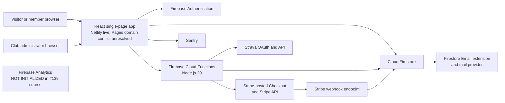

Text alternative: browsers can use the React app, Auth, Firestore, Functions, Stripe, email, Strava, and the separately bounded Sentry path; #139 source has no browser-to-Firebase-Analytics data path, but website publication and provider behavior are not proven here.

### Current component inventory

| Layer | Current implementation | Primary locations | Assessment |
| --- | --- | --- | --- |
| Public and account UI | React 18, React Router 6, mixed JS/TS, Create React App | `src/App.jsx`, `src/pages`, `src/components` | Functional, but the build stack and several dependencies are stale. |
| Identity | Firebase email/password Auth and custom role claims | `src/services/identity`, `functions/signup.js`, `functions/setMemberRole.js` | Reasonable base; admin assurance and role-change audit controls need strengthening. |
| Operational data | Cloud Firestore | `src/services`, `firestore.rules`, `firestore.indexes.json` | Appropriate for current scale; counters and state transitions require transactional design. |
| Server API | First-generation Firebase callable/HTTP/trigger functions | `functions/` | Prototype covers most workflows; validation, idempotency, and isolation are incomplete. |
| Payments | Stripe Checkout Sessions, Payment Links, refunds, signed webhook | `functions/createCheckoutSession.js`, `createMerchCheckout.js`, `stripeWebhook.js` | Not ready for live payments until P0 issues are complete. |
| Hosting and release | Netlify currently answers `runmprc.com`. GitHub Pages still reports the same custom domain, so its default URL redirects to the Netlify-served name instead of providing an independent copy. #135 source stops automatic releases, pauses Git-triggered Netlify production builds, and removes the Pages CNAME from future protected artifacts. | `netlify.toml`, `.github/workflows/deploy.yml`, `public/404.html` | Split and conflicting as verified 2026-07-13. The existing Pages provider setting is not cleared until a controlled #136/WEB-001 release and readback prove it. #133 authority, #136 release evidence, Netlify provider triggers, DNS, headers, and rollback remain open. |
| Email | Firestore `mail` outbox designed for the Firebase Trigger Email extension | `functions/sendConfirmationEmail.js` | Extension/provider deployment is unverified; outbox creation is not transactionally idempotent and HTML needs escaping. |
| Observability | Optional Sentry; Firebase Analytics configuration remains but its runtime is not initialized by #139 source | `src/services/monitoring`, `src/services/analytics` | #134 source bounds Sentry payloads. #139 source removes every application runtime Firebase Analytics import, initialization, and emission while preserving no-op call compatibility. Website publication, provider collection/cookies and historical data, consent, retention, access, deletion, and vendor configuration remain unverified under #110/#111. |
| Third-party fitness | Strava OAuth tokens and statistics | `functions/strava.js`, `src/services/strava` | Functional prototype. The #100 source Rules deny browser token access, but Firebase deployment is unproven and transactional refresh, scopes/revocation, IAM/encryption decision, and audit remain OAUTH-001. |

The former workflow automatically published Pages before attempting Firebase and could finish green after skipping Firebase. #135 replaces that source path with a manual exact-current-commit request, exact latest CI checks, one fixed backend plan, protected short-lived identity wiring, provider readback, and Firebase-before-Pages publication. Missing authority or failed/partial verification is red. Git-triggered Netlify production builds stop, while build hooks and protected Netlify publication remain unverified. No source test clears the current Pages custom-domain claim, configures #133, deploys #136, or proves `runmprc.com`; those remain separate provider states. The App Engine synchronization script is another surface that must be documented as active or retired.

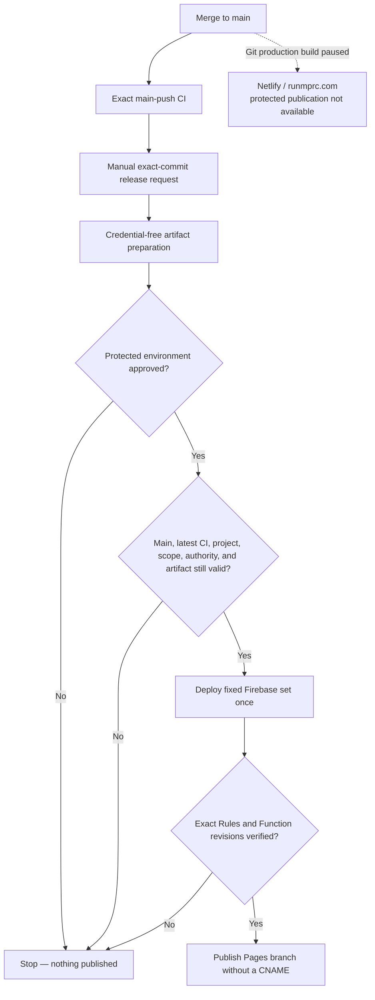

Text alternative: a merge only runs CI; a separate request prepares a public artifact, waits for protected approval, rechecks current source and authority, verifies Firebase, and only then publishes a Pages branch that no longer claims the Netlify domain.

### GitHub Pages callback handoff

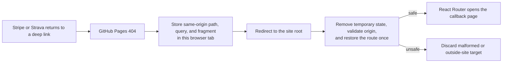

Text alternative: the 404 page temporarily carries the complete return route to the root page; an early referrer policy keeps the path/query/fragment out of subresource request headers, and the root page deletes the temporary value before accepting only a same-origin route. App Check, Analytics, and Sentry stay off on that initial capability-bearing callback. The bridge does not prove payment, OAuth state, or identity. Server/provider verification still decides the result.

### Strava callback current-address cleanup — source only, not live

OAUTH-001C1G [#335](https://github.com/Run-MPRC/Run-MPRC.github.io/issues/335) adds a second boundary after the existing Pages handoff. The Strava callback keeps only its initial `code`, `state`, and provider-error fields in temporary component memory. It replaces the current native browser and React Router entry with the same path, no address details after `?` or `#`, and no saved callback detail before the callback mounts its Auth/service work, verifies state, or starts the existing exchange attempt.

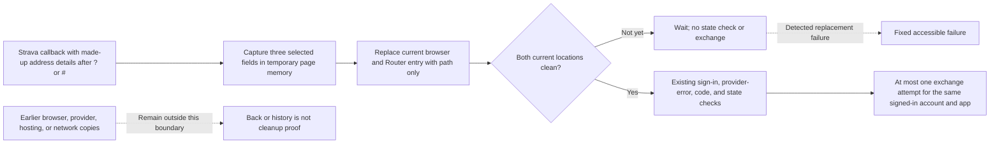

Text alternative: the callback captures three selected made-up fields in temporary page memory, replaces the current browser and Router entry with the clean path, and proceeds to the existing checks only after both current locations are clean. Unconfirmed cleanup waits without state verification or exchange. A detected replacement failure shows the fixed stop. Cleaning the current entry does not erase earlier browser or outside copies.

The source also discards a later same-route callback. After unmount or a signed-in UID, service, Firebase resources, or app change, an obsolete browser result cannot navigate or show success. That does not cancel an exchange that already reached the server or provider; its outcome may still occur and require separate reconciliation. This child does not change the Pages bridge, provider request, server state model, App Check enforcement, scopes, membership, or deployment. Source, tests, merge, website publication, `runmprc.com` revision verification, Firebase deployment, Strava configuration, production data, and live OAuth behavior remain separate states. Canonical [#88](https://github.com/Run-MPRC/Run-MPRC.github.io/issues/88) remains open for server-issued one-use state, expiry/replay, account and scope policy, concurrency, reconciliation, revoke/audit, IAM/encryption, provider configuration, deployment, and live proof.

### Firebase Auth action link — source only, not live

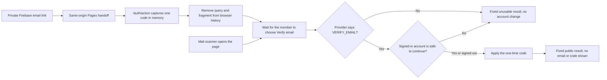

Text alternative: after the website hands off the action route, the app keeps one code only in component memory, removes it from both the visible address and router location, makes no account change when a scanner merely opens the page, and applies it only after a person chooses the button and Firebase confirms the verification operation. The result never grants membership or writes a member profile.

AUTH-MAIL-002C2 [#194](https://github.com/Run-MPRC/Run-MPRC.github.io/issues/194) owns this verification-only source route. It ignores query-provided API keys and continuation URLs, suppresses Sentry and App Check startup while the initial capability is present, and returns only small non-identifying states. Its fixed `/account` exit performs a full clean-page load so App Check can start only after the private query is gone. Firebase configures one custom handler for verification, password reset, and email recovery. Therefore [#119](https://github.com/Run-MPRC/Run-MPRC.github.io/issues/119) must not point the project-wide action URL at this partial route. Keep Firebase's default multi-mode handler or wait for separately reviewed coverage of every enabled mode. Website publication, provider configuration, action-link reachability, and the Firestore verification mirror remain unproven.

The direct-rewrite hosting path does not need browser storage. The existing GitHub Pages fallback from #99 briefly places the complete return route in tab-local `sessionStorage`, then its first root-page script reads and deletes that value before React starts. If the root page never loads, the value can remain until the tab closes. #194 accepts that already-merged residual only for Pages compatibility; it does not call this “memory only.” A future direct SPA rewrite should remove the bridge. The component itself never writes the code to storage or router state.

## 4. Target deployment topology

The target keeps React, Firebase, and Stripe, but places stronger boundaries around them. Migrating the frontend from GitHub Pages to Firebase Hosting is recommended before live commerce because it supports controlled SPA rewrites, preview channels, and security headers. That hosting migration is not required to design or test the backend, and must be executed as its own issue.

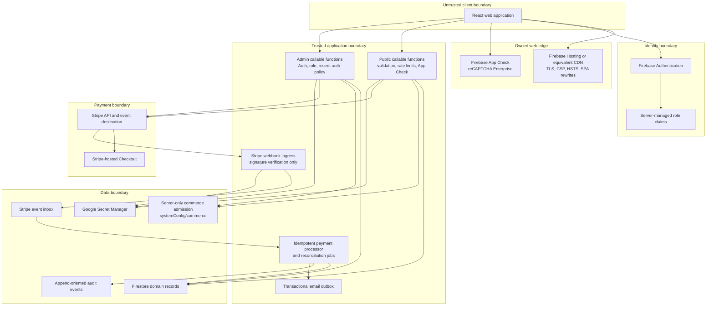

Text alternative: checkout and refund commands read both domain records and the server-only commerce control; the signed webhook path does not depend on that control and continues processing payment evidence.

## 5. Trust boundaries and authorization

| Boundary | Trusted assertions | Never trust directly |
| --- | --- | --- |
| Browser | A Firebase ID token after SDK/server verification; an App Check token after Firebase verification | Price, member status, registration status, order status, redirect query parameters, product availability, capacity, inventory, or admin UI visibility |
| Firebase Auth | UID, verified token claims, token timestamps | A role copied into Firestore or sent in the request body |
| Stripe webhook | Event payload only after raw-body signature verification with the endpoint's secret | An unsigned request, a browser success redirect, or a client-provided Session ID without server retrieval/validation |
| Firestore client SDK | Reads and writes allowed by the deployed ruleset | The presence of a hidden UI control as authorization |
| Cloud Functions/Admin SDK | Application code and IAM-scoped service identity | Firestore rules as protection; Admin SDK bypasses those rules |
| GitHub Actions | Pinned workflow and environment-scoped secrets | Pull-request code with production secrets or a shared, long-lived deployment token |

### Roles

The current `unverified`, `member`, and `admin` claims should evolve toward capabilities rather than one all-powerful role. A practical first split is:

| Capability | Example users | Allowed operations |
| --- | --- | --- |
| `member` | Verified club member | Members-only content and member price |
| `event_manager` | Race director | Event content, roster, comps, substitutions; no global member roles or merchandise refunds |
| `shop_manager` | Merchandise lead | Catalog, orders, tracking, fulfillment; no event or membership administration |
| `finance_admin` | Treasurer | Refunds, reconciliation, disputes, reports |
| `identity_admin` | Membership lead | Membership verification and role administration |
| `platform_admin` | Very small break-glass group | Security configuration and role grants |

The first release may continue using `admin` in the UI, but server endpoints and Firestore rules should be narrowed by resource now so future capability claims can be introduced without rewriting payment logic.

### Current verified-role boundary — source only, not live

AUTH-001A [#98](https://github.com/Run-MPRC/Run-MPRC.github.io/issues/98) requires an authoritative verified target before the existing grant endpoints can add `member` or `admin`. AUTH-001B [#196](https://github.com/Run-MPRC/Run-MPRC.github.io/issues/196) requires exact boolean Firebase token claim `email_verified == true` in addition to the existing role for role-based Firestore access. AUTH-001C [#209](https://github.com/Run-MPRC/Run-MPRC.github.io/issues/209) applies the same second gate to current Functions role consumers: shared admin callables, member-only/member-price checkout decisions, and registration CSV export. AUTH-001D1 [#213](https://github.com/Run-MPRC/Run-MPRC.github.io/issues/213) mirrors that decision in the browser so an unverified role-bearing token cannot make member/admin controls look available before the server denies them.

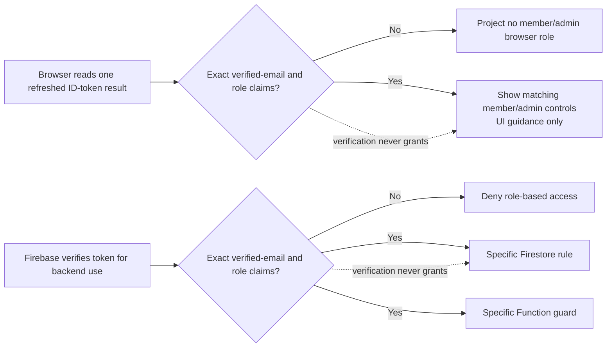

Text alternative: the browser shows member/admin controls only when one refreshed token result contains exact verified-email and role claims, while Firebase independently verifies the same two facts before a specific database rule or Function uses the role; browser display is not authority and verification alone grants nothing.

The Functions policy reads decoded-token `email_verified`, not the camel-case Auth user-record field used while granting a role and not the `emailVerified` profile mirror. The browser policy also reads only the refreshed ID-token claims. Neither accepts a request or profile substitute. Missing, false, string, numeric, inherited, accessor-backed, proxied, unknown, or case-changed claims fail closed. Exact `unverified` remains a non-authoritative display state. Unauthenticated and unauthorized responses remain generic. This does not provide authoritative membership, scoped capabilities, MFA/recent-auth, token revocation, safe roster projection, or legacy-sync retirement.

All four slices are source boundaries until the exact Rules, Functions, and website revisions are deployed through the protected backend-first release and checked with synthetic staged identities. A source merge or green CI run is not live access proof.

## 6. Domain model and ownership

### Current collections

| Path | Purpose | Source of writes | Sensitivity |
| --- | --- | --- | --- |
| `events/{eventId}` | Event content, schedule, pricing configuration, capacity, waiver version | Admin client today; target event-management API for sensitive fields | Public or members-only |
| `events/{eventId}/registrations/{registrationId}` | Participant identity, waiver evidence, payment references, lifecycle | Cloud Functions and admins today; target Cloud Functions only | Restricted PII and financial metadata |
| `products/{productId}` | Merchandise catalog | Admin client today | Public plus internal configuration |
| `orders/{orderId}` | Buyer, shipping, payment, and fulfillment data | Cloud Functions and admins today; target Cloud Functions only | Restricted PII and financial metadata |
| `members/{uid}` | Profile and role mirror | Create-once signup/recovery Functions create phone-free pending profiles; self-service name-only allowlist while #178/#197 pause phone collection; server role operations | Confidential |
| `members/{uid}/connections/{provider}` | Non-secret connection metadata | Cloud Functions | Confidential |
| `members/{uid}/secrets/{provider}` | OAuth tokens | Cloud Functions | Restricted secret |
| `promoCodes/{id}` | Intended promotion configuration | Admin only | Confidential; currently not integrated into checkout validation |
| `ratelimits/{bucket}` | Abuse-control counters | Cloud Functions | Confidential operational data |
| `mail/{id}` | Transactional email outbox | Cloud Functions and email extension | Restricted PII |

### Target additions and changes

| Path or field | Purpose |
| --- | --- |
| `stripeEvents/{stripeEventId}` | Durable, non-PII webhook inbox/deduplication record with processing status and business reference |
| `checkoutRequests/{commandKeyHash}` | Immutable server-only command registration. PAY-002B2A/#165 owns the exact `registered` revision-1 record. |
| `checkoutRequests/{commandKeyHash}/lifecycle/current` | PAY-002B2B/#169 server-only lease, monotonic fence, and terminal commitment source. It is unused and is not provider-send permission. |
| `checkoutRequests/{commandKeyHash}/providerAttempts/0000000001` | PAY-002B2C1/#173 immutable lease-bound initial Stripe plan. It stores command-bound commitments, is unused, and is not account proof or provider-send permission. |
| `checkoutRequests/{commandKeyHash}/providerAttempts/0000000001/sendEvidence/first` | PAY-002B2C2/#182 separate server-only pre-POST marker with a complete C1-plan digest, its originating fence, trusted time, and persisted 23-hour automatic-retry deadline. It is unused and does not say Stripe received or completed a request. |
| `checkoutRequests/{commandKeyHash}/providerAttempts/0000000001/reconciliationEvidence/0000000001` | PAY-002B2C3B/#206 immutable server-only C3A candidate evidence. It is bound to the exact C1 plan, complete C2 record/audit, observed expired lease, and trusted time. It is unused and grants no later-attempt or send permission. |
| `checkoutRequests/{commandKeyHash}/providerAttempts/0000000001/reconciliationEvidence/0000000001/nextAttemptAuthorizations/0000000002` | PAY-002B2C3C/#226 immutable server-only authorization for one later logical provider attempt. It requires the exact C3B pair, a matching closed transition commitment, and a fresh active lease. It is unused and grants no plan or send permission. |
| `checkoutRequests/{commandKeyHash}/providerAttempts/0000000002` | PAY-002B2C4A/#232 immutable server-only attempt-2 plan. It requires the exact C3C authorization pair and current active lease. Version 1 preserves the attempt-1 account/mode/API/operation/endpoint/parameters and grants no send permission. |
| `checkoutRequests/{commandKeyHash}/providerAttempts/0000000002/sendEvidence/first` | PAY-002B2C4B/#238 immutable server-only attempt-2 pre-POST marker. It binds the complete authorized C4A plan with commitment version 2, the current fence/time, and a fixed 23-hour deadline. It is unused and does not say Stripe received or completed a request. |
| `auditEvents/{eventId}` or bounded per-record audit subcollections | Append-oriented operational and security audit trail. B2A's first event is `commerce_command_{commandKeyHash}_0000000001`; B2B appends one deterministic event for each real lifecycle change; C1 binds the first plan with `commerce_provider_attempt_{commandKeyHash}_0000000001`; C2 pairs the attempt-1 pre-send marker with `commerce_provider_send_{commandKeyHash}_0000000001`; C3B pairs candidate evidence with `commerce_provider_reconciliation_{commandKeyHash}_0000000001_0000000001`; C3C pairs later-attempt authorization with `commerce_provider_authorization_{commandKeyHash}_0000000001_0000000001_0000000002`; C4A binds the second plan with `commerce_provider_attempt_{commandKeyHash}_0000000002`; C4B pairs its pre-send marker with `commerce_provider_send_{commandKeyHash}_0000000002`. |
| `events/{id}.capacityCounters` | Transactionally maintained participant reservations, paid seats, and released seats |
| `products/{id}/variants/{variantId}` | SKU, option values, price, on-hand, reserved, and sold counts |
| `orders.paymentStatus` and `orders.fulfillmentStatus` | Separate money state from physical fulfillment state |
| `registrations.paymentStatus` and `registrations.registrationStatus` | Separate payment lifecycle from attendance/transfer/cancellation lifecycle |
| `orders/registrations.stateSchemaVersion` and `refundStatus` | Version the split business-record state contract and keep confirmed refund status/total separate from payment/operational state |
| server-only per-dispute records | Keep one state per Stripe dispute; never collapse multiple disputes into one canonical order/registration `disputeStatus` |
| `retentionJobs/{jobId}` | Optional operational record of scheduled minimization/deletion work |
| `systemConfig/commerce` | Versioned global/domain command admission; browser read/write denied; protected writer is not available yet |
| `events/{id}.checkoutEnabled` and `products/{id}.checkoutEnabled` | Explicit server-owned resource admission; missing means disabled |

Large `auditLog` arrays on registration and order documents should be replaced before they approach Firestore document-size and write-contention limits. New audit data should be append-oriented.

PAY-002A1 is tracked in live [#161](https://github.com/Run-MPRC/Run-MPRC.github.io/issues/161). Numeric local `stateSchemaVersion: 1` is distinct from string Stripe metadata `schemaVersion: "1"`, which only versions provider reference binding. The reducers and legacy classifier are a pure source/test target: they import no Firebase or Stripe code, make no call, and are not used by an endpoint. Current records, webhook behavior, compatibility writes, real migration, deployment, and live state remain unchanged until later PAY-002/PAY-003 children adopt the contract.

PAY-002B1 is tracked in live [#163](https://github.com/Run-MPRC/Run-MPRC.github.io/issues/163). It is also pure and unused: it separates a caller/environment/UUID command key from a command-type/payload fingerprint, then derives a deterministic Stripe key for one immutable provider attempt. Production/live and non-production/test are the only accepted environment/mode pairs. The command key intentionally excludes command type so a journal can reject reuse of one caller command ID for another operation. Hashes are pseudonymous server-only identifiers—not anonymization—and must not enter browsers, logs, URLs, or analytics. The library contains no Firestore transaction, lease, clock, result, audit, Stripe call, or authorization decision.

PAY-002B2A is tracked in live [#165](https://github.com/Run-MPRC/Run-MPRC.github.io/issues/165). Its unused server-only transaction writes the exact `checkoutRequests/{commandKeyHash}` registered record and `auditEvents/commerce_command_{commandKeyHash}_0000000001` event together with one trusted Timestamp, or writes neither. Exact retries are read-only; command-type, endpoint-version, or payload mismatch under the same B1 key conflicts; corrupt or incomplete pairs fail closed without repair. Environment and caller scope are already bound into the B1 document ID, so a different scope creates a different record rather than a cross-scope conflict. The fixed result grants no authorization or execute/send permission and contains no hash, path, raw identity, UUID, or payload.

B2A has no endpoint/index export, lease, fence, terminal commitment, result replay, provider plan/key/object, Stripe call, provider attempt transition, safe-send clock, or reconciliation behavior. PAY-002B2B source/tests are tracked in live [#169](https://github.com/Run-MPRC/Run-MPRC.github.io/issues/169). They keep the B2A root and revision-1 audit immutable and store mutable state at `checkoutRequests/{commandKeyHash}/lifecycle/current`. The source uses a fixed 60-second server lease, a command-bound fingerprint of a trusted UUID v4 holder, and a monotonic fence so stale or expired workers cannot finish. Each real lease or terminal change gets one deterministic audit event.

B2B terminal success stores only a command-bound commitment to a later server-only business result. That commitment is not the result itself, proof that Stripe or Firestore work happened, or response replay. The lease/fence is concurrency evidence, not authorization or provider-send permission. PAY-002B2C1/#173 owns immutable initial-plan binding. PAY-002B2C2/#182 owns only separate pre-send evidence and a conservative automatic-retry cutoff. B2C3 still owns verified reconciliation and safe attempt advancement. No TTL is safe yet: deleting both C2 partners would look like first use, so [#110](https://github.com/Run-MPRC/Run-MPRC.github.io/issues/110) must approve retention and a server-only tombstone or equivalent durable duplicate barrier before a command pair can be deleted.

PAY-002B2C1 source/tests are tracked in live [#173](https://github.com/Run-MPRC/Run-MPRC.github.io/issues/173). With the exact current unexpired lease/fence, the unused journal can atomically create the immutable attempt-1 plan plus `auditEvents/commerce_provider_attempt_{commandKeyHash}_0000000001`. The first version accepts only the static `checkout_session_create` → `/v1/checkout/sessions` mapping, so an object ID or capability cannot enter the stored path. The plan also fixes Stripe mode, API version, original binding fence, and command-bound commitments to the account, canonical parameters, and deterministic B1 key. Raw account/parameters/key are absent. An existing plan is accepted only when its binding time fits the deterministic lifecycle audit for its original fence. An exact active-lease retry is read-only; a valid takeover may observe but cannot rewrite the plan; conflicts and malformed or missing partners fail closed.

These commitments are pseudonymous equality evidence, not authorization, configured-account proof, a pre-POST marker, provider-execution proof, or response replay. PAY-002B2C2 source/tests are tracked in live [#182](https://github.com/Run-MPRC/Run-MPRC.github.io/issues/182). Its unused transaction recomputes the exact B1 identity and C1 plan, requires the exact active lease holder/fence, and creates only the separate marker/audit pair. Both partners bind a command-bound digest of every immutable C1 plan field, so a later coherent account, API-version, endpoint, parameter, key-commitment, or binding change cannot reuse the marker. Version 1 persists a deadline exactly 23 hours after the pre-POST marker. The first atomic creation, and an exact attempt-1 retry, are classified `send_permitted` only when a post-transaction trusted-time check is still strictly before the transaction-validated lease's captured expiry and the stored deadline. The second check does not re-read lifecycle state. Equality, later time, rollback, or paired missing/unreadable time is classified `reconciliation_required`; no attempt advancement follows.

The fixed C2 result is narrow retry-safety evidence. It is not caller authorization, configured-account proof, a claim that Stripe received the POST, a provider outcome, or response replay. Timeout, connection loss, `5xx`, a missing object reference, and incomplete search are deliberately not C2 inputs and cannot manufacture attempt `2`. B2C3 remains responsible for verified reconciliation evidence and safe later-attempt authorization. #173/#182 have no runtime/index import, Stripe/network call, Firebase deployment, provider configuration, production data, website, or live/officer effect.

PAY-002B2C3A source/tests are tracked in live [#184](https://github.com/Run-MPRC/Run-MPRC.github.io/issues/184). The unused pure policy accepts only one exact flat version-1 Stripe attempt-1 evidence record made from closed enums. It returns one of three frozen non-identifying results: `existing_attempt_found` with `do_not_advance`, `new_attempt_candidate` with `requires_persistence_and_authorization`, or `reconciliation_required` with `requires_reconciliation`. Only the matching complete tuple for trusted proof that endpoint execution never began, or the matching complete tuple for an exact verified expired/unpaid Session plus verified expiry and an explicitly eligible new logical generation, can be a candidate. The matching complete exact-open or verified-success tuple identifies an existing attempt. Every single-field difference, timeout, lost connection, provider error category, old/pruned key, missing reference, not-found result, empty/partial search, processing/unknown state, mismatch, or conflict requires reconciliation.

C3A classification is not authorization or provider truth. The module accepts no IDs, keys, accounts, metadata, money, timestamps, business/member values, free text, URLs, or caller-selected status codes. It stores nothing, calls nothing, is imported by no runtime entry point, and cannot create attempt `2`.

PAY-002B2C3B source/tests are tracked in live [#206](https://github.com/Run-MPRC/Run-MPRC.github.io/issues/206). The unused journal imports the unchanged C3A classifier and may persist only its exact `new_attempt_candidate` result. The deterministic evidence/audit pair is created atomically only when the complete C2 record/audit is valid, the 23-hour automatic retry deadline has arrived, and the current validated lease is expired. Equality is allowed because C2 stops automatic POST at its deadline and lease expiry. A still-active lease or an early candidate returns the unchanged C3A candidate without writing. Exact retries are read-only; a changed valid evidence tuple conflicts; a missing, malformed, orphaned, future, or foundation-mismatched pair fails closed without repair.

C3B stores only closed C3A enum values, schema versions, command-bound C1/C2 commitments, the observed fence/expiry, and one trusted time. A digest covers the complete evidence record and is carried by its deterministic audit. Raw account, key, parameters, provider/business/member IDs, money, URLs, free text, response data, and attempt `2` are absent. The fixed persisted result says only `requires_separate_authorization`. C3C must still require this proof, an allowed business transition, and a fresh lease before it can authorize/version a later attempt. Neither C3A nor C3B retrieves provider truth, calls Stripe, replays a response, changes a business record, or has a runtime/index edge. No Firebase/Stripe deployment, provider configuration, production read/write, website, or officer behavior is changed by #184/#206 source.

PAY-002B2C3C source/tests are tracked in live [#226](https://github.com/Run-MPRC/Run-MPRC.github.io/issues/226). The unused `authorizeNextStripeProviderAttempt` API consumes only the exact validated C3B pair. It repeats the complete safe-tuple check, requires either the matching `retry_same_operation` or `replace_expired_unpaid` transition, command-binds an opaque transition-record commitment, and requires the exact current holder/fence under a lease acquired at or after C3B persistence with a later fence.

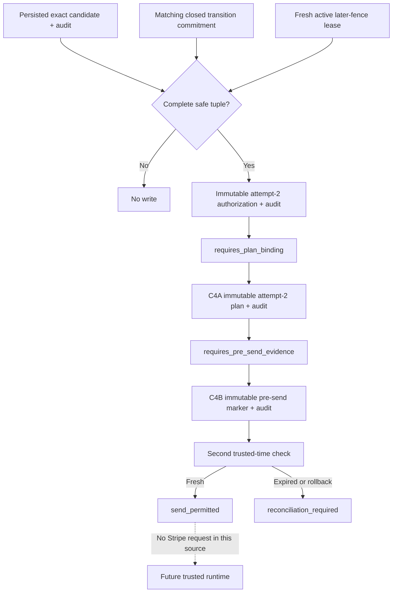

Text alternative: one exact saved safe candidate, matching transition, and fresh lease can authorize attempt 2; C4A may bind its plan, and C4B may record pre-send evidence only while a second clock check remains before the captured lease expiry and fixed deadline; none of these source steps calls Stripe.

The record/audit pair binds the command identity; complete C1, C2, and C3B commitments; environment/mode/operation; attempts `1` and `2`; transition kind and command-bound transition-record commitment; a command-derived attempt-2 key fingerprint; the fresh lease fence; and one trusted time. It stores no raw key, account, parameters, identity, money, URL, response, free text, or personal data. The opaque transition commitment is not current business-state proof; a future runtime must derive it from a trusted business-record transaction. Exact retry and later-lease observation are read-only. Changed valid input conflicts. Orphaned, malformed, future, unsafe, or foundation-mismatched data fails closed without repair.

The fixed result is `provider_attempt_authorized` with `requires_plan_binding`; it contains no execute/send flag or sensitive value. #226 creates no attempt-2 provider plan or pre-send record, changes no business record, calls no provider, and has no endpoint/index edge. Firestore Rules source remains unchanged and browser roles remain denied. This is synthetic source/test design evidence only: Firebase deployment, Stripe configuration, production data, website publication, live behavior, and the PAY-002C/D/PAY-003B runtime adoption remain open.

PAY-002B2C4A source/tests are tracked in live [#232](https://github.com/Run-MPRC/Run-MPRC.github.io/issues/232). The unused `bindAuthorizedStripeProviderPlan` API revalidates the exact B1-through-C3C chain and current active lease before atomically creating the immutable attempt-2 plan and its deterministic audit. Version 1 is equality-only: account, mode, API version, operation, endpoint, and canonical parameters equal attempt 1. Only the internally derived attempt-2 key commitment, current binding fence/time, attempt number, and C3C provenance may differ.

The fixed result is `provider_plan_bound` or `provider_plan_existing`, with `requires_pre_send_evidence`. Exact retry and later valid lease observation are read-only; changed valid input conflicts; malformed, orphaned, future, impossible-chronology, or foundation-mismatched partners fail closed. The pair stores no raw identity, account, parameters, key, money, URL, response, secret, or personal data. C4A creates no send evidence, changes no business record, calls no provider, and has no endpoint/index edge. PAY-002B2C4B [#238](https://github.com/Run-MPRC/Run-MPRC.github.io/issues/238) owns the separate attempt-2 pre-send boundary below. Other Stripe operations require their own reviewed boundaries.

PAY-002B2C4B source/tests are tracked in live [#238](https://github.com/Run-MPRC/Run-MPRC.github.io/issues/238). The unused `recordAuthorizedStripeSendEvidence` API revalidates B1 through C4A plus the current active holder/fence before creating the attempt-2 marker and deterministic audit, or neither. Both carry `providerPlanCommitmentSchemaVersion: 2`, a digest of every C4A plan field and nanosecond binding time including the authorization schema and commitment. Existing version-1 commitment bytes remain unchanged.

The marker time is captured once before the transaction; its deadline is exactly 23 hours later and never moves on retry. After the transaction, a second trusted-time check does not re-read lifecycle state. Permission requires no rollback and a time strictly before both the captured current lease expiry and stored deadline. Equality, later time, rollback, or missing/unreadable paired time returns fixed `reconciliation_required`. Exact retry and a later valid lease observation are read-only inside the original deadline. The fixed permitted result is only `send_permitted` with `pre_send_recorded`; it does not prove caller authority, current business state, Stripe-account control, request execution, or a provider result.

C4B stores no raw identity, account, parameters, key, transition value, money, URL, response, secret, or personal data. It is limited to `checkout_session_create` at `POST /v1/checkout/sessions`; it cannot create attempt `3`, call Stripe, write a business record, or enter an endpoint/index. Product/Price creation, Session expiry, refunds, and privileged provider actions require separate operation-specific plan, pre-send, result, and reconciliation boundaries.

PAY-002B2C4C1 source/tests are tracked in live [#246](https://github.com/Run-MPRC/Run-MPRC.github.io/issues/246). The unused pure `classifyAuthorizedStripeCheckoutResultEvidence` API accepts only a primitive, length-bounded, canonical JSON string encoding the reported 16-field attempt-2 Checkout Session assertion envelope. Parsing creates the ordinary record inside the module; non-string objects fail before property access. Its sole matching output is `unbound_result_candidate` with `requires_dispatch_evidence_persistence_and_business_validation`; every other valid closed tuple reconciles and every malformed or non-canonical serialized value fails with one fixed redacted error.

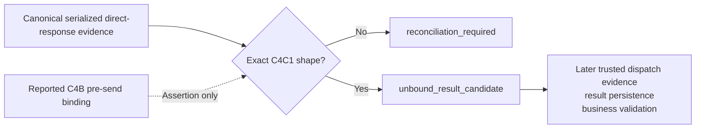

Text alternative: canonical serialized reported evidence may produce only an unbound shape candidate, which must stop until later trusted dispatch evidence, result persistence, and business validation exist.

C4C1 creates no persisted collection or audit row. It has no dispatch or idempotency proof, parses no raw Stripe object, stores no Session reference or URL, and has no journal, endpoint, index, provider, business-state, Rules, or deployment edge. C4B does not point directly to a trusted result: both the reported response and pre-send binding are untrusted assertions until a future adapter and runtime boundary validate them.

### C4C2A Stripe SDK response observation — TEST ONLY, UNUSED

PAY-002B2C4C2A is tracked in live [#275](https://github.com/Run-MPRC/Run-MPRC.github.io/issues/275). One Node 20 suite calls the installed `stripe` 14.25.0 public Checkout Session create path through the SDK's exported but experimental/unstable `HttpClient` interface and a fully synthetic in-memory fake. This is an installed-version observation and dependency-upgrade gate, not a provider contract. It observes selected own data properties and `lastResponse`: the same fake raw-response object attached by the SDK as an own non-enumerable, non-writable property. Header-derived fields added by the SDK are observed separately from `statusCode`, which the fake raw object supplies; this is not an exhaustive model of a production `IncomingMessage`.

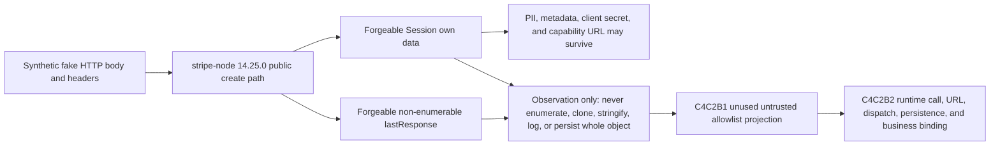

Text alternative: a fake HTTP client can make the public SDK return a Session and response metadata containing controlled values, including sensitive fields and an unvalidated URL. C4C2A is only an installed-version test observation; C4C2B1/#280 adds only an unused untrusted allowlist projection, while C4C2B2 still owns the runtime call, raw memory-only comparisons, URL approval, persistence, and business binding.

The synthetic Session demonstrates that unknown fields, customer/contact data, metadata, a client secret, a fragment-bearing standard Checkout URL, and an HTTPS custom `.invalid` URL can survive SDK deserialization unchanged. The URLs are unvalidated pass-through values. Raw JSON serialization omits `lastResponse` but retains unsafe Session fields. A normal synthetic Stripe error envelope rejects, while a bare non-2xx response without that envelope may resolve, so resolution, rejection, and status are never trusted alone. Synthetic fixture literals may live in test source, but no dynamically captured raw value may enter a snapshot, log, issue, or artifact.

The fake client controls every observed resource and header value. Neither the Session shape nor `lastResponse` proves Stripe origin, account control, dispatch, delivery, idempotency-key use, plan/send binding, application environment, business clock, payment, capacity, inventory, or business state. This does not claim that the SDK makes literally no internal platform or time observation. #275 adds no projector, validator, runtime adapter, provider call, journal/persistence, endpoint/index import, or canonical C4C1 evidence. A future saga persists only a server-only Session ID, expiry, and minimal reviewed evidence—not the Checkout URL. Any replay must retrieve the Session by that stored ID and freshly validate the URL and business/provider bindings before returning it.

Source, synthetic tests, merge, website publication, `runmprc.com` verification, Firebase deployment, Stripe configuration, production data, and live behavior are separate states. C4C2A proves only the first two when their corresponding evidence exists; it changes no officer task.

### C4C2B1 server-only Checkout Session projection — SOURCE ONLY, UNUSED

PAY-002B2C4C2B1 is tracked in live [#280](https://github.com/Run-MPRC/Run-MPRC.github.io/issues/280). The pure `projectStripeCheckoutSessionObservation` boundary accepts one untrusted Session-like object. It rejects root and `lastResponse` proxies before reflection, requires the selected Session and response observations to be own data properties with the installed-SDK descriptor shapes pinned by C4C2A, and reads each selected descriptor once. It ignores every unknown field without enumeration or access. It imports no SDK, Firebase, Firestore, journal, configuration, clock, logger, network, filesystem, endpoint, or index.

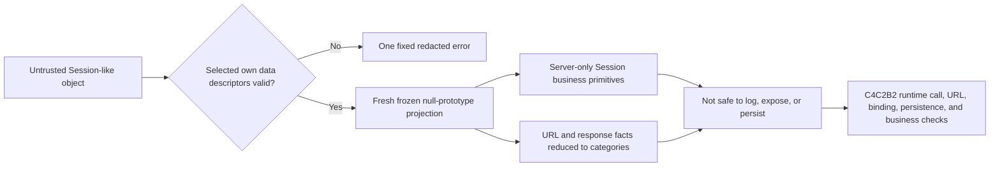

Text alternative: C4C2B1 reads only named own data fields, returns technically bounded server-only Session primitives plus redacted URL/response categories, and stops before runtime trust, persistence, or business use.

The projection fixes schema version `1`, provider `stripe`, and provider operation `checkout_session_create`, then includes a bounded Session ID, object/mode/status/payment-status values, live-mode flag, amount/currency pair, and creation/expiry integers. The fixed provider and operation labels describe this projector; they do not prove provider origin or execution. Every retained value remains forgeable and server-only; #280 does not authorize logging or persistence. The raw Checkout URL is reduced to `bounded_https_capability_present` or `absent`, without returning the URL or approving its host, callbacks, or fragment. Raw request ID, idempotency key, Stripe account ID, and API-version text are also excluded. Only fixed bounded-present/missing, expected/other API-version, and response-status categories survive. Metadata, customer/contact data, client secrets, callback URLs, response bodies/headers/sockets, and unknown fields never enter the projection.

The fixed classification is `untrusted_checkout_session_projection` with `requires_runtime_binding_persistence_and_business_validation`. It is not C4C1 positive evidence and proves no provider origin, account control, dispatch, key use, plan/send binding, configured environment, current time, payment, capacity, inventory, retention approval, persistence, or business state. C4C2B2 must control the SDK promise, compare raw memory-only response facts to trusted C4A/C4B/configuration evidence, approve the memory-only capability URL, bind current business/time facts, persist only approved server evidence, and return a current URL without logging or storing the URL.

Source change, tests, merge, website publication, `runmprc.com` verification, Firebase deployment, Stripe/provider configuration, production data, and live behavior are separate states. #280 changes no officer task and proves none of the external or live states.

### C4C2B2A Checkout Session transport comparison — SOURCE ONLY, UNUSED

PAY-002B2C4C2B2A is tracked in live [#285](https://github.com/Run-MPRC/Run-MPRC.github.io/issues/285). The pure `classifyStripeCheckoutSessionResponseBinding` policy classifies a possible binding; it is not a binding adapter. A future controller must build one frozen null-prototype schema-1 capsule in one synchronous call stack. The capsule carries an already-created exact #280 projection plus separately captured observed and expected API-version, idempotency-key, and optional Stripe-account primitives. The policy does not call #280, inspect or re-read a Session, retain input references, await work, call Stripe, or write data.

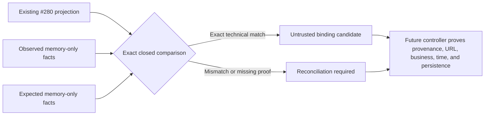

Text alternative: a future controller gives the pure classifier an already-created #280 projection plus memory-only observed and expected transport primitives; an exact comparison yields only an untrusted candidate and every mismatch stops for reconciliation.

The classifier revalidates the exact #280 schema and all capsule keys, descriptors, bounds, and prototypes without coercion. API version `2023-10-16` is the installed compatibility ceiling. A candidate also requires exact non-missing idempotency-key equality, expected-200, bounded request-ID, bounded HTTPS-capability, and either exact bounded account equality or missing account on both sides. Matching missing accounts proves transport consistency only, never platform-account identity or control. Business, environment, and time fields remain unapproved even when structurally valid.

Outputs are fresh frozen fixed three-field records: `untrusted_transport_binding_candidate` or `reconciliation_required`. They contain no Session ID, URL, request ID, raw API/key/account value, source reference, personal data, or secret. Expected inputs have no trusted provenance in this child. #285 does not establish same-promise capture, Stripe origin/account, C4A/C4B/configuration binding, dispatch, delivery, approved URL/callback, current business/time facts, retention, persistence, C4C1 mapping, replay, endpoint/index adoption, deployment, or live behavior. The remaining C4C2B2 runtime controller owns those proofs.

CI-001B3 [#167](https://github.com/Run-MPRC/Run-MPRC.github.io/issues/167) runs the exact opt-in command-journal emulator suite as a named hosted release prerequisite; #169, #173, #182, #206, #226, #232, and #238 expand that same suite. These are synthetic source checks only. Source change, tests, merge, Firebase deployment, Stripe configuration, production data, website publication, `runmprc.com` verification, and live behavior remain separate states. The current journal source remains unused and makes no endpoint, provider, production, website, or officer change.

## 7. Business invariants

The following are correctness rules, not UI preferences:

1. `amountExpectedCents`, `currency`, and sellable item are read from server-controlled data.
2. `amountPaidCents` comes from a verified Stripe object and is stored separately from expected list price.
3. A record becomes paid only when `payment_status == paid` or an equivalent successful PaymentIntent state is verified.
4. Each Stripe event is applied at most once; applying it again produces the same final state and no duplicate email, seat, stock decrement, or refund.
5. One checkout request maps to one business record and at most one active Stripe Session.
6. A member price requires a currently verified `member` or authorized admin claim at checkout time.
7. Participant reservations never exceed event capacity. Volunteers do not consume participant capacity unless an event explicitly configures a volunteer cap.
8. Variant reservations never exceed sellable on-hand inventory. A product-wide `active` flag does not imply every size/color is available.
9. Full refunds, terminal cancellations, and expired unpaid Sessions release capacity or inventory exactly once according to policy.
10. Partial refunds do not silently release a seat or fulfilled product.
11. A paid record cannot be changed to cancelled without an explicit policy decision about refunding or retaining funds.
12. Financial state cannot be edited directly from a Firestore client.
13. A waiver record identifies the exact waiver version/text hash accepted, timestamp, event, registrant, and acceptance context.
14. Confirmation pages display only sanitized fields and do not rely on bearer credentials left in URLs or referrer logs.

## 8. Core workflows

### 8.0 Account profile setup and recovery

Issue [#118](https://github.com/Run-MPRC/Run-MPRC.github.io/issues/118) adds a create-once recovery path for accounts whose `members/{uid}` record is missing after the Firebase cutover. It is a source design until the exact Function, current Rules, and dependent website are deployed backend-first and proven with a synthetic account.

```mermaid
sequenceDiagram
    actor M as Signed-in member
    participant W as Account page
    participant F as ensureMemberProfile Function
    participant A as Firebase Auth Admin
    participant D as Firestore

    M->>W: Open My Account
    W->>F: Empty request + verified Firebase sign-in
    alt setup fails
        F-->>W: Generic unavailable result
        W-->>M: Hide Edit; show retry/sign-out path
    else setup continues
        F->>D: Read only members/{caller UID}
        alt profile exists
            D-->>F: Exists
            F-->>W: ready=true; no write or claim change
        else profile missing
            F->>A: Load caller's authoritative Auth record
            F->>D: Transactionally create one phone-free pending profile
            F-->>W: ready=true
        end
        W->>D: Read caller profile through Firestore Rules
        alt read succeeds
            D-->>W: Profile
            W-->>M: Show profile and name-only Edit
        else read fails
            D-->>W: Generic failure
            W-->>M: Hide Edit; show retry/sign-out path
        end
    end
```

The callable accepts no UID or profile fields. A missing record receives bounded name, email, verification, and provider fields from Firebase Auth plus `role: unverified`; while phone collection is paused, the server writes the existing schema-compatible empty phone field instead of copying `user.phoneNumber`. It never copies a member/admin claim, dues, payment, or discount state. Existing records and claims remain byte-for-byte unchanged. This may expose a pre-existing claim/profile mismatch instead of guessing how to repair it; the identity/membership workflow must resolve that mismatch explicitly. App Check is required by the shared boundary only when deployed enforcement is configured, so release evidence must prove that setting before calling App Check live.

DATA-001C1 [#178](https://github.com/Run-MPRC/Run-MPRC.github.io/issues/178) pauses optional phone display and collection in My Account. The owner-profile projection omits `phoneNumber`, the client validates and writes only `fullName`, and the Rules source rejects every browser phone mutation while allowing an existing phone value to remain unchanged during a name edit. DATA-001C2 [#197](https://github.com/Run-MPRC/Run-MPRC.github.io/issues/197) extends the same pause to the shared signup/recovery helper: a new profile keeps the empty phone schema field even when Firebase Auth already has a phone. The create-once transaction leaves every existing profile unchanged. Firestore still authorizes and transports the owner's complete document at its document-level boundary; #116 retains future server projections for broader administrative reads. Neither slice deletes, migrates, exports, or inspects existing phone data, changes Google Forms/providers, or proves spam causation. Source is not live protection until the exact Rules and both profile Functions are deployed/read back before the dependent website revision is published and verified.

The server chooses initial timestamps. The current self-edit path sends a Firestore server timestamp, but the Rules source type-checks rather than independently proves that edit timestamp. Do not describe arbitrary profile edit timestamps as server-authoritative until a coordinated Rules/API issue closes that residual.

### 8.0a Provider-neutral membership authority and entitlement — SOURCE ONLY, UNUSED

MEMBERS-IDENTITY-001A [#208](https://github.com/Run-MPRC/Run-MPRC.github.io/issues/208) defines one unused pure contract that keeps a stable MPRC membership separate from the Firebase account used to sign in. A membership record can exist without a UID. Such a record grants no website entitlement. Google, WhatsApp, Strava, email equality, a profile role, and any browser field remain projections or inputs to future reviewed workflows; none is membership authority.

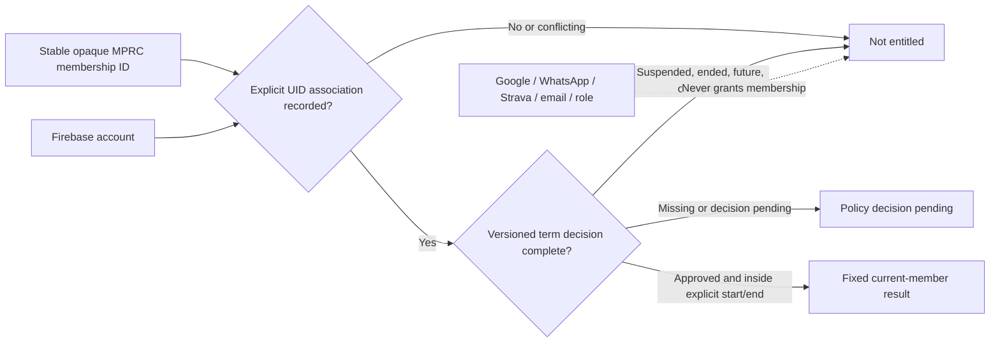

Text alternative: a stable membership receives the fixed current-member result only after an explicit UID association and a complete approved term whose explicit half-open time range contains the evaluation time. Missing, conflicting, suspended, ended, future, expired, or undecided state fails closed. External identities, channels, matching email, and roles never grant membership.

The CommonJS module creates an account-independent revision-1 snapshot, records one explicit account association, records already-decided term references monotonically, and derives one of three frozen non-identifying results: current member, not entitled, or decision pending. It accepts exact plain objects, bounded server-minted opaque identifiers, safe-integer time values, one current term rather than an unbounded mutable history, and a last-command marker for immediate idempotent retry. An exact last-command retry is read-only. A changed last-command retry, a second/different UID association within the snapshot, a stale record revision, an exhausted safe-integer revision, a skipped or repeated term revision, a reversed time range, an unsupported version/state, an extra field, an accessor, or a proxy fails through one fixed error.

This contract does not verify a person, payment, plan, evidence item, refund, dispute, or policy decision. It does not choose calendar-year versus anniversary terms, grace, prices, plan eligibility, retention, or legacy disposition. Its identifier grammar is not a semantic privacy classifier; a future trusted server must mint opaque values and establish every referenced fact. The last-command marker prevents only an immediate changed retry; command IDs are not a durable global replay registry. Durable cross-record UID uniqueness, full command replay history, append-only audit, Firestore schema/Rules, custom claims, token refresh/revocation, runtime authorization, migration, and deployment are later children behind #110, #113, #114, AUTH-003/ADMIN, and the protected release work.

The module is imported by no runtime or Functions index. It reads no clock or environment, calls no Firebase/Stripe/provider service, stores nothing, logs nothing, changes no current profile/role/claim, and cannot make #81, annual renewal, discounts, roster export, or officer membership tools available. Source tests and a merge are not Firebase deployment or live behavior proof.

### 8.0b Provider-neutral external-account link and collision — SOURCE ONLY, UNUSED

MEMBERS-IDENTITY-001C [#367](https://github.com/Run-MPRC/Run-MPRC.github.io/issues/367) defines one unused pure contract that sits beside the §8.0a membership authority and classifies how a single external-account link is reconciled and where a link collision is refused. Email/password, Google, WhatsApp, and Strava are one provider-neutral vocabulary with identical rules; a link is a minimal derived identity projection and never membership evidence. Every classified result carries `grantsAuthority: false`, so no connection, matching identifier, or observed link ever confers membership, price, payment state, or role.

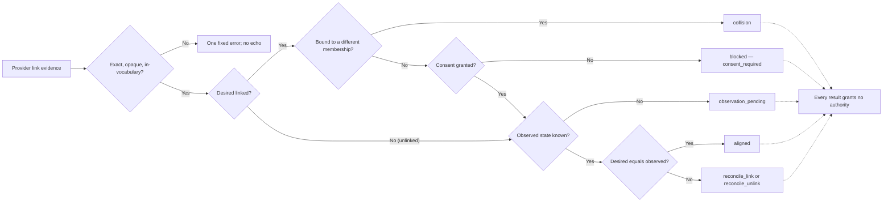

Text alternative: a well-formed link request is classified in one deterministic pass. A request to link is refused as a collision when the opaque account reference is already bound to a different membership, and is blocked when consent is not granted; otherwise an unknown observation is pending, a matching desired/observed pair is aligned, and a mismatch is a link or unlink reconciliation. Malformed, non-opaque, PII-shaped, out-of-vocabulary, extra-field, accessor, or proxy input fails through one fixed error that never echoes the input. No result grants authority.

The CommonJS module exposes a schema version, one frozen input/disposition enum set, one fixed error, and one classifier over an exact eight-field evidence object: schema version, provider, opaque membership ID, opaque non-secret `providerAccountRef`, consent, desired state, observed state, and the membership the account is currently bound to (or none). The opaque-identifier grammar structurally rejects raw email- and phone-shaped references. Collision detection consumes caller-supplied binding evidence rather than reading any index; the classifier holds no state and mints no identifiers.

This contract decides nothing about prices, plans, term boundaries, renewal, retention, or roster disposition, and it issues no custom claim, token, or role — those remain with §8.0a, #114/#115, #110/#113, and the AUTH-003/ADMIN work. Its identifier grammar is not a semantic privacy classifier; a future trusted server must mint opaque references and establish every bound-elsewhere fact. Durable cross-membership uniqueness, consent capture and withdrawal side effects, provider connect/disconnect execution, Firestore schema/Rules, and reconciliation scheduling are later work gated on the remaining AUTH-001 Functions/Admin authorization protections.

The module is imported by no runtime or Functions index. It reads no clock or environment, calls no Firebase/Stripe/provider service, stores nothing, logs nothing, changes no current profile/role/claim, and cannot make #81, provider linking, or any officer tool available. Source tests and a merge are not Firebase deployment or live behavior proof.

### 8.1 Paid race registration

PAY-001B1 [#219](https://github.com/Run-MPRC/Run-MPRC.github.io/issues/219) adds only the browser projection and first two server validation steps below. The website sends the active field set and omits volunteer tier. The callable preserves the opaque event ID, accepts an exact bounded envelope before Firestore, matches answers against the admitted selected server fields, and encodes callback values. It does not add the target request ID, snapshot, transaction, reservation, idempotent Session saga, safe confirmation capability, deployment, or live proof.

```mermaid
sequenceDiagram
    actor R as Runner
    participant W as Web app
    participant F as Registration function
    participant D as Firestore
    participant S as Stripe
    participant H as Webhook processor

    R->>W: Submit identity, waiver acceptance, request ID
    W->>W: Keep active answers; omit volunteer price tier
    W->>F: Callable request + Auth/App Check when available
    F->>F: Validate exact bounded request envelope
    F->>D: Read commerce control and event
    D-->>F: Admitted server event field schema
    F->>F: Match participant or volunteer answers
    F->>D: Transaction: validate event snapshot, reserve capacity, create pending registration
    F->>S: Create Session after command gate; later generation also needs reconciliation gate
    F->>D: Attach Session ID and expiry
    F-->>W: Stripe-hosted Checkout URL
    W->>S: Redirect to Checkout
    S-->>H: Signed Checkout event
    H->>D: Atomic dedupe + amount/currency/reference validation + state transition
    H->>D: Enqueue confirmation email exactly once
    S-->>W: Redirect using Session ID only
    W->>F: Request sanitized checkout result
    F->>S: Retrieve/verify Session if reconciliation is needed
    F-->>W: Confirmed, processing, failed, or support-required state
```

Text alternative: the website sends only the active signup fields; the server then accepts only a small exact request, preserves and safely encodes the event identity, and matches answers to the selected server fields; the target flow later reserves locally before Stripe, accepts payment only through the signed webhook, and returns only a sanitized result.

If Stripe Session creation fails, the function releases the reservation in a compensating transaction. If the function crashes after Stripe creates the Session, PAY-002B2C2 retries only the exact B2C1 plan/key inside its stored safe-send window. After that deadline—or when first-send time is unknown—it stops POSTing. C3A can classify already-verified evidence, and C3B can persist only a candidate after the retry and lease gates; neither retrieves provider truth, authorizes, or advances. C3C must complete the separate fresh-lease authorization gate, C4A must bind the immutable later plan, and C4B/#238 must record its own pre-send evidence before a later POST. A scheduled job releases abandoned reservations and reconciles records that missed a webhook.

### 8.2 Free or volunteer registration

The same server validation and Firestore transaction are used, but no Stripe call occurs. The registration moves directly to its confirmed non-payment state. Anonymous confirmation uses a short-lived or hash-stored opaque receipt token that is removed from browser history immediately; signed-in users can use ownership by UID.

### 8.3 Merchandise purchase

Merchandise uses the same checkout saga but reserves a specific SKU/variant. Stripe shipping collection is copied into the order only after a verified paid event. Payment status and fulfillment status remain separate. A paid order may be `unfulfilled`, `packed`, `shipped`, `delivered`, `cancelled`, or `returned` without corrupting the payment ledger.

### 8.4 Refund

An authorized finance action creates a separate refund-operation record with a stable idempotency key. Stripe executes the money movement; the webhook is the canonical confirmation. That operation may show `refund_pending` while waiting, but the order/registration aggregate `refundStatus` remains at its last confirmed value. Repeated clicks or network retries must return the original refund rather than create another one. A full registration refund may release capacity according to event policy; a merchandise refund does not modify inventory until the return/stock disposition is explicitly recorded.

### 8.5 Webhook processing

The ingress verifies method, raw payload, signature, and secret. Relevant event types are written or claimed using the Stripe Event ID. Business processing validates object type, livemode/environment, metadata schema version, business reference, Session/PaymentIntent ownership, currency, and amount. Unknown transitions are quarantined for review. Stripe does not guarantee event order, so each transition is based on current domain state and the retrieved Stripe object when necessary.

## 9. Consistency and failure model

Stripe and Firestore cannot share a distributed transaction. Checkout and refunds are therefore explicit sagas:

- A Firestore transaction protects local uniqueness and scarce-resource counters.
- A stable PAY-002B1 Stripe key identifies one logical provider generation. A lease takeover or HTTP retry is not a new generation. PAY-002B2C1 binds the immutable attempt-1 plan; B2C2 may retry only that exact plan/key inside its conservative stored send window; after that window or with unknown send time, it stops automatic POST. C3A classifies only closed verified evidence, C3B persists only the exact candidate after the stored cutoff and current lease expiry, C3C separately authorizes a later generation, C4A binds its immutable plan, and C4B/#238 records the separate attempt-2 pre-send pair and clock gate. C4C1/#246 can classify one canonical serialized reported shape only as unbound. None proves a provider result, dispatch, persistence, or business validity.
- The business record stores the saga step and external ID.
- A compensating transaction releases a reservation after a known failure.
- A webhook advances successful external state.
- A scheduled reconciler repairs missed, delayed, or out-of-order outcomes.
- Operators receive alerts for records that remain in intermediate or review states beyond their service-level threshold.

Returning a `2xx` response to Stripe means the event has been durably accepted or safely processed. A transient storage failure returns `5xx` so Stripe retries. A permanent validation anomaly is durably quarantined and acknowledged so it does not create an endless retry storm.

## 10. Environment model

| Environment | Firebase | Stripe | Domain | Data policy |
| --- | --- | --- | --- | --- |
| Local source runtime | Firebase Emulator Suite under `demo-mprc-local` | Not safe by Firebase emulation alone | `localhost:3000` | Synthetic data only; browser Firebase traffic is loopback-only |
| CI | Ephemeral emulators and mocks | Stripe fixtures/signature tests; optional isolated test account | None | Synthetic data, no production secrets |
| Staging | Dedicated non-production Firebase project | Stripe sandbox/test keys and its own webhook endpoint | `dev.runmprc.com` | Synthetic or consented test records only |
| Production | Dedicated production Firebase project | Live restricted keys and production webhook secret | `runmprc.com` | Real data under documented retention and access policies |

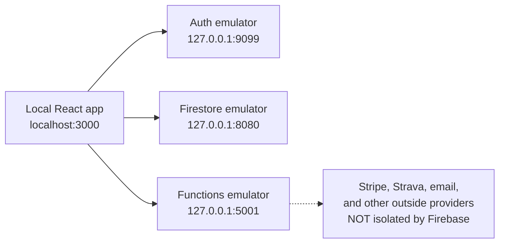

Text alternative: the local browser uses only the three loopback Firebase emulators. A Function can still call an outside provider, so Firebase emulator readiness alone does not authorize checkout, refund, email, or Strava testing.

#99 source selects a fully synthetic Firebase configuration for development/test, connects Auth, Firestore, and Functions to the loopback ports above, stops startup when connection setup fails, and leaves App Check, Analytics, and Sentry off locally. #139 additionally keeps Firebase Analytics off in every source environment and removes the direct Waiver SDK bypass pending an approved #110 policy. The Firebase CLI must still report all three emulators ready before the app is opened. Mocked endpoint tests alone do not prove listening processes, website publication, provider behavior, or deletion of earlier provider data/cookies.

Optimized builds—including current Netlify previews and a locally served `build/` directory—use `NODE_ENV=production` and still target production Firebase. They are restricted to public, read-only visual review until #105/CONFIG establishes a separate staging configuration. Do not sign in, open private/admin pages, or test Firebase/provider actions in those previews.

`SITE_ORIGIN`, Firebase project IDs, App Check keys, Stripe keys, webhook endpoints, Sentry environments, and email providers must be environment-scoped. Live and test webhook secrets are never interchangeable. The repository still needs an explicit staging project before end-to-end rollout.

CONFIG-001A [#149](https://github.com/Run-MPRC/Run-MPRC.github.io/issues/149) adds the source boundary for current commerce and confirmation-mail Functions: local is exact loopback, tests use HTTPS `.test`, staging is exactly `https://dev.runmprc.com`, and production is exactly `https://runmprc.com`. Test/live expected mode must match the server-key marker on the four key-bound Functions. Webhook and mail receive no Stripe API key, and invalid settings stop before rate-limit, business, mail, event-ledger, or Stripe writes. This source boundary does not create staging, configure Secret Manager or Stripe, deploy Firebase, enable commerce, or prove live behavior.

CONFIG-001B1 [#151](https://github.com/Run-MPRC/Run-MPRC.github.io/issues/151) adds a second source boundary for current commands. A false deploy ceiling denies new race, free/volunteer, merchandise, comp, and late-registration work before Firestore. Commands that pass it then require the fresh versioned `systemConfig/commerce` global/domain decision and an explicit resource flag. Registration/order refunds always read the separate incident-refund decision, so disabling new commerce does not silently disable response work. Missing or malformed controls mean disabled. Browser clients cannot read the global document or set resource admission fields. Webhook and confirmation mail deliberately have no edge to this control.

The admission read is a clear linearization point, not a distributed lock. A command admitted on revision N can finish after revision N+1 disables new work, and an already-open Stripe Session or Payment Link can remain payable. PAY-002/PAY-004 own command journals, drain/expiry, and provider-object recovery. CONFIG-001B2 and #105/#133/#136 own the protected writer, drill, deployment, and provider evidence; none is made live by B1 source.

## 11. Security, privacy, and compliance posture

Hosted Checkout reduces MPRC's card-data scope because payment details are entered on Stripe's domain, but it does not make the surrounding system automatically secure or compliant. MPRC still owns access control, application security, privacy disclosures, waiver evidence, fulfillment, refunds, disputes, incident response, vendor configuration, and data retention.

Before launch, MPRC leadership must approve:

- Terms, privacy policy, refund/cancellation policy, fulfillment/shipping policy, and waiver language reviewed by appropriate counsel.
- Stripe account ownership, MFA, least-privilege team roles, bank/payout controls, Radar policy, support contacts, and webhook ownership.
- Tax nexus and sales-tax handling for merchandise and race fees.
- Record-retention periods for financial records, waiver evidence, emergency contacts, birth dates, shipping addresses, support logs, and analytics.
- A named incident commander and a way to disable checkout quickly.

Technical controls and the current findings are detailed in [SECURITY.md](./SECURITY.md). This repository documentation is engineering guidance, not legal, tax, insurance, or PCI certification advice.

## 12. Reliability and service objectives

Initial objectives should be modest and measurable:

| Objective | Initial target |
| --- | --- |
| Checkout API availability | 99.9% during open registration windows, excluding Stripe/Firebase outages |
| Webhook durable acceptance | 99% under 10 seconds; 99.9% under 60 seconds |
| Paid-to-confirmed propagation | 99% under 60 seconds for immediate methods |
| Duplicate fulfillment/refund | Zero tolerated |
| Capacity or inventory oversell caused by application race | Zero tolerated |
| Reconciliation backlog | No unresolved paid/missing-local or local-paid/missing-Stripe item older than 15 minutes during launches |
| Critical security alert response | Acknowledged within 30 minutes during an active paid event window |

These targets require structured logs, alerting, Stripe delivery monitoring, a reconciliation job, and a documented on-call owner. See [OPERATIONS_RUNBOOK.md](./OPERATIONS_RUNBOOK.md).

## 13. Deployment and migration strategy

Use expand-and-contract changes so the deployed frontend and backend remain compatible:

1. Add new fields, endpoints, ledgers, and state handling while continuing to read old records.
2. Deploy backend functions, rules, and indexes before clients that depend on them.
3. Backfill counters, state fields, and business references with a dry-run report and an idempotent migration.
4. Switch new checkout creation to the new path in Stripe test mode.
5. Exercise webhook retries, duplicates, out-of-order events, refunds, expired Sessions, and reconciliation.
6. Run a limited live pilot with one low-risk product or capped event.
7. Observe and reconcile before broad launch.
8. Remove legacy status fields and direct-write permissions only after all active records and clients have migrated.

Never test migration or reconciliation logic for the first time against production records.

## 14. Architecture decisions

| ID | Decision | Rationale | Status |
| --- | --- | --- | --- |
| ADR-001 | Use Stripe-hosted Checkout rather than custom card UI | Keeps raw card data out of MPRC systems and uses Stripe's optimized payment surface | Accepted |
| ADR-002 | Keep Firebase/Firestore for the first commerce release | Existing implementation and operational scale fit; changing databases would add risk without fixing payment correctness | Accepted |
| ADR-003 | Treat Stripe webhooks plus reconciliation as payment truth | Redirects are lossy and spoofable; webhooks are retryable but can be delayed or duplicated | Accepted |
| ADR-004 | Use application idempotency records and Stripe idempotency keys | Required for safe retries across the Firestore/Stripe boundary | Accepted |
| ADR-005 | Atomically reserve capacity and SKU inventory before Checkout | Prevents overselling under concurrent requests | Accepted |
| ADR-006 | Separate payment state from registration/fulfillment state | Avoids impossible overloaded states such as a fulfilled order becoming merely `refunded` | Proposed for phased migration |
| ADR-007 | Move financial and secret mutations behind narrow functions | The current admin catch-all is too broad for least privilege and auditability | Accepted target |
| ADR-008 | Launch with card-class immediate methods only unless delayed methods are fully tested | Simplifies initial fulfillment while the webhook still handles asynchronous outcomes safely | Proposed; finance/product approval required |
| ADR-009 | Prefer Firebase Hosting for the commerce frontend | Controlled rewrites, preview environments, and response headers are operationally safer than the current GitHub Pages fallback | Proposed |

## 15. Open product and governance decisions

The following cannot be safely decided from code alone and are tracked as launch-gate issues:

- Who owns Stripe, Firebase/GCP, DNS, GitHub, email delivery, and Sentry accounts?
- Who may grant roles, issue refunds, view participant PII, export rosters, and access payouts?
- Are guest registrations allowed for every race, and which fields are truly required?
- Does a refund release a race spot automatically? What happens after bib assignment or an event cutoff?
- Are transfers/substitutions allowed, and how is waiver acceptance re-collected from the substitute?
- Will merchandise be shipped, picked up, or both? Which countries and tax jurisdictions are supported?
- Are discounts required at launch? If so, who can create them and how are they represented in reporting?
- What is the retention period for waiver evidence and accounting records, and when are high-risk operational fields deleted?
- What uptime and response coverage will exist during an event launch?

Until these decisions are recorded, implementation should use the safest narrow behavior: no unverified member discount, no inventory below zero, no paid-to-cancelled transition without an explicit refund decision, no delayed fulfillment on an unpaid Session, no live promotion codes, and no broad export or secret access.
