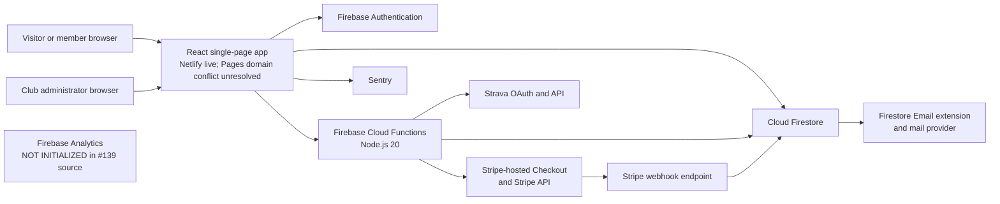
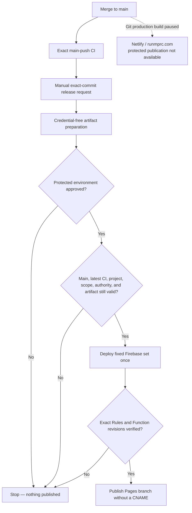
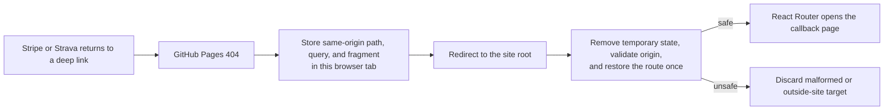
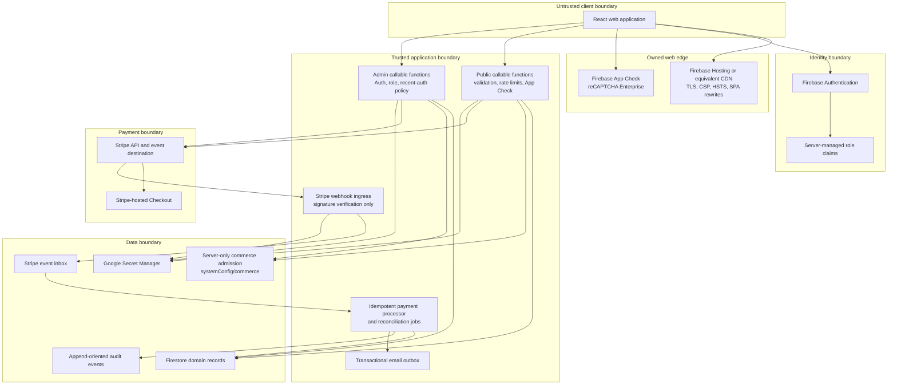
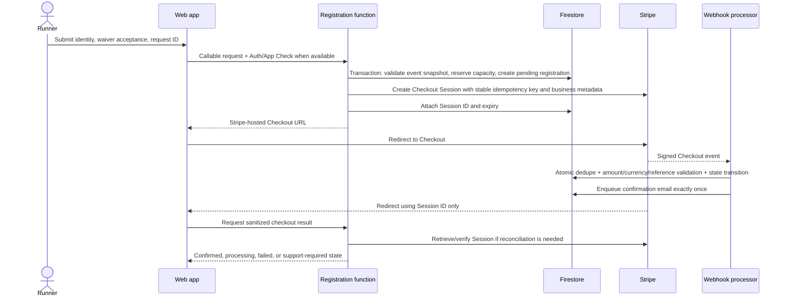
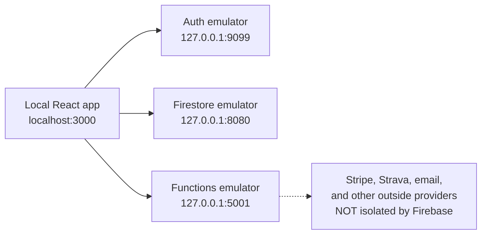

# MPRC Platform System Design

**Status:** Target architecture and current-state assessment
**Last reviewed:** 2026-07-13
**Owners:** MPRC product, engineering, operations, and finance leads

This document is the system-level map for the Mid-Peninsula Running Club platform. It describes what exists in this repository, which parts are safe to rely on today, and the architecture required before accepting live race-registration or merchandise payments.

The repository already contains a substantial prototype: a public React site, Firebase Authentication, Firestore-backed events and products, member and admin experiences, Stripe Checkout creation, a signed Stripe webhook, order and registration administration, Firestore rules, and a small automated test suite. That is a useful foundation, but it is not yet a production-ready commerce system. In particular, payment reconciliation, replay safety, capacity and inventory reservations, environment isolation, legal content, dependency health, and operational controls are incomplete. See [SECURITY.md](./SECURITY.md) for the risk register and [IMPLEMENTATION_PLAN.md](./IMPLEMENTATION_PLAN.md) for the ordered path to launch.

## 1. Goals and non-goals

### Goals

- Publish public club content, events, and merchandise.
- Support anonymous and signed-in race registration.
- Apply member pricing only when the server verifies a current member role.
- Support free, paid, complimentary, and volunteer registration paths.
- Sell physical merchandise with explicit variant and inventory tracking.
- Keep card data out of MPRC systems by using Stripe-hosted Checkout.
- Give authorized operators safe tools for registrations, orders, refunds, fulfillment, members, and event configuration.
- Make every money-affecting operation idempotent, auditable, observable, and reconcilable.
- Minimize collection and retention of personal data.
- Separate development, test, and production systems so local work cannot change production data.

### Non-goals for the first production release

- Storing or processing raw card numbers.
- Building a custom payment form.
- A multi-vendor marketplace, subscriptions, split payments, or Stripe Connect.
- International tax automation, multi-currency pricing, or international fulfillment unless approved as a separate project.
- Complex discount stacking or a public coupon engine.
- General-purpose content management.
- Replacing Stripe's receipts, dispute console, fraud tooling, or financial reports.

## 2. Architectural principles

1. **Stripe is authoritative for money; Firestore is authoritative for club operations.** A redirect, browser state, or client request never proves payment. A verified Stripe event transitions the local business record.
2. **The browser proposes; the server decides.** Prices, eligibility, capacity, inventory, refund limits, roles, and state transitions are recomputed or validated in trusted server code.
3. **Reserve scarce resources before opening Checkout.** Race capacity and merchandise inventory are held atomically in Firestore, then a Stripe Session is created as the next step of a recoverable saga.
4. **Every external side effect is idempotent.** Checkout creation, refunds, webhook consumption, emails, and reconciliation use stable business keys and tolerate retries.
5. **Financial mutations use narrow server endpoints.** Admin users may manage catalog and editorial content directly only where rules explicitly permit it. They do not directly edit payment state, OAuth secrets, event ledgers, or rate-limit data.
6. **Fail closed and reconcile.** If an amount, currency, reference, or transition is unexpected, do not mark it paid. Record the anomaly, alert an operator, and resolve it through reconciliation.
7. **Collect the minimum data for the minimum time.** Emergency contacts, birth dates, shipping addresses, OAuth tokens, analytics, and support logs require explicit purpose and retention rules.
8. **Production is never a development dependency.** Local clients use emulators and Stripe test mode; staging and production use different Firebase projects, Stripe sandboxes/accounts or keys, webhook secrets, and domains.

## 3. Current system context



Text alternative: browsers can use the React app, Auth, Firestore, Functions, Stripe, email, Strava, and the separately bounded Sentry path; #139 source has no browser-to-Firebase-Analytics data path, but website publication and provider behavior are not proven here.

### Current component inventory

| Layer | Current implementation | Primary locations | Assessment |
| --- | --- | --- | --- |
| Public and account UI | React 18, React Router 6, mixed JS/TS, Create React App | `src/App.jsx`, `src/pages`, `src/components` | Functional, but the build stack and several dependencies are stale. |
| Identity | Firebase email/password Auth and custom role claims | `src/services/identity`, `functions/signup.js`, `functions/setMemberRole.js` | Reasonable base; admin assurance and role-change audit controls need strengthening. |
| Operational data | Cloud Firestore | `src/services`, `firestore.rules`, `firestore.indexes.json` | Appropriate for current scale; counters and state transitions require transactional design. |
| Server API | First-generation Firebase callable/HTTP/trigger functions | `functions/` | Prototype covers most workflows; validation, idempotency, and isolation are incomplete. |
| Payments | Stripe Checkout Sessions, Payment Links, refunds, signed webhook | `functions/createCheckoutSession.js`, `createMerchCheckout.js`, `stripeWebhook.js` | Not ready for live payments until P0 issues are complete. |
| Hosting and release | Netlify currently answers `runmprc.com`. GitHub Pages still reports the same custom domain, so its default URL redirects to the Netlify-served name instead of providing an independent copy. #135 source stops automatic releases, pauses Git-triggered Netlify production builds, and removes the Pages CNAME from future protected artifacts. | `netlify.toml`, `.github/workflows/deploy.yml`, `public/404.html` | Split and conflicting as verified 2026-07-13. The existing Pages provider setting is not cleared until a controlled #136/WEB-001 release and readback prove it. #133 authority, #136 release evidence, Netlify provider triggers, DNS, headers, and rollback remain open. |
| Email | Firestore `mail` outbox designed for the Firebase Trigger Email extension | `functions/sendConfirmationEmail.js` | Extension/provider deployment is unverified; outbox creation is not transactionally idempotent and HTML needs escaping. |
| Observability | Optional Sentry; Firebase Analytics configuration remains but its runtime is not initialized by #139 source | `src/services/monitoring`, `src/services/analytics` | #134 source bounds Sentry payloads. #139 source removes every application runtime Firebase Analytics import, initialization, and emission while preserving no-op call compatibility. Website publication, provider collection/cookies and historical data, consent, retention, access, deletion, and vendor configuration remain unverified under #110/#111. |
| Third-party fitness | Strava OAuth tokens and statistics | `functions/strava.js`, `src/services/strava` | Functional prototype. The #100 source Rules deny browser token access, but Firebase deployment is unproven and transactional refresh, scopes/revocation, IAM/encryption decision, and audit remain OAUTH-001. |

The former workflow automatically published Pages before attempting Firebase and could finish green after skipping Firebase. #135 replaces that source path with a manual exact-current-commit request, exact latest CI checks, one fixed backend plan, protected short-lived identity wiring, provider readback, and Firebase-before-Pages publication. Missing authority or failed/partial verification is red. Git-triggered Netlify production builds stop, while build hooks and protected Netlify publication remain unverified. No source test clears the current Pages custom-domain claim, configures #133, deploys #136, or proves `runmprc.com`; those remain separate provider states. The App Engine synchronization script is another surface that must be documented as active or retired.



Text alternative: a merge only runs CI; a separate request prepares a public artifact, waits for protected approval, rechecks current source and authority, verifies Firebase, and only then publishes a Pages branch that no longer claims the Netlify domain.

### GitHub Pages callback handoff



Text alternative: the 404 page temporarily carries the complete return route to the root page; an early referrer policy keeps the path/query/fragment out of subresource request headers, and the root page deletes the temporary value before accepting only a same-origin route. App Check, Analytics, and Sentry stay off on that initial capability-bearing callback. The bridge does not prove payment, OAuth state, or identity. Server/provider verification still decides the result.

## 4. Target deployment topology

The target keeps React, Firebase, and Stripe, but places stronger boundaries around them. Migrating the frontend from GitHub Pages to Firebase Hosting is recommended before live commerce because it supports controlled SPA rewrites, preview channels, and security headers. That hosting migration is not required to design or test the backend, and must be executed as its own issue.



Text alternative: checkout and refund commands read both domain records and the server-only commerce control; the signed webhook path does not depend on that control and continues processing payment evidence.

## 5. Trust boundaries and authorization

| Boundary | Trusted assertions | Never trust directly |
| --- | --- | --- |
| Browser | A Firebase ID token after SDK/server verification; an App Check token after Firebase verification | Price, member status, registration status, order status, redirect query parameters, product availability, capacity, inventory, or admin UI visibility |
| Firebase Auth | UID, verified token claims, token timestamps | A role copied into Firestore or sent in the request body |
| Stripe webhook | Event payload only after raw-body signature verification with the endpoint's secret | An unsigned request, a browser success redirect, or a client-provided Session ID without server retrieval/validation |
| Firestore client SDK | Reads and writes allowed by the deployed ruleset | The presence of a hidden UI control as authorization |
| Cloud Functions/Admin SDK | Application code and IAM-scoped service identity | Firestore rules as protection; Admin SDK bypasses those rules |
| GitHub Actions | Pinned workflow and environment-scoped secrets | Pull-request code with production secrets or a shared, long-lived deployment token |

### Roles

The current `unverified`, `member`, and `admin` claims should evolve toward capabilities rather than one all-powerful role. A practical first split is:

| Capability | Example users | Allowed operations |
| --- | --- | --- |
| `member` | Verified club member | Members-only content and member price |
| `event_manager` | Race director | Event content, roster, comps, substitutions; no global member roles or merchandise refunds |
| `shop_manager` | Merchandise lead | Catalog, orders, tracking, fulfillment; no event or membership administration |
| `finance_admin` | Treasurer | Refunds, reconciliation, disputes, reports |
| `identity_admin` | Membership lead | Membership verification and role administration |
| `platform_admin` | Very small break-glass group | Security configuration and role grants |

The first release may continue using `admin` in the UI, but server endpoints and Firestore rules should be narrowed by resource now so future capability claims can be introduced without rewriting payment logic.

## 6. Domain model and ownership

### Current collections

| Path | Purpose | Source of writes | Sensitivity |
| --- | --- | --- | --- |
| `events/{eventId}` | Event content, schedule, pricing configuration, capacity, waiver version | Admin client today; target event-management API for sensitive fields | Public or members-only |
| `events/{eventId}/registrations/{registrationId}` | Participant identity, waiver evidence, payment references, lifecycle | Cloud Functions and admins today; target Cloud Functions only | Restricted PII and financial metadata |
| `products/{productId}` | Merchandise catalog | Admin client today | Public plus internal configuration |
| `orders/{orderId}` | Buyer, shipping, payment, and fulfillment data | Cloud Functions and admins today; target Cloud Functions only | Restricted PII and financial metadata |
| `members/{uid}` | Profile and role mirror | Create-once signup/recovery Functions; self-service name-only allowlist while #178 pauses phone collection; server role operations | Confidential |
| `members/{uid}/connections/{provider}` | Non-secret connection metadata | Cloud Functions | Confidential |
| `members/{uid}/secrets/{provider}` | OAuth tokens | Cloud Functions | Restricted secret |
| `promoCodes/{id}` | Intended promotion configuration | Admin only | Confidential; currently not integrated into checkout validation |
| `ratelimits/{bucket}` | Abuse-control counters | Cloud Functions | Confidential operational data |
| `mail/{id}` | Transactional email outbox | Cloud Functions and email extension | Restricted PII |

### Target additions and changes

| Path or field | Purpose |
| --- | --- |
| `stripeEvents/{stripeEventId}` | Durable, non-PII webhook inbox/deduplication record with processing status and business reference |
| `checkoutRequests/{commandKeyHash}` | Immutable server-only command registration. PAY-002B2A/#165 owns the exact `registered` revision-1 record. |
| `checkoutRequests/{commandKeyHash}/lifecycle/current` | PAY-002B2B/#169 server-only lease, monotonic fence, and terminal commitment source. It is unused and is not provider-send permission. |
| `checkoutRequests/{commandKeyHash}/providerAttempts/0000000001` | PAY-002B2C1/#173 immutable lease-bound initial Stripe plan. It stores command-bound commitments, is unused, and is not account proof or provider-send permission. |
| `checkoutRequests/{commandKeyHash}/providerAttempts/0000000001/sendEvidence/first` | PAY-002B2C2/#182 separate server-only pre-POST marker with a complete C1-plan digest, its originating fence, trusted time, and persisted 23-hour automatic-retry deadline. It is unused and does not say Stripe received or completed a request. |
| `auditEvents/{eventId}` or bounded per-record audit subcollections | Append-oriented operational and security audit trail. B2A's first event is `commerce_command_{commandKeyHash}_0000000001`; B2B appends one deterministic event for each real lifecycle change; C1 binds the first plan with `commerce_provider_attempt_{commandKeyHash}_0000000001`; C2 pairs the pre-send marker with `commerce_provider_send_{commandKeyHash}_0000000001`. |
| `events/{id}.capacityCounters` | Transactionally maintained participant reservations, paid seats, and released seats |
| `products/{id}/variants/{variantId}` | SKU, option values, price, on-hand, reserved, and sold counts |
| `orders.paymentStatus` and `orders.fulfillmentStatus` | Separate money state from physical fulfillment state |
| `registrations.paymentStatus` and `registrations.registrationStatus` | Separate payment lifecycle from attendance/transfer/cancellation lifecycle |
| `orders/registrations.stateSchemaVersion` and `refundStatus` | Version the split business-record state contract and keep confirmed refund status/total separate from payment/operational state |
| server-only per-dispute records | Keep one state per Stripe dispute; never collapse multiple disputes into one canonical order/registration `disputeStatus` |
| `retentionJobs/{jobId}` | Optional operational record of scheduled minimization/deletion work |
| `systemConfig/commerce` | Versioned global/domain command admission; browser read/write denied; protected writer is not available yet |
| `events/{id}.checkoutEnabled` and `products/{id}.checkoutEnabled` | Explicit server-owned resource admission; missing means disabled |

Large `auditLog` arrays on registration and order documents should be replaced before they approach Firestore document-size and write-contention limits. New audit data should be append-oriented.

PAY-002A1 is tracked in live [#161](https://github.com/Run-MPRC/Run-MPRC.github.io/issues/161). Numeric local `stateSchemaVersion: 1` is distinct from string Stripe metadata `schemaVersion: "1"`, which only versions provider reference binding. The reducers and legacy classifier are a pure source/test target: they import no Firebase or Stripe code, make no call, and are not used by an endpoint. Current records, webhook behavior, compatibility writes, real migration, deployment, and live state remain unchanged until later PAY-002/PAY-003 children adopt the contract.

PAY-002B1 is tracked in live [#163](https://github.com/Run-MPRC/Run-MPRC.github.io/issues/163). It is also pure and unused: it separates a caller/environment/UUID command key from a command-type/payload fingerprint, then derives a deterministic Stripe key for one immutable provider attempt. Production/live and non-production/test are the only accepted environment/mode pairs. The command key intentionally excludes command type so a journal can reject reuse of one caller command ID for another operation. Hashes are pseudonymous server-only identifiers—not anonymization—and must not enter browsers, logs, URLs, or analytics. The library contains no Firestore transaction, lease, clock, result, audit, Stripe call, or authorization decision.

PAY-002B2A is tracked in live [#165](https://github.com/Run-MPRC/Run-MPRC.github.io/issues/165). Its unused server-only transaction writes the exact `checkoutRequests/{commandKeyHash}` registered record and `auditEvents/commerce_command_{commandKeyHash}_0000000001` event together with one trusted Timestamp, or writes neither. Exact retries are read-only; command-type, endpoint-version, or payload mismatch under the same B1 key conflicts; corrupt or incomplete pairs fail closed without repair. Environment and caller scope are already bound into the B1 document ID, so a different scope creates a different record rather than a cross-scope conflict. The fixed result grants no authorization or execute/send permission and contains no hash, path, raw identity, UUID, or payload.

B2A has no endpoint/index export, lease, fence, terminal commitment, result replay, provider plan/key/object, Stripe call, provider attempt transition, safe-send clock, or reconciliation behavior. PAY-002B2B source/tests are tracked in live [#169](https://github.com/Run-MPRC/Run-MPRC.github.io/issues/169). They keep the B2A root and revision-1 audit immutable and store mutable state at `checkoutRequests/{commandKeyHash}/lifecycle/current`. The source uses a fixed 60-second server lease, a command-bound fingerprint of a trusted UUID v4 holder, and a monotonic fence so stale or expired workers cannot finish. Each real lease or terminal change gets one deterministic audit event.

B2B terminal success stores only a command-bound commitment to a later server-only business result. That commitment is not the result itself, proof that Stripe or Firestore work happened, or response replay. The lease/fence is concurrency evidence, not authorization or provider-send permission. PAY-002B2C1/#173 owns immutable initial-plan binding. PAY-002B2C2/#182 owns only separate pre-send evidence and a conservative automatic-retry cutoff. B2C3 still owns verified reconciliation and safe attempt advancement. No TTL is safe yet: deleting both C2 partners would look like first use, so [#110](https://github.com/Run-MPRC/Run-MPRC.github.io/issues/110) must approve retention and a server-only tombstone or equivalent durable duplicate barrier before a command pair can be deleted.

PAY-002B2C1 source/tests are tracked in live [#173](https://github.com/Run-MPRC/Run-MPRC.github.io/issues/173). With the exact current unexpired lease/fence, the unused journal can atomically create the immutable attempt-1 plan plus `auditEvents/commerce_provider_attempt_{commandKeyHash}_0000000001`. The first version accepts only the static `checkout_session_create` → `/v1/checkout/sessions` mapping, so an object ID or capability cannot enter the stored path. The plan also fixes Stripe mode, API version, original binding fence, and command-bound commitments to the account, canonical parameters, and deterministic B1 key. Raw account/parameters/key are absent. An existing plan is accepted only when its binding time fits the deterministic lifecycle audit for its original fence. An exact active-lease retry is read-only; a valid takeover may observe but cannot rewrite the plan; conflicts and malformed or missing partners fail closed.

These commitments are pseudonymous equality evidence, not authorization, configured-account proof, a pre-POST marker, provider-execution proof, or response replay. PAY-002B2C2 source/tests are tracked in live [#182](https://github.com/Run-MPRC/Run-MPRC.github.io/issues/182). Its unused transaction recomputes the exact B1 identity and C1 plan, requires the exact active lease holder/fence, and creates only the separate marker/audit pair. Both partners bind a command-bound digest of every immutable C1 plan field, so a later coherent account, API-version, endpoint, parameter, key-commitment, or binding change cannot reuse the marker. Version 1 persists a deadline exactly 23 hours after the pre-POST marker. The first atomic creation, and an exact attempt-1 retry, are classified `send_permitted` only when a post-transaction trusted-time check is still strictly before the transaction-validated lease's captured expiry and the stored deadline. The second check does not re-read lifecycle state. Equality, later time, rollback, or paired missing/unreadable time is classified `reconciliation_required`; no attempt advancement follows.

The fixed C2 result is narrow retry-safety evidence. It is not caller authorization, configured-account proof, a claim that Stripe received the POST, a provider outcome, or response replay. Timeout, connection loss, `5xx`, a missing object reference, and incomplete search are deliberately not C2 inputs and cannot manufacture attempt `2`. B2C3 remains responsible for verified reconciliation evidence and safe later-attempt authorization. #173/#182 have no runtime/index import, Stripe/network call, Firebase deployment, provider configuration, production data, website, or live/officer effect.

CI-001B3 [#167](https://github.com/Run-MPRC/Run-MPRC.github.io/issues/167) runs the exact opt-in command-journal emulator suite as a named hosted release prerequisite; #169, #173, and #182 expand that same suite. These are synthetic source checks only. The current journal source remains unused and makes no endpoint, Firebase deployment, Stripe/provider configuration, production data, website, or live/officer change.

## 7. Business invariants

The following are correctness rules, not UI preferences:

1. `amountExpectedCents`, `currency`, and sellable item are read from server-controlled data.
2. `amountPaidCents` comes from a verified Stripe object and is stored separately from expected list price.
3. A record becomes paid only when `payment_status == paid` or an equivalent successful PaymentIntent state is verified.
4. Each Stripe event is applied at most once; applying it again produces the same final state and no duplicate email, seat, stock decrement, or refund.
5. One checkout request maps to one business record and at most one active Stripe Session.
6. A member price requires a currently verified `member` or authorized admin claim at checkout time.
7. Participant reservations never exceed event capacity. Volunteers do not consume participant capacity unless an event explicitly configures a volunteer cap.
8. Variant reservations never exceed sellable on-hand inventory. A product-wide `active` flag does not imply every size/color is available.
9. Full refunds, terminal cancellations, and expired unpaid Sessions release capacity or inventory exactly once according to policy.
10. Partial refunds do not silently release a seat or fulfilled product.
11. A paid record cannot be changed to cancelled without an explicit policy decision about refunding or retaining funds.
12. Financial state cannot be edited directly from a Firestore client.
13. A waiver record identifies the exact waiver version/text hash accepted, timestamp, event, registrant, and acceptance context.
14. Confirmation pages display only sanitized fields and do not rely on bearer credentials left in URLs or referrer logs.

## 8. Core workflows

### 8.0 Account profile setup and recovery

Issue [#118](https://github.com/Run-MPRC/Run-MPRC.github.io/issues/118) adds a create-once recovery path for accounts whose `members/{uid}` record is missing after the Firebase cutover. It is a source design until the exact Function, current Rules, and dependent website are deployed backend-first and proven with a synthetic account.

```mermaid
sequenceDiagram
    actor M as Signed-in member
    participant W as Account page
    participant F as ensureMemberProfile Function
    participant A as Firebase Auth Admin
    participant D as Firestore

    M->>W: Open My Account
    W->>F: Empty request + verified Firebase sign-in
    alt setup fails
        F-->>W: Generic unavailable result
        W-->>M: Hide Edit; show retry/sign-out path
    else setup continues
        F->>D: Read only members/{caller UID}
        alt profile exists
            D-->>F: Exists
            F-->>W: ready=true; no write or claim change
        else profile missing
            F->>A: Load caller's authoritative Auth record
            F->>D: Transactionally recheck and create pending profile once
            F-->>W: ready=true
        end
        W->>D: Read caller profile through Firestore Rules
        alt read succeeds
            D-->>W: Profile
            W-->>M: Show profile and name-only Edit
        else read fails
            D-->>W: Generic failure
            W-->>M: Hide Edit; show retry/sign-out path
        end
    end
```

The callable accepts no UID or profile fields. A missing record receives identity fields from Firebase Auth and `role: unverified`; it never copies a member/admin claim, dues, payment, or discount state. Existing records and claims remain unchanged. This may expose a pre-existing claim/profile mismatch instead of guessing how to repair it; the identity/membership workflow must resolve that mismatch explicitly. App Check is required by the shared boundary only when deployed enforcement is configured, so release evidence must prove that setting before calling App Check live.

DATA-001C1 [#178](https://github.com/Run-MPRC/Run-MPRC.github.io/issues/178) pauses optional phone display and collection in My Account. The owner-profile projection omits `phoneNumber`, the client validates and writes only `fullName`, and the Rules source rejects every browser phone mutation while allowing an existing phone value to remain unchanged during a name edit. Firestore still authorizes and transports the owner's complete document at its document-level boundary; #116 retains the future server-projection work for broader administrative reads. There is no migration, deletion, export, Function/Auth change, Google Forms change, or provider action in this slice. The source is not live protection until the exact Rules are deployed and read back before the dependent website revision is published and verified.

The server chooses initial timestamps. The current self-edit path sends a Firestore server timestamp, but the Rules source type-checks rather than independently proves that edit timestamp. Do not describe arbitrary profile edit timestamps as server-authoritative until a coordinated Rules/API issue closes that residual.

### 8.1 Paid race registration



If Stripe Session creation fails, the function releases the reservation in a compensating transaction. If the function crashes after Stripe creates the Session, PAY-002B2C2 retries only the exact B2C1 plan/key inside its stored safe-send window. After that deadline—or when first-send time is unknown—it stops POSTing, and B2C3 reconciles stored/provider/webhook evidence because Stripe may have pruned the idempotency key. A scheduled job releases abandoned reservations and reconciles records that missed a webhook.

### 8.2 Free or volunteer registration

The same server validation and Firestore transaction are used, but no Stripe call occurs. The registration moves directly to its confirmed non-payment state. Anonymous confirmation uses a short-lived or hash-stored opaque receipt token that is removed from browser history immediately; signed-in users can use ownership by UID.

### 8.3 Merchandise purchase

Merchandise uses the same checkout saga but reserves a specific SKU/variant. Stripe shipping collection is copied into the order only after a verified paid event. Payment status and fulfillment status remain separate. A paid order may be `unfulfilled`, `packed`, `shipped`, `delivered`, `cancelled`, or `returned` without corrupting the payment ledger.

### 8.4 Refund

An authorized finance action creates a separate refund-operation record with a stable idempotency key. Stripe executes the money movement; the webhook is the canonical confirmation. That operation may show `refund_pending` while waiting, but the order/registration aggregate `refundStatus` remains at its last confirmed value. Repeated clicks or network retries must return the original refund rather than create another one. A full registration refund may release capacity according to event policy; a merchandise refund does not modify inventory until the return/stock disposition is explicitly recorded.

### 8.5 Webhook processing

The ingress verifies method, raw payload, signature, and secret. Relevant event types are written or claimed using the Stripe Event ID. Business processing validates object type, livemode/environment, metadata schema version, business reference, Session/PaymentIntent ownership, currency, and amount. Unknown transitions are quarantined for review. Stripe does not guarantee event order, so each transition is based on current domain state and the retrieved Stripe object when necessary.

## 9. Consistency and failure model

Stripe and Firestore cannot share a distributed transaction. Checkout and refunds are therefore explicit sagas:

- A Firestore transaction protects local uniqueness and scarce-resource counters.
- A stable PAY-002B1 Stripe key identifies one logical provider generation. A lease takeover or HTTP retry is not a new generation. PAY-002B2C1 binds the immutable attempt-1 plan; B2C2 may retry only that exact plan/key inside its conservative stored send window; after that window or with unknown send time, it stops automatic POST, and B2C3 reconciles because Stripe may have pruned the old key.
- The business record stores the saga step and external ID.
- A compensating transaction releases a reservation after a known failure.
- A webhook advances successful external state.
- A scheduled reconciler repairs missed, delayed, or out-of-order outcomes.
- Operators receive alerts for records that remain in intermediate or review states beyond their service-level threshold.

Returning a `2xx` response to Stripe means the event has been durably accepted or safely processed. A transient storage failure returns `5xx` so Stripe retries. A permanent validation anomaly is durably quarantined and acknowledged so it does not create an endless retry storm.

## 10. Environment model

| Environment | Firebase | Stripe | Domain | Data policy |
| --- | --- | --- | --- | --- |
| Local source runtime | Firebase Emulator Suite under `demo-mprc-local` | Not safe by Firebase emulation alone | `localhost:3000` | Synthetic data only; browser Firebase traffic is loopback-only |
| CI | Ephemeral emulators and mocks | Stripe fixtures/signature tests; optional isolated test account | None | Synthetic data, no production secrets |
| Staging | Dedicated non-production Firebase project | Stripe sandbox/test keys and its own webhook endpoint | `dev.runmprc.com` | Synthetic or consented test records only |
| Production | Dedicated production Firebase project | Live restricted keys and production webhook secret | `runmprc.com` | Real data under documented retention and access policies |



Text alternative: the local browser uses only the three loopback Firebase emulators. A Function can still call an outside provider, so Firebase emulator readiness alone does not authorize checkout, refund, email, or Strava testing.

#99 source selects a fully synthetic Firebase configuration for development/test, connects Auth, Firestore, and Functions to the loopback ports above, stops startup when connection setup fails, and leaves App Check, Analytics, and Sentry off locally. #139 additionally keeps Firebase Analytics off in every source environment and removes the direct Waiver SDK bypass pending an approved #110 policy. The Firebase CLI must still report all three emulators ready before the app is opened. Mocked endpoint tests alone do not prove listening processes, website publication, provider behavior, or deletion of earlier provider data/cookies.

Optimized builds—including current Netlify previews and a locally served `build/` directory—use `NODE_ENV=production` and still target production Firebase. They are restricted to public, read-only visual review until #105/CONFIG establishes a separate staging configuration. Do not sign in, open private/admin pages, or test Firebase/provider actions in those previews.

`SITE_ORIGIN`, Firebase project IDs, App Check keys, Stripe keys, webhook endpoints, Sentry environments, and email providers must be environment-scoped. Live and test webhook secrets are never interchangeable. The repository still needs an explicit staging project before end-to-end rollout.

CONFIG-001A [#149](https://github.com/Run-MPRC/Run-MPRC.github.io/issues/149) adds the source boundary for current commerce and confirmation-mail Functions: local is exact loopback, tests use HTTPS `.test`, staging is exactly `https://dev.runmprc.com`, and production is exactly `https://runmprc.com`. Test/live expected mode must match the server-key marker on the four key-bound Functions. Webhook and mail receive no Stripe API key, and invalid settings stop before rate-limit, business, mail, event-ledger, or Stripe writes. This source boundary does not create staging, configure Secret Manager or Stripe, deploy Firebase, enable commerce, or prove live behavior.

CONFIG-001B1 [#151](https://github.com/Run-MPRC/Run-MPRC.github.io/issues/151) adds a second source boundary for current commands. A false deploy ceiling denies new race, free/volunteer, merchandise, comp, and late-registration work before Firestore. Commands that pass it then require the fresh versioned `systemConfig/commerce` global/domain decision and an explicit resource flag. Registration/order refunds always read the separate incident-refund decision, so disabling new commerce does not silently disable response work. Missing or malformed controls mean disabled. Browser clients cannot read the global document or set resource admission fields. Webhook and confirmation mail deliberately have no edge to this control.

The admission read is a clear linearization point, not a distributed lock. A command admitted on revision N can finish after revision N+1 disables new work, and an already-open Stripe Session or Payment Link can remain payable. PAY-002/PAY-004 own command journals, drain/expiry, and provider-object recovery. CONFIG-001B2 and #105/#133/#136 own the protected writer, drill, deployment, and provider evidence; none is made live by B1 source.

## 11. Security, privacy, and compliance posture

Hosted Checkout reduces MPRC's card-data scope because payment details are entered on Stripe's domain, but it does not make the surrounding system automatically secure or compliant. MPRC still owns access control, application security, privacy disclosures, waiver evidence, fulfillment, refunds, disputes, incident response, vendor configuration, and data retention.

Before launch, MPRC leadership must approve:

- Terms, privacy policy, refund/cancellation policy, fulfillment/shipping policy, and waiver language reviewed by appropriate counsel.
- Stripe account ownership, MFA, least-privilege team roles, bank/payout controls, Radar policy, support contacts, and webhook ownership.
- Tax nexus and sales-tax handling for merchandise and race fees.
- Record-retention periods for financial records, waiver evidence, emergency contacts, birth dates, shipping addresses, support logs, and analytics.
- A named incident commander and a way to disable checkout quickly.

Technical controls and the current findings are detailed in [SECURITY.md](./SECURITY.md). This repository documentation is engineering guidance, not legal, tax, insurance, or PCI certification advice.

## 12. Reliability and service objectives

Initial objectives should be modest and measurable:

| Objective | Initial target |
| --- | --- |
| Checkout API availability | 99.9% during open registration windows, excluding Stripe/Firebase outages |
| Webhook durable acceptance | 99% under 10 seconds; 99.9% under 60 seconds |
| Paid-to-confirmed propagation | 99% under 60 seconds for immediate methods |
| Duplicate fulfillment/refund | Zero tolerated |
| Capacity or inventory oversell caused by application race | Zero tolerated |
| Reconciliation backlog | No unresolved paid/missing-local or local-paid/missing-Stripe item older than 15 minutes during launches |
| Critical security alert response | Acknowledged within 30 minutes during an active paid event window |

These targets require structured logs, alerting, Stripe delivery monitoring, a reconciliation job, and a documented on-call owner. See [OPERATIONS_RUNBOOK.md](./OPERATIONS_RUNBOOK.md).

## 13. Deployment and migration strategy

Use expand-and-contract changes so the deployed frontend and backend remain compatible:

1. Add new fields, endpoints, ledgers, and state handling while continuing to read old records.
2. Deploy backend functions, rules, and indexes before clients that depend on them.
3. Backfill counters, state fields, and business references with a dry-run report and an idempotent migration.
4. Switch new checkout creation to the new path in Stripe test mode.
5. Exercise webhook retries, duplicates, out-of-order events, refunds, expired Sessions, and reconciliation.
6. Run a limited live pilot with one low-risk product or capped event.
7. Observe and reconcile before broad launch.
8. Remove legacy status fields and direct-write permissions only after all active records and clients have migrated.

Never test migration or reconciliation logic for the first time against production records.

## 14. Architecture decisions

| ID | Decision | Rationale | Status |
| --- | --- | --- | --- |
| ADR-001 | Use Stripe-hosted Checkout rather than custom card UI | Keeps raw card data out of MPRC systems and uses Stripe's optimized payment surface | Accepted |
| ADR-002 | Keep Firebase/Firestore for the first commerce release | Existing implementation and operational scale fit; changing databases would add risk without fixing payment correctness | Accepted |
| ADR-003 | Treat Stripe webhooks plus reconciliation as payment truth | Redirects are lossy and spoofable; webhooks are retryable but can be delayed or duplicated | Accepted |
| ADR-004 | Use application idempotency records and Stripe idempotency keys | Required for safe retries across the Firestore/Stripe boundary | Accepted |
| ADR-005 | Atomically reserve capacity and SKU inventory before Checkout | Prevents overselling under concurrent requests | Accepted |
| ADR-006 | Separate payment state from registration/fulfillment state | Avoids impossible overloaded states such as a fulfilled order becoming merely `refunded` | Proposed for phased migration |
| ADR-007 | Move financial and secret mutations behind narrow functions | The current admin catch-all is too broad for least privilege and auditability | Accepted target |
| ADR-008 | Launch with card-class immediate methods only unless delayed methods are fully tested | Simplifies initial fulfillment while the webhook still handles asynchronous outcomes safely | Proposed; finance/product approval required |
| ADR-009 | Prefer Firebase Hosting for the commerce frontend | Controlled rewrites, preview environments, and response headers are operationally safer than the current GitHub Pages fallback | Proposed |

## 15. Open product and governance decisions

The following cannot be safely decided from code alone and are tracked as launch-gate issues:

- Who owns Stripe, Firebase/GCP, DNS, GitHub, email delivery, and Sentry accounts?
- Who may grant roles, issue refunds, view participant PII, export rosters, and access payouts?
- Are guest registrations allowed for every race, and which fields are truly required?
- Does a refund release a race spot automatically? What happens after bib assignment or an event cutoff?
- Are transfers/substitutions allowed, and how is waiver acceptance re-collected from the substitute?
- Will merchandise be shipped, picked up, or both? Which countries and tax jurisdictions are supported?
- Are discounts required at launch? If so, who can create them and how are they represented in reporting?
- What is the retention period for waiver evidence and accounting records, and when are high-risk operational fields deleted?
- What uptime and response coverage will exist during an event launch?

Until these decisions are recorded, implementation should use the safest narrow behavior: no unverified member discount, no inventory below zero, no paid-to-cancelled transition without an explicit refund decision, no delayed fulfillment on an unpaid Session, no live promotion codes, and no broad export or secret access.
