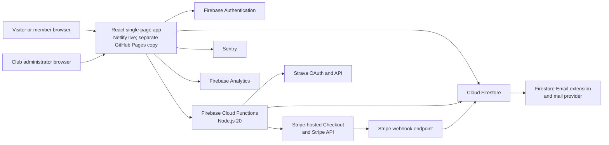
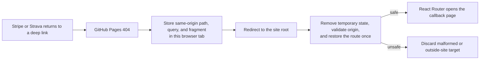
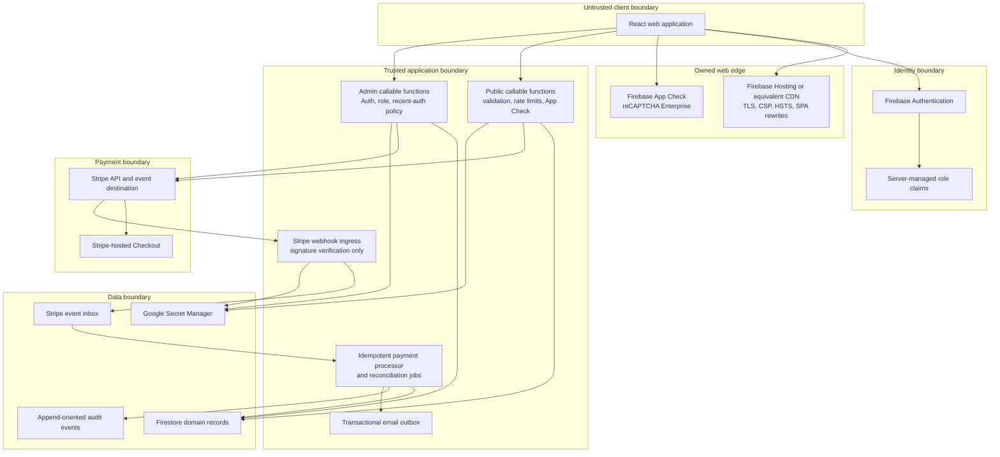
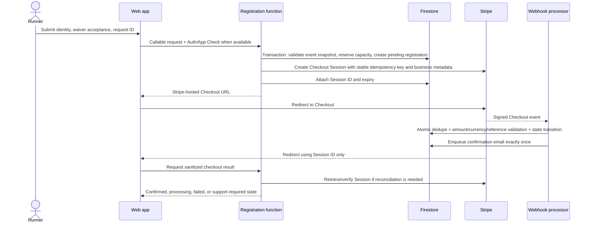
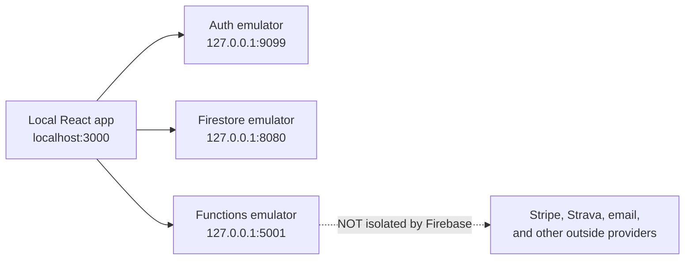

# MPRC Platform System Design

**Status:** Target architecture and current-state assessment
**Last reviewed:** 2026-07-12
**Owners:** MPRC product, engineering, operations, and finance leads

This document is the system-level map for the Mid-Peninsula Running Club platform. It describes what exists in this repository, which parts are safe to rely on today, and the architecture required before accepting live race-registration or merchandise payments.

The repository already contains a substantial prototype: a public React site, Firebase Authentication, Firestore-backed events and products, member and admin experiences, Stripe Checkout creation, a signed Stripe webhook, order and registration administration, Firestore rules, and a small automated test suite. That is a useful foundation, but it is not yet a production-ready commerce system. In particular, payment reconciliation, replay safety, capacity and inventory reservations, environment isolation, legal content, dependency health, and operational controls are incomplete. See [SECURITY.md](./SECURITY.md) for the risk register and [IMPLEMENTATION_PLAN.md](./IMPLEMENTATION_PLAN.md) for the ordered path to launch.

## 1. Goals and non-goals

### Goals

- Publish public club content, events, and merchandise.
- Support anonymous and signed-in race registration.
- Apply member pricing only when the server verifies a current member role.
- Support free, paid, complimentary, and volunteer registration paths.
- Sell physical merchandise with explicit variant and inventory tracking.
- Keep card data out of MPRC systems by using Stripe-hosted Checkout.
- Give authorized operators safe tools for registrations, orders, refunds, fulfillment, members, and event configuration.
- Make every money-affecting operation idempotent, auditable, observable, and reconcilable.
- Minimize collection and retention of personal data.
- Separate development, test, and production systems so local work cannot change production data.

### Non-goals for the first production release

- Storing or processing raw card numbers.
- Building a custom payment form.
- A multi-vendor marketplace, subscriptions, split payments, or Stripe Connect.
- International tax automation, multi-currency pricing, or international fulfillment unless approved as a separate project.
- Complex discount stacking or a public coupon engine.
- General-purpose content management.
- Replacing Stripe's receipts, dispute console, fraud tooling, or financial reports.

## 2. Architectural principles

1. **Stripe is authoritative for money; Firestore is authoritative for club operations.** A redirect, browser state, or client request never proves payment. A verified Stripe event transitions the local business record.
2. **The browser proposes; the server decides.** Prices, eligibility, capacity, inventory, refund limits, roles, and state transitions are recomputed or validated in trusted server code.
3. **Reserve scarce resources before opening Checkout.** Race capacity and merchandise inventory are held atomically in Firestore, then a Stripe Session is created as the next step of a recoverable saga.
4. **Every external side effect is idempotent.** Checkout creation, refunds, webhook consumption, emails, and reconciliation use stable business keys and tolerate retries.
5. **Financial mutations use narrow server endpoints.** Admin users may manage catalog and editorial content directly only where rules explicitly permit it. They do not directly edit payment state, OAuth secrets, event ledgers, or rate-limit data.
6. **Fail closed and reconcile.** If an amount, currency, reference, or transition is unexpected, do not mark it paid. Record the anomaly, alert an operator, and resolve it through reconciliation.
7. **Collect the minimum data for the minimum time.** Emergency contacts, birth dates, shipping addresses, OAuth tokens, analytics, and support logs require explicit purpose and retention rules.
8. **Production is never a development dependency.** Local clients use emulators and Stripe test mode; staging and production use different Firebase projects, Stripe sandboxes/accounts or keys, webhook secrets, and domains.

## 3. Current system context

### Current component inventory

| Layer | Current implementation | Primary locations | Assessment |
| --- | --- | --- | --- |
| Public and account UI | React 18, React Router 6, mixed JS/TS, Create React App | `src/App.jsx`, `src/pages`, `src/components` | Functional, but the build stack and several dependencies are stale. |
| Identity | Firebase email/password Auth and custom role claims | `src/services/identity`, `functions/signup.js`, `functions/setMemberRole.js` | Reasonable base; admin assurance and role-change audit controls need strengthening. |
| Operational data | Cloud Firestore | `src/services`, `firestore.rules`, `firestore.indexes.json` | Appropriate for current scale; counters and state transitions require transactional design. |
| Server API | First-generation Firebase callable/HTTP/trigger functions | `functions/` | Prototype covers most workflows; validation, idempotency, and isolation are incomplete. |
| Payments | Stripe Checkout Sessions, Payment Links, refunds, signed webhook | `functions/createCheckoutSession.js`, `createMerchCheckout.js`, `stripeWebhook.js` | Not ready for live payments until P0 issues are complete. |
| Hosting | Netlify currently answers `runmprc.com`; GitHub Actions also publishes a separate Pages copy | `netlify.toml`, `.github/workflows/deploy.yml`, `public/404.html` | Split and drifting as verified 2026-07-12. A Pages success does not prove the live Netlify site changed. Hosting authority, preview, DNS, headers, and rollback remain open CI/WEB work. |
| Email | Firestore `mail` outbox designed for the Firebase Trigger Email extension | `functions/sendConfirmationEmail.js` | Extension/provider deployment is unverified; outbox creation is not transactionally idempotent and HTML needs escaping. |
| Observability | Optional Sentry and Firebase Analytics | `src/services/monitoring`, `src/services/analytics` | Local/test initialization is disabled by #99 source. Hosted redaction, replay, consent, retention, and provider configuration remain unverified under #111. |
| Third-party fitness | Strava OAuth tokens and statistics | `functions/strava.js`, `src/services/strava` | Functional prototype. Working-tree Rules deny browser token access, but transactional refresh, scopes/revocation, IAM/encryption decision, and audit remain OAUTH-001. |

The repository workflow presents GitHub Pages plus Firebase as a release path, but public DNS and response headers show that the live custom domain is served by Netlify. The two copies currently contain different bundles. The Firebase job can also finish green while explicitly skipping deployment when `FIREBASE_SERVICE_ACCOUNT` is absent. Treat Pages publication, Netlify production, and Firebase deployment as separate evidence until one hosting/release authority is chosen. The App Engine synchronization script is another surface that must be documented as active or retired.

### GitHub Pages callback handoff

Text alternative: the 404 page temporarily carries the complete return route to the root page; the root page deletes that temporary value before accepting only a same-origin route. The bridge does not prove payment, OAuth state, or identity. Server/provider verification still decides the result.

## 4. Target deployment topology

The target keeps React, Firebase, and Stripe, but places stronger boundaries around them. Migrating the frontend from GitHub Pages to Firebase Hosting is recommended before live commerce because it supports controlled SPA rewrites, preview channels, and security headers. That hosting migration is not required to design or test the backend, and must be executed as its own issue.

## 5. Trust boundaries and authorization

| Boundary | Trusted assertions | Never trust directly |
| --- | --- | --- |
| Browser | A Firebase ID token after SDK/server verification; an App Check token after Firebase verification | Price, member status, registration status, order status, redirect query parameters, product availability, capacity, inventory, or admin UI visibility |
| Firebase Auth | UID, verified token claims, token timestamps | A role copied into Firestore or sent in the request body |
| Stripe webhook | Event payload only after raw-body signature verification with the endpoint's secret | An unsigned request, a browser success redirect, or a client-provided Session ID without server retrieval/validation |
| Firestore client SDK | Reads and writes allowed by the deployed ruleset | The presence of a hidden UI control as authorization |
| Cloud Functions/Admin SDK | Application code and IAM-scoped service identity | Firestore rules as protection; Admin SDK bypasses those rules |
| GitHub Actions | Pinned workflow and environment-scoped secrets | Pull-request code with production secrets or a shared, long-lived deployment token |

### Roles

The current `unverified`, `member`, and `admin` claims should evolve toward capabilities rather than one all-powerful role. A practical first split is:

| Capability | Example users | Allowed operations |
| --- | --- | --- |
| `member` | Verified club member | Members-only content and member price |
| `event_manager` | Race director | Event content, roster, comps, substitutions; no global member roles or merchandise refunds |
| `shop_manager` | Merchandise lead | Catalog, orders, tracking, fulfillment; no event or membership administration |
| `finance_admin` | Treasurer | Refunds, reconciliation, disputes, reports |
| `identity_admin` | Membership lead | Membership verification and role administration |
| `platform_admin` | Very small break-glass group | Security configuration and role grants |

The first release may continue using `admin` in the UI, but server endpoints and Firestore rules should be narrowed by resource now so future capability claims can be introduced without rewriting payment logic.

## 6. Domain model and ownership

### Current collections

| Path | Purpose | Source of writes | Sensitivity |
| --- | --- | --- | --- |
| `events/{eventId}` | Event content, schedule, pricing configuration, capacity, waiver version | Admin client today; target event-management API for sensitive fields | Public or members-only |
| `events/{eventId}/registrations/{registrationId}` | Participant identity, waiver evidence, payment references, lifecycle | Cloud Functions and admins today; target Cloud Functions only | Restricted PII and financial metadata |
| `products/{productId}` | Merchandise catalog | Admin client today | Public plus internal configuration |
| `orders/{orderId}` | Buyer, shipping, payment, and fulfillment data | Cloud Functions and admins today; target Cloud Functions only | Restricted PII and financial metadata |
| `members/{uid}` | Profile and role mirror | Signup function, self-service allowlist, admins | Confidential |
| `members/{uid}/connections/{provider}` | Non-secret connection metadata | Cloud Functions | Confidential |
| `members/{uid}/secrets/{provider}` | OAuth tokens | Cloud Functions | Restricted secret |
| `promoCodes/{id}` | Intended promotion configuration | Admin only | Confidential; currently not integrated into checkout validation |
| `ratelimits/{bucket}` | Abuse-control counters | Cloud Functions | Confidential operational data |
| `mail/{id}` | Transactional email outbox | Cloud Functions and email extension | Restricted PII |

### Target additions and changes

| Path or field | Purpose |
| --- | --- |
| `stripeEvents/{stripeEventId}` | Durable, non-PII webhook inbox/deduplication record with processing status and business reference |
| `checkoutRequests/{idempotencyKeyHash}` | Stable client request mapping and payload fingerprint for retry-safe Session creation |
| `auditEvents/{eventId}` or bounded per-record audit subcollections | Append-oriented operational and security audit trail without unbounded arrays |
| `events/{id}.capacityCounters` | Transactionally maintained participant reservations, paid seats, and released seats |
| `products/{id}/variants/{variantId}` | SKU, option values, price, on-hand, reserved, and sold counts |
| `orders.paymentStatus` and `orders.fulfillmentStatus` | Separate money state from physical fulfillment state |
| `registrations.paymentStatus` and `registrations.registrationStatus` | Separate payment lifecycle from attendance/transfer/cancellation lifecycle |
| `retentionJobs/{jobId}` | Optional operational record of scheduled minimization/deletion work |

Large `auditLog` arrays on registration and order documents should be replaced before they approach Firestore document-size and write-contention limits. New audit data should be append-oriented.

## 7. Business invariants

The following are correctness rules, not UI preferences:

1. `amountExpectedCents`, `currency`, and sellable item are read from server-controlled data.
2. `amountPaidCents` comes from a verified Stripe object and is stored separately from expected list price.
3. A record becomes paid only when `payment_status == paid` or an equivalent successful PaymentIntent state is verified.
4. Each Stripe event is applied at most once; applying it again produces the same final state and no duplicate email, seat, stock decrement, or refund.
5. One checkout request maps to one business record and at most one active Stripe Session.
6. A member price requires a currently verified `member` or authorized admin claim at checkout time.
7. Participant reservations never exceed event capacity. Volunteers do not consume participant capacity unless an event explicitly configures a volunteer cap.
8. Variant reservations never exceed sellable on-hand inventory. A product-wide `active` flag does not imply every size/color is available.
9. Full refunds, terminal cancellations, and expired unpaid Sessions release capacity or inventory exactly once according to policy.
10. Partial refunds do not silently release a seat or fulfilled product.
11. A paid record cannot be changed to cancelled without an explicit policy decision about refunding or retaining funds.
12. Financial state cannot be edited directly from a Firestore client.
13. A waiver record identifies the exact waiver version/text hash accepted, timestamp, event, registrant, and acceptance context.
14. Confirmation pages display only sanitized fields and do not rely on bearer credentials left in URLs or referrer logs.

## 8. Core workflows

### 8.1 Paid race registration

If Stripe Session creation fails, the function releases the reservation in a compensating transaction. If the function crashes after Stripe creates the Session, retrying the same request returns the same Session through Stripe and local idempotency keys. A scheduled job releases abandoned reservations and reconciles records that missed a webhook.

### 8.2 Free or volunteer registration

The same server validation and Firestore transaction are used, but no Stripe call occurs. The registration moves directly to its confirmed non-payment state. Anonymous confirmation uses a short-lived or hash-stored opaque receipt token that is removed from browser history immediately; signed-in users can use ownership by UID.

### 8.3 Merchandise purchase

Merchandise uses the same checkout saga but reserves a specific SKU/variant. Stripe shipping collection is copied into the order only after a verified paid event. Payment status and fulfillment status remain separate. A paid order may be `unfulfilled`, `packed`, `shipped`, `delivered`, `cancelled`, or `returned` without corrupting the payment ledger.

### 8.4 Refund

An authorized finance action creates a refund request with a stable idempotency key. Stripe executes the money movement; the webhook is the canonical confirmation. The local record may show `refund_pending` while waiting. Repeated clicks or network retries must return the original refund rather than create another one. A full registration refund may release capacity according to event policy; a merchandise refund does not modify inventory until the return/stock disposition is explicitly recorded.

### 8.5 Webhook processing

The ingress verifies method, raw payload, signature, and secret. Relevant event types are written or claimed using the Stripe Event ID. Business processing validates object type, livemode/environment, metadata schema version, business reference, Session/PaymentIntent ownership, currency, and amount. Unknown transitions are quarantined for review. Stripe does not guarantee event order, so each transition is based on current domain state and the retrieved Stripe object when necessary.

## 9. Consistency and failure model

Stripe and Firestore cannot share a distributed transaction. Checkout and refunds are therefore explicit sagas:

- A Firestore transaction protects local uniqueness and scarce-resource counters.
- A stable Stripe idempotency key protects external creation.
- The business record stores the saga step and external ID.
- A compensating transaction releases a reservation after a known failure.
- A webhook advances successful external state.
- A scheduled reconciler repairs missed, delayed, or out-of-order outcomes.
- Operators receive alerts for records that remain in intermediate or review states beyond their service-level threshold.

Returning a `2xx` response to Stripe means the event has been durably accepted or safely processed. A transient storage failure returns `5xx` so Stripe retries. A permanent validation anomaly is durably quarantined and acknowledged so it does not create an endless retry storm.

## 10. Environment model

| Environment | Firebase | Stripe | Domain | Data policy |
| --- | --- | --- | --- | --- |
| Local source runtime | Firebase Emulator Suite under `demo-mprc-local` | Not safe by Firebase emulation alone | `localhost:3000` | Synthetic data only; browser Firebase traffic is loopback-only |
| CI | Ephemeral emulators and mocks | Stripe fixtures/signature tests; optional isolated test account | None | Synthetic data, no production secrets |
| Staging | Dedicated non-production Firebase project | Stripe sandbox/test keys and its own webhook endpoint | `dev.runmprc.com` | Synthetic or consented test records only |
| Production | Dedicated production Firebase project | Live restricted keys and production webhook secret | `runmprc.com` | Real data under documented retention and access policies |

Text alternative: the local browser uses only the three loopback Firebase emulators. A Function can still call an outside provider, so Firebase emulator readiness alone does not authorize checkout, refund, email, or Strava testing.

#99 source selects a fully synthetic Firebase configuration for development/test, connects Auth, Firestore, and Functions to the loopback ports above, stops startup when connection setup fails, and leaves App Check, Analytics, and Sentry off locally. The Firebase CLI must still report all three emulators ready before the app is opened. Mocked endpoint tests alone do not prove listening processes.

Optimized builds—including current Netlify previews and a locally served `build/` directory—use `NODE_ENV=production` and still target production Firebase. They are restricted to public, read-only visual review until #105/CONFIG establishes a separate staging configuration. Do not sign in, open private/admin pages, or test Firebase/provider actions in those previews.

`SITE_ORIGIN`, Firebase project IDs, App Check keys, Stripe keys, webhook endpoints, Sentry environments, and email providers must be environment-scoped. Live and test webhook secrets are never interchangeable. The repository still needs an explicit staging project before end-to-end rollout.

## 11. Security, privacy, and compliance posture

Hosted Checkout reduces MPRC's card-data scope because payment details are entered on Stripe's domain, but it does not make the surrounding system automatically secure or compliant. MPRC still owns access control, application security, privacy disclosures, waiver evidence, fulfillment, refunds, disputes, incident response, vendor configuration, and data retention.

Before launch, MPRC leadership must approve:

- Terms, privacy policy, refund/cancellation policy, fulfillment/shipping policy, and waiver language reviewed by appropriate counsel.
- Stripe account ownership, MFA, least-privilege team roles, bank/payout controls, Radar policy, support contacts, and webhook ownership.
- Tax nexus and sales-tax handling for merchandise and race fees.
- Record-retention periods for financial records, waiver evidence, emergency contacts, birth dates, shipping addresses, support logs, and analytics.
- A named incident commander and a way to disable checkout quickly.

Technical controls and the current findings are detailed in [SECURITY.md](./SECURITY.md). This repository documentation is engineering guidance, not legal, tax, insurance, or PCI certification advice.

## 12. Reliability and service objectives

Initial objectives should be modest and measurable:

| Objective | Initial target |
| --- | --- |
| Checkout API availability | 99.9% during open registration windows, excluding Stripe/Firebase outages |
| Webhook durable acceptance | 99% under 10 seconds; 99.9% under 60 seconds |
| Paid-to-confirmed propagation | 99% under 60 seconds for immediate methods |
| Duplicate fulfillment/refund | Zero tolerated |
| Capacity or inventory oversell caused by application race | Zero tolerated |
| Reconciliation backlog | No unresolved paid/missing-local or local-paid/missing-Stripe item older than 15 minutes during launches |
| Critical security alert response | Acknowledged within 30 minutes during an active paid event window |

These targets require structured logs, alerting, Stripe delivery monitoring, a reconciliation job, and a documented on-call owner. See [OPERATIONS_RUNBOOK.md](./OPERATIONS_RUNBOOK.md).

## 13. Deployment and migration strategy

Use expand-and-contract changes so the deployed frontend and backend remain compatible:

1. Add new fields, endpoints, ledgers, and state handling while continuing to read old records.
2. Deploy backend functions, rules, and indexes before clients that depend on them.
3. Backfill counters, state fields, and business references with a dry-run report and an idempotent migration.
4. Switch new checkout creation to the new path in Stripe test mode.
5. Exercise webhook retries, duplicates, out-of-order events, refunds, expired Sessions, and reconciliation.
6. Run a limited live pilot with one low-risk product or capped event.
7. Observe and reconcile before broad launch.
8. Remove legacy status fields and direct-write permissions only after all active records and clients have migrated.

Never test migration or reconciliation logic for the first time against production records.

## 14. Architecture decisions

| ID | Decision | Rationale | Status |
| --- | --- | --- | --- |
| ADR-001 | Use Stripe-hosted Checkout rather than custom card UI | Keeps raw card data out of MPRC systems and uses Stripe's optimized payment surface | Accepted |
| ADR-002 | Keep Firebase/Firestore for the first commerce release | Existing implementation and operational scale fit; changing databases would add risk without fixing payment correctness | Accepted |
| ADR-003 | Treat Stripe webhooks plus reconciliation as payment truth | Redirects are lossy and spoofable; webhooks are retryable but can be delayed or duplicated | Accepted |
| ADR-004 | Use application idempotency records and Stripe idempotency keys | Required for safe retries across the Firestore/Stripe boundary | Accepted |
| ADR-005 | Atomically reserve capacity and SKU inventory before Checkout | Prevents overselling under concurrent requests | Accepted |
| ADR-006 | Separate payment state from registration/fulfillment state | Avoids impossible overloaded states such as a fulfilled order becoming merely `refunded` | Proposed for phased migration |
| ADR-007 | Move financial and secret mutations behind narrow functions | The current admin catch-all is too broad for least privilege and auditability | Accepted target |
| ADR-008 | Launch with card-class immediate methods only unless delayed methods are fully tested | Simplifies initial fulfillment while the webhook still handles asynchronous outcomes safely | Proposed; finance/product approval required |
| ADR-009 | Prefer Firebase Hosting for the commerce frontend | Controlled rewrites, preview environments, and response headers are operationally safer than the current GitHub Pages fallback | Proposed |

## 15. Open product and governance decisions

The following cannot be safely decided from code alone and are tracked as launch-gate issues:

- Who owns Stripe, Firebase/GCP, DNS, GitHub, email delivery, and Sentry accounts?
- Who may grant roles, issue refunds, view participant PII, export rosters, and access payouts?
- Are guest registrations allowed for every race, and which fields are truly required?
- Does a refund release a race spot automatically? What happens after bib assignment or an event cutoff?
- Are transfers/substitutions allowed, and how is waiver acceptance re-collected from the substitute?
- Will merchandise be shipped, picked up, or both? Which countries and tax jurisdictions are supported?
- Are discounts required at launch? If so, who can create them and how are they represented in reporting?
- What is the retention period for waiver evidence and accounting records, and when are high-risk operational fields deleted?
- What uptime and response coverage will exist during an event launch?

Until these decisions are recorded, implementation should use the safest narrow behavior: no unverified member discount, no inventory below zero, no paid-to-cancelled transition without an explicit refund decision, no delayed fulfillment on an unpaid Session, no live promotion codes, and no broad export or secret access.
