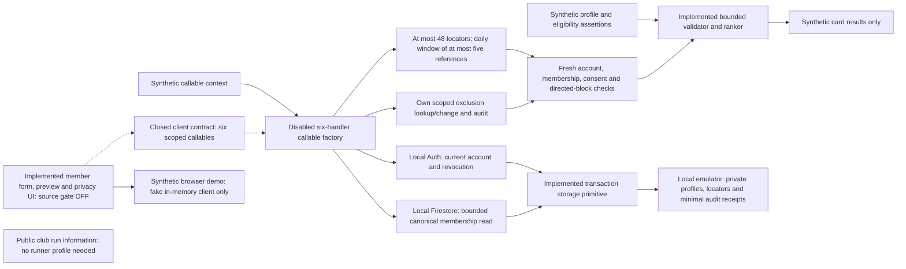

# Runner connections — implementation record

Status: **IN PROGRESS, NOT AVAILABLE YET**. Owner-authorized in-house community
development is tracked in [#689](https://github.com/Run-MPRC/Run-MPRC.github.io/issues/689).
Payment handling is a separate decision. This feature does not enroll existing
members, widen officer-directory consent, or require new payment processing.

## Current source

`functions/runnerConnections.js` validates a small explicitly chosen runner card
and ranks a bounded window of at most 48 supplied candidates. It has no network,
database, account, deployment, or Cloud Function export. Its eligibility inputs
are assertions for a future trusted adapter, **not authentication or proof of
current membership/adult eligibility**. It is not imported by the application.

- Easy pace is entered as whole seconds in explicit min/km or min/mile units.
  One mile is exactly 1.609344 km; normalization rounds to whole seconds/km.
  Canonical accepted pace is 120–1800 seconds/km; distance is 500–50000 metres.
- Up to seven non-overlapping weekly windows use Sunday=0 and minutes after
  midnight in the club's America/Los_Angeles timezone. They indicate usual
  availability, not attendance at any particular run or event.
- Running together requires a shared pace, distance, area, terrain, run style,
  sufficient overlapping time for the minimum shared distance, and reciprocal
  experience preferences. Broadening never relaxes those constraints.
- Version 1 ordinary scoring awards four points per shared goal and two for
  shared experience. Optional interests add reasons, not a score penalty when
  absent. Scores are internal ordering choices, not compatibility percentages.
- At most four ordinary cards plus one separately opted-in broadening card are
  returned. Broadening selects an otherwise compatible person with different
  experience, goals or voluntarily supplied interests. Both parties must opt in.
  Stable entry-reference ordering breaks ties; an empty pool stays empty.
- Only member-chosen card fields and fixed reason codes are returned. No UID,
  contact fields, private preferences, account photos, officer consent, scores,
  demographic fields or authority assertions appear in the output.
- Contact and demographic fields are rejected rather than silently accepted.
  Optional field-permissioned demographic matching remains a later requirement;
  no attributes are inferred from names, pictures or outside data.

The area, goal, interest, bounds and weight choices are reversible engineering
defaults for synthetic evaluation. They are not approved club policy.

### Private profile persistence — source and emulator only

`functions/runnerConnectionProfiles.js` adds a server-only storage primitive,
not a callable endpoint. It is not imported by `functions/index.js` or the app.
Every operation requires an injected trusted authorization callback; there is
no default grant. The callback runs on every transaction attempt, including
idempotent retries. The storage-only tests use fake admission; the service tests
below instead use local Auth and canonical membership records.

- Dave selected **member-confirmed 18+** on September 27. A save requires
  `adultConfirmed: true` and `consentVersion: 1`. This is self-attestation, not
  verified age or identity. No date of birth is accepted or stored. The future
  form must present an unchecked-by-default affirmation. Current membership
  must still be checked separately on the server.
- Missing profiles default to private without creating a record. A separate
  `runnerConnectionProfiles/{uid}` document stores only the selected card,
  consent and revision metadata. No existing member or officer-directory
  record is copied, changed or automatically enrolled.
- A UUID command and expected revision make each save/withdrawal retry-safe.
  Profile changes and a minimal `auditEvents` receipt commit together. A
  reused command with changed content or stale revision is rejected. An
  uncertain reply can be recovered with the identical command.
- Withdrawal removes the card and clears discovery, matching, broadening and
  adult affirmation. A revision tombstone prevents a stale save from restoring
  it. A new save requires the current revision and fresh explicit affirmation.
  Receipt/tombstone retention still requires owner approval before live use;
  this implementation does not choose a retention schedule.
- Malformed stored data, clock rollback and provider failure fail closed with
  fixed messages. No request, profile or provider error is logged. The private
  receipt contains operation metadata and a fingerprint, not card fields.
- Explicit Rules deny every browser read/write, including owner/admin access,
  nested records, queries and collection-group queries. Admin SDK access still
  requires the separate trusted authorization boundary; Rules do not police it.

These are additive, unused source paths. No backfill, data migration, existing
client contract change, new dependency or Cloud Function export is introduced.

### Profile callable integration — disabled source, local emulator only

`functions/runnerConnectionService.js` connects the stores to six callable
handlers: read/save/withdraw one's own card, get recommendations, and read/change
one's own exclusion for a previously selected reference. Its factory defaults
disabled and is not imported by the deployment index. Request data and environment
variables cannot enable it. Each handler uses native App Check, zero reserved
instances, a two-instance maximum, 256 MB memory and a 30-second timeout. These
source settings are not provider configuration or a bill ceiling.

- The callable runtime supplies verified identity/App Check context. A fresh
  Auth Admin lookup on every transaction attempt then requires the same UID,
  a verified, enabled account and a session not older than the revocation time.
  A never-revoked account's absent timestamp has the installed SDK's meaning
  of no revocation; malformed present timestamps deny access. Provider failures
  return fixed unavailability, without raw errors or profile data.
- Saves query at most two `memberships` records by explicit `association.uid`.
  Exactly one must have a document ID matching its stable `membershipId` and
  satisfy the existing `deriveMembershipEntitlement` contract at the server
  time after the query returns. Missing, ambiguous, malformed, pending, expired,
  future, suspended or ended membership denies saving, including exact retries.
  Browser/profile roles, an admin claim and email matches are never fallbacks.
- `memberships/{membershipId}` is an **additive consumer schema**, containing
  the existing version-1 authority snapshot. This feature writes no membership,
  term, payment, evidence, association or claim. Approved population, durable
  UID uniqueness and membership operations remain #81/#114/#115 dependencies.
  Do not manually seed real membership records to make this feature work.
  Explicit Rules deny browser access to this collection and its descendants.
- A current verified, non-revoked account may read or withdraw only its own
  card after membership expires. This grants no access to other cards or
  recommendations and cannot republish a profile. Deleted, disabled, revoked
  or unverified accounts need account recovery/private support before removal.
- Closed requests are snapshotted before asynchronous work. Per-account limits
  allow 30 reads, 12 saves and 12 withdrawals per hour. Every attempt, including
  an exact retry, counts. Withdrawal has a separate bucket; exhausting saves
  cannot exhaust it. Limits reuse private `ratelimits` storage and its pending
  TTL setup; keys are linkable pseudonyms, not anonymous data. These limits
  bound this service's work, not all invocation or provider charges.
- Every response is private/no-store. Only the saved owner's closed profile
  projection is returned; no membership, payment, Auth or roster record travels
  to the browser.

The 34 service emulator cases use real local Auth/Firestore and invoke the
installed SDK's callable callback with synthetic context. They prove the
implemented admission, persistence and metering behavior, **not** HTTP token
verification or hosted App Check enforcement. Seven additional unit checks
cover the disabled gate, real SDK runtime configuration and request snapshots.
Independent read-only review found no actionable service/Rules/CI defect and
separately passed the seven unit and eleven CI contract checks. Auth freshness
is a point-in-time server read, not an atomic lock spanning Auth and Firestore;
an account change after that read cannot retroactively recall a completed save.
The recommendation delivery boundary below has the same point-in-time limitation.

### Bounded recommendations and privacy controls — disabled source only

`runnerConnectionRecommendations.js` adds server-selected daily windows and
requester-scoped hide/block controls. It is not a browser roster or a deployed
endpoint. All six handlers stay disabled and absent from the deployment index.

- A profile save atomically adds/removes `runnerConnectionEntries/{hashedUid}`
  alongside the profile and audit. Entries only locate candidates; they cannot
  authorize a card. A deterministic per-viewer, per-UTC-day pivot selects at
  most 48 entries with two bounded document-ID queries. No composite index,
  browser cursor, search query or caller-selected pool size is introduced.
- A window holds at most four ordinary and one mutually opted-in broadening
  suggestion. `runnerConnectionWindows/{uid}` stores only those private UID
  references and version/time metadata, never cached cards. Refresh, profile
  edits, hides and blocks cannot fill vacated slots with new people that day.
  Sparse/empty results remain honest. The UI must say no matches in today's
  selection, not no compatible club members: the sample is not exhaustive.
  The next UTC day permits a new window.
  A deterministic daily audit prevents silent rebuilding if a cache is lost.
- After selection, a fresh transaction checks the actor's current Auth and
  canonical membership, profiles/consent, both directed exclusions, and each
  candidate's enabled/verified account and current canonical membership.
  Candidate accounts have no calling session to authenticate; caller session
  revocation remains mandatory. Fresh feasibility/consent checks run again.
  The actor is checked once more after candidate work. Removed or ineligible
  cards are omitted, not replaced. Unknown provider failure returns fixed
  unavailability, never partial results or a raw provider message.
- A requester-scoped `seen` receipt is created for each selected reference;
  this means selected, not proof a response was delivered or viewed. It permits
  privacy changes later, without exposing another UID. A closed lookup returns
  only the requester's current exclusion flags/revision for that reference.
  `runnerConnectionExclusions/{hashedPair}` records directed hide/block state.
  Hide affects only one's own results; either person's block prevents the pair
  in both directions. Undo changes only the requester's own choice.
- Exclusion commands require a UUID and current revision, and commit with a
  minimal audit. Identical retries do not duplicate changes; changed/stale
  commands conflict. A known reference can still be hidden/blocked after term
  expiry or target withdrawal, with a current verified/non-revoked account.
  No endpoint lists hidden people or arbitrary references; release work must
  define an approved, bounded recovery/manage-controls experience.
- Limits are separate: six recommendation requests, 30 exclusion lookups and
  30 exclusion changes per account/hour. Each attempt counts. Recommendation
  exhaustion cannot consume withdrawal or exclusion budgets. These bounds and
  the daily cadence are reversible engineering defaults, not a bill ceiling,
  a club retention policy, or a guarantee against multi-account abuse.
- Entries, windows (including nested receipts) and exclusions deny every
  browser read/write, query and collection-group query, including admins.
  Pair/reference hashes are linkable pseudonyms, not anonymous or secret data.
  Receipts/exclusions/audits require approved retention and account-deletion
  handling before live use; this change sets no retention period.

Migration impact: additive unused collections only. No real records are copied
or backfilled. An older profile with no locator remains undiscoverable until a
fresh explicit save; replay of an old command does not silently enroll it.
Withdrawal clears the locator atomically but retains private anti-replay and
privacy-control records pending approved retention. No dependencies changed.

Freshness proof is limited: emulator tests mutate consent, membership, account
state and blocks **between selection and final delivery** and require withholding.
Firestore provides a consistent transaction snapshot, not an atomic lock across
Auth, Firestore and network delivery. A change after the final read cannot recall
already sent data. These tests do not prove live middleware or provider settings.

### Member interface — disabled source, synthetic tests only

`/account/running-partners` and its My Account link are controlled by the literal
`RUNNER_CONNECTIONS_AVAILABLE = false`. No query, environment or stored browser
value enables them. A direct visit currently shows an unavailable notice and
public-run/contact links without starting runner-profile work. Backend exports
remain absent; the existing two-profile-Function release scope is unchanged.

- The form has explicit pace units, bounded distance and usual Pacific-time
  windows, coarse running areas and optional interests. New profiles start
  with unchecked 18+, discovery, similarity and broadening choices. The initial
  Saturday window is marked for review, not an attendance claim. Unit changes
  clear both pace inputs rather than reinterpreting them.
- A valid exact-card preview is required before saving. Preview and suggestions
  use the same renderer; private experience preferences are omitted. Editing
  invalidates the preview. Turning discovery off clears both recommendation
  permissions; turning it back on does not silently restore them. Withdrawal
  clears all card, sharing and age state. No DOB or verified-age claim is used.
- The client snapshots closed requests and validates closed responses from the
  six scoped callables. Mutation replies must match the intended revision and
  content before success appears. Unknown outcomes retain the identical UUID,
  revision and payload for retry while other edits are disabled; known rejection
  requires reloading current state. Raw provider errors are never displayed.
- UI state is keyed to the UID and Firebase app object. The client checks the
  current UID before sending and after awaiting. This prevents stale display
  across accounts; it is not the trusted authorization boundary. No card is
  persisted to browser storage or sent to logs/analytics by this feature.
- Suggestions load only on request. Empty copy describes today's limited
  selection, not the whole club. Unavailable, blurred/hidden or expired results
  are cleared, including an in-flight response after blur. Hide/block first read
  the requester's current exclusion revision and preserve the other flag.
  Changes clear suggestions without requesting replacement people.
- Up to five privacy choices from the current visit have own-choice undo.
  This is **not** persistent history management: leaving/reloading the page
  loses that display. A bounded way to recover/manage past choices is still a
  release gate. Private introductions, messaging and contact disclosure are absent.

Migration impact: additive inactive route/client only; no backfill, deployment,
membership writer, new dependency, lockfile or generated sitemap change. UI
checks are defense in depth; all membership, consent and disclosure authority
stays on the server. Public club information remains available without a profile.

## Integration still required before the first slice is complete

1. Establish and independently verify approved canonical membership population,
   unique associations and operator procedures before enabling the consumer.
2. Rehearse callable HTTP Auth/App Check enforcement and account-loss recovery;
   the tested callbacks are not proof that a hosted endpoint exists.
3. Approve privacy wording, retention/account-deletion handling, and a bounded
   member-facing way to find and manage one's existing hide/block choices.
4. Rehearse the browser and real callable transport together in isolated staging;
   backend callback tests and a fake-client browser demo are not end-to-end acceptance.
5. Keep the implemented member interface disabled until backend-first deployment,
   persistent privacy-choice management and privacy/release review pass.
6. Complete full validation, independent review, officer handoff, a synthetic
   staging rehearsal and separate exact website/Firebase/provider verification.



Text alternative: synthetic callbacks exercise current account/membership checks
and private profile storage, bounded recommendation windows and fresh privacy
checks in local emulators; the disabled member UI has separate fake-client browser
checks, public run information needs no runner profile, and no runner service is live.

## Evidence boundary

The initial 50 synthetic unit tests cover validation, unit conversion, hard
compatibility, consent, eligibility assertions, exclusions, broadening, sparse
results, bounded input and deterministic output. Current local Node 20/Java 21
checks pass 35 persistence, 34 profile-service and 38 recommendation-emulator
cases, 468 Rules cases,
and 134 workflow/release/security checks. Functions lint passes. The ordinary
Functions checkpoint passed 7,629 cases with 133 emulator-only skips; the current
Auth/Firestore run passes 7,737 with 63 separately opted-in commerce-journal
cases skipped. Skipped tests are not counted as passes. CI requires both Auth
and Firestore for all three runner emulator suites, separately from unit tests.

The preceding profile-service checkpoint's exact CI run 36309661314 passed all
five jobs, including the actually executed emulator and build/artifact steps.
The recommendation checkpoint `e57ad41` passed all five jobs in CI run
36310998065; 468 Rules cases, all 107 runner emulator cases and build/artifact
verification actually executed. Those runs do not prove later revisions; use
the PR's exact-head checks for the new frontend increment.

The focused storage review found no actionable defect. Its suggested concurrent
save/withdrawal and forced authorization-loss-on-retry cases now pass. A
withdrawal that loses a revision race reports a conflict, not success; the
caller must refresh and submit a new withdrawal. No accepted withdrawal is
undone by a stale command. This is still injected test admission, not a proven
live revocation policy. Review does not complete the outstanding integration.

Independent read-only review of the recommendation increment found no actionable
defect, and independently passed seven service-unit and eleven CI-contract tests.
Its residuals are recorded above: limited daily sampling, point-in-time Auth
freshness, then-missing member UI/retention procedures and unproven hosted enforcement.
The main-task emulator run also proves exclusion audit rollback, exact recovery
after a lost reply, authorization loss on transaction retry, and midnight retry.
These results do **not** prove deployed authorization, verified age,
provider billing limits or real connections. The issue and draft PR
remain open until integrated acceptance cases pass. No live member data is
needed for development.

The September 27 frontend checkpoint passes 38 focused synthetic cases and the
full 1,384-case frontend suite. Client/server parity tests compare every integer
pace input from 120 through 3,000 seconds in both units with the actual pure server
validator, including rejected inputs, and compare the exact public-card projection.
Tests also cover invalid windows, midnight, unchecked age/consent, exact preview,
withdrawal, same-command retry, account/app changes and stale-result clearing.
Independent read-only UI review found no actionable defect; it did not rerun tests
or inspect a live integration. The owner-run browser check on September 27 used
only an explicitly labeled, disposable in-memory fake client. At desktop and
390×844 phone width, preview/save, suggestion display, block/own undo and withdrawal
behaved as expected; phone width had no horizontal overflow and captured console
warnings/errors were empty. No screenshot artifact is retained. This is layout
and UI-transition evidence, not real persistence, App Check or hosted authorization.
The temporary browser and local server were closed afterward. TypeScript, exact
lint-baseline and optimized artifact checks are recorded with the PR's head evidence.

With Node 20, Java 21 and committed lockfile installs, run the focused storage
check with:

```sh
REQUIRE_RUNNER_CONNECTION_PROFILES_EMULATOR=1 REQUIRE_RUNNER_CONNECTION_SERVICE_EMULATOR=1 REQUIRE_RUNNER_CONNECTION_RECOMMENDATIONS_EMULATOR=1 npx --no-install firebase emulators:exec --project demo-functions-test --only firestore,auth "npm --prefix functions run test:run -- --runInBand runnerConnectionProfiles.emulator.test.js runnerConnectionService.emulator.test.js runnerConnectionRecommendations.emulator.test.js"
npm run test:rules
```

Platform references: [native callable App Check](https://firebase.google.com/docs/app-check/cloud-functions)
and [Auth session revocation](https://firebase.google.com/docs/auth/admin/manage-sessions).
The installed Admin SDK's `verifyDecodedJWTNotRevokedOrDisabled` also confirms
the absent revocation-timestamp behavior. These explain implementation choices;
they do not verify an MPRC deployment.

The separate September 27 backend preflight found staging billing disabled and
zero billing accounts accessible to the authorized club account. The existing
profile deployment guard passes, but Functions deployment and protected release
gates remain unresolved. This feature does not bypass them.
