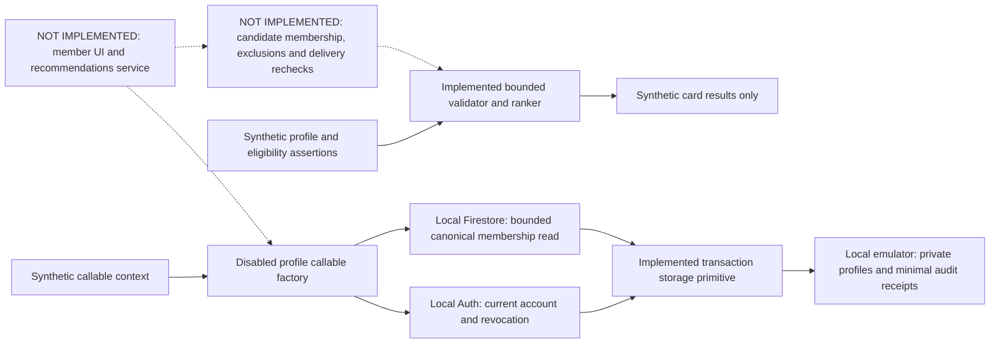

# Runner connections — implementation record

Status: **IN PROGRESS, NOT AVAILABLE YET**. Owner-authorized in-house community
development is tracked in [#689](https://github.com/Run-MPRC/Run-MPRC.github.io/issues/689).
Payment handling is a separate decision. This feature does not enroll existing
members, widen officer-directory consent, or require new payment processing.

## Current source

`functions/runnerConnections.js` validates a small explicitly chosen runner card
and ranks a bounded window of at most 48 supplied candidates. It has no network,
database, account, deployment, or Cloud Function export. Its eligibility inputs
are assertions for a future trusted adapter, **not authentication or proof of
current membership/adult eligibility**. It is not imported by the application.

- Easy pace is entered as whole seconds in explicit min/km or min/mile units.
  One mile is exactly 1.609344 km; normalization rounds to whole seconds/km.
  Canonical accepted pace is 120–1800 seconds/km; distance is 500–50000 metres.
- Up to seven non-overlapping weekly windows use Sunday=0 and minutes after
  midnight in the club's America/Los_Angeles timezone. They indicate usual
  availability, not attendance at any particular run or event.
- Running together requires a shared pace, distance, area, terrain, run style,
  sufficient overlapping time for the minimum shared distance, and reciprocal
  experience preferences. Broadening never relaxes those constraints.
- Version 1 ordinary scoring awards four points per shared goal and two for
  shared experience. Optional interests add reasons, not a score penalty when
  absent. Scores are internal ordering choices, not compatibility percentages.
- At most four ordinary cards plus one separately opted-in broadening card are
  returned. Broadening selects an otherwise compatible person with different
  experience, goals or voluntarily supplied interests. Both parties must opt in.
  Stable entry-reference ordering breaks ties; an empty pool stays empty.
- Only member-chosen card fields and fixed reason codes are returned. No UID,
  contact fields, private preferences, account photos, officer consent, scores,
  demographic fields or authority assertions appear in the output.
- Contact and demographic fields are rejected rather than silently accepted.
  Optional field-permissioned demographic matching remains a later requirement;
  no attributes are inferred from names, pictures or outside data.

The area, goal, interest, bounds and weight choices are reversible engineering
defaults for synthetic evaluation. They are not approved club policy.

### Private profile persistence — source and emulator only

`functions/runnerConnectionProfiles.js` adds a server-only storage primitive,
not a callable endpoint. It is not imported by `functions/index.js` or the app.
Every operation requires an injected trusted authorization callback; there is
no default grant. The callback runs on every transaction attempt, including
idempotent retries. The storage-only tests use fake admission; the service tests
below instead use local Auth and canonical membership records.

- Dave selected **member-confirmed 18+** on September 27. A save requires
  `adultConfirmed: true` and `consentVersion: 1`. This is self-attestation, not
  verified age or identity. No date of birth is accepted or stored. The future
  form must present an unchecked-by-default affirmation. Current membership
  must still be checked separately on the server.
- Missing profiles default to private without creating a record. A separate
  `runnerConnectionProfiles/{uid}` document stores only the selected card,
  consent and revision metadata. No existing member or officer-directory
  record is copied, changed or automatically enrolled.
- A UUID command and expected revision make each save/withdrawal retry-safe.
  Profile changes and a minimal `auditEvents` receipt commit together. A
  reused command with changed content or stale revision is rejected. An
  uncertain reply can be recovered with the identical command.
- Withdrawal removes the card and clears discovery, matching, broadening and
  adult affirmation. A revision tombstone prevents a stale save from restoring
  it. A new save requires the current revision and fresh explicit affirmation.
  Receipt/tombstone retention still requires owner approval before live use;
  this implementation does not choose a retention schedule.
- Malformed stored data, clock rollback and provider failure fail closed with
  fixed messages. No request, profile or provider error is logged. The private
  receipt contains operation metadata and a fingerprint, not card fields.
- Explicit Rules deny every browser read/write, including owner/admin access,
  nested records, queries and collection-group queries. Admin SDK access still
  requires the separate trusted authorization boundary; Rules do not police it.

These are additive, unused source paths. No backfill, data migration, existing
client contract change, new dependency or Cloud Function export is introduced.

### Profile callable integration — disabled source, local emulator only

`functions/runnerConnectionService.js` connects the store to three callable
handlers for reading, saving and withdrawing one's own card. Its factory defaults
disabled and is not imported by the deployment index. Request data and environment
variables cannot enable it. Each handler uses native App Check, zero reserved
instances, a two-instance maximum, 256 MB memory and a 30-second timeout. These
source settings are not provider configuration or a bill ceiling.

- The callable runtime supplies verified identity/App Check context. A fresh
  Auth Admin lookup on every transaction attempt then requires the same UID,
  a verified, enabled account and a session not older than the revocation time.
  A never-revoked account's absent timestamp has the installed SDK's meaning
  of no revocation; malformed present timestamps deny access. Provider failures
  return fixed unavailability, without raw errors or profile data.
- Saves query at most two `memberships` records by explicit `association.uid`.
  Exactly one must have a document ID matching its stable `membershipId` and
  satisfy the existing `deriveMembershipEntitlement` contract at the server
  time after the query returns. Missing, ambiguous, malformed, pending, expired,
  future, suspended or ended membership denies saving, including exact retries.
  Browser/profile roles, an admin claim and email matches are never fallbacks.
- `memberships/{membershipId}` is an **additive consumer schema**, containing
  the existing version-1 authority snapshot. This feature writes no membership,
  term, payment, evidence, association or claim. Approved population, durable
  UID uniqueness and membership operations remain #81/#114/#115 dependencies.
  Do not manually seed real membership records to make this feature work.
  Explicit Rules deny browser access to this collection and its descendants.
- A current verified, non-revoked account may read or withdraw only its own
  card after membership expires. This grants no access to other cards or
  recommendations and cannot republish a profile. Deleted, disabled, revoked
  or unverified accounts need account recovery/private support before removal.
- Closed requests are snapshotted before asynchronous work. Per-account limits
  allow 30 reads, 12 saves and 12 withdrawals per hour. Every attempt, including
  an exact retry, counts. Withdrawal has a separate bucket; exhausting saves
  cannot exhaust it. Limits reuse private `ratelimits` storage and its pending
  TTL setup; keys are linkable pseudonyms, not anonymous data. These limits
  bound this service's work, not all invocation or provider charges.
- Every response is private/no-store. Only the saved owner's closed profile
  projection is returned; no membership, payment, Auth or roster record travels
  to the browser.

The 34 service emulator cases use real local Auth/Firestore and invoke the
installed SDK's callable callback with synthetic context. They prove the
implemented admission, persistence and metering behavior, **not** HTTP token
verification or hosted App Check enforcement. Seven additional unit checks
cover the disabled gate, real SDK runtime configuration and request snapshots.
Independent read-only review found no actionable service/Rules/CI defect and
separately passed the seven unit and eleven CI contract checks. Auth freshness
is a point-in-time server read, not an atomic lock spanning Auth and Firestore;
an account change after that read cannot retroactively recall a completed save.
The recommendation delivery boundary must be reviewed separately.

## Integration still required before the first slice is complete

1. Establish and independently verify approved canonical membership population,
   unique associations and operator procedures before enabling the consumer.
2. Rehearse callable HTTP Auth/App Check enforcement and account-loss recovery;
   the tested callbacks are not proof that a hosted endpoint exists.
3. Add requester-scoped exclusions, block/hide, bounded reads and abuse limits.
   Recheck current identity, eligibility, visibility and blocks before delivery;
   a cache or prior ranker result cannot authorize a card.
4. Extend the passing profile-service tests to candidate admission and concurrent
   withdrawal/blocking during recommendation delivery.
5. Add the member form, exact-card preview, explicit consent and recommendation
   interface with empty/unavailable/uncertain-save behavior. Keep its capability
   disabled until backend-first deployment and privacy/release review pass.
6. Complete full validation, independent review, officer handoff, a synthetic
   staging rehearsal and separate exact website/Firebase/provider verification.



Text alternative: synthetic callbacks exercise current account/membership checks
and profile storage in local emulators; the member interface, recommendation
service and delivery checks remain unimplemented and nothing is enabled live.

## Evidence boundary

The initial 50 synthetic unit tests cover validation, unit conversion, hard
compatibility, consent, eligibility assertions, exclusions, broadening, sparse
results, bounded input and deterministic output. Current local Node 20/Java 21
checks pass 35 persistence plus 34 service-emulator cases, 438 Rules cases,
and 134 workflow/release/security checks. Functions lint passes. The ordinary
Functions run passes 7,629 cases with 133 emulator-only skips; the Auth/Firestore
run passes 7,699 with 63 separately opted-in commerce-journal cases skipped.
Skipped tests are not counted as passes. CI now requires both Auth and Firestore
for the two runner emulator suites, separately from the ordinary unit run.

The preceding storage checkpoint's exact CI run 36308568014 passed all five
jobs, including the actually executed persistence step. That run is not evidence
for later revisions; use the PR's exact-head checks for the new service change.

The focused storage review found no actionable defect. Its suggested concurrent
save/withdrawal and forced authorization-loss-on-retry cases now pass. A
withdrawal that loses a revision race reports a conflict, not success; the
caller must refresh and submit a new withdrawal. No accepted withdrawal is
undone by a stale command. This is still injected test admission, not a proven
live revocation policy. Review does not complete the outstanding integration.

These results do **not** prove deployed authorization, verified age, withdrawal
during recommendation computation, stable server-side candidate windows,
provider billing limits, the member UI or real connections. The issue and draft PR
remain open until integrated acceptance cases pass. No live member data is
needed for development.

With Node 20, Java 21 and committed lockfile installs, run the focused storage
check with:

```sh
REQUIRE_RUNNER_CONNECTION_PROFILES_EMULATOR=1 REQUIRE_RUNNER_CONNECTION_SERVICE_EMULATOR=1 npx --no-install firebase emulators:exec --project demo-functions-test --only firestore,auth "npm --prefix functions run test:run -- --runInBand runnerConnectionProfiles.emulator.test.js runnerConnectionService.emulator.test.js"
npm run test:rules
```

Platform references: [native callable App Check](https://firebase.google.com/docs/app-check/cloud-functions)
and [Auth session revocation](https://firebase.google.com/docs/auth/admin/manage-sessions).
The installed Admin SDK's `verifyDecodedJWTNotRevokedOrDisabled` also confirms
the absent revocation-timestamp behavior. These explain implementation choices;
they do not verify an MPRC deployment.

The separate September 27 backend preflight found staging billing disabled and
zero billing accounts accessible to the authorized club account. The existing
profile deployment guard passes, but Functions deployment and protected release
gates remain unresolved. This feature does not bypass them.
