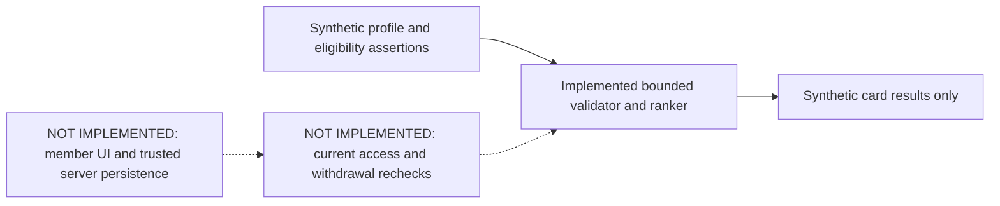

# Runner connections — implementation record

Status: **IN PROGRESS, NOT AVAILABLE YET**. Owner-authorized in-house community
development is tracked in [#689](https://github.com/Run-MPRC/Run-MPRC.github.io/issues/689).
Payment handling is a separate decision. This feature does not enroll existing
members, widen officer-directory consent, or require new payment processing.

## Current source

`functions/runnerConnections.js` validates a small explicitly chosen runner card
and ranks a bounded window of at most 48 supplied candidates. It has no network,
database, account, deployment, or Cloud Function export. Its eligibility inputs
are assertions for a future trusted adapter, **not authentication or proof of
current membership/adult eligibility**. It is not imported by the application.

- Easy pace is entered as whole seconds in explicit min/km or min/mile units.
  One mile is exactly 1.609344 km; normalization rounds to whole seconds/km.
  Canonical accepted pace is 120–1800 seconds/km; distance is 500–50000 metres.
- Up to seven non-overlapping weekly windows use Sunday=0 and minutes after
  midnight in the club's America/Los_Angeles timezone. They indicate usual
  availability, not attendance at any particular run or event.
- Running together requires a shared pace, distance, area, terrain, run style,
  sufficient overlapping time for the minimum shared distance, and reciprocal
  experience preferences. Broadening never relaxes those constraints.
- Version 1 ordinary scoring awards four points per shared goal and two for
  shared experience. Optional interests add reasons, not a score penalty when
  absent. Scores are internal ordering choices, not compatibility percentages.
- At most four ordinary cards plus one separately opted-in broadening card are
  returned. Broadening selects an otherwise compatible person with different
  experience, goals or voluntarily supplied interests. Both parties must opt in.
  Stable entry-reference ordering breaks ties; an empty pool stays empty.
- Only member-chosen card fields and fixed reason codes are returned. No UID,
  contact fields, private preferences, account photos, officer consent, scores,
  demographic fields or authority assertions appear in the output.
- Contact and demographic fields are rejected rather than silently accepted.
  Optional field-permissioned demographic matching remains a later requirement;
  no attributes are inferred from names, pictures or outside data.

The area, goal, interest, bounds and weight choices are reversible engineering
defaults for synthetic evaluation. They are not approved club policy.

## Integration still required before the first slice is complete

1. Define the authoritative current member/adult eligibility adapter without
   trusting request fields, a profile role mirror or officer-directory consent.
2. Persist separate opt-in profile/consent records through versioned, retry-safe
   server operations, with explicit pause/removal and no automatic enrollment.
3. Add requester-scoped exclusions, block/hide, bounded reads and abuse limits.
   Recheck current identity, eligibility, visibility and blocks before delivery;
   a cache or prior ranker result cannot authorize a card.
4. Prove these private collections deny all direct browser reads/writes and that
   server behavior passes concurrent, negative and withdrawal emulator tests.
5. Add the member form, exact-card preview, explicit consent and recommendation
   interface with empty/unavailable/uncertain-save behavior. Keep its capability
   disabled until backend-first deployment and privacy/release review pass.
6. Complete full validation, independent review, officer handoff, a synthetic
   staging rehearsal and separate exact website/Firebase/provider verification.

Text alternative: only synthetic fixtures currently reach the validator and
ranker; the member interface, persistence and current-access checks remain to be
implemented before any real recommendation can be returned.

## Evidence boundary

The initial 50 synthetic unit tests cover validation, unit conversion, hard
compatibility, consent, eligibility assertions, exclusions, broadening, sparse
results, bounded input and deterministic output. They do **not** prove deployed
authorization, adult verification, withdrawal during computation, stable
server-side candidate windows, request throttling, persistence, the member UI or
real connections. The issue remains open until the integrated acceptance cases
pass. No live member data is needed for development.

The separate September 27 backend preflight found staging billing disabled and
zero billing accounts accessible to the authorized club account. The existing
profile deployment guard passes, but Functions deployment and protected release
gates remain unresolved. This feature does not bypass them.
