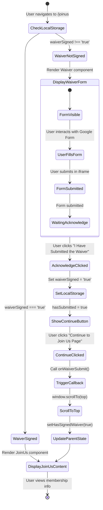
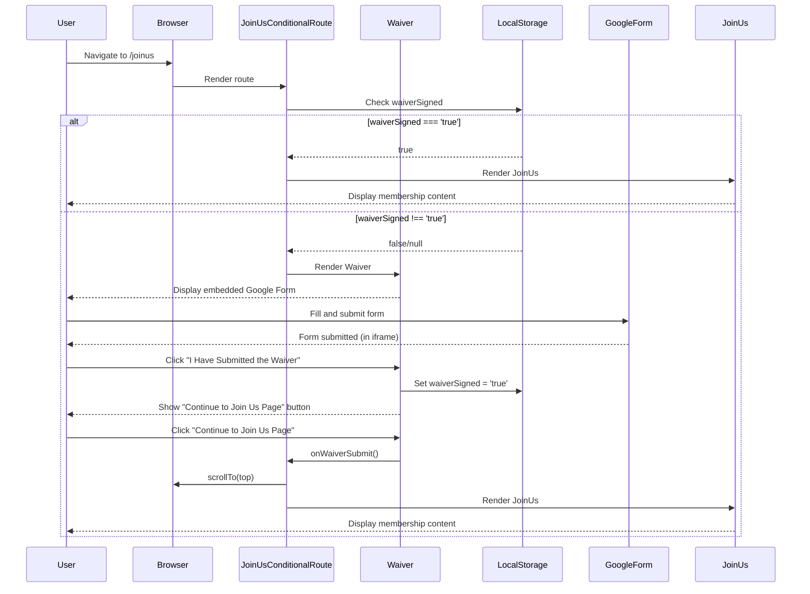
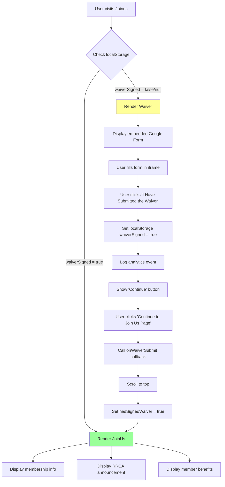

# Waiver Flow State Machine

## Overview

The waiver flow gates access to the Join Us page content. Users must acknowledge the waiver (via embedded Google Form) before viewing membership information.

## State Machine Diagram



## Sequence Diagram



## Component Flow Diagram



## States Description

| State | Description |
|-------|-------------|
| `CheckLocalStorage` | Initial check for existing waiver acknowledgment |
| `WaiverNotSigned` | User has not previously acknowledged waiver |
| `DisplayWaiverForm` | Show embedded Google Form in iframe |
| `AcknowledgeClicked` | User clicked the acknowledge button |
| `SetLocalStorage` | Persist waiver status to localStorage |
| `ShowContinueButton` | Display button to proceed |
| `WaiverSigned` | User has acknowledged waiver (current or previous session) |
| `DisplayJoinUsContent` | Show full Join Us page content |

## localStorage Keys

| Key | Type | Description |
|-----|------|-------------|
| `waiverSigned` | `'true'` \| `null` | Whether user acknowledged waiver |

## Components Involved

### JoinUsConditionalRoute.jsx

```jsx
// Manages waiver gate state
const [hasSignedWaiver, setHasSignedWaiver] = useState(false);

useEffect(() => {
  const waiverSigned = localStorage.getItem('waiverSigned');
  setHasSignedWaiver(waiverSigned === 'true');
}, []);

// Conditional render
{hasSignedWaiver ? <JoinUs /> : <Waiver onWaiverSubmit={onWaiverSubmit} />}
```

### Waiver.jsx

```jsx
// Two-step acknowledgment
const [hasSubmitted, setHasSubmitted] = useState(false);

const handleFormSubmit = () => {
  localStorage.setItem('waiverSigned', 'true');
  setHasSubmitted(true);
};

const handleContinue = () => {
  onWaiverSubmit();  // Callback to parent
};
```

## Edge Cases

1. **localStorage disabled**: Falls back to showing waiver each visit
2. **Form not actually submitted**: User can still acknowledge (honor system)
3. **Cleared browser data**: User must re-acknowledge waiver
4. **Multiple tabs**: localStorage syncs across tabs on next visit

## Analytics Events

| Event | Trigger | Data |
|-------|---------|------|
| `signed_waiver` | User clicks acknowledge button | `{ signed: true }` |
