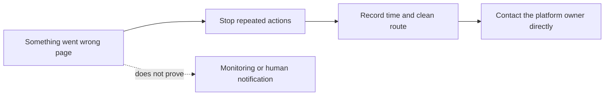
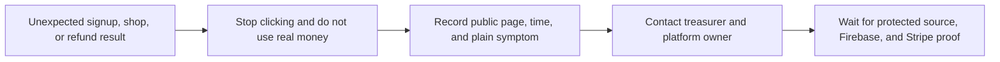
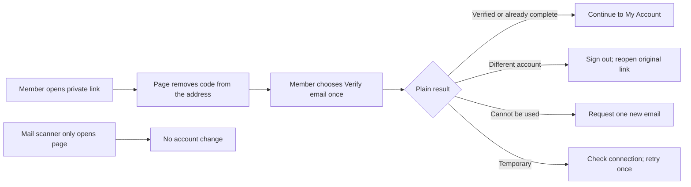
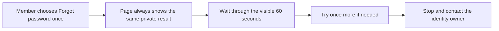

# Emergency and Recovery

**Purpose:** preserve evidence and reach the right owners when the site is down, wrong, unsafe, or exposing private information.
**Approver for production action:** platform owner plus one backup; add the privacy owner for private data and the treasurer for money.
**Expected first result:** the problem is recorded, no additional risky changes are made, and the correct owners are responding.

## Before you start

- Use your own officer account.
- Open the private continuity record if you can.
- Do not open or copy private records merely to investigate.

## First five minutes

1. Stop making changes.
2. Write down the time.
3. Copy the affected public URL.
4. Save one screenshot with names, emails, codes, and private details covered.
5. Describe the visitor action that exposed the problem.
6. Contact the platform owner.
7. Contact the platform backup.
8. Add the privacy owner or treasurer when the table below requires it.

## Choose the symptom

| Symptom | Safe first response |
| --- | --- |
| Wrong public text, image, or link | Ask the platform owner for one reviewed revert pull request. |
| Site unavailable or old after a merge | Ask the platform owner to check Netlify and GitHub Pages separately; do not change DNS. |
| Login or member access is wrong | Stop role requests and contact the identity/platform owners. |
| Account exists but a verification email request is unavailable | Ask the member to stop resending. Record only the time, route path `/login` or `/account`, and plain status. Omit all query/fragment text. Do not ask for the email address, password, code, action link, mailbox access, or screenshot. |
| Verification link is unusable or temporarily unavailable | Ask the member to stop after one deliberate check and one retry. Record only the time, clean route `/auth/action`, and plain result. Never copy anything after `?` or `#`, and never ask for the link, code, email address, or screenshot. |
| Password reset does not lead to a private message | Ask the member to stop after one displayed wait and one retry. Record only the time, route path `/login`, and plain status. Do not ask which address they entered or whether an account exists. |
| Profile Save says permission is missing | Ask the member to stop, sign out, and wait. Open a new redacted incident through [Request a change](./REQUEST_A_CHANGE.md). Do not edit the database, delete the login, recreate the account, or grant a role. |
| Private member information is visible | Contact platform and privacy owners immediately; they choose containment through an approved service procedure. Do not change permissions yourself. |
| Unexpected payment, refund, order, or signup | Contact treasurer and platform owners. The new source guard is not deployed and its officer control is NOT AVAILABLE YET. Do not test with real money. |
| Password, secret, or recovery code exposed | Contact the owning service's two approved owners. They revoke/rotate through the service-specific procedure and record evidence. Do not rotate it from this generic guide. |

Live commerce is not approved as of 2026-07-12. If the public site appears to accept a real payment, do not test it with a real card.

### Unexpected “Something went wrong” page — SOURCE ONLY, NOT LIVE

**Status: NOT AVAILABLE YET**

**Purpose:** leave a failed page safely, contact the right owner, and avoid copying private or technical error details.

**Approver:** platform owner plus one backup. Add the privacy owner if private information may be involved. Add the treasurer if the failure followed a signup, checkout, order, payment, or refund action.

**Prerequisites:** issue [#293](https://github.com/Run-MPRC/Run-MPRC.github.io/issues/293) must be merged for source review. Calling the safer page live also requires a protected website publication and an exact revision check on `runmprc.com`. Source tests use only made-up failures. Do not force a production failure.

**Seeing this page does not prove the club, a person, or an outside monitoring service was notified.** The source change does not configure monitoring, alert routing, provider delivery, or human response.

In words: stop repeated actions, record only safe public facts, and contact the platform owner directly. Never treat the page itself as proof that an alert reached anyone.

Until the exact website proof exists, follow **First five minutes** above, but record only the clean route and omit everything after `?` or `#`. Contact the platform owner directly.

Officer steps after the exact website proof exists:

1. Stop using the affected page.
2. Record the time.
3. Record only the clean public route. Omit everything after `?` or `#`.
4. Do not retry if the page followed a signup, checkout, order, payment, refund, Admin save, or any action that might have changed data.
5. Otherwise, choose **Try again** once.
6. If the page returns, choose **Go home**.
7. Contact the platform owner directly.
8. Add the privacy owner if private information appeared.
9. Add the treasurer if money, an order, or a signup may be involved.
10. Record who acknowledged the incident.
11. Do not open developer tools or copy an error, stack, token, account detail, or private screenshot.
12. Do not say anyone was notified until that person confirms receipt.

**Expected result:** the page shows one fixed accessible recovery message, no thrown error detail, and the existing **Try again** and **Go home** choices. One safe retry can reset the page. The officer contacts the correct owner directly. The page does not prove that monitoring ran, a provider delivered an alert, or a person saw it.

**Stop conditions:** any private detail, email, URL query, fragment, token-shaped value, provider detail, or technical error appears; the page followed a money, signup, order, or Admin action; one retry fails; anyone asks you to force a production error, inspect a real browser console, change monitoring settings, or copy the thrown value; the exact website revision is unverified; or anyone treats the page or a green workflow as notification proof.

**Success proof:** record the exact #293 issue, reviewed pull request, merged commit, intended old-source exposure, green made-up privacy and recovery tests, relevant full checks, and accessibility review. Record website publication and the dated `runmprc.com` revision separately. A mocked reporting call proves only that source reached the existing reporting boundary. Monitoring configuration, provider delivery, alert routing, and human acknowledgement each require separate private evidence. Do not force a live failure to obtain proof.

**Undo:** use one reviewed frontend revert or safe roll-forward through the protected website release. Verify the replacement revision on `runmprc.com`. Do not undo by disabling monitoring, changing a provider, editing production data, or repeatedly forcing the failure.

**Escalation:** platform owner plus backup. Add the privacy owner for exposed information, the treasurer for money or signup uncertainty, and the security owner for a token, secret, account detail, or unauthorized action. Use the private incident path. Do not copy sensitive details into an issue, message, screenshot, email, or AI tool.

### Pause new commerce — NOT AVAILABLE YET

**Status:** [#151](https://github.com/Run-MPRC/Run-MPRC.github.io/issues/151) adds source checks only. There is no approved officer button or procedure for changing the server control. Do not edit Firebase, Stripe, or release settings yourself.

**Purpose:** stop unsafe retries and reach the money and platform owners without making the incident larger.

**Approver:** treasurer plus platform owner. A future control change also needs the protected approver named by CONFIG-001B2.

**Prerequisites:** the public page, the time, and a plain description with names, emails, order details, payment details, and codes removed.

In words: stop, record only safe public facts, contact both owners, and wait for separate system checks.

1. Stop checkout, signup, late-add, comp, and refund attempts.
2. Do not retry with a real card or real member account.
3. Record the public page and time.
4. Record only the plain symptom.
5. Contact the treasurer.
6. Contact the platform owner.
7. Tell them whether the page showed **Commerce is temporarily unavailable**.
8. Wait for separate Firebase and Stripe checks.

**Expected result:** no new officer-initiated command is attempted, no private or payment data is copied, and both owners coordinate containment.

**Stop conditions:** anyone asks you to edit a database record, environment value, Stripe Session, Payment Link, payment state, or secret; anyone suggests a real payment test; either owner is unavailable; or the affected Stripe objects are unknown.

**Success proof:** exact source commit, exact protected Firebase release, readback of the server control without its values in public evidence, a made-up staging command that is denied, signed webhook continuity, and separate Stripe confirmation about any already-open test objects. A green workflow alone is not proof.

**Undo:** do not restore commerce because one page looks normal. The same owners must approve a protected restore after reconciliation and observation. Use a reviewed safe roll-forward; never revert to code without the server guard while the deploy ceiling is on.

**Escalation:** treasurer plus platform owner; add the security owner for an unauthorized command and the privacy owner if member information appeared.

### Verification email request unavailable

**Status:** the truthful create-account result in [#145](https://github.com/Run-MPRC/Run-MPRC.github.io/issues/145) and My Account resend/countdown in [#153](https://github.com/Run-MPRC/Run-MPRC.github.io/issues/153) are **SOURCE ONLY, NOT LIVE** until the exact website revision is published and verified. #118 profile source is merged, but its backend and live behavior are also unproven.

**Purpose:** preserve the new account and prevent repeated email requests or unsafe account repair.

**Approver:** membership lead plus identity/platform owner.

**Prerequisites:** the time, the public route path `/login` or `/account`, and the exact plain status with all private details omitted. Do not copy anything after `?` or `#` in the browser address. My Account recovery is not proven until [#118](https://github.com/Run-MPRC/Run-MPRC.github.io/issues/118) has exact Rules/Functions/profile-page deployment evidence and [#153](https://github.com/Run-MPRC/Run-MPRC.github.io/issues/153) has exact website evidence. Without both proofs, use only the stop-and-escalate steps below.

1. Ask the member to stop clicking Create account or the email-request action.
2. Do not ask for their email address, password, code, action link, mailbox access, or screenshot.
3. Record only the exact plain `accepted` or `unavailable` status, the time, and the route path `/login` or `/account`. Omit all query text after `?` and all fragment text after `#`.
4. Ask the member to keep the account. Do not delete or recreate it.
5. Open a redacted incident through [Request a change](./REQUEST_A_CHANGE.md).
6. Contact the identity/platform owner.
7. Add the communications owner if accepted messages land in Spam or never arrive.
8. Wait for separate website and provider evidence before saying the problem is fixed.

After the exact #118 and #153 live proofs exist:

1. Ask the member to choose **Request another verification email** once.
2. Ask them to wait through the full visible 60-second countdown.
3. If accepted, ask them to check Inbox and Spam once. Accepted does not mean delivered.
4. If unavailable, wait through the countdown and try once more.
5. If the second request is unavailable, stop and escalate.
6. Do not refresh to bypass the browser countdown. It can reset, but Firebase can still throttle requests.

**Expected result:** no private data is copied, no duplicate account is created, rapid repeats are blocked, and the owner can separate a website request failure from a provider-delivery problem.

**Stop conditions:** more than one retry after the countdown, refresh used to bypass it, real mailbox tests, direct Firebase Console changes, account deletion/recreation, role changes, or a request for private details.

**Success proof:** the exact website revision displays accepted/unavailable outcomes, the visible countdown, and one later retry in an approved synthetic check. Sender branding, delivery, and Spam placement need separate private evidence under [#119](https://github.com/Run-MPRC/Run-MPRC.github.io/issues/119).

**Undo:** ask for one reviewed frontend revert or safe roll-forward. Never undo this problem by deleting the login account.

**Escalation:** membership lead plus identity/platform owner; communications owner for delivery or Spam.

### Verification link page — SOURCE ONLY, NOT LIVE

**Status:** [#194](https://github.com/Run-MPRC/Run-MPRC.github.io/issues/194) is a verification-only source change. It is not a live procedure until the exact website revision is published, `runmprc.com` is verified, and [#119](https://github.com/Run-MPRC/Run-MPRC.github.io/issues/119) proves a safe Firebase handler choice. Firebase uses one handler for verification, password reset, and email recovery. The partial route must not be enabled globally.

**Purpose:** let a member check one private verification link without exposing its code or letting an automated mail scanner change the account.

**Approver:** identity/platform owner plus membership lead. The communications owner and a second Firebase owner approve the provider/template decision.

**Prerequisites:** exact #194 merge and website proof; protected release proof; private #119 proof that reset and recovery links still work; an isolated Firebase project; a made-up account and safe email sink. A source test, preview, or real member link is not enough.

In words: opening the page removes the private code but changes nothing; the member chooses one button, then follows one plain result without sharing the link or account details.

Officer steps after every prerequisite has proof:

1. Ask the member to open the private message on their own device.
2. Do not ask them to forward, copy, or show the link.
3. Ask them to confirm the address ends with `/auth/action` and contains no `?` or `#` before choosing anything.
4. Ask them to choose **Verify email** once.
5. If the page says verified or already complete, ask them to continue to My Account.
6. If it says a different account is signed in, ask them to open My Account, sign out, and reopen the original message.
7. If the link cannot be used, ask them to request one new verification email from My Account.
8. If verification is temporarily unavailable, ask them to check the connection and use the one retry.
9. If the second attempt is not clear, stop and open a redacted incident.
10. Record only the time, clean route `/auth/action`, and exact plain result.

**Expected result:** page load makes no action-code check and changes no account; the private query and fragment disappear; one deliberate action gives a fixed result; no address, code, provider error, role, membership, payment, or profile value appears or changes.

**Stop conditions:** the address still contains `?` or `#`; anyone asks for a link/code/address/screenshot; the page changes an account before the button; a non-verification action opens here; more than one retry; a real-member/provider test; or missing provider/live proof.

**Success proof:** exact #194 pull request and merge; green synthetic no-network tests; dated keyboard and screen-reader check; exact website publication and `runmprc.com` revision; private #119 staging proof for verification, reset, recovery, reuse, expiration, and rollback. Keep each proof separate.

**Undo:** publish one reviewed frontend revert or safe roll-forward. The Firebase owners separately restore the previously proven default/multi-mode handler. Never delete an account or edit verification state by hand.

**Escalation:** identity/platform owner plus membership lead; add communications for sender/delivery, security for an exposed code or wrong mutation, and the provider owner for handler/template failure.

### Password reset request — NOT AVAILABLE YET

**Status:** [#155](https://github.com/Run-MPRC/Run-MPRC.github.io/issues/155) is the tracked source change. It is not a live procedure until the exact revision is merged, published, and verified on `runmprc.com`. The protected release is also blocked on approved App Check and deployment configuration. Sender, Spam, delivery, and Firebase account-enumeration settings remain unverified owner work under [#119](https://github.com/Run-MPRC/Run-MPRC.github.io/issues/119).

**Purpose:** give every member the same private reset instructions without revealing whether an account or message exists.

**Approver:** membership lead plus identity/platform owner. The communications owner approves sender and Spam guidance.

**Prerequisites:** exact #155 merge and website publication evidence; exact `runmprc.com` revision evidence; private #119 readback of sender and Firebase enumeration protection; and an approved safe email sink for any staged provider check. A source test, preview, green workflow, or real member mailbox is not enough.

In words: make one request, show no account or provider result, wait one full minute, allow one retry, then stop.

Officer steps after every prerequisite has live proof:

1. Ask the member to choose **Forgot password?** once on their own device.
2. Do not ask which email address they entered.
3. Do not ask for a password, code, reset link, screenshot, or mailbox access.
4. Ask them to read only the plain result title.
5. Ask them to wait through the full visible 60-second countdown.
6. Ask them to check Inbox and Spam privately after a few minutes.
7. If a reset message is in Spam, ask them to mark it **Not spam**.
8. If no message arrives, ask them to choose the one retry after the countdown.
9. If the second attempt does not help, stop.
10. Open a redacted incident through [Request a change](./REQUEST_A_CHANGE.md).
11. Record only the time, `/login`, and `Password reset request finished`.
12. Contact the identity/platform owner and communications owner.

**Expected result:** every attempted provider outcome has the same plain result, rapid repeats are blocked, the same 60-second wait follows, and no address or provider detail appears in the result. This does not prove an account exists, a message was sent, Firebase blocks direct enumeration, or delivery works.

**Stop conditions:** more than one retry, refresh used to bypass the countdown, a real mailbox test, a request for an address or private link, different public results for different addresses, missing exact website evidence, or missing private #119 provider readback.

**Success proof:** exact #155 pull request and merge commit; green synthetic no-network tests; website publication record; separate `runmprc.com` revision check; dated keyboard and screen-reader review; and private #119 evidence for sender, enumeration protection, and approved staged delivery. Keep each proof separate.

**Undo:** publish and verify one reviewed frontend revert or safe roll-forward. Do not delete an account, edit Firebase Auth, or change an email template as a quick fix.

**Escalation:** membership lead plus identity/platform owner; add the communications owner for Spam or delivery and the security owner if public results differ by account state.

### Missing profile or profile permission error

**Status:** automatic repair is **NOT AVAILABLE YET**. These are current stop-and-escalate steps only.

**Purpose:** prevent a failed account repair from changing access or private data.

**Approver:** membership lead plus platform/security owner.

**Prerequisites:** the time, the public `/account` address, and a redacted description with no member details.

1. Ask the member to stop using Save.
2. Ask the member to sign out.
3. Open a new redacted incident by following [Request a change](./REQUEST_A_CHANGE.md).
4. Use [#118](https://github.com/Run-MPRC/Run-MPRC.github.io/issues/118) only as engineering context. Do not add member incidents or private details to it.
5. Share only the time and the plain symptom.
6. Wait for a made-up account test and separate website, server Function, and database-permission proof.

**Expected result:** no manual account or database change occurs. The member retries only after the automated repair is proven live.

**Stop conditions:** stop if a step needs a real profile, private screenshot, direct database change, account deletion, account recreation, or role change.

**Success proof:** use the checklist in [Events, shop, members, and money](./EVENTS_SHOP_MEMBERS.md#profile-permission-error).

**Undo:** ask the platform owner to prepare, approve, publish, and verify a reviewed revert or safe roll-forward. Do not delete the account or profile.

**Escalation:** membership lead plus identity/security owner; add the privacy owner if private details were exposed.

## Safe AI message

> Investigate this MPRC incident without changing production: **[symptom]** at **[URL]** starting **[time]**. Preserve evidence, redact private data, identify the last known-good version, and propose the smallest revert or safe roll-forward. Do not force-push, delete records, refund money, rotate secrets, change DNS, or deploy until the named owners approve.

## Stop conditions

- Stop if anyone asks for a password, code, secret, private record, or payment record in chat.
- Stop if a proposed fix changes several services at once.
- Stop if rollback, backup, owner, or affected production surface is unknown.
- Stop if the only available action is a force-push, database deletion, direct payment-state edit, or unreviewed DNS change.

## Success proof

Record:

- What happened and when.
- Who approved each response action.
- The issue, pull request, commit, or provider change.
- What was checked on `runmprc.com`.
- Whether Netlify identified the intended commit.
- Whether Firebase actually deployed.
- Whether each outside provider was checked.
- What follow-up prevents the same problem.

## Undo and restoration

Do not undo containment merely because the page looks normal. The same two owners must verify the cause is removed, affected services agree, and monitoring is stable. Restore one surface at a time and record the result.

## Escalation

- Public website or deployment: platform owner plus backup.
- Private member information: platform owner plus privacy owner.
- Login, role, or admin access: identity owner plus platform/security backup.
- Payment, refund, order, payout, or dispute: treasurer plus platform owner.
- Secret or account takeover: owning service's two owners; use provider support if recovery fails.

After recovery, update the matching officer guide while the lesson is fresh.
