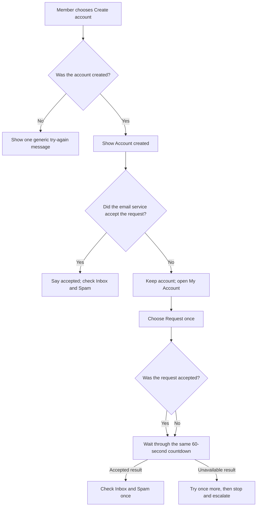
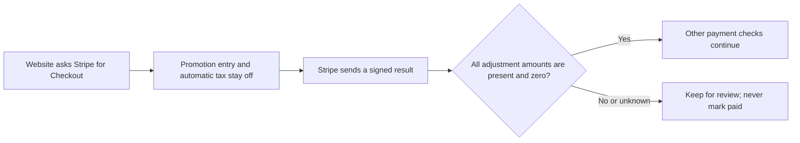
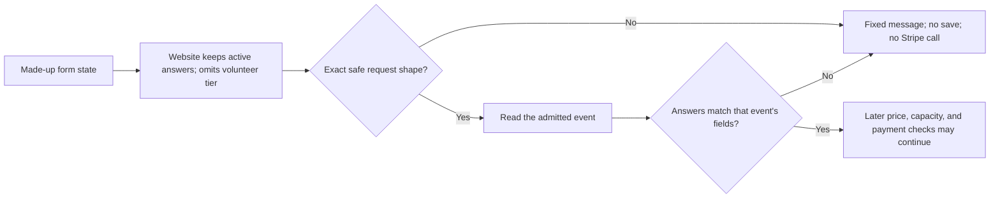
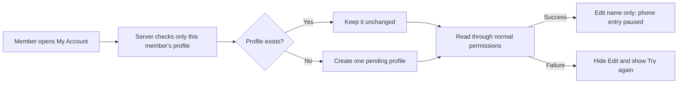
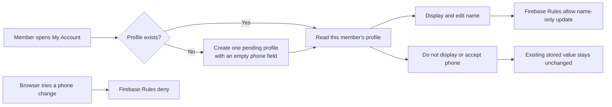
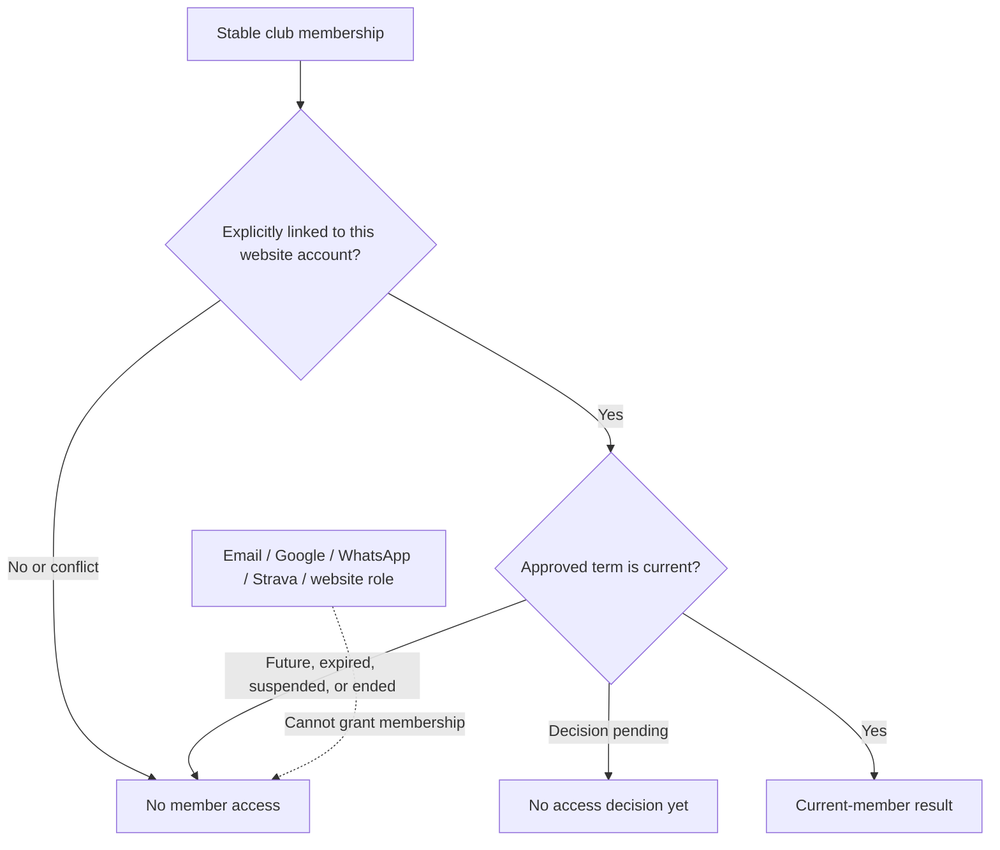
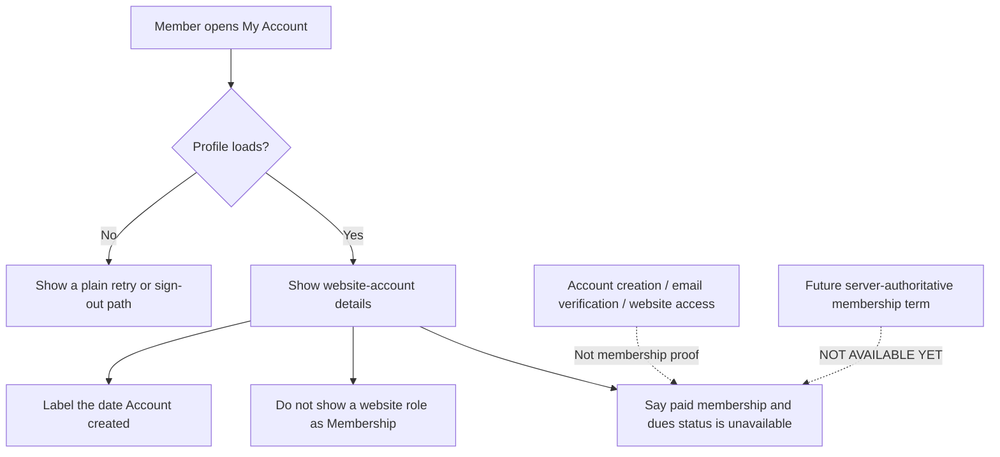
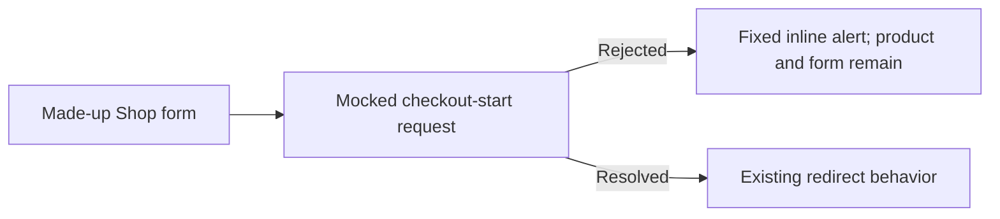
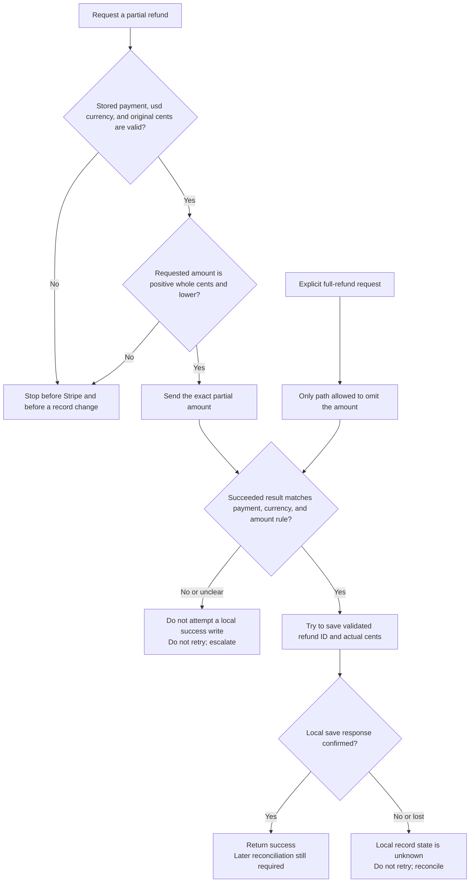
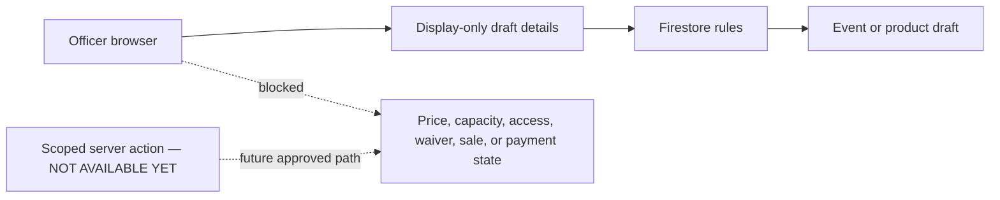

# Events, Shop, Members, and Money

**Current status:** live commerce is **NOT AVAILABLE YET**.
**Use this guide when:** a request touches registrations, members-only access, products, payments, refunds, waivers, or private data.

**Prerequisites:** a claimed issue, named business owner and backup, approved policy/value, isolated test data, and a platform specialist.
**Expected result:** a reviewed plan or test-only demonstration; no real payment, member, registration, order, or production-data change.

The repository contains screens for these jobs. Their presence does not prove the full system is safely configured or live.

There is currently no proven no-code switch that safely stops all new Stripe payments. Hiding a button, closing an event, or marking a product sold out may leave an already-created Stripe Checkout page payable.

## Approval table

| Change | Required owners |
| --- | --- |
| Public event description only | Event lead + communications lead |
| Registration dates or capacity | Event lead + platform lead |
| Price, discount, tax, product, inventory, refund, or payout | Treasurer + platform lead |
| Member access or admin role | Membership lead + platform/security lead |
| Waiver, Terms, Privacy, retention, insurance, or consent | Club officer + approved legal/privacy owner |
| Stripe, Firebase, Netlify, domain, email, or secret | Named service owner + backup |

## Safe request process

1. Open a GitHub issue before changing anything.
2. Name the business owner and backup owner.
3. Write the exact approved policy or value. Do not ask AI to invent it.
4. Ask AI to list every affected screen, data record, email, report, and outside service.
5. Require a test-only demonstration with made-up people and Stripe test mode.
6. Require negative tests: who must be denied, what retries, and what happens if a step fails.
7. Review the preview and the simple data/deployment diagram.
8. Require a rollback or safe roll-forward plan.
9. Require staging evidence before any production approval.
10. Approve a small, named live pilot only after the security launch gates are closed.

## Do not do these jobs manually

- Do not change Firestore records to “paid.”
- Do not grant admin access from the database console.
- Do not paste live Stripe or Firebase keys into code or chat.
- Do not delete registrations, orders, webhook events, or audit records to fix a display.
- Do not issue a refund in both Stripe and the website unless the approved procedure explicitly requires it.
- Do not open registration or sales because a screen appears to work locally.

## What proof is required

- Tests used fake people and test-mode payments.
- The exact commit and pull request are named.
- The website deployment is verified separately.
- The protected release proves the exact Rules and named Functions deployed first. Missing authority or a skipped/partial backend is a red stop, and the website is not published.
- Stripe or another provider is verified directly when involved.
- Counts and money reconcile after the change.
- The named officer signs off.

If any proof is missing, report the change as **not live**.

## New-account verification message — SOURCE ONLY, NOT LIVE

**Purpose:** tell a member whether the account exists and whether the email service accepted the verification request.

**Approver:** membership lead plus identity/platform owner.

**Prerequisites:** issue [#145](https://github.com/Run-MPRC/Run-MPRC.github.io/issues/145) is merged. Before publishing the #153 website revision, verify that the exact [#118](https://github.com/Run-MPRC/Run-MPRC.github.io/issues/118) Rules and Functions were deployed and read back. After publishing, verify the matching profile page and the resend result/countdown from [#153](https://github.com/Run-MPRC/Run-MPRC.github.io/issues/153) before calling My Account a working recovery path. The identity owner must confirm the plain status text. Source or merge evidence alone is not live proof. Email sender and Spam-folder improvements remain separate owner work in [#119](https://github.com/Run-MPRC/Run-MPRC.github.io/issues/119).

In words: account creation and each later email request are separate results. Accepted does not mean delivered. The same 60-second browser wait follows either resend result. Refreshing the page or changing accounts can reset that display, so it is not a server safety limit.

Until the prerequisites are proven, the current website message may still be wrong. Do not treat it as delivery evidence.

Officer steps after live proof:

1. Ask the member which plain status they see.
2. Do not ask for their email address, password, code, action link, or screenshot.
3. If the status says the request was accepted, ask them to check Inbox and Spam once.
4. If the message is in Spam, ask them to mark it **Not spam**.
5. If the status says the request did not finish, ask them to choose **Check My Account**.
6. If My Account is unavailable, stop. Keep the account and open a redacted incident through [Request a change](./REQUEST_A_CHANGE.md).
7. Use the next steps only after the exact [#153](https://github.com/Run-MPRC/Run-MPRC.github.io/issues/153) website revision is published and verified. Until then, stop and escalate.
8. Ask the member to choose **Request another verification email** once.
9. Ask them to wait through the full visible 60-second countdown.
10. If the page says the request was accepted, ask them to check Inbox and Spam once. Do not promise delivery.
11. If the page says the request was unavailable, wait for the countdown and try once more.
12. If that second request is unavailable, stop. Open a redacted incident through [Request a change](./REQUEST_A_CHANGE.md).
13. Do not refresh to bypass the display, create another account, or keep clicking. Firebase can still throttle a reset browser countdown.

**Expected result:** the page says `Account created` only after creation succeeds. It separately says an email request was accepted or unavailable. My Account disables the request action for 60 visible seconds after either result. The request-result message never repeats the member's address or the provider's error. An unavailable My Account page is a stop-and-escalate result, not proof that the account failed.

**Stop conditions:** a request for private account details, more than one retry after the countdown, a production email test, refreshing to bypass the countdown, a claim that accepted means delivered, or a website revision that cannot be identified.

**Success proof:** exact pull requests and merge commits for #145, #118, and #153; green synthetic tests; exact #118 Rules and Function deployment/readback before the website; a made-up profile-page check; website publication record; separate `runmprc.com` revision check; and dated plain-text review. Provider delivery, sender branding, Spam placement, and a real mailbox remain unproven unless #119 records owner-approved private evidence.

**Undo:** publish and verify one reviewed frontend revert or safe roll-forward. Do not delete or recreate the Firebase account.

**Escalation:** membership lead plus identity/platform owner; add the communications owner for Spam or delivery problems.

Password reset is a separate recovery path. [#155](https://github.com/Run-MPRC/Run-MPRC.github.io/issues/155) tracks one neutral result and one browser wait; it must never reuse the verification flow's `accepted` or `unavailable` account-specific wording. Until its exact website and private provider proofs exist, use only [Password reset request — NOT AVAILABLE YET](./EMERGENCY_AND_RECOVERY.md#password-reset-request--not-available-yet). Do not ask a member which address they entered.

The incoming verification link is another separate step. [#194](https://github.com/Run-MPRC/Run-MPRC.github.io/issues/194) tracks a deliberate-click `/auth/action` source route that removes the private code from the address and never grants membership. It is **NOT LIVE** and must not become Firebase's global handler while reset-password and email-recovery modes are unsupported. After every provider and website prerequisite is proven, use only [Verification link page — SOURCE ONLY, NOT LIVE](./EMERGENCY_AND_RECOVERY.md#verification-link-page--source-only-not-live). Officers never open, copy, or request the member's link or code.

## Checkout adjustment guard — SOURCE ONLY, NOT LIVE

**Purpose:** prevent an unknown discount, tax, or shipping charge from being treated as a valid payment.

**Approver:** treasurer plus platform owner.

**Prerequisites:** source for issue [#102](https://github.com/Run-MPRC/Run-MPRC.github.io/issues/102) has merged, a private Stripe-owner inventory, made-up test payments, and one protected release plan covering all three affected server Functions.

In words: Checkout starts with unapproved adjustments off; the server accepts the money result only when Stripe explicitly reports zero discount, tax, and shipping.

Officer steps:

1. Keep live race and shop checkout unavailable.
2. Do not create a promotion code, tax rule, or shipping rate for the website.
3. Ask the Stripe owner to review older open Sessions privately.
4. Do not put Session links, code values, customer details, screenshots, or provider IDs in GitHub or AI.
5. Wait for separate proof of source merge, Firebase deployment, Stripe readback, and made-up test behavior.

**Expected result:** a complete all-zero Stripe breakdown may continue through the other checks. Unknown or nonzero adjustments stay under review. A failed or expired Session closes locally; it keeps an adjustment or earlier warning, while an ordinary all-zero failure does not create a new warning.

**Stop conditions:** any real payment/customer data, production-mode test, missing private inventory, missing server Function, skipped Firebase work, or request to “temporarily” enable a discount.

**Success proof:** exact pull request/commit, green exact-commit checks, private redacted inventory, three named Function readbacks, Stripe test-mode results, and separate provider-owner confirmation.

**Undo:** use one reviewed three-Function revert or safe roll-forward. Do not edit a payment record, delete a webhook event, or change production Stripe settings by hand.

**Escalation:** treasurer plus platform owner; add security if an adjustment reached paid/fulfilled state.

## Race signup data guard — SOURCE ONLY, NOT LIVE

**Purpose:** stop malformed or unexpected race and volunteer signup data before anything is saved or sent to Stripe.

**Approver:** event lead plus privacy/platform owner. Add the treasurer when a price path is involved.

**Prerequisites for this source review:** issue [#219](https://github.com/Run-MPRC/Run-MPRC.github.io/issues/219) merged; the exact reviewed commit; and a redacted synthetic test report made with invented events and invented people only. This review makes no Firebase or Stripe call.

In words: the server checks the request first, then checks its answers against the admitted event; any mismatch stops with no save or Stripe call.

The website source first drops answers from the inactive participant or volunteer form and sends no price tier for a volunteer. The server still repeats every check. This source behavior is not live.

Officer source-review steps:

1. Keep live race and volunteer checkout unavailable.
2. Ask the specialist for the synthetic test report from the exact reviewed commit.
3. Confirm the report uses made-up people and made-up events only.
4. Confirm unknown fields and missing required answers are denied.
5. Confirm wrong answer types and invalid choices are denied.
6. Confirm a denial makes no registration write, rate-limit write, capacity check, token creation, Product call, or Checkout call.
7. Confirm the report contains no submitted names, email addresses, phone numbers, answers, or event field labels.
8. Record the result as source proof only.

**Expected result:** only an exact bounded request whose answers match the admitted event may reach later commerce checks. Every denial uses the same plain message and has no mutable or provider side effect.

**Stop conditions:** real member or runner data, an attempt to call Firebase or Stripe, a detailed error containing submitted data, a missing exact commit, or any side effect on denial.

**Success proof for this source review:** exact pull request and commit, green exact-commit tests, a redacted synthetic report, and a written note that Firebase, Stripe, and live behavior were not tested.

**Undo:** use one reviewed source revert or safe roll-forward. Do not edit a registration, event, payment, rate-limit record, or Stripe object by hand.

**Escalation:** event lead plus privacy/platform owner; add the treasurer and security lead if any denied request caused a write or Stripe call.

**Live-release gate: NOT AVAILABLE YET.** PAY-001B2 must first add immutable field, price, and waiver snapshots and prove compatibility without opening real registrations. A separate protected race-checkout release plan must explicitly name `createCheckoutSession`, the exact commit, an isolated staging project, Stripe test mode, owner approval, provider and Firebase readback, paid/free/volunteer checks, and rollback. No current release issue or workflow supplies that plan. Source review does not authorize deployment.

## Profile permission error

**Status: AUTOMATIC REPAIR NOT LIVE YET**

**Purpose:** help a signed-in member whose profile is missing or cannot be read.

**Approver:** membership lead plus platform/security owner.

**Prerequisites:** a new redacted incident from [Request a change](./REQUEST_A_CHANGE.md), made-up test accounts, an isolated Firebase test project, and an approved release plan. Issues [#118](https://github.com/Run-MPRC/Run-MPRC.github.io/issues/118) and [#105](https://github.com/Run-MPRC/Run-MPRC.github.io/issues/105) are engineering references, not places to add member details.

The planned safe flow is automatic. An officer does not create or edit the member record.

In words: the server preserves an existing profile or creates one pending profile for the signed-in person; editing stays hidden unless the normal read succeeds, and the temporary privacy pause permits name editing only.

Safe officer steps:

1. Ask the member to stop retrying Save.
2. Record the time and the public `/account` page address.
3. Do not record their name, email, phone, login code, or screenshot of profile details.
4. Ask them to sign out.
5. Open a new redacted incident through [Request a change](./REQUEST_A_CHANGE.md).
6. Use #118 only as engineering context. Do not add member incidents or private details to it.
7. Wait for the platform owner to test with a made-up account.
8. Tell the member to retry only after the website, server Function, database permissions, and live behavior are each proven.

**Expected result:** after all release proof is complete, the member sees a profile or a plain temporary-unavailable message. A missing profile is displayed as pending or unverified. The repair does not grant, remove, or change actual access. If displayed profile status and actual access disagree, stop and escalate.

**Stop conditions:** stop if anyone proposes a direct database change, login-account deletion, account recreation, role grant, real-member test, or website-only release before the server Function is live.

**Success proof:** name the merged pull request, website commit, Function deployment, database-permission deployment, made-up staged account test, `runmprc.com` check, and separate live-state check. A green workflow with “skipping Firebase deploy” is not proof.

**Undo:** ask the platform owner to prepare, approve, publish, and verify a reviewed revert or safe roll-forward. Never undo by deleting a member profile or login account.

**Escalation:** membership lead plus identity/security owner. Add the privacy owner if private information appeared. Email landing in spam is a separate delivery problem; do not treat it as proof of this permission failure.

## My Account phone collection pause — SOURCE ONLY, NOT LIVE

**Purpose:** stop My Account from accepting another phone number while the club reviews why it collects phone data, who can access it, how long it is kept, and whether the live Firebase boundary matches the reviewed source.

**Approver:** membership lead plus privacy/platform owner.

**Prerequisites:** reviewed source issues [#178](https://github.com/Run-MPRC/Run-MPRC.github.io/issues/178) and [#197](https://github.com/Run-MPRC/Run-MPRC.github.io/issues/197), a private redacted incident record under #112, the authorized service inventory under #113, made-up test data, and the protected backend-first release path. Do not put a member's number, spam message, screenshot, or provider record in GitHub, email, or AI.

In words: signup or profile recovery creates a missing pending profile without copying a phone from Firebase Auth; My Account shows and edits the member's name, does not display or accept a phone number, and leaves every existing profile unchanged; the reviewed Rules deny a browser phone change.

Officer steps after every prerequisite has proof:

1. Tell members not to add a phone number in My Account.
2. Do not ask whether a member already has a number stored.
3. Do not copy a number or spam message into an issue, email, screenshot, or AI tool.
4. Keep the Google membership form, event registration, shop, and provider review separate; this source change does not alter them.
5. Ask the platform owner to identify the exact merged website, Rules, and profile-Function revisions.
6. Require the reviewed Rules and both profile Functions to deploy and pass readback before the website is published.
7. Ask the platform owner to use one made-up staged Auth account with a synthetic phone and no profile to prove the new pending profile stores no copied phone; then prove name-only editing and browser phone-write denial.
8. Check the exact website revision on `runmprc.com` without opening a real member profile.

**Expected result:** a newly created pending profile has the empty phone field even if the made-up Auth account has a phone. My Account contains no phone value, phone input, or phone browser autocomplete. A name-only change succeeds. A direct non-empty phone change is denied. Existing profiles, membership, payment status, and external forms/providers remain unchanged.

**Stop conditions:** a real member profile, a provider Console change, a database export, a request to inspect or delete stored numbers, skipped/partial Rules or profile-Function deployment, website publication before backend proof, or a proposal to treat spam timing as proof of a breach.

**Success proof:** exact #178 and #197 pull requests and merge commits; green synthetic frontend, Functions, emulator, and Rules tests; exact Rules and profile-Function deployment/readback; later website publication record; separate `runmprc.com` revision check; and a dated made-up phone-free bootstrap/name-only/phone-denial check. Google, Sentry, Stripe, and other provider evidence remains separate and private.

**Undo:** use one reviewed revert or safe roll-forward through the same backend-first gate. Do not restore browser collection or Auth-phone copying until #110 approves its purpose, notice, access, and retention, and #113/#133/#136 prove the intended live boundary.

**Escalation:** membership lead plus privacy/platform owner; use the private incident path under #112 if exposure is suspected.

## Provider-neutral membership authority — SOURCE ONLY, UNUSED

**Status: NOT AVAILABLE YET**

**Purpose:** keep a club membership separate from the account or outside service a person uses, so email, Google, WhatsApp, Strava, and a website role cannot accidentally grant membership, discounts, or officer access.

**Approver:** membership lead plus treasurer and privacy/security owner.

**Prerequisites:** issue [#208](https://github.com/Run-MPRC/Run-MPRC.github.io/issues/208) must be merged for source review. Before any officer or member can use this model, #110 must approve data purposes and retention, a focused #114 child must approve term/payment rules, the identity/admin work must approve who may link or remove a website account, and reviewed Firebase schema, Rules, Functions, deployment, readback, and made-up staged behavior must all have proof. #113 separately owns legacy-source disposition. None of those runtime prerequisites is completed by #208.

In words: the future system starts with a stable club membership, links it deliberately to one website account, and grants a current-member result only for a complete approved term. Missing, conflicting, undecided, future, expired, suspended, or ended state does not grant access. Email, sign-in method, community channels, and website roles are never proof of membership.

Officer review steps after the source merge:

1. Keep every membership activation, renewal, discount, roster, and outside-channel action marked **NOT AVAILABLE YET**.
2. Do not grant a website role as a workaround.
3. Do not edit a database record as a workaround.
4. Do not match an account by email as a workaround.
5. Do not create a second account as a workaround.
6. Ask the platform owner to show the fixed #208 report using only made-up, non-identifying reference values.
7. Confirm a membership with no account link returns no website entitlement.
8. Confirm an explicit made-up account link still returns `decision pending` until a complete term decision is supplied.
9. Confirm only an approved term inside its explicit start/end range returns the fixed current-member result.
10. Confirm a different account, missing decision, future or expired range, suspension, ending, out-of-date or conflicting update, or changed immediate retry fails closed without exposing an identifier.
11. Confirm a second attempt to link the same or another website account to one membership fails, even when the update is otherwise current.
12. Confirm the report contains no provider call, database write, claim/role change, migration, log, website route, or production record.
13. End the source review without describing the contract as a working membership system or choosing calendar, grace, price, plan, refund, dispute, or retention policy.

**Expected result:** officers can explain the future authority boundary in plain language. The unused source accepts only the narrow synthetic contract, preserves an account-independent membership, and returns a fixed non-identifying result. Current website accounts, roles, dues forms, discounts, and external channels behave exactly as before.

**Stop conditions:** any real member/account/payment/provider data; a request to infer membership from email or role; an unresolved policy choice; a direct Auth, Firestore, claim, or production edit; missing dependency/deployment proof; or a statement that green tests mean member access is live.

**Success proof:** exact #208 issue, pull request, reviewed commit, 46-case focused synthetic report, full repository checks, two independent exact-diff reviews, and a source scan showing the module is not connected to any live Function entry point. Future availability additionally requires separately approved policy, schema, authorization, cross-record account-link uniqueness, durable command replay protection, migration decision, protected Firebase deployment/readback, made-up staging test, website publication, `runmprc.com` verification, and backup-officer walkthrough.

**Undo:** before runtime adoption, revert or safely roll forward only the two unused module/test files and these named documentation sections through a reviewed pull request. There is no production record to repair. After any future adoption, use that child's documented rollback; never undo membership by changing a claim or database record by hand.

**Escalation:** membership lead plus treasurer and privacy/security owner. Add the platform owner for source/deployment evidence and use the private incident path if real data or unintended access is involved.

## My Account membership truth — SOURCE ONLY, NOT LIVE

**Status: NOT AVAILABLE YET**

**Purpose:** stop My Account from presenting website-account details or a legacy website role as proof of current paid club membership.

**Approver:** membership lead plus treasurer and privacy/security owner.

**Prerequisites:** issue [#221](https://github.com/Run-MPRC/Run-MPRC.github.io/issues/221) must be merged for source review. A protected website release, exact revision check on `runmprc.com`, and made-up account checks are also required before describing the wording as live. A future real membership-status display still requires the policy and server-authority work under #114 and #115; #221 does not provide it.

In words: My Account may show account details, including when the account was created, but it does not turn a website role, sign-in, email verification, or website access into proof of paid membership; the page says the real membership and dues status is not available there yet.

Officer review steps after the source merge:

1. Keep membership lookup and membership changes marked **NOT AVAILABLE YET**.
2. Do not infer paid membership from a website role.
3. Do not infer paid membership from account creation.
4. Do not infer paid membership from email verification.
5. Do not infer paid membership from website access.
6. Ask the platform owner for the exact #221 synthetic test report.
7. Confirm the report covers made-up pending, member-role, and admin-role profiles.
8. Confirm `Membership` and `Member since` are absent from each made-up profile view.
9. Confirm the account date is labeled `Account created`.
10. Confirm every made-up profile sees the same unavailable-status notice.
11. Confirm email verification remains a separate account action.
12. Confirm profile recovery, name editing, phone pause, events, Strava, and sign-out are unchanged.
13. Require a protected website publication before calling the wording live.
14. Check the published revision on `runmprc.com` without opening a real member account.

**Expected result:** the source page shows account facts without displaying a legacy role as membership. It uses `Account created`, not `Member since`. Every loaded profile sees one plain notice that paid membership and dues status is not available in My Account and that account creation, email verification, and website use do not prove current club membership. No actual membership, dues, entitlement, payment, role, provider, or member record changes.

**Stop conditions:** a real member account; a request to confirm dues or membership from the page; a manual role or database change; a change to membership policy; a Firebase, payment, Google, WhatsApp, Strava, or other provider action; skipped website publication; or a claim that source, tests, merge, or a green workflow alone proves the wording is live.

**Success proof:** for source completion, record the exact #221 issue, pull request, reviewed commit, focused account tests, full frontend checks, and merge commit. For live availability, separately record the website publication, the published revision, and a dated `runmprc.com` check with made-up accounts. Record Firebase deployment, outside-provider configuration, and production-data changes as **not performed** for this wording-only correction.

**Undo:** before publication, revert or safely roll forward the three #221 source/documentation paths through review. After publication, use the same protected website release path and verify the replacement revision on `runmprc.com`. Never undo by changing a role, membership, payment, or database record.

**Escalation:** membership lead plus treasurer and privacy/security owner. Add the platform owner for source or publication evidence. Use the private incident path if real account or membership data appears.

## Strava callback failure privacy — SOURCE ONLY, NOT LIVE

**Status: NOT AVAILABLE YET**

**Purpose:** give a member one plain next step when a Strava connection fails without showing a provider message, callback detail, or technical error on the page.

**Approver:** membership lead plus platform/security owner.

**Prerequisites:** issue [#242](https://github.com/Run-MPRC/Run-MPRC.github.io/issues/242) must be merged for source review. Calling the wording live also requires a protected website publication and an exact revision check on `runmprc.com`. This source change does not deploy Firebase, contact Strava, change provider settings, use production data, or prove live behavior.

Officer review steps after the source merge:

1. Keep the callback wording marked **NOT AVAILABLE YET**.
2. Ask the platform owner for the exact #242 issue, pull request, merged commit, and synthetic frontend test result.
3. Confirm the tests use only made-up callback values and a mocked exchange result.
4. Confirm a signed-out visitor sees only the fixed sign-in instruction.
5. Confirm a made-up provider query failure shows `We could not connect Strava. Please return to My Account and try again.`
6. Confirm a made-up exchange failure shows the same sentence.
7. Confirm no made-up provider detail appears on the page or in browser console output.
8. Confirm missing-code and failed-security-check results still stop before an exchange.
9. Confirm only a successful exchange returns to My Account, and the visible `Back to account` link still works without an exchange.
10. Confirm the failure sentence is announced as an urgent screen-reader alert.
11. Record website publication, `runmprc.com`, Firebase, Strava, production-data, and live-behavior evidence as separate results.

**Expected result:** the reviewed source uses one fixed, actionable sentence for both a callback query failure and an exchange failure. It does not inspect, display, or log the rejected exchange value. Existing sign-in, missing-code, failed-security-check, success, and Back-to-account behavior stays in place. This does not remove the callback details from the browser address.

**Stop conditions:** any real member or Strava account; a request for a callback URL, authorization code, state value, provider error, private browser history, or screenshot containing private values; a real provider call; a production Firebase or Strava change; a raw detail in the page or console; or a claim that source, tests, merge, or a green workflow proves the wording is live.

**Success proof:** for source completion, record the exact #242 issue, reviewed pull request, merged commit, intended old-source failures, green synthetic callback tests, relevant full checks, and independent privacy review. For live availability, separately record the approved website publication, the published revision, and a dated `runmprc.com` check that uses no real account or callback value. Record Firebase deployment, Strava/provider configuration, and production-data actions as **not performed** for this frontend-only change.

**Undo:** before publication, use one reviewed frontend revert or safe roll-forward. After publication, use the same protected website release path and verify the replacement revision on `runmprc.com`. Do not undo by changing a member account, callback value, Firebase record, or Strava setting.

**Escalation:** membership lead plus platform/security owner. Add the privacy owner and use the private incident path if any callback or provider detail appeared. Do not copy the detail into an issue, message, screenshot, or AI tool.

No system diagram changes for this source slice because page structure, data movement, permissions, account ownership, and deployment topology are unchanged.

## Strava activity failure privacy — SOURCE ONLY, NOT LIVE

**Status: NOT AVAILABLE YET**

**Purpose:** give a signed-in member one plain next step when My Account cannot load Strava activity, without showing a provider or technical error.

**Approver:** membership lead plus platform/security owner.

**Prerequisites:** issue [#250](https://github.com/Run-MPRC/Run-MPRC.github.io/issues/250) must be merged for source review. Calling the sentence live also requires a protected website publication and an exact revision check on `runmprc.com`. This source change does not deploy Firebase, contact Strava, change provider settings, use production data, or prove live behavior.

Officer review steps after the source merge:

1. Keep the activity-failure sentence marked **NOT AVAILABLE YET**.
2. Ask the platform owner for the exact #250 issue, pull request, merged commit, and synthetic frontend test result.
3. Confirm the tests use only a made-up connection, made-up activity, and mocked service results.
4. Confirm a made-up stats rejection shows `We could not load your Strava activity right now. Please try again later.`
5. Confirm the connected athlete remains visible and the loading sentence stops.
6. Confirm no made-up provider detail appears on the page or in browser console output.
7. Confirm a hostile rejected value is not inspected.
8. Confirm a successful made-up result still shows the existing activity and totals.
9. Record website publication, `runmprc.com`, Firebase, Strava, production-data, and live-behavior evidence as separate results.

**Expected result:** the reviewed source uses one fixed retry-later sentence for a stats-load rejection. It does not inspect, display, or log the rejected value. Existing connection display and successful activity projection stay in place. Disconnect failures are separate work and are not made safe by this source slice.

**Stop conditions:** any real member or Strava account; a request for a token, provider error, private account detail, or screenshot containing private values; a real provider call; a production Firebase or Strava change; a raw detail on the page or in the console; or a claim that source, tests, merge, or a green workflow proves the sentence is live.

**Success proof:** for source completion, record the exact #250 issue, reviewed pull request, merged commit, intended old-source failure, green synthetic tests, relevant full checks, and independent privacy review. For live availability, separately record the approved website publication, published revision, and a dated `runmprc.com` check using no real account. Record Firebase deployment, Strava/provider configuration, and production-data actions as **not performed** for this frontend-only change.

**Undo:** before publication, use one reviewed frontend revert or safe roll-forward. After publication, use the same protected website release path and verify the replacement revision on `runmprc.com`. Do not undo by changing a member account, Firebase record, or Strava setting.

**Escalation:** membership lead plus platform/security owner. Add the privacy owner and use the private incident path if any provider or technical detail appeared. Do not copy the detail into an issue, message, screenshot, or AI tool.

No system diagram changes for this source slice because page structure, data movement, permissions, account ownership, and deployment topology are unchanged.

## Strava disconnect failure privacy — SOURCE ONLY, NOT LIVE

**Status: NOT AVAILABLE YET**

**Purpose:** give a signed-in member one safe next step when My Account cannot confirm a Strava disconnect, without showing a provider or technical error or guessing whether the disconnect completed.

**Approver:** membership lead plus platform/security owner.

**Prerequisites:** issue [#252](https://github.com/Run-MPRC/Run-MPRC.github.io/issues/252) must be merged for source review. Calling the sentence live also requires a protected website publication and an exact revision check on `runmprc.com`. This source change does not deploy Firebase, contact Strava, change provider settings, revoke access, use production data, or prove live behavior.

Officer review steps after the source merge:

1. Keep the disconnect-failure sentence marked **NOT AVAILABLE YET**.
2. Ask the platform owner for the exact #252 issue, pull request, merged commit, and synthetic frontend test result.
3. Confirm the tests use only a made-up connection, made-up activity, a mocked confirmation, and a mocked disconnect result.
4. Confirm cancelling the browser question sends no disconnect request and shows no failure.
5. Confirm a made-up rejected request shows `We could not confirm the Strava disconnect. Please refresh this page before trying again.`
6. Confirm the connected athlete and activity remain visible because the actual result is not known.
7. Confirm the Disconnect button becomes available again, but the instructions say to refresh before another attempt.
8. Confirm a later activity-load failure cannot replace the disconnect refresh instruction.
9. Confirm no made-up provider detail appears on the page or in browser console output.
10. Confirm a hostile rejected value is not inspected.
11. Confirm a successful made-up result still changes the page to `Connect Strava` and clears the old activity view.
12. Record website publication, `runmprc.com`, Firebase, Strava, production-data, and live-behavior evidence as separate results.

**Expected result:** the reviewed source uses one fixed refresh-before-retry sentence for a rejected disconnect request. It does not inspect, display, or log the rejected value, and a later activity-load failure cannot replace that higher-priority instruction. It keeps the current connected view because the result is unknown, ends the busy state, and preserves the existing successful disconnect transition. This source slice does not prove that Strava access was revoked or that a retry is safe.

**Stop conditions:** any real member or Strava account; a request for a token, provider error, private account detail, or screenshot containing private values; a real disconnect or provider call; a production Firebase or Strava change; a raw detail on the page or in the console; an immediate retry without first refreshing; or a claim that source, tests, merge, or a green workflow proves the sentence or disconnect behavior is live.

**Success proof:** for source completion, record the exact #252 issue, reviewed pull request, merged commit, intended old-source failures, green synthetic tests, relevant full checks, and independent privacy review. For live availability, separately record the approved website publication, published revision, and a dated `runmprc.com` check using no real account. Record Firebase deployment, Strava/provider configuration, revoke actions, and production-data actions as **not performed** for this frontend-only change.

**Undo:** before publication, use one reviewed frontend revert or safe roll-forward. After publication, use the same protected website release path and verify the replacement revision on `runmprc.com`. Do not undo by disconnecting an account, changing a member record, editing Firebase, or changing a Strava setting.

**Escalation:** membership lead plus platform/security owner. Add the privacy owner and use the private incident path if any provider or technical detail appeared. If a disconnect result is unclear after refresh, stop and escalate; do not repeat the request. Do not copy private detail into an issue, message, screenshot, or AI tool.

No system diagram changes for this source slice because page structure, data movement, permissions, account ownership, and deployment topology are unchanged.

## Public Shop catalog failure privacy — SOURCE ONLY, NOT LIVE

**Status: NOT AVAILABLE YET**

**Purpose:** give any public Shop visitor one plain next step when the product list cannot load, without showing a database, provider, account, or technical error.

**Approver:** communications lead plus platform/security owner.

**Prerequisites:** issue [#254](https://github.com/Run-MPRC/Run-MPRC.github.io/issues/254) must be merged for source review. Calling the sentence live also requires a protected website publication and an exact revision check on `runmprc.com/shop`. This source change does not deploy Firebase, change database permissions, contact an outside provider, use production data, or prove live behavior.

Officer review steps after the source merge:

1. Keep the public Shop failure sentence marked **NOT AVAILABLE YET**.
2. Ask the platform owner for the exact #254 issue, pull request, merged commit, and synthetic frontend test result.
3. Confirm the tests use only a made-up catalog, made-up product, and mocked database result.
4. Confirm a made-up catalog rejection shows `We could not load the shop right now. Please try again later.`
5. Confirm the loading sentence stops and the empty-catalog sentence does not appear for that failure.
6. Confirm no made-up database, provider, account, endpoint, or technical detail appears on the page or in browser console output.
7. Confirm a hostile rejected value is not inspected.
8. Confirm a genuinely empty made-up catalog and a successful made-up product still use their existing displays.
9. Record website publication, `runmprc.com/shop`, Firebase, provider, production-data, and live-behavior evidence as separate results.

**Expected result:** the reviewed source uses one fixed retry-later sentence for a catalog rejection. It does not inspect, display, or log the rejected value. The failure is announced as an alert, while successful and genuinely empty catalogs remain unchanged.

**Stop conditions:** any real member, customer, order, or product data; a request for a database or provider error, account detail, private endpoint, or screenshot containing private values; a production Firebase or provider change; a raw detail on the page or in the console; or a claim that source, tests, merge, or a green workflow proves the sentence is live.

**Success proof:** for source completion, record the exact #254 issue, reviewed pull request, merged commit, intended old-source failures, green synthetic tests, relevant full checks, and independent privacy review. For live availability, separately record the approved website publication, published revision, and a dated `runmprc.com/shop` check that uses no private or production data. Record Firebase deployment, database-permission changes, provider configuration, and production-data actions as **not performed** for this frontend-only change.

**Undo:** before publication, use one reviewed frontend revert or safe roll-forward. After publication, use the same protected website release path and verify the replacement revision on `runmprc.com/shop`. Do not undo by changing a product, order, member account, database record, permission, or provider setting.

**Escalation:** communications lead plus platform/security owner. Add the privacy owner and use the private incident path if any database, provider, account, endpoint, or technical detail appeared. Do not copy the detail into an issue, message, screenshot, email, or AI tool.

No system diagram changes for this source slice because page structure, data movement, permissions, account ownership, and deployment topology are unchanged.

## Public product-detail load failure privacy — SOURCE ONLY, NOT LIVE

**Status: NOT AVAILABLE YET**

**Purpose:** give any public Shop visitor one plain next step when a product page cannot load, without showing a database, provider, account, or technical error.

**Approver:** communications lead plus platform/security owner.

**Prerequisites:** issue [#256](https://github.com/Run-MPRC/Run-MPRC.github.io/issues/256) must be merged for source review. Calling the sentence live also requires a protected website publication and an exact revision check on `runmprc.com/shop`. This source change does not deploy Firebase, change database permissions, contact an outside provider, start checkout, use production data, or prove live behavior.

Officer review steps after the source merge:

1. Keep the public product-page failure sentence marked **NOT AVAILABLE YET**.
2. Ask the platform owner for the exact #256 issue, pull request, merged commit, and synthetic frontend test result.
3. Confirm the tests use only a made-up product path, made-up product, and mocked database result.
4. Confirm a made-up product lookup rejection shows `We could not load this product right now. Please try again later.`
5. Confirm the loading sentence stops and the **Back to shop** link remains available.
6. Confirm no made-up database, provider, account, endpoint, or technical detail appears on the page or in browser console output.
7. Confirm a hostile rejected value is not inspected.
8. Confirm a missing made-up product still shows the existing not-found result.
9. Confirm a successful made-up product still shows its title, price, and form without starting checkout.
10. Record website publication, `runmprc.com/shop`, Firebase, provider, production-data, and live-behavior evidence as separate results.

**Expected result:** the reviewed source uses one fixed retry-later sentence for a rejected product lookup. It does not inspect, display, or log the rejected value. The failure is announced as an alert, the Back to shop link remains, and missing or successful product results stay distinct.

**Stop conditions:** any real member, customer, order, or private product data; a request for a database or provider error, account detail, private endpoint, or screenshot containing private values; a checkout attempt; a production Firebase or provider change; a raw detail on the page or in the console; an attempt to force a production failure; or a claim that source, tests, merge, or a green workflow proves the sentence is live.

**Success proof:** for source completion, record the exact #256 issue, reviewed pull request, merged commit, intended old-source failures, green synthetic tests, relevant full checks, and independent privacy review. For live availability, separately record the approved website publication, published revision, and a dated `runmprc.com/shop` revision check without forcing an error or starting checkout. Record Firebase deployment, database-permission changes, provider configuration, and production-data actions as **not performed** for this frontend-only change. The failure path remains synthetic-test evidence unless an approved isolated staging check proves it.

**Undo:** before publication, use one reviewed frontend revert or safe roll-forward. After publication, use the same protected website release path and verify the replacement revision on `runmprc.com/shop`. Do not undo by changing a product, order, member account, database record, permission, or provider setting.

**Escalation:** communications lead plus platform/security owner. Add the privacy owner and use the private incident path if any database, provider, account, endpoint, or technical detail appeared. Do not copy the detail into an issue, message, screenshot, email, or AI tool.

No system diagram changes for this source slice because page structure, data movement, permissions, account ownership, and deployment topology are unchanged.

## Public Shop checkout-start failure privacy — SOURCE ONLY, NOT LIVE

**Status: NOT AVAILABLE YET**

**Purpose:** give a public Shop visitor one plain instruction when the website cannot confirm that checkout started, without adding any failure-supplied contact value, database, Firebase, Stripe, provider, endpoint, or technical error to the page.

**Approver:** communications lead plus platform/security owner. Add the treasurer before any live-commerce review.

**Prerequisites:** issue [#272](https://github.com/Run-MPRC/Run-MPRC.github.io/issues/272) must be merged for source review. Use only a made-up product, made-up buyer, and mocked rejected checkout request. Calling the sentence live also requires a protected website publication and an exact revision check on `runmprc.com/shop` without submitting a form or starting checkout. This source change does not prove whether a rejected request reached Firebase or Stripe, make a repeat safe, contact a provider, deploy Firebase, use production data, or prove live behavior.

In words: a mocked rejection keeps the made-up product and form on the page and shows one fixed inline alert; the successful redirect path is unchanged.

Officer review steps after the source merge:

1. Keep the checkout-start failure sentence marked **NOT AVAILABLE YET**.
2. Ask the platform owner for the exact #272 issue, pull request, merged commit, and synthetic frontend test result.
3. Confirm the test uses only a made-up active product, made-up buyer fields, and a mocked checkout Function rejection.
4. Confirm the rejection shows exactly `We could not confirm checkout. Please wait before trying again.`
5. Confirm the complete sentence is announced as one urgent screen-reader alert.
6. Confirm the made-up product and form values remain visible, no redirect occurs, and the existing busy state ends.
7. Confirm no contact value supplied only by the rejection, database, Firebase, Stripe, provider, endpoint, token-shaped, or technical detail appears on the page, in five browser console methods, or in analytics. The made-up buyer values remain only in their existing form inputs.
8. Confirm a hostile rejected value is not inspected and its throwing `message` property is never touched.
9. Confirm the mocked request still receives the same made-up product slug, buyer fields, optional size/color values, and Firebase app exactly once.
10. Record website publication, `runmprc.com/shop`, Firebase, Stripe/provider, checkout, production-data, and live-behavior evidence as separate results.

**Expected result:** the reviewed source discards the complete rejected value and uses one fixed inline instruction that does not claim checkout definitely failed. The product and entered values remain visible, the existing busy state ends, and the successful redirect path is unchanged. The button becomes available again as it did before, but this source slice does not prove a repeat is safe; follow the displayed wait instruction until PAY-002/PAY-003 provide durable idempotency, result persistence, and reconciliation.

**Stop conditions:** any real member, customer, order, product, name, email, phone, address, payment, Session, or provider data; a real form submission or checkout attempt; a request for a raw error, private endpoint, token, provider ID, or screenshot containing private values; an attempt to force a production failure; a Firebase, Stripe, or provider change; an unapproved retry; or a claim that source, tests, merge, preview, or a green workflow proves the sentence is live or a repeat is safe.

**Success proof:** for source completion, record the exact #272 issue, reviewed pull request, merged commit, two intended old-source failures, green synthetic route tests, relevant full checks, and independent privacy/accessibility review. For live availability, separately record the approved website publication, published revision, and a dated read-only `runmprc.com/shop` revision check without submitting a form or forcing an error. Record Firebase deployment, Stripe/provider configuration or calls, production-data actions, orders, payments, and checkout attempts as **not performed** for this frontend-only change. The failure path remains synthetic-test evidence unless an approved isolated staging plan later proves it with test-mode providers and reconciliation.

**Undo:** before publication, use one reviewed frontend revert or safe roll-forward. After publication, use the same protected website release path and verify the replacement revision on `runmprc.com/shop`. Do not undo by changing a product, order, member account, database record, payment, permission, Firebase setting, or Stripe/provider setting.

**Escalation:** communications lead plus platform/security owner. Add the treasurer and use the private incident path if a live request may have reached checkout. Add the privacy owner if any failure-supplied contact value or any provider, endpoint, token-shaped, or technical detail appeared outside the retained made-up form inputs. Do not copy the detail into an issue, message, screenshot, email, or AI tool.

## Public Events-list load failure privacy — SOURCE ONLY, NOT LIVE

**Status: NOT AVAILABLE YET**

**Purpose:** give any public Events visitor one plain next step when the event list cannot load, without showing a database, provider, account, endpoint, or technical error.

**Approver:** events lead plus platform/security owner.

**Prerequisites:** issue [#258](https://github.com/Run-MPRC/Run-MPRC.github.io/issues/258) must be merged for source review. Calling the sentence live also requires a protected website publication and an exact revision check on `runmprc.com/events`. This source change does not choose the canonical event source, deploy Firebase, change database permissions, contact an outside provider, change event records, use production data, or prove live behavior.

Officer review steps after the source merge:

1. Keep the public Events-list failure sentence marked **NOT AVAILABLE YET**.
2. Ask the platform owner for the exact #258 issue, pull request, merged commit, and synthetic frontend test result.
3. Confirm the tests use only a made-up event, mocked event subscription, and mocked database reference.
4. Confirm a made-up subscription rejection announces `Error: We could not load events right now. Please try again later.` as an alert.
5. Confirm the loading sentence stops and the genuine empty-events sentence does not appear for that failure.
6. Confirm no made-up database, provider, account, endpoint, or technical detail appears on the page or in browser console output.
7. Confirm a hostile rejected value is not inspected.
8. Confirm a genuinely empty made-up event list and a successful made-up public event still use their existing displays, and that the anonymous page does not select the member event list.
9. Record website publication, `runmprc.com/events`, Firebase, provider, production-data, and live-behavior evidence as separate results.

**Expected result:** the reviewed source uses one fixed retry-later sentence for an Events-list subscription rejection. It announces that result as an alert and does not inspect, display, or log the rejected value. Loading ends, while successful and genuinely empty public event results remain unchanged. This source slice does not approve an event source, schema, importer, or publication workflow; those owner decisions remain under #121.

**Stop conditions:** any real member, registration, event record, private location, discount, payment, waiver, or contact data; a request for a database or provider error, account detail, private endpoint, or screenshot containing private values; a production Firebase or provider change; a raw detail on the page or in the console; an attempt to force a production failure; or a claim that source, tests, merge, preview, or a green workflow proves the sentence is live.

**Success proof:** for source completion, record the exact #258 issue, reviewed pull request, merged commit, intended old-source failures, green synthetic tests, relevant full checks, and independent privacy review. For live availability, separately record the approved website publication, published revision, and a dated `runmprc.com/events` revision check without forcing an error or opening private event data. Record Firebase deployment, database-permission changes, provider configuration, event-record changes, and production-data actions as **not performed** for this frontend-only change. The failure path remains synthetic-test evidence unless an approved isolated staging check proves it.

**Undo:** before publication, use one reviewed frontend revert or safe roll-forward. After publication, use the same protected website release path and verify the replacement revision on `runmprc.com/events`. Do not undo by changing an event, member account, registration, database record, permission, source document, or provider setting.

**Escalation:** events lead plus platform/security owner. Add the privacy owner and use the private incident path if any database, provider, account, endpoint, or technical detail appeared. Do not copy the detail into an issue, message, screenshot, email, or AI tool.

No system diagram changes for this source slice because page structure, data movement, permissions, account ownership, and deployment topology are unchanged.

## Public Events-calendar load failure privacy — SOURCE ONLY, NOT LIVE

**Status: NOT AVAILABLE YET**

**Purpose:** give a visitor to the public Events calendar one plain next step when calendar data cannot load, without showing a database, provider, account, endpoint, or technical error.

**Approver:** events lead plus platform/security owner.

**Prerequisites:** issue [#260](https://github.com/Run-MPRC/Run-MPRC.github.io/issues/260) must be merged for source review. Calling the sentence live also requires a protected website publication and an exact revision check on `runmprc.com/events/calendar`. This source change does not choose the canonical event source, schema, importer, or publication workflow reserved to #121; deploy Firebase; change database permissions; contact an outside provider; change event records; use production data; or prove live behavior. It also leaves the separate commerce-result work in #249 unchanged.

Officer review steps after the source merge:

1. Keep the public Events-calendar failure sentence marked **NOT AVAILABLE YET**.
2. Ask the platform owner for the exact #260 issue, pull request, merged commit, and synthetic frontend test result.
3. Confirm the tests use only a made-up event, mocked event subscription, and mocked database reference.
4. Confirm a made-up subscription rejection shows exactly `We could not load events right now. Please try again later.` in one alert that assistive technology reads immediately as a complete sentence.
5. Confirm the failed state replaces the loading sentence without displaying the calendar grid.
6. Confirm no made-up database, provider, account, endpoint, or technical detail appears on the page or in browser console output.
7. Confirm a hostile rejected value is not inspected.
8. Confirm a genuinely empty made-up subscription still displays the normal empty calendar grid and controls.
9. Confirm a successful made-up public event still appears in the calendar.
10. Confirm the anonymous route selects only the public event list.
11. Confirm the subscription's existing cleanup function is still returned.
12. Record website publication, `runmprc.com/events/calendar`, Firebase, provider, event-record, production-data, and live-behavior evidence as separate results.

**Expected result:** the reviewed source uses one fixed retry-later sentence for an Events-calendar subscription rejection. It announces the complete sentence immediately as one alert and does not inspect, display, or log the rejected value. Loading ends and the failure does not display the calendar grid, while successful and genuinely empty subscriptions keep their existing displays. Public/member list selection and subscription cleanup remain unchanged. This source slice does not approve an event source, schema, importer, or publication workflow; those owner decisions remain under #121. It does not change the separate #249 commerce-result work.

**Stop conditions:** any real member, registration, event record, private location, discount, payment, waiver, or contact data; a request for a database or provider error, account detail, private endpoint, or screenshot containing private values; a production Firebase or provider change; a raw detail on the page or in the console; an attempt to force a production failure; an attempt to decide #121's canonical event-source work or edit #249's commerce-result work in this slice; or a claim that source, tests, merge, preview, or a green workflow proves the sentence is live.

**Success proof:** for source completion, record the exact #260 issue, reviewed pull request, merged commit, intended old-source failures, green synthetic tests, relevant full checks, and independent privacy review. For live availability, separately record the approved website publication, published revision, and a dated `runmprc.com/events/calendar` revision check without forcing an error or opening private event data. Record Firebase deployment, database-permission changes, provider configuration, event-record changes, and production-data actions as **not performed** for this frontend-only change. The failure path remains synthetic-test evidence unless an approved isolated staging check proves it.

**Undo:** before publication, use one reviewed frontend revert or safe roll-forward. After publication, use the same protected website release path and verify the replacement revision on `runmprc.com/events/calendar`. Do not undo by changing an event, member account, registration, database record, permission, source document, or provider setting.

**Escalation:** events lead plus platform/security owner. Add the privacy owner and use the private incident path if any database, provider, account, endpoint, or technical detail appeared. Do not copy the detail into an issue, message, screenshot, email, or AI tool.

No system diagram changes for this source slice because page structure, data movement, permissions, account ownership, and deployment topology are unchanged.

## Public event-detail load failure privacy — SOURCE ONLY, NOT LIVE

**Status: NOT AVAILABLE YET**

**Purpose:** give a visitor to one public event page a plain next step when that event cannot load, without showing a database, provider, account, endpoint, or technical error.

**Approver:** events lead plus platform/security owner.

**Prerequisites:** issue [#262](https://github.com/Run-MPRC/Run-MPRC.github.io/issues/262) must be merged for source review. Calling the sentence live also requires a protected website publication and an exact revision check on the affected `runmprc.com/events/...` page. This source change does not choose the canonical event source, schema, importer, or publication workflow reserved to #121; repair the separate stale or out-of-order event lookup lifecycle; deploy Firebase; change database permissions; contact an outside provider; change event records; use production data; or prove live behavior. It also leaves the separate commerce-result work in #249 unchanged.

Officer review steps after the source merge:

1. Keep the public event-detail failure sentence marked **NOT AVAILABLE YET**.
2. Ask the platform owner for the exact #262 issue, pull request, merged commit, and synthetic frontend test result.
3. Confirm the tests use only a made-up event, mocked event lookup, and mocked database reference.
4. Confirm a made-up lookup rejection shows exactly `We could not load this event right now. Please try again later.` in one alert that assistive technology reads immediately as a complete sentence.
5. Confirm the loading sentence stops and the **Back to events** link remains available.
6. Confirm no made-up database, provider, account, endpoint, or technical detail appears on the page or in browser console output.
7. Confirm a hostile rejected value is not inspected.
8. Confirm a genuinely missing made-up event still shows the existing not-found result.
9. Confirm a successful made-up event still shows its existing public details and registration link.
10. Record website publication, the exact `runmprc.com` event page, Firebase, provider, event-record, production-data, and live-behavior evidence as separate results.

**Expected result:** the reviewed source uses one fixed retry-later sentence for a rejected event lookup. It announces the complete sentence immediately as one alert and does not inspect, display, or log the rejected value. Loading ends and the Back to events link remains, while missing and successful event results keep their existing displays. This source slice does not approve an event source, schema, importer, or publication workflow; those owner decisions remain under #121. It does not repair stale or out-of-order lookups or change the separate #249 commerce-result work.

**Stop conditions:** any real member, registration, event record, private location, discount, payment, waiver, or contact data; a request for a database or provider error, account detail, private endpoint, or screenshot containing private values; a production Firebase or provider change; a raw detail on the page or in the console; an attempt to force a production failure; an attempt to decide #121 work, repair the separate lookup-lifecycle defect, or edit #249 work in this slice; or a claim that source, tests, merge, preview, or a green workflow proves the sentence is live.

**Success proof:** for source completion, record the exact #262 issue, reviewed pull request, merged commit, intended old-source failures, green synthetic tests, relevant full checks, and independent privacy review. For live availability, separately record the approved website publication, published revision, and a dated check of the affected `runmprc.com` event page without forcing an error, starting registration, or opening private event data. Record Firebase deployment, database-permission changes, provider configuration, event-record changes, and production-data actions as **not performed** for this frontend-only change. The failure path remains synthetic-test evidence unless an approved isolated staging check proves it.

**Undo:** before publication, use one reviewed frontend revert or safe roll-forward. After publication, use the same protected website release path and verify the replacement revision on the affected `runmprc.com` event page. Do not undo by changing an event, member account, registration, database record, permission, source document, or provider setting.

**Escalation:** events lead plus platform/security owner. Add the privacy owner and use the private incident path if any database, provider, account, endpoint, or technical detail appeared. Do not copy the detail into an issue, message, screenshot, email, or AI tool. A specialist still owns any stale or out-of-order lookup repair.

No system diagram changes for this source slice because page structure, data movement, permissions, account ownership, and deployment topology are unchanged.

## Public event-detail lookup lifecycle — SOURCE ONLY, NOT LIVE

**Status: NOT AVAILABLE YET**

**Purpose:** keep a public event page tied to the event named in its current address when a visitor moves between event pages, even if an older lookup finishes later.

**Approver:** events lead plus platform/security owner.

**Prerequisites:** issue [#264](https://github.com/Run-MPRC/Run-MPRC.github.io/issues/264) must be merged for source review. Calling the repair live also requires a protected website publication and an exact revision check on the affected `runmprc.com/events/...` pages. This source change does not choose the canonical event source, schema, importer, or publication workflow reserved to #121; deploy Firebase; change database permissions; contact an outside provider; change event records; use production data; or prove live behavior. It leaves the separate commerce-result work in #249 unchanged.

Officer review steps after the source merge:

1. Keep the public event-detail lifecycle repair marked **NOT AVAILABLE YET**.
2. Ask the platform owner for the exact #264 issue, pull request, merged commit, and synthetic frontend test result.
3. Confirm the tests use only made-up event names, mocked event lookups, and a mocked database reference.
4. Confirm moving from a failed made-up event to a successful one clears the old alert and shows the current event.
5. Confirm moving from a missing made-up event to a successful one clears the old not-found result and shows the current event.
6. Confirm an older rejection that finishes after the current event cannot replace that event with an alert.
7. Confirm an older success that finishes after the current event cannot replace its title, registration link, or event-view measurement.
8. Confirm the current event keeps its own title, registration link, and one event-view measurement.
9. Confirm the fixed failure sentence and missing-event result from #262 still work for the current event.
10. Record source change, tests, merge, preview, website publication, the exact `runmprc.com` event pages, Firebase, provider, event-record, production-data, and live-behavior evidence as separate results.

**Expected result:** each changed event address starts a fresh loading state, clears the preceding event and alert, and accepts a result only from its own active lookup. A completed older lookup cannot replace the current event, registration link, alert, or measurement. The current event retains the existing success, missing-event, and fixed failure displays. This source slice does not approve #121 event-source decisions or change #249 commerce-result work.

**Stop conditions:** any real member, registration, event record, private location, discount, payment, waiver, or contact data; a request to force a production race between lookups; a production Firebase or provider change; a stale title, registration link, alert, or event-view measurement after the address changes; an attempt to decide #121 work or edit #249 work in this slice; or a claim that source, tests, merge, preview, or a green workflow proves the repair is live.

**Success proof:** for source completion, record the exact #264 issue, reviewed pull request, merged commit, intended old-source failures, green synthetic lifecycle tests, relevant full checks, and independent integrity review. For live availability, separately record the approved website publication, published revision, and a dated check that navigation between two approved public `runmprc.com` event pages keeps the address, title, and registration link aligned. Record Firebase deployment, database-permission changes, provider configuration, event-record changes, and production-data actions as **not performed** for this frontend-only change. A synthetic timing test proves source behavior; it does not prove production behavior.

**Undo:** before publication, use one reviewed frontend revert or safe roll-forward. After publication, use the same protected website release path and verify the replacement revision on the affected `runmprc.com` event pages. Do not undo by changing an event, member account, registration, database record, permission, source document, or provider setting.

**Escalation:** events lead plus platform/security owner. Add the privacy owner and use the private incident path if a stale page exposed a wrong event, private detail, registration destination, or measurement. Do not copy private details into an issue, message, screenshot, email, or AI tool.

No system diagram changes for this source slice because page structure, data movement, permissions, account ownership, and deployment topology are unchanged.

## Public event-registration page load failure privacy — SOURCE ONLY, NOT LIVE

**Status: NOT AVAILABLE YET**

**Purpose:** give a visitor a plain next step when the public event-registration page cannot load its event, without showing a database, provider, account, endpoint, token-shaped, or technical error.

**Approver:** events lead plus platform/security owner.

**Prerequisites:** issue [#266](https://github.com/Run-MPRC/Run-MPRC.github.io/issues/266) must be merged for source review. Calling the sentence live also requires a protected website publication and an exact revision check on the affected `runmprc.com/events/.../register` page without entering or submitting runner data. This source change does not choose the canonical event source, schema, importer, or publication workflow reserved to #121; repair stale or out-of-order registration-page lookups; change registration, waiver, price, analytics, or checkout behavior; deploy Firebase; change database permissions; contact Stripe or another provider; change event records; use production data; or prove live behavior. It leaves the separate commerce-result work in #249 unchanged.

Officer review steps after the source merge:

1. Keep the public event-registration load-failure sentence marked **NOT AVAILABLE YET**.
2. Ask the platform owner for the exact #266 issue, pull request, merged commit, and synthetic frontend test result.
3. Confirm the tests use only a made-up event, mocked event lookup, mocked database reference, and an empty form.
4. Confirm a made-up lookup rejection shows exactly `We could not load this event right now. Please try again later.` in one alert that assistive technology reads immediately as a complete sentence.
5. Confirm the loading sentence stops and the **Back to events** link remains available.
6. Confirm no made-up database, provider, account, endpoint, token-shaped, or technical detail appears on the page or in browser console output.
7. Confirm a hostile rejected value is not inspected.
8. Confirm a genuinely missing made-up event still shows the existing not-found result.
9. Confirm a successful made-up event still shows the existing registration form and public price without entering data, accepting a waiver, submitting, or starting checkout.
10. Record source change, tests, merge, preview, website publication, the exact `runmprc.com` registration page, Firebase, provider, event-record, production-data, registration/payment, and live-behavior evidence as separate results.

**Expected result:** the reviewed source uses one fixed retry-later sentence for a rejected event lookup on the registration page. It announces the complete sentence immediately as one alert and does not inspect, display, log, or send the rejected value to analytics. Loading ends and the Back to events link remains, while missing and successful event results keep their existing displays. This slice does not submit a registration, accept a waiver, start checkout, repair stale lookups, approve #121 event-source decisions, or change #249 commerce-result work.

**Stop conditions:** any real member, runner, registration, event record, private location, discount, payment, waiver, emergency contact, birth date, phone, or email data; entry or submission of a form; acceptance of a waiver; a request to force a production failure; a Firebase or provider change; a raw detail on the page or in the console; an attempt to repair stale lookups, change submission/analytics/checkout, decide #121 work, or edit #249 work in this slice; or a claim that source, tests, merge, preview, or a green workflow proves the sentence is live.

**Success proof:** for source completion, record the exact #266 issue, reviewed pull request, merged commit, intended old-source failures, green synthetic tests, relevant full checks, and independent privacy review. For live availability, separately record the approved website publication, published revision, and a dated read-only check of the affected `runmprc.com` registration page without entering data, accepting a waiver, submitting, or forcing an error. Record Firebase deployment, database-permission changes, provider configuration, event-record changes, production-data actions, registrations, and payments as **not performed** for this frontend-only change. The failure path remains synthetic-test evidence unless an approved isolated staging check proves it.

**Undo:** before publication, use one reviewed frontend revert or safe roll-forward. After publication, use the same protected website release path and verify the replacement revision on the affected `runmprc.com` registration page. Do not undo by changing an event, member account, registration, database record, permission, source document, provider setting, waiver, or payment.

**Escalation:** events lead plus platform/security owner. Add the privacy owner and use the private incident path if any database, provider, account, endpoint, runner, waiver, registration, or technical detail appeared. Do not copy the detail into an issue, message, screenshot, email, or AI tool. A specialist still owns any stale or out-of-order lookup repair.

No system diagram changes for this source slice because page structure, data movement, permissions, account ownership, and deployment topology are unchanged.

## Public event-registration lookup lifecycle — SOURCE ONLY, NOT LIVE

**Status: NOT AVAILABLE YET**

**Purpose:** keep a public event-registration page tied to the event named in its current address when a visitor moves between registration pages, even if an older event lookup finishes later.

**Approver:** events lead plus platform/security owner.

**Prerequisites:** issue [#268](https://github.com/Run-MPRC/Run-MPRC.github.io/issues/268) must be merged for source review. Calling the repair live also requires a protected website publication and an exact revision check on the affected `runmprc.com/events/.../register` pages without entering runner data, accepting a waiver, submitting, or starting checkout. This source change preserves #266 error privacy; it does not choose the canonical event source, schema, importer, or publication workflow reserved to #121; reset runner answers, custom answers, signup type, or waiver state when the address changes; bind a pending submission to its starting address; change registration, price, analytics, or checkout behavior; deploy Firebase; change database permissions; contact Stripe or another provider; change event records; use production data; or prove live behavior. It leaves the separate commerce-result work in #249 unchanged.

Officer review steps after the source merge:

1. Keep the public event-registration lookup-lifecycle repair marked **NOT AVAILABLE YET**.
2. Ask the platform owner for the exact #268 issue, pull request, merged commit, and synthetic frontend test result.
3. Confirm the tests use only made-up event names, mocked event lookups, a mocked database reference, and empty forms.
4. Confirm moving from a failed made-up registration page to a successful one clears the old alert and shows the current event form and **Back to event** link.
5. Confirm moving from a missing made-up event to a successful one clears the old not-found result and shows the current event form.
6. Confirm an older rejection that finishes after the current registration event cannot replace that event with an alert.
7. Confirm an older success that finishes after the current registration event cannot replace its heading, price, waiver text, form, or **Back to event** link.
8. Confirm the fixed failure sentence and missing-event result from #266 still work for the current address.
9. Confirm the review enters no runner, contact, birth-date, emergency-contact, waiver, registration, payment, or real event data and makes no form submission or checkout call.
10. Record source change, tests, merge, preview, website publication, the exact `runmprc.com` registration pages, Firebase, provider, event-record, production-data, registration/payment, and live-behavior evidence as separate results.

**Expected result:** each changed registration address starts a fresh loading state, clears the preceding event and load error, and accepts an event result only from its own active lookup. A completed older lookup cannot replace the current heading, price, waiver text, form, link, not-found result, or fixed failure alert. Current success, missing-event, and #266 failure displays remain unchanged. This source slice does not enter or reset form values, accept a waiver, submit a registration, start checkout, approve #121 event-source decisions, or change #249 commerce-result work.

**Stop conditions:** any real member, runner, registration, event record, private location, discount, payment, waiver, emergency contact, birth date, phone, or email data; entry or submission of a form; acceptance of a waiver; a request to force a production race between lookups; a production Firebase or provider change; a stale heading, price, waiver, form, link, not-found result, or alert after the address changes; an attempt to expand into route-scoped form/waiver/submission state, decide #121 work, or edit #249 work in this slice; or a claim that source, tests, merge, preview, or a green workflow proves the repair is live.

**Success proof:** for source completion, record the exact #268 issue, reviewed pull request, merged commit, intended old-source failures, green synthetic lifecycle tests, relevant full checks, and independent integrity/privacy review. For live availability, separately record the approved website publication, published revision, and a dated read-only check that navigation between two approved public `runmprc.com` registration addresses keeps the address, event heading, and **Back to event** link aligned without entering data, accepting a waiver, submitting, or starting checkout. Record Firebase deployment, database-permission changes, provider configuration, event-record changes, production-data actions, registrations, and payments as **not performed** for this frontend-only change. A synthetic timing test proves source behavior; it does not prove production behavior.

**Undo:** before publication, use one reviewed frontend revert or safe roll-forward. After publication, use the same protected website release path and verify the replacement revision on the affected `runmprc.com` registration pages. Do not undo by changing an event, member account, registration, database record, permission, source document, provider setting, waiver, or payment.

**Escalation:** events lead plus platform/security owner. Add the privacy owner and use the private incident path if a stale registration page exposed the wrong event, price, waiver, form, destination, runner detail, or technical detail. Do not copy private details into an issue, message, screenshot, email, or AI tool. Route-scoped form/waiver state and pending submission settlement remain separate specialist work.

No system diagram changes for this source slice because page structure, data movement, permissions, account ownership, and deployment topology are unchanged.

## Refund amount and returned-result guards — SOURCE ONLY, NOT LIVE

**Purpose:** make an invalid partial amount stop, and record a refund complete only when Stripe returns a matching final success.

**Approver:** treasurer plus platform/security owner.

**Prerequisites:** the pull requests for issues [#200](https://github.com/Run-MPRC/Run-MPRC.github.io/issues/200) and [#204](https://github.com/Run-MPRC/Run-MPRC.github.io/issues/204) are merged, a protected staging Firebase project, both exact refund Functions are deployed and read back there, Stripe test mode, made-up order and race records, and an approved refund policy. The broader safe refund procedure is still **NOT AVAILABLE YET**.

In words: a missing or malformed stored payment, currency, or original amount stops before Stripe. An invalid, equal, or over-limit partial amount also stops. A Stripe result that is not a matching final success causes no local success write attempt. A partial must match the requested cents. A full request uses the actual remaining cents Stripe returned. If the later local save reports an error or loses its response, the record may or may not have changed. In either unclear case, the officer must not retry and reconciliation is required.

Officer review steps after every prerequisite has proof:

1. Keep all live website refunds unavailable.
2. Ask the platform specialist to show the fixed synthetic test report for both race and shop refunds.
3. Confirm a missing or malformed stored payment ID, `usd` currency, or original whole-cent amount stops before any Stripe refund call or record change.
4. Confirm the report rejects missing, non-number, fraction, zero, negative, equal, over-limit, and non-finite partial amounts.
5. Confirm every rejected caller or stored-record case shows no Stripe refund call and no order or registration change.
6. Confirm the smallest valid amount and one cent below the stored original send the exact test-mode amount and stay partial.
7. Confirm only a final succeeded result for the same payment, currency, and permitted amount can change the made-up record.
8. Confirm malformed, mismatched, pending, action-required, failed, cancelled, and unknown Stripe results do not attempt a local success write and say: do not retry; escalate to the treasurer and platform owner.
9. Confirm a local-save error after a valid Stripe success returns no success response, treats the local record as unknown, and gives the same do-not-retry instruction.
10. Confirm a full test refund records the actual returned remaining cents, not the original amount guessed from the local record.
11. Stop after this review. Do not approve a production refund until the remaining PAY-005 safety work and provider/deployment proof are complete.

**Expected result:** a malformed stored target or rejected partial amount causes one fixed preflight error and no provider or record change. An admitted partial request always carries its exact amount. Only the explicit full action can omit it. A rejected Stripe result causes no local success write attempt. The Function returns success only after a matching final result is saved with its actual cents. If the Stripe result or local save cannot be confirmed, the page says not to retry and to escalate; it does not claim that Stripe failed or whether the local record changed.

**Stop conditions:** any real order, registration, member, card, Stripe payment record, refund, production Firebase project, Stripe live mode, missing deployment/readback, request to edit Firestore by hand, or retry after an unconfirmed result.

**Success proof:** exact #200 and #204 pull requests and merge commits; red proof showing the old unsafe amount and returned-result cases; green focused and full tests; readback of both Functions in staging; made-up Stripe test-mode results for every listed final/non-final outcome; and a dated treasurer/platform review. A green source workflow alone is not deployment or provider proof.

**Undo:** use one reviewed two-Function revert or safe roll-forward through the protected backend release. Never undo by issuing another refund or changing a payment record.

**Escalation:** treasurer plus platform/security owner. Use the private incident path if any unexpected refund or real record was involved.

## Admin screens — NOT AVAILABLE YET

Admin event and product editors exist in source, but their live permissions, backup, preview, and rollback behavior have not been approved. Saving can write directly to production Firestore. Officers must not use these screens as a continuity procedure yet.

### Source protection in #100 — NOT LIVE YET

Issue [#100](https://github.com/Run-MPRC/Run-MPRC.github.io/issues/100) narrows the source rules for these screens. It does not prove that Firebase received those rules.

After that source change merges:

- A browser can create only an inactive event or product draft with no live price, capacity, sale, registration, waiver, volunteer, or custom-field setup.
- A browser can edit ordinary display text and approved HTTPS image/result links.
- A browser cannot change event price, capacity, registration state, member visibility, waiver setup, volunteer setup, or collected registration fields.
- A browser cannot change product price, sale status, sizes, colors, inventory, orders, or payment state.
- A browser admin cannot directly change a member role or read stored connection secrets.

Those protected changes need a small, reviewed server action. That action is **NOT AVAILABLE YET**. Until it exists and is tested, use [Request a change](./REQUEST_A_CHANGE.md).

Text alternative: the officer browser may send display-only draft details through Firestore rules. Operational, access, legal, and money fields stay blocked until a future approved server action exists.

**Proof state:** source and emulator tests may pass in #100. Firebase deployment, the live rule version, the Admin screens, and production behavior remain unproven until #105 records each state separately.

Before an officer click guide may be added, a claimed issue must prove all of the following with made-up data in an isolated staging project:

1. Only the intended officer role can open and save each screen.
2. A draft stays private to ordinary visitors.
3. A second officer can preview without changing production.
4. Backup and restore are tested.
5. Every field has an approved owner and validation rule.
6. Publishing requires a separate, explicit approval.
7. Closing an event or product has a documented effect on existing Checkout Sessions.
8. A real no-code checkout kill switch is implemented and tested.
9. Audit records show who changed what and when.
10. The rollback procedure is tested before production access is granted.

Until that issue closes, request event/product changes through [Request a change](./REQUEST_A_CHANGE.md). Use a reviewed pull request or a specialist-run, test-only demonstration; do not enter real members, registrations, products, prices, or payment details.

## Stop conditions

Stop if staging is not isolated, the owner/policy is missing, a test uses real people or money, Firebase deployment skipped, rollback is untested, or the requested action directly edits payment/member state.

## Undo

Because this guide authorizes no production write, the safe undo is to close or revise the issue before release. If production data changed unexpectedly, stop and use [Emergency and recovery](./EMERGENCY_AND_RECOVERY.md); do not delete or overwrite the record.

## Escalation

- Event/capacity: event lead plus platform owner.
- Member/admin access: membership lead plus identity/security owner.
- Price/order/refund/Stripe: treasurer plus platform owner.
- Waiver/Terms/Privacy/retention: club officer plus approved legal/privacy owner.
