# Events, Shop, Members, and Money

**Current status:** live commerce is **NOT AVAILABLE YET**.
**Use this guide when:** a request touches registrations, members-only access, products, payments, refunds, waivers, or private data.

**Prerequisites:** a claimed issue, named business owner and backup, approved policy/value, isolated test data, and a platform specialist.
**Expected result:** a reviewed plan or test-only demonstration; no real payment, member, registration, order, or production-data change.

The repository contains screens for these jobs. Their presence does not prove the full system is safely configured or live.

There is currently no proven no-code switch that safely stops all new Stripe payments. Hiding a button, closing an event, or marking a product sold out may leave an already-created Stripe Checkout page payable.

## Approval table

| Change | Required owners |
| --- | --- |
| Public event description only | Event lead + communications lead |
| Registration dates or capacity | Event lead + platform lead |
| Price, discount, tax, product, inventory, refund, or payout | Treasurer + platform lead |
| Member access or admin role | Membership lead + platform/security lead |
| Waiver, Terms, Privacy, retention, insurance, or consent | Club officer + approved legal/privacy owner |
| Stripe, Firebase, Netlify, domain, email, or secret | Named service owner + backup |

## Safe request process

1. Open a GitHub issue before changing anything.
2. Name the business owner and backup owner.
3. Write the exact approved policy or value. Do not ask AI to invent it.
4. Ask AI to list every affected screen, data record, email, report, and outside service.
5. Require a test-only demonstration with made-up people and Stripe test mode.
6. Require negative tests: who must be denied, what retries, and what happens if a step fails.
7. Review the preview and the simple data/deployment diagram.
8. Require a rollback or safe roll-forward plan.
9. Require staging evidence before any production approval.
10. Approve a small, named live pilot only after the security launch gates are closed.

## Do not do these jobs manually

- Do not change Firestore records to “paid.”
- Do not grant admin access from the database console.
- Do not paste live Stripe or Firebase keys into code or chat.
- Do not delete registrations, orders, webhook events, or audit records to fix a display.
- Do not issue a refund in both Stripe and the website unless the approved procedure explicitly requires it.
- Do not open registration or sales because a screen appears to work locally.

## What proof is required

- Tests used fake people and test-mode payments.
- The exact commit and pull request are named.
- The website deployment is verified separately.
- The protected release proves the exact Rules and named Functions deployed first. Missing authority or a skipped/partial backend is a red stop, and the website is not published.
- Stripe or another provider is verified directly when involved.
- Counts and money reconcile after the change.
- The named officer signs off.

If any proof is missing, report the change as **not live**.

## New-account verification message — SOURCE ONLY, NOT LIVE

**Purpose:** tell a member whether the account exists and whether the email service accepted the verification request.

**Approver:** membership lead plus identity/platform owner.

**Prerequisites:** issue [#145](https://github.com/Run-MPRC/Run-MPRC.github.io/issues/145) is merged. Before publishing the #153 website revision, verify that the exact [#118](https://github.com/Run-MPRC/Run-MPRC.github.io/issues/118) Rules and Functions were deployed and read back. After publishing, verify the matching profile page and the resend result/countdown from [#153](https://github.com/Run-MPRC/Run-MPRC.github.io/issues/153) before calling My Account a working recovery path. The identity owner must confirm the plain status text. Source or merge evidence alone is not live proof. Email sender and Spam-folder improvements remain separate owner work in [#119](https://github.com/Run-MPRC/Run-MPRC.github.io/issues/119).

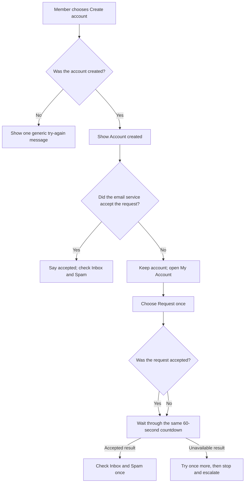

In words: account creation and each later email request are separate results. Accepted does not mean delivered. The same 60-second browser wait follows either resend result. Refreshing the page or changing accounts can reset that display, so it is not a server safety limit.

Until the prerequisites are proven, the current website message may still be wrong. Do not treat it as delivery evidence.

Officer steps after live proof:

1. Ask the member which plain status they see.
2. Do not ask for their email address, password, code, action link, or screenshot.
3. If the status says the request was accepted, ask them to check Inbox and Spam once.
4. If the message is in Spam, ask them to mark it **Not spam**.
5. If the status says the request did not finish, ask them to choose **Check My Account**.
6. If My Account is unavailable, stop. Keep the account and open a redacted incident through [Request a change](./REQUEST_A_CHANGE.md).
7. Use the next steps only after the exact [#153](https://github.com/Run-MPRC/Run-MPRC.github.io/issues/153) website revision is published and verified. Until then, stop and escalate.
8. Ask the member to choose **Request another verification email** once.
9. Ask them to wait through the full visible 60-second countdown.
10. If the page says the request was accepted, ask them to check Inbox and Spam once. Do not promise delivery.
11. If the page says the request was unavailable, wait for the countdown and try once more.
12. If that second request is unavailable, stop. Open a redacted incident through [Request a change](./REQUEST_A_CHANGE.md).
13. Do not refresh to bypass the display, create another account, or keep clicking. Firebase can still throttle a reset browser countdown.

**Expected result:** the page says `Account created` only after creation succeeds. It separately says an email request was accepted or unavailable. My Account disables the request action for 60 visible seconds after either result. The request-result message never repeats the member's address or the provider's error. An unavailable My Account page is a stop-and-escalate result, not proof that the account failed.

**Stop conditions:** a request for private account details, more than one retry after the countdown, a production email test, refreshing to bypass the countdown, a claim that accepted means delivered, or a website revision that cannot be identified.

**Success proof:** exact pull requests and merge commits for #145, #118, and #153; green synthetic tests; exact #118 Rules and Function deployment/readback before the website; a made-up profile-page check; website publication record; separate `runmprc.com` revision check; and dated plain-text review. Provider delivery, sender branding, Spam placement, and a real mailbox remain unproven unless #119 records owner-approved private evidence.

**Undo:** publish and verify one reviewed frontend revert or safe roll-forward. Do not delete or recreate the Firebase account.

**Escalation:** membership lead plus identity/platform owner; add the communications owner for Spam or delivery problems.

Password reset is a separate recovery path. [#155](https://github.com/Run-MPRC/Run-MPRC.github.io/issues/155) tracks one neutral result and one browser wait; it must never reuse the verification flow's `accepted` or `unavailable` account-specific wording. Until its exact website and private provider proofs exist, use only [Password reset request — NOT AVAILABLE YET](./EMERGENCY_AND_RECOVERY.md#password-reset-request--not-available-yet). Do not ask a member which address they entered.

The incoming verification link is another separate step. [#194](https://github.com/Run-MPRC/Run-MPRC.github.io/issues/194) tracks a deliberate-click `/auth/action` source route that removes the private code from the address and never grants membership. It is **NOT LIVE** and must not become Firebase's global handler while reset-password and email-recovery modes are unsupported. After every provider and website prerequisite is proven, use only [Verification link page — SOURCE ONLY, NOT LIVE](./EMERGENCY_AND_RECOVERY.md#verification-link-page--source-only-not-live). Officers never open, copy, or request the member's link or code.

## Checkout adjustment guard — SOURCE ONLY, NOT LIVE

**Purpose:** prevent an unknown discount, tax, or shipping charge from being treated as a valid payment.

**Approver:** treasurer plus platform owner.

**Prerequisites:** source for issue [#102](https://github.com/Run-MPRC/Run-MPRC.github.io/issues/102) has merged, a private Stripe-owner inventory, made-up test payments, and one protected release plan covering all three affected server Functions.

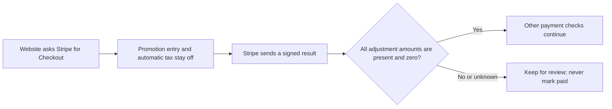

In words: Checkout starts with unapproved adjustments off; the server accepts the money result only when Stripe explicitly reports zero discount, tax, and shipping.

Officer steps:

1. Keep live race and shop checkout unavailable.
2. Do not create a promotion code, tax rule, or shipping rate for the website.
3. Ask the Stripe owner to review older open Sessions privately.
4. Do not put Session links, code values, customer details, screenshots, or provider IDs in GitHub or AI.
5. Wait for separate proof of source merge, Firebase deployment, Stripe readback, and made-up test behavior.

**Expected result:** a complete all-zero Stripe breakdown may continue through the other checks. Unknown or nonzero adjustments stay under review. A failed or expired Session closes locally; it keeps an adjustment or earlier warning, while an ordinary all-zero failure does not create a new warning.

**Stop conditions:** any real payment/customer data, production-mode test, missing private inventory, missing server Function, skipped Firebase work, or request to “temporarily” enable a discount.

**Success proof:** exact pull request/commit, green exact-commit checks, private redacted inventory, three named Function readbacks, Stripe test-mode results, and separate provider-owner confirmation.

**Undo:** use one reviewed three-Function revert or safe roll-forward. Do not edit a payment record, delete a webhook event, or change production Stripe settings by hand.

**Escalation:** treasurer plus platform owner; add security if an adjustment reached paid/fulfilled state.

## Fulfilled order payment-failure conflict — SOURCE ONLY, NOT LIVE

**Purpose:** keep a fulfilled order unchanged while making a signed Stripe failure or expiry visible for review when the existing payment marker does not say paid.

**Approver:** treasurer plus platform/security owner.

**Prerequisites:** issue [#337](https://github.com/Run-MPRC/Run-MPRC.github.io/issues/337) is merged; the exact webhook Function is deployed through a protected release and read back; made-up Stripe test-mode evidence passes; and PAY-003 launch blockers remain clearly open. A merge or green workflow alone is not enough.

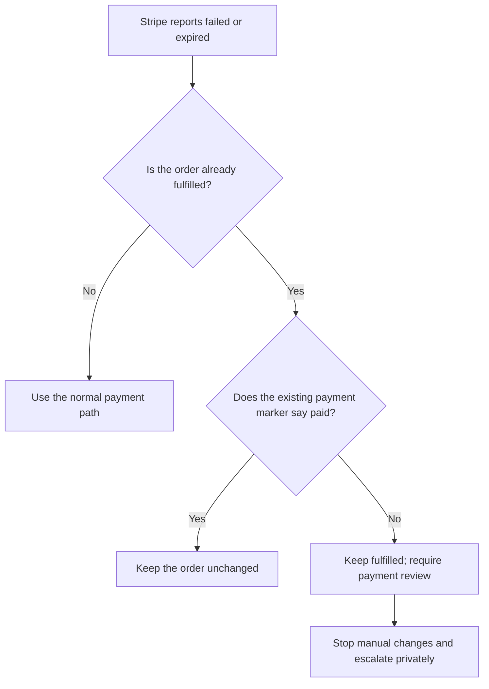

In words: a fulfilled order is never cancelled by this source change. If its existing compatibility marker does not say paid, the backend records one fixed review flag without copying customer details into the review note. That old marker is not separate proof from Stripe.

Steps after every prerequisite is proven:

1. Confirm the release names the exact webhook Function and commit.
2. Confirm the release readback says the Function was deployed.
3. Review only made-up test-mode failure and expiry evidence.
4. Confirm the order remains `fulfilled` in the approved test report.
5. Confirm the report says payment review is required.
6. Confirm the report contains no name, address, email, Session link, or payment secret.
7. If a real conflict is reported, stop all manual record changes.
8. Open a private finance incident with the treasurer and platform/security owner.
9. Do not copy the order, customer, Stripe, or payment details into GitHub, email, screenshots, or an AI tool.

**Expected result:** the signed Event is processed once. Fulfillment remains unchanged. A missing or non-paid compatibility marker produces the fixed `fulfilled_without_verified_payment` review result. A fulfilled order whose existing marker already says paid remains unchanged. This does not prove payment independently or decide collection, refund, shipping, stock, or customer-contact policy.

**Stop conditions:** no exact Function deployment/readback, any production test, a request to edit Firestore or Stripe manually, customer or payment details in a shared artifact, an attempt to cancel fulfillment automatically, or no named treasurer/platform owner.

**Success proof:** exact issue, pull request, merge commit, Node 20 signed synthetic tests, protected Firebase deployment and Function readback, made-up Stripe test-mode delivery, one processed Event, one redacted review audit, and a separate statement that website, provider, production-data, and live behavior were or were not verified.

**Undo:** deploy and read back one reviewed backend revert or safe roll-forward. Do not delete the Event ledger, clear the review flag by hand, change payment state, or alter fulfillment records manually.

**Escalation:** treasurer plus platform/security owner. Add the fulfillment owner only after payment evidence has been reviewed privately. Customer contact requires the separately approved communication path.

## Race signup data guard — SOURCE ONLY, NOT LIVE

**Purpose:** stop malformed or unexpected race and volunteer signup data before anything is saved or sent to Stripe.

**Approver:** event lead plus privacy/platform owner. Add the treasurer when a price path is involved.

**Prerequisites for this source review:** issue [#219](https://github.com/Run-MPRC/Run-MPRC.github.io/issues/219) merged; the exact reviewed commit; and a redacted synthetic test report made with invented events and invented people only. This review makes no Firebase or Stripe call.

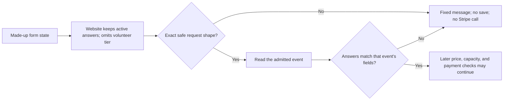

In words: the server checks the request first, then checks its answers against the admitted event; any mismatch stops with no save or Stripe call.

The website source first drops answers from the inactive participant or volunteer form and sends no price tier for a volunteer. The server still repeats every check. This source behavior is not live.

Officer source-review steps:

1. Keep live race and volunteer checkout unavailable.
2. Ask the specialist for the synthetic test report from the exact reviewed commit.
3. Confirm the report uses made-up people and made-up events only.
4. Confirm unknown fields and missing required answers are denied.
5. Confirm wrong answer types and invalid choices are denied.
6. Confirm a denial makes no registration write, rate-limit write, capacity check, token creation, Product call, or Checkout call.
7. Confirm the report contains no submitted names, email addresses, phone numbers, answers, or event field labels.
8. Record the result as source proof only.

**Expected result:** only an exact bounded request whose answers match the admitted event may reach later commerce checks. Every denial uses the same plain message and has no mutable or provider side effect.

**Stop conditions:** real member or runner data, an attempt to call Firebase or Stripe, a detailed error containing submitted data, a missing exact commit, or any side effect on denial.

**Success proof for this source review:** exact pull request and commit, green exact-commit tests, a redacted synthetic report, and a written note that Firebase, Stripe, and live behavior were not tested.

**Undo:** use one reviewed source revert or safe roll-forward. Do not edit a registration, event, payment, rate-limit record, or Stripe object by hand.

**Escalation:** event lead plus privacy/platform owner; add the treasurer and security lead if any denied request caused a write or Stripe call.

**Live-release gate: NOT AVAILABLE YET.** PAY-001B2 must first add immutable field, price, and waiver snapshots and prove compatibility without opening real registrations. A separate protected race-checkout release plan must explicitly name `createCheckoutSession`, the exact commit, an isolated staging project, Stripe test mode, owner approval, provider and Firebase readback, paid/free/volunteer checks, and rollback. No current release issue or workflow supplies that plan. Source review does not authorize deployment.

## Race price format guard — SOURCE ONLY, NOT LIVE

**Purpose:** stop an invalid selected race price before the server creates a registration identifier, a Stripe Product, or a Stripe Checkout Session.

**Approver:** event lead plus treasurer and platform/security owner.

**Prerequisites for source review:** issue [#327](https://github.com/Run-MPRC/Run-MPRC.github.io/issues/327) is merged; the exact reviewed commit is named; and tests use made-up events and people. The private inventory in [#113](https://github.com/Run-MPRC/Run-MPRC.github.io/issues/113) is required before any deployment, data repair, or live approval. This technical format guard is not an approved business price policy.

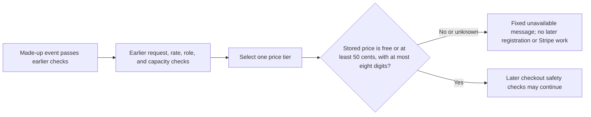

In words: some earlier safety checks may already run, but an invalid selected price must stop before the server allocates a registration identifier or starts Stripe work.

Officer source-review steps:

1. Keep live race checkout unavailable.
2. Ask the specialist for the exact pull request and synthetic test report.
3. Confirm the report uses invented events and people only.
4. Confirm missing, paid prices below 50 cents, negative, fractional, oversized, or otherwise malformed selected prices get one plain unavailable message.
5. Confirm the denial creates no confirmation token, registration identifier, registration write, Stripe Product, or Checkout Session.
6. Confirm the report states that earlier rate, role, membership, or capacity checks may already have run.
7. Record the result as source proof only.

**Expected result:** the helper admits free `0`, or a stored whole-number USD value from 50 cents through Stripe's eight-digit technical limit. These technical limits are not approval to charge any amount. An invalid selected value is unavailable and no raw value appears in a result or log.

**Stop conditions:** real runner data, a real payment, a production test, a request to repair Firestore or Stripe by hand, a missing exact commit, a claim that the source is live, or evidence that a denial allocated a registration identifier or reached Stripe.

**Success proof:** exact pull request and merge commit, green synthetic tests, independent review, and a written statement that the website, Firebase, Stripe, production data, and live behavior were not changed or verified. A future live release needs separate Firebase deployment, Stripe test-mode, and readback proof.

**Undo:** use one reviewed source revert or safe roll-forward. Do not edit an event, registration, Product, Session, or payment record by hand.

**Escalation:** event lead plus treasurer and platform/security owner. Add the privacy owner if any submitted person or event detail appears in output.

## Early-bird cutoff format guard — SOURCE ONLY, NOT LIVE

**Status: NOT AVAILABLE YET**

**Purpose:** treat a missing or malformed stored early-bird cutoff as inactive before later registration or Stripe work.

**Approver:** event lead plus treasurer and platform/security owner.

**Prerequisites for source review:** issue [#341](https://github.com/Run-MPRC/Run-MPRC.github.io/issues/341) must be merged. The exact pull request and merge commit must be named. Tests must use only a made-up event, a made-up runner, and replacements that cannot contact Firebase or Stripe. A Firebase date-and-time value means the database's own `Timestamp` format. Text and an ordinary JavaScript date value do not count. The private inventory in [#113](https://github.com/Run-MPRC/Run-MPRC.github.io/issues/113) is required before deployment or data repair. This check does not approve a cutoff date, timezone, price, membership rule, or eligibility policy.

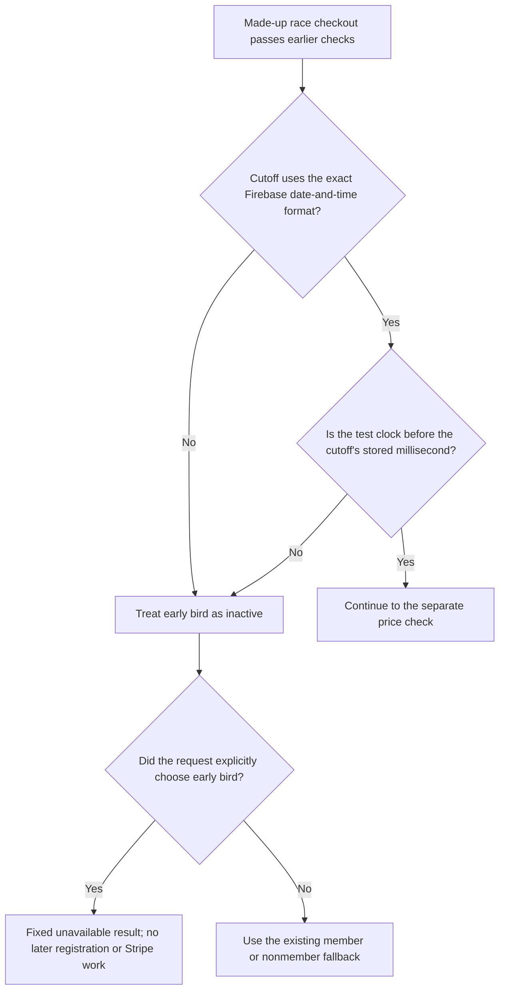

Text alternative: after earlier checkout checks, a missing, malformed, or reached cutoff makes early bird inactive. An explicit early-bird choice receives one fixed unavailable result and stops before later registration or Stripe work. Automatic price selection uses the existing member or nonmember fallback. Only the exact Firebase date-and-time format whose stored millisecond is later than the test clock may continue to the separate price check.

Officer source-review steps:

1. Keep live race checkout unavailable.
2. Ask the platform owner for the exact #341 pull request.
3. Ask the platform owner for the exact merge commit.
4. Ask for the made-up test report from that same commit.
5. Confirm the report uses only a made-up event and runner.
6. Confirm missing, null, text, ordinary JavaScript date, altered, or distinguishably fake cutoff values are inactive.
7. Confirm one valid cutoff is active before its stored millisecond.
8. Confirm that cutoff is inactive at its stored millisecond or later.
9. Confirm malformed values cannot run a method stored inside them.
10. Confirm malformed values cannot expose their stored value in the new fixed result or guard logs.
11. Confirm an explicit early-bird request receives exactly `Early-bird pricing is no longer available`.
12. Confirm that rejection creates no confirmation token.
13. Confirm that rejection creates no registration identifier or registration write.
14. Confirm that rejection creates no Stripe Product or Checkout Session.
15. Confirm earlier checkout, access, capacity, and role checks may already have run.
16. Confirm earlier request-count safety counters may already have been written and are not rolled back.
17. Confirm automatic price selection uses the existing member or nonmember fallback when early bird is inactive.
18. Record source, tests, merge, website publication, `runmprc.com`, Firebase deployment, Stripe state, production data, migration, and live behavior as separate results.

**Expected result:** only the exact current Firebase date-and-time format can make early bird active, and only while the clock is before the cutoff's stored millisecond. Missing or malformed cutoffs are inactive without running stored code or exposing the value. An explicit early-bird choice stops with the fixed unavailable result before later registration or Stripe work. Automatic selection keeps its existing fallback. The separate race price guard still checks the selected amount. This cutoff check does not approve that amount or prove that the complete checkout is safe.

**Stop conditions:** any real runner, event, registration, payment, Firebase record, Stripe object, Stripe call, or production test; a request to repair Firebase or Stripe by hand; a missing exact commit; private or raw cutoff details in shared evidence; a rejection that allocates a registration identifier, writes a registration, or reaches Stripe; deployment before the #113 inventory; or a claim that source, tests, merge, preview, or a green workflow approves the business cutoff or proves live checkout behavior.

**Success proof:** exact #341 pull request and merge commit; recorded old-source failures using made-up values; green cutoff, caller, full server, database-permission, isolated test-database commerce, website, safety, and build checks; independent security, compatibility, and backup-officer reviews; and a written statement that website publication, `runmprc.com`, Firebase, Stripe, production data, migration, and live behavior were not changed or verified. A future live release also needs an owner-approved date, timezone, price, and fallback policy; the private #113 inventory; isolated Stripe test-mode proof; exact Firebase Function deployment and readback; and rollback evidence.

**Undo:** before Firebase deployment, use one reviewed pull request that reverses the change or corrects it safely. After any approved backend deployment, use the protected backend release process and confirm the exact published Function revision. Never undo by changing an event, cutoff, registration, Product, Session, or payment record by hand.

**Escalation:** event lead plus treasurer and platform/security owner. Add the privacy owner if runner or event details appeared. Use the private incident path if a malformed cutoff may have reached registration or Stripe work. Do not copy private details, cutoff values, or provider identifiers into an issue, screenshot, email, message, or AI tool.

No main system map needs to change because this source change adds one failure stop without changing ownership, permissions, storage locations, the Stripe boundary, or website publishing. The small diagram above records the new failure path and the unchanged fallback paths.

## Race capacity format guard — SOURCE ONLY, NOT LIVE

**Status: NOT AVAILABLE YET**

**Purpose:** stop participant checkout when the stored race capacity is malformed instead of silently treating that value as unlimited or changing it through automatic conversion.

**Approver:** event lead plus platform/security owner.

**Prerequisites for source review:** issue [#349](https://github.com/Run-MPRC/Run-MPRC.github.io/issues/349) must be merged. The exact pull request and merge commit must be named. Tests must use only a made-up event, a made-up runner, and replacements that cannot contact Firebase or Stripe. The private inventory in [#113](https://github.com/Run-MPRC/Run-MPRC.github.io/issues/113) is required before deployment or data repair. This check does not approve a capacity number. It also does not reserve a seat or prevent two people from taking the last seat at the same time.

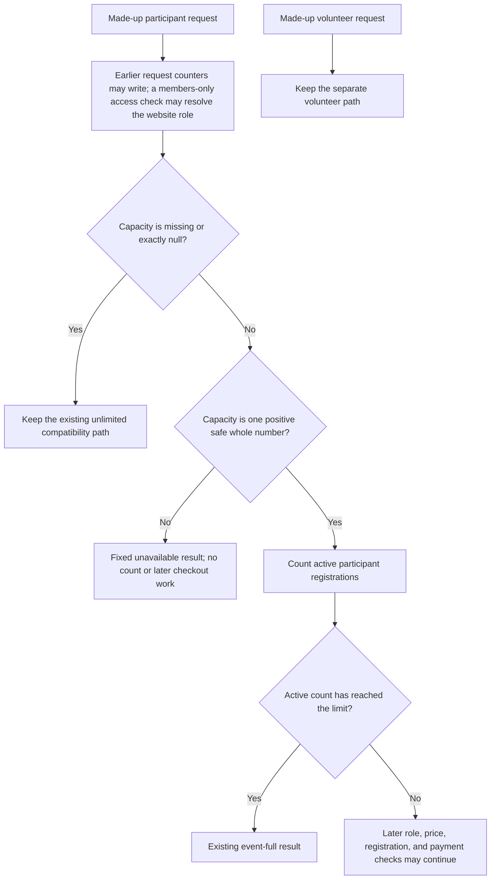

Text alternative: request counters and a members-only website-role check may happen first. A participant event with missing or null capacity then keeps the existing unlimited compatibility path. A positive safe whole number uses the existing active-registration count. Any other stored capacity stops before that count and later participant price work. Volunteer signup keeps its separate path.

Officer source-review steps:

1. Keep live race checkout unavailable.
2. Ask the platform owner for the exact #349 pull request.
3. Ask the platform owner for the exact merge commit.
4. Ask for the made-up test report from that same commit.
5. Confirm the report uses only a made-up event and runner.
6. Confirm missing or exactly null capacity keeps the existing unlimited compatibility path.
7. Confirm one positive safe whole-number capacity is copied without conversion.
8. Confirm zero, negative, decimal, text, false, a computer value that is not a usable number, infinite, or oversized values are invalid.
9. Confirm objects, hidden or inherited values, and values that try to run code when inspected are invalid.
10. Confirm invalid values cannot run a stored method or automatic conversion.
11. Confirm invalid values expose no raw capacity or technical detail in the result or new guard logs.
12. Confirm a malformed public-event capacity receives exactly `Registration is unavailable for this event`.
13. Confirm the two earlier request-count safety checks may already have written counters.
14. Confirm a members-only access check may already have resolved the website role, and that work is not rolled back.
15. Confirm a malformed capacity starts no active-registration count.
16. Confirm a malformed capacity starts no later participant price-role or price work.
17. Confirm a malformed capacity creates no confirmation token, registration identifier, registration write, Stripe Product, or Checkout Session.
18. Confirm a valid configured limit counts once before later participant role and price work.
19. Confirm an active count equal to the limit keeps the existing event-full result.
20. Confirm malformed participant capacity does not change the separate volunteer path.
21. Confirm the report says this check does not prevent simultaneous final-seat oversell.
22. Record source, tests, merge, website publication, `runmprc.com`, Firebase deployment, Stripe state, production data, migration, and live behavior as separate results.

**Expected result:** missing or null capacity keeps the existing unlimited compatibility path. A configured participant limit must be one positive safe whole number. Every malformed value stops with one fixed result before the active-registration count and later participant checkout work. Valid configured limits keep the existing count and event-full behavior. Volunteer signup remains separate. This source check neither approves the number nor reserves a seat.

**Stop conditions:** any real runner, event, capacity, registration, payment, Firebase record, Stripe object, Stripe call, or production test; a request to repair Firebase or Stripe by hand; a missing exact commit; a raw capacity or technical detail in shared evidence; a malformed value that starts a count or later checkout work; deployment before the #113 inventory; or a claim that source, tests, merge, preview, or a green workflow prevents concurrent oversell or proves live checkout behavior.

**Success proof:** exact #349 pull request and merge commit; recorded old-source failures using made-up values; green capacity, caller, full server, database-permission, isolated test-database commerce, website, safety, and build checks; independent security, compatibility, and backup-officer reviews; and a written statement that website publication, `runmprc.com`, Firebase, Stripe, production data, migration, and live behavior were not changed or verified. A future live release also needs the private #113 inventory, an approved capacity value, transactional seat reservations and release, concurrent final-seat proof, isolated Stripe test-mode proof, exact Firebase Function deployment and readback, and rollback evidence.

**Undo:** before Firebase deployment, use one reviewed pull request that reverses the change or corrects it safely. After any approved backend deployment, use the protected backend release process and confirm the exact published Function revision. Never undo by changing an event, capacity, registration, Product, Session, or payment record by hand.

**Escalation:** event lead plus platform/security owner. Add the privacy owner if runner or event details appeared. Add the treasurer if a registration or payment may have continued. Use the private incident path if malformed capacity may have reached registration or Stripe work. Do not copy private details, capacity values, or provider identifiers into an issue, screenshot, email, message, or AI tool.

No main system map needs to change because this source change adds one format stop without changing ownership, permissions, storage locations, the Stripe boundary, or website publishing. The small diagram above records the invalid-capacity stop, the existing count path, and the separate volunteer path.

## Race audience format guard — SOURCE ONLY, NOT LIVE

**Status: NOT AVAILABLE YET**

**Purpose:** stop race and volunteer checkout when an event's stored public or members-only setting is draft, missing, mixed, or malformed.

**Approver:** event lead plus membership lead and platform/security owner.

**Prerequisites for source review:** issue [#351](https://github.com/Run-MPRC/Run-MPRC.github.io/issues/351) must be merged. The exact pull request and merge commit must be named. Tests must use only a made-up event, runner, and website role with replacements that cannot contact Firebase or Stripe. New records use one `visibility` field. Older records without that field use one true-or-false `member_only` field. The private inventory in [#113](https://github.com/Run-MPRC/Run-MPRC.github.io/issues/113) must identify any real older or mixed record before deployment or repair. This check does not choose an event audience. For this guard, a website role proves only that the stored audience gate passed. The unchanged later price-role check remains separate. Neither check proves current or paid club membership.

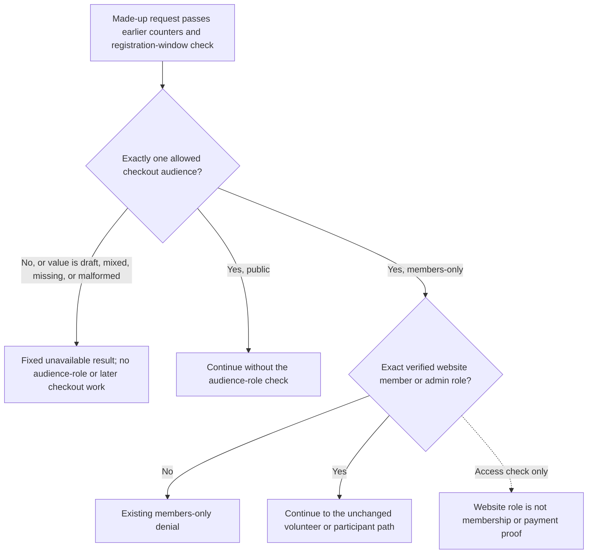

Text alternative: after earlier request counters and the registration-window check, exactly one audience that is allowed for checkout is required. A new public setting or an older false member-only flag continues without the audience-role check. A new members-only setting or an older true flag uses the existing verified website-role check. Draft is a known stored catalog value, but it is unavailable for checkout. Mixed, missing, or malformed formats also stop with one unavailable result. Passing the website-role check does not prove current or paid club membership.

Officer source-review steps:

1. Keep live race and volunteer checkout unavailable.
2. Ask the platform owner for the exact #351 pull request.
3. Ask the platform owner for the exact merge commit.
4. Ask for the made-up test report from that same commit.
5. Confirm the report uses only a made-up event, runner, and website role.
6. Confirm a new-format event that may continue checkout uses only `public` or `members_only`.
7. Confirm an older-format event has no new field and uses one exact true-or-false member-only flag.
8. Confirm a draft audience stops checkout.
9. Confirm both audience fields present stops checkout.
10. Confirm both audience fields missing stops checkout.
11. Confirm unknown, wrong-kind, hidden, inherited, or code-running audience values stop checkout.
12. Confirm rejected values cannot run a stored method or automatic conversion.
13. Confirm rejected values receive exactly `Registration is unavailable for this event`.
14. Confirm the result and new guard logs expose no stored audience value or technical detail.
15. Confirm the two request-count safety checks may already have written counters.
16. Confirm the registration-window check may already have run.
17. Confirm a malformed audience starts no website-role check.
18. Confirm a malformed audience starts no volunteer, capacity, later participant role, price, token, registration write, Stripe Product, or Checkout Session work.
19. Confirm a recognized members-only event keeps the existing website-role check and denial.
20. Confirm a recognized public event starts no audience-role check.
21. Confirm a later participant price-role check remains separate from the audience-role check.
22. Confirm passing the audience-role check proves only the stored audience gate.
23. Confirm the separate later role check keeps the existing member-price behavior without newly approving it.
24. Confirm neither role check proves paid dues, current annual membership, or eligibility beyond its existing narrow result.
25. Confirm valid made-up public and members-only participant paths keep their existing results.
26. Confirm valid made-up public and members-only volunteer paths keep their existing results.
27. Record source, tests, merge, website publication, `runmprc.com`, Firebase deployment, Stripe state, production data, migration, and live behavior as separate results.

**Expected result:** exactly one audience that is allowed for checkout is required. New public and members-only settings and their older true-or-false equivalents keep their current access paths. Draft, mixed, missing, or malformed formats stop with one plain result before the audience-role check or later checkout work. The existing verified website-role check proves only the stored audience gate. The separate later role check keeps its existing member-price result. This source guard changes neither narrow result and proves no paid dues, current annual membership, or broader eligibility.

**Stop conditions:** any real runner, volunteer, event, audience, account, role, membership, registration, payment, Firebase record, Stripe object, Stripe call, or production test; a request to choose or repair an audience in Firebase by hand; a missing exact commit; a stored audience value or technical detail in shared evidence; a malformed audience that starts role or later checkout work; deployment before the private #113 inventory and an owner-approved audience; or a claim that source, tests, merge, preview, or a green workflow proves membership or live checkout behavior.

**Success proof:** exact #351 pull request and merge commit; recorded old-source failures using made-up values; green audience, caller, full server, database-permission, isolated test-database commerce, website, safety, and build checks; independent security, compatibility, identity, and backup-officer reviews; and a written statement that website publication, `runmprc.com`, Firebase, Stripe, production data, migration, and live behavior were not changed or verified. A future live release also needs the private #113 inventory, an owner-approved audience for each real event, the broader RACE/PAY staging proof, isolated Stripe test mode, exact Firebase Function deployment and readback, made-up staged account-role proof, and rollback evidence.

**Undo:** before Firebase deployment, use one reviewed pull request that reverses the change or corrects it safely. After any approved backend deployment, use the protected backend release process and confirm the exact published Function revision. Never undo by changing an event, audience, role, membership, registration, Product, Session, or payment record by hand.

**Escalation:** event lead plus membership lead and platform/security owner. Add the privacy owner if runner or account details appeared. Add the treasurer if membership or payment was inferred. Use the private incident path if a malformed audience may have reached role, registration, or Stripe work. Do not copy private details, stored audience values, provider identifiers, or role evidence into an issue, screenshot, email, message, or AI tool.

No main system map needs to change because this source guard changes no audience owner, role policy, permission, storage location, data movement, Stripe boundary, or website publishing path. The small diagram above records the new failure stop and the current new-format and older-format access paths.

## Merchandise price format guard — SOURCE ONLY, NOT LIVE

**Status: NOT AVAILABLE YET**

**Purpose:** stop an invalid stored product price before the server creates an order identifier, changes a product record, or asks Stripe to create a Product or Checkout Session.

**Approver:** shop lead plus treasurer and platform/security owner.

**Prerequisites:** issue [#339](https://github.com/Run-MPRC/Run-MPRC.github.io/issues/339) must be merged for source review. Use only a made-up active product, a made-up buyer, and test replacements that do not contact Stripe. The private inventory in [#113](https://github.com/Run-MPRC/Run-MPRC.github.io/issues/113) is required before any deployment or catalog repair. This price check does not approve a product, price, tax, shipping rule, return policy, or live sale.

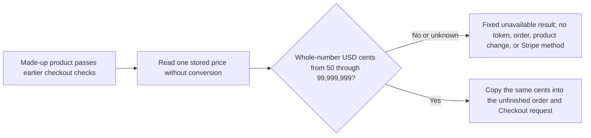

Text alternative: after earlier checkout and request-count checks, an invalid stored price stops before a confirmation token, order, stored Stripe Product link, or Stripe call; a whole-number price inside the stated limits is copied unchanged into both later amount fields.

Officer source-review steps:

1. Keep live Shop checkout unavailable.
2. Ask the platform owner for the exact #339 pull request and merge commit.
3. Ask for the made-up test report from that same commit.
4. Confirm the report uses only a made-up product and buyer.
5. Confirm prices that are missing, zero, below 50 cents, negative, decimal, text, special computer values that are not usable prices, or numbers longer than eight digits receive exactly `This item is unavailable`.
6. Confirm a rejected price creates no confirmation token or order identifier.
7. Confirm a rejected price writes no order or stored Stripe Product link.
8. Confirm a rejected price calls no Stripe Product or Checkout Session method.
9. Confirm 50 cents, one ordinary test price, and 99,999,999 cents are copied unchanged into the made-up order and a test Checkout request that does not contact Stripe.
10. Confirm the report says that earlier request, access, status, and option checks may already have run, and earlier request-count safety counters may already have been written and are not rolled back.
11. Record source change, tests, merge, website publication, `runmprc.com`, Firebase deployment, Stripe state, catalog or order data, migration, and live behavior as separate results.

**Expected result:** malformed stored prices stop safely with one plain result and no later order, stored Stripe Product link, or Stripe call or change. Exact whole-number values from 50 through 99,999,999 pass this source check and are copied without conversion. These technical limits are not approval to charge any amount or proof that Stripe will accept a later request. Complete product and option records, stock control, safe repeat handling, checking Stripe's answer, and matching club orders to Stripe are still unfinished.

**Stop conditions:** any real buyer, product, price, order, payment, Firebase record, Stripe object, Stripe call, production test, or request to repair Firestore or Stripe by hand; a missing exact commit; a raw price or technical detail in output; a rejection that allocates an order identifier or performs a later order or stored Stripe Product-link write; or a claim that source, tests, merge, preview, or a green workflow proves Shop checkout is safe or live.

**Success proof:** exact #339 pull request and merge commit; recorded old-source failures; green price-check tests, full server tests, database-permission tests, isolated test-database commerce tests, website tests, safety checks, and build checks; independent security, compatibility, and backup-officer reviews; and a written statement that website publication, `runmprc.com`, Firebase, Stripe settings, production data, migration, and live behavior were not changed or verified. Any future live release needs a private catalog inventory, approved business policy, isolated Stripe test-mode proof, Firebase deployment and readback, proof that club orders match Stripe, and rollback evidence.

**Undo:** before Firebase deployment, use one reviewed pull request that reverses the change or corrects it safely. After any later approved backend deployment, use the approved backend release process and confirm the exact published Function revision. Never undo by changing a product, price, order, Product, Session, payment, or Stripe setting by hand.

**Escalation:** shop lead plus treasurer and platform/security owner. Add the privacy owner if buyer or order details appeared. Use the private incident path if a malformed price might have created an order or Stripe object. Do not copy private details or Stripe IDs into an issue, screenshot, email, message, or AI tool.

No main system map needs to change because this source change adds one price stop without changing who owns an account, who has permission, where records are stored, which Stripe boundary is used, or how the website is published. The small diagram above records the new failure path and the unchanged valid-price continuation.

## Stored Stripe Product binding containment — SOURCE ONLY, NOT LIVE

**Status: NOT AVAILABLE YET**

**Purpose:** stop a malformed stored Stripe Product link before a paid race or Shop checkout creates a confirmation token, allocates a registration or order identifier, writes the Product link or registration/order record, or calls Stripe. A Product link is the stored text used to point a later Checkout request at one Stripe Product. Earlier access and request-count checks may already have run, and their safety-counter writes are not rolled back.

**Approver:** event lead and shop lead, plus treasurer and platform/security owner.

**Prerequisites:** issue [#353](https://github.com/Run-MPRC/Run-MPRC.github.io/issues/353) must be merged, and the exact reviewed commit must be named. Use only made-up events, items, runners, and buyers with test replacements that make no Firebase or Stripe provider call. Test-only issue [#275](https://github.com/Run-MPRC/Run-MPRC.github.io/issues/275) records the installed Stripe software shape; it is not provider proof. The private inventory in [#113](https://github.com/Run-MPRC/Run-MPRC.github.io/issues/113) is required before deployment, migration, or Product-link repair. Anonymous lazy Product creation remains concurrency-prone, **NOT SAFE**, and **NOT LIVE**.

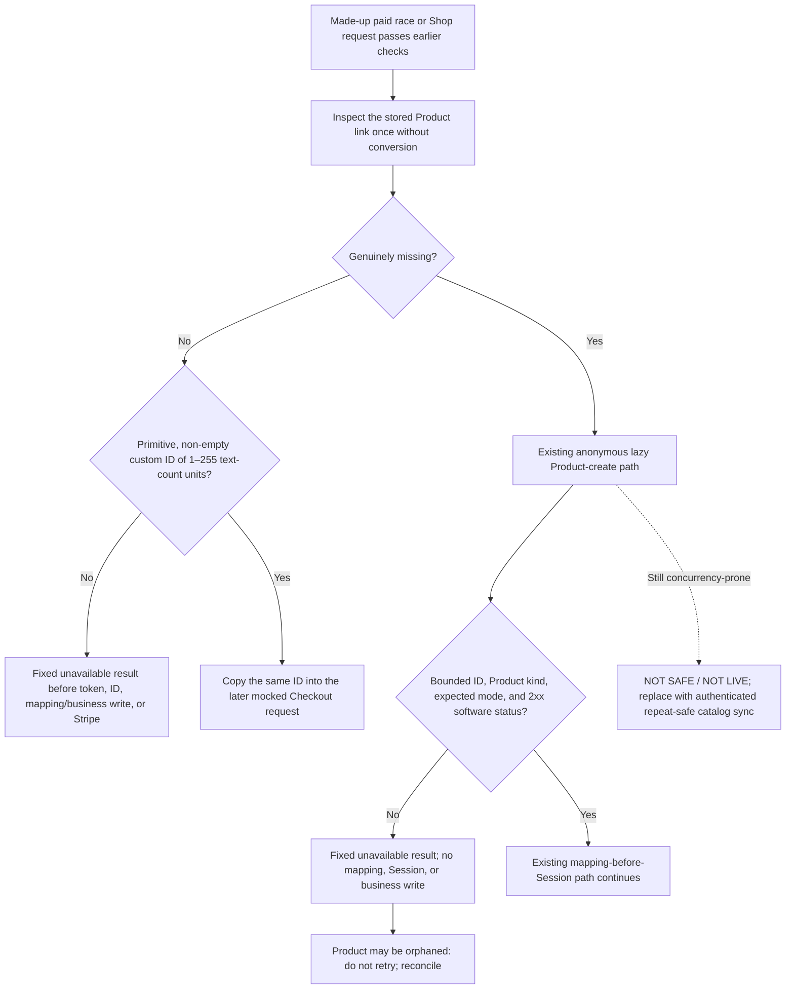

Text alternative: a malformed present Product link stops before a new token, registration/order identifier, Product-link or registration/order write, or Stripe call. Earlier request-count safety-counter writes may already have happened and are not rolled back. Only a genuinely missing field enters the existing anonymous Product-create path. A malformed created result stops after one Product attempt but before the local mapping, Checkout Session, or registration/order write; the Product may be orphaned and must not be retried blindly. Valid custom IDs are copied without prefix assumptions. Anonymous lazy creation remains unsafe and unavailable for live use.

Officer source-review steps:

1. Keep live race registration and Shop checkout unavailable.
2. Ask the platform owner for the exact #353 pull request and merge commit.
3. Ask for the made-up test report from that same commit.
4. Confirm both the paid race and Shop paths use the same narrow Product-link check.
5. Confirm a present link must be a primitive, non-empty string from 1 through 255 JavaScript code units. A code unit is the program's unit for counting text.
6. Confirm the check does not require `prod_`, restrict characters, trim text, or convert another value into text.
7. Confirm missing is different from present `undefined`, `null`, empty, false, zero, boxed, structured, inherited, hidden, accessor-backed, or Proxy values.
8. Confirm every malformed present link returns only the endpoint's plain unavailable result.
9. Confirm a rejected stored link creates no token, registration or order identifier, Product-link write, registration/order write, Stripe access, Product, or Checkout Session.
10. Confirm earlier access and request-count checks may already have run. Their safety-counter writes are not rolled back.
11. Confirm one-character, ordinary custom, and 255-unit made-up IDs are copied once and unchanged into the mocked Checkout request.
12. Confirm a later change to the source record cannot change that copied ID.
13. Confirm only a genuinely missing field reaches the old mocked Product-create path.
14. Confirm a created result is accepted only when it has a bounded custom ID, exact Product kind, the expected test/live setting, and a 200-through-299 status from the pinned installed Stripe software.
15. Confirm a rejected created result makes no Product-link write, Checkout Session, registration write, or order write.
16. Confirm the report records no automatic retry. One Product attempt may already have succeeded and left an orphan that later needs private reconciliation.
17. Confirm one valid made-up created Product keeps this order: Product-link write, then Checkout Session, then registration or order write.
18. Confirm free participant and volunteer paths do not inspect Product links or access Stripe.
19. Confirm #359 separately disables the late-registration Product, Price, and Payment Link path in source and keeps paid late registration **NOT AVAILABLE YET**.
20. Record source, tests, merge, website publication, `runmprc.com`, Firebase deployment, Stripe/provider state, catalog data, migration, and live behavior as separate results.

**Expected result:** a malformed present Product link stops before a new token, registration/order identifier, Product-link or registration/order write, or Stripe call. Earlier access and request-count checks may already have run, and their safety-counter writes are not rolled back. An accepted ID is copied without conversion or re-reading. A malformed created result stops after at most one mocked Product attempt but before any local mapping, Checkout Session, or business-record write. These checks do not prove Stripe origin, account ownership, intended catalog item, metadata binding, active status, approved price, provider delivery, or reconciliation. Missing mappings still enter anonymous lazy Product creation, which remains unsafe because public concurrent requests can create duplicate or orphaned Products.

**Stop conditions:** any real event, item, runner, buyer, registration, order, Firebase record, Stripe object, Product link, payment, provider call, or production test; a request to repair Firestore or Stripe by hand; a missing exact commit; a rejected stored link that allocates a registration/order identifier, writes a Product link or registration/order record, or reaches Stripe; a rejected created result that writes a mapping or creates a Checkout Session; an instruction to retry an unconfirmed Product creation; deployment before #113 and owner-approved mappings; or a claim that source, tests, merge, preview, or green CI makes anonymous Product creation, checkout, or the catalog safe or live. An earlier request-count safety-counter write is expected and is not this stop condition.

**Success proof:** exact #353 pull request and merge commit; recorded old-source failures; green focused race and Shop matrices, full server tests, database-permission tests, isolated test-database commerce tests, website tests, safety checks, and build checks; independent security, compatibility, and backup-officer reviews; and a written statement that website publication, `runmprc.com`, Firebase, Stripe, production data, migration, and live behavior were not changed or verified.

A future live release also needs the completed private #113 inventory and an owner-approved event/item-to-Product disposition; authenticated, repeat-safe catalog management; Product-specific steps for planning, checking before sending, recording the result, handling a lost reply, retrying safely, and matching club records to Stripe; isolated Stripe test-mode proof; protected short-lived Firebase deployment authority under #133; exact Function deployment/readback; rollback; and made-up staged proof. The profile-specific #136 release does not authorize commerce deployment.

**Undo:** before Firebase deployment, use one reviewed pull request that reverses the source change or corrects it safely. After any future approved backend deployment, use the protected commerce release process and verify the exact published Function revision. Never undo by changing an event, item, Product link, registration, order, Session, payment, or Stripe object by hand.

**Escalation:** event lead and shop lead, plus treasurer and platform/security owner. Use the private incident path if a malformed mapping may have reached Stripe or if duplicate or orphaned Products may exist. Do not copy Product links, account details, catalog records, payment data, private provider links, or real customer/member information into an issue, screenshot, email, message, or AI tool.

No main system map needs to change because this source slice adds one failure stop and changes no owner, permission, storage location, provider boundary, or publishing path. The small diagram records the new stop, the possible orphan after a rejected created result, and the unresolved anonymous lazy-create branch.

## Current paid Checkout Session result containment — SOURCE ONLY, NOT LIVE

**Status: NOT AVAILABLE YET**

**Purpose:** stop the current paid race and Shop handlers from saving or returning a malformed or mismatched Stripe Checkout Session result. Prevent a visitor from retrying on the same page when the result is unknown.

**Approver:** event lead and shop lead, plus treasurer and platform/security owner.

**Prerequisites:** issue [#357](https://github.com/Run-MPRC/Run-MPRC.github.io/issues/357) must be merged, and its exact reviewed commit and synthetic test report must be named. Use made-up events, items, runners, and buyers with mocked Stripe responses. Do not call Stripe or Firebase. The private provider and catalog inventory in [#113](https://github.com/Run-MPRC/Run-MPRC.github.io/issues/113), the persistence-first PAY-002C/D work, and protected release evidence remain separate requirements.

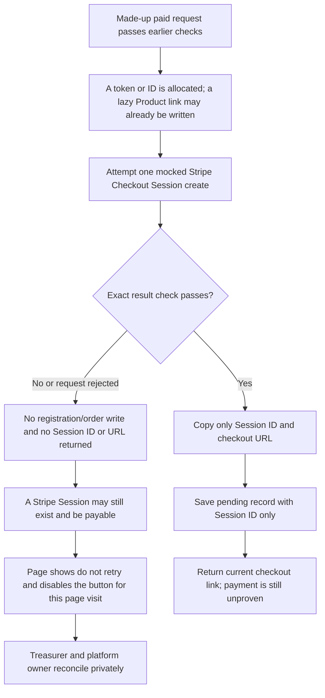

Text alternative: after earlier checks, the current handler may already allocate a token or local identifier and may write a lazily created Product link. It then attempts one mocked Checkout Session. A rejected or mismatched result creates no registration/order record and returns no Session ID or URL, but Stripe may still have created a payable Session. The page therefore says not to retry and disables the button for that page visit. A valid result is copied, the pending record stores only the Session ID, and the URL is returned without being stored or logged. This does not prove payment.

Officer source-review steps:

1. Keep live paid race registration and Shop checkout unavailable.
2. Ask the platform owner for the exact #357 pull request, merge commit, and made-up test report.
3. Confirm both current paid handlers use the same narrow result check immediately after the mocked Stripe call.
4. Confirm the check accepts only the expected test/live setting, amount, USD currency, buyer email, exact closed race or Shop labels, success address, cancel address, open status, unpaid status, and payment mode.
5. Confirm the returned Session ID matches the expected test/live form.
6. Confirm the checkout link is a canonical HTTPS address on exactly `https://checkout.stripe.com`.
7. Treat that address as a temporary source-code safety policy. A Stripe custom checkout domain remains blocked until #113 records the approved private provider setting and a separate reviewed configuration change.
8. Confirm the installed Stripe software attached a successful 200 result marker.
9. Confirm unknown response fields, response identifiers, request keys, account values, headers, bodies, and raw Stripe objects are not copied, opened, logged, stored, or returned.
10. Confirm a malformed result or rejected mocked request returns one fixed private-reconciliation message and creates no registration or order record.
11. Confirm an invalid result may follow earlier request-count counter writes, token or identifier allocation, and a lazily created Product mapping. Those earlier effects are not rolled back.
12. Confirm a Stripe Session may exist even when the result is rejected. Do not retry. Escalate for private reconciliation.
13. Confirm an accepted result stores only the copied Session ID in the pending registration or order. Confirm the checkout URL is never stored or logged.
14. Confirm payment remains unproven until the verified Stripe-event path confirms it.
15. Confirm a Shop product slug is encoded as one opaque cancel-address segment.
16. Confirm free participant and volunteer registration still uses no Stripe Session and is unchanged.
17. Confirm a rejected browser request or a resolved paid result without a usable URL shows the fixed do-not-retry message, keeps the made-up form, ends the busy state, and disables another same-page submit.
18. Confirm a direct repeated handler call on that page makes no second service call.
19. Record source change, tests, merge, website publication, `runmprc.com`, Firebase deployment, Stripe/provider configuration, production data, checkout, payment, and live behavior as separate results.

**Expected result:** malformed or mismatched mocked Session results stop before a registration/order write or browser redirect. Valid results copy only the Session ID and URL; only the ID is stored. A rejected or ambiguous page result becomes terminal for that page visit. This is immediate containment, not complete repeat safety, provider proof, account proof, durable result persistence, or payment proof.

**Stop conditions:** any real event, item, runner, buyer, registration, order, email, phone, address, Stripe object, Session ID, checkout URL, payment, provider call, production record, or live test; a request to inspect a raw provider result; a result error that exposes supplied or technical detail; a rejected result that writes a registration/order or returns an ID/URL; a checkout URL stored or logged; an automatic retry; or a claim that source, tests, merge, preview, or green CI makes checkout safe or live. Reloading, another tab, another device, or a scripted caller can bypass the page-only lock and must not be used as a retry method.

**Success proof:** exact #357 pull request and merge commit; old-source failures followed by green pure result, current-handler, installed-SDK observation, frontend, full server, database-permission, isolated test-database commerce, safety, lint, type, and build checks; independent security, compatibility, accessibility, and backup-officer reviews; and an explicit statement that website publication, `runmprc.com`, Firebase, Stripe/provider settings or calls, production data, checkout, payment, and live behavior were not changed or verified.

**Undo:** before publication, use one reviewed revert or safe roll-forward. After any future approved website or backend publication, use the matching protected release path and verify each affected revision separately. Never undo by changing a registration, order, Product link, Session, payment, Firebase record, or Stripe setting by hand.

**Escalation:** event lead and shop lead, plus treasurer and platform/security owner. Use the private incident path if a live request might have reached Stripe, if an unconfirmed Session might exist, or if a visitor retried. Add the privacy owner if contact, URL, token-shaped, provider, or technical detail appeared. Do not copy any such detail into an issue, screenshot, email, message, or AI tool.

The diagram above records the new current-handler result and page states. Account ownership, permissions, provider topology, data stores, and publishing topology do not change. The full persistence-first, deterministic-key, lost-reply, reconciliation, and approved custom-domain design remains PAY-002C/D and later C4 work.

## Late-registration amount format guard — SOURCE ONLY, NOT LIVE

**Purpose:** stop a missing, malformed, or out-of-range late-registration amount before the server allocates a registration identifier, writes a paid record, or asks Stripe to create a Product, Price, or Payment Link.

**Approver:** event lead plus treasurer and platform/security owner.

**Prerequisites for source review:** issues [#331](https://github.com/Run-MPRC/Run-MPRC.github.io/issues/331) and [#359](https://github.com/Run-MPRC/Run-MPRC.github.io/issues/359) are merged; the exact reviewed commits are named; and tests use only an invented event, invented runner, and mocked Stripe methods. Paid late registration and the complete Admin action system remain **NOT AVAILABLE YET**. The private inventory in [#113](https://github.com/Run-MPRC/Run-MPRC.github.io/issues/113) is required before any deployment or data repair. PAY-001D still owns the complete admin request schema, and full PAY-004C still owns one-off paid Checkout plus cleanup of legacy Payment Links. These guards do not approve a price or make that flow safe.

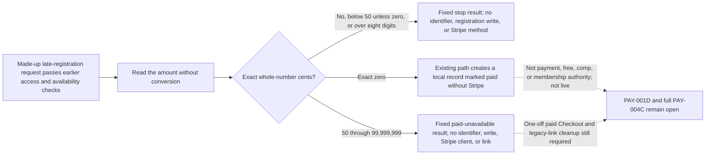

Text alternative: after earlier access and availability checks, malformed amounts stop with the format result. Exact zero still creates a local record marked paid without Stripe; that is not proof of payment or authority to call the registration free or comp. Every valid positive amount now stops with the paid-unavailable result before identifier allocation, writes, Stripe construction, or a link. Paid late registration is unavailable for officer use.

Officer source-review steps:

1. Keep late registration and every Admin registration action marked **NOT AVAILABLE YET**.
2. Ask the platform owner for the exact #331 and #359 pull requests, merge commits, and synthetic test results.
3. Confirm the test uses only an invented event and runner plus mocked Stripe methods.
4. Confirm missing values, text or objects that only look like numbers, values from 1 through 49 cents, fractions, negative values, and values over eight digits receive exactly `Invalid late registration amount`.
5. Confirm a rejected amount is not opened, transformed, printed, or copied into the result. Ask the specialist to keep the detailed object-safety proof in the synthetic test report.
6. Confirm a rejection allocates no registration identifier, writes no event or registration record, and calls no Stripe Product, Price, or Payment Link method.
7. Confirm exact zero still creates the legacy local record marked paid without Stripe. Do not treat that record as payment evidence, call it free or comp without approved authority, or treat any technical boundary as an approved price.
8. Confirm 50 cents, an ordinary positive amount, and 99,999,999 cents now receive exactly `Paid late registration is not available`.
9. Confirm every positive amount stops before registration identifier or token allocation, Firestore writes, Stripe construction, Product/Price/Payment Link calls, URL return, prompts, or logs.
10. Record source change, tests, merge, website publication, `runmprc.com`, Firebase deployment, Stripe/provider state, production data, and live behavior as separate results.

**Expected result:** malformed late-registration amounts fail closed with one plain format result and no registration or provider side effect. Every valid positive amount fails closed with the fixed paid-unavailable result and no identifier, token, write, provider method, URL, prompt, or log. Exact zero retains the legacy local record marked paid without Stripe and is not payment, free, comp, or membership authority. These guards neither approve a business price nor supply one-off Checkout, legacy-link cleanup, capacity, idempotency, reconciliation, authorization, or deployment.

**Stop conditions:** any real runner, event, price, payment, Firebase record, Stripe object, provider call, or production test; a request to enter or repair a value directly in Firestore or Stripe; a missing exact commit; an amount derived from an unapproved browser choice; a rejection that allocates or writes anything; or a claim that source, tests, merge, preview, or a green workflow proves late registration is safe or live.

**Success proof:** exact #331 and #359 pull requests and merge commits; their recorded old-source failures; green synthetic boundary, Functions, Rules, commerce-emulator, frontend, safety, and build checks; independent security, compatibility, and backup-officer reviews; and a written statement that website publication, `runmprc.com`, Firebase, Stripe, provider configuration, production data, and live behavior were not changed or verified. Any future live release needs separate approved price authority, one-off payment design, Firebase deployment/readback, Stripe test-mode proof, reconciliation, and rollback evidence.

**Undo:** before any Firebase deployment, use one reviewed source-and-guide revert or safe roll-forward. After any Firebase Function deployment, use the protected backend release path or a reviewed safe roll-forward, then verify the exact Function revision, provider readback boundary, and made-up test-mode behavior. Record website publication, `runmprc.com`, Stripe/provider state, and production-data state separately. Never undo by changing an event, registration, paid status, Product, Price, Payment Link, or payment record by hand.

**Escalation:** event lead plus treasurer and platform/security owner. Add the privacy owner if runner or event details appeared. Use the private incident path if a malformed request might have created a registration or provider object. Do not copy private details or provider identifiers into an issue, screenshot, email, message, or AI tool.

No system-topology map changes are required because these source slices add stop boundaries and change no account, permission, data-store, provider, or deployment topology. The small diagram above records the current zero and positive branches.

## Paid late-registration containment — SOURCE ONLY, NOT LIVE

**Purpose:** keep officers from creating or sharing a reusable paid late-registration link while the one-off Checkout design is unfinished.

**Approver:** event lead plus treasurer and platform/security owner.

**Prerequisites:** issue [#359](https://github.com/Run-MPRC/Run-MPRC.github.io/issues/359) is merged; the exact reviewed commit and synthetic test report are named; and no website, Firebase, Stripe, or production-data action is mixed into the source review. The private legacy-link inventory remains owner work under [#113](https://github.com/Run-MPRC/Run-MPRC.github.io/issues/113) and full PAY-004C.

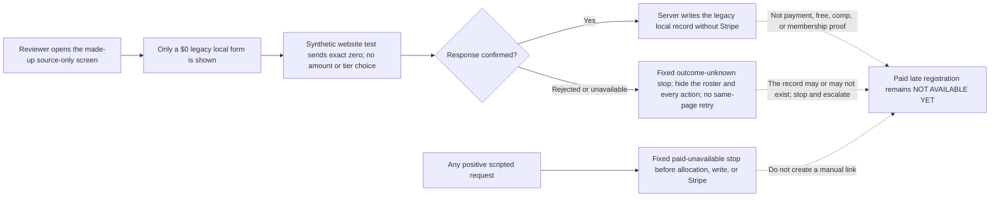

Text alternative: in source review with made-up data, the screen can request only the exact-zero legacy local record. A confirmed response reloads the roster. A rejected or unavailable response does not prove whether the record exists, so the screen shows one fixed stop, hides the roster and every action, and prevents a same-page retry. Any positive scripted request stops before registration allocation or Stripe. This is not a live officer procedure. Officers must not create a manual Stripe link; paid late registration remains unavailable.

Officer source-review steps:

1. Keep paid late registration marked **NOT AVAILABLE YET**.
2. Ask the platform owner for the exact #359 pull request, merge commit, red proof, and green synthetic test report.
3. Confirm the source-only Admin screen says `Late registration — $0 only`.
4. Confirm the form has runner fields only.
5. Confirm there is no amount field, price-tier choice, Payment Link instruction, or copy prompt.
6. Confirm the website request contains exact zero and the compatibility `nonMember` label only.
7. Confirm the server gives every admitted positive amount exactly `Paid late registration is not available`.
8. Confirm that positive stop occurs before identifier/token allocation, Firestore writes, Stripe construction, Product/Price/Payment Link calls, URL return, or logs.
9. Confirm exact zero performs no Stripe call and returns no payment link.
10. Make the made-up exact-zero request reject with an ordinary synthetic detail. Confirm the screen shows only `We could not confirm this $0 late registration. Do not try again on this page. Stop and contact the event lead, treasurer, and platform owner.`
11. Confirm the rejection detail is not inspected, shown, logged, or sent to analytics.
12. Confirm the modal, event and runner details, totals, filters, table, export, and every registration action disappear.
13. Confirm an equivalent same-page rerender does not restore a control, repeat the request, or reload the roster.
14. Treat that rejected result as unknown. The local record may or may not exist. Do not repeat the request, edit Firestore, or call it a confirmed failure.
15. Record source, tests, merge, website publication, `runmprc.com`, Firebase deployment, Stripe/provider state, legacy-link inventory, production data, and live behavior as separate results.

**Expected result:** new source cannot create or reveal a paid reusable late-registration link. The visible screen is $0-only, and positive scripted input fails closed. A rejected exact-zero request becomes one accessible outcome-unknown stop with no rejected detail, stale roster, action control, automatic reload, or same-page retry. The exact-zero record remains a legacy local compatibility result and proves neither payment nor an approved free/comp or membership decision.

**Stop conditions:** any real runner, event, payment, registration, Firebase record, Stripe object, provider call, production test, manual Dashboard link, old link click, or request to paste a link or identifier; any positive request that allocates, writes, calls Stripe, returns a URL, prompts, or logs; a rejected exact-zero request that shows technical detail, keeps stale roster or action controls, reloads automatically, or can be repeated on the same page; a request to check or repair the unknown result directly in Firestore; or any claim that source, tests, merge, preview, or green CI proves the containment is live.

**Success proof:** exact #359 pull request and merge commit; recorded 3-failure server red proof plus the old frontend rejection-detail failure, followed by green positive/zero/malformed server tests and actual-route $0-only, no-prompt, fixed-alert, hostile-rejection, hidden-state, and no-repeat tests; relevant full Functions, frontend, Rules, isolated commerce, safety, lint, type, and build checks; independent security, compatibility, accessibility, and backup-officer reviews; and explicit separate results for website, `runmprc.com`, Firebase, Stripe/provider, legacy links, production data, and live behavior.

**Undo:** before any publication, use one reviewed revert or safe roll-forward. After a future approved website or Firebase publication, use the matching protected release path and verify each exact revision separately. Never undo by creating, enabling, sending, paying, editing, or deleting a Payment Link, registration, payment record, or Firestore document by hand.

**Escalation:** event lead plus treasurer and platform/security owner. Use the private incident path if a reusable link may still be active, was shared, or may have been paid more than once. Add the privacy owner if runner or link details appeared. Do not place any link, runner detail, provider identifier, or payment detail in an issue, screenshot, email, message, or AI tool.

The small diagram records the changed late-registration screen and source data path. Account ownership, permissions, data stores, hosting, and provider topology do not change. Full PAY-004C still owns one-off paid Checkout, legacy-link inventory/deactivation/reconciliation, and protected release.

## Profile permission error

**Status: AUTOMATIC REPAIR NOT LIVE YET**

**Purpose:** help a signed-in member whose profile is missing or cannot be read.

**Approver:** membership lead plus platform/security owner.

**Prerequisites:** a new redacted incident from [Request a change](./REQUEST_A_CHANGE.md), made-up test accounts, an isolated Firebase test project, and an approved release plan. Issues [#118](https://github.com/Run-MPRC/Run-MPRC.github.io/issues/118) and [#105](https://github.com/Run-MPRC/Run-MPRC.github.io/issues/105) are engineering references, not places to add member details.

The planned safe flow is automatic. An officer does not create or edit the member record.

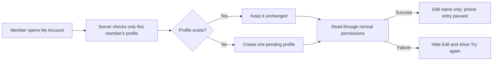

In words: the server preserves an existing profile or creates one pending profile for the signed-in person; editing stays hidden unless the normal read succeeds, and the temporary privacy pause permits name editing only.

Safe officer steps:

1. Ask the member to stop retrying Save.
2. Record the time and the public `/account` page address.
3. Do not record their name, email, phone, login code, or screenshot of profile details.
4. Ask them to sign out.
5. Open a new redacted incident through [Request a change](./REQUEST_A_CHANGE.md).
6. Use #118 only as engineering context. Do not add member incidents or private details to it.
7. Wait for the platform owner to test with a made-up account.
8. Tell the member to retry only after the website, server Function, database permissions, and live behavior are each proven.

**Expected result:** after all release proof is complete, the member sees a profile or a plain temporary-unavailable message. A missing profile is displayed as pending or unverified. The repair does not grant, remove, or change actual access. If displayed profile status and actual access disagree, stop and escalate.

**Stop conditions:** stop if anyone proposes a direct database change, login-account deletion, account recreation, role grant, real-member test, or website-only release before the server Function is live.

**Success proof:** name the merged pull request, website commit, Function deployment, database-permission deployment, made-up staged account test, `runmprc.com` check, and separate live-state check. A green workflow with “skipping Firebase deploy” is not proof.

**Undo:** ask the platform owner to prepare, approve, publish, and verify a reviewed revert or safe roll-forward. Never undo by deleting a member profile or login account.

**Escalation:** membership lead plus identity/security owner. Add the privacy owner if private information appeared. Email landing in spam is a separate delivery problem; do not treat it as proof of this permission failure.

## My Account phone collection pause — SOURCE ONLY, NOT LIVE

**Purpose:** stop My Account from accepting another phone number while the club reviews why it collects phone data, who can access it, how long it is kept, and whether the live Firebase boundary matches the reviewed source.

**Approver:** membership lead plus privacy/platform owner.

**Prerequisites:** reviewed source issues [#178](https://github.com/Run-MPRC/Run-MPRC.github.io/issues/178) and [#197](https://github.com/Run-MPRC/Run-MPRC.github.io/issues/197), a private redacted incident record under #112, the authorized service inventory under #113, made-up test data, and the protected backend-first release path. Do not put a member's number, spam message, screenshot, or provider record in GitHub, email, or AI.

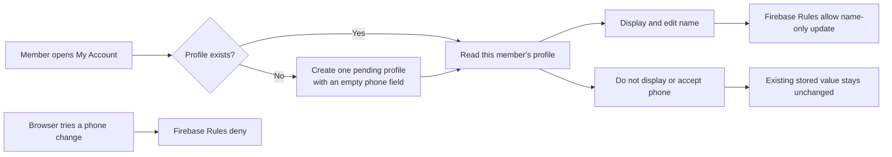

In words: signup or profile recovery creates a missing pending profile without copying a phone from Firebase Auth; My Account shows and edits the member's name, does not display or accept a phone number, and leaves every existing profile unchanged; the reviewed Rules deny a browser phone change.

Officer steps after every prerequisite has proof:

1. Tell members not to add a phone number in My Account.
2. Do not ask whether a member already has a number stored.
3. Do not copy a number or spam message into an issue, email, screenshot, or AI tool.
4. Keep the Google membership form, event registration, shop, and provider review separate; this source change does not alter them.
5. Ask the platform owner to identify the exact merged website, Rules, and profile-Function revisions.
6. Require the reviewed Rules and both profile Functions to deploy and pass readback before the website is published.
7. Ask the platform owner to use one made-up staged Auth account with a synthetic phone and no profile to prove the new pending profile stores no copied phone; then prove name-only editing and browser phone-write denial.
8. Check the exact website revision on `runmprc.com` without opening a real member profile.

**Expected result:** a newly created pending profile has the empty phone field even if the made-up Auth account has a phone. My Account contains no phone value, phone input, or phone browser autocomplete. A name-only change succeeds. A direct non-empty phone change is denied. Existing profiles, membership, payment status, and external forms/providers remain unchanged.

**Stop conditions:** a real member profile, a provider Console change, a database export, a request to inspect or delete stored numbers, skipped/partial Rules or profile-Function deployment, website publication before backend proof, or a proposal to treat spam timing as proof of a breach.

**Success proof:** exact #178 and #197 pull requests and merge commits; green synthetic frontend, Functions, emulator, and Rules tests; exact Rules and profile-Function deployment/readback; later website publication record; separate `runmprc.com` revision check; and a dated made-up phone-free bootstrap/name-only/phone-denial check. Google, Sentry, Stripe, and other provider evidence remains separate and private.

**Undo:** use one reviewed revert or safe roll-forward through the same backend-first gate. Do not restore browser collection or Auth-phone copying until #110 approves its purpose, notice, access, and retention, and #113/#133/#136 prove the intended live boundary.

**Escalation:** membership lead plus privacy/platform owner; use the private incident path under #112 if exposure is suspected.

## Provider-neutral membership authority — SOURCE ONLY, UNUSED

**Status: NOT AVAILABLE YET**

**Purpose:** keep a club membership separate from the account or outside service a person uses, so email, Google, WhatsApp, Strava, and a website role cannot accidentally grant membership, discounts, or officer access.

**Approver:** membership lead plus treasurer and privacy/security owner.

**Prerequisites:** issue [#208](https://github.com/Run-MPRC/Run-MPRC.github.io/issues/208) must be merged for source review. Before any officer or member can use this model, #110 must approve data purposes and retention, a focused #114 child must approve term/payment rules, the identity/admin work must approve who may link or remove a website account, and reviewed Firebase schema, Rules, Functions, deployment, readback, and made-up staged behavior must all have proof. #113 separately owns legacy-source disposition. None of those runtime prerequisites is completed by #208.

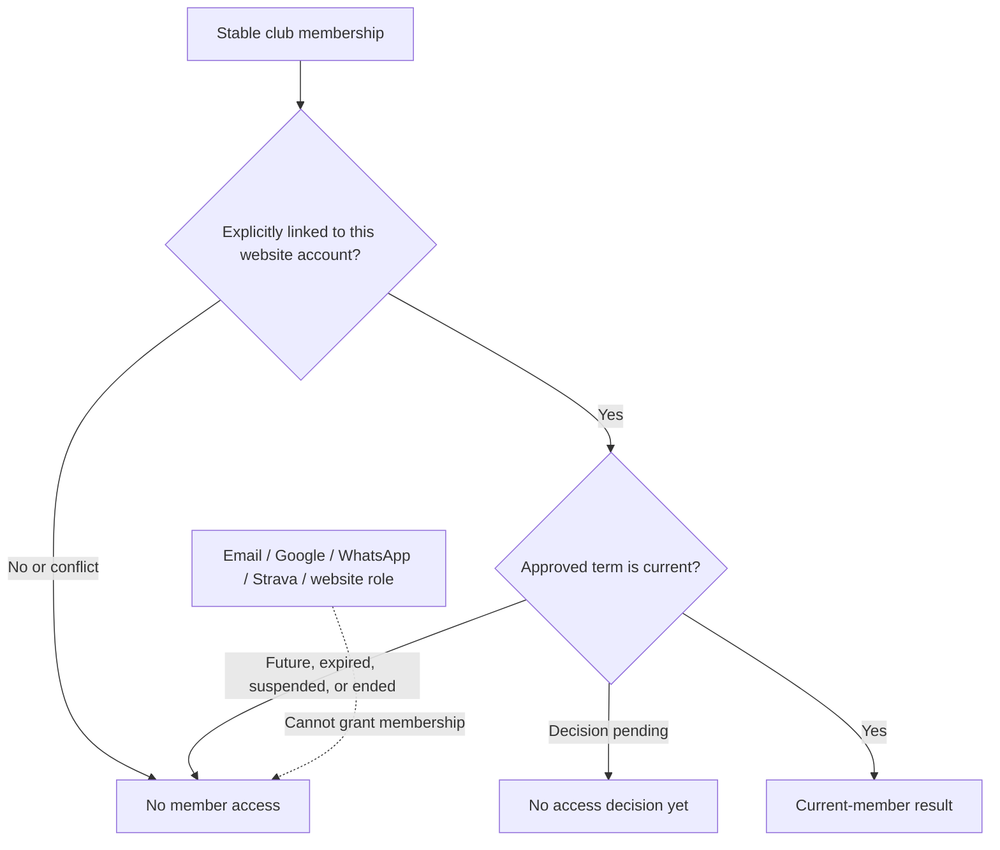

In words: the future system starts with a stable club membership, links it deliberately to one website account, and grants a current-member result only for a complete approved term. Missing, conflicting, undecided, future, expired, suspended, or ended state does not grant access. Email, sign-in method, community channels, and website roles are never proof of membership.

Officer review steps after the source merge:

1. Keep every membership activation, renewal, discount, roster, and outside-channel action marked **NOT AVAILABLE YET**.
2. Do not grant a website role as a workaround.
3. Do not edit a database record as a workaround.
4. Do not match an account by email as a workaround.
5. Do not create a second account as a workaround.
6. Ask the platform owner to show the fixed #208 report using only made-up, non-identifying reference values.
7. Confirm a membership with no account link returns no website entitlement.
8. Confirm an explicit made-up account link still returns `decision pending` until a complete term decision is supplied.
9. Confirm only an approved term inside its explicit start/end range returns the fixed current-member result.
10. Confirm a different account, missing decision, future or expired range, suspension, ending, out-of-date or conflicting update, or changed immediate retry fails closed without exposing an identifier.
11. Confirm a second attempt to link the same or another website account to one membership fails, even when the update is otherwise current.
12. Confirm the report contains no provider call, database write, claim/role change, migration, log, website route, or production record.
13. End the source review without describing the contract as a working membership system or choosing calendar, grace, price, plan, refund, dispute, or retention policy.

**Expected result:** officers can explain the future authority boundary in plain language. The unused source accepts only the narrow synthetic contract, preserves an account-independent membership, and returns a fixed non-identifying result. Current website accounts, roles, dues forms, discounts, and external channels behave exactly as before.

**Stop conditions:** any real member/account/payment/provider data; a request to infer membership from email or role; an unresolved policy choice; a direct Auth, Firestore, claim, or production edit; missing dependency/deployment proof; or a statement that green tests mean member access is live.

**Success proof:** exact #208 issue, pull request, reviewed commit, 46-case focused synthetic report, full repository checks, two independent exact-diff reviews, and a source scan showing the module is not connected to any live Function entry point. Future availability additionally requires separately approved policy, schema, authorization, cross-record account-link uniqueness, durable command replay protection, migration decision, protected Firebase deployment/readback, made-up staging test, website publication, `runmprc.com` verification, and backup-officer walkthrough.

**Undo:** before runtime adoption, revert or safely roll forward only the two unused module/test files and these named documentation sections through a reviewed pull request. There is no production record to repair. After any future adoption, use that child's documented rollback; never undo membership by changing a claim or database record by hand.

**Escalation:** membership lead plus treasurer and privacy/security owner. Add the platform owner for source/deployment evidence and use the private incident path if real data or unintended access is involved.

## My Account membership truth — SOURCE ONLY, NOT LIVE

**Status: NOT AVAILABLE YET**

**Purpose:** stop My Account from presenting website-account details or a legacy website role as proof of current paid club membership.

**Approver:** membership lead plus treasurer and privacy/security owner.

**Prerequisites:** issue [#221](https://github.com/Run-MPRC/Run-MPRC.github.io/issues/221) must be merged for source review. A protected website release, exact revision check on `runmprc.com`, and made-up account checks are also required before describing the wording as live. A future real membership-status display still requires the policy and server-authority work under #114 and #115; #221 does not provide it.

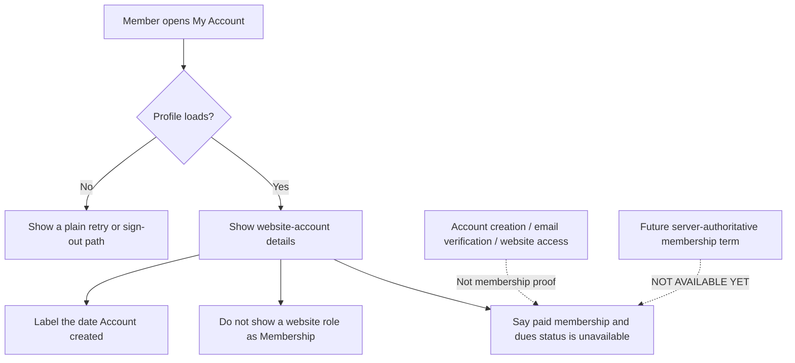

In words: My Account may show account details, including when the account was created, but it does not turn a website role, sign-in, email verification, or website access into proof of paid membership; the page says the real membership and dues status is not available there yet.

Officer review steps after the source merge:

1. Keep membership lookup and membership changes marked **NOT AVAILABLE YET**.
2. Do not infer paid membership from a website role.
3. Do not infer paid membership from account creation.
4. Do not infer paid membership from email verification.
5. Do not infer paid membership from website access.
6. Ask the platform owner for the exact #221 synthetic test report.
7. Confirm the report covers made-up pending, member-role, and admin-role profiles.
8. Confirm `Membership` and `Member since` are absent from each made-up profile view.
9. Confirm the account date is labeled `Account created`.
10. Confirm every made-up profile sees the same unavailable-status notice.
11. Confirm email verification remains a separate account action.
12. Confirm profile recovery, name editing, phone pause, events, Strava, and sign-out are unchanged.
13. Require a protected website publication before calling the wording live.
14. Check the published revision on `runmprc.com` without opening a real member account.

**Expected result:** the source page shows account facts without displaying a legacy role as membership. It uses `Account created`, not `Member since`. Every loaded profile sees one plain notice that paid membership and dues status is not available in My Account and that account creation, email verification, and website use do not prove current club membership. No actual membership, dues, entitlement, payment, role, provider, or member record changes.

**Stop conditions:** a real member account; a request to confirm dues or membership from the page; a manual role or database change; a change to membership policy; a Firebase, payment, Google, WhatsApp, Strava, or other provider action; skipped website publication; or a claim that source, tests, merge, or a green workflow alone proves the wording is live.

**Success proof:** for source completion, record the exact #221 issue, pull request, reviewed commit, focused account tests, full frontend checks, and merge commit. For live availability, separately record the website publication, the published revision, and a dated `runmprc.com` check with made-up accounts. Record Firebase deployment, outside-provider configuration, and production-data changes as **not performed** for this wording-only correction.

**Undo:** before publication, revert or safely roll forward the three #221 source/documentation paths through review. After publication, use the same protected website release path and verify the replacement revision on `runmprc.com`. Never undo by changing a role, membership, payment, or database record.

**Escalation:** membership lead plus treasurer and privacy/security owner. Add the platform owner for source or publication evidence. Use the private incident path if real account or membership data appears.

## Strava callback failure privacy — SOURCE ONLY, NOT LIVE

**Status: NOT AVAILABLE YET**

**Purpose:** give a member one plain next step when a Strava connection fails without showing a provider message, callback detail, or technical error on the page.

**Approver:** membership lead plus platform/security owner.

**Prerequisites:** issue [#242](https://github.com/Run-MPRC/Run-MPRC.github.io/issues/242) must be merged for source review. Calling the wording live also requires a protected website publication and an exact revision check on `runmprc.com`. This source change does not deploy Firebase, contact Strava, change provider settings, use production data, or prove live behavior.

Officer review steps after the source merge:

1. Keep the callback wording marked **NOT AVAILABLE YET**.
2. Ask the platform owner for the exact #242 issue, pull request, merged commit, and synthetic frontend test result.
3. Confirm the tests use only made-up callback values and a mocked exchange result.
4. Confirm a signed-out visitor sees only the fixed sign-in instruction.
5. Confirm a made-up provider query failure shows `We could not connect Strava. Please return to My Account and try again.`
6. Confirm a made-up exchange failure shows the same sentence.
7. Confirm no made-up provider detail appears on the page or in browser console output.
8. Confirm missing-code and failed-security-check results still stop before an exchange.
9. Confirm only a successful exchange returns to My Account, and the visible `Back to account` link still works without an exchange.
10. Confirm the failure sentence is announced as an urgent screen-reader alert.
11. Record website publication, `runmprc.com`, Firebase, Strava, production-data, and live-behavior evidence as separate results.

**Expected result:** the reviewed source uses one fixed, actionable sentence for both a callback query failure and an exchange failure. It does not inspect, display, or log the rejected exchange value. Existing sign-in, missing-code, failed-security-check, success, and Back-to-account behavior stays in place. The separate OAUTH-001C1G child adds source-only cleanup of the current browser entry before callback-specific checks or exchange. It does not erase earlier browser, provider, hosting, or network copies or complete issue #88.

**Stop conditions:** any real member or Strava account; a request for a callback URL, authorization code, state value, provider error, private browser history, or screenshot containing private values; a real provider call; a production Firebase or Strava change; a raw detail in the page or console; or a claim that source, tests, merge, or a green workflow proves the wording is live.

**Success proof:** for source completion, record the exact #242 issue, reviewed pull request, merged commit, intended old-source failures, green synthetic callback tests, relevant full checks, and independent privacy review. For live availability, separately record the approved website publication, the published revision, and a dated `runmprc.com` check that uses no real account or callback value. Record Firebase deployment, Strava/provider configuration, and production-data actions as **not performed** for this frontend-only change.

**Undo:** before publication, use one reviewed frontend revert or safe roll-forward. After publication, use the same protected website release path and verify the replacement revision on `runmprc.com`. Do not undo by changing a member account, callback value, Firebase record, or Strava setting.

**Escalation:** membership lead plus platform/security owner. Add the privacy owner and use the private incident path if any callback or provider detail appeared. Do not copy the detail into an issue, message, screenshot, or AI tool.

For #242 alone, page structure, data movement, permissions, account ownership, and deployment topology were unchanged. The separate #335 procedure and diagram below record the later current-address data-order change.

## Strava callback current-address cleanup — SOURCE ONLY, NOT LIVE

**Status: NOT AVAILABLE YET**

**Purpose:** remove made-up Strava callback address details after `?` or `#` before the page checks the callback or starts a mocked exchange.

**Approver:** membership lead plus platform/security and privacy owners.

**Prerequisites:** issue [#335](https://github.com/Run-MPRC/Run-MPRC.github.io/issues/335) must be merged at an exact reviewed commit. Use no real Strava account, callback, code, state, provider error, or member data. Calling this published also requires a protected website release and an exact revision check on `runmprc.com`. That still does not prove live OAuth behavior. This child does not deploy Firebase, configure Strava, call the provider, or inspect production data.

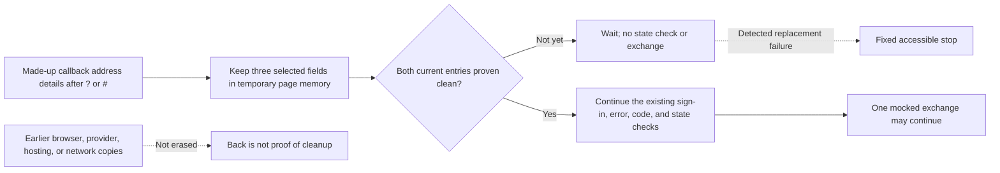

Text alternative: the page first cleans the current browser and page entry. While cleanup is unconfirmed, it waits without checking state or starting an exchange. A detected replacement failure shows the fixed stop. Cleaning the current entry does not erase earlier history or outside copies.

Officer review steps after the source merge:

1. Keep this procedure marked **NOT AVAILABLE YET**.
2. Ask the platform owner for issue #335, the reviewed pull request, the exact merge commit, and synthetic test results.
3. Confirm every test uses only made-up callback values and mocked services.
4. Confirm the current address has no details after `?` or `#` before any callback decision, state check, or exchange.
5. Confirm the page's current route also has no address details after `?` or `#`, or saved callback detail.
6. Confirm unconfirmed cleanup keeps waiting and performs no state check or exchange.
7. Confirm a detected failed or ineffective replacement shows one fixed accessible result.
8. Confirm that failure performs no state check and no exchange.
9. Confirm a second callback loaded into the same page is discarded and does not start another exchange.
10. Confirm a changed signed-in account or service prevents an older browser result from navigating or showing success.
11. Confirm successful cleanup preserves the existing #242 sign-in, provider-error, missing-code, invalid-state, pending, success, and fixed-failure behavior.
12. Confirm made-up values do not appear in the page, console, analytics, screenshots, or saved test artifacts.
13. Record source changed, tests passed, merged, website published, `runmprc.com` revision verified, Firebase deployed, Strava configured, production data changed, and live behavior verified as separate results.

**Expected result:** the current visible callback entry is clean before processing. A cleanup failure stops safely. Callback values exist only temporarily in page memory. A changed account or service prevents an obsolete browser result from navigating or showing success, but it does not cancel an exchange that already reached the server or provider. That outcome may still occur and need separate reconciliation. Earlier browser history, address suggestions or sync, provider records, hosting records, and network records are not erased. Back may return to an earlier page and must never be treated as proof of cleanup.

**Stop conditions:** a request for a real callback, code, state, provider error, screenshot, browser-history view, developer-tools capture, or copied address; callback details remaining after cleanup; processing after cleanup failure; a real provider or Firebase service call; or a claim that source, tests, merge, or green CI proves live behavior.

**Success proof:** for source completion, record issue #335, the reviewed pull request, exact commit, intended old-source failures, green synthetic ordering/failure/lifecycle tests, relevant full checks, and independent privacy/officer review. For publication evidence, separately record the protected website publication and exact `runmprc.com` revision. Those checks do not make this procedure available or prove production OAuth behavior. A separately approved non-production plan may prove staged behavior only.

**Undo:** before publication, use a reviewed revert or corrective pull request. After publication, use the protected website rollback process and verify the restored revision. Never paste, save, inspect, or replay an old callback address during rollback.

**Escalation:** contact the platform/security and privacy owners if callback details may have appeared outside the current clean page. Use the private incident path. Do not copy a value into an issue, message, screenshot, or AI tool.

This child keeps canonical issue #88 open and incomplete. Server-issued one-use state, UID/session binding, expiry and replay protection, App Check handoff, account and scope policy, concurrency, revoke/audit behavior, IAM/encryption, provider configuration, deployment, and live verification remain separate work.

## Strava connection record pairing — SOURCE ONLY, NOT LIVE

**Status: NOT AVAILABLE YET**

**Purpose:** keep the server-only Strava token record and its matching non-secret connection record together. A database failure must save both records or neither record.

**Approver:** membership lead plus platform/security owner. Add the privacy owner if an earlier record may already be mismatched.

**Prerequisites:** issue [#329](https://github.com/Run-MPRC/Run-MPRC.github.io/issues/329) must be merged for source review. Use only a made-up website account, made-up athlete, mocked Strava response, and mocked database. Calling this protection live also requires an approved Firebase Functions deployment and a dated deployment readback. This source change does not contact Strava, inspect or repair production records, change provider settings, or prove live behavior.

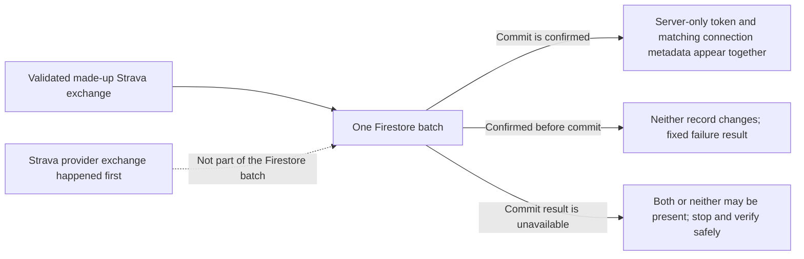

Text alternative: after a made-up Strava response is validated, one Firestore batch saves the hidden token record and matching connection metadata together. A confirmed failure before commit changes neither record. If the commit result is unavailable, both records may be present or neither may be present; one record must never appear alone. Stop and use the normal safe connection check. The earlier Strava provider exchange is outside that local batch.

Officer review steps after the source merge:

1. Keep this protection marked **NOT AVAILABLE YET**.
2. Ask the platform owner for issue #329, the reviewed pull request, the merged commit, and synthetic test results.
3. Confirm every test uses only made-up values and mocked Strava and database results.
4. Confirm a successful mock creates one batch with exactly two paired record writes.
5. Confirm a mocked failure before commit changes neither record.
6. Confirm the same failure preserves an earlier matched pair without replacing only one side.
7. Confirm a mocked lost commit result can leave both records together, never only one.
8. Confirm every persistence failure gives only `Strava authorization could not be completed.`
9. Confirm no token, athlete detail, database path, rejected value, or technical error appears in the result or logs.
10. Confirm an unknown commit result says to stop and use the normal safe connection check. Do not repeat the old code.
11. Confirm the browser never receives or edits the token record.
12. Record source, tests, review, merge, Firebase deployment, provider configuration, production-data action, repair, and live behavior as separate results.

**Expected result:** reviewed source uses one database batch for the two records, so Firestore applies both or neither. A confirmed failure before commit changes neither record. A lost or rejected commit result can leave the caller unsure whether both records changed or neither changed. It must never be described as proof of no change. Every returned persistence failure uses one fixed sentence. The officer stops and asks the platform owner to verify through the normal safe connection surface before any fresh connection start.

This source slice does not make the provider exchange and Firestore one transaction. It does not make a repeated authorization code safe, decide which concurrent connection wins, verify one athlete per website account, approve scopes, repair an earlier mismatch, revoke access, add a durable audit, configure the provider, deploy Firebase, or prove live behavior. Those items remain under issue #88 and the private inventory in #113.

**Stop conditions:** any real member, Strava account, athlete, token, authorization code, provider response, database record, or production data; a request to inspect or repair Firestore manually; a real provider call; a Firebase or Strava setting change; a raw detail in a result or log; an attempt to repeat a failed code; a claim that an unknown commit result proves no change; or a claim that source, tests, merge, preview, or green CI proves this protection is live.

**Success proof:** for source completion, record issue #329, the exact reviewed pull request and merge, the old-source partial-write failure, green synthetic atomicity tests, relevant full checks, and independent security, test, and officer reviews. For live availability, separately record an approved Firebase Functions deployment and a dated exact-revision readback. Record website publication, `runmprc.com`, Strava/provider configuration, production-data access, migration, repair, and live behavior as **not performed** unless separate evidence proves otherwise.

**Undo:** before deployment, use one reviewed Functions-and-guide revert or safe replacement. After any later approved deployment, use the protected Firebase rollback path and verify the replacement revision. Never undo by editing, deleting, copying, or recreating a token or connection record.

**Escalation:** membership lead plus platform/security owner. Add the privacy owner and use the private incident path if a token, athlete detail, provider response, database path, or mismatched record may have appeared. Do not copy that detail into an issue, screenshot, message, email, or AI tool.

## Strava activity failure privacy — SOURCE ONLY, NOT LIVE

**Status: NOT AVAILABLE YET**

**Purpose:** give a signed-in member one plain next step when My Account cannot load Strava activity, without showing a provider or technical error.

**Approver:** membership lead plus platform/security owner.

**Prerequisites:** issue [#250](https://github.com/Run-MPRC/Run-MPRC.github.io/issues/250) must be merged for source review. Calling the sentence live also requires a protected website publication and an exact revision check on `runmprc.com`. This source change does not deploy Firebase, contact Strava, change provider settings, use production data, or prove live behavior.

Officer review steps after the source merge:

1. Keep the activity-failure sentence marked **NOT AVAILABLE YET**.
2. Ask the platform owner for the exact #250 issue, pull request, merged commit, and synthetic frontend test result.
3. Confirm the tests use only a made-up connection, made-up activity, and mocked service results.
4. Confirm a made-up stats rejection shows `We could not load your Strava activity right now. Please try again later.`
5. Confirm the connected athlete remains visible and the loading sentence stops.
6. Confirm no made-up provider detail appears on the page or in browser console output.
7. Confirm a hostile rejected value is not inspected.
8. Confirm a successful made-up result still shows the existing activity and totals.
9. Record website publication, `runmprc.com`, Firebase, Strava, production-data, and live-behavior evidence as separate results.

**Expected result:** the reviewed source uses one fixed retry-later sentence for a stats-load rejection. It does not inspect, display, or log the rejected value. Existing connection display and successful activity projection stay in place. Disconnect failures are separate work and are not made safe by this source slice.

**Stop conditions:** any real member or Strava account; a request for a token, provider error, private account detail, or screenshot containing private values; a real provider call; a production Firebase or Strava change; a raw detail on the page or in the console; or a claim that source, tests, merge, or a green workflow proves the sentence is live.

**Success proof:** for source completion, record the exact #250 issue, reviewed pull request, merged commit, intended old-source failure, green synthetic tests, relevant full checks, and independent privacy review. For live availability, separately record the approved website publication, published revision, and a dated `runmprc.com` check using no real account. Record Firebase deployment, Strava/provider configuration, and production-data actions as **not performed** for this frontend-only change.

**Undo:** before publication, use one reviewed frontend revert or safe roll-forward. After publication, use the same protected website release path and verify the replacement revision on `runmprc.com`. Do not undo by changing a member account, Firebase record, or Strava setting.

**Escalation:** membership lead plus platform/security owner. Add the privacy owner and use the private incident path if any provider or technical detail appeared. Do not copy the detail into an issue, message, screenshot, or AI tool.

No system diagram changes for this source slice because page structure, data movement, permissions, account ownership, and deployment topology are unchanged.

## Strava disconnect failure privacy — SOURCE ONLY, NOT LIVE

**Status: NOT AVAILABLE YET**

**Purpose:** give a signed-in member one safe next step when My Account cannot confirm a Strava disconnect, without showing a provider or technical error or guessing whether the disconnect completed.

**Approver:** membership lead plus platform/security owner.

**Prerequisites:** issue [#252](https://github.com/Run-MPRC/Run-MPRC.github.io/issues/252) must be merged for source review. Calling the sentence live also requires a protected website publication and an exact revision check on `runmprc.com`. This source change does not deploy Firebase, contact Strava, change provider settings, revoke access, use production data, or prove live behavior.

Officer review steps after the source merge:

1. Keep the disconnect-failure sentence marked **NOT AVAILABLE YET**.
2. Ask the platform owner for the exact #252 issue, pull request, merged commit, and synthetic frontend test result.
3. Confirm the tests use only a made-up connection, made-up activity, a mocked confirmation, and a mocked disconnect result.
4. Confirm cancelling the browser question sends no disconnect request and shows no failure.
5. Confirm a made-up rejected request shows `We could not confirm the Strava disconnect. Please refresh this page before trying again.`
6. Confirm the connected athlete and activity remain visible because the actual result is not known.
7. Confirm the Disconnect button becomes available again, but the instructions say to refresh before another attempt.
8. Confirm a later activity-load failure cannot replace the disconnect refresh instruction.
9. Confirm no made-up provider detail appears on the page or in browser console output.
10. Confirm a hostile rejected value is not inspected.
11. Confirm a successful made-up result still changes the page to `Connect Strava` and clears the old activity view.
12. Record website publication, `runmprc.com`, Firebase, Strava, production-data, and live-behavior evidence as separate results.

**Expected result:** the reviewed source uses one fixed refresh-before-retry sentence for a rejected disconnect request. It does not inspect, display, or log the rejected value, and a later activity-load failure cannot replace that higher-priority instruction. It keeps the current connected view because the result is unknown, ends the busy state, and preserves the existing successful disconnect transition. This source slice does not prove that Strava access was revoked or that a retry is safe.

**Stop conditions:** any real member or Strava account; a request for a token, provider error, private account detail, or screenshot containing private values; a real disconnect or provider call; a production Firebase or Strava change; a raw detail on the page or in the console; an immediate retry without first refreshing; or a claim that source, tests, merge, or a green workflow proves the sentence or disconnect behavior is live.

**Success proof:** for source completion, record the exact #252 issue, reviewed pull request, merged commit, intended old-source failures, green synthetic tests, relevant full checks, and independent privacy review. For live availability, separately record the approved website publication, published revision, and a dated `runmprc.com` check using no real account. Record Firebase deployment, Strava/provider configuration, revoke actions, and production-data actions as **not performed** for this frontend-only change.

**Undo:** before publication, use one reviewed frontend revert or safe roll-forward. After publication, use the same protected website release path and verify the replacement revision on `runmprc.com`. Do not undo by disconnecting an account, changing a member record, editing Firebase, or changing a Strava setting.

**Escalation:** membership lead plus platform/security owner. Add the privacy owner and use the private incident path if any provider or technical detail appeared. If a disconnect result is unclear after refresh, stop and escalate; do not repeat the request. Do not copy private detail into an issue, message, screenshot, or AI tool.

No system diagram changes for this source slice because page structure, data movement, permissions, account ownership, and deployment topology are unchanged.

## Strava current-account privacy — SOURCE ONLY, NOT LIVE

**Status: NOT AVAILABLE YET**

**Purpose:** keep one signed-in member from seeing a previous account's Strava name, activity, or totals when the website account or website service setup changes.

**Approver:** membership lead plus platform/security and privacy owners.

**Prerequisites:** issue [#323](https://github.com/Run-MPRC/Run-MPRC.github.io/issues/323) must be merged for source review. Use only made-up accounts, made-up Strava activity, and made-up automated results from the website's data service and Strava. Calling the protection live also requires an approved website publication and an exact revision check on `runmprc.com`. This slice does not deploy Firebase, contact Strava, change provider settings, read or repair production records, or prove live behavior.

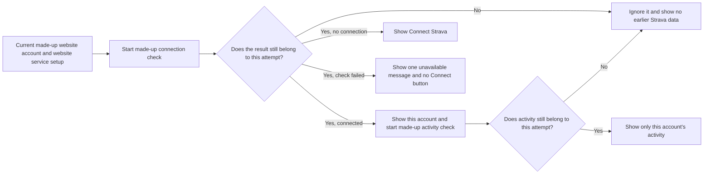

Text alternative: the page may show Strava identity or activity only when a made-up result still belongs to the current website account and current service check. An older result is ignored. A confirmed missing connection shows **Connect Strava**; an unknown connection shows one unavailable message instead.

Officer review steps after the source merge:

1. Keep this protection marked **NOT AVAILABLE YET**.
2. Ask the platform owner for issue #323, the reviewed pull request, the merged commit, and made-up automated website test results.
3. Confirm every test uses made-up account names, made-up activity, and made-up service results.
4. Confirm switching from made-up account A to B removes A's Strava name and activity in the first display for B.
5. Confirm the same immediate clearing happens when the website service setup, data connection, or ready/not-ready state changes.
6. Confirm a late result from A cannot replace B's name, activity, totals, loading state, or failure state.
7. Confirm changing A to B to A starts a new A check; it must not restore the first A result.
8. Confirm a failed current connection check shows `We could not check your Strava connection right now. Please refresh this page and try again.`
9. Confirm that failure shows neither an earlier account nor **Connect Strava**. A failed check does not prove that no Strava connection exists.
10. Confirm **Connect Strava** appears only after the current made-up check returns no connection.
11. Confirm a late disconnect result from A cannot clear B or show an A warning in B.
12. Confirm closing the page and the automated check that runs twice both leave late results unused.
13. Confirm current made-up connection, activity, fixed activity failure, and fixed disconnect failure behavior still works.
14. Confirm no made-up account, activity, outside-service detail, private web address, token-shaped value, or made-up private marker appears in the wrong page state or browser console.
15. Record source, tests, merge, website publication, `runmprc.com`, Firebase, Strava/provider, production-data, and live-behavior evidence as separate results.

**Expected result:** reviewed source gives each website account and website service setup a fresh Strava check. It immediately hides an earlier account, accepts only current connection, activity, and disconnect results, shows one fixed connection-unavailable alert for a failed current check, and shows **Connect Strava** only after a current check confirms no connection. Existing current-account success and fixed activity/disconnect failures remain available.

**Stop conditions:** any real member or Strava account; a request for a name, activity, token, provider error, private account detail, or screenshot containing private values; a production Firebase or Strava call or change; earlier-account data in a later-account display; **Connect Strava** after an unknown check; a raw detail in the page or console; or a claim that source, tests, merge, or a green workflow proves the protection is live.

**Success proof:** for source completion, record issue #323, the exact reviewed pull request and merge, the ten intended old-source failures, green made-up account-switch tests, relevant full checks, and independent privacy and officer reviews. For live availability, separately record the approved website publication, the published revision, and a dated `runmprc.com` check that uses approved test accounts and no private Strava data. Record Firebase deployment, Strava/provider configuration, production-data access, migration, and repair as **not performed** for this website-page change.

**Undo:** before publication, use one reviewed website-and-guide revert or safe replacement. After any later approved publication, use the protected website release path and verify the replacement revision on `runmprc.com`. Never undo by changing a member account, Strava connection, Firebase record, permission, or provider setting.

**Escalation:** membership lead plus platform/security owner. Add the privacy owner and use the private incident path if one account's Strava identity or activity appeared for another account. Do not copy the name, activity, account detail, screenshot, token, or provider error into an issue, message, email, or AI tool.

No full-system map changes are required because services, permissions, and publication paths are unchanged. The diagram above shows which account may appear and when an older result must stop.

## Public Shop catalog failure privacy — SOURCE ONLY, NOT LIVE

**Status: NOT AVAILABLE YET**

**Purpose:** give any public Shop visitor one plain next step when the product list cannot load, without showing a database, provider, account, or technical error.

**Approver:** communications lead plus platform/security owner.

**Prerequisites:** issue [#254](https://github.com/Run-MPRC/Run-MPRC.github.io/issues/254) must be merged for source review. Calling the sentence live also requires a protected website publication and an exact revision check on `runmprc.com/shop`. This source change does not deploy Firebase, change database permissions, contact an outside provider, use production data, or prove live behavior.

Officer review steps after the source merge:

1. Keep the public Shop failure sentence marked **NOT AVAILABLE YET**.
2. Ask the platform owner for the exact #254 issue, pull request, merged commit, and synthetic frontend test result.
3. Confirm the tests use only a made-up catalog, made-up product, and mocked database result.
4. Confirm a made-up catalog rejection shows `We could not load the shop right now. Please try again later.`
5. Confirm the loading sentence stops and the empty-catalog sentence does not appear for that failure.
6. Confirm no made-up database, provider, account, endpoint, or technical detail appears on the page or in browser console output.
7. Confirm a hostile rejected value is not inspected.
8. Confirm a genuinely empty made-up catalog and a successful made-up product still use their existing displays.
9. Record website publication, `runmprc.com/shop`, Firebase, provider, production-data, and live-behavior evidence as separate results.

**Expected result:** the reviewed source uses one fixed retry-later sentence for a catalog rejection. It does not inspect, display, or log the rejected value. The failure is announced as an alert, while successful and genuinely empty catalogs remain unchanged.

**Stop conditions:** any real member, customer, order, or product data; a request for a database or provider error, account detail, private endpoint, or screenshot containing private values; a production Firebase or provider change; a raw detail on the page or in the console; or a claim that source, tests, merge, or a green workflow proves the sentence is live.

**Success proof:** for source completion, record the exact #254 issue, reviewed pull request, merged commit, intended old-source failures, green synthetic tests, relevant full checks, and independent privacy review. For live availability, separately record the approved website publication, published revision, and a dated `runmprc.com/shop` check that uses no private or production data. Record Firebase deployment, database-permission changes, provider configuration, and production-data actions as **not performed** for this frontend-only change.

**Undo:** before publication, use one reviewed frontend revert or safe roll-forward. After publication, use the same protected website release path and verify the replacement revision on `runmprc.com/shop`. Do not undo by changing a product, order, member account, database record, permission, or provider setting.

**Escalation:** communications lead plus platform/security owner. Add the privacy owner and use the private incident path if any database, provider, account, endpoint, or technical detail appeared. Do not copy the detail into an issue, message, screenshot, email, or AI tool.

No system diagram changes for this source slice because page structure, data movement, permissions, account ownership, and deployment topology are unchanged.

## Public product-detail load failure privacy — SOURCE ONLY, NOT LIVE

**Status: NOT AVAILABLE YET**

**Purpose:** give any public Shop visitor one plain next step when a product page cannot load, without showing a database, provider, account, or technical error.

**Approver:** communications lead plus platform/security owner.

**Prerequisites:** issue [#256](https://github.com/Run-MPRC/Run-MPRC.github.io/issues/256) must be merged for source review. Calling the sentence live also requires a protected website publication and an exact revision check on `runmprc.com/shop`. This source change does not deploy Firebase, change database permissions, contact an outside provider, start checkout, use production data, or prove live behavior.

Officer review steps after the source merge:

1. Keep the public product-page failure sentence marked **NOT AVAILABLE YET**.
2. Ask the platform owner for the exact #256 issue, pull request, merged commit, and synthetic frontend test result.
3. Confirm the tests use only a made-up product path, made-up product, and mocked database result.
4. Confirm a made-up product lookup rejection shows `We could not load this product right now. Please try again later.`
5. Confirm the loading sentence stops and the **Back to shop** link remains available.
6. Confirm no made-up database, provider, account, endpoint, or technical detail appears on the page or in browser console output.
7. Confirm a hostile rejected value is not inspected.
8. Confirm a missing made-up product still shows the existing not-found result.
9. Confirm a successful made-up product still shows its title, price, and form without starting checkout.
10. Record website publication, `runmprc.com/shop`, Firebase, provider, production-data, and live-behavior evidence as separate results.

**Expected result:** the reviewed source uses one fixed retry-later sentence for a rejected product lookup. It does not inspect, display, or log the rejected value. The failure is announced as an alert, the Back to shop link remains, and missing or successful product results stay distinct.

**Stop conditions:** any real member, customer, order, or private product data; a request for a database or provider error, account detail, private endpoint, or screenshot containing private values; a checkout attempt; a production Firebase or provider change; a raw detail on the page or in the console; an attempt to force a production failure; or a claim that source, tests, merge, or a green workflow proves the sentence is live.

**Success proof:** for source completion, record the exact #256 issue, reviewed pull request, merged commit, intended old-source failures, green synthetic tests, relevant full checks, and independent privacy review. For live availability, separately record the approved website publication, published revision, and a dated `runmprc.com/shop` revision check without forcing an error or starting checkout. Record Firebase deployment, database-permission changes, provider configuration, and production-data actions as **not performed** for this frontend-only change. The failure path remains synthetic-test evidence unless an approved isolated staging check proves it.

**Undo:** before publication, use one reviewed frontend revert or safe roll-forward. After publication, use the same protected website release path and verify the replacement revision on `runmprc.com/shop`. Do not undo by changing a product, order, member account, database record, permission, or provider setting.

**Escalation:** communications lead plus platform/security owner. Add the privacy owner and use the private incident path if any database, provider, account, endpoint, or technical detail appeared. Do not copy the detail into an issue, message, screenshot, email, or AI tool.

No system diagram changes for this source slice because page structure, data movement, permissions, account ownership, and deployment topology are unchanged.

## Public Shop checkout-start failure privacy — SOURCE ONLY, NOT LIVE

**Status: NOT AVAILABLE YET**

**Purpose:** give a public Shop visitor one plain instruction when the website cannot confirm that checkout started, without adding any failure-supplied contact value, database, Firebase, Stripe, provider, endpoint, or technical error to the page.

**Approver:** communications lead plus platform/security owner. Add the treasurer before any live-commerce review.

**Prerequisites:** issue [#272](https://github.com/Run-MPRC/Run-MPRC.github.io/issues/272) must be merged for source review. Use only a made-up product, made-up buyer, and mocked rejected checkout request. Calling the sentence live also requires a protected website publication and an exact revision check on `runmprc.com/shop` without submitting a form or starting checkout. This source change does not prove whether a rejected request reached Firebase or Stripe, make a repeat safe, contact a provider, deploy Firebase, use production data, or prove live behavior.

```mermaid
flowchart LR
    A["Made-up Shop form"] --> B["Mocked checkout-start request"]
    B -- "Rejected or paid result has no usable URL" --> C["Fixed do-not-retry alert; product and form remain; button stays disabled"]
    B -- "Paid result has a usable URL" --> D["Existing redirect behavior"]
```

In words: a mocked rejection or ambiguous paid result keeps the made-up product and form on the page, shows one fixed do-not-retry alert, and disables another same-page request. A valid paid result keeps the existing redirect path.

Officer review steps after the source merge:

1. Keep the checkout-start failure sentence marked **NOT AVAILABLE YET**.
2. Ask the platform owner for the exact #272 issue, pull request, merged commit, and synthetic frontend test result.
3. Confirm the test uses only a made-up active product, made-up buyer fields, and a mocked checkout Function rejection.
4. Confirm a rejected request or resolved result without a usable URL shows exactly `We could not confirm checkout. Do not try again. Contact MPRC for help.`
5. Confirm the complete sentence is announced as one urgent screen-reader alert.
6. Confirm the made-up product and form values remain visible, no redirect occurs, the existing busy state ends, and the checkout button remains disabled for the rest of that page visit.
7. Confirm no contact value supplied only by the rejection, database, Firebase, Stripe, provider, endpoint, token-shaped, or technical detail appears on the page, in five browser console methods, or in analytics. The made-up buyer values remain only in their existing form inputs.
8. Confirm a hostile rejected value is not inspected and its throwing `message` property is never touched.
9. Confirm the mocked request still receives the same made-up product slug, buyer fields, optional size/color values, and Firebase app exactly once.
10. Confirm a second direct click or handler call on the same page makes no second service call.
11. Confirm a usable paid checkout URL still redirects once, while a resolved missing or malformed URL becomes the same terminal unknown outcome.
12. Record website publication, `runmprc.com/shop`, Firebase, Stripe/provider, checkout, production-data, and live-behavior evidence as separate results.

**Expected result:** the reviewed source discards the complete rejected value and uses one fixed terminal instruction that does not claim checkout definitely failed. The product and entered values remain visible, the busy state ends, and the button stays disabled for that page visit. A resolved paid result without a usable URL is handled the same way. A valid redirect remains unchanged. #357 supersedes #272's earlier retry-enabled display, but it still does not make a reload, another tab/device, or a scripted retry safe.

**Stop conditions:** any real member, customer, order, product, name, email, phone, address, payment, Session, or provider data; a real form submission or checkout attempt; a request for a raw error, private endpoint, token, provider ID, or screenshot containing private values; an attempt to force a production failure; a Firebase, Stripe, or provider change; any repeat service call after the terminal outcome; a reload/tab/device/script retry; or a claim that source, tests, merge, preview, or a green workflow proves the sentence is live or a repeat is safe.

**Success proof:** preserve the #272 source evidence, then add the exact #357 issue, reviewed pull request, merge commit, terminal repeat/missing-URL synthetic tests, relevant full checks, and independent privacy/accessibility review. For live availability, separately record the approved website publication, published revision, and a dated read-only `runmprc.com/shop` revision check without submitting a form or forcing an error. Record Firebase deployment, Stripe/provider configuration or calls, production-data actions, orders, payments, and checkout attempts as **not performed** unless separately approved and proven.

**Undo:** before publication, use one reviewed frontend revert or safe roll-forward. After publication, use the same protected website release path and verify the replacement revision on `runmprc.com/shop`. Do not undo by changing a product, order, member account, database record, payment, permission, Firebase setting, or Stripe/provider setting.

**Escalation:** communications lead plus platform/security owner. Add the treasurer and use the private incident path if a live request may have reached checkout. Add the privacy owner if any failure-supplied contact value or any provider, endpoint, token-shaped, or technical detail appeared outside the retained made-up form inputs. Do not copy the detail into an issue, message, screenshot, email, or AI tool.

## Public Events-list load failure privacy — SOURCE ONLY, NOT LIVE

**Status: NOT AVAILABLE YET**

**Purpose:** give any public Events visitor one plain next step when the event list cannot load, without showing a database, provider, account, endpoint, or technical error.

**Approver:** events lead plus platform/security owner.

**Prerequisites:** issue [#258](https://github.com/Run-MPRC/Run-MPRC.github.io/issues/258) must be merged for source review. Calling the sentence live also requires a protected website publication and an exact revision check on `runmprc.com/events`. This source change does not choose the canonical event source, deploy Firebase, change database permissions, contact an outside provider, change event records, use production data, or prove live behavior.

Officer review steps after the source merge:

1. Keep the public Events-list failure sentence marked **NOT AVAILABLE YET**.
2. Ask the platform owner for the exact #258 issue, pull request, merged commit, and synthetic frontend test result.
3. Confirm the tests use only a made-up event, mocked event subscription, and mocked database reference.
4. Confirm a made-up subscription rejection announces `Error: We could not load events right now. Please try again later.` as an alert.
5. Confirm the loading sentence stops and the genuine empty-events sentence does not appear for that failure.
6. Confirm no made-up database, provider, account, endpoint, or technical detail appears on the page or in browser console output.
7. Confirm a hostile rejected value is not inspected.
8. Confirm a genuinely empty made-up event list and a successful made-up public event still use their existing displays, and that the anonymous page does not select the member event list.
9. Record website publication, `runmprc.com/events`, Firebase, provider, production-data, and live-behavior evidence as separate results.

**Expected result:** the reviewed source uses one fixed retry-later sentence for an Events-list subscription rejection. It announces that result as an alert and does not inspect, display, or log the rejected value. Loading ends, while successful and genuinely empty public event results remain unchanged. This source slice does not approve an event source, schema, importer, or publication workflow; those owner decisions remain under #121.

**Stop conditions:** any real member, registration, event record, private location, discount, payment, waiver, or contact data; a request for a database or provider error, account detail, private endpoint, or screenshot containing private values; a production Firebase or provider change; a raw detail on the page or in the console; an attempt to force a production failure; or a claim that source, tests, merge, preview, or a green workflow proves the sentence is live.

**Success proof:** for source completion, record the exact #258 issue, reviewed pull request, merged commit, intended old-source failures, green synthetic tests, relevant full checks, and independent privacy review. For live availability, separately record the approved website publication, published revision, and a dated `runmprc.com/events` revision check without forcing an error or opening private event data. Record Firebase deployment, database-permission changes, provider configuration, event-record changes, and production-data actions as **not performed** for this frontend-only change. The failure path remains synthetic-test evidence unless an approved isolated staging check proves it.

**Undo:** before publication, use one reviewed frontend revert or safe roll-forward. After publication, use the same protected website release path and verify the replacement revision on `runmprc.com/events`. Do not undo by changing an event, member account, registration, database record, permission, source document, or provider setting.

**Escalation:** events lead plus platform/security owner. Add the privacy owner and use the private incident path if any database, provider, account, endpoint, or technical detail appeared. Do not copy the detail into an issue, message, screenshot, email, or AI tool.

No system diagram changes for this source slice because page structure, data movement, permissions, account ownership, and deployment topology are unchanged.

## Public Events-calendar load failure privacy — SOURCE ONLY, NOT LIVE

**Status: NOT AVAILABLE YET**

**Purpose:** give a visitor to the public Events calendar one plain next step when calendar data cannot load, without showing a database, provider, account, endpoint, or technical error.

**Approver:** events lead plus platform/security owner.

**Prerequisites:** issue [#260](https://github.com/Run-MPRC/Run-MPRC.github.io/issues/260) must be merged for source review. Calling the sentence live also requires a protected website publication and an exact revision check on `runmprc.com/events/calendar`. This source change does not choose the canonical event source, schema, importer, or publication workflow reserved to #121; deploy Firebase; change database permissions; contact an outside provider; change event records; use production data; or prove live behavior. It also leaves the separate commerce-result work in #249 unchanged.

Officer review steps after the source merge:

1. Keep the public Events-calendar failure sentence marked **NOT AVAILABLE YET**.
2. Ask the platform owner for the exact #260 issue, pull request, merged commit, and synthetic frontend test result.
3. Confirm the tests use only a made-up event, mocked event subscription, and mocked database reference.
4. Confirm a made-up subscription rejection shows exactly `We could not load events right now. Please try again later.` in one alert that assistive technology reads immediately as a complete sentence.
5. Confirm the failed state replaces the loading sentence without displaying the calendar grid.
6. Confirm no made-up database, provider, account, endpoint, or technical detail appears on the page or in browser console output.
7. Confirm a hostile rejected value is not inspected.
8. Confirm a genuinely empty made-up subscription still displays the normal empty calendar grid and controls.
9. Confirm a successful made-up public event still appears in the calendar.
10. Confirm the anonymous route selects only the public event list.
11. Confirm the subscription's existing cleanup function is still returned.
12. Record website publication, `runmprc.com/events/calendar`, Firebase, provider, event-record, production-data, and live-behavior evidence as separate results.

**Expected result:** the reviewed source uses one fixed retry-later sentence for an Events-calendar subscription rejection. It announces the complete sentence immediately as one alert and does not inspect, display, or log the rejected value. Loading ends and the failure does not display the calendar grid, while successful and genuinely empty subscriptions keep their existing displays. Public/member list selection and subscription cleanup remain unchanged. This source slice does not approve an event source, schema, importer, or publication workflow; those owner decisions remain under #121. It does not change the separate #249 commerce-result work.

**Stop conditions:** any real member, registration, event record, private location, discount, payment, waiver, or contact data; a request for a database or provider error, account detail, private endpoint, or screenshot containing private values; a production Firebase or provider change; a raw detail on the page or in the console; an attempt to force a production failure; an attempt to decide #121's canonical event-source work or edit #249's commerce-result work in this slice; or a claim that source, tests, merge, preview, or a green workflow proves the sentence is live.

**Success proof:** for source completion, record the exact #260 issue, reviewed pull request, merged commit, intended old-source failures, green synthetic tests, relevant full checks, and independent privacy review. For live availability, separately record the approved website publication, published revision, and a dated `runmprc.com/events/calendar` revision check without forcing an error or opening private event data. Record Firebase deployment, database-permission changes, provider configuration, event-record changes, and production-data actions as **not performed** for this frontend-only change. The failure path remains synthetic-test evidence unless an approved isolated staging check proves it.

**Undo:** before publication, use one reviewed frontend revert or safe roll-forward. After publication, use the same protected website release path and verify the replacement revision on `runmprc.com/events/calendar`. Do not undo by changing an event, member account, registration, database record, permission, source document, or provider setting.

**Escalation:** events lead plus platform/security owner. Add the privacy owner and use the private incident path if any database, provider, account, endpoint, or technical detail appeared. Do not copy the detail into an issue, message, screenshot, email, or AI tool.

No system diagram changes for this source slice because page structure, data movement, permissions, account ownership, and deployment topology are unchanged.

## Public event-detail load failure privacy — SOURCE ONLY, NOT LIVE

**Status: NOT AVAILABLE YET**

**Purpose:** give a visitor to one public event page a plain next step when that event cannot load, without showing a database, provider, account, endpoint, or technical error.

**Approver:** events lead plus platform/security owner.

**Prerequisites:** issue [#262](https://github.com/Run-MPRC/Run-MPRC.github.io/issues/262) must be merged for source review. Calling the sentence live also requires a protected website publication and an exact revision check on the affected `runmprc.com/events/...` page. This source change does not choose the canonical event source, schema, importer, or publication workflow reserved to #121; repair the separate stale or out-of-order event lookup lifecycle; deploy Firebase; change database permissions; contact an outside provider; change event records; use production data; or prove live behavior. It also leaves the separate commerce-result work in #249 unchanged.

Officer review steps after the source merge:

1. Keep the public event-detail failure sentence marked **NOT AVAILABLE YET**.
2. Ask the platform owner for the exact #262 issue, pull request, merged commit, and synthetic frontend test result.
3. Confirm the tests use only a made-up event, mocked event lookup, and mocked database reference.
4. Confirm a made-up lookup rejection shows exactly `We could not load this event right now. Please try again later.` in one alert that assistive technology reads immediately as a complete sentence.
5. Confirm the loading sentence stops and the **Back to events** link remains available.
6. Confirm no made-up database, provider, account, endpoint, or technical detail appears on the page or in browser console output.
7. Confirm a hostile rejected value is not inspected.
8. Confirm a genuinely missing made-up event still shows the existing not-found result.
9. Confirm a successful made-up event still shows its existing public details and registration link.
10. Record website publication, the exact `runmprc.com` event page, Firebase, provider, event-record, production-data, and live-behavior evidence as separate results.

**Expected result:** the reviewed source uses one fixed retry-later sentence for a rejected event lookup. It announces the complete sentence immediately as one alert and does not inspect, display, or log the rejected value. Loading ends and the Back to events link remains, while missing and successful event results keep their existing displays. This source slice does not approve an event source, schema, importer, or publication workflow; those owner decisions remain under #121. It does not repair stale or out-of-order lookups or change the separate #249 commerce-result work.

**Stop conditions:** any real member, registration, event record, private location, discount, payment, waiver, or contact data; a request for a database or provider error, account detail, private endpoint, or screenshot containing private values; a production Firebase or provider change; a raw detail on the page or in the console; an attempt to force a production failure; an attempt to decide #121 work, repair the separate lookup-lifecycle defect, or edit #249 work in this slice; or a claim that source, tests, merge, preview, or a green workflow proves the sentence is live.

**Success proof:** for source completion, record the exact #262 issue, reviewed pull request, merged commit, intended old-source failures, green synthetic tests, relevant full checks, and independent privacy review. For live availability, separately record the approved website publication, published revision, and a dated check of the affected `runmprc.com` event page without forcing an error, starting registration, or opening private event data. Record Firebase deployment, database-permission changes, provider configuration, event-record changes, and production-data actions as **not performed** for this frontend-only change. The failure path remains synthetic-test evidence unless an approved isolated staging check proves it.

**Undo:** before publication, use one reviewed frontend revert or safe roll-forward. After publication, use the same protected website release path and verify the replacement revision on the affected `runmprc.com` event page. Do not undo by changing an event, member account, registration, database record, permission, source document, or provider setting.

**Escalation:** events lead plus platform/security owner. Add the privacy owner and use the private incident path if any database, provider, account, endpoint, or technical detail appeared. Do not copy the detail into an issue, message, screenshot, email, or AI tool. A specialist still owns any stale or out-of-order lookup repair.

No system diagram changes for this source slice because page structure, data movement, permissions, account ownership, and deployment topology are unchanged.

## Public event-detail lookup lifecycle — SOURCE ONLY, NOT LIVE

**Status: NOT AVAILABLE YET**

**Purpose:** keep a public event page tied to the event named in its current address when a visitor moves between event pages, even if an older lookup finishes later.

**Approver:** events lead plus platform/security owner.

**Prerequisites:** issue [#264](https://github.com/Run-MPRC/Run-MPRC.github.io/issues/264) must be merged for source review. Calling the repair live also requires a protected website publication and an exact revision check on the affected `runmprc.com/events/...` pages. This source change does not choose the canonical event source, schema, importer, or publication workflow reserved to #121; deploy Firebase; change database permissions; contact an outside provider; change event records; use production data; or prove live behavior. It leaves the separate commerce-result work in #249 unchanged.

Officer review steps after the source merge:

1. Keep the public event-detail lifecycle repair marked **NOT AVAILABLE YET**.
2. Ask the platform owner for the exact #264 issue, pull request, merged commit, and synthetic frontend test result.
3. Confirm the tests use only made-up event names, mocked event lookups, and a mocked database reference.
4. Confirm moving from a failed made-up event to a successful one clears the old alert and shows the current event.
5. Confirm moving from a missing made-up event to a successful one clears the old not-found result and shows the current event.
6. Confirm an older rejection that finishes after the current event cannot replace that event with an alert.
7. Confirm an older success that finishes after the current event cannot replace its title, registration link, or event-view measurement.
8. Confirm the current event keeps its own title, registration link, and one event-view measurement.
9. Confirm the fixed failure sentence and missing-event result from #262 still work for the current event.
10. Record source change, tests, merge, preview, website publication, the exact `runmprc.com` event pages, Firebase, provider, event-record, production-data, and live-behavior evidence as separate results.

**Expected result:** each changed event address starts a fresh loading state, clears the preceding event and alert, and accepts a result only from its own active lookup. A completed older lookup cannot replace the current event, registration link, alert, or measurement. The current event retains the existing success, missing-event, and fixed failure displays. This source slice does not approve #121 event-source decisions or change #249 commerce-result work.

**Stop conditions:** any real member, registration, event record, private location, discount, payment, waiver, or contact data; a request to force a production race between lookups; a production Firebase or provider change; a stale title, registration link, alert, or event-view measurement after the address changes; an attempt to decide #121 work or edit #249 work in this slice; or a claim that source, tests, merge, preview, or a green workflow proves the repair is live.

**Success proof:** for source completion, record the exact #264 issue, reviewed pull request, merged commit, intended old-source failures, green synthetic lifecycle tests, relevant full checks, and independent integrity review. For live availability, separately record the approved website publication, published revision, and a dated check that navigation between two approved public `runmprc.com` event pages keeps the address, title, and registration link aligned. Record Firebase deployment, database-permission changes, provider configuration, event-record changes, and production-data actions as **not performed** for this frontend-only change. A synthetic timing test proves source behavior; it does not prove production behavior.

**Undo:** before publication, use one reviewed frontend revert or safe roll-forward. After publication, use the same protected website release path and verify the replacement revision on the affected `runmprc.com` event pages. Do not undo by changing an event, member account, registration, database record, permission, source document, or provider setting.

**Escalation:** events lead plus platform/security owner. Add the privacy owner and use the private incident path if a stale page exposed a wrong event, private detail, registration destination, or measurement. Do not copy private details into an issue, message, screenshot, email, or AI tool.

No system diagram changes for this source slice because page structure, data movement, permissions, account ownership, and deployment topology are unchanged.

## Public event-registration page load failure privacy — SOURCE ONLY, NOT LIVE

**Status: NOT AVAILABLE YET**

**Purpose:** give a visitor a plain next step when the public event-registration page cannot load its event, without showing a database, provider, account, endpoint, token-shaped, or technical error.

**Approver:** events lead plus platform/security owner.

**Prerequisites:** issue [#266](https://github.com/Run-MPRC/Run-MPRC.github.io/issues/266) must be merged for source review. Calling the sentence live also requires a protected website publication and an exact revision check on the affected `runmprc.com/events/.../register` page without entering or submitting runner data. This source change does not choose the canonical event source, schema, importer, or publication workflow reserved to #121; repair stale or out-of-order registration-page lookups; change registration, waiver, price, analytics, or checkout behavior; deploy Firebase; change database permissions; contact Stripe or another provider; change event records; use production data; or prove live behavior. It leaves the separate commerce-result work in #249 unchanged.

Officer review steps after the source merge:

1. Keep the public event-registration load-failure sentence marked **NOT AVAILABLE YET**.
2. Ask the platform owner for the exact #266 issue, pull request, merged commit, and synthetic frontend test result.
3. Confirm the tests use only a made-up event, mocked event lookup, mocked database reference, and an empty form.
4. Confirm a made-up lookup rejection shows exactly `We could not load this event right now. Please try again later.` in one alert that assistive technology reads immediately as a complete sentence.
5. Confirm the loading sentence stops and the **Back to events** link remains available.
6. Confirm no made-up database, provider, account, endpoint, token-shaped, or technical detail appears on the page or in browser console output.
7. Confirm a hostile rejected value is not inspected.
8. Confirm a genuinely missing made-up event still shows the existing not-found result.
9. Confirm a successful made-up event still shows the existing registration form and public price without entering data, accepting a waiver, submitting, or starting checkout.
10. Record source change, tests, merge, preview, website publication, the exact `runmprc.com` registration page, Firebase, provider, event-record, production-data, registration/payment, and live-behavior evidence as separate results.

**Expected result:** the reviewed source uses one fixed retry-later sentence for a rejected event lookup on the registration page. It announces the complete sentence immediately as one alert and does not inspect, display, log, or send the rejected value to analytics. Loading ends and the Back to events link remains, while missing and successful event results keep their existing displays. This slice does not submit a registration, accept a waiver, start checkout, repair stale lookups, approve #121 event-source decisions, or change #249 commerce-result work.

**Stop conditions:** any real member, runner, registration, event record, private location, discount, payment, waiver, emergency contact, birth date, phone, or email data; entry or submission of a form; acceptance of a waiver; a request to force a production failure; a Firebase or provider change; a raw detail on the page or in the console; an attempt to repair stale lookups, change submission/analytics/checkout, decide #121 work, or edit #249 work in this slice; or a claim that source, tests, merge, preview, or a green workflow proves the sentence is live.

**Success proof:** for source completion, record the exact #266 issue, reviewed pull request, merged commit, intended old-source failures, green synthetic tests, relevant full checks, and independent privacy review. For live availability, separately record the approved website publication, published revision, and a dated read-only check of the affected `runmprc.com` registration page without entering data, accepting a waiver, submitting, or forcing an error. Record Firebase deployment, database-permission changes, provider configuration, event-record changes, production-data actions, registrations, and payments as **not performed** for this frontend-only change. The failure path remains synthetic-test evidence unless an approved isolated staging check proves it.

**Undo:** before publication, use one reviewed frontend revert or safe roll-forward. After publication, use the same protected website release path and verify the replacement revision on the affected `runmprc.com` registration page. Do not undo by changing an event, member account, registration, database record, permission, source document, provider setting, waiver, or payment.

**Escalation:** events lead plus platform/security owner. Add the privacy owner and use the private incident path if any database, provider, account, endpoint, runner, waiver, registration, or technical detail appeared. Do not copy the detail into an issue, message, screenshot, email, or AI tool. A specialist still owns any stale or out-of-order lookup repair.

No system diagram changes for this source slice because page structure, data movement, permissions, account ownership, and deployment topology are unchanged.

## Public event-registration lookup lifecycle — SOURCE ONLY, NOT LIVE

**Status: NOT AVAILABLE YET**

**Purpose:** keep a public event-registration page tied to the event named in its current address when a visitor moves between registration pages, even if an older event lookup finishes later.

**Approver:** events lead plus platform/security owner.

**Prerequisites:** issue [#268](https://github.com/Run-MPRC/Run-MPRC.github.io/issues/268) must be merged for source review. Calling the repair live also requires a protected website publication and an exact revision check on the affected `runmprc.com/events/.../register` pages without entering runner data, accepting a waiver, submitting, or starting checkout. This source change preserves #266 error privacy; it does not choose the canonical event source, schema, importer, or publication workflow reserved to #121; reset runner answers, custom answers, signup type, or waiver state when the address changes; bind a pending submission to its starting address; change registration, price, analytics, or checkout behavior; deploy Firebase; change database permissions; contact Stripe or another provider; change event records; use production data; or prove live behavior. It leaves the separate commerce-result work in #249 unchanged.

Officer review steps after the source merge:

1. Keep the public event-registration lookup-lifecycle repair marked **NOT AVAILABLE YET**.
2. Ask the platform owner for the exact #268 issue, pull request, merged commit, and synthetic frontend test result.
3. Confirm the tests use only made-up event names, mocked event lookups, a mocked database reference, and empty forms.
4. Confirm moving from a failed made-up registration page to a successful one clears the old alert and shows the current event form and **Back to event** link.
5. Confirm moving from a missing made-up event to a successful one clears the old not-found result and shows the current event form.
6. Confirm an older rejection that finishes after the current registration event cannot replace that event with an alert.
7. Confirm an older success that finishes after the current registration event cannot replace its heading, price, waiver text, form, or **Back to event** link.
8. Confirm the fixed failure sentence and missing-event result from #266 still work for the current address.
9. Confirm the review enters no runner, contact, birth-date, emergency-contact, waiver, registration, payment, or real event data and makes no form submission or checkout call.
10. Record source change, tests, merge, preview, website publication, the exact `runmprc.com` registration pages, Firebase, provider, event-record, production-data, registration/payment, and live-behavior evidence as separate results.

**Expected result:** each changed registration address starts a fresh loading state, clears the preceding event and load error, and accepts an event result only from its own active lookup. A completed older lookup cannot replace the current heading, price, waiver text, form, link, not-found result, or fixed failure alert. Current success, missing-event, and #266 failure displays remain unchanged. This source slice does not enter or reset form values, accept a waiver, submit a registration, start checkout, approve #121 event-source decisions, or change #249 commerce-result work.

**Stop conditions:** any real member, runner, registration, event record, private location, discount, payment, waiver, emergency contact, birth date, phone, or email data; entry or submission of a form; acceptance of a waiver; a request to force a production race between lookups; a production Firebase or provider change; a stale heading, price, waiver, form, link, not-found result, or alert after the address changes; an attempt to expand into route-scoped form/waiver/submission state, decide #121 work, or edit #249 work in this slice; or a claim that source, tests, merge, preview, or a green workflow proves the repair is live.

**Success proof:** for source completion, record the exact #268 issue, reviewed pull request, merged commit, intended old-source failures, green synthetic lifecycle tests, relevant full checks, and independent integrity/privacy review. For live availability, separately record the approved website publication, published revision, and a dated read-only check that navigation between two approved public `runmprc.com` registration addresses keeps the address, event heading, and **Back to event** link aligned without entering data, accepting a waiver, submitting, or starting checkout. Record Firebase deployment, database-permission changes, provider configuration, event-record changes, production-data actions, registrations, and payments as **not performed** for this frontend-only change. A synthetic timing test proves source behavior; it does not prove production behavior.

**Undo:** before publication, use one reviewed frontend revert or safe roll-forward. After publication, use the same protected website release path and verify the replacement revision on the affected `runmprc.com` registration pages. Do not undo by changing an event, member account, registration, database record, permission, source document, provider setting, waiver, or payment.

**Escalation:** events lead plus platform/security owner. Add the privacy owner and use the private incident path if a stale registration page exposed the wrong event, price, waiver, form, destination, runner detail, or technical detail. Do not copy private details into an issue, message, screenshot, email, or AI tool. Route-scoped form/waiver state and pending submission settlement remain separate specialist work.

No system diagram changes for this source slice because page structure, data movement, permissions, account ownership, and deployment topology are unchanged.

## Public event-registration submission failure privacy — SOURCE ONLY, NOT LIVE

**Status: NOT AVAILABLE YET**

**Purpose:** give a public event-registration visitor one plain instruction when the website cannot confirm a submission, without adding any failure-supplied runner, contact, Firebase, Stripe, provider, endpoint, token-shaped, or technical detail to the page or analytics.

**Approver:** events lead plus platform/security owner. Add the treasurer before any live paid-registration review.

**Prerequisites:** issue [#274](https://github.com/Run-MPRC/Run-MPRC.github.io/issues/274) must be merged for source review. Use only a made-up event, made-up runner and contact values, a made-up waiver, and a mocked rejected submission. Calling the sentence live also requires a protected website publication and an exact revision check on the affected `runmprc.com/events/.../register` page without entering data, accepting a waiver, submitting, or starting checkout. This source change does not prove whether a rejected request reached Firebase or Stripe, make a repeat safe, contact a provider, deploy Firebase, use production data, or prove live behavior.

```mermaid
flowchart LR
    A["Made-up registration form"] --> B["Mocked submission request"]
    B -- "Rejected or paid result has no usable URL" --> C["Fixed do-not-retry alert; event and form remain; button stays disabled"]
    B -- "Resolved free or paid result is usable" --> D["Existing success path"]
```

In words: a mocked rejection or ambiguous paid result keeps the made-up event, form, answers, and waiver selection on the page, shows one fixed do-not-retry alert, and disables another same-page submission. Successful free registration and a valid paid checkout link keep their existing paths.

Officer review steps after the source merge:

1. Keep the submission-failure sentence marked **NOT AVAILABLE YET**.
2. Ask the platform owner for the exact #274 issue, pull request, merged commit, and synthetic frontend test result.
3. Confirm the tests use only a made-up public event, made-up runner and emergency-contact fields, a made-up waiver, and a mocked checkout Function rejection.
4. Confirm a rejected submission or resolved paid result without a usable URL shows exactly `We could not confirm your registration. Do not try again. Contact MPRC for help.`
5. Confirm the complete sentence is announced as one urgent screen-reader alert.
6. Confirm the made-up event, route, form values, and waiver selection remain visible, no navigation or redirect occurs, the busy state ends, and the submit button remains disabled for that page visit.
7. Confirm no contact value supplied only by the rejection, Firebase, Stripe, provider, endpoint, token-shaped, or technical detail appears on the page, in five browser console methods, or in analytics. The made-up runner and contact values remain only in their existing form inputs and mocked request.
8. Confirm a hostile rejected value is not inspected and its throwing `message` property is never touched.
9. Confirm the mocked request still receives the same Firebase app and made-up event, runner, custom-field, signup-type, waiver, and price-tier projection exactly once.
10. Confirm the existing submit-attempt analytics marker remains and the registration-error marker contains only the made-up public event slug, with no rejected value or property.
11. Confirm a second direct submit or handler call on the same page makes no second service call.
12. Confirm free registration still navigates once, a usable paid URL still redirects once, and a resolved missing or malformed paid URL becomes the same terminal unknown outcome.
13. Record source change, tests, merge, preview, website publication, the exact `runmprc.com` registration page, Firebase, Stripe/provider, registration/checkout, production-data, and live-behavior evidence as separate results.

**Expected result:** the reviewed source discards the complete rejected value and uses one fixed terminal instruction that does not claim registration definitely failed. The event and entered values remain visible, the busy state ends, and the button stays disabled for that page visit. A resolved paid result without a usable URL is handled the same way. Successful free navigation and a valid paid redirect remain unchanged. #357 supersedes #274's earlier retry-enabled display, but it does not make a reload, another tab/device, or a scripted retry safe.

**Stop conditions:** any real member, runner, registration, private event record, name, email, phone, birth date, emergency contact, waiver, payment, Session, or provider data used to exercise the synthetic failure review; entry or submission of a real form; acceptance of a real waiver; a real registration or checkout attempt; a request for a raw error, private endpoint, token, provider ID, or screenshot containing private values; an attempt to force a production failure; a Firebase, Stripe, provider, event-record, or analytics change; any repeat service call after the terminal outcome; a reload/tab/device/script retry; or a claim that source, tests, merge, preview, or a green workflow proves the sentence is live or a repeat is safe. A later approved revision check may open the already-public event page read-only but must not enter data, accept a waiver, submit, start checkout, or force a failure.

**Success proof:** preserve the #274 source evidence, then add the exact #357 issue, reviewed pull request, merge commit, terminal repeat/missing-URL synthetic tests, relevant full checks, and independent privacy/accessibility review. For live availability, separately record the approved website publication, published revision, and a dated read-only `runmprc.com` registration-page revision check without entering data, accepting a waiver, submitting, or forcing an error. Record Firebase deployment, Stripe/provider configuration or calls, event-record and production-data actions, registrations, payments, and checkout attempts as **not performed** unless separately approved and proven.

**Undo:** before publication, use one reviewed frontend revert or safe roll-forward. After publication, use the same protected website release path and verify the replacement revision on the affected `runmprc.com` registration page. Do not undo by changing an event, registration, member account, database record, payment, waiver, permission, Firebase setting, analytics setting, or Stripe/provider setting.

**Escalation:** events lead plus platform/security owner. Add the treasurer and use the private incident path if a live request may have reached registration or checkout. Add the privacy owner if any failure-supplied runner/contact value or any Firebase, Stripe, provider, endpoint, token-shaped, or technical detail appeared outside the retained made-up form inputs and mocked request. Do not copy the detail into an issue, message, screenshot, email, or AI tool.

No system-topology diagram changes for this source slice; the state-flow diagram above records the page's failure-display change, while data movement, permissions, account ownership, and deployment topology remain unchanged.

## Registration confirmation route privacy — SOURCE ONLY, NOT LIVE

**Status: NOT AVAILABLE YET**

**Purpose:** keep one runner's confirmation details tied to the private confirmation address that requested them. Moving to another address must hide the earlier name, email, registration ID, and confirmation result at once.

**Approver:** events lead plus platform/security and privacy owners. Add the treasurer before any future live review involving a paid registration.

**Prerequisites:** issue [#319](https://github.com/Run-MPRC/Run-MPRC.github.io/issues/319) must be merged for source review. Use only made-up events, runners, registration IDs, tokens, and mocked services. Do not open, copy, request, or test a real confirmation address. A later claim that the source was published requires a protected website publication and an exact `runmprc.com` revision check. Neither check authorizes a real confirmation-address test or proves the private route works in production.

```mermaid
flowchart TD
    A["Made-up confirmation address A"] --> B["Mocked lookup A starts"]
    B --> C["Move to made-up address B"]
    C --> D["Hide A details at once; clear A timer"]
    D --> E{"Which mocked result finishes?"}
    E -- "Old A" --> F["Ignore it; no display or analytics-wrapper call"]
    E -- "Current B is pending" --> G["Keep waiting; show no runner details"]
    E -- "Current B is paid or complimentary (comp)" --> H["Show B confirmation; call disabled wrapper once"]
```

Text alternative: changing from made-up confirmation address A to B immediately hides A; only B may keep waiting or show its own current paid or complimentary (`comp`) result and call the disabled analytics wrapper once, while every late A result and timer does nothing and no analytics event is sent or stored.

Officer source-review steps:

1. Keep the confirmation-route repair marked **NOT AVAILABLE YET**.
2. Ask the platform owner for the exact #319 issue, pull request, merged commit, and synthetic frontend test result.
3. Confirm every test uses made-up runner details, made-up route values, and a mocked lookup.
4. Confirm no test opens a real confirmation address or contacts a real Firebase, Stripe, analytics, or other outside service.
5. Confirm moving from made-up address A to unresolved address B hides A's name, email, registration ID, and confirmed heading before B finishes.
6. Confirm a pending B result keeps the waiting page and shows no runner details.
7. Confirm a late A success cannot replace B or call the analytics wrapper.
8. Confirm a late A failure is ignored without reading its private or hostile detail.
9. Confirm A's old timer is cleared and cannot start another lookup after the move to B.
10. Confirm a readiness, Firebase app, service, route, or page-close change makes the older work inactive and clears its timer.
11. Confirm returning from A to B and back to A starts fresh work instead of reusing the first A result.
12. Confirm only the current paid or comp result calls the disabled, provider-free analytics wrapper once.
13. Confirm the wrapper sends and stores no analytics event.
14. Confirm current pending, timeout, denied, error, not-ready, and missing-address results keep their existing plain displays.
15. Record source, tests, merge, website publication, `runmprc.com` revision, Firebase deployment, provider configuration, production-data action, and live behavior as separate results.

**Expected result:** only the current made-up address may decide what the page shows. An address or service change hides the preceding result immediately. Current pending work shows no runner details. Old results, failures, and timers do nothing. The current paid or comp result keeps the existing first name, email, and registration ID. Its source calls the disabled, provider-free analytics wrapper once. No analytics event is sent or stored. This changes reviewed source and tests only.

**Stop conditions:** any real runner, event, registration, email, token, payment, confirmation address, screenshot, provider value, or production record; a request to paste a private address or detail into GitHub, email, chat, or an AI tool; a production Firebase, Stripe, analytics, or other provider action; an attempt to force a live failure or timing race; an old result appearing under a new address; a claim that the disabled wrapper sent or stored an event; or a claim that source, tests, merge, preview, or a green workflow proves the change is live.

**Success proof:** for source completion, record the exact #319 issue, reviewed pull request, merged commit, intended old-source failures, green synthetic route and timer tests, relevant full checks, and independent privacy, lifecycle, and officer reviews. The synthetic analytics mock may prove one current wrapper call, while source review proves the wrapper is disabled and provider-free; neither result is an analytics event or provider receipt. For release evidence, separately record the protected website publication and exact `runmprc.com` revision without opening a real confirmation address. Record Firebase deployment, Stripe or other provider configuration, analytics transmission or storage, real registration access, production-data action, and live route behavior as **not performed** unless a later approved non-production plan proves them safely.

**Undo:** before publication, use one reviewed frontend revert or safe roll-forward. After publication, use the same protected website release path and verify the replacement revision without opening a real confirmation address. Do not change or delete a registration, payment, account, database record, token, permission, Firebase setting, analytics setting, or Stripe setting.

**Escalation:** events lead plus platform/security and privacy owners. Add the treasurer if a paid registration may be affected. Use the private incident path if one runner's details may have appeared under another address. Do not copy the address, token, runner details, screenshot, or provider value into an issue, message, email, or AI tool.

This source slice does **not** make the current confirmation address safe. DATA-001A still owns replacing the private value in the address, storing that value safely, making it expire, preventing reuse, removing it from browser history, keeping it out of monitoring and links to other sites, verifying the Stripe Session or signed-in account, and reducing the server response. Firebase request checking (App Check) for this lookup remains deferred. The server may still return more runner data than the page needs. The current page still shows a current runner's first name, email, and registration ID. The current analytics wrapper remains disabled and provider-free; its source call sends and stores nothing. Data purpose, access, retention, deletion, and any future analytics approval remain open. Payment authority, Stripe behavior, confirmation email, Firebase and provider settings, deployment, production data, and live behavior are unchanged.

No system-topology diagram changes for this source slice; the state-flow diagram above records the page's current-route display and timer boundary, while data movement, permissions, account ownership, and deployment topology remain unchanged.

## Shop purchase confirmation route privacy — SOURCE ONLY, NOT LIVE

**Status: NOT AVAILABLE YET**

**Purpose:** keep one buyer's purchase details tied to the private confirmation address that requested them. Moving to another address must hide the earlier name, email, item, total, order ID, and confirmation result at once.

**Approver:** merchandise lead, treasurer, platform/security owner, and privacy owner.

**Prerequisites:** issue [#321](https://github.com/Run-MPRC/Run-MPRC.github.io/issues/321) must be merged for source review. Issue [#319](https://github.com/Run-MPRC/Run-MPRC.github.io/issues/319) is the separate registration-route source boundary; it does not cover shop purchases and is not live. Use only made-up buyers, orders, products, amounts, route values, and mocked services. Do not open, copy, request, or test a real purchase confirmation address. A later publication claim requires a protected website publication and a separate exact `runmprc.com` revision check without opening a real confirmation address. Neither result proves that the private route works in production.

```mermaid
flowchart TD
    A["Made-up purchase address A"] --> B["Mocked order lookup A starts"]
    B --> C["Move to made-up address B"]
    C --> D["Hide A details at once; clear A timer"]
    D --> E{"Which mocked result finishes?"}
    E -- "Old A" --> F["Ignore it; show nothing from A"]
    E -- "Current B is pending" --> G["Keep waiting; show no buyer or order details"]
    E -- "Current B is paid or fulfilled" --> H["Show only B purchase details"]
```

Text alternative: changing from made-up purchase address A to B immediately hides A and clears its timer; every late A result does nothing, while only current B may keep waiting or show its own paid or fulfilled purchase details.

Officer source-review steps:

1. Keep the shop purchase route marked **NOT AVAILABLE YET**.
2. Ask the platform owner for the exact #321 issue, pull request, merged commit, and synthetic frontend test result.
3. Confirm every test uses made-up buyers, orders, products, amounts, route values, and a mocked order lookup.
4. Confirm no test opens a real confirmation address or contacts real Firebase, Stripe, analytics, or another outside service.
5. Confirm moving from made-up address A to unresolved address B hides A's name, email, item, size, color, total, order ID, and confirmed heading before B finishes.
6. Confirm a pending B result keeps the waiting page and shows no buyer or order details.
7. Confirm a late A success cannot replace B or show any A detail.
8. Confirm a late A failure is ignored without reading its private or hostile detail.
9. Confirm A's old timer is cleared and cannot start another lookup after the move to B.
10. Confirm a readiness, Firebase app, service, route, or page-close change makes the older work inactive and clears its timer.
11. Confirm returning from A to B and back to A starts fresh work instead of reusing the first A result.
12. Confirm only the current paid or fulfilled result shows the existing made-up buyer and order details.
13. Confirm current pending, timeout, denied, error, not-ready, and missing-address results keep their existing plain displays.
14. Record these as separate results: source changed, tests passed, code merged, website published, exact `runmprc.com` revision verified, Firebase deployed, Stripe or another provider configured, production data changed, and live route behavior verified.

**Expected result:** only the current made-up address may decide what the page shows. An address or service change hides the preceding result immediately. Current pending work shows no buyer or order details. Old results, failures, and timers do nothing. The current paid or fulfilled result keeps the existing made-up name, email, item, total, and order ID. This changes reviewed source, tests, and this guide only.

**Stop conditions:** any real buyer, order, email, item, amount, payment, Stripe payment session, confirmation address, token, screenshot, provider value, or production record; a request to paste a private address or detail into GitHub, email, chat, or an AI tool; a production Firebase, Stripe, analytics, or other provider action; an attempt to force a live failure or timing race; an old result appearing under a new address; or a claim that source, tests, merge, preview, or a green workflow proves the change is published or live.

**Success proof:** for source completion, record the exact #321 issue, reviewed pull request, merged commit, intended old-source failures, green synthetic route and timer tests, relevant full checks, and independent privacy, lifecycle, and officer reviews. Record #319 as separate registration-route source evidence only. The intended #321 completion states are: source changed, tests passed, and code merged. Website publication, `runmprc.com` verification, Firebase deployment, Stripe or other provider configuration or calls, real order or payment access, production-data action, and live route behavior remain **not performed**. A later release must record its protected website publication and exact `runmprc.com` revision separately without opening a real confirmation address.

**Undo:** before publication, use one reviewed frontend and guide revert or safe roll-forward. After publication, use the same protected website release path and verify the replacement revision without opening a real confirmation address. Do not change or delete an order, payment, account, database record, token, permission, Firebase setting, analytics setting, or Stripe/provider setting.

**Escalation:** merchandise lead, treasurer, platform/security owner, and privacy owner. Use the private incident path if one buyer's details may have appeared under another address. Do not copy the address, token, buyer or order details, screenshot, payment value, or provider value into an issue, message, email, or AI tool.

This #321 source slice does **not** make the current purchase confirmation address safe. The separate #319 registration source boundary does not cover this route and is still not live.

The remaining DATA-001A work still owns replacing private values in confirmation addresses with a verified Stripe payment session or signed-in account handoff. For visitors who are not signed in, it must store the private value safely, make it expire, and prevent reuse. It must also remove the value from browser history, keep it out of monitoring and links to other sites, and reduce the server response to the minimum approved fields.

Firebase request checking (App Check) for the shop lookup (`lookupOrder`) remains deferred until that safe handoff and its matching safety tests are complete. The server may still return more buyer and order data than the page needs. The current page still shows the current buyer's name, email, item, total, and order ID. Data purpose, access, retention, deletion, payment authority, Stripe behavior, confirmation email, Firebase and provider settings, deployment, production data, and live behavior remain open or unchanged.

No system-topology diagram changes for this source slice; the state-flow diagram above records only the shop page's current-route display and timer boundary, while data movement, permissions, account ownership, and deployment topology remain unchanged.

## Refund amount and returned-result guards — SOURCE ONLY, NOT LIVE

**Purpose:** make an invalid partial amount stop, and record a refund complete only when Stripe returns a matching final success.

**Approver:** treasurer plus platform/security owner.

**Prerequisites:** the pull requests for issues [#200](https://github.com/Run-MPRC/Run-MPRC.github.io/issues/200) and [#204](https://github.com/Run-MPRC/Run-MPRC.github.io/issues/204) are merged, a protected staging Firebase project, both exact refund Functions are deployed and read back there, Stripe test mode, made-up order and race records, and an approved refund policy. The broader safe refund procedure is still **NOT AVAILABLE YET**.

```mermaid
flowchart TD
    Ask["Request a partial refund"] --> Stored{"Stored payment, usd currency, and original cents are valid?"}
    Stored -- "No" --> Stop["Stop before Stripe and before a record change"]
    Stored -- "Yes" --> Check{"Requested amount is positive whole cents and lower?"}
    Check -- "No" --> Stop["Stop before Stripe and before a record change"]
    Check -- "Yes" --> Partial["Send the exact partial amount"]
    Partial --> Result{"Succeeded result matches payment, currency, and amount rule?"}
    Result -- "No or unclear" --> Unknown["Do not attempt a local success write\nDo not retry; escalate"]
    Result -- "Yes" --> Save["Try to save validated refund ID and actual cents"]
    Save --> Saved{"Local save response confirmed?"}
    Saved -- "Yes" --> Returned["Return success\nLater reconciliation still required"]
    Saved -- "No or lost" --> LocalUnknown["Local record state is unknown\nDo not retry; reconcile"]
    Full["Explicit full-refund request"] --> Omit["Only path allowed to omit the amount"]
    Omit --> Result
```

In words: a missing or malformed stored payment, currency, or original amount stops before Stripe. An invalid, equal, or over-limit partial amount also stops. A Stripe result that is not a matching final success causes no local success write attempt. A partial must match the requested cents. A full request uses the actual remaining cents Stripe returned. If the later local save reports an error or loses its response, the record may or may not have changed. In either unclear case, the officer must not retry and reconciliation is required.

Officer review steps after every prerequisite has proof:

1. Keep all live website refunds unavailable.
2. Ask the platform specialist to show the fixed synthetic test report for both race and shop refunds.
3. Confirm a missing or malformed stored payment ID, `usd` currency, or original whole-cent amount stops before any Stripe refund call or record change.
4. Confirm the report rejects missing, non-number, fraction, zero, negative, equal, over-limit, and non-finite partial amounts.
5. Confirm every rejected caller or stored-record case shows no Stripe refund call and no order or registration change.
6. Confirm the smallest valid amount and one cent below the stored original send the exact test-mode amount and stay partial.
7. Confirm only a final succeeded result for the same payment, currency, and permitted amount can change the made-up record.
8. Confirm malformed, mismatched, pending, action-required, failed, cancelled, and unknown Stripe results do not attempt a local success write and say: do not retry; escalate to the treasurer and platform owner.
9. Confirm a local-save error after a valid Stripe success returns no success response, treats the local record as unknown, and gives the same do-not-retry instruction.
10. Confirm a full test refund records the actual returned remaining cents, not the original amount guessed from the local record.
11. Stop after this review. Do not approve a production refund until the remaining PAY-005 safety work and provider/deployment proof are complete.

**Expected result:** a malformed stored target or rejected partial amount causes one fixed preflight error and no provider or record change. An admitted partial request always carries its exact amount. Only the explicit full action can omit it. A rejected Stripe result causes no local success write attempt. The Function returns success only after a matching final result is saved with its actual cents. If the Stripe result or local save cannot be confirmed, the page says not to retry and to escalate; it does not claim that Stripe failed or whether the local record changed.

**Stop conditions:** any real order, registration, member, card, Stripe payment record, refund, production Firebase project, Stripe live mode, missing deployment/readback, request to edit Firestore by hand, or retry after an unconfirmed result.

**Success proof:** exact #200 and #204 pull requests and merge commits; red proof showing the old unsafe amount and returned-result cases; green focused and full tests; readback of both Functions in staging; made-up Stripe test-mode results for every listed final/non-final outcome; and a dated treasurer/platform review. A green source workflow alone is not deployment or provider proof.

**Undo:** use one reviewed two-Function revert or safe roll-forward through the protected backend release. Never undo by issuing another refund or changing a payment record.

**Escalation:** treasurer plus platform/security owner. Use the private incident path if any unexpected refund or real record was involved.

## Admin screens — NOT AVAILABLE YET

Admin event and product editors exist in source, but their live permissions, backup, preview, and rollback behavior have not been approved. Saving can write directly to production Firestore. Officers must not use these screens as a continuity procedure yet.

### Source protection in #100 — NOT LIVE YET

Issue [#100](https://github.com/Run-MPRC/Run-MPRC.github.io/issues/100) narrows the source rules for these screens. It does not prove that Firebase received those rules.

After that source change merges:

- A browser can create only an inactive event or product draft with no live price, capacity, sale, registration, waiver, volunteer, or custom-field setup.
- A browser can edit ordinary display text and approved HTTPS image/result links.
- A browser cannot change event price, capacity, registration state, member visibility, waiver setup, volunteer setup, or collected registration fields.
- A browser cannot change product price, sale status, sizes, colors, inventory, orders, or payment state.
- A browser admin cannot directly change a member role or read stored connection secrets.

Those protected changes need a small, reviewed server action. That action is **NOT AVAILABLE YET**. Until it exists and is tested, use [Request a change](./REQUEST_A_CHANGE.md).

```mermaid
flowchart LR
    A["Officer browser"] --> B["Display-only draft details"]
    B --> C["Firestore rules"]
    C --> D["Event or product draft"]
    A -. "blocked" .-> E["Price, capacity, access, waiver, sale, or payment state"]
    F["Scoped server action — NOT AVAILABLE YET"] -. "future approved path" .-> E
```

Text alternative: the officer browser may send display-only draft details through Firestore rules. Operational, access, legal, and money fields stay blocked until a future approved server action exists.

**Proof state:** source and emulator tests may pass in #100. Firebase deployment, the live rule version, the Admin screens, and production behavior remain unproven until #105 records each state separately.

Before an officer click guide may be added, a claimed issue must prove all of the following with made-up data in an isolated staging project:

1. Only the intended officer role can open and save each screen.
2. A draft stays private to ordinary visitors.
3. A second officer can preview without changing production.
4. Backup and restore are tested.
5. Every field has an approved owner and validation rule.
6. Publishing requires a separate, explicit approval.
7. Closing an event or product has a documented effect on existing Checkout Sessions.
8. A real no-code checkout kill switch is implemented and tested.
9. Audit records show who changed what and when.
10. The rollback procedure is tested before production access is granted.

Until that issue closes, request event/product changes through [Request a change](./REQUEST_A_CHANGE.md). Use a reviewed pull request or a specialist-run, test-only demonstration; do not enter real members, registrations, products, prices, or payment details.

### Admin product-list load failure privacy — SOURCE ONLY, NOT LIVE

**Status: NOT AVAILABLE YET**

**Purpose:** give an officer one plain instruction when the Admin Products list cannot load, without showing a Firebase, database, provider, account, endpoint, token-shaped, or technical detail and without falsely saying that the catalog is empty.

**Approver:** shop lead plus platform/security and privacy owners. Add the treasurer before any future live commerce-admin review.

**Prerequisites:** issue [#277](https://github.com/Run-MPRC/Run-MPRC.github.io/issues/277) must be merged for source review. Use only a mocked admin identity, mocked database reference, made-up product, and mocked rejected list lookup. The **Admin screens — NOT AVAILABLE YET** restrictions above still apply: this slice does not approve the screen, role, permissions, backup, preview, rollback, product editing, publication, checkout, or production use. It does not deploy Firebase, change database permissions or product records, contact Stripe or another provider, use production data, or prove live behavior.

```mermaid
flowchart LR
    A["Made-up Admin Products route"] --> B["Mocked product-list lookup"]
    B -- "Fulfilled empty" --> C["Existing No products yet state"]
    B -- "Fulfilled with products" --> D["Existing product table"]
    B -- "Rejected" --> E["Fixed alert; no empty state or table"]
```

In words: only a successful mocked lookup may show the existing empty catalog or product table. A mocked rejection shows one fixed alert while keeping the Products heading and navigation; it does not turn an unknown result into an empty catalog.

Officer review steps after the source merge:

1. Keep the Admin product-list failure sentence and the complete Admin Products screen marked **NOT AVAILABLE YET**.
2. Ask the platform owner for the exact #277 issue, reviewed pull request, merged commit, and synthetic frontend test result.
3. Confirm the tests use only a made-up admin identity, mocked database reference, made-up product, and mocked lookup. Do not use a real officer account or product record.
4. Confirm a mocked rejection shows exactly `We could not load products right now. Please try again later.`
5. Confirm assistive technology receives the complete sentence immediately as one alert.
6. Confirm no made-up rejection-only email, database, Firebase, provider, account, endpoint, token-shaped, or technical detail appears on the page, in analytics, or in five browser console methods.
7. Confirm a hostile rejected value is not inspected and its throwing `message` property is never touched.
8. Confirm the rejected lookup ends loading and shows neither **No products yet** nor a product table.
9. Confirm the **Products** heading and existing **Orders** and **New product** links remain available without following either link.
10. Confirm the mocked lookup receives the same mocked database reference exactly once.
11. Confirm a successful mocked empty list still shows **No products yet**, and a successful made-up product still shows its existing title, price, status, and edit link.
12. Record source change, tests, merge, preview, website publication, exact `runmprc.com` revision, Firebase, provider, product-record, production-data, admin-screen approval, and live-behavior evidence as separate results.

**Expected result:** the reviewed source discards the complete rejected value without binding or inspecting it and shows one fixed accessible retry-later sentence. A failure is not treated as an empty or populated catalog. The Products heading and navigation remain, while genuine successful empty and populated results keep their existing displays. This does not authorize an officer to open or use the Admin Products screen live.

**Stop conditions:** any real officer, member, product, price, inventory, order, checkout, payment, Firebase, Stripe, provider, endpoint, credential, or production record used to exercise the failure; a request to force a production error; a raw detail on the page, in analytics, or in the console; the false empty state or a product table after rejection; an attempted product/admin write; a Firebase, Rules, provider, or permission change; or a claim that source, tests, merge, preview, or a green workflow proves the sentence or Admin screen is live.

**Success proof:** for source completion, record the exact #277 issue, reviewed pull request, merged commit, intended old-source failures, green synthetic actual-route tests, relevant full checks, and independent privacy, accessibility, and officer-continuity reviews. The safe review path stops at source and synthetic tests because the Admin screen is not approved for officer use. Live availability requires a later separately approved Admin-screen release and dated exact-revision verification after every prerequisite above is complete. Record website publication, `runmprc.com`, Firebase deployment, database-permission changes, provider configuration, product-record changes, production-data actions, and live behavior as **not performed** for this frontend-only slice unless separate evidence proves otherwise.

**Undo:** before publication, use one reviewed frontend revert or safe roll-forward. After any later approved publication, use the same protected website release path and verify the replacement revision. Do not undo by changing or deleting a product, order, payment, officer account, permission, database record, source document, or provider setting.

**Escalation:** shop lead plus platform/security owner. Add the privacy owner and use the private incident path if any database, Firebase, provider, account, product, order, payment, endpoint, token-shaped, or technical detail appeared. Add the treasurer if a commerce or payment state might be involved. Do not copy private details into an issue, message, screenshot, email, or AI tool.

No system-topology diagram changes for this source slice because page structure, data movement, permissions, account ownership, and deployment topology are unchanged. The state-flow diagram above records only the corrected failure display.

### Admin Product editor load failure privacy — SOURCE ONLY, NOT LIVE

**Status: NOT AVAILABLE YET**

**Purpose:** give an officer one plain instruction when the Admin Product editor cannot load the named product, without showing a Firebase, database, provider, account, endpoint, token-shaped, or technical detail and without leaving an editable form available for an unknown product state.

**Approver:** shop lead plus platform/security and privacy owners. Add the treasurer before any future live commerce-admin review.

**Prerequisites:** issue [#296](https://github.com/Run-MPRC/Run-MPRC.github.io/issues/296) must be merged for source review. Use only a mocked admin identity, mocked database references, made-up products, and mocked lookup results. The **Admin screens — NOT AVAILABLE YET** restrictions above still apply: this slice does not approve the editor, role, permissions, backup, preview, rollback, product saving, publication, checkout, or production use. It does not change create/update behavior, deploy Firebase, change Rules, permissions, or product records, contact Stripe or another provider, use production data, or prove live behavior.

```mermaid
flowchart LR
    A["Made-up Admin Product edit route"] --> B["Mocked current product lookup"]
    B -- "Resolved product" --> C["Existing populated edit form"]
    B -- "Resolved missing" --> D["Existing Product not found result"]
    B -- "Rejected or unknown" --> E["Fixed alert; no form or Save action"]
    F["Older route or service result"] -. "Ignored" .-> C
```

Text alternative: only the current mocked lookup may settle the editor. A current product keeps the existing form, a current missing result keeps the existing not-found result, and a rejected or unknown result shows one fixed alert with no editable form; an older result cannot replace the current page.

Officer review steps after the source merge:

1. Keep this failure sentence and the complete Admin Product editor marked **NOT AVAILABLE YET**.
2. Ask the platform owner for the exact #296 issue, reviewed pull request, merged commit, and synthetic frontend test result.
3. Confirm the tests use only a made-up admin identity, mocked database references, made-up products, and mocked lookups.
4. Confirm a mocked rejection shows exactly `We could not load this product right now. Please try again later.`
5. Confirm assistive technology receives the complete sentence immediately as one alert.
6. Confirm no rejection-only database, Firebase, provider, account, endpoint, token-shaped, or technical detail appears on the page, in analytics, or in five browser console methods.
7. Confirm a hostile rejected value is not inspected and its throwing `message` property is never touched.
8. Confirm a rejected lookup ends loading and shows no product form or **Save changes** action.
9. Confirm the generic **Edit product** heading and **All products** link remain without following the link.
10. Confirm an older route or service rejection cannot replace a later current product, and a later current success can recover from an earlier failure.
11. Confirm a current missing made-up product keeps the existing `Product not found` result and a current successful made-up product keeps its existing fields and disabled slug.
12. Confirm the mocked lookup receives only the current mocked database reference and route slug. Do not submit or save the form.
13. Record source change, tests, merge, preview, website publication, exact `runmprc.com` revision, Firebase, provider, product-record, production-data, Admin-screen approval, and live behavior as separate results.

**Expected result:** the reviewed source discards the complete rejected value without binding, inspecting, logging, measuring, storing, or rendering it. A rejection shows one fixed accessible retry-later sentence and no editable form. Only the current route and database lookup may settle the page; older results are inert, and a later current success recovers. Existing current missing-product and successful-product displays remain distinct. Save, create, update, validation, and navigation behavior are unchanged. This does not authorize an officer to open, edit, or save an Admin Product screen live.

**Stop conditions:** any real officer, member, product, price, inventory, order, checkout, payment, Firebase, Stripe, provider, endpoint, credential, or production record used to exercise the failure; a request to force a production error; a raw detail on the page, in analytics, or in the console; a product form or Save action after an unknown result; a stale product after the route or database changes; an attempted product/admin write; a Firebase, Rules, provider, or permission change; or a claim that source, tests, merge, preview, or a green workflow proves the sentence or editor is live.

**Success proof:** for source completion, record the exact #296 issue, reviewed pull request, merged commit, intended old-source failure, nine green synthetic actual-route tests, relevant full checks, and independent privacy, accessibility, lifecycle, and officer-continuity reviews. The safe review path stops at source and synthetic tests because the Admin screen is not approved for officer use. Live availability requires a later separately approved Admin-screen release and dated exact-revision verification after every prerequisite above is complete. Record website publication, `runmprc.com`, Firebase deployment, Rules or permission changes, provider configuration, product-record changes, production-data actions, saves, and live behavior as **not performed** unless separate evidence proves otherwise.

**Undo:** before publication, use one reviewed frontend and guide revert or safe roll-forward. After any later approved publication, use the same protected website release path and verify the replacement revision. Do not undo by changing or deleting a product, order, payment, officer account, permission, database record, source document, or provider setting.

**Escalation:** shop lead plus platform/security owner. Add the privacy owner and use the private incident path if any database, Firebase, provider, account, product, order, payment, endpoint, token-shaped, or technical detail appeared. Add the treasurer if a commerce or payment state might be involved. Do not copy private details into an issue, message, screenshot, email, or AI tool.

No system-topology diagram changes for this source slice because data movement, permissions, account ownership, and deployment topology are unchanged. The state-flow diagram above records only the editor's load-result display and current-request lifecycle.

### Admin event-list load failure privacy — SOURCE ONLY, NOT LIVE

**Status: NOT AVAILABLE YET**

**Purpose:** give an officer one plain instruction when the Admin Events list cannot load, without showing a Firebase, database, provider, account, endpoint, token-shaped, or technical detail and without falsely saying that the event list is empty.

**Approver:** events lead plus platform/security and privacy owners. Add the treasurer before any future live commerce-admin review.

**Prerequisites:** issue [#290](https://github.com/Run-MPRC/Run-MPRC.github.io/issues/290) must be merged for source review. Use only a mocked admin identity, mocked database reference, made-up event, and mocked rejected list lookup. The **Admin screens — NOT AVAILABLE YET** restrictions above still apply: this slice does not approve the screen, role, permissions, backup, preview, rollback, event editing, publication, registration, payment, or production use. It does not choose the event source reserved to #121, deploy Firebase, change Rules, permissions, or event records, contact Stripe or another provider, use production data, or prove live behavior.

```mermaid
flowchart LR
    A["Made-up Admin Events route"] --> B["Mocked event-list lookup"]
    B -- "Fulfilled empty" --> C["Existing No events yet state"]
    B -- "Fulfilled with events" --> D["Existing events table"]
    B -- "Rejected" --> E["Fixed alert; no empty state or table"]
```

In words: only a successful mocked lookup may show the existing empty event list or events table. A mocked rejection shows one fixed alert while keeping the Events heading and New event navigation; it does not turn an unknown result into an empty or current event list.

Officer review steps after the source merge:

1. Keep this failure sentence and the complete Admin Events screen marked **NOT AVAILABLE YET**.
2. Ask the platform owner for the exact #290 issue, reviewed pull request, merged commit, and synthetic frontend test result.
3. Confirm the tests use only a made-up admin identity, mocked database reference, made-up event, and mocked lookup.
4. Confirm a mocked rejection shows exactly `We could not load events right now. Please try again later.`
5. Confirm assistive technology receives the complete sentence immediately as one alert.
6. Confirm no rejection-only database, Firebase, provider, account, endpoint, token-shaped, or technical detail appears on the page, in analytics, or in the browser console.
7. Confirm a hostile rejected value is not inspected and its throwing `message` property is never touched.
8. Confirm the rejected lookup ends loading and shows neither **No events yet.** nor an events table.
9. Confirm the **Events** heading and **+ New event** link remain without following the link.
10. Confirm the mocked lookup receives the same mocked database reference exactly once.
11. Confirm a successful mocked empty list still shows **No events yet.**, and a successful made-up event keeps its existing table display.
12. Record source change, tests, merge, preview, website publication, exact `runmprc.com` revision, Firebase, provider, event-record, production-data, Admin-screen approval, and live behavior as separate results.

**Expected result:** the reviewed source discards the complete rejected value without binding or inspecting it and shows one fixed accessible retry-later sentence. A failure is not treated as an empty or populated event list. The Events heading and New event navigation remain, while genuine successful empty and populated results keep their existing displays. This does not authorize an officer to open or use the Admin Events screen live.

**Stop conditions:** any real officer, member, event, registration, location, discount, waiver, price, capacity, payment, Firebase, Stripe, provider, endpoint, credential, or production record used to exercise the failure; a request to force a production error; a raw detail on the page, in analytics, or in the console; the false empty state or an events table after rejection; an attempted event/admin write; a Firebase, Rules, provider, permission, or event-source change; an attempt to decide #121 work; or a claim that source, tests, merge, preview, or a green workflow proves the sentence or Admin screen is live.

**Success proof:** for source completion, record the exact #290 issue, reviewed pull request, merged commit, intended old-source failures, green synthetic actual-route tests, relevant full checks, and independent privacy, accessibility, and officer-continuity reviews. The safe review path stops at source and synthetic tests because the Admin screen is not approved for officer use. Live availability requires a later separately approved Admin-screen release and dated exact-revision verification after every prerequisite above is complete. Record website publication, `runmprc.com`, Firebase deployment, Rules or permission changes, provider configuration, event-record changes, production-data actions, and live behavior as **not performed** unless separate evidence proves otherwise.

**Undo:** before publication, use one reviewed frontend revert or safe roll-forward. After any later approved publication, use the same protected website release path and verify the replacement revision. Do not undo by changing or deleting an event, registration, payment, officer account, permission, database record, source document, or provider setting.

**Escalation:** events lead plus platform/security owner. Add the privacy owner and use the private incident path if any database, Firebase, provider, account, event, registration, endpoint, token-shaped, or technical detail appeared. Add the treasurer if commerce or payment state might be involved. Do not copy private details into an issue, message, screenshot, email, or AI tool.

No system-topology diagram changes for this source slice because page structure, data movement, permissions, account ownership, and deployment topology are unchanged. The state-flow diagram above records only the corrected failure display.

### Admin dashboard summary load failure privacy — SOURCE ONLY, NOT LIVE

**Status: NOT AVAILABLE YET**

**Purpose:** give an officer one plain result when the Admin dashboard cannot load a complete summary. The page must not show a private technical detail, a false zero, a partial money total, or figures from an older request.

**Approver:** events lead plus platform/security and privacy owners. The treasurer must also approve any future live review of registration or gross-payment figures.

**Prerequisites:** issue [#297](https://github.com/Run-MPRC/Run-MPRC.github.io/issues/297) must be merged for source review. Use only a made-up admin identity, mocked database references, made-up events and registrations, and mocked lookup results. The **Admin screens — NOT AVAILABLE YET** restrictions above still apply. This slice does not approve the dashboard, role, permissions, backup, preview, rollback, event source, publication, registration, payment, or production use. It does not deploy Firebase, change Rules or records, contact Stripe or another provider, use production data, or prove live behavior.

```mermaid
flowchart LR
    A["Made-up Admin dashboard"] --> B["Mocked event-list lookup"]
    B -- "Rejected" --> F["Fixed alert; no summary"]
    B -- "Fulfilled; no next event" --> C["Complete overall totals"]
    B -- "Fulfilled; next event" --> D["Mocked registration lookup"]
    D -- "Rejected" --> F
    D -- "Fulfilled" --> E["Complete overall and next-event summary"]
    G["Obsolete result"] -. "Ignored" .-> H["No display change"]
```

Text alternative: only the active event lookup and, when needed, its registration lookup may show complete figures. Either rejection shows the same fixed alert with no summary. An obsolete result changes nothing.

Officer review steps after the source merge:

1. Keep this failure sentence and the complete Admin dashboard marked **NOT AVAILABLE YET**.
2. Ask the platform owner for the exact #297 issue, reviewed pull request, merge commit, and synthetic test result.
3. Confirm the tests use only a made-up admin identity, mocked database references, made-up events and registrations, and mocked results.
4. Confirm a mocked event-list or registration rejection shows exactly `We could not load the admin summary right now. Please try again later.`
5. Confirm assistive technology receives the whole sentence immediately as one alert.
6. Confirm the complete rejected value is not inspected, logged, measured, stored, sent to analytics, or displayed.
7. Confirm loading and failure show no **Next event**, **Overall**, **Total events**, **Upcoming**, **Drafts**, registration counts, gross amount, or capacity figure.
8. Confirm an older event or registration result cannot replace the current dashboard after its database reference changes or the page closes.
9. Confirm a successful empty event list shows the existing complete zero totals and starts no registration lookup.
10. Confirm a complete made-up success keeps the earliest eligible event, existing counts, gross amount, capacity calculation, date, location, and signup links.
11. Confirm the **Admin** heading and **Manage** navigation remain during loading and failure. Do not follow the links.
12. Confirm the mocked lookups receive only the active mocked database reference and selected made-up event ID.
13. Record source change, tests, merge, preview, website publication, exact `runmprc.com` revision, Firebase, provider, event or registration records, production data, Admin-screen approval, and live behavior as separate results.

**Expected result:** the reviewed source commits a summary only after every lookup needed for that summary succeeds. Loading and either lookup failure show no summary figures. A failure uses one fixed accessible sentence and no rejected detail. Older results are inert. Successful empty and complete made-up results keep the existing selection, counts, gross amount, capacity, date, location, and navigation. These mocked figures prove only the display calculation; they do not prove a registration, payment, refund, provider record, or live total. This does not authorize an officer to open or use the Admin dashboard live.

**Stop conditions:** any real officer, member, event, registration, runner, contact detail, waiver, price, gross amount, payment, Firebase, Stripe, provider, endpoint, credential, or production record used to exercise the failure; a request to force a production error; a raw detail on the page, in analytics, or in the console; a zero, partial, or stale summary during loading or failure; an attempted Admin action; a Firebase, Rules, provider, permission, source, or record change; or a claim that source, tests, merge, preview, or a green workflow proves the sentence or dashboard is live.

**Success proof:** for source completion, record the exact #297 issue, reviewed pull request, merged commit, eight intended old-source failures, eleven green synthetic dashboard tests, relevant full checks, and independent privacy, accessibility, lifecycle, money-display, and officer-continuity reviews. The safe review stops at source and mocked tests because the Admin dashboard is not approved for officer use. Live availability requires a later separately approved Admin-screen release and dated exact-revision verification after every prerequisite above is complete. Record website publication, `runmprc.com`, Firebase deployment, Rules or permission changes, provider configuration, event or registration changes, production-data actions, payments, and live behavior as **not performed** unless separate evidence proves otherwise.

**Undo:** before publication, use one reviewed frontend and guide revert or safe roll-forward. After any later approved publication, use the same protected website release path and verify the replacement revision. Do not undo by changing or deleting an event, registration, payment, officer account, permission, database record, source document, or provider setting.

**Escalation:** events lead plus platform/security owner. Add the privacy owner and use the private incident path if any database, Firebase, provider, account, event, registration, runner, endpoint, token-shaped, or technical detail appeared. Add the treasurer if a count, gross amount, refund, registration, or payment state might be wrong. Do not copy private details into an issue, message, screenshot, email, or AI tool.

No system-topology diagram changes for this source slice because page structure, data movement, permissions, account ownership, and deployment topology are unchanged. The state-flow diagram above records only complete-summary display and current-request behavior.

### Admin order-list load failure privacy — SOURCE ONLY, NOT LIVE

**Status: NOT AVAILABLE YET**

**Purpose:** give an officer one safe instruction when the Admin Orders list is unknown. The page must not show a private technical detail, false zero totals, old buyer or shipping details, or order actions from an earlier request.

**Approver:** treasurer plus shop lead, platform/security owner, and privacy owner. All four roles must approve any future live review because this screen can display personal details and start money or fulfillment actions.

**Prerequisites:** issue [#303](https://github.com/Run-MPRC/Run-MPRC.github.io/issues/303) must be merged for source review. Use only a made-up admin identity, mocked database references, made-up orders, and mocked list results. The **Admin screens — NOT AVAILABLE YET** restrictions above still apply. This slice does not approve the screen, permissions, backup, rollback, refund, cancellation, fulfillment, shipping, reconciliation, or production use. It does not deploy Firebase, contact Stripe, change an order, use production data, or prove live behavior.

Before #303, the source could show raw load errors, false zero totals, or old order details after an unknown read. A merged source fix and green tests do not publish the website. A website publication does not prove Firebase, Stripe, permissions, order records, or action safety.

```mermaid
flowchart LR
    A["Made-up Admin Orders route"] --> B["Current mocked order-list lookup"]
    B -- "Pending" --> C["Loading; no order details, totals, or actions"]
    B -- "Rejected" --> D["Fixed stop alert; no order details, totals, or actions"]
    B -- "Fulfilled empty" --> E["Existing zero totals and No orders"]
    B -- "Fulfilled with orders" --> F["Existing totals, filters, table, and actions"]
    G["Obsolete result"] -. "Ignored" .-> H["No display change"]
```

Text alternative: only the current successful mocked order lookup may show totals, order details, or action buttons. Loading and rejection show no order-derived content. An obsolete result changes nothing.

Officer review steps after the source merge:

1. Keep the complete Admin Orders screen marked **NOT AVAILABLE YET**.
2. Ask the platform owner for the exact #303 issue, reviewed pull request, merged commit, and synthetic frontend test result.
3. Confirm the tests use only a made-up admin identity, mocked database references, and made-up orders.
4. Confirm no test clicks **Fulfill**, **Refund**, or **Cancel**.
5. Confirm a pending lookup shows **Loading...** and no totals, filters, table, buyer details, or action buttons.
6. Confirm a mocked rejection shows exactly `We could not load orders right now. Stop and contact the treasurer and platform owner before taking any order action.`
7. Confirm assistive technology receives the whole sentence immediately as one alert.
8. Confirm the rejected value is not inspected, logged, measured, stored, sent to analytics, or displayed.
9. Confirm an older success or failure cannot replace the current result after the database reference changes or the page closes.
10. Confirm a successful mocked empty list keeps the existing empty-result display: **Paid 0**, **Gross revenue $0.00**, and **No orders**.
11. Confirm a successful made-up list keeps the existing totals, filters, date and money formatting, table, and action buttons without using those buttons.
12. Confirm the **Orders** heading and **Products** link remain during loading and failure. Do not follow the link.
13. Record source change, tests, merge, preview, website publication, exact `runmprc.com` revision, Firebase, Stripe, permissions, order records, production data, Admin-screen approval, and live behavior as separate results.

**Expected result:** the reviewed source shows order-derived content only after the current mocked list read succeeds. Loading shows no order-derived content. A rejection shows one fixed accessible stop sentence and no rejected detail, false zero, old row, or action button. Older results are inert. Successful empty and made-up populated results keep their existing displays. The fixed sentence tells the officer to stop because a failed refresh can follow an action that may already have completed.

The existing Fulfill, Refund, and Cancel requests, prompts, and action responses remain unfinished work. Issue [#333](https://github.com/Run-MPRC/Run-MPRC.github.io/issues/333) contains only rejected-value privacy and a current-page repeat-click guard. Repeat safety, record comparison, audit, and live action safety remain open. Neither slice makes Admin Orders safe for officer use.

**Stop conditions:** any real officer, buyer, address, phone, email, order, tracking number, product, payment, refund, Firebase, Stripe, provider, endpoint, credential, or production record used to exercise the failure; a request to force a production error; a raw detail on the page, in analytics, or in the console; a zero, stale row, buyer detail, or action button during loading or failure; an attempted order action; a Firebase, Rules, provider, permission, or record change; or a claim that source, tests, merge, preview, or a green workflow proves the sentence or screen is live.

**Success proof:** for source completion, record the exact #303 issue, reviewed pull request, merged commit, ten intended old-source failures, eleven green synthetic tests, relevant full checks, and independent privacy, lifecycle, and officer-continuity reviews. The safe review stops at source and mocked tests because Admin Orders is not approved for officer use. Live availability requires a later separately approved release and dated exact-revision verification after authorization, action safety, idempotency, audit, backup, rollback, and provider evidence are complete. Record website publication, `runmprc.com`, Firebase deployment, Rules or permission changes, Stripe configuration, order changes, production-data actions, refunds, cancellations, fulfillment, and live behavior as **not performed** unless separate evidence proves otherwise.

**Undo:** before publication, use one reviewed frontend and guide revert or safe roll-forward. After any later approved publication, use the protected website release path and verify the replacement revision. Do not undo by repeating an order action or changing or deleting an order, payment, refund, shipment, officer account, permission, database record, or provider setting.

**Escalation:** treasurer plus platform/security owner. Add the shop lead and privacy owner. Use the private incident path if any personal, order, payment, provider, endpoint, token-shaped, or technical detail appeared, or if an action might have completed without a current readback. Do not copy private details into an issue, message, screenshot, email, or AI tool.

No system-topology diagram changes for this source slice because page hierarchy, data movement, permissions, account ownership, and deployment topology are unchanged. The state-flow diagram above records only the corrected list-result display and current-request behavior.

### Admin order-action unknown result — SOURCE ONLY, NOT LIVE

**Status: NOT AVAILABLE YET**

**Purpose:** give an officer one safe instruction after a Fulfill, Refund, or Cancel request has an unknown result. The page must not show a private technical detail or invite another action that could duplicate money or fulfillment work.

**Approver:** treasurer plus shop lead, platform/security owner, and privacy owner. All four roles must approve any future live review. This source slice does not provide that approval.

**Prerequisites:** issues [#303](https://github.com/Run-MPRC/Run-MPRC.github.io/issues/303) and [#333](https://github.com/Run-MPRC/Run-MPRC.github.io/issues/333) must be merged for source review. Use only a made-up admin identity, mocked database reference, made-up orders, mocked prompts, and a mocked action request. Do not open the Admin screen or test an action on the production website. The **Admin screens — NOT AVAILABLE YET** restrictions above still apply.

```mermaid
flowchart LR
    A["Made-up known order row"] --> B["One mocked action request"]
    B -- "Resolved" --> C["Existing mocked list reload"]
    B -- "Rejected" --> D["Fixed unknown-result alert"]
    D --> E["All order-action buttons disabled on this page"]
    E --> F["Stop; contact treasurer and platform owner"]
    G["Complete rejected value"] -. "Discarded" .-> H["No page, analytics, or console detail"]
```

Text alternative: a successful mocked action keeps the existing one-time list reload. A rejected action discards the complete rejected value, shows one fixed alert, disables every order-action button on the current page, and tells the officer to stop.

Officer review steps after the source merge:

1. Keep the complete Admin Orders screen marked **NOT AVAILABLE YET**.
2. Ask the platform owner for the exact #333 issue, reviewed pull request, merged commit, and synthetic test result.
3. Confirm the review used only a made-up admin identity, made-up orders, mocked prompts, and a mocked action request.
4. Confirm the old-source test recorded eight intended failures and one successful-action compatibility result.
5. Confirm the green tests cover Fulfill, full Refund, partial Refund, and Cancel with their existing made-up request shapes.
6. Confirm every mocked rejection shows exactly `We could not confirm that order action. Do not repeat it. Stop and contact the treasurer and platform owner.`
7. Confirm assistive technology receives the complete sentence immediately as one alert.
8. Confirm the complete rejected value is not inspected, coerced, logged, stored, sent to analytics, or displayed.
9. Confirm a mocked rejection starts no automatic retry or list reload and leaves the last known made-up row visible.
10. Confirm every visible Fulfill, Refund, and Cancel button is disabled after the unknown result, including buttons on other rows.
11. Confirm another click on that page cannot start a second mocked request.
12. Confirm one successful mocked action still performs exactly one existing list reload and shows no alert.
13. Record source change, tests, merge, preview, website publication, exact `runmprc.com` revision, Firebase, Stripe, permissions, order records, production data, Admin-screen approval, and live behavior as separate results.

**Expected result:** a rejected mocked action shows one fixed accessible instruction with no rejected detail. The current made-up order list stays visible, every order-action button is disabled for that open page, and no automatic retry or reload runs. A resolved mocked action keeps the existing single reload. The alert says the result is unknown; it does not claim the action failed.

Refreshing, closing, or reopening the page can restore the action buttons. It does not prove what happened and never makes a repeat safe. Stop and contact the treasurer and platform owner instead.

**Stop conditions:** any real officer, buyer, address, phone, email, order, tracking number, product, payment, refund, Firebase, Stripe, provider, endpoint, credential, or production record used; an attempt to force a production failure; a raw detail in the page, analytics, console, screenshot, issue, email, or AI tool; an automatic retry or reload after rejection; an enabled order-action button after the alert; a repeated action; or a claim that a browser button lock, source change, test, merge, preview, or green workflow proves financial safety or live behavior.

**Success proof:** for source completion, record the exact #333 issue, reviewed pull request, merged commit, eight intended old-source failures, ten green focused tests, relevant full checks, and independent privacy/security, compatibility, and officer-continuity reviews. The safe officer review stops at those records. A later live process still needs authorization, repeat safety, durable audit, record comparison, backup, rollback, provider, deployment, and exact-revision evidence.

**Undo:** before publication, use one reviewed frontend-and-guide revert or safe roll-forward. After any later approved publication, use the protected website release path and verify the replacement revision. Do not undo by refreshing the page, repeating an order action, or changing or deleting an order, payment, refund, shipment, account, permission, database record, or provider setting.

**Escalation:** stop and contact the treasurer plus platform/security owner. Add the shop lead and privacy owner. Use the private incident path if an action might have completed, any private or technical detail appeared, or another request was attempted. Do not copy private details into an issue, message, screenshot, email, or AI tool.

No system-topology diagram changes for this source slice because page hierarchy, data movement, permissions, account ownership, and deployment topology are unchanged. The diagram above records only the current page's action-result display and repeat-click guard.

### Admin website-account role-list load failure privacy — SOURCE ONLY, NOT LIVE

**Status: NOT AVAILABLE YET**

**Purpose:** keep an unknown website-account role list private and fail closed. The page must not show a raw technical detail, false zero role counts, old names or email addresses, or role-change controls from an earlier request. A website role is not proof of annual paid membership.

**Approver:** membership lead plus identity/platform security and privacy owners. Add the treasurer before any future work that displays annual membership, dues, pricing, or discount eligibility.

**Prerequisites:** issue [#307](https://github.com/Run-MPRC/Run-MPRC.github.io/issues/307) must be merged for source review. Use only a made-up admin identity, mocked database references, made-up website accounts, and mocked list results. The **Admin screens — NOT AVAILABLE YET** restrictions above still apply. Issue [#116](https://github.com/Run-MPRC/Run-MPRC.github.io/issues/116) remains the separate future owner of the authoritative current-membership roster and CSV export. This slice does not approve the screen or role changes, implement a roster or export, deploy Firebase, change an account or membership, use production data, or prove live behavior.

Before #307, the source could show raw load errors, false zero counts, old account details, and broad labels that could be mistaken for membership. A merged source fix and green tests do not publish the website. A website publication does not prove Firebase, permissions, account records, annual membership, dues, pricing, discounts, or role-action safety.

```mermaid
flowchart LR
    A["Made-up Admin website-account route"] --> B["Current mocked account-role lookup"]
    B -- "Pending" --> C["Loading; no role counts, account details, or role buttons"]
    B -- "Rejected" --> D["Fixed stop alert; no role counts, account details, or role buttons"]
    B -- "Fulfilled empty" --> E["Zero website-account role counts"]
    B -- "Fulfilled with accounts" --> F["Website-account roles and access controls"]
    F -. "Not membership proof" .-> G["Annual paid-membership roster — #116 NOT AVAILABLE YET"]
    H["Obsolete result"] -. "Ignored" .-> I["No display change"]
```

Text alternative: only the current successful mocked lookup may show website-account roles. Loading, rejection, and obsolete results show no account-derived content. Website roles, account dates, and email verification never prove annual paid membership; the future #116 roster is separate.

Officer review steps after the source merge:

1. Keep the Admin website-account screen and the #116 membership roster marked **NOT AVAILABLE YET**.
2. Ask the platform owner for the exact #307 issue, reviewed pull request, merged commit, and synthetic frontend test result.
3. Confirm the tests use only a made-up admin identity, mocked database references, and made-up website accounts.
4. Confirm no test clicks a role-change button or calls the role-change service.
5. Confirm loading and failure show no role counts, filters, names, email addresses, dates, verification state, rows, or role buttons.
6. Confirm a mocked rejection shows exactly `We could not load website accounts right now. Stop and contact the membership lead and platform owner before changing website access.`
7. Confirm assistive technology receives the whole sentence immediately as one alert.
8. Confirm the rejected value is not inspected, logged, measured, stored, sent to analytics, or displayed.
9. Confirm an older success or failure cannot replace the current result after the database reference changes or the page closes.
10. Confirm a successful mocked empty list shows only zero website-account role counts and no matching website accounts.
11. Confirm a successful made-up list uses `Website accounts`, `Website role`, and `Account created` labels while preserving the existing account-access display.
12. Confirm the `member` website role is never described as current, paid, or annual club membership.
13. Confirm account creation and email verification are never described as membership or dues evidence.
14. Confirm the #116 roster view and CSV export remain unavailable and no roster file is created.
15. Confirm the page heading and **Admin home** link remain during loading and failure. Do not follow the link.
16. Record source change, tests, merge, preview, website publication, exact `runmprc.com` revision, Firebase, permissions, account records, membership records, provider configuration, Admin-screen approval, and live behavior as separate results.

**Expected result:** only a current successful mocked lookup shows website-account roles. Loading and rejection show one private fail-closed state with no false zero, stale account information, or role button. Successful results describe website access and account creation only. They do not display or infer annual membership, dues, eligibility, member pricing, discounts, or roster status. This does not authorize an officer to open the screen or change a role live.

Issue [#361](https://github.com/Run-MPRC/Run-MPRC.github.io/issues/361) contains only the source-level browser guard for an unknown role-change result. Server authority, command identity and repeat safety, reconciliation, durable audit, token revocation and propagation, account recovery, approved deployment, and live proof remain unfinished. This slice does not make the Admin website-account screen or its role actions safe. Issue #116 remains responsible for the future server-authoritative membership roster and export.

**Stop conditions:** any real account, member, name, email address, payment, dues record, membership record, provider record, credential, or production data; an attempted role change; a request to infer membership from a role, account date, or email verification; a Firebase, permission, provider, account, or membership-record change; or a claim that source, tests, merge, preview, or a green workflow proves the screen or roster is live.

**Success proof:** for source completion, record the exact #307 issue, reviewed pull request, merged commit, recorded old-source failures, green synthetic tests, relevant full checks, and independent privacy, identity, membership-truth, lifecycle, and officer-continuity reviews. The safe review stops at source and mocked tests because the Admin screen is not approved for officer use. Live availability requires a separate approved release and exact-revision verification after authorization, role-action safety, audit, backup, rollback, and Firebase evidence are complete. The #116 roster additionally requires its own policy, server authority, scoped capability, field approval, deployment, audit, export, and backup-officer proof. Record website publication, `runmprc.com`, Firebase deployment, permission changes, provider configuration, account or membership changes, roster/export activity, production-data actions, and live behavior as **not performed** unless separate evidence proves otherwise.

**Undo:** before publication, use one reviewed frontend and guide revert or safe roll-forward. After any later approved publication, use the protected website release path and verify the replacement revision. Never undo by changing a website role, membership, dues record, account, permission, database record, or provider setting.

**Escalation:** membership lead plus identity/platform security owner. Add the privacy owner if account details appeared. Add the treasurer if anyone inferred paid membership, dues, pricing, or discount eligibility. Use the private incident path if an access change might have completed without a current readback. Do not copy personal details into an issue, screenshot, email, message, or AI tool.

No system-topology diagram changes are required because data movement, permissions, account ownership, and deployment topology are unchanged. The state-flow diagram above records only the website-account list display and the boundary separating website roles from the future authoritative membership roster.

### Admin website-role change unknown result — SOURCE ONLY, NOT LIVE

**Status: NOT AVAILABLE YET**

**Purpose:** tell an officer to stop when a website-role change has an unknown result. The page must not show a private error, account details, or another role-change action after the request rejects.

**Approver:** membership lead plus identity/platform owner. Add the privacy owner if any account detail appeared. This source slice does not provide approval for live use.

**Prerequisites:** issues [#307](https://github.com/Run-MPRC/Run-MPRC.github.io/issues/307) and [#361](https://github.com/Run-MPRC/Run-MPRC.github.io/issues/361) must be merged for source review. Use only a made-up admin identity, mocked database references, made-up website accounts, and a mocked role-change request. Keep the Admin website-account screen marked **NOT AVAILABLE YET**. Do not open the production Admin screen, change a real role, use production data, or test Firebase.

```mermaid
flowchart LR
    A["Current made-up website-account list"] --> B["One mocked role-change request"]
    B --> C["Pending; every role button disabled"]
    C -- "Resolved" --> D["One existing mocked list reload"]
    C -- "Rejected" --> E["Fixed unknown-result alert"]
    E --> F["Account details and role controls hidden"]
    F --> G["Stop; contact membership lead and platform owner"]
    H["Complete rejected value"] -. "Discarded" .-> I["No page, analytics, console, or stored detail"]
    J["Account context changes or page closes"] -. "Old result ignored" .-> K["No display or request change"]
```

Text alternative: one mocked role request may start from a current made-up account list. Every role button is disabled while it is pending. A current success keeps the existing single list reload. A rejection discards the complete rejected value, shows one fixed stop message, hides account details and controls, and permits no repeat action on that page. Results from an older account context or a closed page do nothing.

Officer review steps after the source merge:

1. Keep the Admin website-account screen marked **NOT AVAILABLE YET**.
2. Ask the platform owner for the exact #361 issue.
3. Ask the platform owner for the reviewed pull request.
4. Ask the platform owner for the merged commit.
5. Ask the platform owner for the synthetic frontend test result.
6. Confirm the review used only a made-up admin identity.
7. Confirm the review used only mocked database references.
8. Confirm the review used only made-up website accounts.
9. Confirm the review used only a mocked role-change request.
10. Confirm one click starts exactly one mocked request with the existing made-up payload.
11. Confirm every role button is disabled while that request is pending.
12. Confirm a rapid click on the same row starts no second request.
13. Confirm a click on another row starts no second request.
14. Confirm a mocked success performs exactly one existing list reload.
15. Confirm a mocked rejection shows exactly `We could not confirm that website access change. Do not repeat it. Stop and contact the membership lead and platform owner.`
16. Confirm assistive technology receives the whole sentence immediately as one alert.
17. Confirm the rejected value is not inspected, logged, measured, stored, sent to analytics, or displayed.
18. Confirm the rejection starts no retry or list reload.
19. Confirm the page keeps only its generic Admin heading, home link, and fixed alert after rejection.
20. Confirm no role counts, filters, names, email addresses, dates, verification state, rows, or role buttons remain after rejection.
21. Confirm another role request cannot start on that open page.
22. Confirm an old success or failure cannot change the page after the Firebase app, database reference, admin account, or page changes.
23. Confirm no test describes a website role as annual paid membership.
24. Record source change, tests, merge, website publication, exact `runmprc.com` revision, Firebase deployment, permissions, account records, role changes, production data, Admin-screen approval, and live behavior as separate results.

**Expected result:** a rejected mocked role request shows one fixed accessible instruction and no rejected detail. The page hides every account-derived value and role control. It sends no automatic retry or list reload. A successful mocked request keeps its existing payload and exactly one list reload. The fixed alert says the result is unknown; it does not claim that the role stayed the same.

Reloading, closing, or reopening the page may make the controls appear again. It does not prove what happened and never makes a repeat safe. Stop and escalate instead.

**Stop conditions:** any real officer, account, member, name, email address, role, payment, dues record, membership record, provider record, credential, or production data; an attempted production role change; a request to force a production failure; a private or technical detail on the page, in analytics, in the console, or in a review record; an automatic retry or list reload after rejection; a visible account detail or role button after the unknown-result alert; a repeated action; a Firebase, permission, account, or membership-record change; or a claim that source, tests, merge, preview, or a green workflow proves the role result or live safety.

**Success proof:** for source completion, record the exact #361 issue, reviewed pull request, merged commit, old-source failure evidence, green synthetic tests, relevant full checks, and independent privacy/security, lifecycle/compatibility, and officer-continuity reviews. The safe officer review stops at those records. A future live process still needs server authority, repeat safety, reconciliation, durable audit, token revocation and propagation, recovery, backup, rollback, approved deployment, exact-revision verification, and live readback. Record website publication, `runmprc.com`, Firebase deployment, permission or role changes, provider configuration, account or membership changes, production-data actions, and live behavior as **not performed** unless separate evidence proves otherwise.

**Undo:** before publication, use one reviewed frontend-and-guide revert or safe roll-forward. After any later approved publication, use the protected website release path and verify the replacement revision. Never undo by refreshing the page, repeating a role action, or changing an account, role, membership, permission, database record, or provider setting.

**Escalation:** stop and contact the membership lead plus identity/platform security owner. Add the privacy owner if any account detail appeared. Use the private incident path if a role change might have completed, a private or technical detail appeared, or another request was attempted. Do not copy account details into an issue, screenshot, email, message, or AI tool.

No system-topology diagram changes are required because this source slice changes no server authority, data movement, permissions, account ownership, or deployment topology. The diagram above records only the current page's role-request display and repeat-click guard.

### Admin Event editor load failure privacy — SOURCE ONLY, NOT LIVE

**Status: NOT AVAILABLE YET**

**Purpose:** give an officer one plain result when the Admin Event editor cannot safely identify the event being edited. An unknown event must not show a database or provider detail, an earlier event, a blank edit form, or a **Save changes** action.

**Approver:** event lead plus platform/security and privacy owners. Add the treasurer before any future live review of prices, capacity, registration, payment, or refund settings.

**Prerequisites:** issue [#311](https://github.com/Run-MPRC/Run-MPRC.github.io/issues/311) must be merged for source review. Use only a made-up admin identity, mocked database references, made-up events, and mocked lookup results. The **Admin screens — NOT AVAILABLE YET** restrictions above still apply. Issue [#121](https://github.com/Run-MPRC/Run-MPRC.github.io/issues/121) still owns the approved event source. This slice does not approve the editor, save an event, choose a source, deploy Firebase, change Rules or permissions, use production data, or prove live behavior.

Before #311, a rejected lookup could show technical provider text and leave a blank editable event form. A missing event could also leave that form available. A merged source fix and green tests do not publish the website or make the editor safe to use.

```mermaid
flowchart LR
    A["Made-up Admin Event edit route and service readiness"] --> B["Fresh editor boundary for each edit route or edit-route readiness change"]
    B --> I["Latest mocked lookup for current route and database"]
    I -- "Pending" --> C["Loading; no event form or Save action"]
    I -- "Rejected" --> D["Fixed alert; no event form or Save action"]
    I -- "Resolved missing" --> E["Event not found; no event form or Save action"]
    I -- "Resolved event" --> F["Existing populated edit form"]
    B -- "New event route" --> J["Blank create draft"]
    G["Older or unmounted result"] -. "Ignored" .-> H["No display change"]
```

Text alternative: each edit route or edit-route service-readiness change starts a fresh editor boundary. Only the latest current mocked lookup may settle an edit route. Pending, rejected, and missing results show no edit form or save action. A current event keeps the existing populated form. A new-event route starts a blank draft and keeps it across service-readiness changes. An older or unmounted result changes nothing.

Officer review steps after the source merge:

1. Keep the complete Admin Event editor marked **NOT AVAILABLE YET**.
2. Ask the platform owner for the exact #311 issue, reviewed pull request, merged commit, and synthetic frontend test result.
3. Confirm the tests use only a made-up admin identity, mocked database references, made-up events, and mocked lookups.
4. Confirm no test clicks **Create event** or **Save changes** and no event write is attempted.
5. Confirm a pending edit lookup shows **Loading...** and no event form or **Save changes** action.
6. Confirm a mocked rejection shows exactly `We could not load this event right now. Please try again later.`
7. Confirm assistive technology receives the whole rejection sentence immediately as one alert.
8. Confirm the rejected value is not inspected, logged, measured, stored, sent to analytics, or displayed.
9. Confirm a missing made-up event shows **Event not found** and no event form or **Save changes** action.
10. Confirm a current made-up event keeps the existing populated form and disabled URL path. Do not change a field.
11. Confirm a fresh **New event** route keeps its existing blank create form without starting an edit lookup. Do not submit it.
12. Confirm an earlier event disappears while a new route or database lookup is pending.
13. Confirm a loaded edit form stays hidden when services become unavailable and then become ready again, until the new current lookup resolves.
14. Confirm moving from a loaded edit route to **New event** starts a blank draft.
15. Confirm the synthetic test shows that service-readiness changes and an internal page update with the same database connection preserve a current new-event draft and do not start an edit lookup.
16. Confirm an older or unmounted result cannot replace the current route.
17. Record source change, tests, merge, preview, website publication, exact `runmprc.com` revision, Firebase, Rules or permissions, provider configuration, event records, production data, Admin-screen approval, and live behavior as separate results.

**Expected result:** pending, rejected, and missing edit lookups show no editable event form. A rejection uses one fixed accessible sentence and no rejected detail. A missing event stays separate from a provider failure. Only the terminal result of the latest lookup attempt for the current mocked route and database may settle the page, and only a fulfilled current event may populate the form. Older and unmounted results are inert. A changed edit route or edit-route service-readiness state starts a clean editor boundary before any new lookup. A later current lookup can recover without briefly restoring an earlier form. Moving from edit to new starts a blank draft. Service-readiness changes and an internal page update with the same database connection do not start an edit lookup or erase that new-event draft. Existing successful edit projection remains unchanged.

The existing form validation, create/update requests, save rejection text, save retry behavior, event-source choice, pricing, capacity, registration, waiver, payment, and refund behavior are separate unfinished work. This slice does not make the Admin Event editor safe for officer use.

**Stop conditions:** any real officer, member, event, route, price, capacity, registration, waiver, payment, Firebase, provider, endpoint, credential, or production record used to exercise the failure; a request to force a production error; a raw detail on the page, in analytics, or in the console; a blank, old, or editable event form after an unknown lookup; an attempted create or save; a Firebase, Rules, provider, permission, source, or event-record change; or a claim that source, tests, merge, preview, or a green workflow proves the result or editor is live.

**Success proof:** for source completion, record the exact #311 issue, reviewed pull request, merged commit, recorded old-source failures, reviewer-driven route and readiness regressions, green synthetic actual-route tests, relevant full checks, and independent privacy, lifecycle, accessibility, and officer-continuity reviews. The safe review stops at source and mocked tests because the Admin screen is not approved for officer use. Live availability requires a later separately approved release and dated exact-revision verification after authorization, source, save safety, audit, backup, rollback, and Firebase evidence are complete. Record website publication, `runmprc.com`, Firebase deployment, Rules or permission changes, provider configuration, event changes, production-data actions, saves, and live behavior as **not performed** unless separate evidence proves otherwise.

**Undo:** before publication, use one reviewed frontend and guide revert or safe roll-forward. After any later approved publication, use the protected website release path and verify the replacement revision. Never undo by creating, changing, or deleting an event, registration, payment, officer account, permission, database record, source document, or provider setting.

**Escalation:** event lead plus platform/security owner. Add the privacy owner if any private or technical detail appeared. Add the treasurer if price, capacity, registration, payment, or refund state might be affected. Use the private incident path if an event write might have occurred without a current readback. Do not copy private details into an issue, screenshot, email, message, or AI tool.

No system-topology diagram changes are required because data movement, permissions, account ownership, and deployment topology are unchanged. The state-flow diagram above records only the editor's current-lookup display behavior.

### Admin Event registrations load failure privacy — SOURCE ONLY, NOT LIVE

**Status: NOT AVAILABLE YET**

**Purpose:** give an officer one clear stop instruction when the Admin Event registrations page cannot load one complete, current result. Loading, missing, failed, older, or closed-page requests must show no runner details, money totals, filters, table, export button, registration-action button, or open action window.

**Approver:** event lead, treasurer, and platform/security and privacy owners.

**Prerequisites:** issue [#315](https://github.com/Run-MPRC/Run-MPRC.github.io/issues/315) must be merged for source review. Use only a made-up admin identity, mocked database references, a made-up event, made-up registrations, and mocked lookup results. The **Admin screens — NOT AVAILABLE YET** restrictions above still apply. Issue [#121](https://github.com/Run-MPRC/Run-MPRC.github.io/issues/121) still owns the approved event source. Issue [#116](https://github.com/Run-MPRC/Run-MPRC.github.io/issues/116) still owns the future approved roster/export purpose and fields. This slice does not approve the screen, export, late add, comp, refund, substitute, cancel, note, role, permission, event source, backup, rollback, production data, or live use.

```mermaid
flowchart LR
    A["Current made-up route, database, and ready state"] --> B["Mocked current event lookup"]
    B -- "Pending" --> C["Loading; no registration result or action"]
    B -- "Missing" --> D["Event not found; no registration lookup"]
    B -- "Rejected" --> E["Fixed stop alert; no registration result or action"]
    B -- "Resolved event" --> F["Mocked current registrations lookup"]
    F -- "Pending" --> C
    F -- "Rejected" --> E
    F -- "Resolved empty or populated" --> G["Existing complete result and controls"]
    H["Older or closed-page result"] -. "Ignored" .-> I["No display change"]
```

Text alternative: the current made-up event must resolve before the registration lookup starts. Only a complete current registration result may show the existing page. Pending work shows loading, a missing event shows **Event not found**, either rejection shows one fixed stop alert, and an older or closed-page result changes nothing.

Officer review steps after the source merge:

1. Keep the complete Admin Event registrations page marked **NOT AVAILABLE YET**.
2. Ask the platform owner for the exact #315 issue, reviewed pull request, merged commit, and synthetic frontend test result.
3. Confirm the tests use only a made-up admin identity, mocked database references, a made-up event, and made-up registrations.
4. Confirm no test clicks **Export CSV** or submits a registration action.
5. Confirm an event lookup starts first and a registration lookup starts only after that current event is found.
6. Confirm loading shows no event detail, runner detail, money total, filter, table, export button, registration-action button, or action window.
7. Confirm either mocked lookup rejection shows exactly `We could not load registrations right now. Stop and contact the event lead, treasurer, and platform owner before taking any registration action.`
8. Confirm assistive technology receives the whole sentence immediately as one alert.
9. Confirm the complete rejected value is not inspected, logged, measured, stored, sent to analytics, or displayed.
10. Confirm a missing made-up event shows **Event not found**, starts no registration lookup, and shows no orphaned registration.
11. Confirm a changed route, database connection, or ready state immediately removes the earlier runner details, filters, table, controls, and open action window.
12. Confirm an older success or rejection and a result received after the page closes are ignored without inspecting their event, runner, or error fields.
13. Confirm a later complete made-up result recovers with blank filters and only its own event and registration rows.
14. Confirm a successful empty result keeps **No registrations** and exact zero totals, while a successful populated result keeps the existing totals, filtering, rows, and action entry points. Do not use those action entry points.
15. Record source change, tests, merge, preview, website publication, exact `runmprc.com` revision, Firebase, Rules or permission changes, provider configuration, event or registration records, export or action activity, production data, Admin-screen approval, and live behavior as separate results.

**Expected result:** only the fully resolved current mocked event-and-registration result can show event or runner details, money totals, filters, the table, export, registration actions, or action windows. Loading and either rejection show no old or partial result. A missing event stays separate and starts no registration lookup. The fixed rejection sentence contains no private or technical detail. Older and closed-page values are inert. Successful empty and populated made-up results keep their existing display behavior.

The existing CSV request and file contents, late-add, comp, refund, substitute, cancel, note, prompts, action responses, raw action-error text, authorization, idempotency, reconciliation, and audit behavior are separate unfinished work. This slice does not make the Admin Event registrations page, export, or actions safe for officer use.

**Stop conditions:** any real officer, runner, name, email address, phone, emergency contact, event, registration, waiver, price, gross amount, payment, refund, Firebase, Stripe, provider, endpoint, credential, or production record used to exercise the failure; a request to force a production error; a raw detail on the page, in analytics, or in the console; a stale, partial, orphaned, or false-empty result; a visible export or action control during loading or failure; an export or registration action; a Firebase, Rules, permission, provider, source, event, or registration-record change; or a claim that source, tests, merge, preview, or a green workflow proves the page is live.

**Success proof:** for source completion, record the exact #315 issue, reviewed pull request, merged commit, intended old-source failures, 23 green synthetic boundary tests, relevant full checks, and independent privacy, accessibility, lifecycle, and officer-continuity reviews. The safe review stops at source and mocked tests because the Admin screen is not approved for officer use. Live availability requires a separate approved release and dated exact-revision verification after authorization, export and action safety, idempotency, audit, backup, rollback, Firebase, and provider evidence are complete. Record website publication, `runmprc.com`, Firebase deployment, Rules or permission changes, provider configuration, event or registration changes, production-data actions, exports, payments, refunds, and live behavior as **not performed** unless separate evidence proves otherwise.

**Undo:** before publication, use one reviewed frontend and guide revert or safe roll-forward. After any later approved publication, use the protected website release path and verify the replacement revision. Never undo by exporting, repeating an action, or changing or deleting an event, registration, payment, refund, officer account, permission, database record, source document, or provider setting.

**Escalation:** event lead, treasurer, and platform/security owner. Add the privacy owner and use the private incident path if any runner, payment, provider, endpoint, token-shaped, or technical detail appeared, or if an export or registration action might have completed without a current readback. Do not copy private details into an issue, screenshot, email, message, or AI tool.

No system-topology diagram changes are required because data movement, permissions, account ownership, and deployment topology are unchanged. The state-flow diagram above records only the current two-stage load result and display boundary.

### Admin registration action unknown result — SOURCE ONLY, NOT LIVE

**Status: NOT AVAILABLE YET**

**Purpose:** tell an officer to stop after a refund or registration action has an unknown result. The page must not show a private error, runner or money details, or another action that could repeat a change.

**Approver:** event lead, treasurer, platform/security owner, and privacy owner. All four roles must approve any future live review. This source slice does not provide that approval.

**Prerequisites:** issues [#315](https://github.com/Run-MPRC/Run-MPRC.github.io/issues/315), [#331](https://github.com/Run-MPRC/Run-MPRC.github.io/issues/331), [#359](https://github.com/Run-MPRC/Run-MPRC.github.io/issues/359), and [#363](https://github.com/Run-MPRC/Run-MPRC.github.io/issues/363) must be merged for source review. Use only a made-up admin identity, mocked database references, a made-up event, made-up registrations, and a mocked action request. Do not open the Admin screen, export a file, contact Firebase or Stripe, or test an action on the production website. The **Admin screens — NOT AVAILABLE YET** restrictions above still apply.

```mermaid
flowchart LR
    A["Made-up complete registration list"] --> B["One mocked registration action"]
    B -- "Pending" --> C["All registration actions and export are blocked"]
    B -- "Resolved" --> D["One existing mocked list reload"]
    B -- "Rejected" --> E["Fixed unknown-result alert"]
    E --> F["Runner, registration, money, actions, and export hidden"]
    F --> G["Stop; contact event lead, treasurer, and platform owner"]
    H["Complete rejected value"] -. "Discarded" .-> I["No page, analytics, or console detail"]
    J["Older page-context result"] -. "Ignored" .-> K["No display change"]
```

Text alternative: one mocked action blocks every other registration action and export while it is pending. A resolved request keeps one existing list reload. A rejected request discards the complete rejected value, hides the registration and money result, shows one fixed stop instruction, and cannot be repeated on that open page. An older result changes nothing.

Officer review steps after the source merge:

1. Keep the complete Admin Event registrations page marked **NOT AVAILABLE YET**.
2. Ask the platform owner for the exact #363 issue, reviewed pull request, merged commit, and synthetic frontend test result.
3. Confirm the review used only a made-up admin identity, made-up event and registrations, mocked database references, and a mocked action request.
4. Confirm no test contacts Firebase, Stripe, a provider, a real registration, or a real payment.
5. Confirm the made-up cases cover full refund, partial refund, cancel, substitute runner, add note, and create comp with their existing request shapes.
6. Confirm one pending mocked request disables every row action, **+ Late registration — $0 only**, **+ Comp registration**, and **Export CSV**.
7. Confirm a rapid or different-row click cannot start a second mocked request.
8. Confirm one current resolved request closes its action window and performs exactly one existing list reload.
9. Confirm every current mocked rejection shows exactly `We could not confirm that registration action. Do not repeat it. Stop and contact the event lead, treasurer, and platform owner.`
10. Confirm assistive technology receives the whole sentence immediately as one alert.
11. Confirm the complete rejected value is not inspected, coerced, logged, stored, sent to analytics, or displayed.
12. Confirm a mocked rejection starts no automatic retry or list reload.
13. Confirm the unknown-result page keeps only the generic Admin registrations shell and fixed alert. Runner names, email addresses, registration details, totals, amounts, filters, table, action windows, action buttons, and export must be absent.
14. Confirm a same-page rerender cannot restore those details or start another request.
15. Confirm an older result after the app, database connection, event route, action attempt, or page lifecycle changes is ignored.
16. Confirm the separate exact-zero late-registration containment remains unchanged. Paid late registration remains **NOT AVAILABLE YET**.
17. Record source change, tests, merge, preview, website publication, exact `runmprc.com` revision, Firebase, Stripe, permissions, event or registration records, export or action activity, production data, Admin-screen approval, and live behavior as separate results.

**Expected result:** a pending mocked non-late action blocks every registration mutation and export entry point. A current resolved request keeps the existing one-time list reload. A current rejected request shows one fixed accessible instruction, no rejected detail, no runner or money result, and no action or export control. It cannot be repeated on that open page. Older results are inert. The alert says the result is unknown; it does not claim that Firebase or Stripe made no change.

Refreshing, closing, or reopening the page can recreate the controls. That does not prove what happened and never makes a repeat safe. Stop and contact the named owners instead. A browser guard does not provide server idempotency, reconciliation, durable audit, Stripe readback, authorization, backup, rollback, deployment, or live proof.

**Stop conditions:** any real officer, runner, name, email address, phone, emergency contact, event, registration, price, payment, refund, Firebase, Stripe, provider, endpoint, credential, export, or production record used; an attempt to force a production failure; a raw detail in the page, analytics, console, screenshot, issue, email, message, or AI tool; an automatic retry or reload after rejection; runner, registration, money, action, or export content after the alert; a repeated action; a manual Firebase or Stripe repair; or a claim that a browser lock, source change, test, merge, preview, or green workflow proves financial safety or live behavior.

**Success proof:** for source completion, record the exact #363 issue, reviewed pull request and merge commit, recorded old-source failures, green focused and compatibility tests, relevant full checks, and independent privacy/security, lifecycle, and officer-continuity reviews. The safe officer review stops at those records. A later live process still needs authorization, server repeat safety, reconciliation, durable audit, provider readback, backup, rollback, protected deployment, and dated exact-revision evidence. Record website publication, `runmprc.com`, Firebase deployment, Rules or permission changes, Stripe configuration, event or registration changes, exports, payments, refunds, production-data actions, and live behavior as **not performed** unless separate evidence proves otherwise.

**Undo:** before publication, use one reviewed frontend-and-guide revert or safe roll-forward. After any later approved publication, use the protected website release path and verify the replacement revision. Never undo by refreshing the page, repeating an action, exporting private data, or changing or deleting an event, registration, payment, refund, officer account, permission, database record, or provider setting.

**Escalation:** stop and contact the event lead, treasurer, and platform/security owner. Add the privacy owner. Use the private incident path if an action might have completed, any personal, payment, provider, endpoint, token-shaped, or technical detail appeared, or another request was attempted. Do not copy private details into an issue, screenshot, email, message, or AI tool.

No system-topology diagram changes are required because this source slice changes no server authority, data movement, permissions, account ownership, or deployment topology. The diagram above records only the current page's action-result display and repeat-click guard.

## Stop conditions

Stop if staging is not isolated, the owner/policy is missing, a test uses real people or money, Firebase deployment skipped, rollback is untested, or the requested action directly edits payment/member state.

## Undo

Because this guide authorizes no production write, the safe undo is to close or revise the issue before release. If production data changed unexpectedly, stop and use [Emergency and recovery](./EMERGENCY_AND_RECOVERY.md); do not delete or overwrite the record.

## Escalation

- Event/capacity: event lead plus platform owner.
- Member/admin access: membership lead plus identity/security owner.
- Price/order/refund/Stripe: treasurer plus platform owner.
- Waiver/Terms/Privacy/retention: club officer plus approved legal/privacy owner.
