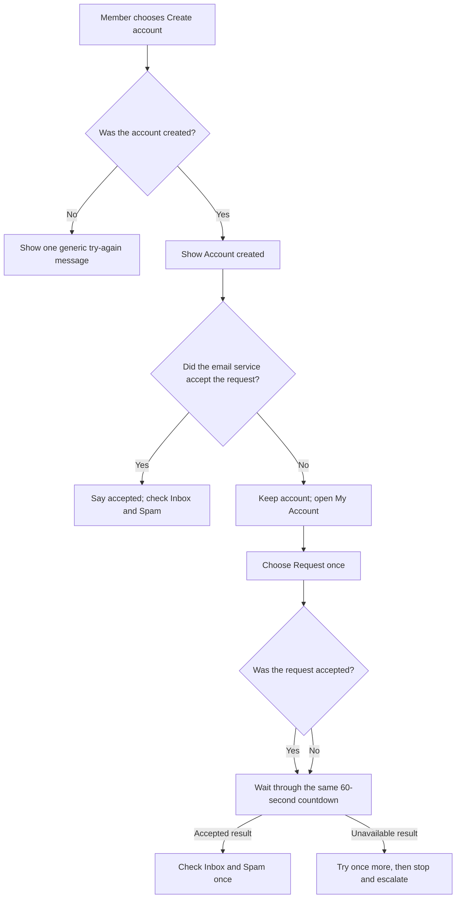
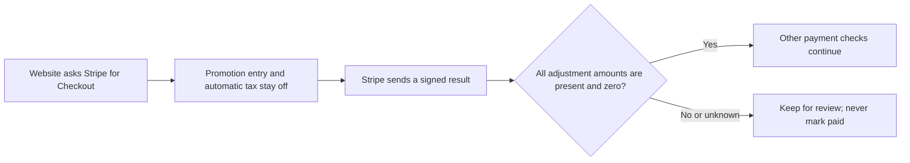
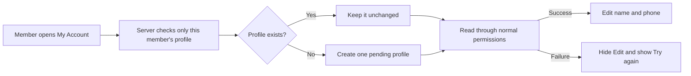
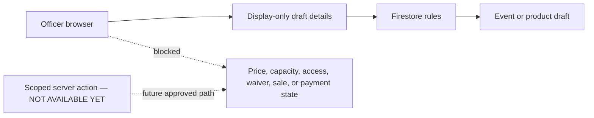

# Events, Shop, Members, and Money

**Current status:** live commerce is **NOT AVAILABLE YET**.
**Use this guide when:** a request touches registrations, members-only access, products, payments, refunds, waivers, or private data.

**Prerequisites:** a claimed issue, named business owner and backup, approved policy/value, isolated test data, and a platform specialist.
**Expected result:** a reviewed plan or test-only demonstration; no real payment, member, registration, order, or production-data change.

The repository contains screens for these jobs. Their presence does not prove the full system is safely configured or live.

There is currently no proven no-code switch that safely stops all new Stripe payments. Hiding a button, closing an event, or marking a product sold out may leave an already-created Stripe Checkout page payable.

## Approval table

| Change | Required owners |
| --- | --- |
| Public event description only | Event lead + communications lead |
| Registration dates or capacity | Event lead + platform lead |
| Price, discount, tax, product, inventory, refund, or payout | Treasurer + platform lead |
| Member access or admin role | Membership lead + platform/security lead |
| Waiver, Terms, Privacy, retention, insurance, or consent | Club officer + approved legal/privacy owner |
| Stripe, Firebase, Netlify, domain, email, or secret | Named service owner + backup |

## Safe request process

1. Open a GitHub issue before changing anything.
2. Name the business owner and backup owner.
3. Write the exact approved policy or value. Do not ask AI to invent it.
4. Ask AI to list every affected screen, data record, email, report, and outside service.
5. Require a test-only demonstration with made-up people and Stripe test mode.
6. Require negative tests: who must be denied, what retries, and what happens if a step fails.
7. Review the preview and the simple data/deployment diagram.
8. Require a rollback or safe roll-forward plan.
9. Require staging evidence before any production approval.
10. Approve a small, named live pilot only after the security launch gates are closed.

## Do not do these jobs manually

- Do not change Firestore records to “paid.”
- Do not grant admin access from the database console.
- Do not paste live Stripe or Firebase keys into code or chat.
- Do not delete registrations, orders, webhook events, or audit records to fix a display.
- Do not issue a refund in both Stripe and the website unless the approved procedure explicitly requires it.
- Do not open registration or sales because a screen appears to work locally.

## What proof is required

- Tests used fake people and test-mode payments.
- The exact commit and pull request are named.
- The website deployment is verified separately.
- The protected release proves the exact Rules and named Functions deployed first. Missing authority or a skipped/partial backend is a red stop, and the website is not published.
- Stripe or another provider is verified directly when involved.
- Counts and money reconcile after the change.
- The named officer signs off.

If any proof is missing, report the change as **not live**.

## New-account verification message — SOURCE ONLY, NOT LIVE

**Purpose:** tell a member whether the account exists and whether the email service accepted the verification request.

**Approver:** membership lead plus identity/platform owner.

**Prerequisites:** issue [#145](https://github.com/Run-MPRC/Run-MPRC.github.io/issues/145) is merged. Before publishing the #153 website revision, verify that the exact [#118](https://github.com/Run-MPRC/Run-MPRC.github.io/issues/118) Rules and Functions were deployed and read back. After publishing, verify the matching profile page and the resend result/countdown from [#153](https://github.com/Run-MPRC/Run-MPRC.github.io/issues/153) before calling My Account a working recovery path. The identity owner must confirm the plain status text. Source or merge evidence alone is not live proof. Email sender and Spam-folder improvements remain separate owner work in [#119](https://github.com/Run-MPRC/Run-MPRC.github.io/issues/119).

In words: account creation and each later email request are separate results. Accepted does not mean delivered. The same 60-second browser wait follows either resend result. Refreshing the page or changing accounts can reset that display, so it is not a server safety limit.

Until the prerequisites are proven, the current website message may still be wrong. Do not treat it as delivery evidence.

Officer steps after live proof:

1. Ask the member which plain status they see.
2. Do not ask for their email address, password, code, action link, or screenshot.
3. If the status says the request was accepted, ask them to check Inbox and Spam once.
4. If the message is in Spam, ask them to mark it **Not spam**.
5. If the status says the request did not finish, ask them to choose **Check My Account**.
6. If My Account is unavailable, stop. Keep the account and open a redacted incident through [Request a change](./REQUEST_A_CHANGE.md).
7. Use the next steps only after the exact [#153](https://github.com/Run-MPRC/Run-MPRC.github.io/issues/153) website revision is published and verified. Until then, stop and escalate.
8. Ask the member to choose **Request another verification email** once.
9. Ask them to wait through the full visible 60-second countdown.
10. If the page says the request was accepted, ask them to check Inbox and Spam once. Do not promise delivery.
11. If the page says the request was unavailable, wait for the countdown and try once more.
12. If that second request is unavailable, stop. Open a redacted incident through [Request a change](./REQUEST_A_CHANGE.md).
13. Do not refresh to bypass the display, create another account, or keep clicking. Firebase can still throttle a reset browser countdown.

**Expected result:** the page says `Account created` only after creation succeeds. It separately says an email request was accepted or unavailable. My Account disables the request action for 60 visible seconds after either result. The request-result message never repeats the member's address or the provider's error. An unavailable My Account page is a stop-and-escalate result, not proof that the account failed.

**Stop conditions:** a request for private account details, more than one retry after the countdown, a production email test, refreshing to bypass the countdown, a claim that accepted means delivered, or a website revision that cannot be identified.

**Success proof:** exact pull requests and merge commits for #145, #118, and #153; green synthetic tests; exact #118 Rules and Function deployment/readback before the website; a made-up profile-page check; website publication record; separate `runmprc.com` revision check; and dated plain-text review. Provider delivery, sender branding, Spam placement, and a real mailbox remain unproven unless #119 records owner-approved private evidence.

**Undo:** publish and verify one reviewed frontend revert or safe roll-forward. Do not delete or recreate the Firebase account.

**Escalation:** membership lead plus identity/platform owner; add the communications owner for Spam or delivery problems.

## Checkout adjustment guard — SOURCE ONLY, NOT LIVE

**Purpose:** prevent an unknown discount, tax, or shipping charge from being treated as a valid payment.

**Approver:** treasurer plus platform owner.

**Prerequisites:** source for issue [#102](https://github.com/Run-MPRC/Run-MPRC.github.io/issues/102) has merged, a private Stripe-owner inventory, made-up test payments, and one protected release plan covering all three affected server Functions.

In words: Checkout starts with unapproved adjustments off; the server accepts the money result only when Stripe explicitly reports zero discount, tax, and shipping.

Officer steps:

1. Keep live race and shop checkout unavailable.
2. Do not create a promotion code, tax rule, or shipping rate for the website.
3. Ask the Stripe owner to review older open Sessions privately.
4. Do not put Session links, code values, customer details, screenshots, or provider IDs in GitHub or AI.
5. Wait for separate proof of source merge, Firebase deployment, Stripe readback, and made-up test behavior.

**Expected result:** a complete all-zero Stripe breakdown may continue through the other checks. Unknown or nonzero adjustments stay under review. A failed or expired Session closes locally; it keeps an adjustment or earlier warning, while an ordinary all-zero failure does not create a new warning.

**Stop conditions:** any real payment/customer data, production-mode test, missing private inventory, missing server Function, skipped Firebase work, or request to “temporarily” enable a discount.

**Success proof:** exact pull request/commit, green exact-commit checks, private redacted inventory, three named Function readbacks, Stripe test-mode results, and separate provider-owner confirmation.

**Undo:** use one reviewed three-Function revert or safe roll-forward. Do not edit a payment record, delete a webhook event, or change production Stripe settings by hand.

**Escalation:** treasurer plus platform owner; add security if an adjustment reached paid/fulfilled state.

## Profile permission error

**Status: AUTOMATIC REPAIR NOT LIVE YET**

**Purpose:** help a signed-in member whose profile is missing or cannot be read.

**Approver:** membership lead plus platform/security owner.

**Prerequisites:** a new redacted incident from [Request a change](./REQUEST_A_CHANGE.md), made-up test accounts, an isolated Firebase test project, and an approved release plan. Issues [#118](https://github.com/Run-MPRC/Run-MPRC.github.io/issues/118) and [#105](https://github.com/Run-MPRC/Run-MPRC.github.io/issues/105) are engineering references, not places to add member details.

The planned safe flow is automatic. An officer does not create or edit the member record.

In words: the server preserves an existing profile or creates one pending profile for the signed-in person; editing stays hidden unless the normal read succeeds.

Safe officer steps:

1. Ask the member to stop retrying Save.
2. Record the time and the public `/account` page address.
3. Do not record their name, email, phone, login code, or screenshot of profile details.
4. Ask them to sign out.
5. Open a new redacted incident through [Request a change](./REQUEST_A_CHANGE.md).
6. Use #118 only as engineering context. Do not add member incidents or private details to it.
7. Wait for the platform owner to test with a made-up account.
8. Tell the member to retry only after the website, server Function, database permissions, and live behavior are each proven.

**Expected result:** after all release proof is complete, the member sees a profile or a plain temporary-unavailable message. A missing profile is displayed as pending or unverified. The repair does not grant, remove, or change actual access. If displayed profile status and actual access disagree, stop and escalate.

**Stop conditions:** stop if anyone proposes a direct database change, login-account deletion, account recreation, role grant, real-member test, or website-only release before the server Function is live.

**Success proof:** name the merged pull request, website commit, Function deployment, database-permission deployment, made-up staged account test, `runmprc.com` check, and separate live-state check. A green workflow with “skipping Firebase deploy” is not proof.

**Undo:** ask the platform owner to prepare, approve, publish, and verify a reviewed revert or safe roll-forward. Never undo by deleting a member profile or login account.

**Escalation:** membership lead plus identity/security owner. Add the privacy owner if private information appeared. Email landing in spam is a separate delivery problem; do not treat it as proof of this permission failure.

## Admin screens — NOT AVAILABLE YET

Admin event and product editors exist in source, but their live permissions, backup, preview, and rollback behavior have not been approved. Saving can write directly to production Firestore. Officers must not use these screens as a continuity procedure yet.

### Source protection in #100 — NOT LIVE YET

Issue [#100](https://github.com/Run-MPRC/Run-MPRC.github.io/issues/100) narrows the source rules for these screens. It does not prove that Firebase received those rules.

After that source change merges:

- A browser can create only an inactive event or product draft with no live price, capacity, sale, registration, waiver, volunteer, or custom-field setup.
- A browser can edit ordinary display text and approved HTTPS image/result links.
- A browser cannot change event price, capacity, registration state, member visibility, waiver setup, volunteer setup, or collected registration fields.
- A browser cannot change product price, sale status, sizes, colors, inventory, orders, or payment state.
- A browser admin cannot directly change a member role or read stored connection secrets.

Those protected changes need a small, reviewed server action. That action is **NOT AVAILABLE YET**. Until it exists and is tested, use [Request a change](./REQUEST_A_CHANGE.md).

Text alternative: the officer browser may send display-only draft details through Firestore rules. Operational, access, legal, and money fields stay blocked until a future approved server action exists.

**Proof state:** source and emulator tests may pass in #100. Firebase deployment, the live rule version, the Admin screens, and production behavior remain unproven until #105 records each state separately.

Before an officer click guide may be added, a claimed issue must prove all of the following with made-up data in an isolated staging project:

1. Only the intended officer role can open and save each screen.
2. A draft stays private to ordinary visitors.
3. A second officer can preview without changing production.
4. Backup and restore are tested.
5. Every field has an approved owner and validation rule.
6. Publishing requires a separate, explicit approval.
7. Closing an event or product has a documented effect on existing Checkout Sessions.
8. A real no-code checkout kill switch is implemented and tested.
9. Audit records show who changed what and when.
10. The rollback procedure is tested before production access is granted.

Until that issue closes, request event/product changes through [Request a change](./REQUEST_A_CHANGE.md). Use a reviewed pull request or a specialist-run, test-only demonstration; do not enter real members, registrations, products, prices, or payment details.

## Stop conditions

Stop if staging is not isolated, the owner/policy is missing, a test uses real people or money, Firebase deployment skipped, rollback is untested, or the requested action directly edits payment/member state.

## Undo

Because this guide authorizes no production write, the safe undo is to close or revise the issue before release. If production data changed unexpectedly, stop and use [Emergency and recovery](./EMERGENCY_AND_RECOVERY.md); do not delete or overwrite the record.

## Escalation

- Event/capacity: event lead plus platform owner.
- Member/admin access: membership lead plus identity/security owner.
- Price/order/refund/Stripe: treasurer plus platform owner.
- Waiver/Terms/Privacy/retention: club officer plus approved legal/privacy owner.
