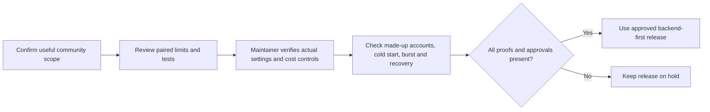

# A simple, low-cost community website

**Purpose:** keep the community experience useful while limiting services, recurring work, and spending exposure.

**Approver:** Dave Liu for the current simplification request. Any release still uses the named platform/security reviewers. Regular club expenditure needs the club's finance approval; willingness to supply a personal card is not an unlimited club budget.

**Checked:** 2026-09-11. This is a scope and source-review guide, not proof that the new settings are live.

## What we are prioritizing

- Clear information about regular runs, meeting places, joining, and contacts.
- A useful events/calendar experience on phones as well as computers.
- Public information without requiring an account.
- Optional secure accounts for features that actually need them.
- Existing club-approved external links when an outside service already does the job.

Prefer static pages and published public content: visitors can receive files from the host without running a server operation for each page view. Where events need database content, use bounded reads and avoid unnecessary polling. This is the implementation direction, not a claim that the Events service has been repaired. Production Events/Calendar still have the recorded unavailable state pending their own reviewed release.

The first profile backend remains exactly two server operations: create a missing account profile and recover it safely. Keep custom checkout, refunds, inventory, automatic email, photo uploads, directory search, and Strava synchronization out of that deployment. Their existing code and future requirements remain preserved. Connecting any of them needs its own useful community outcome, cost review, tests, and approval. Do not remove a current external membership/payment service or change club policies through this guide.

## Cost controls in source — NOT AVAILABLE YET in hosted Functions

[Issue #683](https://github.com/Run-MPRC/Run-MPRC.github.io/issues/683) sets the same resource options on both profile operations:

| Setting | Meaning |
| --- | --- |
| Minimum instances: 0 | No server instance is reserved to sit idle. A first request after inactivity can take longer. |
| Maximum instances: 2 per operation | Limit normal automatic scaling. This is not two users or two requests per month. |
| Memory: 256 MB | Use the existing small memory size explicitly. |
| Execution timeout: 30 seconds | Stop unusually long execution; a timed-out request can have an uncertain result. |

These are resource settings, **not a maximum monthly bill**. Google can briefly exceed the instance limit during traffic surges. A busy HTTP operation can queue requests and return a temporary busy response. Persistent storage, deployment files, database use, and other services can still cost money. The profile remains create-once so retrying an uncertain result does not overwrite existing information or grant membership.

No budget, spending cap, artifact-cleanup policy, billing account, Function, or new host is configured by this source change. Billing was separately checked as disabled/unlinked on 2026-09-11. A personal card has been offered as fallback; card details belong only in Google's secure payment form.

## Review before a low-cost release

**Prerequisites:** issue #683 and its reviewed pull request; the exact release source and test results; a named release approver; a private billing/payment-owner decision; and a platform maintainer. The existing release dependencies still apply. Never put payment details, passwords, or member records in an issue.

Text alternative: confirm the small scope, review source, verify provider controls, test quality with made-up accounts, and release only when every proof and approval is present.

1. Confirm the public pages to keep and the two profile operations to deploy.
2. Confirm the release adds no payment, email, photo, or synchronization service.
3. Ask the maintainer for the exact merged source and passing tests.
4. Ask for separate provider evidence of all four resource settings on each Function. Google may leave out a zero minimum-instance value; the maintainer must show that this was decoded using Google's documented format. Other missing or malformed settings are not proof of safe defaults.
5. Ask for the agreed alert recipients and budget amount. Alerts do not stop charges.
6. Ask whether a service spending cap is available and configured. It does not guarantee a whole-project bill ceiling or instant shutdown.
7. Ask for deployment-file cleanup and storage-retention evidence. Do not delete database backups as a cost shortcut.
8. Observe the maintainer's made-up account checks: first sign-in after inactivity, a small concurrent burst, profile recovery, retry, and the readable busy/unavailable state. Never create or edit a real member for this test.
9. Confirm public run/join/contact information stays usable when the account service is unavailable. Events data may still depend on the database; do not promise an offline calendar unless separately tested.
10. Record the date, named reviewers, source revision, fixed pass/fail results, and separate source/merge/website/Firebase/provider states.

**Expected result:** officers can identify the small launch scope, understand the limits, and verify the release without a terminal or payment details.

**Stop conditions:** unknown billing owner, unapproved service, claims of guaranteed zero cost, missing provider settings, poor cold-start/burst behavior, real-data testing, an unexpected allow, or missing deployment/rollback evidence. Stop if runtime maintenance or the existing #113/#133/#136 dependencies remain unresolved for the requested release.

**Success proof:** a reviewed source/CI record plus separate provider readback and synthetic quality evidence. Source tests alone cannot prove lower bills or a good hosted experience.

**Undo:** before release, hold the change. After release, ask the platform maintainer to use the reviewed compatible rollback or safe roll-forward. Reverting the limits can raise spending exposure and requires review. Do not edit a profile, widen permissions, switch off billing, or delete resources as an improvised fix.

**Escalation:** platform/security owner for reliability or access; treasurer/finance approver for recurring club costs; cardholder for payment authority. A specialist is still needed for provider setup, release, and rollback. This guide does not claim independent officer deployment is available.

## References

- [Firebase resource settings and saturation behavior](https://firebase.google.com/docs/functions/1st-gen/manage-functions-1st)
- [Google maximum-instance caveat](https://docs.cloud.google.com/functions/docs/reference/rest/v1/projects.locations.functions)
- [Google's zero-value response format](https://protobuf.dev/programming-guides/json/#presence-and-default-values)
- [Spending-cap coverage and overages](https://docs.cloud.google.com/billing/docs/how-to/budgets-spend-caps)
- [Firebase Hosting usage](https://firebase.google.com/docs/hosting/usage-quotas-pricing)
