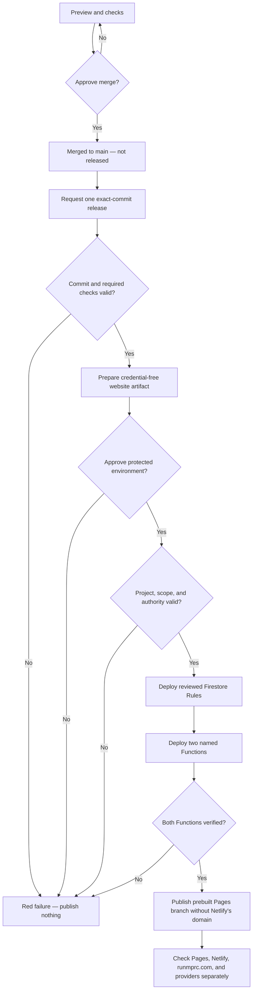
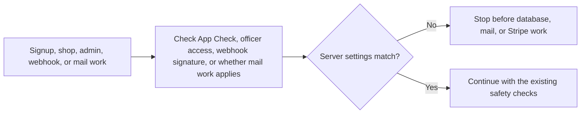

# Review, Merge, Release, and Check a Change

**Purpose:** review one change, merge it, approve one exact release, and record what did or did not become live.

**Merge approver:** the content or business owner named in the change request.

**Production release approver:** Dave Liu as platform owner until the board records a replacement, plus the required service/security reviewer for a high-risk change. Two named backup officers are still required under #133 before continuity is complete.

**Prerequisites:** one approved pull request aimed at `main`; green required checks; an exact 40-character merged commit; a rollback or safe roll-forward note; and a named observer.

**Protected release status:** **NOT AVAILABLE YET.** Issue #135 provides the fail-closed source gate. Issue #133 must still configure protected `staging` and `production` environments, their named reviewers, and a short-lived cloud identity. Public browser build values must be named repository or organization variables because artifact preparation has no protected-environment access; #133/#136 must record and verify them separately. Do not add a long-lived Firebase key as a shortcut.

**Live Netlify publication status:** **NOT AVAILABLE YET.** Git-triggered production builds are paused by repository configuration. The Netlify owner, build hooks, manual trigger, exact-commit proof, and rollback path remain unverified provider work. GitHub Pages currently still claims the same custom domain; future source omits that claim, but #136/WEB-001 must publish and verify its removal.

## The release gate



In words: merging does not release; a request checks one exact commit and may prepare a credential-free artifact; protected approval unlocks Firebase; only verified Firebase permits Pages publication.

## Current facts

As of **2026-07-13**:

- `main` is the canonical branch.
- A merge starts CI checks. It does not start `.github/workflows/deploy.yml`.
- The release workflow accepts only a full commit already merged into `main`.
- It requires successful frontend, Functions, and Firestore Rules checks for that commit.
- Its only current release plan is the reviewed profile-recovery set: Firestore Rules, `createMemberOnSignUp`, and `ensureMemberProfile`.
- A caller cannot type a Firebase project or deployment target into the release form.
- Missing environment configuration or cloud authority makes the release red before backend dependencies, cloud authentication, or deployment. A public website artifact may be prepared without cloud authority, but it cannot be published.
- The backend uses a short-lived cloud identity when #133 configures it. The website job receives public browser values only.
- The Firebase CLI comes from the committed lockfile. The release does not install `latest`.
- A production Pages publication job cannot start until Firebase deployment and Function verification succeed.
- The `staging` option deliberately stops before deployment until #113/#133 name one exact approved staging Firebase project. A future staging release remains backend-only until a separate staging browser configuration and host exist.
- `runmprc.com` is served by Netlify, not GitHub Pages.
- GitHub Pages currently reports `runmprc.com` as its custom domain and redirects its normal address there. It is not an independently reachable copy today.
- Future source stops writing that Pages domain claim. Only provider readback after #136/WEB-001 can prove it cleared.
- Git-triggered Netlify production builds are paused. Netlify build hooks are not controlled by that repository rule and remain unverified.
- Live race signup, merchandise payments, and refunds remain unavailable.
- CONFIG-001B1 [#151](https://github.com/Run-MPRC/Run-MPRC.github.io/issues/151) adds source enforcement for a server-only commerce pause. It is not in the fixed profile-recovery release plan, is not deployed, and has no approved officer control. A future reviewed plan must deploy the complete guarded Function set with the deploy ceiling and every runtime/resource flag off, then prove signed webhooks still work. Do not widen the current plan by hand.

### Commerce server safety gate — SOURCE ONLY, NOT DEPLOYED

Issue [#149](https://github.com/Run-MPRC/Run-MPRC.github.io/issues/149) adds a source-code check for the server environment, website address, Stripe test/live mode, and server-key mode. It does not configure Firebase or Stripe. It does not make payments available.



In words: the server first checks identity, the webhook signature, or whether mail work applies. Wrong or missing settings then stop qualifying work before business data, email, or Stripe can change.

If a member or officer sees **Server configuration is unavailable**:

1. Stop.
2. Do not retry checkout, refund, or late registration.
3. Record the page and time without member or payment details.
4. Ask the platform owner to check the private environment record.
5. Never paste a key, setting value, screenshot of a console, or member details into an issue or AI tool.

**Expected result:** no registration, order, refund, mail, or Stripe object is created while settings are invalid.

**Undo:** revert the reviewed source change if it causes a false stop. Never restore a default production website address.

**Escalation:** platform owner, then the finance owner if a payment might already exist in Stripe.

## Before merge

1. Open the pull request.
2. Confirm its destination is `main`.
3. Confirm it names one issue and one outcome.
4. Confirm another person or review agent approved it.
5. Open the `Frontend lint + build` job.
6. Confirm `Run frontend Jest tests` is present and green.
7. Confirm `Run SPA callback safety tests` is present and green.
8. Confirm the Functions and Firestore Rules jobs are green.
9. Use a preview only for public, read-only pages.
10. Do not sign in, open private/admin pages, submit forms, or test signup, checkout, refund, email, or Strava in a preview.
11. Confirm the officer guide and undo note are present.
12. Approve or reject the merge. Do not describe merge approval as release approval.

## After merge

1. Record the pull request number.
2. Record the full merged commit.
3. Wait for that commit's CI jobs.
4. Confirm the required jobs are green again.
5. Mark the result **merged — not released**.
6. Do not expect GitHub Pages, Firebase, Netlify, or `runmprc.com` to change from the merge.
7. If Netlify unexpectedly publishes the merge, stop and treat it as a hosting incident.

## Before a protected release — NOT AVAILABLE YET

Do not use this section until #133 records that both GitHub environments are protected and tested.

1. Choose `staging` or `production`.
2. Copy the exact 40-character merged commit. Do not use a branch name.
3. Choose the fixed release plan. Do not type a project or Function name.
4. Confirm the environment's Firebase project is the approved one.
5. Confirm the required checks belong to the same exact commit.
6. Confirm the rollback or safe roll-forward commit.
7. Confirm the named observer is available.
8. Ask the platform maintainer to request the manual release.
9. Record the release-run link.
10. Wait for the exact-commit checks and credential-free artifact preparation.
11. Have the named reviewer confirm the environment, commit, fixed plan, and undo note before approving the protected environment.
12. Do not approve a request older than 24 hours. Start a new request from the current `main` commit.

## Watch the release — NOT AVAILABLE YET

1. Confirm preflight says the exact commit is merged and its checks passed.
2. For production, confirm the credential-free website artifact was prepared from that commit.
3. Confirm the named protected-environment approval is recorded before the backend job.
4. Confirm protected configuration is present and environment-matched.
5. Confirm short-lived cloud authentication succeeds.
6. Confirm Firestore Rules deploy first.
7. Confirm only `createMemberOnSignUp` and `ensureMemberProfile` deploy next.
8. Confirm both Functions are found by the verification step.
9. Stop if any backend step is missing, skipped, failed, partial, or mismatched.
10. Confirm the GitHub Pages publication job starts only after backend success.
11. Confirm the Pages artifact uses the same exact commit.
12. Never call an overall green run proof that `runmprc.com` changed.

## Verify every affected surface

1. Record whether the GitHub Pages branch published and whether provider readback shows its old `runmprc.com` claim is gone.
2. Ask the Netlify owner which commit, if any, Netlify published.
3. Open [runmprc.com](https://runmprc.com) in a private window.
4. Visit the exact changed public page.
5. Check one phone-sized view.
6. Check one normal computer view.
7. If Firebase changed, obtain dated proof for the exact project, Rules release, and named Functions.
8. If an outside provider changed, obtain separate dated proof from its owner.
9. Use made-up data only. Do not inspect or change a real member record.
10. Complete the delivery record.

## Expected result

Merge, release approval, Firebase deployment, backend verification, Pages publication, Netlify publication, `runmprc.com`, and provider verification are recorded as separate states. A backend failure or missing authority leaves the website unpublished.

## Stop conditions

Stop and contact the platform owner if:

- The pull request does not target `main`.
- Approval, required checks, or the undo note is missing.
- The release uses a branch name or short commit.
- The commit is not merged into `main`.
- The release request is more than 24 hours old.
- The environment, project, or fixed scope is missing or wrong.
- The site reports **Server configuration is unavailable**.
- Anyone asks for a service-account key, token, password, or recovery code.
- Firebase is skipped, partial, failed, or unverified.
- A website publication job starts before backend verification.
- A project or deployment target can be typed freely.
- Netlify publishes unexpectedly or its live commit is unknown.
- A test needs real member, payment, or private data.

## Success proof

Keep the completed record with links to the issue, pull request, merged commit, exact CI jobs, release run, and each affected live service. Keep provider identifiers, private links, logs, credentials, and member data out of public evidence.

## Delivery record

```text
Issue:
Pull request:
Merged commit (40 characters):
Required checks passed:
Release requested by:
Release approved by:
Environment: staging / production / not released
Release plan:
Preflight: pass / fail / not run
Firebase Rules deployed: yes / no / not run
Named Functions deployed and verified: yes / no / not run
GitHub Pages published: yes / no / not run
Netlify intended commit verified: yes / no / unknown
runmprc.com verified: yes / no
Outside provider configured: yes / no / not relevant
Outside provider verified: yes / no / not relevant
Production behavior verified: yes / no
Checked by:
Checked at (date and time):
Undo or safe roll-forward commit:
Known remaining problem:
```

## If anything fails

1. Do not rerun blindly.
2. Do not approve the Pages job after a backend failure.
3. Save the run link, exact commit, time, and a redacted screenshot.
4. If Rules changed but Functions failed, treat the backend as partial.
5. Ask the platform owner to restore the reviewed compatible backend set or safely roll forward.
6. Do not force-push, reset branches, delete data, edit Firestore by hand, or change DNS.

## Undo

Use one reviewed rollback or safe roll-forward commit through the same protected, backend-first gate. Restore a compatible Firebase set before publishing a dependent website. A Netlify rollback remains a provider-owner procedure and is **NOT AVAILABLE YET** for backup officers.

**Escalation:** platform owner plus backup for release/hosting; Firebase owner for backend; treasurer plus platform owner for commerce; privacy owner for member data.
