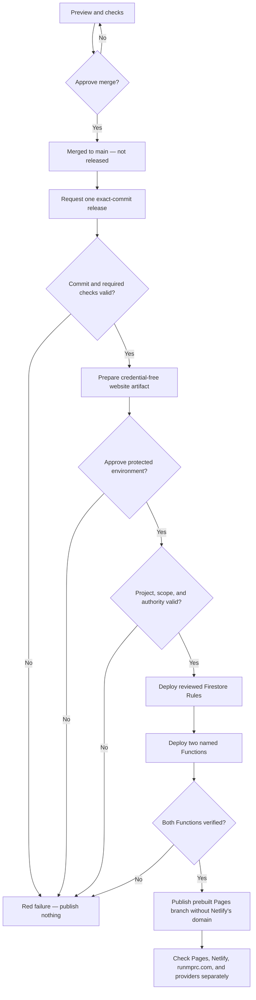
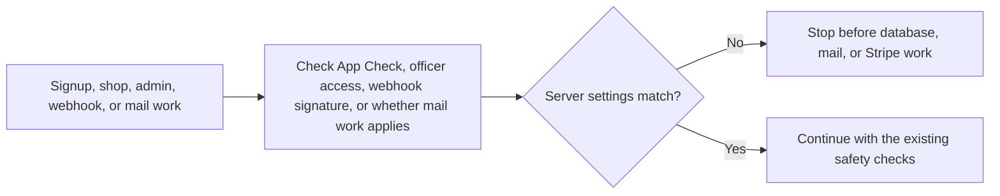
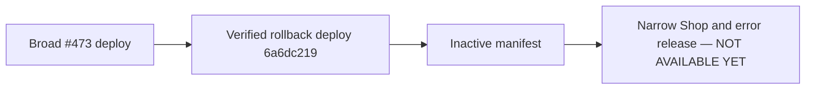
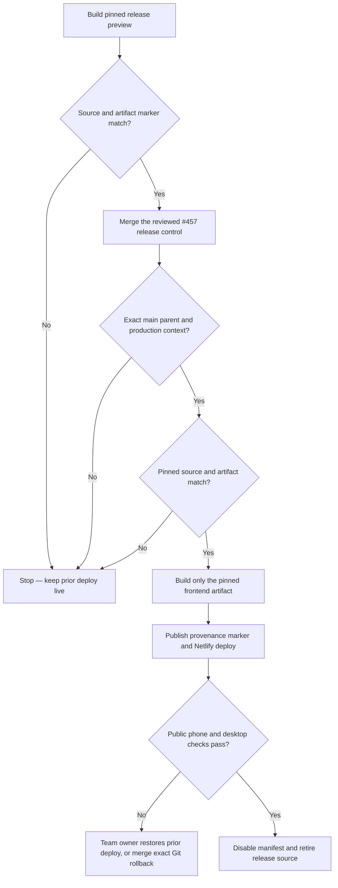

# Review, Merge, Release, and Check a Change

**Purpose:** review one change, merge it, approve one exact release, and record what did or did not become live.

**Merge approver:** the content or business owner named in the change request.

**Production release approver:** Dave Liu as platform owner until the board records a replacement, plus the required service/security reviewer for a high-risk change. Two named backup officers are still required under #133 before continuity is complete.

**Prerequisites:** one approved pull request aimed at `main`; green required checks; an exact 40-character merged commit; a rollback or safe roll-forward note; and a named observer.

**Protected release status:** **NOT AVAILABLE YET.** Issue #135 provides the fail-closed source gate. Issue #133 must still configure protected `staging` and `production` environments, their named reviewers, and a short-lived cloud identity. Public browser build values must be named repository or organization variables because artifact preparation has no protected-environment access; #133/#136 must record and verify them separately. Do not add a long-lived Firebase key as a shortcut.

**Live Netlify publication status:** a reusable protected release is **NOT AVAILABLE YET**. Ordinary Git-triggered production builds are paused. On 2026-08-01, a too-broad #473 artifact published, the prepared Git rollback restored exact prior source `ed1b0833` as deploy `6a6dc219a8136300081811db`, and merge `dee79511` disabled the temporary manifest without replacing that rollback. The restored Shop and Events pages still show raw permission failures. A narrower #473 Shop/error-message release is **NOT AVAILABLE YET** and is not an officer control. This did not deploy Firebase, enable Google sign-in, expose protected event offers, add officer editing, or authorize commerce. GitHub Pages currently still claims the same custom domain; future source omits that claim, but #136/WEB-001 must publish and verify its removal.

## The release gate


```mermaid
flowchart TD
    Review["Preview and checks"] --> Merge{"Approve merge?"}
    Merge -- "No" --> Review
    Merge -- "Yes" --> Merged["Merged to main — not released"]
    Merged --> Request["Request one exact-commit release"]
    Request --> Preflight{"Commit and required checks valid?"}
    Preflight -- "No" --> Stop["Red failure — publish nothing"]
    Preflight -- "Yes" --> Prepare["Prepare credential-free website artifact"]
    Prepare --> Release{"Approve protected environment?"}
    Release -- "No" --> Stop
    Release -- "Yes" --> Gate{"Project, scope, and authority valid?"}
    Gate -- "No" --> Stop
    Gate -- "Yes" --> Rules["Deploy reviewed Firestore Rules"]
    Rules --> Functions["Deploy two named Functions"]
    Functions --> VerifyBackend{"Both Functions verified?"}
    VerifyBackend -- "No" --> Stop
    VerifyBackend -- "Yes" --> Pages["Publish prebuilt Pages branch without Netlify's domain"]
    Pages --> Verify["Check Pages, Netlify, runmprc.com, and providers separately"]
```

In words: merging does not release; a request checks one exact commit and may prepare a credential-free artifact; protected approval unlocks Firebase; only verified Firebase permits Pages publication.

## Current facts

As of **2026-08-01**, with the internal tooling note below last checked from source on **2026-07-22**:

- `main` is the canonical branch.
- A merge starts CI checks. It does not start `.github/workflows/deploy.yml`.
- The release workflow accepts only a full commit already merged into `main`.
- It requires successful frontend, Functions, commerce command journal, test artifact scrubber, and Firestore Rules checks for that commit.
- Its only current release plan is the reviewed profile-recovery set: Firestore Rules, `createMemberOnSignUp`, and `ensureMemberProfile`.
- A caller cannot type a Firebase project or deployment target into the release form.
- Missing environment configuration or cloud authority makes the release red before backend dependencies, cloud authentication, or deployment. A public website artifact may be prepared without cloud authority, but it cannot be published.
- The backend uses a short-lived cloud identity when #133 configures it. The website job receives public browser values only.
- The Firebase CLI comes from the committed lockfile. The release does not install `latest`.
- Source checked on 2026-07-22 pins the internal Firebase CLI to 15.24.0, and its emulator checks use Java 21. Officers do not install or run either tool; the platform maintainer owns them. This tooling note does not alter the release diagram or prove that Firebase was deployed. Provider and live-host facts are recorded separately below.
- A production Pages publication job cannot start until Firebase deployment and Function verification succeed.
- The `staging` option deliberately stops before deployment until #113/#133 name one exact approved staging Firebase project. A future staging release remains backend-only until a separate staging browser configuration and host exist.
- `runmprc.com` is served by Netlify, not GitHub Pages.
- GitHub Pages currently reports `runmprc.com` as its custom domain and redirects its normal address there. It is not an independently reachable copy today.
- Future source stops writing that Pages domain claim. Only provider readback after #136/WEB-001 can prove it cleared.
- Ordinary Git-triggered Netlify production builds are paused, and the #473 manifest is inactive. The live marker still identifies rollback control `1099ee8`, source `ed1b0833`, tree `878c6628`, 60 files, and digest `7570955c…`. The broad source ref is absent; the exact rollback source remains.
- Live race signup, merchandise payments, and refunds remain unavailable.
- CONFIG-001B1 [#151](https://github.com/Run-MPRC/Run-MPRC.github.io/issues/151) adds source enforcement for a server-only commerce pause. It is not in the fixed profile-recovery release plan, is not deployed, and has no approved officer control. A future reviewed plan must deploy the complete guarded Function set with the deploy ceiling and every runtime/resource flag off, then prove signed webhooks still work. Do not widen the current plan by hand.

### Commerce server safety gate — SOURCE ONLY, NOT DEPLOYED

Issue [#149](https://github.com/Run-MPRC/Run-MPRC.github.io/issues/149) adds a source-code check for the server environment, website address, Stripe test/live mode, and server-key mode. It does not configure Firebase or Stripe. It does not make payments available.


```mermaid
flowchart LR
    Request["Signup, shop, admin, webhook, or mail work"] --> Identity["Check App Check, officer access, webhook signature, or whether mail work applies"]
    Identity --> Config{"Server settings match?"}
    Config -- "No" --> Stop["Stop before database, mail, or Stripe work"]
    Config -- "Yes" --> Continue["Continue with the existing safety checks"]
```

In words: the server first checks identity, the webhook signature, or whether mail work applies. Wrong or missing settings then stop qualifying work before business data, email, or Stripe can change.

If a member or officer sees **Server configuration is unavailable**:

1. Stop.
2. Do not retry checkout, refund, or late registration.
3. Record the page and time without member or payment details.
4. Ask the platform owner to check the private environment record.
5. Never paste a key, setting value, screenshot of a console, or member details into an issue or AI tool.

**Expected result:** no registration, order, refund, mail, or Stripe object is created while settings are invalid.

**Undo:** revert the reviewed source change if it causes a false stop. Never restore a default production website address.

**Escalation:** platform owner, then the finance owner if a payment might already exist in Stripe.

## Before merge

1. Open the pull request.
2. Confirm its destination is `main`.
3. Confirm it names one issue and one outcome.
4. Confirm another person or review agent approved it.
5. Open the `Frontend lint + build` job.
6. Confirm `Run frontend Jest tests` is present and green.
7. Confirm `Run SPA callback safety tests` is present and green.
8. Confirm `Commerce command journal emulator` is present and green. It uses made-up payment-command records and does not contact Stripe.
9. Confirm `Test artifact scrubber` is green. It proves the deliberate made-up output scan ran. It does not prove a report was uploaded or a live service changed.
10. Confirm the Functions and Firestore Rules jobs are green.
11. Use a preview only for public, read-only pages.
12. Do not sign in, open private/admin pages, submit forms, or test signup, checkout, refund, email, or Strava in a preview.
13. Confirm the officer guide and undo note are present.
14. Approve or reject the merge. Do not describe merge approval as release approval.

## After merge

1. Record the pull request number.
2. Record the full merged commit.
3. Wait for that commit's CI jobs.
4. Confirm all five named jobs are green again: Frontend, Functions, commerce command journal, test artifact scrubber, and Firestore Rules.
5. Mark the result **merged — not released**.
6. Do not expect GitHub Pages, Firebase, Netlify, or `runmprc.com` to change from the merge. The #473 manifest is inactive.
7. If Netlify unexpectedly publishes, stop and treat it as a hosting incident.

## #473 Netlify incident and narrower replacement — NOT AVAILABLE YET

**Purpose:** retain the exact incident and rollback evidence, then permit a future release only for the reviewed $10 Hat/$25 Jacket display-only Shop and fixed public Events error messages. This procedure does not repair Events data or publish a backend.

**Approver:** Dave Liu as platform owner, with a second independent release review. This is not an officer-operated control.

**Current verified result:** broad merge `40728ff6141e34a279b70cc41d983c22ac5f0daa` published disputed deploy `6a6dc0167fbe68000816b448`. Rollback merge `1099ee8e6fdb81141fd9460de175b6d854cbcfdd` restored source `ed1b0833f25822cee80c99ded8753722b5608a3f` as deploy `6a6dc219a8136300081811db`. Repause merge `dee79511b6e371329aa129139729e112e7a51aad` produced unpublished attempt `6a6dc35767a4ef000877e74b`. The live marker still matches the rollback source, tree `878c6628d961f4484cb49208aef53f1e9f2e3b47`, 60 files, and digest `7570955c2a00926e5813aef135f1799172cfd046072ac89fb4e492bed0797092`. A signed-out 390px check restored the prior Shop and Events pages with no new browser-console error and confirmed that their raw permission messages remain. The broad source ref is absent; the rollback source remains.

**Prerequisites for a future attempt:** issue #473 must record a new source commit/tree/digest based on exact source `ed1b0833`; the source diff must contain only the static Shop, Events-list/calendar error containment, and focused tests; Node 20 checks and a pinned preview must pass; exact rollback and repause changes must be prepared; the current `main` parent must be frozen; and two reviewers must approve the executable artifact and this procedure. These prerequisites are not yet complete, so do not perform the release steps.


```mermaid
flowchart LR
    Broad["Broad #473 deploy"] --> Rollback["Verified rollback deploy 6a6dc219"]
    Rollback --> Repause["Inactive manifest"]
    Repause --> Future["Narrow Shop and error release — NOT AVAILABLE YET"]
```

In words: the broad artifact was rolled back, the temporary authority was disabled, and a separately reviewed narrow release is not yet available.

1. Stop while this section says **NOT AVAILABLE YET**.
2. Ask the platform maintainer to record every prerequisite above on issue #473.
3. Ask a second reviewer to approve that exact record before changing this status.
4. Ask the platform maintainer to run and record the automated proof that Shop starts no service or data request.
5. Ask the platform maintainer to compare the preview marker with the approved source, tree, file count, digest, previous source, and rollback deploy.
6. Stay signed out and open `/shop` in the preview. Do not register, buy, sign in, or submit a form.
7. Confirm Shop shows only the approved Hat and Jacket information.
8. Open `/events` in the preview and confirm it shows only the fixed retry-later alert.
9. Open `/events/calendar` in the preview and confirm it shows only the fixed retry-later alert.
10. Ask the platform maintainer to record HTTP 200 for those three routes at phone and computer widths.
11. Ask the platform maintainer to record the required HTTPS, no-store, JSON, nosniff, and HSTS marker headers.
12. Ask the platform maintainer to record the preview's noindex response header.
13. Ask the platform maintainer to record the `/robots.txt` result.
14. Ask the platform maintainer to record the browser-console result.
15. Confirm the exact rollback pull request is ready before a production merge.
16. Confirm the exact repause pull request is ready before a production merge.
17. Ask the platform owner to freeze `main`.
18. Merge only after the separate approval.
19. Repeat steps 5 through 14 against `runmprc.com` after that merge.
20. Record the exact live deploy and public marker.
21. Merge the prepared repause change after every live check passes.
22. Confirm that the repause attempt did not replace the verified deploy.
23. Retire only the future release source.
24. Verify that the future release ref is absent.

**Expected result:** until the prerequisites are complete, deploy `6a6dc219a8136300081811db` remains live and ordinary merges publish nothing. A future accepted result would change only the public Shop/error presentation and would leave Firebase, providers, accounts, protected offers, officer editing, payments, and production data unchanged.

**Stop conditions:** stop if this section still says **NOT AVAILABLE YET**; a hash, ref, count, digest, parent, context, marker, or page differs; the preview or prepared undo is missing; the console shows a new error; Events data is described as repaired; a public check asks for private data; or any check fails.

**Success proof:** for the contained incident, keep the three merge/deploy outcomes, exact public marker, five-job CI results, signed-out page result, and ref state. For a future attempt, add its exact marker, two viewport sizes, bounded route/header/robots/console results, and one redacted public screenshot. Keep settings, logs, credentials, member data, and promo values out of public evidence.

**Undo:** the verified Git rollback source is `ed1b0833f25822cee80c99ded8753722b5608a3f`. If a future wrong artifact publishes and Netlify atomic restore is unavailable, refresh a prepared exact-parent Git rollback to that source, rerun its pinned preview, and merge only after separate approval. Disabling a manifest alone is not rollback.

**Escalation:** platform owner first; website/content owner second; security owner if private data or an unexpected application version appears. A Firebase/Rules/App Check repair requires its own protected backend incident release.

## Temporary #457 Netlify web release

**Purpose:** publish only the already reviewed Events, Shop, and My Account header tree without publishing the unrelated application work now on `main`.

**Completed status:** production deploy `6a61c544171ea80008307623`, trigger commit `4f67e6cafb975a3f985fefc67f094b3a37526702`, and the public marker were verified on 2026-07-23 America/Los_Angeles at 1280px desktop and 390px phone widths. Events and Shop showed their images and readable headings below the navigation. Signed-out `/account` redirected to the readable image-backed Login page. Firebase and outside providers were unchanged. The release source was then retired; this procedure is retained as dated evidence, not as an available release button.

**Approver:** Dave Liu as platform owner. This is not an officer-operated control.

**Prerequisites:** issue #457 approval; green checks; a successful pinned Netlify Deploy Preview; exact source commit `ed1b0833f25822cee80c99ded8753722b5608a3f`; exact source tree `878c6628d961f4484cb49208aef53f1e9f2e3b47`; exact 60-file artifact digest `7570955c2a00926e5813aef135f1799172cfd046072ac89fb4e492bed0797092`; prior live deploy `6a54a3c93db9d300082e1f5f`; release source `codex/netlify-source-457-header`; rollback source `codex/netlify-source-457-rollback`; a prepared manifest-disable pull request; a reviewed exact Git rollback projection; and no other `main` merge until verification ends. The current identity cannot click Netlify's atomic restore, so a Netlify team owner is preferred for fast rollback and the exact Git projection is the available fallback.


```mermaid
flowchart TD
    Preview["Build pinned release preview"] --> PreviewCheck{"Source and artifact marker match?"}
    PreviewCheck -- "No" --> Stop["Stop — keep prior deploy live"]
    PreviewCheck -- "Yes" --> Merge["Merge the reviewed #457 release control"]
    Merge --> Parent{"Exact main parent and production context?"}
    Parent -- "No" --> Stop["Stop — keep prior deploy live"]
    Parent -- "Yes" --> Source{"Pinned source and artifact match?"}
    Source -- "No" --> Stop
    Source -- "Yes" --> Build["Build only the pinned frontend artifact"]
    Build --> Proof["Publish provenance marker and Netlify deploy"]
    Proof --> Check{"Public phone and desktop checks pass?"}
    Check -- "No" --> Rollback["Team owner restores prior deploy, or merge exact Git rollback"]
    Check -- "Yes" --> Disable["Disable manifest and retire release source"]
```

In words: the release preview and production must contain the same pinned frontend artifact; only the exact #457 merge may publish it; then the maintainer checks the live site and retires the exception, or a Netlify team owner restores the prior deploy, with the prepared exact Git rollback as fallback.

1. Confirm the release pull request targets `main` and contains the exact active manifest.
2. Confirm another reviewer approved the source, gate, tests, and officer wording.
3. Open the release Deploy Preview's `/.well-known/run-mprc-release.json`. Confirm its source commit, source tree, file count, and artifact digest exactly match the prerequisites.
4. Stay signed out and check the three public routes in that pinned preview. Do not register, buy, sign in, or submit a form.
5. Confirm the manifest-disable pull request and exact previous-source rollback projection are ready.
6. Confirm `main` is still the exact parent named in the manifest.
7. Merge with a merge commit. Do not squash or rebase this release.
8. Watch the Netlify production attempt. Stop if its trigger commit is not that merge.
9. Open the live `/.well-known/run-mprc-release.json`. Confirm its source commit, tree, count, and digest equal the preview and prerequisites. Do not copy private logs or settings.
10. Stay signed out. Check `/events`, `/shop`, and `/account` at phone and normal computer sizes. Do not register, buy, sign in, or submit a form.
11. Confirm the pages have an image, one readable page title, and no title hidden behind the navigation.
12. Record the deploy URL, trigger commit, source commit/tree, public marker, date, browser sizes, and result.
13. If all checks pass, merge the manifest-disable pull request, confirm Netlify skips it without replacing the verified deploy, delete `codex/netlify-source-457-header`, and verify that release source no longer exists.

**Expected result:** Netlify serves the pinned #457 frontend tree, the public marker proves its source, the three page headers are readable, Firebase and production data are unchanged, and later ordinary merges remain paused.

**Stop conditions:** stop if the pinned preview is missing; `main` advanced; any hash, digest, count, ref, context, branch, or marker differs; Netlify builds the accumulated `main` application; neither a Netlify team owner nor the reviewed Git rollback projection is available; another production attempt starts; a page asks for private data; or any public check fails.

**Success proof:** keep the public deploy link and marker, exact hashes, check date, phone/desktop sizes, and a redacted public screenshot. Keep settings, logs, credentials, and member data out of public evidence.

**Undo:** if nothing published, leave the prior deploy live. If the wrong result published, ask a Netlify team owner to restore deploy `6a54a3c93db9d300082e1f5f`. If that owner is unavailable, rebase the prepared rollback projection onto the exact current `main`, set its expected parent to that same current `main` commit, and verify its preview still pins previous source `e86a0f702cff6495f50630c5de3337290db8b8cb`. Confirm `main` has not advanced, then merge that exact rollback projection with a merge commit. Stop, refresh the projection, and rerun its checks and preview if `main` changes at any point. Disabling the source manifest prevents builds of later `main` commits but does not roll back an already published deploy; deleting the release-specific source ref makes a later rebuild of the old release commit fail its fetch.

**Escalation:** platform owner first; website/content owner second. Escalate to the security owner if private data or an unexpected application version appears.

## Before a protected release — NOT AVAILABLE YET

Do not use this section until #133 records that both GitHub environments are protected and tested.

1. Choose `staging` or `production`.
2. Copy the exact 40-character merged commit. Do not use a branch name.
3. Choose the fixed release plan. Do not type a project or Function name.
4. Confirm the environment's Firebase project is the approved one.
5. Confirm the required checks belong to the same exact commit.
6. Confirm the rollback or safe roll-forward commit.
7. Confirm the named observer is available.
8. Ask the platform maintainer to request the manual release.
9. Record the release-run link.
10. Wait for the exact-commit checks and credential-free artifact preparation.
11. Have the named reviewer confirm the environment, commit, fixed plan, and undo note before approving the protected environment.
12. Do not approve a request older than 24 hours. Start a new request from the current `main` commit.

## Watch the release — NOT AVAILABLE YET

1. Confirm preflight says the exact commit is merged and its checks passed.
2. For production, confirm the credential-free website artifact was prepared from that commit.
3. Confirm the named protected-environment approval is recorded before the backend job.
4. Confirm protected configuration is present and environment-matched.
5. Confirm short-lived cloud authentication succeeds.
6. Confirm Firestore Rules deploy first.
7. Confirm only `createMemberOnSignUp` and `ensureMemberProfile` deploy next.
8. Confirm both Functions are found by the verification step.
9. Stop if any backend step is missing, skipped, failed, partial, or mismatched.
10. Confirm the GitHub Pages publication job starts only after backend success.
11. Confirm the Pages artifact uses the same exact commit.
12. Never call an overall green run proof that `runmprc.com` changed.

## Verify every affected surface

1. Record whether the GitHub Pages branch published and whether provider readback shows its old `runmprc.com` claim is gone.
2. Ask the Netlify owner which commit, if any, Netlify published. For #457, also read the public `/.well-known/run-mprc-release.json` marker and verify its source commit/tree.
3. Open [runmprc.com](https://runmprc.com) in a private window.
4. Visit the exact changed public page.
5. Check one phone-sized view.
6. Check one normal computer view.
7. If Firebase changed, obtain dated proof for the exact project, Rules release, and named Functions.
8. If an outside provider changed, obtain separate dated proof from its owner.
9. Use made-up data only. Do not inspect or change a real member record.
10. Complete the delivery record.

### Check keyboard focus after an approved website publication — NOT AVAILABLE YET

**Purpose:** prove that a person using a keyboard can see which public link, button, or navigation control is active.

**Approver:** the named release observer, with the platform owner or accessibility reviewer available if the check fails.

**Prerequisites:** protected website publication must be available; the exact approved commit must be live and identified by the host; the public site must be safe to open without signing in; and the observer must use a normal computer with a keyboard. Publication is still **NOT AVAILABLE YET** under #133/#136, so do not record live proof from this procedure until those prerequisites are met.

1. Open the public website in a private browser window.
2. Confirm the host identifies the exact approved commit.
3. Stay signed out. Do not submit a form or enter member, payment, or private data.
4. Press `Tab` once. Confirm the skip link appears with a visible yellow-and-dark focus ring.
5. Continue pressing `Tab` through the public navigation and one public page action.
6. Open the public Events page and repeat the keyboard check without registering.
7. Open the public Shop page and repeat the keyboard check without starting checkout.
8. Press `Shift` and `Tab` together to confirm the focus ring remains visible when moving backward.
9. Record the exact commit, public pages, browser, date, time, and one redacted public screenshot.

**Expected result:** every focused public link, button, and navigation control has a clearly visible yellow-and-dark ring; the ring is not clipped; focus moves in a sensible order; and keyboard movement does not open, submit, or change anything by itself. A mouse-only click does not need to show the same ring.

**Stop conditions:** stop if the exact live commit is unknown, the ring is missing or hard to distinguish, the ring is clipped, focus moves to an invisible control, focus becomes trapped, the page changes without activation, or the check asks for sign-in or real data.

**Success proof:** keep the exact commit and host readback, the named public pages, browser, check time, and one redacted screenshot that contains no member or payment data.

**Undo:** do not edit live CSS or provider files by hand. Open a small tracked issue and reviewed pull request to revert or safely correct the focus rule, then use the same protected publication path. Record the exact undo commit.

**Escalation:** platform owner first, then the accessibility reviewer or backup release officer. Treat an unexpected live publication as a hosting incident.

## Expected result

Merge, release approval, Firebase deployment, backend verification, Pages publication, Netlify publication, `runmprc.com`, and provider verification are recorded as separate states. A backend failure or missing authority leaves the website unpublished.

## Stop conditions

Stop and contact the platform owner if:

- The pull request does not target `main`.
- Approval, required checks, or the undo note is missing.
- The release uses a branch name or short commit.
- The commit is not merged into `main`.
- The release request is more than 24 hours old.
- The environment, project, or fixed scope is missing or wrong.
- The site reports **Server configuration is unavailable**.
- Anyone asks for a service-account key, token, password, or recovery code.
- Firebase is skipped, partial, failed, or unverified.
- A website publication job starts before backend verification.
- A project or deployment target can be typed freely.
- Netlify publishes unexpectedly or its live commit is unknown.
- A test needs real member, payment, or private data.
- `Test artifact scrubber` is missing or red, or anyone asks you to bypass it.

## Success proof

Keep the completed record with links to the issue, pull request, merged commit, exact CI jobs, release run, and each affected live service. Keep provider identifiers, private links, logs, credentials, and member data out of public evidence.

## Delivery record

```text
Issue:
Pull request:
Merged commit (40 characters):
Required checks passed:
Release requested by:
Release approved by:
Environment: staging / production / not released
Release plan:
Preflight: pass / fail / not run
Firebase Rules deployed: yes / no / not run
Named Functions deployed and verified: yes / no / not run
GitHub Pages published: yes / no / not run
Netlify intended commit verified: yes / no / unknown
runmprc.com verified: yes / no
Outside provider configured: yes / no / not relevant
Outside provider verified: yes / no / not relevant
Production behavior verified: yes / no
Checked by:
Checked at (date and time):
Undo or safe roll-forward commit:
Known remaining problem:
```

## If anything fails

1. Do not rerun blindly.
2. Do not approve the Pages job after a backend failure.
3. Save the run link, exact commit, time, and a redacted screenshot.
4. If Rules changed but Functions failed, treat the backend as partial.
5. Ask the platform owner to restore the reviewed compatible backend set or safely roll forward.
6. Do not force-push, reset branches, delete data, edit Firestore by hand, or change DNS.

## Undo

Use one reviewed rollback or safe roll-forward commit through the same protected, backend-first gate. Restore a compatible Firebase set before publishing a dependent website. Before removing `Test artifact scrubber`, a platform maintainer must confirm that no later test-report job depends on its exact name. Never bypass the check to make a release pass. A Netlify rollback remains a provider-owner procedure and is **NOT AVAILABLE YET** for backup officers.

**Escalation:** platform owner plus backup for release/hosting; Firebase owner for backend; treasurer plus platform owner for commerce; privacy owner for member data. If real credentials, member details, or private links appear in output, stop and open a security incident. Do not copy the value into GitHub, a screenshot, email, or an AI tool.
