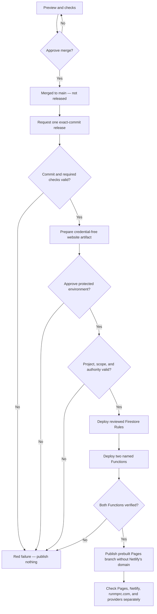
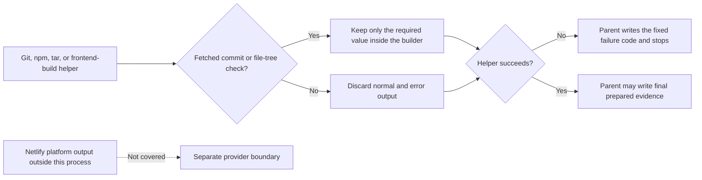
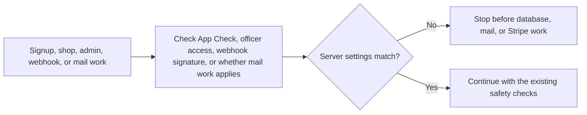
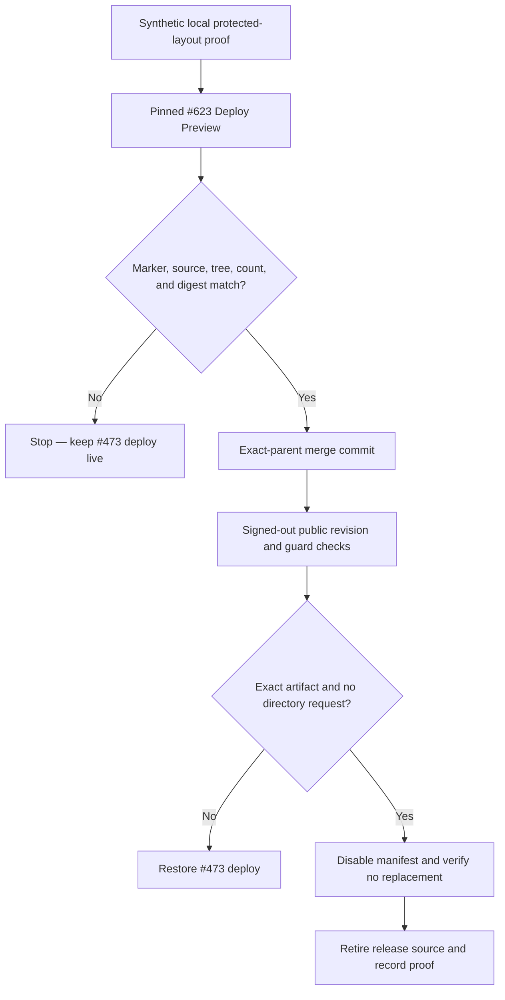
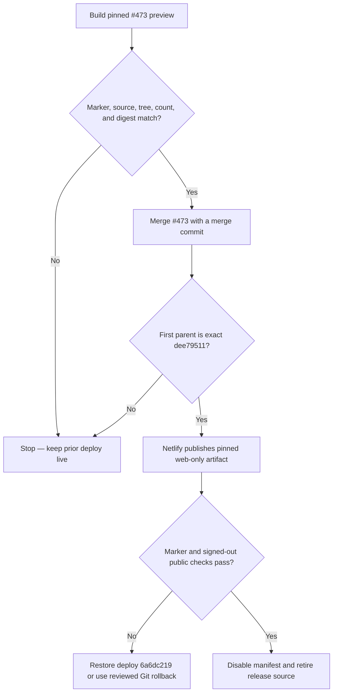
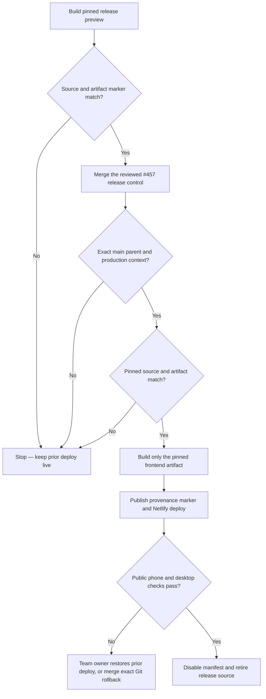

# Review, Merge, Release, and Check a Change

**Purpose:** review one change, merge it, approve one exact release, and record what did or did not become live.

**Merge approver:** the content or business owner named in the change request.

**Production release approver:** Dave Liu as platform owner until the board records a replacement, plus the required service/security reviewer for a high-risk change. Two named backup officers are still required under #133 before continuity is complete.

**Prerequisites:** one approved pull request aimed at `main`; green required checks; an exact 40-character merged commit; a rollback or safe roll-forward note; and a named observer.

**Protected release status:** **NOT AVAILABLE YET.** Issue #135 provides the fail-closed source gate. Issue #133 must still configure protected `staging` and `production` environments, their named reviewers, and a short-lived cloud identity. Public browser build values must be named repository or organization variables because artifact preparation has no protected-environment access; #133/#136 must record and verify them separately. Do not add a long-lived Firebase key as a shortcut.

**Live Netlify publication status:** a reusable protected release is **NOT AVAILABLE YET**. Ordinary Git-triggered production builds are paused by repository configuration. An overbroad #473 artifact was published and then rolled back on 2026-08-01. Bounded replacement deploy `6a6dc9ea588b0c0008036312`, exact source `39ab8649df411262c8109a3c81a57bc38f1e168b`, is production now. Shop is the static catalog; Events and Calendar show a fixed retry-later notice instead of a raw provider error. Event records remain unavailable because this did not deploy Firebase. #623 is a separate one-shot release under review for one frozen inert member-directory interface artifact. It is not published or verified, and the #473 deploy is its rollback target. GitHub Pages currently still claims the same custom domain; future source omits that claim, but #136/WEB-001 must publish and verify its removal.

## The release gate


```mermaid
flowchart TD
    Review["Preview and checks"] --> Merge{"Approve merge?"}
    Merge -- "No" --> Review
    Merge -- "Yes" --> Merged["Merged to main — not released"]
    Merged --> Request["Request one exact-commit release"]
    Request --> Preflight{"Commit and required checks valid?"}
    Preflight -- "No" --> Stop["Red failure — publish nothing"]
    Preflight -- "Yes" --> Prepare["Prepare credential-free website artifact"]
    Prepare --> Release{"Approve protected environment?"}
    Release -- "No" --> Stop
    Release -- "Yes" --> Gate{"Project, scope, and authority valid?"}
    Gate -- "No" --> Stop
    Gate -- "Yes" --> Rules["Deploy reviewed Firestore Rules"]
    Rules --> Functions["Deploy two named Functions"]
    Functions --> VerifyBackend{"Both Functions verified?"}
    VerifyBackend -- "No" --> Stop
    VerifyBackend -- "Yes" --> Pages["Publish prebuilt Pages branch without Netlify's domain"]
    Pages --> Verify["Check Pages, Netlify, runmprc.com, and providers separately"]
```

In words: merging does not release; a request checks one exact commit and may prepare a credential-free artifact; protected approval unlocks Firebase; only verified Firebase permits Pages publication.

## Current facts

As of **2026-07-13**, with the internal tooling note below checked from source on **2026-07-22**:

- `main` is the canonical branch.
- A merge starts CI checks. It does not start `.github/workflows/deploy.yml`.
- The release workflow accepts only a full commit already merged into `main`.
- It requires successful frontend, Functions, commerce command journal, test artifact scrubber, and Firestore Rules checks for that commit.
- Its only current release plan is the reviewed profile-recovery set: Firestore Rules, `createMemberOnSignUp`, and `ensureMemberProfile`.
- A caller cannot type a Firebase project or deployment target into the release form.
- Missing environment configuration or cloud authority makes the release red before backend dependencies, cloud authentication, or deployment. A public website artifact may be prepared without cloud authority, but it cannot be published.
- The backend uses a short-lived cloud identity when #133 configures it. The website job receives public browser values only.
- The Firebase CLI comes from the committed lockfile. The release does not install `latest`.
- Source checked on 2026-07-22 pins the internal Firebase CLI to 15.24.0, and its emulator checks use Java 21. Officers do not install or run either tool; the platform maintainer owns them. This source change does not alter the release diagram or prove that Firebase was deployed. The provider and live-host facts below were not reverified for this tooling update.
- Source checked on 2026-08-01 pins every root brace-expansion dependency family to reviewed compatible releases 1.1.18, 2.1.4, and 5.0.9 after a new advisory and follow-up bypass fixes. This is internal dependency evidence only. Officers do not install packages, run audit commands, or resolve dependency warnings; the platform maintainer owns those tasks. The separate minimatch finding remains open. This source change does not publish a website, deploy Firebase, change a provider, or prove live behavior.
- A production Pages publication job cannot start until Firebase deployment and Function verification succeed.
- The `staging` option deliberately stops before deployment until #113/#133 name one exact approved staging Firebase project. A future staging release remains backend-only until a separate staging browser configuration and host exist.
- `runmprc.com` is served by Netlify, not GitHub Pages.
- GitHub Pages currently reports `runmprc.com` as its custom domain and redirects its normal address there. It is not an independently reachable copy today.
- Future source stops writing that Pages domain claim. Only provider readback after #136/WEB-001 can prove it cleared.
- Ordinary Git-triggered Netlify production builds are paused. The completed #473 exception used one exact two-parent merge and pinned source/tree/artifact; its release source is retired. #623 temporarily arms a new exact-parent one-shot under review. It must publish only its frozen artifact, pass signed-out readback, and be re-paused immediately.
- Live race signup, merchandise payments, and refunds remain unavailable.
- CONFIG-001B1 [#151](https://github.com/Run-MPRC/Run-MPRC.github.io/issues/151) adds source enforcement for a server-only commerce pause. It is not in the fixed profile-recovery release plan, is not deployed, and has no approved officer control. A future reviewed plan must deploy the complete guarded Function set with the deploy ceiling and every runtime/resource flag off, then prove signed webhooks still work. Do not widen the current plan by hand.

### Netlify release-build failure output — SOURCE ONLY, NOT LIVE

**Purpose:** confirm that the final source wrapper reports a failed release preparation with one fixed code and does not pass through helper-program output. The code does not say why preparation failed. It does not prove that Netlify published anything.

**Approver:** platform owner plus security reviewer. This is not an officer-operated release control.

**Prerequisites:** issues #582 and #596; one exact pull request and commit for each source boundary; synthetic tests with made-up warning values and local helper programs; the inactive temporary Netlify manifest; a reviewed undo; and confirmation that nobody ran a production release or contacted a provider to test either source change.


```mermaid
flowchart LR
    Child["Git, npm, tar, or frontend-build helper"] --> Kind{"Fetched commit or file-tree check?"}
    Kind -- "Yes" --> Internal["Keep only the required value inside the builder"]
    Kind -- "No" --> Hidden["Discard normal and error output"]
    Internal --> Result{"Helper succeeds?"}
    Hidden --> Result
    Result -- "No" --> Fixed["Parent writes the fixed failure code and stops"]
    Result -- "Yes" --> Evidence["Parent may write final prepared evidence"]
    Outside["Netlify platform output outside this process"] -. "Not covered" .-> Separate["Separate provider boundary"]
```

In words: the builder keeps fetched commit and file-tree values only for its internal check. It leaves all other helper output out of the build record. A helper failure leaves only the fixed parent code, while success may produce the existing final parent evidence. Netlify platform output outside the builder remains separate.

1. Ask the platform maintainer for the exact issues, pull requests, and commits.
2. Confirm the failure tests used only made-up values.
3. Confirm the helper-output tests used only made-up local helpers and no network.
4. Confirm the shared helper check covered a helper that ended with an error and one that was stopped.
5. Confirm the fetched-commit and file-tree checks each covered a failure.
6. Confirm each synthetic failure stopped before any network, publication, or outside-provider action.
7. Read the redacted test summary.
8. Confirm every failed wrapper's complete error-output line is `netlify_release_build_failed`.
9. Confirm every failed wrapper had no normal output and an unsuccessful status.
10. Confirm no helper output, failure message, detailed error trail, file location, website address, secret-shaped made-up value, or made-up inspection-warning value appeared.
11. Confirm reviewed source has no connection that copies helper output into the build record.
12. Confirm the full artifact-safety and release-workflow checks passed.
13. Confirm review found exact Git comparison, cleanup, artifacts, and the successful parent evidence line unchanged.
14. Record source, tests, merge, Netlify publication, website publication, `runmprc.com` verification, Firebase, provider, production data, and live behavior as separate states.

**Expected result:** the outer wrapper does not read or echo its caught value. Helper programs add no normal or error output to the build record. Required fetched-commit and file-tree values remain internal. A failure leaves only the fixed parent code. The code means only that preparation failed. This check does not cover Netlify platform output outside the builder or prove that the complete provider log is safe.

**Stop conditions:** stop if anyone asks for a real credential, private provider value, production run, or raw log. Stop if a failed wrapper has normal output, more than the fixed error-output code, or a successful status. Stop if output contains helper detail, a thrown value, stack, path, URL, token-shaped value, or private data. Stop if anyone calls the whole provider log sanitized or treats the fixed code as publication proof.

**Success proof:** keep the old-source failure summaries, green synthetic wrapper and made-up-helper results, the no-helper-output-connection check, complete artifact-safety and release-workflow results, reviewed commits, and separate statements for every delivery state. State plainly that Netlify, the website, `runmprc.com`, Firebase, outside providers, production data, and live behavior were not changed or verified unless each has separate dated proof.

**Undo:** use one reviewed revert or safe roll-forward pull request. Never restore raw caught-error logging or copy helper output into the build record. Never rerun production only to discover the cause.

**Escalation:** contact the platform and security owners. If an earlier log may contain a sensitive value, use the private incident path. Do not copy the value into GitHub, a screenshot, email, or an AI tool.

### Commerce server safety gate — SOURCE ONLY, NOT DEPLOYED

Issue [#149](https://github.com/Run-MPRC/Run-MPRC.github.io/issues/149) adds a source-code check for the server environment, website address, Stripe test/live mode, and server-key mode. It does not configure Firebase or Stripe. It does not make payments available.


```mermaid
flowchart LR
    Request["Signup, shop, admin, webhook, or mail work"] --> Identity["Check App Check, officer access, webhook signature, or whether mail work applies"]
    Identity --> Config{"Server settings match?"}
    Config -- "No" --> Stop["Stop before database, mail, or Stripe work"]
    Config -- "Yes" --> Continue["Continue with the existing safety checks"]
```

In words: the server first checks identity, the webhook signature, or whether mail work applies. Wrong or missing settings then stop qualifying work before business data, email, or Stripe can change.

If a member or officer sees **Server configuration is unavailable**:

1. Stop.
2. Do not retry checkout, refund, or late registration.
3. Record the page and time without member or payment details.
4. Ask the platform owner to check the private environment record.
5. Never paste a key, setting value, screenshot of a console, or member details into an issue or AI tool.

**Expected result:** no registration, order, refund, mail, or Stripe object is created while settings are invalid.

**Undo:** revert the reviewed source change if it causes a false stop. Never restore a default production website address.

**Escalation:** platform owner, then the finance owner if a payment might already exist in Stripe.

## Before merge

1. Open the pull request.
2. Confirm its destination is `main`.
3. Confirm it names one issue and one outcome.
4. Confirm another person or review agent approved it.
5. Open the `Frontend lint + build` job.
6. Confirm `Run frontend Jest tests` is present and green.
7. Confirm `Run SPA callback safety tests` is present and green.
8. Confirm `Commerce command journal emulator` is present and green. It uses made-up payment-command records and does not contact Stripe.
9. Confirm `Test artifact scrubber` is green. It proves the deliberate made-up output scan ran. It does not prove a report was uploaded or a live service changed.
10. Confirm the Functions and Firestore Rules jobs are green.
11. Use a preview only for public, read-only pages.
12. Do not sign in, pass a private or administrator guard, submit forms, or test signup, checkout, refund, email, or Strava in a preview. A separately reviewed exact-artifact procedure may check only the signed-out guard.
13. Confirm the officer guide and undo note are present.
14. Approve or reject the merge. Do not describe merge approval as release approval.

## After merge

1. Record the pull request number.
2. Record the full merged commit.
3. Wait for that commit's CI jobs.
4. Confirm all five named jobs are green again: Frontend, Functions, commerce command journal, test artifact scrubber, and Firestore Rules.
5. Mark the result **merged — not released**.
6. Do not expect GitHub Pages, Firebase, Netlify, or `runmprc.com` to change from a merge unless a separate exact temporary release is explicitly armed and reviewed.
7. For any other merge, if Netlify unexpectedly publishes, stop and treat it as a hosting incident.

## Temporary #623 inert member-directory interface release — UNDER REVIEW; NOT PUBLISHED

**Purpose:** publish only the visibly disabled My Account profile-photo/finder-choice interface and the administrator-guarded People finder layout. This is an interface preview. It does not connect the private backend, read or save a setting, accept or upload a photo, search a name, or show a person.

**Approver:** Dave Liu as platform owner, plus the privacy/security reviewer. This is not an officer-operated control.

**Prerequisites:** approved issue [#623](https://github.com/Run-MPRC/Run-MPRC.github.io/issues/623) with no newer blocker; exact release ID `WEB-002C-MEMBER-DIRECTORY-PREVIEW-2026-08-13`; green exact-head checks; successful pinned Deploy Preview; source commit `c2d87d1f69f15e128a0bc9b1b9f915b7c8417aec`; source tree `411aa6ec9a9459f5d923030533ffc7c007fe6908`; 62-file digest `d837272a1e5efc1575809e87f532276b38d1a63f1dd79ec1aef0533f6da8afb1`; exact first parent `019353361210021483f23003e09ee6924b78e67c`; current production and rollback deploy `6a6dc9ea588b0c0008036312`; current live source `39ab8649df411262c8109a3c81a57bc38f1e168b`; release source `codex/netlify-source-623-member-directory-preview`; rollback source `codex/netlify-source-623-rollback`; an executable diff proving only the inert interface was added to the live source; synthetic protected-layout proof; a prepared manifest-disable change; a named signed-out public observer; and no other `main` merge until verification and repause finish.


```mermaid
flowchart TD
    Synthetic["Synthetic local protected-layout proof"] --> Preview["Pinned #623 Deploy Preview"]
    Preview --> Match{"Marker, source, tree, count, and digest match?"}
    Match -- "No" --> Keep["Stop — keep #473 deploy live"]
    Match -- "Yes" --> Merge["Exact-parent merge commit"]
    Merge --> Public["Signed-out public revision and guard checks"]
    Public --> Good{"Exact artifact and no directory request?"}
    Good -- "No" --> Rollback["Restore #473 deploy"]
    Good -- "Yes" --> Repause["Disable manifest and verify no replacement"]
    Repause --> Retire["Retire release source and record proof"]
```

In words: synthetic local artifacts prove the protected disabled layouts. The release preview must match the exact frozen artifact. Only the exact-parent merge may publish it. Signed-out public checks then prove only the revision, normal guards, and absence of a directory request. A mismatch leaves or restores the current #473 deploy; a success is immediately re-paused.

1. Confirm the release pull request targets `main`.
2. Confirm its exact head and every required check are current and green.
3. Confirm the frozen source commit, tree, file count, and digest match the prerequisites.
4. Confirm the executable delta from live source `39ab8649df411262c8109a3c81a57bc38f1e168b` contains only the inert Account and People finder interface.
5. Confirm synthetic local evidence shows both protected layouts at desktop and 320-pixel widths.
6. Confirm that evidence uses only a made-up account and contains no real name or photo.
7. Confirm every related file, checkbox, name, and Search control is disabled.
8. Confirm no preview branch reads saved directory state, creates a request, calls a directory service, or shows a person.
9. Open the Deploy Preview's `/.well-known/run-mprc-release.json` marker.
10. Confirm the marker's control commit is the exact pull-request head.
11. Confirm the marker's source, tree, previous source, rollback deploy, count, and digest match the prerequisites.
12. Confirm the preview marker uses HTTPS, JSON content type, `Cache-Control: no-store`, `X-Content-Type-Options: nosniff`, and HSTS.
13. Confirm the preview has `X-Robots-Tag: noindex`.
14. Stay signed out and open `/account`.
15. Confirm the normal sign-in boundary remains.
16. Stay signed out and open `/admin/member-directory`.
17. Confirm the normal administrator boundary remains.
18. Confirm the anonymous preview network record contains no member-directory callable request.
19. Confirm the prepared manifest-disable change and rollback ref are ready.
20. Re-read the issue and pull-request comments.
21. Stop for any unresolved blocker posted after the last review.
22. Confirm `main` is still exact commit `019353361210021483f23003e09ee6924b78e67c`.
23. Merge with a merge commit. Do not squash or rebase.
24. Confirm the production attempt uses that exact two-parent merge.
25. Read the live public marker.
26. Confirm its control commit is the exact release merge.
27. Confirm its stable source, tree, previous source, rollback deploy, count, and digest equal the preview.
28. Stay signed out and repeat the `/account` and `/admin/member-directory` guard checks on `runmprc.com` at phone and computer widths.
29. Confirm the anonymous production network record contains no member-directory callable request.
30. Record the deploy, release merge, source, tree, count, digest, marker, guards, widths, network result, and check time.
31. Merge the prepared manifest-disable change immediately.
32. Confirm its Netlify attempt does not replace the verified deploy.
33. Read the public marker again and confirm the verified deploy remains live.
34. Retire the #623 release source and verify it is absent.

**Expected result:** if every gate passes, Netlify serves exactly the frozen inert interface. My Account remains behind sign-in, the People finder remains behind the administrator guard, and no member-directory request is available to a signed-out observer. Protected layouts remain synthetic proof only. The release does not deploy Firebase, Rules, Functions, or indexes; configure a provider; change sign-in, accounts, or production data; or make the backend available. Connected behavior remains **NOT AVAILABLE YET** under #507.

**Stop conditions:** stop if `main` advances; a branch, context, source, tree, count, digest, parent, marker, page, guard, network record, or repause result differs; the preview is missing; rollback is unavailable; a protected control is enabled; a public check asks for sign-in or private data; a real name or photo appears; a member-directory request is made; another production attempt starts; or any blocker remains open.

**Success proof:** keep the public deploy and marker links, exact hashes, check time, phone/computer widths, signed-out guard results, anonymous no-directory-request record, repause attempt, retained-deploy readback, and one redacted public screenshot if it contains no private content. Record Firebase, provider configuration, account/sign-in changes, and production-data changes as not performed. Do not call synthetic protected-layout proof public production proof.

**Undo:** before publication, leave deploy `6a6dc9ea588b0c0008036312` live. If the wrong result publishes, ask the Netlify team owner to restore that same deploy. If provider restore is unavailable, use only the reviewed exact-parent rollback pinned to source `39ab8649df411262c8109a3c81a57bc38f1e168b`, then rerun its exact preview and checks. Disabling the manifest alone does not roll back an already published deploy.

**Escalation:** platform owner first; privacy/security owner second; membership lead if the layout or promise is wrong. Use the private incident path if a real name, photo, account, or directory request appears.

## Temporary #473 permissions-containment release — COMPLETED 2026-08-01

**Completed status:** merge `9ad6837756cdd409d296009fde5082eeeae5c059` published Netlify deploy `6a6dc9ea588b0c0008036312`. The public marker matched source `39ab8649df411262c8109a3c81a57bc38f1e168b`, tree `d76b496cdc5e79015bc048cb961758abbe88b9ce`, 60 files, and digest `07b10c7d5ff176a1ad893d7549b07042312df35f4a4126e8765824ca94eaefb8`. Preview and live route/header/robots/browser checks passed. Shop, Events, Calendar, and signed-out Account were readable; no raw provider error appeared. Final control merge `cb6a8f0a418fc14b448bce5ded71d68520415c92` made the temporary manifest inactive; Netlify attempt `6a6dcdd47bc81e000859a249` stopped unpublished, exact-main CI run `30696264830` passed all five jobs, and readback left the same bounded deploy and marker live. Both temporary release-source refs are absent; exact rollback source `ed1b0833f25822cee80c99ded8753722b5608a3f` remains. Event records remain unavailable because Firebase was unchanged.

**Purpose:** make Shop usable as the approved $10 Hat/$25 Jacket pickup catalog and replace raw provider errors on Events and Calendar with one accessible retry-later notice. This is display containment only; it does not restore event records.

**Approver:** Dave Liu as platform owner. This is not an officer-operated control.

**Prerequisites:** approved issue #473 with no newer blocker; green exact-head checks; successful pinned Deploy Preview; source commit `39ab8649df411262c8109a3c81a57bc38f1e168b`; source tree `d76b496cdc5e79015bc048cb961758abbe88b9ce`; 60-file digest `07b10c7d5ff176a1ad893d7549b07042312df35f4a4126e8765824ca94eaefb8`; exact first parent `dee79511b6e371329aa129139729e112e7a51aad`; current production deploy `6a6dc219a8136300081811db`; live artifact source `ed1b0833f25822cee80c99ded8753722b5608a3f`, tree `878c6628d961f4484cb49208aef53f1e9f2e3b47`, 60 files, and digest `7570955c2a00926e5813aef135f1799172cfd046072ac89fb4e492bed0797092`; dedicated release source `codex/netlify-source-473-permissions-containment-v2` pinned by exact commit and tree; dedicated rollback source `codex/netlify-source-473-rollback` pinned to that live artifact source; an executable diff proving only the three named pages changed from the live source; two focused synthetic test changes; a prepared manifest-disable change; a prepared exact Git rollback projection; a named public observer; and no other `main` merge until verification finishes.


```mermaid
flowchart TD
    Preview["Build pinned #473 preview"] --> Match{"Marker, source, tree, count, and digest match?"}
    Match -- "No" --> Stop["Stop — keep prior deploy live"]
    Match -- "Yes" --> Merge["Merge #473 with a merge commit"]
    Merge --> Parent{"First parent is exact dee79511?"}
    Parent -- "No" --> Stop
    Parent -- "Yes" --> Publish["Netlify publishes pinned web-only artifact"]
    Publish --> Verify{"Marker and signed-out public checks pass?"}
    Verify -- "No" --> Undo["Restore deploy 6a6dc219 or use reviewed Git rollback"]
    Verify -- "Yes" --> Retire["Disable manifest and retire release source"]
```

In words: the exact #473 preview must match the pinned source and artifact; only a merge whose first parent is the recorded `main` commit may publish it; successful live checks retire the temporary authority, while any mismatch leaves or restores the prior deploy.

1. Confirm the release pull request targets `main`.
2. Confirm its head and all required checks are current and green.
3. Open its public marker. Confirm its control commit is the exact pull-request head. Compare its source commit, tree, previous source, rollback deploy, file count, and digest with the prerequisites.
4. Compare the executable source and built artifact with live source `ed1b0833`. Stop unless the only runtime changes are the static Shop and fixed Events/Calendar failure displays.
5. Stay signed out. Open `/shop`, `/events`, `/events/calendar`, and `/account` in the preview.
6. Confirm `/shop/mprc-hat` and `/events/calendar` each return HTTP 200 without a redirect loop.
7. Confirm the marker response uses HTTPS, `Cache-Control: no-store`, JSON content type, `X-Content-Type-Options: nosniff`, and HSTS. Confirm the preview has `X-Robots-Tag: noindex`.
8. Open `/robots.txt`. Confirm it returns HTTP 200 and still disallows `/admin` and `/login`.
9. Ask the platform owner to check the browser error console on the preview pages. Stop for any new release error.
10. Confirm the prepared manifest-disable change and exact live-artifact Git rollback projection are ready.
11. Re-read the issue and pull request comments. Stop for any unresolved blocker posted after the last review.
12. Confirm `main` is still exact commit `dee79511b6e371329aa129139729e112e7a51aad`.
13. Merge with a merge commit. Do not squash or rebase.
14. Confirm the production attempt uses that exact merge.
15. Read the live public marker. Confirm its control commit is the exact two-parent merge. Compare the stable source, tree, previous-source, rollback, count, and digest fields with the preview and prerequisites. The preview and live control commits must differ.
16. Stay signed out. Check `/shop`, `/events`, `/events/calendar`, and `/account` at phone and computer widths. Do not sign in, register, buy, or submit a form.
17. Repeat the HTTP-200 deep-route, marker-header, `/robots.txt`, and browser-console checks against `runmprc.com`.
18. Confirm the Shop shows the $10 Hat and $25 Jacket, Treasurer pickup, cash, and Venmo. Confirm Events and Calendar show the fixed retry-later alert and never the raw provider error. The alert is expected containment, not proof that event data works.
19. Record the deploy, control/source commits, tree, count, digest, route/header/robots/console results, check time, and result.
20. If every check passes, disable the manifest, confirm that later production builds skip, retire the release source, and verify it is absent.

**Expected result:** Netlify serves the exact pinned artifact; its public marker proves provenance; Shop is the approved display-only catalog; Events and Calendar remain readable and disclose no raw provider error. Event records remain unavailable until a separate protected Firebase repair is approved, deployed, and verified. Firebase, outside-provider configuration, accounts, protected offers, officer editing, and production data are unchanged by this release.

**Stop conditions:** stop if `main` advances; a hash, ref, count, digest, parent, context, marker, or page differs; the preview is missing; rollback is unavailable; a deep route is not HTTP 200; a required header or robots rule is missing; the browser console shows a new release error; another production attempt starts; a public check asks for private data; or any check fails.

**Success proof:** keep the public deploy and marker links, exact hashes, check time, two viewport sizes, deep-route status, bounded header and robots results, browser-console result, and one redacted public screenshot. Keep settings, logs, credentials, member data, and promo values out of public evidence.

**Undo:** if nothing publishes, leave deploy `6a6dc219a8136300081811db` live. If the wrong result publishes, ask the Netlify team owner to restore that deploy. If atomic restore is unavailable, refresh and review an exact-parent Git rollback pinned to live artifact source `ed1b0833f25822cee80c99ded8753722b5608a3f` and tree `878c6628d961f4484cb49208aef53f1e9f2e3b47`; rerun its exact preview before merging. Disabling the manifest alone is not rollback.

**Incident evidence:** overbroad source `094af1096ed8721597561cd59bf695d4c4a9d210` was published by merge `40728ff6141e34a279b70cc41d983c22ac5f0daa` as deploy `6a6dc0167fbe68000816b448` after a blocker was posted. Rollback merge `1099ee8e6fdb81141fd9460de175b6d854cbcfdd` published exact prior source `ed1b0833f25822cee80c99ded8753722b5608a3f` as deploy `6a6dc219a8136300081811db`. Safety merge `dee79511b6e371329aa129139729e112e7a51aad` re-paused the manifest; Netlify attempt `6a6dc35767a4ef000877e74b` did not replace production. The broad source ref was removed. This record is why steps 4 and 11 are mandatory.

**Escalation:** platform owner first; website/content owner second; security owner if private data or an unexpected application version appears.

## Temporary #457 Netlify web release

**Purpose:** publish only the already reviewed Events, Shop, and My Account header tree without publishing the unrelated application work now on `main`.

**Completed status:** production deploy `6a61c544171ea80008307623`, trigger commit `4f67e6cafb975a3f985fefc67f094b3a37526702`, and the public marker were verified on 2026-07-23 America/Los_Angeles at 1280px desktop and 390px phone widths. Events and Shop showed their images and readable headings below the navigation. Signed-out `/account` redirected to the readable image-backed Login page. Firebase and outside providers were unchanged. The release source was then retired; this procedure is retained as dated evidence, not as an available release button.

**Approver:** Dave Liu as platform owner. This is not an officer-operated control.

**Prerequisites:** issue #457 approval; green checks; a successful pinned Netlify Deploy Preview; exact source commit `ed1b0833f25822cee80c99ded8753722b5608a3f`; exact source tree `878c6628d961f4484cb49208aef53f1e9f2e3b47`; exact 60-file artifact digest `7570955c2a00926e5813aef135f1799172cfd046072ac89fb4e492bed0797092`; prior live deploy `6a54a3c93db9d300082e1f5f`; release source `codex/netlify-source-457-header`; rollback source `codex/netlify-source-457-rollback`; a prepared manifest-disable pull request; a reviewed exact Git rollback projection; and no other `main` merge until verification ends. The current identity cannot click Netlify's atomic restore, so a Netlify team owner is preferred for fast rollback and the exact Git projection is the available fallback.


```mermaid
flowchart TD
    Preview["Build pinned release preview"] --> PreviewCheck{"Source and artifact marker match?"}
    PreviewCheck -- "No" --> Stop["Stop — keep prior deploy live"]
    PreviewCheck -- "Yes" --> Merge["Merge the reviewed #457 release control"]
    Merge --> Parent{"Exact main parent and production context?"}
    Parent -- "No" --> Stop["Stop — keep prior deploy live"]
    Parent -- "Yes" --> Source{"Pinned source and artifact match?"}
    Source -- "No" --> Stop
    Source -- "Yes" --> Build["Build only the pinned frontend artifact"]
    Build --> Proof["Publish provenance marker and Netlify deploy"]
    Proof --> Check{"Public phone and desktop checks pass?"}
    Check -- "No" --> Rollback["Team owner restores prior deploy, or merge exact Git rollback"]
    Check -- "Yes" --> Disable["Disable manifest and retire release source"]
```

In words: the release preview and production must contain the same pinned frontend artifact; only the exact #457 merge may publish it; then the maintainer checks the live site and retires the exception, or a Netlify team owner restores the prior deploy, with the prepared exact Git rollback as fallback.

1. Confirm the release pull request targets `main` and contains the exact active manifest.
2. Confirm another reviewer approved the source, gate, tests, and officer wording.
3. Open the release Deploy Preview's `/.well-known/run-mprc-release.json`. Confirm its source commit, source tree, file count, and artifact digest exactly match the prerequisites.
4. Stay signed out and check the three public routes in that pinned preview. Do not register, buy, sign in, or submit a form.
5. Confirm the manifest-disable pull request and exact previous-source rollback projection are ready.
6. Confirm `main` is still the exact parent named in the manifest.
7. Merge with a merge commit. Do not squash or rebase this release.
8. Watch the Netlify production attempt. Stop if its trigger commit is not that merge.
9. Open the live `/.well-known/run-mprc-release.json`. Confirm its source commit, tree, count, and digest equal the preview and prerequisites. Do not copy private logs or settings.
10. Stay signed out. Check `/events`, `/shop`, and `/account` at phone and normal computer sizes. Do not register, buy, sign in, or submit a form.
11. Confirm the pages have an image, one readable page title, and no title hidden behind the navigation.
12. Record the deploy URL, trigger commit, source commit/tree, public marker, date, browser sizes, and result.
13. If all checks pass, merge the manifest-disable pull request, confirm Netlify skips it without replacing the verified deploy, delete `codex/netlify-source-457-header`, and verify that release source no longer exists.

**Expected result:** Netlify serves the pinned #457 frontend tree, the public marker proves its source, the three page headers are readable, Firebase and production data are unchanged, and later ordinary merges remain paused.

**Stop conditions:** stop if the pinned preview is missing; `main` advanced; any hash, digest, count, ref, context, branch, or marker differs; Netlify builds the accumulated `main` application; neither a Netlify team owner nor the reviewed Git rollback projection is available; another production attempt starts; a page asks for private data; or any public check fails.

**Success proof:** keep the public deploy link and marker, exact hashes, check date, phone/desktop sizes, and a redacted public screenshot. Keep settings, logs, credentials, and member data out of public evidence.

**Undo:** if nothing published, leave the prior deploy live. If the wrong result published, ask a Netlify team owner to restore deploy `6a54a3c93db9d300082e1f5f`. If that owner is unavailable, rebase the prepared rollback projection onto the exact current `main`, set its expected parent to that same current `main` commit, and verify its preview still pins previous source `e86a0f702cff6495f50630c5de3337290db8b8cb`. Confirm `main` has not advanced, then merge that exact rollback projection with a merge commit. Stop, refresh the projection, and rerun its checks and preview if `main` changes at any point. Disabling the source manifest prevents builds of later `main` commits but does not roll back an already published deploy; deleting the release-specific source ref makes a later rebuild of the old release commit fail its fetch.

**Escalation:** platform owner first; website/content owner second. Escalate to the security owner if private data or an unexpected application version appears.

## Before a protected release — NOT AVAILABLE YET

Do not use this section until #133 records that both GitHub environments are protected and tested.

1. Choose `staging` or `production`.
2. Copy the exact 40-character merged commit. Do not use a branch name.
3. Choose the fixed release plan. Do not type a project or Function name.
4. Confirm the environment's Firebase project is the approved one.
5. Confirm the required checks belong to the same exact commit.
6. Confirm the rollback or safe roll-forward commit.
7. Confirm the named observer is available.
8. Ask the platform maintainer to request the manual release.
9. Record the release-run link.
10. Wait for the exact-commit checks and credential-free artifact preparation.
11. Have the named reviewer confirm the environment, commit, fixed plan, and undo note before approving the protected environment.
12. Do not approve a request older than 24 hours. Start a new request from the current `main` commit.

## Watch the release — NOT AVAILABLE YET

1. Confirm preflight says the exact commit is merged and its checks passed.
2. For production, confirm the credential-free website artifact was prepared from that commit.
3. Confirm the named protected-environment approval is recorded before the backend job.
4. Confirm protected configuration is present and environment-matched.
5. Confirm short-lived cloud authentication succeeds.
6. Confirm Firestore Rules deploy first.
7. Confirm only `createMemberOnSignUp` and `ensureMemberProfile` deploy next.
8. Confirm both Functions are found by the verification step.
9. Stop if any backend step is missing, skipped, failed, partial, or mismatched.
10. Confirm the GitHub Pages publication job starts only after backend success.
11. Confirm the Pages artifact uses the same exact commit.
12. Never call an overall green run proof that `runmprc.com` changed.

## Verify every affected surface

1. Record whether the GitHub Pages branch published and whether provider readback shows its old `runmprc.com` claim is gone.
2. Ask the Netlify owner which commit, if any, Netlify published. For any reviewed exact-artifact Netlify exception, also read the public `/.well-known/run-mprc-release.json` marker and verify its source commit and tree.
3. Open [runmprc.com](https://runmprc.com) in a private window.
4. Visit the exact changed public page.
5. Check one phone-sized view.
6. Check one normal computer view.
7. If Firebase changed, obtain dated proof for the exact project, Rules release, and named Functions.
8. If an outside provider changed, obtain separate dated proof from its owner.
9. Use made-up data only. Do not inspect or change a real member record.
10. Complete the delivery record.

### Check keyboard focus after an approved website publication — NOT AVAILABLE YET

**Purpose:** prove that a person using a keyboard can see which public link, button, or navigation control is active.

**Approver:** the named release observer, with the platform owner or accessibility reviewer available if the check fails.

**Prerequisites:** protected website publication must be available; the exact approved commit must be live and identified by the host; the public site must be safe to open without signing in; and the observer must use a normal computer with a keyboard. Publication is still **NOT AVAILABLE YET** under #133/#136, so do not record live proof from this procedure until those prerequisites are met.

1. Open the public website in a private browser window.
2. Confirm the host identifies the exact approved commit.
3. Stay signed out. Do not submit a form or enter member, payment, or private data.
4. Press `Tab` once. Confirm the skip link appears with a visible yellow-and-dark focus ring.
5. Continue pressing `Tab` through the public navigation and one public page action.
6. Open the public Events page and repeat the keyboard check without registering.
7. Open the public Shop page and repeat the keyboard check without starting checkout.
8. Press `Shift` and `Tab` together to confirm the focus ring remains visible when moving backward.
9. Record the exact commit, public pages, browser, date, time, and one redacted public screenshot.

**Expected result:** every focused public link, button, and navigation control has a clearly visible yellow-and-dark ring; the ring is not clipped; focus moves in a sensible order; and keyboard movement does not open, submit, or change anything by itself. A mouse-only click does not need to show the same ring.

**Stop conditions:** stop if the exact live commit is unknown, the ring is missing or hard to distinguish, the ring is clipped, focus moves to an invisible control, focus becomes trapped, the page changes without activation, or the check asks for sign-in or real data.

**Success proof:** keep the exact commit and host readback, the named public pages, browser, check time, and one redacted screenshot that contains no member or payment data.

**Undo:** do not edit live CSS or provider files by hand. Open a small tracked issue and reviewed pull request to revert or safely correct the focus rule, then use the same protected publication path. Record the exact undo commit.

**Escalation:** platform owner first, then the accessibility reviewer or backup release officer. Treat an unexpected live publication as a hosting incident.

## Expected result

Merge, release approval, Firebase deployment, backend verification, Pages publication, Netlify publication, `runmprc.com`, and provider verification are recorded as separate states. A backend failure or missing authority leaves the website unpublished.

## Stop conditions

Stop and contact the platform owner if:

- The pull request does not target `main`.
- Approval, required checks, or the undo note is missing.
- The release uses a branch name or short commit.
- The commit is not merged into `main`.
- The release request is more than 24 hours old.
- The environment, project, or fixed scope is missing or wrong.
- The site reports **Server configuration is unavailable**.
- Anyone asks for a service-account key, token, password, or recovery code.
- Firebase is skipped, partial, failed, or unverified.
- A website publication job starts before backend verification.
- A project or deployment target can be typed freely.
- Netlify publishes unexpectedly or its live commit is unknown.
- A test needs real member, payment, or private data.
- `Test artifact scrubber` is missing or red, or anyone asks you to bypass it.

## Success proof

Keep the completed record with links to the issue, pull request, merged commit, exact CI jobs, release run, and each affected live service. Keep provider identifiers, private links, logs, credentials, and member data out of public evidence.

## Delivery record

```text
Issue:
Pull request:
Merged commit (40 characters):
Required checks passed:
Release requested by:
Release approved by:
Environment: staging / production / not released
Release plan:
Preflight: pass / fail / not run
Firebase Rules deployed: yes / no / not run
Named Functions deployed and verified: yes / no / not run
GitHub Pages published: yes / no / not run
Netlify intended commit verified: yes / no / unknown
runmprc.com verified: yes / no
Outside provider configured: yes / no / not relevant
Outside provider verified: yes / no / not relevant
Production behavior verified: yes / no
Checked by:
Checked at (date and time):
Undo or safe roll-forward commit:
Known remaining problem:
```

## If anything fails

1. Do not rerun blindly.
2. Do not approve the Pages job after a backend failure.
3. Save the run link, exact commit, time, and a redacted screenshot.
4. If Rules changed but Functions failed, treat the backend as partial.
5. Ask the platform owner to restore the reviewed compatible backend set or safely roll forward.
6. Do not force-push, reset branches, delete data, edit Firestore by hand, or change DNS.

## Undo

Use one reviewed rollback or safe roll-forward commit through the same protected, backend-first gate. Restore a compatible Firebase set before publishing a dependent website. Before removing `Test artifact scrubber`, a platform maintainer must confirm that no later test-report job depends on its exact name. Never bypass the check to make a release pass. A Netlify rollback remains a provider-owner procedure and is **NOT AVAILABLE YET** for backup officers.

**Escalation:** platform owner plus backup for release/hosting; Firebase owner for backend; treasurer plus platform owner for commerce; privacy owner for member data. If real credentials, member details, or private links appear in output, stop and open a security incident. Do not copy the value into GitHub, a screenshot, email, or an AI tool.
