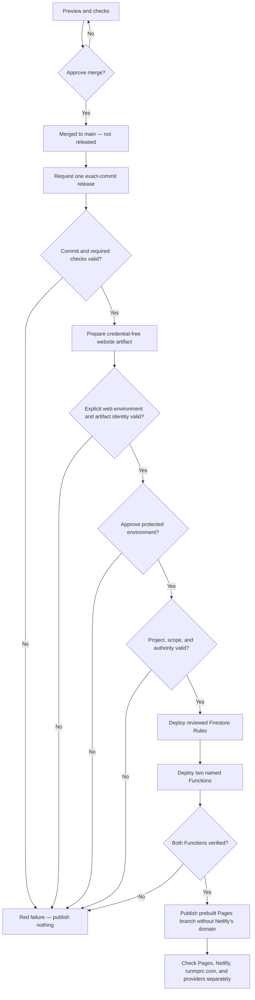
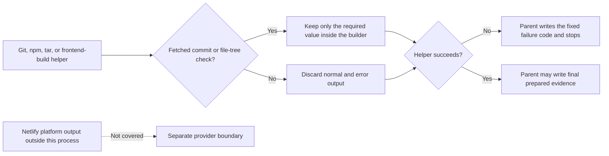
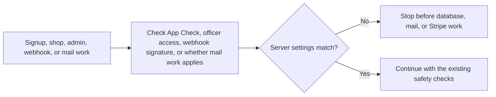
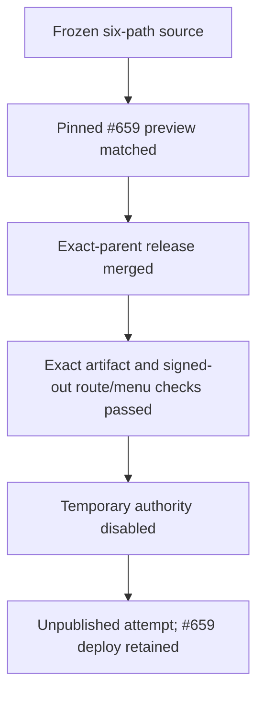
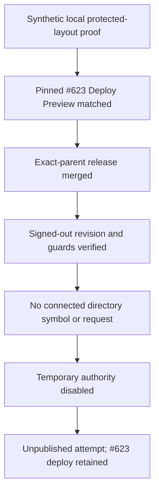
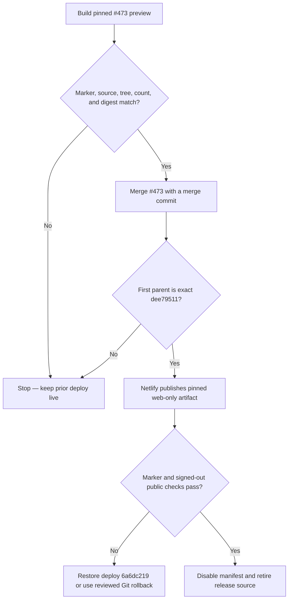
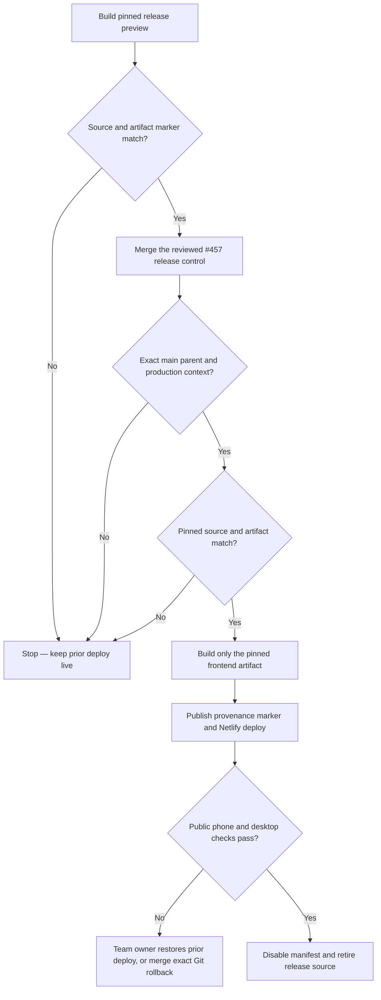
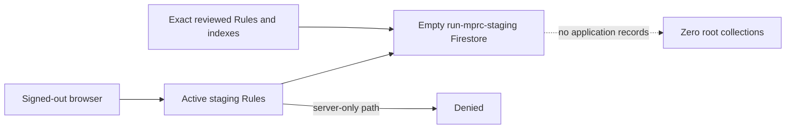
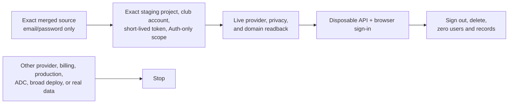
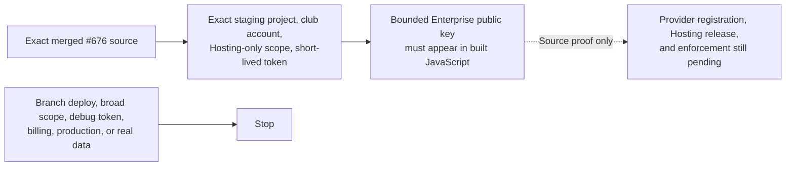

# Review, Merge, Release, and Check a Change

**Purpose:** review one change, merge it, approve one exact release, and record what did or did not become live.

**Merge approver:** the content or business owner named in the change request.

**Production release approver:** Dave Liu as platform owner until the board records a replacement, plus the required service/security reviewer for a high-risk change. Two named backup officers are still required under #133 before continuity is complete.

**Prerequisites:** one approved pull request aimed at `main`; green required checks; an exact 40-character merged commit; a rollback or safe roll-forward note; and a named observer.

**Protected release status:** **NOT AVAILABLE YET.** Issue #135 provides the fail-closed source gate. Issue #133 must still configure protected `staging` and `production` environments, their named reviewers, and a short-lived cloud identity. Public browser build values must be named repository or organization variables because artifact preparation has no protected-environment access; #133/#136 must record and verify them separately. Do not add a long-lived Firebase key as a shortcut.

**Firebase staging status:** **STATIC HOSTING, EMPTY FIRESTORE, DISPOSABLE EMAIL/PASSWORD AUTH PROOF, AND SOURCE-ONLY FUNCTION/HOSTING GUARDS AVAILABLE; OFFICER AND PRODUCTION RELEASE NOT AVAILABLE YET.** WEB-001A1 [#663](https://github.com/Run-MPRC/Run-MPRC.github.io/issues/663) requires controlled optimized builds to name staging or production and scans executable JavaScript for environment identity. WEB-001A2 [#665](https://github.com/Run-MPRC/Run-MPRC.github.io/issues/665) created the club-owned `run-mprc-staging` project and published exact merged source `a614c68d9a1a2be631a3be874a686d61e5d170a0` to [run-mprc-staging.web.app](https://run-mprc-staging.web.app). CI-001D1 [#669](https://github.com/Run-MPRC/Run-MPRC.github.io/issues/669) adds an empty delete-protected Firestore database and exact reviewed Rules/indexes; fixed anonymous server-only reads were denied and the root collection count remained zero. CI-001D2 [#671](https://github.com/Run-MPRC/Run-MPRC.github.io/issues/671) deploys password-required email/password Auth from exact merged source, verifies provider/privacy/domain settings, passes disposable API/browser sign-in checks, and returns the project to zero users and records. CI-001D3 [#674](https://github.com/Run-MPRC/Run-MPRC.github.io/issues/674) adds only a fail-closed code guard for the future paired profile Functions. CI-001D4 [#676](https://github.com/Run-MPRC/Run-MPRC.github.io/issues/676) adds a separate staging Hosting guard that requires the exact club account/project, Hosting-only scope, a short-lived token path, and a bounded Enterprise public site key in the executable artifact. Billing remains disabled, no open billing account is visible to the club account, and source does not prove a Function, key, App Check policy, or Hosting change. Officers do not sign in, enter information, run either command, configure App Check, attach billing, or use the site as a publish control. Until separate #676 provider/browser evidence exists, the site still has no Functions, live App Check, provider sandbox, protected short-lived publication, release marker, tested predecessor rollback, complete security headers, custom domain, or DNS/TLS change. Production Firebase Hosting remains empty, and Netlify still serves `runmprc.com`.

**Live Netlify publication status:** a reusable protected release is **NOT AVAILABLE YET**. Ordinary Git-triggered production builds are paused by repository configuration. An overbroad #473 artifact was published and then rolled back on 2026-08-01; bounded #473 deploy `6a6dc9ea588b0c0008036312` is older history. #623 completed the inert-directory predecessor and remains the immediate rollback as deploy `6a7e072f8f346b0008510d29`, source `c2d87d1f69f15e128a0bc9b1b9f915b7c8417aec`. #659 completed one separate exact-artifact accessibility release. Deploy `6a7ece87c5ca4d0007c1a3fc`, source `7496fe0881fb52908c4ff2f40f488df09c94c908`, is production now. Its exact marker/artifact and signed-out route-focus/menu checks passed. The manifest is inactive, temporary refs are absent, and the rollback ref remains. Shop is the static catalog; Events and Calendar show a fixed retry-later notice; the directory remains inert. Event records remain unavailable because this did not deploy Firebase. GitHub Pages currently still claims the same custom domain; future source omits that claim, but #136/WEB-001 must publish and verify its removal.

**Completed #659 exception:** WEB-002D [#659](https://github.com/Run-MPRC/Run-MPRC.github.io/issues/659) completed one exact-artifact accessibility release on 2026-08-14. The frozen source contains only reviewed #291 visible focus, #490 phone-menu disclosure/close behavior, and #657 client-side route focus. Production is deploy `6a7ece87c5ca4d0007c1a3fc`; #623 deploy `6a7e072f8f346b0008510d29` is its rollback target. This is not an officer-operated or reusable control. The no-terminal section below is retained as the audit record.

## The release gate


```mermaid
flowchart TD
    Review["Preview and checks"] --> Merge{"Approve merge?"}
    Merge -- "No" --> Review
    Merge -- "Yes" --> Merged["Merged to main — not released"]
    Merged --> Request["Request one exact-commit release"]
    Request --> Preflight{"Commit and required checks valid?"}
    Preflight -- "No" --> Stop["Red failure — publish nothing"]
    Preflight -- "Yes" --> Prepare["Prepare credential-free website artifact"]
    Prepare --> WebConfig{"Explicit web environment and artifact identity valid?"}
    WebConfig -- "No" --> Stop
    WebConfig -- "Yes" --> Release{"Approve protected environment?"}
    Release -- "No" --> Stop
    Release -- "Yes" --> Gate{"Project, scope, and authority valid?"}
    Gate -- "No" --> Stop
    Gate -- "Yes" --> Rules["Deploy reviewed Firestore Rules"]
    Rules --> Functions["Deploy two named Functions"]
    Functions --> VerifyBackend{"Both Functions verified?"}
    VerifyBackend -- "No" --> Stop
    VerifyBackend -- "Yes" --> Pages["Publish prebuilt Pages branch without Netlify's domain"]
    Pages --> Verify["Check Pages, Netlify, runmprc.com, and providers separately"]
```

In words: merging does not release; a request checks one exact commit and may prepare a credential-free artifact only when its web environment and artifact identity pass; protected approval unlocks Firebase; only verified Firebase permits Pages publication. #663 supplies the source web-environment check, not a live Firebase Hosting release.

## Current facts

As of **2026-07-13**, with the internal tooling note below checked from source on **2026-07-22**:

- `main` is the canonical branch.
- A merge starts CI checks. It does not start `.github/workflows/deploy.yml`.
- The release workflow accepts only a full commit already merged into `main`.
- It requires successful frontend, Functions, commerce command journal, test artifact scrubber, and Firestore Rules checks for that commit.
- Its only current release plan is the reviewed profile-recovery set: Firestore Rules, `createMemberOnSignUp`, and `ensureMemberProfile`.
- A caller cannot type a Firebase project or deployment target into the release form.
- Missing environment configuration or cloud authority makes the release red before backend dependencies, cloud authentication, or deployment. A public website artifact may be prepared without cloud authority, but it cannot be published.
- The separate #667 staging verifier uses a short-lived cloud identity after named approval. That identity can read only the staging project identity. The backend release still has no deployment authority. The website job receives public browser values only.
- #669 used one bounded maintainer operation to provision empty staging Firestore and deploy exact Rules/indexes. It did not give the #667 identity or the general release workflow a deploy role.
- #674 adds an argument-closed source wrapper for exactly `createMemberOnSignUp` and `ensureMemberProfile`. Its tests and merge are not Function deployment evidence. Billing approval, API enablement, App Check, provider readback, and synthetic profile proof remain separate.
- #676 adds a separate argument-closed source wrapper for Hosting only. It requires exact staging identity, the club account, short-lived token path, pinned CLI, and one bounded Enterprise public key in the executable artifact. Source/tests/merge are not key registration, Hosting publication, enforcement, or token evidence.
- The Firebase CLI comes from the committed lockfile. The release does not install `latest`.
- Source checked on 2026-07-22 pins the internal Firebase CLI to 15.24.0, and its emulator checks use Java 21. Officers do not install or run either tool; the platform maintainer owns them. This source change does not alter the release diagram or prove that Firebase was deployed. The provider and live-host facts below were not reverified for this tooling update.
- Source checked on 2026-08-01 pins every root brace-expansion dependency family to reviewed compatible releases 1.1.18, 2.1.4, and 5.0.9 after a new advisory and follow-up bypass fixes. This is internal dependency evidence only. Officers do not install packages, run audit commands, or resolve dependency warnings; the platform maintainer owns those tasks. The separate minimatch finding remains open. This source change does not publish a website, deploy Firebase, change a provider, or prove live behavior.
- A production Pages publication job cannot start until Firebase deployment and Function verification succeed.
- The club-owned `run-mprc-staging` project supplies one static signed-out Hosting surface and one empty Firestore boundary. Its Hosting release remains exact source `a614c68d9a1a2be631a3be874a686d61e5d170a0`; direct `/events` rewriting and desktop/phone public rendering passed. Its Rules/index release comes from exact source `ee16bd16220ab58bd3a2add80dd2f39a1d514dd7`; the 418-case emulator suite, provider definition match, fixed anonymous denial probes, and zero-root-collection readback passed.
- #663 source requires complete staging-named public browser configuration and gives CI a synthetic staging artifact scan. #665 proves the static staging host. #667 adds a protected read-only identity check, not Firebase deployment authority. #669 proves only the empty Firestore Rules/index boundary. These slices do not supply Auth, Functions, App Check, provider isolation, a release marker, predecessor rollback, or permission to test sign-in/private/admin/commerce behavior.
- `runmprc.com` is served by Netlify, not GitHub Pages.
- GitHub Pages currently reports `runmprc.com` as its custom domain and redirects its normal address there. It is not an independently reachable copy today.
- Future source stops writing that Pages domain claim. Only provider readback after #136/WEB-001 can prove it cleared.
- Ordinary Git-triggered Netlify production builds are paused. The completed #473 exception used one exact two-parent merge and pinned source/tree/artifact; its release source is retired. #623 completed a second exact-parent one-shot and is #659's rollback predecessor. #659 completed a third exact-parent one-shot, published only its frozen accessibility artifact as deploy `6a7ece87c5ca4d0007c1a3fc`, passed signed-out readback, and was immediately re-paused. Its temporary refs are retired; rollback ref `codex/netlify-source-659-rollback` remains.
- Live race signup, merchandise payments, and refunds remain unavailable.
- CONFIG-001B1 [#151](https://github.com/Run-MPRC/Run-MPRC.github.io/issues/151) adds source enforcement for a server-only commerce pause. It is not in the fixed profile-recovery release plan, is not deployed, and has no approved officer control. A future reviewed plan must deploy the complete guarded Function set with the deploy ceiling and every runtime/resource flag off, then prove signed webhooks still work. Do not widen the current plan by hand.

### Netlify release-build failure output — SOURCE ONLY, NOT LIVE

**Purpose:** confirm that the final source wrapper reports a failed release preparation with one fixed code and does not pass through helper-program output. The code does not say why preparation failed. It does not prove that Netlify published anything.

**Approver:** platform owner plus security reviewer. This is not an officer-operated release control.

**Prerequisites:** issues #582 and #596; one exact pull request and commit for each source boundary; synthetic tests with made-up warning values and local helper programs; the inactive temporary Netlify manifest; a reviewed undo; and confirmation that nobody ran a production release or contacted a provider to test either source change.


```mermaid
flowchart LR
    Child["Git, npm, tar, or frontend-build helper"] --> Kind{"Fetched commit or file-tree check?"}
    Kind -- "Yes" --> Internal["Keep only the required value inside the builder"]
    Kind -- "No" --> Hidden["Discard normal and error output"]
    Internal --> Result{"Helper succeeds?"}
    Hidden --> Result
    Result -- "No" --> Fixed["Parent writes the fixed failure code and stops"]
    Result -- "Yes" --> Evidence["Parent may write final prepared evidence"]
    Outside["Netlify platform output outside this process"] -. "Not covered" .-> Separate["Separate provider boundary"]
```

In words: the builder keeps fetched commit and file-tree values only for its internal check. It leaves all other helper output out of the build record. A helper failure leaves only the fixed parent code, while success may produce the existing final parent evidence. Netlify platform output outside the builder remains separate.

1. Ask the platform maintainer for the exact issues, pull requests, and commits.
2. Confirm the failure tests used only made-up values.
3. Confirm the helper-output tests used only made-up local helpers and no network.
4. Confirm the shared helper check covered a helper that ended with an error and one that was stopped.
5. Confirm the fetched-commit and file-tree checks each covered a failure.
6. Confirm each synthetic failure stopped before any network, publication, or outside-provider action.
7. Read the redacted test summary.
8. Confirm every failed wrapper's complete error-output line is `netlify_release_build_failed`.
9. Confirm every failed wrapper had no normal output and an unsuccessful status.
10. Confirm no helper output, failure message, detailed error trail, file location, website address, secret-shaped made-up value, or made-up inspection-warning value appeared.
11. Confirm reviewed source has no connection that copies helper output into the build record.
12. Confirm the full artifact-safety and release-workflow checks passed.
13. Confirm review found exact Git comparison, cleanup, artifacts, and the successful parent evidence line unchanged.
14. Record source, tests, merge, Netlify publication, website publication, `runmprc.com` verification, Firebase, provider, production data, and live behavior as separate states.

**Expected result:** the outer wrapper does not read or echo its caught value. Helper programs add no normal or error output to the build record. Required fetched-commit and file-tree values remain internal. A failure leaves only the fixed parent code. The code means only that preparation failed. This check does not cover Netlify platform output outside the builder or prove that the complete provider log is safe.

**Stop conditions:** stop if anyone asks for a real credential, private provider value, production run, or raw log. Stop if a failed wrapper has normal output, more than the fixed error-output code, or a successful status. Stop if output contains helper detail, a thrown value, stack, path, URL, token-shaped value, or private data. Stop if anyone calls the whole provider log sanitized or treats the fixed code as publication proof.

**Success proof:** keep the old-source failure summaries, green synthetic wrapper and made-up-helper results, the no-helper-output-connection check, complete artifact-safety and release-workflow results, reviewed commits, and separate statements for every delivery state. State plainly that Netlify, the website, `runmprc.com`, Firebase, outside providers, production data, and live behavior were not changed or verified unless each has separate dated proof.

**Undo:** use one reviewed revert or safe roll-forward pull request. Never restore raw caught-error logging or copy helper output into the build record. Never rerun production only to discover the cause.

**Escalation:** contact the platform and security owners. If an earlier log may contain a sensitive value, use the private incident path. Do not copy the value into GitHub, a screenshot, email, or an AI tool.

### Commerce server safety gate — SOURCE ONLY, NOT DEPLOYED

Issue [#149](https://github.com/Run-MPRC/Run-MPRC.github.io/issues/149) adds a source-code check for the server environment, website address, Stripe test/live mode, and server-key mode. It does not configure Firebase or Stripe. It does not make payments available.


```mermaid
flowchart LR
    Request["Signup, shop, admin, webhook, or mail work"] --> Identity["Check App Check, officer access, webhook signature, or whether mail work applies"]
    Identity --> Config{"Server settings match?"}
    Config -- "No" --> Stop["Stop before database, mail, or Stripe work"]
    Config -- "Yes" --> Continue["Continue with the existing safety checks"]
```

In words: the server first checks identity, the webhook signature, or whether mail work applies. Wrong or missing settings then stop qualifying work before business data, email, or Stripe can change.

If a member or officer sees **Server configuration is unavailable**:

1. Stop.
2. Do not retry checkout, refund, or late registration.
3. Record the page and time without member or payment details.
4. Ask the platform owner to check the private environment record.
5. Never paste a key, setting value, screenshot of a console, or member details into an issue or AI tool.

**Expected result:** no registration, order, refund, mail, or Stripe object is created while settings are invalid.

**Undo:** revert the reviewed source change if it causes a false stop. Never restore a default production website address.

**Escalation:** platform owner, then the finance owner if a payment might already exist in Stripe.

## Before merge

1. Open the pull request.
2. Confirm its destination is `main`.
3. Confirm it names one issue and one outcome.
4. Confirm another person or review agent approved it.
5. Open the `Frontend lint + build` job.
6. Confirm `Run frontend Jest tests` is present and green.
7. Confirm `Run SPA callback safety tests` is present and green.
8. Confirm `Commerce command journal emulator` is present and green. It uses made-up payment-command records and does not contact Stripe.
9. Confirm `Test artifact scrubber` is green. It proves the deliberate made-up output scan ran. It does not prove a report was uploaded or a live service changed.
10. Confirm the Functions and Firestore Rules jobs are green.
11. Use a preview only for public, read-only pages.
12. Do not sign in, pass a private or administrator guard, submit forms, or test signup, checkout, refund, email, or Strava in a preview. A separately reviewed exact-artifact procedure may check only the signed-out guard.
13. Confirm the officer guide and undo note are present.
14. Approve or reject the merge. Do not describe merge approval as release approval.

## After merge

1. Record the pull request number.
2. Record the full merged commit.
3. Wait for that commit's CI jobs.
4. Confirm all five named jobs are green again: Frontend, Functions, commerce command journal, test artifact scrubber, and Firestore Rules.
5. Mark the result **merged — not released**.
6. Do not expect GitHub Pages, Firebase, Netlify, or `runmprc.com` to change from a merge unless a separate exact temporary release is explicitly armed and reviewed.
7. For any other merge, if Netlify unexpectedly publishes, stop and treat it as a hosting incident.

## Temporary #659 keyboard-navigation and route-focus release — COMPLETED 2026-08-14

**Purpose:** record the completed publication of one frozen accessibility-only website artifact. It contains the reviewed visible-focus treatment, truthful phone-menu disclosure and closing, and a one-time focus move into new main content after client-side path navigation. It changed no public content, route set, sign-in, Firebase, provider configuration, account, production data, payment, or connected directory behavior.

**Approver:** Dave Liu as platform owner, plus the accessibility reviewer. This is not an officer-operated or reusable release control.

**Completed evidence:** approved issue [#659](https://github.com/Run-MPRC/Run-MPRC.github.io/issues/659); release ID `WEB-002D-KEYBOARD-FOCUS-2026-08-14`; pinned preview deploy `6a7ec998bf8fde00086d2bfe`; preview/control head `137d8a8721339a6ca1079283cc34c1bd7cc2706c`; green PR CI run `31781730576`; source commit `7496fe0881fb52908c4ff2f40f488df09c94c908`; source tree `ccac4c189c195db8ab594e0eefe256ea9fa04996`; 62-file digest `e4c26e6f0fbcd086663d86238675f0be228fb649a00628c1c97d1166612f49c7`; previous source `c2d87d1f69f15e128a0bc9b1b9f915b7c8417aec`; rollback deploy `6a7e072f8f346b0008510d29`; exact six-path diff digest `462eeb01e7a9858678802464f7dd4b76cd2fcb3c13be827efb4f98fa53ca809c`; exact release merge `46e23647d8e0bf9fa3a574ea5c5f993be10a419d`, parents `95880748e15c03b0ee58da6e1ed11ac6c9526529` and `137d8a8721339a6ca1079283cc34c1bd7cc2706c`, tree `3ef47ed0f664e1e9a2c703332ca9071cfda27ad2`; green exact-main CI run `31783141914`; ready production deploy `6a7ece87c5ca4d0007c1a3fc`, published `2026-08-14T08:16:09.268Z`; exact marker and all-path artifact match; signed-out desktop `/shop` route-focus and phone `/events` menu/route-focus proof; repause preview `6a7ecfbc90347c000804901c`; repause head `94c949abed3759c15cdaa98afc6896343e8a6edd`; green repause PR CI run `31783487885`; exact repause merge `3138a00c1c48e1d5d1dcda0b44722b09a2194ff7`, parents `46e23647d8e0bf9fa3a574ea5c5f993be10a419d` and `94c949abed3759c15cdaa98afc6896343e8a6edd`, tree `c4667394dc9a2286c3a2eda028728314e925c22f`; green repause exact-main CI run `31783808994`; unpublished Netlify attempt `6a7ed0ddb00a46000818878d`; retained production deploy and marker; inactive manifest; absent temporary source/control/repause refs; and retained `codex/netlify-source-659-rollback` ref.

**Specialist dependency:** the platform maintainer supplies the exact GitHub, Netlify, marker, artifact, and rollback records. The officer uses reviewed links and a private browser only. The officer does not run a command, sign in, change a provider, inspect private data, or handle a secret.


```mermaid
flowchart TD
    Source["Frozen six-path source"] --> Preview["Pinned #659 preview matched"]
    Preview --> Merge["Exact-parent release merged"]
    Merge --> Public["Exact artifact and signed-out route/menu checks passed"]
    Public --> Repause["Temporary authority disabled"]
    Repause --> Verify["Unpublished attempt; #659 deploy retained"]
```

In words: the preview matched the exact six-path frozen artifact, the exact-parent merge published it, and signed-out desktop and phone checks verified the marker, route focus, phone-menu disclosure/close behavior, and absence of a directory request. Exact served source/CSS and mutation-sensitive tests preserve the bounded visible-focus cue; the live browser record does not separately prove keyboard `:focus-visible`. The release was immediately re-paused, its attempt stayed unpublished, and the temporary refs were retired.

Completed checklist, retained as the audit record:

1. Open the #659 release pull request.
2. Confirm its destination is `main`.
3. Confirm its head is the exact reviewed control commit.
4. Confirm every required check for that head is green.
5. Ask the platform maintainer for the frozen source identity.
6. Confirm the source commit and tree match the prerequisites.
7. Confirm the artifact count and digest match the prerequisites.
8. Confirm the six-path diff digest matches the prerequisites.
9. Confirm the six changed paths are `src/App.jsx`, `src/App.test.jsx`, `src/components/Navbar.jsx`, `src/components/ScrollToTop.jsx`, `src/headerClearance.test.jsx`, and `src/index.css`.
10. Confirm the review found only #291 visible-focus behavior, #490 phone-menu behavior, and #657 route-focus behavior.
11. Confirm the review found no new route, content, service, Firebase, provider, account, data, payment, or connected-directory behavior.
12. Confirm the directory availability value remains literal `false`.
13. Read the synthetic desktop result at 1280 by 900 CSS pixels.
14. Confirm the first load kept body focus and showed no main-content cue.
15. Confirm a client-side path change focused main content at scroll position zero.
16. Confirm the scoped cue was visible, unclipped, layout-neutral, and below the navigation layer.
17. Read the synthetic phone result at 390 by 844 CSS pixels.
18. Confirm a public phone-menu choice closed the menu and reported its collapsed state.
19. Confirm phone navigation focused the new main content with the same bounded cue.
20. Confirm the next Tab movement followed the normal destination order.
21. Open the pinned Deploy Preview marker.
22. Confirm its control, source, tree, previous source, rollback deploy, count, and digest match the prerequisites.
23. Confirm the preview marker uses HTTPS, JSON, no-store, nosniff, and HSTS.
24. Confirm preview pages carry `X-Robots-Tag: noindex`.
25. Stay signed out and open safe public preview pages at both checked widths.
26. Confirm direct load keeps body focus and the skip link appears on the first Tab.
27. Confirm public path navigation moves focus into the new main content once.
28. Confirm the phone menu closes and reports its collapsed state.
29. Confirm the preview network record contains no member-directory request.
30. Confirm the rollback ref and prepared repause are ready.
31. Re-read the issue and pull-request comments.
32. Stop for any unresolved blocker posted after the last review.
33. Confirm `main` is still exact commit `95880748e15c03b0ee58da6e1ed11ac6c9526529`.
34. Have the platform owner merge with a merge commit.
35. Confirm the production attempt identifies that exact two-parent merge on `main`.
36. Read the live public marker before checking behavior.
37. Confirm the live marker matches the preview's stable source, tree, previous source, rollback deploy, count, and digest.
38. Stay signed out and repeat the safe focus and phone-menu checks at both widths.
39. Confirm the production network record contains no member-directory request.
40. Record Firebase, providers, accounts, sign-in, and production data as unchanged.
41. Have the platform owner merge the prepared manifest-disable change immediately.
42. Confirm its Netlify attempt does not replace the verified deploy.
43. Read the public marker again and confirm the verified deploy remains live.
44. Confirm the release, control, and repause refs are retired.
45. Confirm the rollback ref remains pinned to the prior live source.

**Expected result:** every gate passed, and Netlify serves exactly the frozen accessibility artifact as deploy `6a7ece87c5ca4d0007c1a3fc`. Direct load behavior remains unchanged. A client-side path change moves otherwise-stale focus into main content once. A phone-menu destination closes the menu with truthful disclosure state. The exact served CSS/source and tests preserve the bounded visible cue and next-Tab contract; the signed-out live record proves route focus/menu state but not a separate keyboard `:focus-visible` observation. The release deployed no Firebase, Rules, Functions, or indexes; configured no provider; used no account; changed no production data; and did not connect the directory. #623 deploy `6a7e072f8f346b0008510d29` is the rollback target.

**Stop conditions:** stop if `main` advances; a branch, context, source, tree, six-path scope, count, digest, parent, marker, asset, page, focus, cue, menu, network record, rollback, or repause result differs; a seventh source path appears; accumulated `main` behavior appears; the cue is absent or clipped; focus is stolen, trapped, stale, or out of order; the phone menu remains open or reports the wrong state; a protected control is enabled; a public check asks for sign-in or private data; a directory request appears; Firebase or a provider changes; another production attempt starts; or any blocker remains open.

**Success proof:** preview deploy `6a7ec998bf8fde00086d2bfe` matched control head `137d8a8721339a6ca1079283cc34c1bd7cc2706c`, and PR CI run `31781730576` passed. Release merge `46e23647d8e0bf9fa3a574ea5c5f993be10a419d` and exact-main CI run `31783141914` passed. Production deploy `6a7ece87c5ca4d0007c1a3fc` published at `2026-08-14T08:16:09.268Z`; its marker matched source `7496fe0881fb52908c4ff2f40f488df09c94c908`, tree `ccac4c189c195db8ab594e0eefe256ea9fa04996`, previous source `c2d87d1f69f15e128a0bc9b1b9f915b7c8417aec`, rollback deploy `6a7e072f8f346b0008510d29`, 62 files, and digest `e4c26e6f0fbcd086663d86238675f0be228fb649a00628c1c97d1166612f49c7`. Every production artifact path matched. Signed-out 1280-by-900 `/shop` and 390-by-844 `/events` route-focus/menu checks passed without horizontal overflow; no directory request occurred. No screenshot was retained, and the live browser record did not separately prove keyboard `:focus-visible`; exact served assets and mutation-sensitive tests supply the cue evidence. Repause head `94c949abed3759c15cdaa98afc6896343e8a6edd` passed PR CI run `31783487885`; merge `3138a00c1c48e1d5d1dcda0b44722b09a2194ff7` passed all five exact-main jobs in run `31783808994`. Attempt `6a7ed0ddb00a46000818878d` stopped unpublished, and provider plus marker readback retained deploy `6a7ece87c5ca4d0007c1a3fc`. The manifest is inactive; temporary refs are absent; rollback ref remains. Firebase, provider configuration, account/sign-in, production data, payments, and connected directory behavior were unchanged.

**Undo:** if the verified #659 artifact later proves wrong, ask the Netlify team owner to atomically restore recorded rollback deploy `6a7e072f8f346b0008510d29`. If provider restore is unavailable, use only a newly reviewed exact-parent rollback pinned to source `c2d87d1f69f15e128a0bc9b1b9f915b7c8417aec`, then repeat its exact preview and marker checks. The retained rollback ref is evidence, not standing publication authority. Disabling the manifest alone does not roll back an already published deploy.

**Escalation:** platform owner first; accessibility reviewer second; security/privacy owner if an unexpected request, private value, account boundary, or provider action appears. Use the private incident path for any private data or secret. Do not copy that value into GitHub, a screenshot, email, or an AI tool.

## Temporary #623 inert member-directory interface release — COMPLETED 2026-08-13

**Purpose:** record the completed publication of only the visibly disabled My Account profile-photo/finder-choice interface and the administrator-guarded People finder layout. This is an interface preview. It does not connect the private backend, read or save a setting, accept or upload a photo, search a name, or show a person.

**Approver:** Dave Liu as platform owner, plus the privacy/security reviewer. This is not an officer-operated control.

**Completed evidence:** approved issue [#623](https://github.com/Run-MPRC/Run-MPRC.github.io/issues/623); release ID `WEB-002C-MEMBER-DIRECTORY-PREVIEW-2026-08-13`; pinned preview deploy `6a7e05febf8fde00084cf9e0`; preview head `1fdb31f71fcaf01c33b5e57a4cd28fc473a4a737`; green PR CI run `31728469418`; source commit `c2d87d1f69f15e128a0bc9b1b9f915b7c8417aec`; source tree `411aa6ec9a9459f5d923030533ffc7c007fe6908`; 62-file digest `d837272a1e5efc1575809e87f532276b38d1a63f1dd79ec1aef0533f6da8afb1`; previous source `39ab8649df411262c8109a3c81a57bc38f1e168b`; rollback deploy `6a6dc9ea588b0c0008036312`; exact release merge `9d5cc8612b4321172370bd949d307e7e4ac0ec7d`, parents `019353361210021483f23003e09ee6924b78e67c` and `1fdb31f71fcaf01c33b5e57a4cd28fc473a4a737`, tree `41b6d024d369d93f28ea49940b4f4e5710d3ab52`; green exact-main CI run `31728908486`; ready production deploy `6a7e072f8f346b0008510d29`, published `2026-08-13T18:05:35.983Z`; signed-out guard, route, marker, and no-connected-symbol/request proof; repause head `d401daa409176dce0906c245adf3f20310cb513b`; green repause PR CI run `31728977578`; exact repause merge `c8678c623afdd9becf77d596b71f36f26f04b746`, parents `9d5cc8612b4321172370bd949d307e7e4ac0ec7d` and `d401daa409176dce0906c245adf3f20310cb513b`; green repause exact-main CI run `31729248865`; unpublished Netlify attempt `6a7e081e73fdd60009f7ba57`; retained production deploy and marker; inactive manifest; absent release source; and retained `codex/netlify-source-623-rollback` ref. Protected-layout proof remains synthetic.


```mermaid
flowchart TD
    Synthetic["Synthetic local protected-layout proof"] --> Preview["Pinned #623 Deploy Preview matched"]
    Preview --> Merge["Exact-parent release merged"]
    Merge --> Public["Signed-out revision and guards verified"]
    Public --> NoRequest["No connected directory symbol or request"]
    NoRequest --> Repause["Temporary authority disabled"]
    Repause --> Verify["Unpublished attempt; #623 deploy retained"]
```

In words: synthetic local artifacts prove the protected disabled layouts. The exact preview matched the frozen artifact, the exact-parent merge published it, and signed-out public checks proved only the revision, normal guards, and absence of a directory request. The temporary authority was then disabled; its unpublished attempt left the verified #623 deploy and marker live. The #473 deploy remains the recorded rollback.

Completed checklist, retained as the audit record:

1. Confirm the release pull request targets `main`.
2. Confirm its exact head and every required check are current and green.
3. Confirm the frozen source commit, tree, file count, and digest match the prerequisites.
4. Confirm the executable delta from live source `39ab8649df411262c8109a3c81a57bc38f1e168b` contains only the inert Account and People finder interface.
5. Confirm synthetic local evidence shows both protected layouts at desktop and 320-pixel widths.
6. Confirm that evidence uses only a made-up account and contains no real name or photo.
7. Confirm every related file, checkbox, name, and Search control is disabled.
8. Confirm no preview branch reads saved directory state, creates a request, calls a directory service, or shows a person.
9. Open the Deploy Preview's `/.well-known/run-mprc-release.json` marker.
10. Confirm the marker's control commit is the exact pull-request head.
11. Confirm the marker's source, tree, previous source, rollback deploy, count, and digest match the prerequisites.
12. Confirm the preview marker uses HTTPS, JSON content type, `Cache-Control: no-store`, `X-Content-Type-Options: nosniff`, and HSTS.
13. Confirm the preview has `X-Robots-Tag: noindex`.
14. Stay signed out and open `/account`.
15. Confirm the normal sign-in boundary remains.
16. Stay signed out and open `/admin/member-directory`.
17. Confirm the normal administrator boundary remains.
18. Confirm the anonymous preview network record contains no member-directory callable request.
19. Confirm the prepared manifest-disable change and rollback ref are ready.
20. Re-read the issue and pull-request comments.
21. Stop for any unresolved blocker posted after the last review.
22. Confirm `main` is still exact commit `019353361210021483f23003e09ee6924b78e67c`.
23. Merge with a merge commit. Do not squash or rebase.
24. Confirm the production attempt uses that exact two-parent merge.
25. Read the live public marker.
26. Confirm its control commit is the exact release merge.
27. Confirm its stable source, tree, previous source, rollback deploy, count, and digest equal the preview.
28. Stay signed out and repeat the `/account` and `/admin/member-directory` guard checks on `runmprc.com` at phone and computer widths.
29. Confirm the anonymous production network record contains no member-directory callable request.
30. Record the deploy, release merge, source, tree, count, digest, marker, guards, widths, network result, and check time.
31. Merge the prepared manifest-disable change immediately.
32. Confirm its Netlify attempt does not replace the verified deploy.
33. Read the public marker again and confirm the verified deploy remains live.
34. Retire the #623 release source and verify it is absent.

**Expected result:** every gate passed, and Netlify serves exactly the frozen inert interface as deploy `6a7e072f8f346b0008510d29`. My Account remains behind sign-in, the People finder remains behind the administrator guard, and no member-directory request was available to the signed-out observer. Protected layouts remain synthetic proof only. The release deployed no Firebase, Rules, Functions, or indexes; configured no provider; changed no sign-in, account, or production data; and did not make the backend available. Connected behavior remains **NOT AVAILABLE YET** under #507.

**Stop conditions:** stop if `main` advances; a branch, context, source, tree, count, digest, parent, marker, page, guard, network record, or repause result differs; the preview is missing; rollback is unavailable; a protected control is enabled; a public check asks for sign-in or private data; a real name or photo appears; a member-directory request is made; another production attempt starts; or any blocker remains open.

**Success proof:** preview deploy `6a7e05febf8fde00084cf9e0` matched head `1fdb31f71fcaf01c33b5e57a4cd28fc473a4a737`, and PR CI run `31728469418` passed. Release merge `9d5cc8612b4321172370bd949d307e7e4ac0ec7d` and exact-main CI run `31728908486` passed. Production deploy `6a7e072f8f346b0008510d29` published at `2026-08-13T18:05:35.983Z`; its marker matched source `c2d87d1f69f15e128a0bc9b1b9f915b7c8417aec`, tree `411aa6ec9a9459f5d923030533ffc7c007fe6908`, previous source `39ab8649df411262c8109a3c81a57bc38f1e168b`, rollback deploy `6a6dc9ea588b0c0008036312`, 62 files, and digest `d837272a1e5efc1575809e87f532276b38d1a63f1dd79ec1aef0533f6da8afb1`. Signed-out phone/computer guard checks and the anonymous no-connected-symbol/request check passed. Repause head `d401daa409176dce0906c245adf3f20310cb513b` passed PR CI run `31728977578`; merge `c8678c623afdd9becf77d596b71f36f26f04b746` passed all five exact-main jobs in run `31729248865`. Attempt `6a7e081e73fdd60009f7ba57` stopped unpublished, and provider plus marker readback retained deploy `6a7e072f8f346b0008510d29`. The manifest is inactive; release source ref is absent; rollback ref remains. Firebase, provider configuration, account/sign-in, and production data were unchanged. Synthetic protected-layout proof is not public production proof.

**Undo:** if the verified #623 interface later proves wrong, ask the Netlify team owner to restore recorded rollback deploy `6a6dc9ea588b0c0008036312`. If provider restore is unavailable, use only a newly reviewed exact-parent rollback pinned to source `39ab8649df411262c8109a3c81a57bc38f1e168b`, then rerun its exact preview and checks. The retained rollback ref is evidence, not standing publication authority. Disabling the manifest alone does not roll back an already published deploy.

**Escalation:** platform owner first; privacy/security owner second; membership lead if the layout or promise is wrong. Use the private incident path if a real name, photo, account, or directory request appears.

## Temporary #473 permissions-containment release — COMPLETED 2026-08-01

**Completed status:** merge `9ad6837756cdd409d296009fde5082eeeae5c059` published Netlify deploy `6a6dc9ea588b0c0008036312`. The public marker matched source `39ab8649df411262c8109a3c81a57bc38f1e168b`, tree `d76b496cdc5e79015bc048cb961758abbe88b9ce`, 60 files, and digest `07b10c7d5ff176a1ad893d7549b07042312df35f4a4126e8765824ca94eaefb8`. Preview and live route/header/robots/browser checks passed. Shop, Events, Calendar, and signed-out Account were readable; no raw provider error appeared. Final control merge `cb6a8f0a418fc14b448bce5ded71d68520415c92` made the temporary manifest inactive; Netlify attempt `6a6dcdd47bc81e000859a249` stopped unpublished, exact-main CI run `30696264830` passed all five jobs, and readback left the same bounded deploy and marker live. Both temporary release-source refs are absent; exact rollback source `ed1b0833f25822cee80c99ded8753722b5608a3f` remains. Event records remain unavailable because Firebase was unchanged.

**Purpose:** make Shop usable as the approved $10 Hat/$25 Jacket pickup catalog and replace raw provider errors on Events and Calendar with one accessible retry-later notice. This is display containment only; it does not restore event records.

**Approver:** Dave Liu as platform owner. This is not an officer-operated control.

**Prerequisites:** approved issue #473 with no newer blocker; green exact-head checks; successful pinned Deploy Preview; source commit `39ab8649df411262c8109a3c81a57bc38f1e168b`; source tree `d76b496cdc5e79015bc048cb961758abbe88b9ce`; 60-file digest `07b10c7d5ff176a1ad893d7549b07042312df35f4a4126e8765824ca94eaefb8`; exact first parent `dee79511b6e371329aa129139729e112e7a51aad`; current production deploy `6a6dc219a8136300081811db`; live artifact source `ed1b0833f25822cee80c99ded8753722b5608a3f`, tree `878c6628d961f4484cb49208aef53f1e9f2e3b47`, 60 files, and digest `7570955c2a00926e5813aef135f1799172cfd046072ac89fb4e492bed0797092`; dedicated release source `codex/netlify-source-473-permissions-containment-v2` pinned by exact commit and tree; dedicated rollback source `codex/netlify-source-473-rollback` pinned to that live artifact source; an executable diff proving only the three named pages changed from the live source; two focused synthetic test changes; a prepared manifest-disable change; a prepared exact Git rollback projection; a named public observer; and no other `main` merge until verification finishes.


```mermaid
flowchart TD
    Preview["Build pinned #473 preview"] --> Match{"Marker, source, tree, count, and digest match?"}
    Match -- "No" --> Stop["Stop — keep prior deploy live"]
    Match -- "Yes" --> Merge["Merge #473 with a merge commit"]
    Merge --> Parent{"First parent is exact dee79511?"}
    Parent -- "No" --> Stop
    Parent -- "Yes" --> Publish["Netlify publishes pinned web-only artifact"]
    Publish --> Verify{"Marker and signed-out public checks pass?"}
    Verify -- "No" --> Undo["Restore deploy 6a6dc219 or use reviewed Git rollback"]
    Verify -- "Yes" --> Retire["Disable manifest and retire release source"]
```

In words: the exact #473 preview must match the pinned source and artifact; only a merge whose first parent is the recorded `main` commit may publish it; successful live checks retire the temporary authority, while any mismatch leaves or restores the prior deploy.

1. Confirm the release pull request targets `main`.
2. Confirm its head and all required checks are current and green.
3. Open its public marker. Confirm its control commit is the exact pull-request head. Compare its source commit, tree, previous source, rollback deploy, file count, and digest with the prerequisites.
4. Compare the executable source and built artifact with live source `ed1b0833`. Stop unless the only runtime changes are the static Shop and fixed Events/Calendar failure displays.
5. Stay signed out. Open `/shop`, `/events`, `/events/calendar`, and `/account` in the preview.
6. Confirm `/shop/mprc-hat` and `/events/calendar` each return HTTP 200 without a redirect loop.
7. Confirm the marker response uses HTTPS, `Cache-Control: no-store`, JSON content type, `X-Content-Type-Options: nosniff`, and HSTS. Confirm the preview has `X-Robots-Tag: noindex`.
8. Open `/robots.txt`. Confirm it returns HTTP 200 and still disallows `/admin` and `/login`.
9. Ask the platform owner to check the browser error console on the preview pages. Stop for any new release error.
10. Confirm the prepared manifest-disable change and exact live-artifact Git rollback projection are ready.
11. Re-read the issue and pull request comments. Stop for any unresolved blocker posted after the last review.
12. Confirm `main` is still exact commit `dee79511b6e371329aa129139729e112e7a51aad`.
13. Merge with a merge commit. Do not squash or rebase.
14. Confirm the production attempt uses that exact merge.
15. Read the live public marker. Confirm its control commit is the exact two-parent merge. Compare the stable source, tree, previous-source, rollback, count, and digest fields with the preview and prerequisites. The preview and live control commits must differ.
16. Stay signed out. Check `/shop`, `/events`, `/events/calendar`, and `/account` at phone and computer widths. Do not sign in, register, buy, or submit a form.
17. Repeat the HTTP-200 deep-route, marker-header, `/robots.txt`, and browser-console checks against `runmprc.com`.
18. Confirm the Shop shows the $10 Hat and $25 Jacket, Treasurer pickup, cash, and Venmo. Confirm Events and Calendar show the fixed retry-later alert and never the raw provider error. The alert is expected containment, not proof that event data works.
19. Record the deploy, control/source commits, tree, count, digest, route/header/robots/console results, check time, and result.
20. If every check passes, disable the manifest, confirm that later production builds skip, retire the release source, and verify it is absent.

**Expected result:** Netlify serves the exact pinned artifact; its public marker proves provenance; Shop is the approved display-only catalog; Events and Calendar remain readable and disclose no raw provider error. Event records remain unavailable until a separate protected Firebase repair is approved, deployed, and verified. Firebase, outside-provider configuration, accounts, protected offers, officer editing, and production data are unchanged by this release.

**Stop conditions:** stop if `main` advances; a hash, ref, count, digest, parent, context, marker, or page differs; the preview is missing; rollback is unavailable; a deep route is not HTTP 200; a required header or robots rule is missing; the browser console shows a new release error; another production attempt starts; a public check asks for private data; or any check fails.

**Success proof:** keep the public deploy and marker links, exact hashes, check time, two viewport sizes, deep-route status, bounded header and robots results, browser-console result, and one redacted public screenshot. Keep settings, logs, credentials, member data, and promo values out of public evidence.

**Undo:** if nothing publishes, leave deploy `6a6dc219a8136300081811db` live. If the wrong result publishes, ask the Netlify team owner to restore that deploy. If atomic restore is unavailable, refresh and review an exact-parent Git rollback pinned to live artifact source `ed1b0833f25822cee80c99ded8753722b5608a3f` and tree `878c6628d961f4484cb49208aef53f1e9f2e3b47`; rerun its exact preview before merging. Disabling the manifest alone is not rollback.

**Incident evidence:** overbroad source `094af1096ed8721597561cd59bf695d4c4a9d210` was published by merge `40728ff6141e34a279b70cc41d983c22ac5f0daa` as deploy `6a6dc0167fbe68000816b448` after a blocker was posted. Rollback merge `1099ee8e6fdb81141fd9460de175b6d854cbcfdd` published exact prior source `ed1b0833f25822cee80c99ded8753722b5608a3f` as deploy `6a6dc219a8136300081811db`. Safety merge `dee79511b6e371329aa129139729e112e7a51aad` re-paused the manifest; Netlify attempt `6a6dc35767a4ef000877e74b` did not replace production. The broad source ref was removed. This record is why steps 4 and 11 are mandatory.

**Escalation:** platform owner first; website/content owner second; security owner if private data or an unexpected application version appears.

## Temporary #457 Netlify web release

**Purpose:** publish only the already reviewed Events, Shop, and My Account header tree without publishing the unrelated application work now on `main`.

**Completed status:** production deploy `6a61c544171ea80008307623`, trigger commit `4f67e6cafb975a3f985fefc67f094b3a37526702`, and the public marker were verified on 2026-07-23 America/Los_Angeles at 1280px desktop and 390px phone widths. Events and Shop showed their images and readable headings below the navigation. Signed-out `/account` redirected to the readable image-backed Login page. Firebase and outside providers were unchanged. The release source was then retired; this procedure is retained as dated evidence, not as an available release button.

**Approver:** Dave Liu as platform owner. This is not an officer-operated control.

**Prerequisites:** issue #457 approval; green checks; a successful pinned Netlify Deploy Preview; exact source commit `ed1b0833f25822cee80c99ded8753722b5608a3f`; exact source tree `878c6628d961f4484cb49208aef53f1e9f2e3b47`; exact 60-file artifact digest `7570955c2a00926e5813aef135f1799172cfd046072ac89fb4e492bed0797092`; prior live deploy `6a54a3c93db9d300082e1f5f`; release source `codex/netlify-source-457-header`; rollback source `codex/netlify-source-457-rollback`; a prepared manifest-disable pull request; a reviewed exact Git rollback projection; and no other `main` merge until verification ends. The current identity cannot click Netlify's atomic restore, so a Netlify team owner is preferred for fast rollback and the exact Git projection is the available fallback.


```mermaid
flowchart TD
    Preview["Build pinned release preview"] --> PreviewCheck{"Source and artifact marker match?"}
    PreviewCheck -- "No" --> Stop["Stop — keep prior deploy live"]
    PreviewCheck -- "Yes" --> Merge["Merge the reviewed #457 release control"]
    Merge --> Parent{"Exact main parent and production context?"}
    Parent -- "No" --> Stop["Stop — keep prior deploy live"]
    Parent -- "Yes" --> Source{"Pinned source and artifact match?"}
    Source -- "No" --> Stop
    Source -- "Yes" --> Build["Build only the pinned frontend artifact"]
    Build --> Proof["Publish provenance marker and Netlify deploy"]
    Proof --> Check{"Public phone and desktop checks pass?"}
    Check -- "No" --> Rollback["Team owner restores prior deploy, or merge exact Git rollback"]
    Check -- "Yes" --> Disable["Disable manifest and retire release source"]
```

In words: the release preview and production must contain the same pinned frontend artifact; only the exact #457 merge may publish it; then the maintainer checks the live site and retires the exception, or a Netlify team owner restores the prior deploy, with the prepared exact Git rollback as fallback.

1. Confirm the release pull request targets `main` and contains the exact active manifest.
2. Confirm another reviewer approved the source, gate, tests, and officer wording.
3. Open the release Deploy Preview's `/.well-known/run-mprc-release.json`. Confirm its source commit, source tree, file count, and artifact digest exactly match the prerequisites.
4. Stay signed out and check the three public routes in that pinned preview. Do not register, buy, sign in, or submit a form.
5. Confirm the manifest-disable pull request and exact previous-source rollback projection are ready.
6. Confirm `main` is still the exact parent named in the manifest.
7. Merge with a merge commit. Do not squash or rebase this release.
8. Watch the Netlify production attempt. Stop if its trigger commit is not that merge.
9. Open the live `/.well-known/run-mprc-release.json`. Confirm its source commit, tree, count, and digest equal the preview and prerequisites. Do not copy private logs or settings.
10. Stay signed out. Check `/events`, `/shop`, and `/account` at phone and normal computer sizes. Do not register, buy, sign in, or submit a form.
11. Confirm the pages have an image, one readable page title, and no title hidden behind the navigation.
12. Record the deploy URL, trigger commit, source commit/tree, public marker, date, browser sizes, and result.
13. If all checks pass, merge the manifest-disable pull request, confirm Netlify skips it without replacing the verified deploy, delete `codex/netlify-source-457-header`, and verify that release source no longer exists.

**Expected result:** Netlify serves the pinned #457 frontend tree, the public marker proves its source, the three page headers are readable, Firebase and production data are unchanged, and later ordinary merges remain paused.

**Stop conditions:** stop if the pinned preview is missing; `main` advanced; any hash, digest, count, ref, context, branch, or marker differs; Netlify builds the accumulated `main` application; neither a Netlify team owner nor the reviewed Git rollback projection is available; another production attempt starts; a page asks for private data; or any public check fails.

**Success proof:** keep the public deploy link and marker, exact hashes, check date, phone/desktop sizes, and a redacted public screenshot. Keep settings, logs, credentials, and member data out of public evidence.

**Undo:** if nothing published, leave the prior deploy live. If the wrong result published, ask a Netlify team owner to restore deploy `6a54a3c93db9d300082e1f5f`. If that owner is unavailable, rebase the prepared rollback projection onto the exact current `main`, set its expected parent to that same current `main` commit, and verify its preview still pins previous source `e86a0f702cff6495f50630c5de3337290db8b8cb`. Confirm `main` has not advanced, then merge that exact rollback projection with a merge commit. Stop, refresh the projection, and rerun its checks and preview if `main` changes at any point. Disabling the source manifest prevents builds of later `main` commits but does not roll back an already published deploy; deleting the release-specific source ref makes a later rebuild of the old release commit fail its fetch.

**Escalation:** platform owner first; website/content owner second. Escalate to the security owner if private data or an unexpected application version appears.

## Verify staging cloud identity — AVAILABLE AFTER #667

**Purpose:** prove protected keyless staging authentication without deploying or reading application data.

**Approver:** Dave Liu or Jeff Chang as a named `staging` environment reviewer.

1. Ask the platform maintainer to request **Verify staging cloud authority** from `main`.
2. Open the run link.
3. Confirm GitHub shows the `staging` environment and exact `main` source.
4. Confirm the run contains only context validation, short-lived authentication, and an exact project-identity read.
5. Approve the environment if those facts match.
6. Confirm the protected job finishes with `staging_authority_read_verified`.
7. Record the run link, commit, approver, and date.

**Expected result:** the identity check succeeds after approval. Firebase, Hosting, Auth, Firestore, Rules, indexes, Functions, App Check, outside providers, and production remain unchanged.

**Stop conditions:** stop if GitHub shows another branch, environment, workflow, project, or reviewer; a step proposes a write or deploy; output contains a provider locator, token, or response body; or anyone asks for private data or a credential.

**Success proof:** keep the run link, exact commit, named approval, and fixed success marker. Pair it with private readback that the service account has no user-managed key and only project-identity read permission.

**Undo:** ask the platform owner through one reviewed security issue to remove the staging locator secrets and disable the federation provider or service-account binding. Do not delete the Firebase project or edit IAM ad hoc.

**Escalation:** platform owner, then security owner. Use the private incident path if output may contain a sensitive value.

## Review the empty staging Firestore boundary — AVAILABLE AFTER #669

**Purpose:** let a backup officer confirm what the staging database change proves without signing in to the website, entering data, or running a command.

**Approver:** platform owner plus the named security reviewer for #669.

**Prerequisites:** merged and closed issue #669; its public redacted evidence comment; private provider readback held by the platform owner; and confirmation that no real or made-up application record was created.


```mermaid
flowchart LR
    Source["Exact reviewed Rules and indexes"] --> Stage["Empty run-mprc-staging Firestore"]
    Visitor["Signed-out browser"] --> Rules["Active staging Rules"]
    Rules -- "server-only path" --> Deny["Denied"]
    Rules --> Stage
    Stage -. "no application records" .-> Empty["Zero root collections"]
```

Text alternative: exact reviewed Rules and indexes protect the empty staging database; signed-out requests to server-only paths are denied, and no application records exist.

1. Open issue [#669](https://github.com/Run-MPRC/Run-MPRC.github.io/issues/669).
2. Confirm its outcome names only project `run-mprc-staging` and exact source `ee16bd16220ab58bd3a2add80dd2f39a1d514dd7`.
3. Confirm the redacted evidence says Native, Standard, `us-west2`, delete protection on, and point-in-time recovery off.
4. Confirm the Rules digest, four composite indexes, and 28 field overrides matched the reviewed files.
5. Confirm the three fixed signed-out probes were denied and the final root collection count was zero.
6. Confirm the evidence separately says Auth, Functions, App Check, providers, Hosting, production Firebase, production data, and `runmprc.com` were unchanged.
7. Record the issue link, check date, approver, and any mismatch. Do not paste a console response, token, account record, or screenshot containing private details.

**Expected result:** the officer can distinguish an empty protected staging database from a usable backend. The public staging website remains signed-out visual review only.

**Stop conditions:** stop if the project, source commit, location, database mode, protection state, digest, index counts, denial result, or empty count differs; if any record exists; if evidence mentions a production mutation; or if anyone asks the officer to sign in, run a command, or handle a credential.

**Success proof:** keep the redacted #669 evidence link, exact source commit, Rules digest, provider configuration summary, fixed denial statuses, zero collection count, approver, and check date.

**Undo:** there is no casual officer undo. The chosen database location is permanent and delete protection is intentional. If Rules or indexes are wrong, stop use and open one reviewed security issue for a platform maintainer to deploy the exact known-good source. Do not delete the database or edit Rules in the console.

**Escalation:** platform owner first, security owner second. Use the private incident path for unexpected records, access, or credential output.

## Review the staging Auth boundary — AVAILABLE AFTER #671

**Purpose:** let a backup officer confirm that staging has only the reviewed email/password Auth boundary and that disposable proof left no user or application record, without signing in, running a command, or handling a credential.

**Approver:** platform owner plus the named security reviewer for #671.

**Prerequisites:** source PR [#672](https://github.com/Run-MPRC/Run-MPRC.github.io/pull/672) is merged as exact commit `42542303d043f87a8f1a04be2f0b4f2a88e0318c`; exact-main CI run `33011780449` is green; and the redacted [provider evidence](https://github.com/Run-MPRC/Run-MPRC.github.io/issues/671#issuecomment-5431051876) is available.


```mermaid
flowchart LR
    Source["Exact merged source\nemail/password only"] --> Guard["Exact staging project, club account,\nshort-lived token, Auth-only scope"]
    Guard --> Live["Live provider, privacy,\nand domain readback"]
    Live --> Proof["Disposable API + browser sign-in"]
    Proof --> Empty["Sign out, delete,\nzero users and records"]
    Broad["Other provider, billing, production,\nADC, broad deploy, or real data"] --> Stop["Stop"]
```

Text alternative: exact reviewed source and a narrow club-account Auth operation produce the live email/password staging boundary; provider readback and disposable API/browser checks end with zero users and records, while broader providers, billing, production, ADC, broad deployment, and real data stop.

1. Open issue [#671](https://github.com/Run-MPRC/Run-MPRC.github.io/issues/671), source PR [#672](https://github.com/Run-MPRC/Run-MPRC.github.io/pull/672), and the linked redacted provider evidence.
2. Confirm the source merge is exactly `42542303d043f87a8f1a04be2f0b4f2a88e0318c` and all five jobs in exact-main CI run `33011780449` passed before deployment.
3. Confirm the operation names only `run-mprc-staging`, `runmprc@gmail.com`, Auth scope, and Firebase CLI 15.24.0.
4. Confirm live readback says email/password is enabled and password-required, improved email privacy is enabled, and authorized domains are only `run-mprc-staging.firebaseapp.com` and `run-mprc-staging.web.app`.
5. Confirm anonymous, phone, native federated, OIDC, and SAML providers are absent; multi-tenancy and blocking triggers are absent; and MFA is disabled.
6. Confirm the instrumentless Identity Platform subtype has billing disabled. Treat its no-cost daily limit as a ceiling, not approval to attach billing or add enterprise providers.
7. Confirm disposable API signup/sign-in, anonymous denial, generic invalid-credential behavior, and browser sign-in/sign-out passed without requesting email or SMS.
8. Confirm the final Auth user count and Firestore root collection count are both zero, and Hosting remains version `3ffadcf2ac8cc760`.
9. Confirm Functions, App Check, outside providers, production Firebase, production data, DNS, Netlify, and `runmprc.com` are recorded separately as unchanged or unavailable.
10. Record the issue, pull requests, exact commits, check date, approver, and any mismatch. Do not paste a token, account record, console response, or private screenshot.

**Expected result:** a backup officer can confirm narrow staging Auth works for disposable engineering checks and can distinguish it from a usable member backend. Functions, App Check, roles, profiles, real identities, provider integrations, and production remain unavailable.

**Stop conditions:** stop if a provider, domain, project, account, commit, billing state, user count, record count, Hosting version, or remaining-gap statement differs; if evidence relies only on source or CI; or if anyone asks an officer to sign in, create a user, run a command, handle a credential, or inspect an account.

**Success proof:** keep the #671, #672, evidence-comment, and CI links; exact merge; live configuration summary; disposable test/cleanup results; zero counts; unchanged-surface list; approver; and check date.

**Undo:** stop all staging sign-in use and open one urgent reviewed security issue for a platform maintainer to apply an Auth-only disable or safe roll-forward from exact source. Do not edit Firebase Console, delete the project or users, attach billing, or improvise a provider change.

**Escalation:** platform owner first, security owner second. Use the private incident path if a real or unexpected account, provider, billing link, record, or credential-shaped output appears.

## Review the staging App Check guard — SOURCE ONLY, NOT LIVE

**Purpose:** let a backup officer confirm what the #676 source guard permits and what still requires separate provider and browser evidence, without signing in, running a command, or handling a key or credential.

**Approver:** platform owner plus the named security reviewer for #676.

**Prerequisites:** merged #676 source pull request, green exact-main CI, and an issue statement that clearly says provider configuration and Hosting publication have not yet been proved.


```mermaid
flowchart LR
    Source["Exact merged #676 source"] --> Guard["Exact staging project, club account,\nHosting-only scope, short-lived token"]
    Guard --> Artifact["Bounded Enterprise public key\nmust appear in built JavaScript"]
    Artifact -. "Source proof only" .-> Pending["Provider registration, Hosting release,\nand enforcement still pending"]
    Broad["Branch deploy, broad scope, debug token,\nbilling, production, or real data"] --> Stop["Stop"]
```

Text alternative: exact merged source may prepare only the staging Hosting site with the club account and a bounded Enterprise public key; source proof stops before provider registration, publication, or enforcement, and every broad, debug, billing, production, or real-data path stops.

1. Open issue [#676](https://github.com/Run-MPRC/Run-MPRC.github.io/issues/676) and its source pull request.
2. Confirm the source merge and all five exact-main CI jobs are recorded before any provider work.
3. Confirm the guard names only `run-mprc-staging`, `runmprc@gmail.com`, Hosting scope, and Firebase CLI 15.24.0.
4. Confirm tests reject another project/account, broad scope, credential files, appended arguments, placeholders, malformed keys, and a built artifact without the selected key.
5. Confirm local/test and ordinary credential-free preview builds remain unchanged.
6. Confirm the evidence still says key creation, app registration, Hosting publication, Authentication/Firestore enforcement, browser token behavior, Functions, billing, and production are separate states.
7. Record the issue, pull request, exact merge, CI run, approver, and check date. Do not paste a key, provider locator, token, account response, or private screenshot.

**Expected result:** a backup officer can distinguish a reviewed staging deploy guard from a configured or protected staging service. Nothing becomes live merely because source merged.

**Stop conditions:** stop if the source or evidence names another account/project, permits more than Hosting, asks for a credential/debug token, treats a public key as secret evidence, links billing, changes production, uses real data, or claims provider/live behavior from source or CI alone.

**Success proof:** keep the #676 source PR, exact merge, exact-main CI link, source-test summary, named approver, check date, and explicit list of provider/live states still pending.

**Undo:** before provider work there is nothing live to roll back. If the source guard is wrong, open one reviewed pull request to restore the last known-good exact contract. Do not edit provider settings or delete the staging project.

**Escalation:** platform owner first, security owner second. Use the private incident path for credential-shaped output or an unexpected provider, account, project, deployment, billing, user, or record change.

## Before a protected release — NOT AVAILABLE YET

Do not use this section until #133 records that both GitHub environments are protected and tested.

1. Choose `staging` or `production`.
2. Copy the exact 40-character merged commit. Do not use a branch name.
3. Choose the fixed release plan. Do not type a project or Function name.
4. Confirm the environment's Firebase project is the approved one.
5. Confirm the required checks belong to the same exact commit.
6. Confirm the rollback or safe roll-forward commit.
7. Confirm the named observer is available.
8. Ask the platform maintainer to request the manual release.
9. Record the release-run link.
10. Wait for the exact-commit checks and credential-free artifact preparation.
11. Have the named reviewer confirm the environment, commit, fixed plan, and undo note before approving the protected environment.
12. Do not approve a request older than 24 hours. Start a new request from the current `main` commit.

## Watch the release — NOT AVAILABLE YET

1. Confirm preflight says the exact commit is merged and its checks passed.
2. For production, confirm the credential-free website artifact was prepared from that commit.
3. Confirm the named protected-environment approval is recorded before the backend job.
4. Confirm protected configuration is present and environment-matched.
5. Confirm short-lived cloud authentication succeeds.
6. Confirm Firestore Rules deploy first.
7. Confirm only `createMemberOnSignUp` and `ensureMemberProfile` deploy next.
8. Confirm both Functions are found by the verification step.
9. Stop if any backend step is missing, skipped, failed, partial, or mismatched.
10. Confirm the GitHub Pages publication job starts only after backend success.
11. Confirm the Pages artifact uses the same exact commit.
12. Never call an overall green run proof that `runmprc.com` changed.

## Verify every affected surface

1. Record whether the GitHub Pages branch published and whether provider readback shows its old `runmprc.com` claim is gone.
2. Ask the Netlify owner which commit, if any, Netlify published. For any reviewed exact-artifact Netlify exception, also read the public `/.well-known/run-mprc-release.json` marker and verify its source commit and tree.
3. Open [runmprc.com](https://runmprc.com) in a private window.
4. Visit the exact changed public page.
5. Check one phone-sized view.
6. Check one normal computer view.
7. If Firebase changed, obtain dated proof for the exact project, Rules release, and named Functions.
8. If an outside provider changed, obtain separate dated proof from its owner.
9. Use made-up data only. Do not inspect or change a real member record.
10. Complete the delivery record.

### Check keyboard focus after an approved website publication — REPEATABLE CHECK; #659 ROUTE/MENU AUDIT COMPLETE

**Purpose:** prove that a person using a keyboard can see which public link, button, or navigation control is active.

**Approver:** the named release observer, with the platform owner or accessibility reviewer available if the check fails.

**Prerequisites:** the exact approved commit must be live and identified by the host; the public site must be safe to open without signing in; and the observer must use a normal computer with a keyboard. The reusable protected website release is still **NOT AVAILABLE YET** under #133/#136. #659 completed one exact-artifact exception as deploy `6a7ece87c5ca4d0007c1a3fc`, and its marker matches the approved source. The completed route-focus audit did not separately retain a keyboard `:focus-visible` observation or screenshot; repeat the safe steps below if that additional evidence is required. #623 deploy `6a7e072f8f346b0008510d29` is the rollback host record.

1. Open the public website in a private browser window.
2. Confirm the host identifies the exact approved commit.
3. Stay signed out. Do not submit a form or enter member, payment, or private data.
4. Press `Tab` once. Confirm the skip link appears with a visible yellow-and-dark focus ring.
5. Continue pressing `Tab` through the public navigation and one public page action.
6. Open the public Events page and repeat the keyboard check without registering.
7. Open the public Shop page and repeat the keyboard check without starting checkout.
8. Press `Shift` and `Tab` together to confirm the focus ring remains visible when moving backward.
9. Record the exact commit, public pages, browser, date, time, and one redacted public screenshot.

**Expected result:** every focused public link, button, and navigation control has a clearly visible yellow-and-dark ring; the ring is not clipped; focus moves in a sensible order; and keyboard movement does not open, submit, or change anything by itself. A mouse-only click does not need to show the same ring.

**Stop conditions:** stop if the exact live commit is unknown, the ring is missing or hard to distinguish, the ring is clipped, focus moves to an invisible control, focus becomes trapped, the page changes without activation, or the check asks for sign-in or real data.

**Success proof:** keep the exact commit and host readback, the named public pages, browser, check time, and one redacted screenshot that contains no member or payment data.

**Undo:** do not edit live CSS or provider files by hand. Open a small tracked issue and reviewed pull request to revert or safely correct the focus rule, then use the same protected publication path. Record the exact undo commit.

**Escalation:** platform owner first, then the accessibility reviewer or backup release officer. Treat an unexpected live publication as a hosting incident.

### Verify focus after a client-side page change — WEB-UX-004 LIVE IN #659; AUDIT COMPLETE

**Purpose:** prove that a keyboard user who opens another page without a full browser reload moves from the old navigation control into the new main content. The source must not move focus on the first page load or take focus that the new page or user already chose. A client-side page change replaces the page content while the website stays open.

**Approver:** the pull-request accessibility reviewer approves the source evidence. The named release observer approves a later public check, with the platform owner available if the revision or publication record is unclear.

**Prerequisites:** issue #657; reviewed PR #658 and exact head `a411cb4ebcfb4f1f05b3883721aa55f3d72bc701`; the recorded old-source failure; the named green WEB-UX-004 and full App results; and a reviewed undo. The source check uses GitHub and test summaries only. It needs no terminal, account, sign-in, private page, or real data. #659 published the equivalent route-focus behavior with its #291/#490 prerequisites in source `7496fe0881fb52908c4ff2f40f488df09c94c908` as deploy `6a7ece87c5ca4d0007c1a3fc`. Signed-out desktop and phone route-focus/menu checks passed. Reusable protected publication remains **NOT AVAILABLE YET** under #133/#136. #623 Netlify deploy `6a7e072f8f346b0008510d29`, source `c2d87d1f69f15e128a0bc9b1b9f915b7c8417aec`, is the rollback predecessor.

**Specialist dependency:** the platform maintainer must supply the exact issue, pull request, commit, test record, and later host readback. The officer can perform every browser step without a terminal. No Firebase or provider specialist action belongs to this check because those surfaces do not change.

**Source check:**

1. Ask the platform maintainer for issue #657, the pull request, and the exact commit.
2. Open the pull request's **Files changed** view.
3. Confirm it changes only the two focus source files, the existing App test file, the global stylesheet, the header-clearance test, and this guide.
4. Read the recorded old-source failure.
5. Confirm that failure says the persistent navigation link kept focus instead of the main content.
6. Read the named WEB-UX-004 green result.
7. Confirm the green result covers first loads without focus movement.
8. Confirm the green result covers a new path moving stale or lost focus to the existing main content once.
9. Confirm the green result covers search-only, page-section-only, and same-path state-only changes without a handoff.
10. Confirm the green result preserves focus chosen by the destination page or user.
11. Confirm the green result makes canceled, replaced, missing, and unmounted destinations inert.
12. Confirm the green result preserves the skip link and the released phone-menu close behavior.
13. Confirm the green result reports no added website service call.
14. Read the full App result and the hosted required checks for the same exact commit.
15. Record source changed, tests passed, and merge state separately.

**Completed #659 signed-out evidence:** the exact production marker matched. At 1280 CSS pixels, a client-side change to `/shop` left main content focused at the top with no horizontal overflow. At 390 CSS pixels, the `/events` phone menu reported its open state truthfully, then a destination change closed and hid it and left main content focused at the top with no horizontal overflow. No screenshot was retained. This live record did not separately exercise the initial skip-link Tab, keyboard `:focus-visible`, next-Tab order, or browser Back and Forward. Exact served source and CSS plus mutation-sensitive tests preserve those bounded contracts.

**Repeatable signed-out public check — use when the additional keyboard evidence is required:**

16. Open the approved public page in a private browser window at 1280 CSS pixels wide.
17. Confirm the host identifies the exact approved commit.
18. Stay signed out.
19. Keep every form empty.
20. Press `Tab` once after the direct page load.
21. Confirm the skip link appears instead of focus jumping into main content.
22. Use `Tab` to reach a public desktop navigation link.
23. Press `Enter` once to open a different public page.
24. Confirm the old navigation link no longer owns focus.
25. Confirm the new main content owns focus with the visible yellow-and-dark scoped cue.
26. Confirm the cue is visible, unclipped, and does not move the layout.
27. Press `Tab` once.
28. Confirm focus continues to the first normal destination control, or the next normal page control when the destination has none.
29. Use the browser's keyboard Back command once.
30. Confirm focus returns to the current page's main content.
31. Use the browser's keyboard Forward command once.
32. Confirm focus returns to the current page's main content.
33. Change the browser view to 390 CSS pixels wide.
34. Reload one safe public page.
35. Press `Tab` once.
36. Confirm the skip link appears and the first load did not focus main.
37. Use the keyboard to open the phone navigation menu.
38. Use the keyboard to activate one safe public destination.
39. Confirm the phone menu closes.
40. Confirm focus moves to the new main content with the same visible, unclipped scoped cue.
41. Press `Tab` once.
42. Confirm focus enters the destination order and does not return to a hidden menu link.
43. Record the exact commit, pages, browser, date, and both checked widths.
44. Save one redacted public screenshot at each width.
45. Record website publication, exact `runmprc.com` revision, Firebase, outside providers, accounts and sign-in, production data, and live behavior as separate states.

**Actual #659 result:** source evidence proves one focus handoff after a real path change, no handoff on first load or same-path cleanup, preservation of newer destination or user focus, and inert stale work. The completed signed-out check proved main focus after route changes at both widths and truthful phone-menu close behavior. Exact served assets and mutation-sensitive tests preserve the scoped cue and next-Tab contract; the live record did not separately prove keyboard `:focus-visible`, next-Tab, Back/Forward, or screenshots. This interface change did not deploy Firebase, configure a provider, use an account, sign in, or read or change production data.

**Expected result for a repeated full check:** main focus appears at both widths with a visible unclipped scoped cue, normal next-`Tab` order, correct Back/Forward focus settlement, and the released phone menu closing. Record that later observation separately from the completed #659 evidence above.

**Stop conditions:** stop if the issue, commit, review, old-source failure, or green results are missing or mismatched. Stop if the host still identifies #623 or another revision. Stop if anyone asks for sign-in, a private page, a form submission, a real name, member data, payment data, or a provider action. Stop if initial load moves focus, old or hidden navigation keeps focus, destination-chosen focus is replaced, the scoped cue is missing or clipped, focus becomes trapped, the next `Tab` order is wrong, or the layout moves. Stop if a merge, workflow, preview, or screenshot is called proof of publication or live behavior.

**Success proof:** keep the issue, pull request, exact commit, named review, old-source failure, green WEB-UX-004 and full App results, hosted checks, checked public pages, browser, date, and widths. The completed #659 record has no retained screenshot and no separate live keyboard-cue observation. If the repeatable full check is later performed, add its two redacted screenshots and keyboard results without rewriting the narrower #659 record. Complete every line below without combining states:

```text
Source changed:
Tests passed:
Code merged:
Deploy Preview checked:
Website published:
runmprc.com exact revision verified:
Firebase deployed:
Outside providers configured or verified:
Account or sign-in action:
Production data action:
Live route-focus behavior verified:
```

**Undo:** if the change is not published, open one tracked issue and reviewed pull request to revert or safely correct the exact focus source. If a later approved publication is wrong, use the reviewed release rollback or safe roll-forward for that exact revision and repeat this check. Do not edit live CSS, browser files, Firebase, or provider settings by hand. Do not publish only to test an undo.

**Escalation:** accessibility reviewer first, then the platform owner or backup release officer. Treat an unexpected publication, unknown revision, account prompt, private-data exposure, Firebase action, or provider action as an incident and follow the private escalation path.

## Expected result

Merge, release approval, Firebase deployment, backend verification, Pages publication, Netlify publication, `runmprc.com`, and provider verification are recorded as separate states. A backend failure or missing authority leaves the website unpublished.

## Stop conditions

Stop and contact the platform owner if:

- The pull request does not target `main`.
- Approval, required checks, or the undo note is missing.
- The release uses a branch name or short commit.
- The commit is not merged into `main`.
- The release request is more than 24 hours old.
- The environment, project, or fixed scope is missing or wrong.
- The site reports **Server configuration is unavailable**.
- Anyone asks for a service-account key, token, password, or recovery code.
- Firebase is skipped, partial, failed, or unverified.
- A website publication job starts before backend verification.
- A project or deployment target can be typed freely.
- Netlify publishes unexpectedly or its live commit is unknown.
- A test needs real member, payment, or private data.
- `Test artifact scrubber` is missing or red, or anyone asks you to bypass it.

## Success proof

Keep the completed record with links to the issue, pull request, merged commit, exact CI jobs, release run, and each affected live service. Keep provider identifiers, private links, logs, credentials, and member data out of public evidence.

## Delivery record

```text
Issue:
Pull request:
Merged commit (40 characters):
Required checks passed:
Release requested by:
Release approved by:
Environment: staging / production / not released
Release plan:
Preflight: pass / fail / not run
Firebase Rules deployed: yes / no / not run
Named Functions deployed and verified: yes / no / not run
GitHub Pages published: yes / no / not run
Netlify intended commit verified: yes / no / unknown
runmprc.com verified: yes / no
Outside provider configured: yes / no / not relevant
Outside provider verified: yes / no / not relevant
Production behavior verified: yes / no
Checked by:
Checked at (date and time):
Undo or safe roll-forward commit:
Known remaining problem:
```

## If anything fails

1. Do not rerun blindly.
2. Do not approve the Pages job after a backend failure.
3. Save the run link, exact commit, time, and a redacted screenshot.
4. If Rules changed but Functions failed, treat the backend as partial.
5. Ask the platform owner to restore the reviewed compatible backend set or safely roll forward.
6. Do not force-push, reset branches, delete data, edit Firestore by hand, or change DNS.

## Undo

Use one reviewed rollback or safe roll-forward commit through the same protected, backend-first gate. Restore a compatible Firebase set before publishing a dependent website. Before removing `Test artifact scrubber`, a platform maintainer must confirm that no later test-report job depends on its exact name. Never bypass the check to make a release pass. A Netlify rollback remains a provider-owner procedure and is **NOT AVAILABLE YET** for backup officers.

**Escalation:** platform owner plus backup for release/hosting; Firebase owner for backend; treasurer plus platform owner for commerce; privacy owner for member data. If real credentials, member details, or private links appear in output, stop and open a security incident. Do not copy the value into GitHub, a screenshot, email, or an AI tool.
