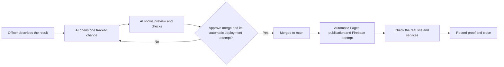

# Officer Website Handbook

**Audience:** MPRC officers and backup maintainers with little or no coding experience
**Last checked:** 2026-07-12
**Start page:** [OFFICER_START_HERE.md](../../OFFICER_START_HERE.md)

The safe pattern is always the same:

In words: ask and preview first; approving a merge also authorizes today's automatic deployment attempt; then check the real result on every affected service.

## Short guides

1. [Request a change](./REQUEST_A_CHANGE.md)
2. [Update public content](./UPDATE_PUBLIC_CONTENT.md)
3. [Events, shop, members, and money](./EVENTS_SHOP_MEMBERS.md)
4. [Publish and check](./PUBLISH_AND_CHECK.md)
5. [Emergency and recovery](./EMERGENCY_AND_RECOVERY.md)
6. [Access continuity](./ACCESS_CONTINUITY.md)
7. [Simple system maps](./SYSTEM_MAPS.md)
8. [Plain-language glossary](./GLOSSARY.md)

## Five rules

1. Describe the result. Do not guess which file or service to edit.
2. Ask for a preview. Do not approve a change you cannot see.
3. Approve one step at a time. A `main` merge automatically publishes GitHub Pages today; live Netlify and Firebase still need separate proof.
4. Check the real website or service. A green check is not the same as “live.”
5. Stop when money, private data, account access, legal wording, or security is involved.

## Words every delivery report must use

| Status | What it proves |
| --- | --- |
| Drafted | A change exists only in a working copy. |
| Tests passed | Automated checks passed for the named change. |
| Merged | GitHub accepted the code into `main`. |
| Pages published | GitHub automatically built its website copy after merge. |
| Netlify commit verified | The live host identifies the intended merged commit. |
| Website verified | The exact result was seen on `runmprc.com`. |
| Firebase deployed | The backend deployment actually ran; it did not skip. |
| Provider verified | Stripe, Netlify, DNS, Google, or another outside service was checked directly. |

Never shorten several of these states to “done.”

Independent officer publishing to the live Netlify host is **NOT AVAILABLE YET**. Use a platform maintainer until the Netlify connection and rollback path are documented and tested.

## Current safety warning

The repository contains race, shop, registration, payment, refund, and admin work that is **not approved for live commerce**. Do not enter live Stripe keys or accept real payments until the launch blockers in the root security documents are closed and officers approve a controlled launch.
