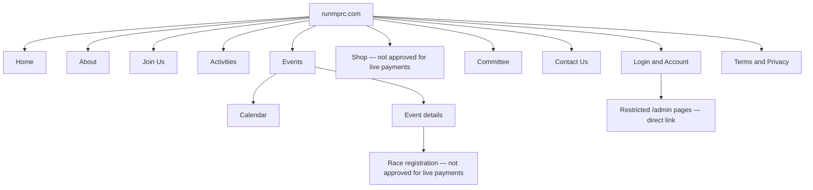
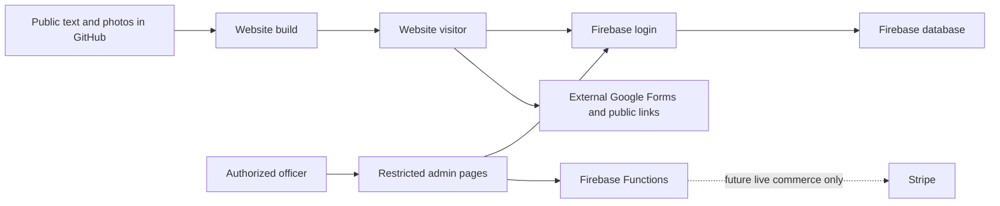
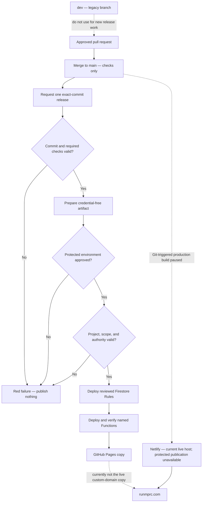
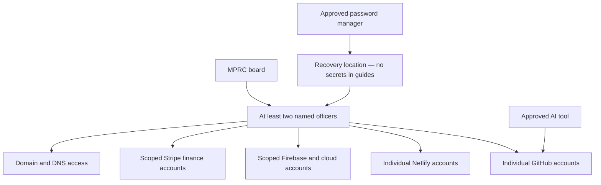
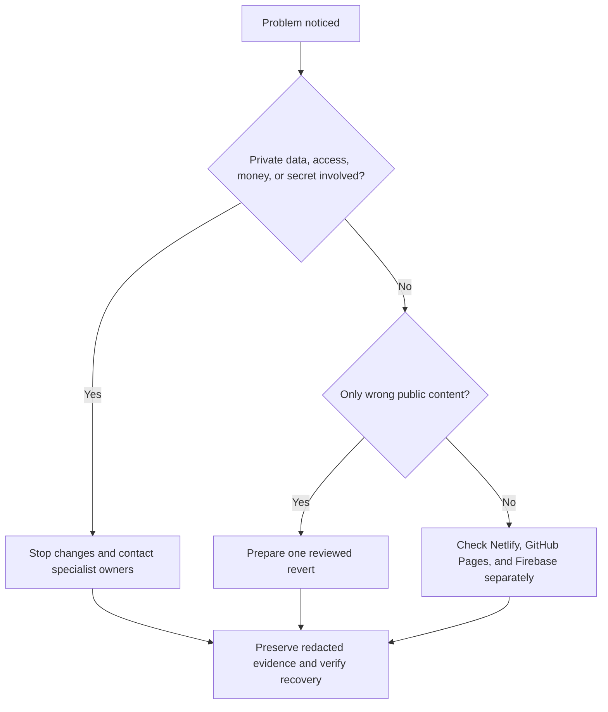

# Simple System Maps

These diagrams show where pages, information, and deployments go. Each diagram includes a one-sentence text version.

## Public page map

In words: public information, account/admin pages, and unfinished commerce screens share one website; seeing a screen does not mean it is approved for live use.

## Where information lives

In words: public content comes from GitHub; private accounts and operational records use Firebase; Google Forms are separate; Stripe must remain test-only until approved.

## How a change reaches people through the protected gate

In words: merge, release request, and protected approval are separate; a missing or failed Firebase gate publishes nothing; the Pages copy and live Netlify site still need separate proof.

## Account and permission ownership

In words: people use their own accounts, at least two officers cover every service, and recovery information stays in the approved password manager rather than the repository or AI.

## Emergency decision

In words: stop and escalate anything involving privacy, access, money, or secrets; otherwise use one reviewed rollback and check every affected service.
