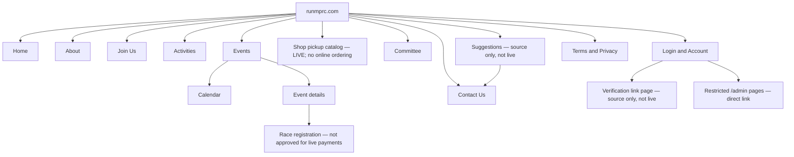
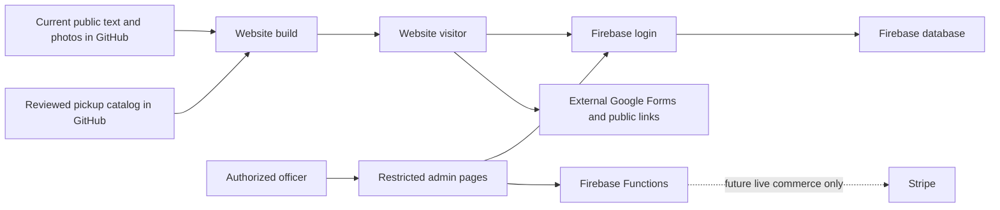
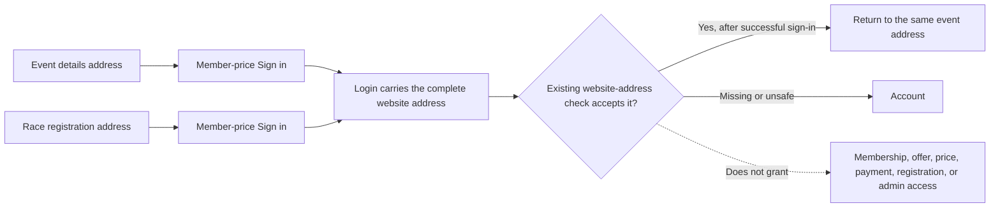
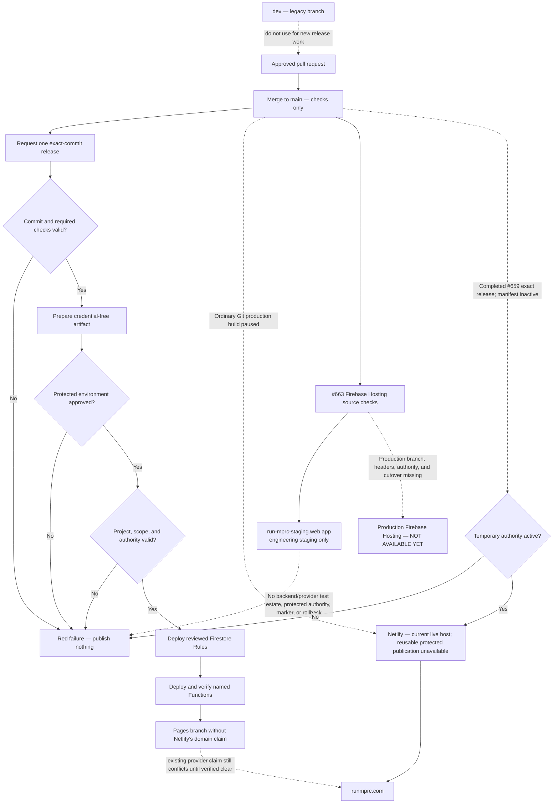
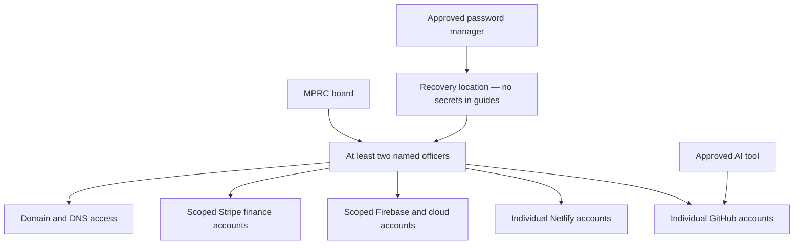
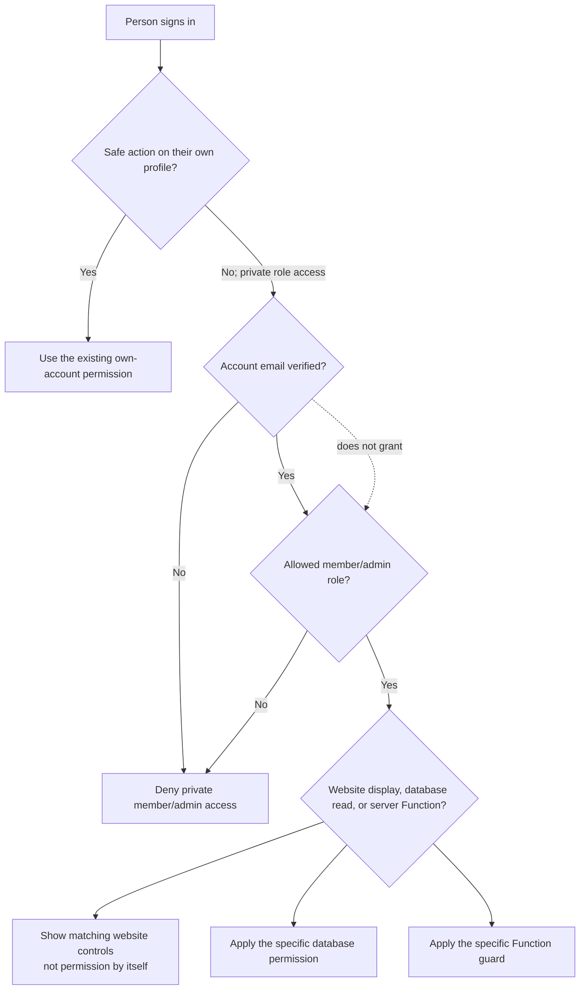
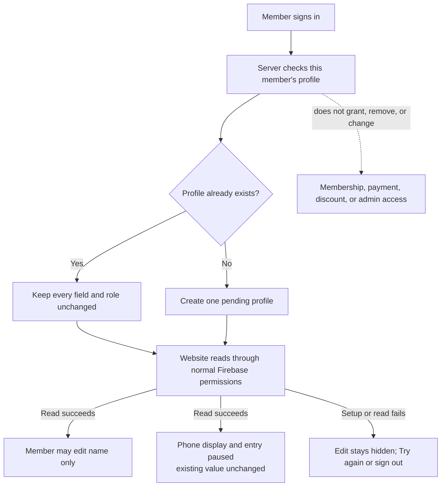
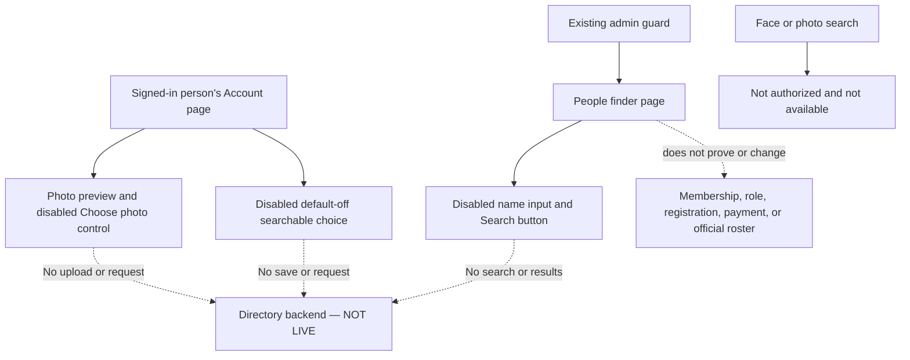
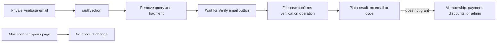
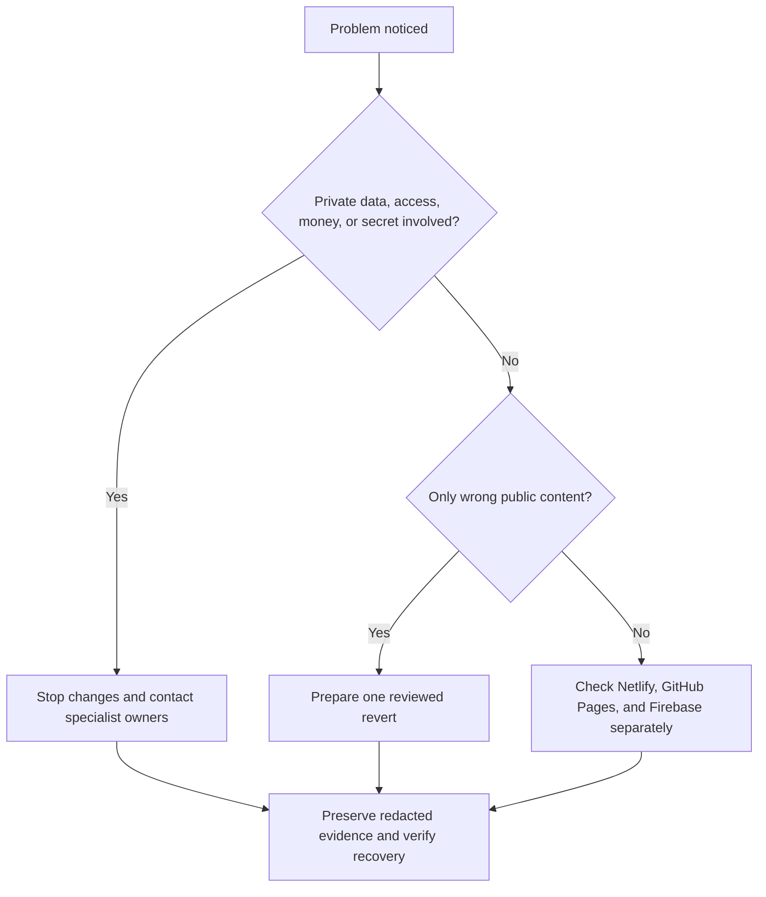

# Simple System Maps

These diagrams show where pages, information, and deployments go. Each diagram includes a one-sentence text version.

## Public page map

```mermaid
flowchart TD
    Site["runmprc.com"] --> Home["Home"]
    Site --> About["About"]
    Site --> Join["Join Us"]
    Site --> Activities["Activities"]
    Site --> Events["Events"]
    Events --> Calendar["Calendar"]
    Events --> Event["Event details"]
    Event --> Registration["Race registration — not approved for live payments"]
    Site --> Shop["Shop pickup catalog — LIVE; no online ordering"]
    Site --> Committee["Committee"]
    Site --> Contact["Contact Us"]
    Site --> Suggestions["Suggestions — source only, not live"]
    Suggestions --> Contact
    Site --> Account["Login and Account"]
    Account --> AuthAction["Verification link page — source only, not live"]
    Site --> Legal["Terms and Privacy"]
    Account --> Admin["Restricted /admin pages — direct link"]
```

In words: public information, account/admin pages, and unfinished commerce
screens share one website; in source only, Suggestions is a public information
page with no form or suggestion record, opens the existing Contact page, and
treats any later email as a separate existing channel, while the live Shop
pickup catalog creates no order or payment and seeing any screen does not mean
it is approved for live commerce.

## Where information lives

```mermaid
flowchart LR
    Public["Current public text and photos in GitHub"] --> Build["Website build"]
    Pickup["Reviewed pickup catalog in GitHub"] --> Build
    Build --> Visitor["Website visitor"]
    Officer["Authorized officer"] --> Admin["Restricted admin pages"]
    Visitor --> Auth["Firebase login"]
    Admin --> Auth
    Auth --> Data["Firebase database"]
    Admin --> Functions["Firebase Functions"]
    Visitor --> Forms["External Google Forms and public links"]
    Functions -. "future live commerce only" .-> Stripe["Stripe"]
```

In words: current public content comes from GitHub; the display-only pickup
catalog is live and creates no operational record, private accounts and other operational
records use Firebase, Google Forms are separate, and Stripe must remain
test-only until approved.

## Event sign-in return — SOURCE ONLY, NOT LIVE

```mermaid
flowchart LR
    Detail["Event details address"] --> DetailLink["Member-price Sign in"]
    Register["Race registration address"] --> RegisterLink["Member-price Sign in"]
    DetailLink --> Login["Login carries the complete website address"]
    RegisterLink --> Login
    Login --> Check{"Existing website-address check accepts it?"}
    Check -- "Yes, after successful sign-in" --> Return["Return to the same event address"]
    Check -- "Missing or unsafe" --> Account["Account"]
    Check -. "Does not grant" .-> Authority["Membership, offer, price, payment, registration, or admin access"]
```

In words: the source-only member-price links carry the complete Event details or Race registration address through Login during the current browser visit, return there after successful sign-in only when the existing website-address check accepts it, use Account when it is missing or unsafe, and grant no club or financial authority.

## How a change reaches people through the protected gate

```mermaid
flowchart TD
    PR["Approved pull request"] --> Main["Merge to main — checks only"]
    Main --> Request["Request one exact-commit release"]
    Request --> Preflight{"Commit and required checks valid?"}
    Preflight -- "No" --> Stop["Red failure — publish nothing"]
    Preflight -- "Yes" --> Prepare["Prepare credential-free artifact"]
    Prepare --> Approval{"Protected environment approved?"}
    Approval -- "No" --> Stop
    Approval -- "Yes" --> Gate{"Project, scope, and authority valid?"}
    Gate -- "No" --> Stop
    Gate -- "Yes" --> Rules["Deploy reviewed Firestore Rules"]
    Rules --> Functions["Deploy and verify named Functions"]
    Functions --> Pages["Pages branch without Netlify's domain claim"]
    Main -. "Ordinary Git production build paused" .-> Netlify
    Main --> HostingSource["#663 Firebase Hosting source checks"]
    HostingSource --> StagingHosting["run-mprc-staging.web.app\nengineering staging only"]
    StagingHosting -. "No backend/provider test estate, protected authority, marker, or rollback" .-> Stop
    HostingSource -. "Production branch, headers, authority, and cutover missing" .-> FutureHosting["Production Firebase Hosting — NOT AVAILABLE YET"]
    Main -. "Completed #659 exact release; manifest inactive" .-> WebGate{"Temporary authority active?"}
    WebGate -- "No" --> Stop
    WebGate -- "Yes" --> Netlify
    Netlify["Netlify — current live host; reusable protected publication unavailable"] --> Live["runmprc.com"]
    Pages -. "existing provider claim still conflicts until verified clear" .-> Live
    Dev["dev — legacy branch"] -. "do not use for new release work" .-> PR
```

In words: merge, release request, and protected approval are separate; #663 supplies the build checks and #665 publishes only the club-owned signed-out engineering staging site; that staging site cannot release production or authorize backend/provider testing. Ordinary merges cannot publish Netlify and the completed #659 exception is inactive; its deploy `6a7ece87c5ca4d0007c1a3fc` remains live while completed #623 deploy `6a7e072f8f346b0008510d29` is the immediate rollback and completed #473 deploy `6a6dc9ea588b0c0008036312` is older history; the future Pages branch must stop claiming the Netlify domain, and every host still needs separate proof.

## Account and permission ownership

```mermaid
flowchart TD
    Board["MPRC board"] --> People["At least two named officers"]
    People --> GitHub["Individual GitHub accounts"]
    People --> Netlify["Individual Netlify accounts"]
    People --> Cloud["Scoped Firebase and cloud accounts"]
    People --> Finance["Scoped Stripe finance accounts"]
    People --> Domain["Domain and DNS access"]
    Vault["Approved password manager"] --> Recovery["Recovery location — no secrets in guides"]
    Recovery --> People
    AI["Approved AI tool"] --> GitHub
```

In words: people use their own accounts, at least two officers cover every service, and recovery information stays in the approved password manager rather than the repository or AI.

## Role-based Firebase access — SOURCE ONLY, NOT LIVE

```mermaid
flowchart TD
    SignIn["Person signs in"] --> Own{"Safe action on their own profile?"}
    Own -- "Yes" --> Self["Use the existing own-account permission"]
    Own -- "No; private role access" --> Verified{"Account email verified?"}
    Verified -- "No" --> Deny["Deny private member/admin access"]
    Verified -- "Yes" --> Role{"Allowed member/admin role?"}
    Role -- "No" --> Deny
    Role -- "Yes" --> Surface{"Website display, database read, or server Function?"}
    Surface --> Website["Show matching website controls\nnot permission by itself"]
    Surface --> Rules["Apply the specific database permission"]
    Surface --> Function["Apply the specific Function guard"]
    Verified -. "does not grant" .-> Role
```

In words: safe self-service is limited to the person's own signed-in account; the website shows member/admin controls only when the refreshed account token contains both verified-email proof and the already-approved role, while the database and server check those facts again because a visible control is never permission.

Issue [#196](https://github.com/Run-MPRC/Run-MPRC.github.io/issues/196) owns the database Rules source/test boundary. Issue [#209](https://github.com/Run-MPRC/Run-MPRC.github.io/issues/209) owns the matching current server-Function boundary for admin actions, member checkout treatment, and registration export. Issue [#213](https://github.com/Run-MPRC/Run-MPRC.github.io/issues/213) owns the website display match. All are **NOT LIVE** until the exact Rules and Functions revisions are deployed backend-first, the exact website is published to protected staging second, and the complete made-up-account matrix passes. An officer must not edit a profile, toggle a role, open real member data, or use a real account as a workaround or test. Registration export still needs separate purpose, minimum-column, recent-auth, audit, and limit work under [#116](https://github.com/Run-MPRC/Run-MPRC.github.io/issues/116).

## Member profile setup and recovery — NOT LIVE YET

```mermaid
flowchart TD
    SignIn["Member signs in"] --> Ensure["Server checks this member's profile"]
    Ensure --> Existing{"Profile already exists?"}
    Existing -- "Yes" --> Preserve["Keep every field and role unchanged"]
    Existing -- "No" --> Pending["Create one pending profile"]
    Preserve --> Read["Website reads through normal Firebase permissions"]
    Pending --> Read
    Read -- "Read succeeds" --> Edit["Member may edit name only"]
    Read -- "Read succeeds" --> Phone["Phone display and entry paused\nexisting value unchanged"]
    Read -- "Setup or read fails" --> Safe["Edit stays hidden; Try again or sign out"]
    Ensure -. "does not grant, remove, or change" .-> Access["Membership, payment, discount, or admin access"]
```

In words: a signed-in member gets their existing profile unchanged or one new pending profile; the website permits only name editing after the normal permission check succeeds, while phone display and entry stay paused without changing an existing stored value. The repair does not change actual access. If displayed profile status and actual access disagree, stop and escalate.

Issue [#118](https://github.com/Run-MPRC/Run-MPRC.github.io/issues/118) owns this repair, and [#178](https://github.com/Run-MPRC/Run-MPRC.github.io/issues/178) owns the temporary phone-collection pause. Source code and local tests do not make either live. The website, server Function, database permissions, and made-up live check must each be proven separately.

## Optional profile photo and officer People finder — INERT FRONTEND PREVIEW LIVE; BACKEND NOT LIVE

```mermaid
flowchart TD
    Account["Signed-in person's Account page"] --> Photo["Photo preview and disabled Choose photo control"]
    Account --> Choice["Disabled default-off searchable choice"]
    Admin["Existing admin guard"] --> Finder["People finder page"]
    Finder --> Input["Disabled name input and Search button"]
    Photo -. "No upload or request" .-> Backend["Directory backend — NOT LIVE"]
    Choice -. "No save or request" .-> Backend
    Input -. "No search or results" .-> Backend
    Face["Face or photo search"] --> Never["Not authorized and not available"]
    Finder -. "does not prove or change" .-> Records["Membership, role, registration, payment, or official roster"]
```

In words: the live artifact contains the inert photo, searchable-setting, and People finder layouts, but every new control is disabled, no directory request or result is possible, and the backend is not live. Synthetic tests prove the protected Account and administrator layouts; production proof stayed signed out and confirmed only the normal guards and absence of a directory request. Face or photo search is neither authorized nor available, and seeing the interface proves no membership or authority.

Issue [#623](https://github.com/Run-MPRC/Run-MPRC.github.io/issues/623) published only this bounded inert interface. Connected source from [#505](https://github.com/Run-MPRC/Run-MPRC.github.io/issues/505) and [#506](https://github.com/Run-MPRC/Run-MPRC.github.io/issues/506) was deliberately excluded from the production artifact. Issue [#507](https://github.com/Run-MPRC/Run-MPRC.github.io/issues/507) still owns privacy approval, backend-first release, website publication of connected behavior, and live proof. No issue authorizes a photo query, facial recognition, similarity matching, or biometric processing. Do not use real names or photos to test the inert preview.

## Verification email action — SOURCE ONLY, NOT LIVE

```mermaid
flowchart LR
    Email["Private Firebase email"] --> Page["/auth/action"]
    Page --> Remove["Remove query and fragment"]
    Remove --> Button["Wait for Verify email button"]
    Scanner["Mail scanner opens page"] --> NoChange["No account change"]
    Button --> Firebase["Firebase confirms verification operation"]
    Firebase --> Plain["Plain result; no email or code"]
    Plain -. "does not grant" .-> Access["Membership, payment, discounts, or admin"]
```

In words: the source page removes the private code, waits for the member to choose one button, and shows a plain result; simply opening the page does nothing and verification never grants club access.

Issue [#194](https://github.com/Run-MPRC/Run-MPRC.github.io/issues/194) owns only the verification path. Firebase's single custom handler also receives password-reset and email-recovery links, so [#119](https://github.com/Run-MPRC/Run-MPRC.github.io/issues/119) must keep the default handler or wait for safe coverage of every mode before enabling this route. Website, provider, and live behavior remain separate proof.

## Emergency decision

```mermaid
flowchart TD
    Problem["Problem noticed"] --> Private{"Private data, access, money, or secret involved?"}
    Private -- "Yes" --> Stop["Stop changes and contact specialist owners"]
    Private -- "No" --> Public{"Only wrong public content?"}
    Public -- "Yes" --> Revert["Prepare one reviewed revert"]
    Public -- "No" --> Host["Check Netlify, GitHub Pages, and Firebase separately"]
    Stop --> Verify["Preserve redacted evidence and verify recovery"]
    Revert --> Verify
    Host --> Verify
```

In words: stop and escalate anything involving privacy, access, money, or secrets; otherwise use one reviewed rollback and check every affected service.
