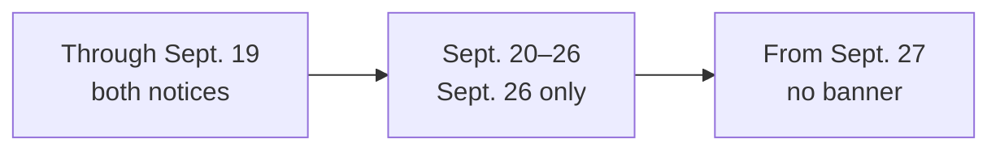

# Update Public Text, Links, Photos, or Officers

**Use this when:** the change is public information and does not affect money, private data, access, legal wording, or security.
**Approver:** communications lead or the officer who owns the page.

**Before you start:** have exact approved wording, a public link, or an approved photo; know the page and intended date.
**Expected result:** one reviewed public-content change with no account, data, payment, policy, or security effect.

## Text

1. Copy the current sentence from the live page.
2. Write the replacement sentence.
3. Name the page and heading where it appears.
4. Ask AI to update every matching public description, including search text when relevant.
5. Review the preview on a phone-sized view.
6. Review the preview on a normal computer view.
7. Confirm no price, date, address, or policy changed by accident.

Helpful request:

> On the MPRC **[page]**, replace **[old text]** with **[approved new text]**. Keep the rest of the page unchanged and show me the page preview before publishing.

## Public links and Google Forms

1. Open the new link in a private/incognito window.
2. Confirm it is a public viewing or submission link.
3. Never send an edit link, owner link, or link containing a private token.
4. Give AI the old public link and the new public link.
5. Ask AI to find every visible place using the old link.
6. Test each changed button from the preview.

## Suggestions page no-form preview — SOURCE ONLY, NOT LIVE

**Purpose:** confirm that the Suggestions source shows only approved public
information and opens the existing Contact page without adding an intake form.
This procedure checks display of approved wording. It does not approve or change
privacy or security policy.

**Approver:** communications lead and privacy/security owner.

**Before you start:** have the exact #618 pull request and preview link, plus the
approved Suggestions wording. Stay signed out. Use phone and computer widths.
Use no real suggestion, security evidence, or private information. Do not
activate the email control on Contact.

1. Open the exact `/suggestions` preview while signed out at a phone-sized width.
2. Confirm that the address ends in `/suggestions`.
3. Confirm that the page has one **Suggestions** heading.
4. Confirm that the browser title identifies Suggestions.
5. Compare the safety wording with the approved text.
6. Confirm that the page says it has no suggestion form and submits no idea.
7. Confirm that the email-retention disclosure identifies Contact as a separate existing channel.
8. Confirm that the page promises no anonymity, confidentiality, reply, or implementation.
9. Confirm that there is no textbox, upload, submit button, vote, or public idea list.
10. Use Tab to reach **Go to Contact**.
11. Confirm that focus is visible.
12. Press Enter.
13. Confirm that `/contact` opens.
14. Do not activate the email control on Contact.
15. Open the same preview at a normal computer width.
16. Use the footer **Suggestions** link.
17. Confirm that `/suggestions` opens.
18. Confirm that no content is clipped or hidden.

**Expected result:** the source preview shows fixed public information and one
internal Contact action only. It creates no suggestion intake. This check does
not prove that the mailbox is monitored, that an email is delivered or retained
for a defined period, that a reply occurs, or that the page is live.

**Stop conditions:** stop if the Suggestions page adds a form, external intake,
or direct email link; makes an anonymity, confidentiality, reply, or
implementation promise; requests private information or security evidence;
diverges from the current `SECURITY.md` first-contact direction; requires
sign-in; performs a provider action; opens the wrong route; hides keyboard
focus; clips content; or changes the public website unexpectedly.

**Success proof:** record the exact reviewed head, preview URL, check date,
phone and computer widths, route, heading, title, no-form checklist, keyboard
result, and pass or fail. Use redacted screenshots only.

**Undo:** reject the pull request before merge, or ask the platform maintainer
for one revert pull request after merge. No provider action or data cleanup is
needed for this source-only page.

**Escalation:** communications lead for wording; privacy/security owner for
safety language; platform owner and accessibility reviewer for route, focus, or
layout failures.

Source, tests, merge, website publication, `runmprc.com` verification,
Firebase deployment, outside-provider configuration, and production behavior
are separate states. This procedure describes #618 source and preview behavior
only. It is **NOT LIVE** until an approved exact website release is published
and the same checks pass on `runmprc.com`.

## Temporary September 2026 meeting locations — #685 WEBSITE LIVE AND VERIFIED 2026-09-14

**Purpose:** show prospective members the two temporary Saturday meeting points, then remove each notice automatically after it is no longer useful.

**Approver:** communications lead or the officer who owns Saturday-run announcements, plus the platform owner for the one-shot release.

**Before you start:** have issue [#685](https://github.com/Run-MPRC/Run-MPRC.github.io/issues/685), the approved wording below, both public map links, verified deploy `6aa8c5b3fddd040009eba99c`, and a signed-out browser. Use Pacific time. Do not sign in or enter any information.

Approved public notice:

- **Sept. 19, 8:45 AM:** meet at the restrooms next to the Seal Point dog park. Parking may be limited, so allow extra time. Use the [exact restroom pin](https://www.google.com/maps/search/?api=1&query=37.5733685%2C-122.3007770), not the site's usual Seal Point restroom pin.
- **Sept. 26, 8:45 AM:** meet at [The Kite School in Baywinds Park](https://maps.app.goo.gl/eWoXjkF2Brt8ujh88), 30 Lakeside Drive, Foster City, for the run and social. Gather on the artificial turf south of the restrooms, toward the San Mateo Bridge.

In words: both notices show through the end of Sept. 19 Pacific time; only the Sept. 26 notice shows from Sept. 20 through Sept. 26; the whole banner is gone from Sept. 27.

1. Open the exact pinned preview while signed out at 390×844.
2. Confirm the red banner begins below the blue navigation and does not cover the page heading.
3. Compare every date, time, landmark, city, parking note, social note, and map link with the approved notice.
4. Open each map. Confirm Sept. 19 points to the dog-park-adjacent south restroom and Sept. 26 points to The Kite School at Baywinds Park in Foster City.
5. Confirm no private address, member information, account control, registration, payment, or form appears.
6. Confirm there is no horizontal overflow and all link text remains readable.
7. Repeat steps 2–6 at 1280×900.
8. Review the automated tests showing both notices before Sept. 20, only Sept. 26 afterward, Sept. 26 through the end of that Saturday, and no banner from Sept. 27.
9. After publication, repeat the same checks on `runmprc.com` and verify the release marker identifies #685's exact frozen artifact.
10. Confirm the release is immediately re-paused and its follow-up attempt publishes nothing.

**Expected result:** prospective members see the correct temporary place and time without signing in. The page stays usable at phone and computer sizes. Stale text disappears automatically on the documented Pacific-time boundaries.

**Stop conditions:** stop if a date, time, city, landmark, link, parking note, social note, or expiry is wrong; the ordinary Seal Point pin is used; text is clipped or hidden; the page requires sign-in; unrelated content changed; or the marker does not identify the exact reviewed artifact.

**Success proof:** release PR #686 preview `6aa8c3e0e5faba00080fd632` matched head `f0c2d2378fd30b684ecb2fede447a184a414ab1c` and passed all five jobs in run `34927419640`. Exact merge `d25b0fe497e0179d62c060a2df3e3a7a9a2c68c6` published deploy `6aa8c5b3fddd040009eba99c` at `2026-09-15T04:13:59.373Z`. The public marker and all 62 files matched source `41a9ae4ebc719212df610ff5cdcf9ca4eab18e71`, tree `7f75ebda7b9d295c5be26acc11b06b452dcc20c6`, rollback deploy `6a7ece87c5ca4d0007c1a3fc`, and digest `cb4eba76c65c3501b37f9a0ad3cf00b6eefbc5a9c2e653f2b3c03607cfe64850`. Signed-out 390×844 and 1280×900 checks passed for both exact map destinations, banner and page-heading visibility, and no horizontal overflow; no screenshot was retained. Repause PR #687 and merge `609d7884e0242abce23449562e7e0da04794da1e` passed all checks. Attempt `6aa8c78dd7b9d1000952eaa2` errored unpublished with `published_at` null and retained the verified deploy. The manifest is inactive, temporary #685 refs are absent, and its rollback ref remains. A green workflow alone is not website proof.

**Undo:** before publication, reject the pull request. After publication, ask the platform owner to restore the recorded #659 deploy or use the reviewed rollback projection. Do not remove the banner by editing production directly; the automatic cutoff is the normal content undo.

**Escalation:** communications owner for wording or meeting-place questions; platform owner for layout, expiry, release, marker, or rollback; security owner for any unexpected account, private-data, or provider behavior.

#685's website work is complete. Production is deploy `6aa8c5b3fddd040009eba99c`; #659 deploy `6a7ece87c5ca4d0007c1a3fc` and source `7496fe0881fb52908c4ff2f40f488df09c94c908` are immediate rollback, while #623 and #473 are older history. Both notices show through Sept. 19, only Sept. 26 shows from Sept. 20 through Sept. 26, and the banner is absent from Sept. 27 Pacific time. Email was already sent Sept. 12. WhatsApp remains pending the user's action-time confirmation, so issue #685 remains open.

Remote readback on 2026-09-14 also found the old #473, #623, and #659 hot source refs still present, superseding older absent/retired wording. Their inactive manifests keep ordinary merges paused, but the manual-rebuild residual still needs a separate approved cleanup after rollback refs are confirmed.

## Photos

1. Get permission to publish the photo.
2. Confirm the correct name and role of each person shown.
3. Use a clear JPG or PNG; a square photo works best for officers.
4. Remove private location or device information when possible.
5. Tell AI where the photo should appear. Provide a short description for screen readers unless the photo is only decorative.
6. Review the crop on phone and computer views.
7. Confirm the page title and first line of content begin below the blue navigation bar.

Do not publish photos of minors, private events, name badges, addresses, license plates, or private screens without specific approval.

## Officer list

1. Obtain the approved officer name, title, display order, and photo permission.
2. State the date the change should take effect.
3. Ask AI to update the visible list and search-engine description together.
4. Check spelling, title, photo, order, and old-officer removal.
5. Ask AI to confirm no account permissions changed. Website display and GitHub/Firebase access are separate.

## Phone navigation check — #659 LIVE AND VERIFIED 2026-08-14

**Purpose:** confirm that the small-screen menu is predictable before a website release.

**Approver:** communications lead or platform owner.

**Before you start:** stay signed out and use no private information. WEB-002D [#659](https://github.com/Run-MPRC/Run-MPRC.github.io/issues/659) completed one exact-artifact release of the reviewed #490 phone-menu behavior with the related visible-focus and route-focus source. Production deploy `6a7ece87c5ca4d0007c1a3fc` passed the signed-out phone menu and route-focus check. #623 deploy `6a7e072f8f346b0008510d29` is the rollback target.

1. Open the preview at a phone-sized width.
2. Select the MPRC logo while the menu is closed.
3. Confirm Home opens and the menu stays closed.
4. Open the menu with its button.
5. Select one public page and confirm the menu closes.
6. Reopen the menu and select Sign in.
7. Confirm the Sign in page opens and the menu closes.
8. Use Tab and Enter to repeat the open, close, and public-page check.
9. Open the preview at a normal computer width.
10. Confirm the navigation links remain visible and work normally.

**Expected result:** only the menu button opens the menu; the logo or any destination closes it after opening the correct page.

**Stop conditions:** stop if a destination is wrong, the logo opens the menu, the menu stays open after a choice, keyboard use fails, or computer navigation changes.

**Success proof:** record the preview link, check date, phone and computer widths, tested destination, keyboard result, and pass or fail. Keep accounts and private information out of screenshots.

**Undo:** ask the platform maintainer for one revert pull request. Do not publish a second fix at the same time.

**Escalation:** platform owner first; accessibility reviewer second.

The completed #659 signed-out live check used safe public destinations only. At phone width, the menu exposed truthful open disclosure state; choosing `/events` closed it, moved focus to main content at the top, and caused no horizontal overflow. Exact served source, CSS, and mutation-sensitive tests preserve the bounded visible-focus cue; this audit does not claim a saved screenshot or a separate live keyboard `:focus-visible` observation. On production, do not choose Sign in, enter data, open a private page, or submit a form. Repause attempt `6a7ed0ddb00a46000818878d` published nothing and retained deploy `6a7ece87c5ca4d0007c1a3fc`. Follow the full no-terminal record in [Review, merge, release, and check a change](./PUBLISH_AND_CHECK.md).

## Success check

- The exact change appears on `runmprc.com`.
- Every new link opens correctly without requiring editor access.
- Photos have correct names and descriptions, or are correctly marked decorative.
- Each intended page shows its header photo, and no page text is hidden behind the navigation bar.
- No unrelated page changed.
- The delivery report separates “merged” from “verified live.”

## Stop here instead

Use [Events, shop, members, and money](./EVENTS_SHOP_MEMBERS.md) if the change mentions a signup, price, waiver, member benefit, discount, race, product, order, refund, or private page.

## Undo

Ask the platform maintainer for one revert pull request. Do not edit `main`, delete content records, change DNS, or bundle a second change into the rollback.

## Escalation

- Wording, public link, or approved photo: communications lead.
- Officer name/title: club president or secretary plus communications lead.
- Unexpected layout, deployment, or live-site mismatch: platform owner plus backup.
- Any money, policy, access, privacy, or security effect: stop and use the specialist guide linked above.
